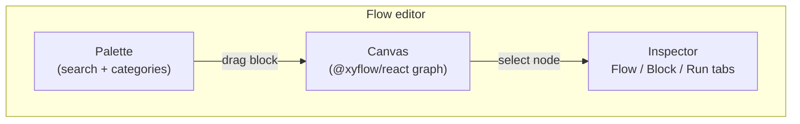
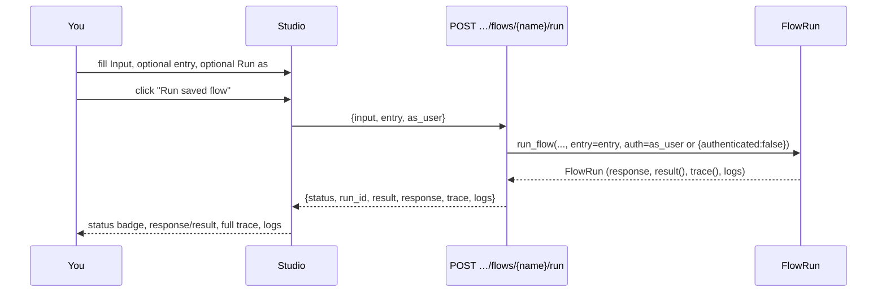

Studio's flow editor is not a diagram generated from your flow's JSON — it *is* your flow's JSON, rendered live. The canvas is an [`@xyflow/react`](https://reactflow.dev) (React Flow) graph whose nodes and edges map one-to-one onto `definition.nodes` and `definition.edges`; there's no translation step, no "export to see the real shape." What you drag, connect, and configure on screen is exactly what gets saved and exactly what the engine walks when the flow runs.

<Note>
Everything described here reads from the same source the rest of this documentation does: `services/studio/frontend/src/pages/Flows/Editor.jsx`. If a detail here and the app ever disagree, the app is right — but they shouldn't, because this page is a direct description of that component.
</Note>

## Layout

The editor is a three-pane shell: a **palette** on the left, the **canvas** in the middle, and an **inspector** on the right, tabbed between three panels.



A floating toolbar sits over the top-left and top-right of the canvas itself: the flow's name and status badges on the left, **Validate**, **Test run**, and **Save** buttons on the right. It stays visible while you pan and zoom the graph underneath it.

## The palette

The palette lists every block the process knows about — fetched once as the **block catalogue** (`GET /blocks`, which calls `default_registry().catalogue()` and returns each block's `describe()`: key, title, category, description, config schema, handles, and whether it's a trigger). Nothing about the palette is hand-maintained; add a block to the registry and it appears in every project's palette automatically.

### Search

A single search box filters across a block's key, title *and* description simultaneously — searching "email" surfaces `mail.send` even though "email" isn't in its key. The filter is case-insensitive and live as you type.

### Category grouping

Blocks are grouped by their `category` and sorted into a fixed, deliberate order — triggers first, then the blocks you reach for most while sketching a flow's shape, then more specialized ones:

```
triggers → control → resources → responses → auth → data →
code → events → jobs → mail → storage → realtime → cache →
integrations → observability
```

Within a category, blocks are sorted alphabetically by key. Each palette entry shows the block's **title** in bold and its one-line **description** underneath.

### Adding a block to the canvas

Two ways, both wired to the same `addBlock(key, position)`:

<Tabs>
  <Tab title="Drag and drop">
    Drag a palette item onto the canvas. The block is dropped at the exact point you release it (`flowApi.screenToFlowPosition` converts screen coordinates to canvas coordinates).
  </Tab>
  <Tab title="Double-click">
    Double-click a palette item to add it without dragging. It's placed at a computed default position that staggers each new node diagonally from the last (`80 + nodes.length * 30, 80 + nodes.length * 60`).
  </Tab>
</Tabs>

Either way, adding a block:

1. Generates a unique node id from the block's key — the last dot-segment of the key, made canvas-safe. `resource.get` becomes `get`; if `get` is already taken, `get2`, then `get3` (`uniqueId`).
2. Pre-fills `config` with every field that declares a `default` in the block's schema.
3. Selects the new node and switches the inspector to the **Block** tab.

## The canvas

The canvas itself is a standard React Flow surface with a dotted background, pan/zoom controls, and a minimap rendered in the app's lavender palette (`#cfc4fa` nodes over a translucent mask). Every node on the canvas is rendered by a single custom node type, `block`.

### Reading a node on the canvas

Each node shows:

- **Title** — the block's `data.label` if you've set one, otherwise the block's catalogue `title`.
- **Node id**, in small monospace type beside the title — this is the exact string other blocks reference as `steps.<id>.output`.
- **A config summary** — the first two configured keys, rendered as `key: value`, joined with " · ".
- **Handles**, as small labeled dots along the bottom edge, one per output the block can produce, evenly spaced. Every non-trigger node gets an extra `error` handle appended automatically if the block didn't already declare one, styled in the danger color.
- **A target handle** on top, present on every node except triggers.

Trigger nodes render with a distinct visual treatment (a `trigger` class modifier) so the entry points of a graph are recognizable at a glance.

### Handles for blocks with dynamic outputs

`control.switch` declares `handles: ["*"]` in its schema — a wildcard meaning "the actual handles depend on this block's own configuration." The canvas resolves this live: if the node's `cases` config is an array, one handle is rendered per case value plus a trailing `default`; if `cases` is an object, one handle per key plus `default`.

### Connecting nodes

Drag from a source node's handle to a target node's top handle to create an edge. The edge's `sourceHandle` is set to whichever handle you dragged from; if you drop onto a node from the default output position, `sourceHandle` is simply omitted when saved.

Edges are styled by handle: an `each` edge (out of `control.foreach`) is drawn **animated**; an `error` edge is drawn in the danger color; every other handle whose name isn't `next` gets a small text label on the edge itself.

### Deleting

Select a node or edge and press **Backspace** or **Delete**. Deleting a node also removes every edge attached to it; deleting an edge removes just that connection.

## The inspector: three tabs

| Tab | Shown when | Contains |
| --- | --- | --- |
| **Flow** | Always available | Flow-level settings: name, description, timeout, enabled, record runs, validation problems |
| **Block** | A node is selected | That node's id, label, and full configuration form |
| **Run** | The flow has been saved at least once | The test-run panel: input, entry, auth, trace |

### The Flow tab

<Steps>
  <Step title="Name">
    Editable only while creating a new flow (`isNew`); once saved, the name field is disabled, because it's referenced from routes, `queue.flow` targets, and Studio URLs.
  </Step>
  <Step title="Description">
    Free text.
  </Step>
  <Step title="Timeout (seconds)">
    A number input, 1–900, matching the flow's `timeout` field. Exceeding it during a run raises a `504 timeout`.
  </Step>
  <Step title="Enabled">
    A checkbox. Unchecking it makes every trigger refuse with `409 flow '<name>' is disabled` instead of running — a fast way to pause automation without losing the definition.
  </Step>
  <Step title="Record runs (with traces)">
    A checkbox, on by default. When checked, every execution is written to `flow_runs` with its full input, output, trace and logs. Turn it off only for extremely high-frequency flows where you don't need per-run history.
  </Step>
  <Step title="Validation problems">
    If the last **Validate** click found problems, they're listed here as a red alert box, one bullet per problem.
  </Step>
</Steps>

A permanent hint at the bottom of this tab reminds you of two things: *every block except triggers has an `error` handle; connect it to handle failures*, and *config values accept templates like `{{ input.email }}`, `{{ steps.lookup.output.id }}` or `{{ auth.user_id }}`*.

### The Block tab (node inspector)

Selecting a node switches here automatically. It shows, top to bottom:

1. The block's title and key, and its full description.
2. Node id, editable. Renaming a node rewrites the node's `id` *and* every edge's `source`/`target` that pointed at the old id.
3. Label, an optional friendlier display name shown on the canvas.
4. One form field per configuration key, generated entirely from the block's declared `config` schema.
5. Last run, shown only after a test run whose trace includes this node.
6. Remove block, a destructive action that deletes the node and every edge touching it.

#### Configuration field types in the inspector

Studio never hand-codes a form per block. Every block declares its configuration as a list of field specs, and the inspector renders each one generically:

| Spec shape | Rendered as |
| --- | --- |
| `enum: [...]` | A `<select>` with those options |
| `type: "boolean"` | A checkbox |
| `type: "integer"` / `"number"` | A number input |
| `type: "json"` / `"object"` / `"array"`, or `widget: "condition"` | A JSON editor |
| `widget: "code"`, or `type: "text"` | A larger `<textarea>` |
| anything else | A plain single-line text input |

Required fields are marked with a small red asterisk. Clearing a field back to empty removes the key from `config` entirely rather than storing an empty string.

### The Run tab

Available once the flow has been saved at least once. This is the flow's test panel.

## Validate

The **Validate** button sends the canvas's *current, possibly unsaved* graph to `POST /flows/validate`, which runs the same `validate_flow()` the platform uses to refuse a bad save — no side effects, nothing executes. The response's `problems` array populates the Flow tab's validation alert. Use it while iterating, before you're ready to actually run anything — it catches unknown blocks, duplicate node ids, dangling edges, edges into handles a block doesn't declare, and a flow with zero trigger nodes.

## Save

**Save** serializes the canvas back into the `{nodes, edges}` shape and either `POST`s a new flow or `PUT`s an update to the existing one, along with the Flow tab's settings. Node `position` is preserved. Saving a brand-new flow navigates you to its permanent URL; saving an existing flow stays on the same page.

<Warning>
Save commits to the **current environment only**. Changes made while viewing `development` do not appear in `production` until you explicitly [promote](/operate/environments-and-promotion) them.
</Warning>

## Testing a saved flow

The **Run** tab is a complete test harness for the *saved* version of the flow, backed by `POST …/flows/{name}/run`.

<Warning>
This always executes the version currently saved to this environment — **not** whatever's unsaved on the canvas. If you've made changes you want to test, save first.
</Warning>

### Input (JSON)

A JSON editor for the trigger payload. For an HTTP-triggered flow this typically means `{"params": {...}, "body": {...}, "query": {...}}`; for an event-triggered flow, `{"event": {"name": ..., "payload": {...}}}`.

### Start from

Shown only when the flow has **more than one trigger node**. A dropdown listing every trigger in the graph by its node id. Choosing one sets the `entry` field sent to the run endpoint.

### Run as (optional auth context)

A JSON editor for an `as_user` object — for example `{"authenticated": true, "user_id": "42", "roles": ["admin"]}` — which becomes the run's `auth` state. Leaving it empty runs the flow **with service/operator rights**.

### Running it

**Run saved flow** posts `{input, entry: entry || null, as_user: asUser || null}` and disables itself while the request is in flight.

### Reading the result

<Steps>
  <Step title="Status badge">`succeeded` in green or `failed` in red, taken directly from the run response's `status`.</Step>
  <Step title="Error, if any">When the run failed, its `error` message is shown in a red alert, with the failing node's id appended (`at load`).</Step>
  <Step title="Response or result">If the flow reached a `response.return` block, its `{status, body, headers}` is shown as formatted JSON. Otherwise, the last executed step's output is shown as `result`.</Step>
  <Step title="Trace">Every recorded step, in execution order: the node id, its duration in milliseconds and the handle it returned, then either its error text or its output.</Step>
  <Step title="Logs">Any entries written by `log.write` blocks during the run.</Step>
</Steps>

Clicking a node on the canvas after a test run also updates that node's **Last run** section in the Block tab — the same step data, scoped to just that one node.



<Note>
A test run through this panel is a **real execution**. If a block writes a record, sends an email, or emits an event, that write happens. Test against a `development` environment, and be deliberate with input that would trigger a `mail.send` or `http.request` block.
</Note>

## Trace visualization in depth

The trace is the single most useful artifact the editor produces. Each entry:

| Field | Meaning |
| --- | --- |
| `node` | The node id that ran. |
| `block` | The block key it ran (`resource.get`, not the node's display label). |
| `duration_ms` | Wall-clock time this one block took, rounded to three decimals. |
| `handle` | Which output it returned. `null` if the block never returned. |
| `output` | The block's return value, truncated past 2,000 characters. |
| `error` | Present only if this step failed. |

Because the trace is ordered exactly as blocks executed — not as they're laid out on the canvas — it's also the fastest way to understand *actual* control flow in a graph with several branches.

On the canvas itself, after a test run, every node that appears in the trace is highlighted — `ran` (a subtle success tint) or `failed` (the danger tint).

## Keyboard and interaction notes

- **Backspace / Delete** removes the selected node(s) or edge(s).
- **Click empty canvas** deselects the current node and returns you to the Flow tab.
- **Drag from a handle** starts a new connection; drop it on another node to complete it, or release over empty canvas to cancel.
- **Pan** by dragging empty canvas; **zoom** with the scroll wheel.
- The canvas respects system light/dark mode and hides the React Flow attribution badge.

## Troubleshooting the editor itself

<AccordionGroup>
  <Accordion title='"Unknown block" in the Block tab'>
    You'll see this if a node's `data.block` doesn't match any key in the current environment's block catalogue — almost always because the flow references a block from a package that isn't installed in this environment, or whose entry point failed to load. Validate will also flag it.
  </Accordion>
  <Accordion title="A handle I expect isn't in the palette or on the node">
    Handles are declared per block and are fixed except for `control.switch`'s dynamic `*` handles. Every non-trigger node always gets an `error` handle appended.
  </Accordion>
  <Accordion title="Renaming a node didn't do what I expected">
    Renaming rewrites the node's `id` and every edge's `source`/`target` referencing it, but it does **not** rewrite `{{ steps.<old_id>.output }}` templates inside *other* nodes' `config`. After a rename, re-check any downstream block that reads `steps.<old_id>...`.
  </Accordion>
  <Accordion title="Test run behaves differently from the real trigger">
    Almost always an `auth` mismatch: an empty **Run as** field runs with service/operator rights, which bypasses anything a `policy.check` or `auth.require` block would enforce. Fill in an `as_user` context that matches the real caller's roles/permissions.
  </Accordion>
</AccordionGroup>

## Next

<CardGroup cols={2}>
  <Card title="Overview" icon="waypoints" href="/flows/overview">What a flow is, and a full worked example.</Card>
  <Card title="Triggers" icon="zap" href="/flows/triggers">Every trigger block, and entry-point selection.</Card>
  <Card title="Errors and retries" icon="triangle-alert" href="/flows/errors-and-retries">Reading a failed trace, and catching errors.</Card>
  <Card title="Block reference" icon="list-tree" href="/flows/block-reference">Every block's exact configuration keys.</Card>
</CardGroup>
