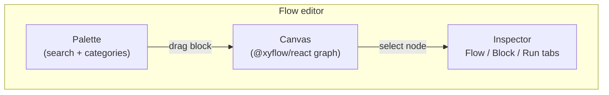
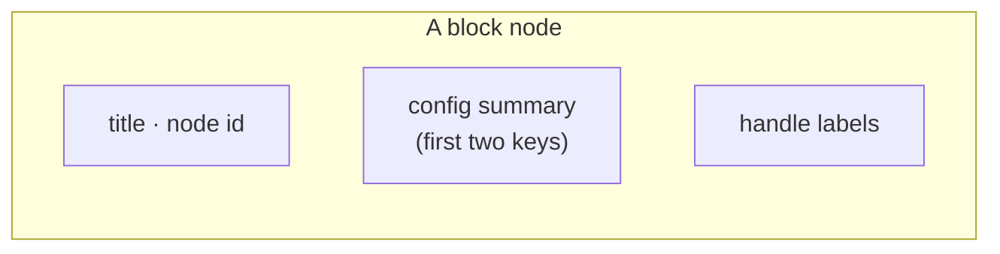
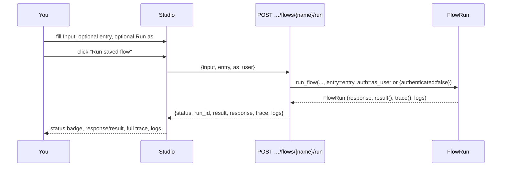

Studio's flow editor is not a diagram generated from your flow's JSON — it *is* your flow's JSON, rendered live. The canvas is an [`@xyflow/react`](https://reactflow.dev) (React Flow) graph whose nodes and edges map one-to-one onto `definition.nodes` and `definition.edges`; there's no translation step, no "export to see the real shape." What you drag, connect, and configure on screen is exactly what gets saved and exactly what the engine walks when the flow runs. This page walks through every part of that editor: the palette you drag blocks from, the canvas and its nodes, the inspector panels on the right, and the Run panel that lets you execute a saved flow and watch its trace.

<Note>
Everything described here reads from the same source the rest of this documentation does: `services/studio/frontend/src/pages/Flows/Editor.jsx`. If a detail here and the app ever disagree, the app is right — but they shouldn't, because this page is a direct description of that component.
</Note>

## Layout

The editor is a three-pane shell: a **palette** on the left, the **canvas** in the middle, and an **inspector** on the right, tabbed between three panels.



A floating toolbar sits over the top-left and top-right of the canvas itself: the flow's name and status badges on the left, **Validate**, **Test run**, and **Save** buttons on the right. It stays visible while you pan and zoom the graph underneath it.

## The palette

The palette lists every block the process knows about — fetched once as the **block catalogue** (`GET /blocks`, which calls `default_registry().catalogue()` and returns each block's `describe()`: key, title, category, description, config schema, handles, and whether it's a trigger). Nothing about the palette is hand-maintained; add a block to the registry (built-in, or from an installed package's `pawabase.blocks` entry point) and it appears in every project's palette automatically, with its configuration form generated from its declared `config` schema.

### Search

A single search box filters across a block's key, title *and* description simultaneously — searching "email" surfaces `mail.send` (title "Send email") even though "email" isn't in its key, and searching "loop" surfaces `control.foreach` because its description mentions running a branch "once per item." The filter is case-insensitive and live as you type.

### Category grouping

Blocks are grouped by their `category` and sorted into a fixed, deliberate order — triggers first (since every flow needs one), then the blocks you reach for most while sketching a flow's shape, then more specialized ones:

```
triggers → control → resources → responses → auth → data →
code → events → jobs → mail → storage → realtime → cache →
integrations → observability
```

Any category not in that list (from a third-party block package, say) sorts after all of these, alphabetically. Within a category, blocks are sorted alphabetically by key.

| Category | What lives there |
| --- | --- |
| `triggers` | `trigger.http`, `trigger.event`, `trigger.schedule`, `trigger.resource`, `trigger.webhook`, `trigger.realtime`, `trigger.job`, `trigger.manual` |
| `control` | `control.if`, `control.switch`, `control.foreach`, `control.set`, `control.merge`, `control.delay`, `control.stop`, `control.retry` |
| `resources` | `resource.list/get/create/update/delete`, `db.query`, `db.transaction` |
| `responses` | `response.return`, `error.raise` |
| `auth` | `auth.require`, `auth.user`, `auth.lookup`, `policy.check` |
| `data` | `transform.map`, `transform.template`, `transform.pick`, `validate.schema`, `json.parse`, `json.stringify`, `math.calculate`, `util.id`, `crypto.hash`, `time.now` |
| `code` | `function.call` |
| `events` | `event.emit` |
| `jobs` | `queue.flow`, `queue.function` |
| `mail` | `mail.send` |
| `storage` | `storage.put/read/signed_url/delete` |
| `realtime` | `realtime.publish` |
| `cache` | `cache.get/set/delete/invalidate` |
| `integrations` | `http.request`, `webhook.send`, `secret.get` |
| `observability` | `log.write`, `metric.increment` |

Each palette entry shows the block's **title** in bold and its one-line **description** underneath, in a smaller, muted font — enough to recognize a block without opening its docs.

### Adding a block to the canvas

Two ways, both wired to the same `addBlock(key, position)`:

<Tabs>
  <Tab title="Drag and drop">
    Drag a palette item onto the canvas. The block is dropped at the exact point you release it (`flowApi.screenToFlowPosition` converts the screen coordinates of the drop to canvas coordinates), so you can place it precisely relative to existing nodes.
  </Tab>
  <Tab title="Double-click">
    Double-click a palette item to add it without dragging. It's placed at a computed default position that staggers each new node diagonally from the last (`80 + nodes.length * 30, 80 + nodes.length * 60`), so a sequence of double-clicks doesn't stack every new block on top of the last one.
  </Tab>
</Tabs>

Either way, adding a block:

1. Generates a unique node id from the block's key — the last dot-segment of the key, made canvas-safe. `resource.get` becomes `get`; if `get` is already taken, `get2`, then `get3`, and so on (`uniqueId`).
2. Pre-fills `config` with every field that declares a `default` in the block's schema, so, for example, dropping `math.calculate` starts with `digits: 2` already set rather than empty.
3. Selects the new node and switches the inspector to the **Block** tab, so you can start configuring it immediately without an extra click.

## The canvas

The canvas itself is a standard React Flow surface with a dotted background, pan/zoom controls, and a minimap (rendered in the app's lavender palette, `#cfc4fa` nodes over a translucent mask) — all standard React Flow chrome, with one custom piece: every node on the canvas is rendered by a single custom node type, `block`, described below.

### Reading a node on the canvas



Each node shows:

- **Title** — the block's `data.label` if you've set one, otherwise the block's catalogue `title` (e.g. "Get record" for `resource.get`).
- **Node id**, in small monospace type beside the title — this is the exact string other blocks reference as `steps.<id>.output`.
- **A config summary** — the first two configured keys, rendered as `key: value` (objects/arrays shown as compact JSON), joined with " · ". This is a glance-level preview, not the full configuration; the full form lives in the Block tab.
- **Handles**, as small labeled dots along the bottom edge, one per output the block can produce, evenly spaced. Every non-trigger node gets an extra `error` handle appended automatically if the block didn't already declare one, styled in the danger color, so you can always choose to catch a block's exceptions even if the block's own `handles` list doesn't mention `error` — see [Errors and retries](/flows/errors-and-retries#catching-a-blocks-error-with-an-error-handle).
- **A target handle** on top, present on every node except triggers (triggers have no incoming edges by definition).

Trigger nodes render with a distinct visual treatment (a `trigger` class modifier) so the entry points of a graph are recognizable at a glance even before you check each block's category.

### Handles for blocks with dynamic outputs

`control.switch` declares `handles: ["*"]` in its schema — a wildcard meaning "the actual handles depend on this block's own configuration." The canvas resolves this live: if the node's `cases` config is an array, one handle is rendered per case value (stringified) plus a trailing `default`; if `cases` is an object, one handle per key plus `default`. Configure the switch's cases first, and its handles on the canvas update immediately to match — connect edges to `case_a`, `case_b`, `default`, whatever your cases actually are.

### Connecting nodes

Drag from a source node's handle to a target node's top handle to create an edge. The edge's `sourceHandle` is set to whichever handle you dragged from; if you drop onto a node from the default (unlabeled, `next`) output position, `sourceHandle` is simply omitted when saved, matching the convention that a bare edge means `next`.

Edges are styled by handle: an `each` edge (out of `control.foreach`, into its loop body) is drawn **animated**, so a running loop is visually distinct from a straight-through sequence; an `error` edge is drawn in the danger color; every other handle whose name isn't `next` gets a small text label on the edge itself, so branches like `true`/`false`/`missing` are readable directly on the canvas without clicking anything.

### Deleting

Select a node or edge and press **Backspace** or **Delete**. Deleting a node also removes every edge attached to it (handled explicitly in the **Block** tab's **Remove block** button, which filters both the node and any edge where it's the source or target); deleting an edge on the canvas removes just that connection.

## The inspector: three tabs

The right-hand panel is one of three tabs, chosen automatically as you work and switchable by hand:

| Tab | Shown when | Contains |
| --- | --- | --- |
| **Flow** | Always available; the default, and where clicking empty canvas returns you | Flow-level settings: name, description, timeout, enabled, record runs, and any validation problems |
| **Block** | A node is selected | That node's id, label, and full configuration form, plus its last test-run result if one exists |
| **Run** | The flow has already been saved at least once | The test-run panel: input, entry point, auth context, and the trace of the most recent run |

### The Flow tab

<Steps>
  <Step title="Name">
    Editable only while creating a new flow (`isNew`); once saved, the name field is disabled, because it's referenced from routes, `queue.flow` targets, and Studio URLs. The hint text under the field changes accordingly — "Lower-case letters, digits, `-` and `_`" while new, "The name is permanent" once saved.
  </Step>
  <Step title="Description">
    Free text.
  </Step>
  <Step title="Timeout (seconds)">
    A number input, 1–900, matching the flow's `timeout` field described on [Overview](/flows/overview#what-a-flow-is). Exceeding it during a run raises a `504 timeout`.
  </Step>
  <Step title="Enabled">
    A checkbox. Unchecking it doesn't delete or hide the flow — it makes every trigger refuse with `409 flow '<name>' is disabled` instead of running, a fast way to pause automation (a broken integration, a schedule you need to stop temporarily) without losing the definition.
  </Step>
  <Step title="Record runs (with traces)">
    A checkbox, on by default, matching `record_runs`. When checked, every execution — regardless of what triggered it — is written to `flow_runs` with its full input, output, trace and logs, queryable from Studio's **Events & runs** page. Turn it off only for extremely high-frequency flows where you're confident you don't need per-run history; you lose the audit trail and the ability to inspect any individual run's trace after the fact.
  </Step>
  <Step title="Validation problems">
    If the last **Validate** click found problems, they're listed here as a red alert box, one bullet per problem — exactly the strings `validate_flow` returns, like `"node 'load' uses unknown block 'resouce.get'"` (a typo) or `"a flow needs a trigger block"`.
  </Step>
</Steps>

A permanent hint at the bottom of this tab reminds you of two things worth having visible while you build: *every block except triggers has an `error` handle; connect it to handle failures*, and *config values accept templates like `{{ input.email }}`, `{{ steps.lookup.output.id }}` or `{{ auth.user_id }}`*.

### The Block tab (node inspector)

Selecting a node switches here automatically. It shows, top to bottom:

1. **The block's title and key** (`Get record` / `resource.get`), and its full description — not the truncated one-liner from the palette, but the block class's whole docstring.
2. **Node id**, editable. Renaming a node here doesn't just relabel it — `onRename` rewrites the node's `id` *and* every edge's `source`/`target` that pointed at the old id, so references stay consistent automatically. (It refuses to rename to an id that's already taken by another node, silently declining rather than creating a collision.)
3. **Label**, an optional friendlier display name shown on the canvas instead of the block's default title; doesn't affect `steps.<id>`.
4. **One form field per configuration key**, generated entirely from the block's declared `config` schema — see [Configuration field types](#configuration-field-types-in-the-inspector) below.
5. **Last run**, shown only after a test run whose trace includes this node: the handle it returned, its duration in milliseconds, its output, and any error — a fast way to check one block's behavior without scrolling the whole trace in the Run tab.
6. **Remove block**, a destructive action that deletes the node and every edge touching it.

#### Configuration field types in the inspector

Studio never hand-codes a form per block. Every block declares its configuration as a list of field specs (name, type, required, enum, description, and an optional `widget` hint), and the inspector renders each one generically:

| Spec shape | Rendered as |
| --- | --- |
| `enum: [...]` | A `<select>` with those options, plus a blank "—" option |
| `type: "boolean"` | A checkbox, with the field name and description inline |
| `type: "integer"` / `"number"` | A number input |
| `type: "json"` / `"object"` / `"array"`, or `widget: "condition"` | A JSON editor (multi-line, syntax-checked), hinting that string values inside may contain `{{ templates }}` |
| `widget: "code"`, or `type: "text"` | A larger `<textarea>` — used for `db.query`'s `sql` field and `mail.send`'s `text`/`html` bodies |
| anything else | A plain single-line text input |

Required fields are marked with a small red asterisk next to their label. Clearing a field back to empty removes the key from `config` entirely rather than storing an empty string — so a block's `run()` sees its own declared default (or `None`) rather than `""`, which matters for fields like `control.foreach`'s `concurrency` that have a numeric `default`.

### The Run tab

Available once the flow has been saved at least once (a brand-new, unsaved flow has nothing to run yet). This is the flow's test panel — full details in [Testing a saved flow](#testing-a-saved-flow) below.

## Validate

The **Validate** button sends the canvas's *current, possibly unsaved* graph to `POST /flows/validate`, which runs the same `validate_flow()` the platform uses to refuse a bad save — no side effects, nothing executes. The response's `problems` array populates the Flow tab's validation alert and a badge in the toolbar (`N problem(s)` in red, or `valid` in green once there are none). Use it while iterating, before you're ready to actually run anything — it catches:

- An unknown block key (usually a typo, or a block from a package that isn't installed in this environment).
- A duplicate node id.
- An edge whose `source` or `target` doesn't exist.
- An edge whose `sourceHandle` isn't one of the source block's declared handles (and isn't `error`, which is always allowed).
- A flow with zero trigger nodes.

See the exact rules in [Overview: `validate_flow`](/flows/overview#testing-a-flow-before-you-trust-it) and the full mechanics in [Errors and retries](/flows/errors-and-retries#validation-errors-vs-run-time-errors).

## Save

**Save** serializes the canvas back into the `{nodes, edges}` shape and either `POST`s a new flow or `PUT`s an update to the existing one, along with the Flow tab's settings (name, description, `enabled`, numeric `timeout`, `record_runs`). Node `position` is preserved so the canvas looks the same next time you open it; each edge is serialized with its `id`, `source`, `target`, and `sourceHandle` only when it's set to something other than `next` (keeping the stored JSON clean of redundant `sourceHandle: "next"` on every ordinary edge).

Saving a brand-new flow navigates you to its permanent URL (`/projects/<ref>/<env>/flows/<name>`) once the server confirms the name; saving an existing flow stays on the same page. The Save button is disabled while a request is already in flight and whenever the **Name** field is empty, so you can't accidentally create a nameless flow.

<Warning>
Save commits to the **current environment only**. Changes made while viewing `development` do not appear in `production` until you explicitly [promote](/operate/environments-and-promotion) them — the same rule as every other definition.
</Warning>

## Testing a saved flow

The **Run** tab is a complete test harness for the *saved* version of the flow, backed by `POST …/flows/{name}/run`.

<Warning>
This always executes the version currently saved to this environment — **not** whatever's unsaved on the canvas. If you've made changes you want to test, save first.
</Warning>

### Input (JSON)

A JSON editor for the trigger payload — whatever you'd expect `input` to be for this flow's trigger. For an HTTP-triggered flow this typically means `{"params": {...}, "body": {...}, "query": {...}}`; for an event-triggered flow, `{"event": {"name": ..., "payload": {...}}}`. See [Triggers](/flows/triggers) for the exact shape each trigger kind expects.

### Start from

Shown only when the flow has **more than one trigger node**. A dropdown listing every trigger in the graph by its node id, defaulting to "first trigger" (the engine's own default when no `entry` is specified — the first trigger node found while iterating the flow's nodes). Choosing one sets the `entry` field sent to the run endpoint, letting you test each of a multi-trigger flow's entry points independently without needing to actually fire the corresponding route, event, or schedule. [Triggers: entry point selection →](/flows/triggers#entry-point-selection-with-multiple-triggers)

### Run as (optional auth context)

A JSON editor for an `as_user` object — for example `{"authenticated": true, "user_id": "42", "roles": ["admin"]}` — which becomes the run's `auth` state, exactly as if a real caller with that identity had triggered the flow. This is how you test policy-sensitive branches (`policy.check`, `auth.require`, or a template like `{{ auth.user_id }}`) as a specific kind of user without needing a real token.

Leaving it empty runs the flow **with service/operator rights** — the same trust level a secret key or an operator request gets elsewhere in the platform (see [Policies: secret keys bypass policies](/policies/overview#secret-keys-bypass-policies)) — which is usually what you want when testing the flow's own logic rather than its access control.

### Running it

**Run saved flow** posts `{input, entry: entry || null, as_user: asUser || null}` and disables itself while the request is in flight. The hint underneath — *"Runs the saved version. Save first to test changes."* — is a direct restatement of the warning above, kept visible right where you'd click.

### Reading the result

<Steps>
  <Step title="Status badge">
    `succeeded` in green or `failed` in red, taken directly from the run response's `status`.
  </Step>
  <Step title="Error, if any">
    When the run failed, its `error` message is shown in a red alert, with the failing node's id appended (`at load`) when the engine recorded one.
  </Step>
  <Step title="Response or result">
    If the flow reached a `response.return` block, its `{status, body, headers}` is shown as formatted JSON. Otherwise, if the flow simply ran to completion without responding (a background-style flow), the last executed step's output is shown as `result` instead.
  </Step>
  <Step title="Trace">
    Every recorded step, in execution order: the node id, its duration in milliseconds and the handle it returned (`42.1 ms → true`), then either its error text in red or its output as compact JSON.
  </Step>
  <Step title="Logs">
    Any entries written by `log.write` blocks during the run, shown as raw JSON if there are any.
  </Step>
</Steps>

Clicking a node on the canvas after a test run also updates that node's **Last run** section in the Block tab — the same step data, scoped to just that one node, which is often the fastest way to check a single block's behavior without scanning the whole trace list.



<Note>
A test run through this panel is a **real execution**. If a block in the graph writes a record, sends an email, or emits an event, that write happens, that email sends, that event is published — exactly as it would for a live trigger. Test against a `development` environment, and be deliberate with input that would trigger a `mail.send` or `http.request` block if you don't want a real side effect while testing.
</Note>

## Trace visualization in depth

The trace is the single most useful artifact the editor produces, because it's the same data structure — a list of `Step` records — whether it comes from a test run, a real HTTP-triggered run, an event-triggered run, or a scheduled run. Each entry:

| Field | Meaning |
| --- | --- |
| `node` | The node id that ran. |
| `block` | The block key it ran (`resource.get`, not the node's display label). |
| `duration_ms` | Wall-clock time this one block took, rounded to three decimals. |
| `handle` | Which output it returned — the same string used to pick the next edges. `null` if the block never returned (it raised). |
| `output` | The block's return value, JSON-serialized where possible; truncated with a trailing `…` past 2,000 characters. |
| `error` | Present only if this step failed — the exception's message, or `FlowError.message`. |

Because the trace is ordered exactly as blocks executed — not as they're laid out on the canvas — it's also the fastest way to understand *actual* control flow in a graph with several branches: scan top to bottom and you're reading precisely the path this run took, skipped branches simply absent rather than shown as "not taken."

On the canvas itself, after a test run, every node that appears in the trace is highlighted — `ran` (a subtle success tint) or `failed` (the danger tint) — so you can see at a glance which parts of a large graph this particular run actually touched, and immediately spot the one node where things went wrong.

## Keyboard and interaction notes

- **Backspace / Delete** removes the selected node(s) or edge(s).
- **Click empty canvas** deselects the current node and, if you were on the Block tab, returns you to the Flow tab automatically.
- **Drag from a handle** starts a new connection; drop it on another node's target handle to complete it, or release over empty canvas to cancel.
- **Pan** by dragging empty canvas; **zoom** with the scroll wheel or the on-canvas zoom controls; the minimap in the bottom corner supports click-to-jump and drag-to-pan for large graphs.
- The canvas respects system light/dark mode (`colorMode="system"`) and hides the React Flow attribution badge, keeping the surface consistent with the rest of Studio.

## Troubleshooting the editor itself

<AccordionGroup>
  <Accordion title='"Unknown block" in the Block tab'>
    You'll see this if a node's `data.block` doesn't match any key in the current environment's block catalogue — almost always because the flow references a block from a package that either isn't installed in this environment, or whose entry point failed to load (check the API's logs for `could not load blocks from …`, logged by `default_registry()` when an extension's registration raises). Validate will also flag it as `node '<id>' uses unknown block '<key>'`.
  </Accordion>
  <Accordion title="A handle I expect isn't in the palette or on the node">
    Handles are declared per block (`handles: [...]` on the class) and are fixed except for `control.switch`'s dynamic `*` handles, which depend on that node's own `cases` configuration — configure `cases` first. Every non-trigger node always gets an `error` handle appended even if the block's `handles` list doesn't mention it, so that one's always available regardless.
  </Accordion>
  <Accordion title="Renaming a node didn't do what I expected">
    Renaming rewrites the node's `id` and every edge's `source`/`target` referencing it, but it does **not** rewrite `{{ steps.<old_id>.output }}` templates inside *other* nodes' `config` — those are just strings to the editor, not tracked references. After a rename, re-check any block downstream that reads `steps.<old_id>...` and update it to the new id, or run **Validate** and a test run to confirm nothing silently resolved to `None`. [Templates: missing paths →](/flows/templates#missing-paths-resolve-to-none)
  </Accordion>
  <Accordion title="Test run behaves differently from the real trigger">
    Almost always an `auth` mismatch: an empty **Run as** field runs with service/operator rights, which bypasses anything a `policy.check` or `auth.require` block would normally enforce for a real caller. Fill in an `as_user` context that matches the real caller's roles/permissions to reproduce the behavior exactly. The other common cause is `input` shape — double-check it matches what the real trigger actually sends (see [Triggers](/flows/triggers) for each trigger kind's exact input shape).
  </Accordion>
</AccordionGroup>

## Next

<CardGroup cols={2}>
  <Card title="Overview" icon="waypoints" href="/flows/overview">What a flow is, and a full worked example.</Card>
  <Card title="Triggers" icon="zap" href="/flows/triggers">Every trigger block, and entry-point selection.</Card>
  <Card title="Errors and retries" icon="triangle-alert" href="/flows/errors-and-retries">Reading a failed trace, and catching errors.</Card>
  <Card title="Block reference" icon="list-tree" href="/flows/block-reference">Every block's exact configuration keys.</Card>
</CardGroup>
