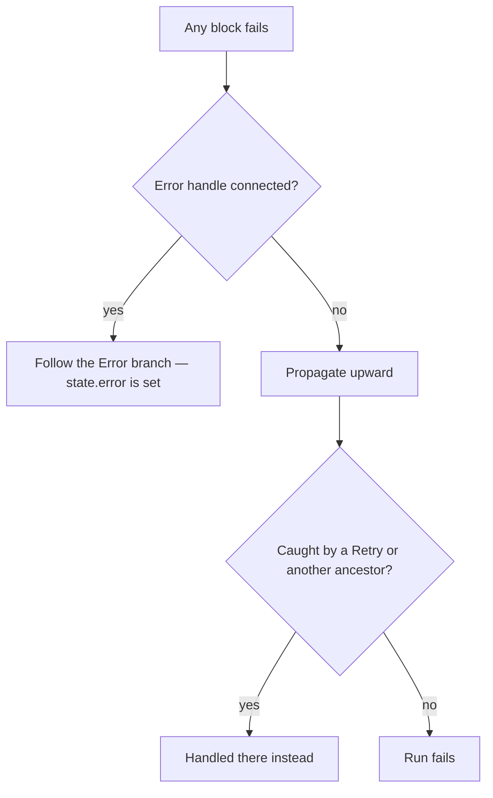
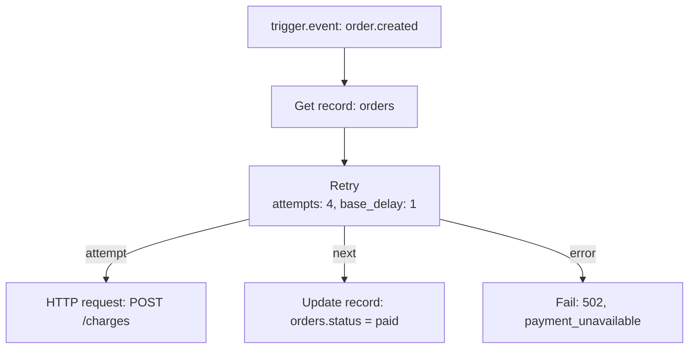
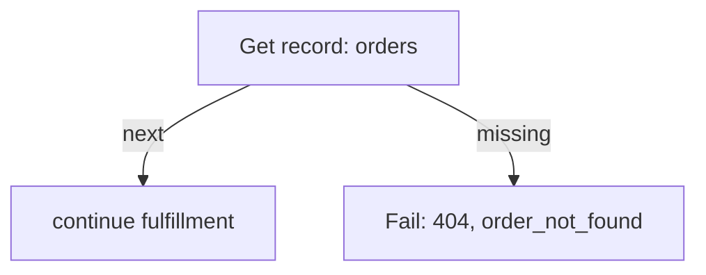
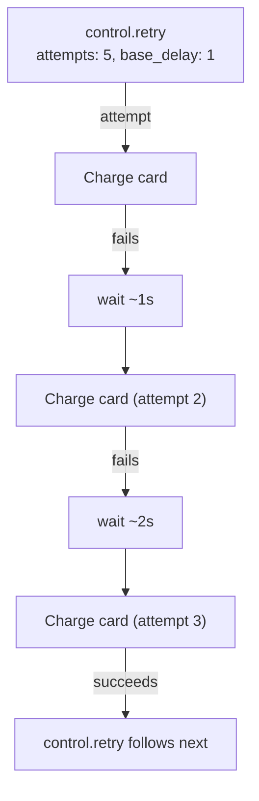
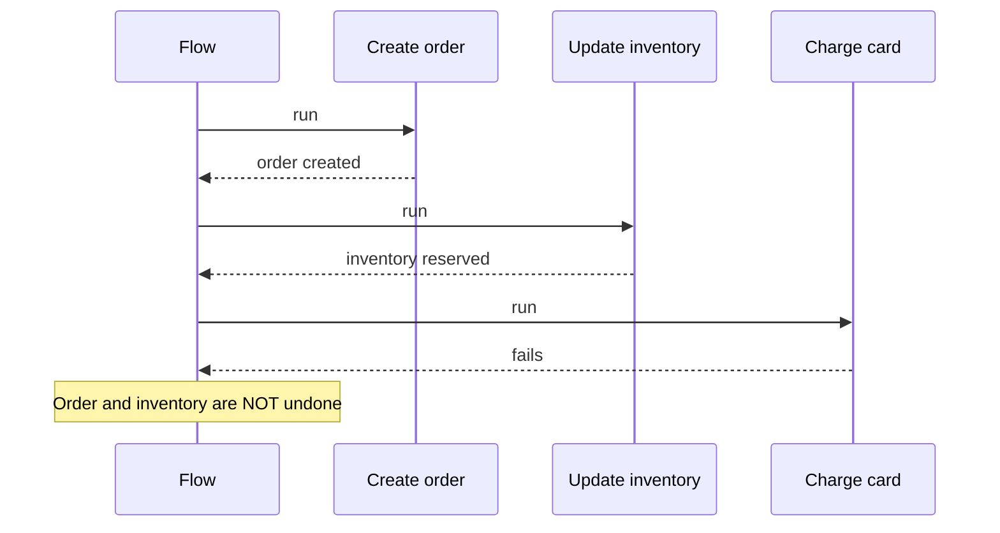
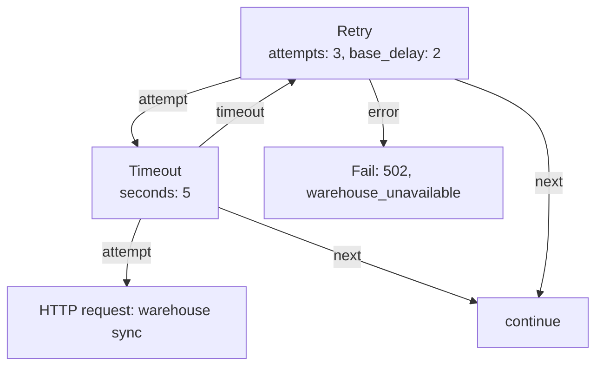
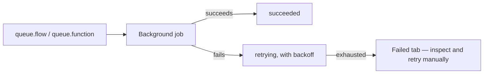
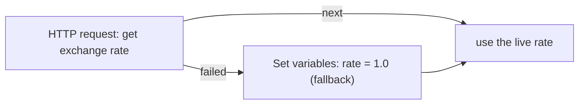
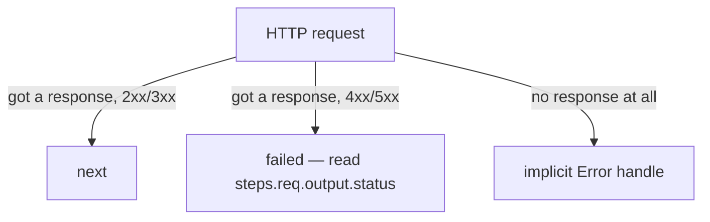

A block failing partway through a Flow is not a crash to be handled outside the Flow — it's a routing decision the Flow itself makes. Every block that can fail exposes an **Error** handle you can choose to connect. Draw the edge, and a failure becomes just another branch, with its own logic, its own fallback, its own response. Leave it disconnected, and the failure propagates and fails the whole run.

This page covers every angle of that: which handles exist for which blocks, what a Flow-level failure looks like from the outside, how retrying a sub-graph with `control.retry` works and what it means for a Step that isn't safe to run twice, why Flows don't roll back partial writes on their own, and how to actually find out why a run failed using what Studio shows you.

<CardGroup cols={2}>
  <Card title="Error handles" icon="link">Connect a block's Error output to catch its failures instead of failing the run.</Card>
  <Card title="Fail" icon="stop">Deliberately end a run with a status, message, and code you choose.</Card>
  <Card title="Retry" icon="rotate-cw">Re-run a sub-graph with backoff until it succeeds or gives up.</Card>
  <Card title="Reading a failed run" icon="search">The trace, the run detail, and what each tells you.</Card>
</CardGroup>

## The mental model: failure is a handle, not an exception

Every block in a Flow returns one named output when it finishes — `next`, `true`/`false`, a Switch case, `each`/`done`, `missing`, and so on — and the graph follows whichever edge is drawn from that handle. A failure is handled exactly the same way: when a block fails, the engine looks for an edge drawn from that block's **Error** handle.

- **An Error edge exists** → the failure is recorded, an `error` object appears in state (see [State](/flows/state#error-populated-once-an-error-handle-fires)), and the run continues down that branch as if the block had returned an `"error"` output.
- **No Error edge exists** → the failure propagates. If nothing further up the graph catches it either, the whole run fails.



<Note>
Studio adds an Error handle to every non-trigger block automatically, even blocks whose primary job description doesn't mention failure. You don't add it to a block's schema — it's always there, waiting for you to draw an edge from it if you want one.
</Note>

## Error handles, block by block

Most blocks have exactly one success output (usually named `next`) plus the implicit Error handle. A handful of blocks branch on a specific *expected* kind of failure without treating it as an error at all — a missing record isn't exceptional, it's a normal thing to check for — and expose it as its own named handle instead.

| Block | Handles | What routes where |
| --- | --- | --- |
| Get record, Update record | `next`, `missing` | A record that doesn't exist follows `missing` — this is not a failure and doesn't touch `error` at all |
| Look up user | `next`, `missing` | Same — a user ID that doesn't resolve follows `missing` |
| HTTP request | `next`, `failed` | Any non-2xx/3xx response follows `failed`. The request itself failing outright (DNS, connection refused, timeout) is a genuine error and follows the implicit Error handle instead |
| Retry | `attempt`, `next` | `attempt` is the branch that gets retried; `next` fires once it eventually succeeds. If every attempt fails, the failure propagates like any other block's — through the implicit Error handle |
| Timeout | `attempt`, `next`, `timeout` | `attempt` runs with a deadline; `next` on success, `timeout` if the deadline passes first |
| Validate against schema | `next`, `invalid` | Only branches to `invalid` when the block is explicitly configured to branch rather than fail outright |
| For each | `each`, `done` | Failure inside `each` (too many items) is a genuine error, not a branch |
| Fail | none | Always propagates — see below |
| Everything else | `next` (+ implicit Error) | A single success path; connect Error yourself to catch anything that can go wrong |

<Tip>
`missing` and `failed` aren't stand-ins for `error` — they're separate, deliberate outputs for outcomes a block expects to happen sometimes. Use them directly rather than routing through an Error branch: a Step reading `{{ steps.load_customer.output }}` after its `missing` handle fired still gets a clean `null`, not a fabricated error object.
</Tip>

## Worked example: retrying a flaky payment gateway call

A payment gateway that occasionally times out under load is the textbook case for **Retry** — the failure is almost always transient, and simply trying again a moment later usually succeeds.



```json
[
  { "id": "load", "data": { "block": "resource.get",
      "config": { "resource": "orders", "id": "{{ input.payload.order_id }}" } } },
  { "id": "retry", "data": { "block": "control.retry",
      "config": { "attempts": 4, "base_delay": 1 } } },
  { "id": "charge", "data": { "block": "http.request",
      "config": { "method": "POST", "url": "https://gateway.example.com/charges",
                  "headers": { "Idempotency-Key": "{{ steps.load.output.id }}" },
                  "body": { "amount": "{{ steps.load.output.total }}" } } } },
  { "id": "mark", "data": { "block": "resource.update",
      "config": { "resource": "orders", "id": "{{ steps.load.output.id }}",
                  "data": { "status": "paid" } } } },
  { "id": "fail", "data": { "block": "error.raise",
      "config": { "status": 502, "code": "payment_unavailable",
                  "message": "Payment gateway did not respond after 4 attempts" } } }
]
```

Notice two deliberate choices here, both directly from the idempotency guidance below:

- Only the **HTTP request** Step is inside the Retry's attempt branch — not the record load before it, and not the record update after it. A retried attempt re-sends the charge request, never re-fetches the order or re-marks it paid.
- The request itself carries an `Idempotency-Key` header derived from a stable value (the order's own ID) rather than generated fresh each attempt. If the gateway supports idempotency keys — most payment gateways do — a retried request that the gateway actually *did* process the first time (a response that got lost, not a request that never arrived) is recognized as a duplicate and returns the original result instead of charging twice.

If all four attempts fail, **Retry**'s implicit Error handle routes to **Fail**, which returns a clean `502` to whatever originally triggered the Flow, rather than a generic `500` with an unclear message.

## Worked example: handling a permanently missing resource

Not every failure is worth retrying — a resource that genuinely doesn't exist won't start existing if you wait a second and check again. This is exactly what `missing` handles are for, kept separate from the Error/retry machinery entirely:



```json
[
  { "id": "load", "data": { "block": "resource.get",
      "config": { "resource": "orders", "id": "{{ input.params.order_id }}" } } },
  { "id": "fail", "data": { "block": "error.raise",
      "config": { "status": 404, "code": "order_not_found", "message": "No order with that id" } } }
]
```

There's no Retry here, and no Error edge on `load` at all — a missing record isn't an error, it's an ordinary outcome the block distinguishes for you. The `missing` edge goes straight to a clean, deliberate `404`, and the trace for a run like this shows `load` succeeding (with handle `missing`, not an error) followed by `fail` doing exactly what it says. Compare that to what would happen with no `missing` edge drawn at all: **Get record** simply follows nothing further, the run ends quietly with no output and no error — usually more confusing to debug than an explicit `404`.

## Fail — deliberately ending a run

**Fail** raises an error on purpose, with a status, message, and code you choose:

| Configuration | Type | Default | Notes |
| --- | --- | --- | --- |
| `status` | integer | `400` | `400`–`599` |
| `message` | string | — | required |
| `code` | string | `"error"` | your own machine-readable code |

```json
{ "id": "not_found",
  "data": { "block": "error.raise",
            "config": { "status": 404, "code": "order_not_found", "message": "No order with that id" } } }
```

Fail has no handles at all — it's always the end of that path. Unlike other blocks, drawing an Error edge from a Fail block doesn't catch its own failure: Fail is built to always propagate outward, not to be caught at the point it's raised. (It can still be caught by an ancestor further up the graph — a Retry wrapping the branch it's in, for instance — the same way any other failure inside that branch would be.)

For an HTTP-triggered Flow, the caller sees exactly the `status` and `message` you configured. For a Flow triggered by an event, a schedule, or a background job, there's no HTTP response to shape — the failure is recorded on the run instead, and (for a queued job) the job is marked failed.

## What a Flow-level failure looks like

When a failure isn't caught by any Error handle anywhere in the path that led to it, the run itself fails. What that means depends on how the Flow was triggered:

| Trigger | What happens |
| --- | --- |
| HTTP request | The caller gets an HTTP response built from the error's `status` and `message` — `500` and a generic message for an unexpected failure, whatever you configured for a deliberate **Fail** |
| Event | The run is recorded as failed; nothing is retried automatically unless the event's own delivery has retry behavior configured separately |
| Schedule | The run is recorded as failed; the next scheduled firing is unaffected |
| Background job (Queue flow / Queue function) | The job is marked failed; whether it's retried depends on that queue's own retry policy, not on anything inside the Flow |
| Studio's test panel | The **Run** tab shows a red `failed` status badge with the error message and the failing Step's ID |

A run that fails partway through still has a full trace up to the point of failure — every Step that ran before the failure is recorded exactly as it would be for a successful run. This is what makes the trace worth reading even (especially) for a failed run: see [Runs and testing](/flows/runs-and-testing#reading-the-result-of-a-run) for how to read it in Studio.

## Retry — re-running a sub-graph with backoff

**Retry** wraps a branch of the graph and re-runs that whole branch, with a growing delay between attempts, until it succeeds or runs out of attempts.

| Configuration | Type | Default | Range |
| --- | --- | --- | --- |
| `attempts` | integer | `3` | `1`–`10` |
| `base_delay` | number (seconds) | `0.5` | `0`–`30` |

**Handles:** `attempt` — the branch that gets re-run on failure — and `next`, which fires once that branch eventually succeeds.

```json
{ "id": "retry_charge",
  "data": { "block": "control.retry",
            "config": { "attempts": 5, "base_delay": 1 } } }
```

Everything reachable from `retry_charge`'s `attempt` handle is the retried unit. If it fails, the block waits (a delay that grows with each attempt, starting around `base_delay` seconds), then re-runs the **entire** attempt branch from its first Step — not just the one Step that happened to fail. Once the branch finishes without failing, the block follows `next` with that successful run's output.



If every attempt fails, **Retry** doesn't have an `error` handle of its own in its declared outputs — the exhausted failure propagates exactly like any other block's failure would, through the implicit Error handle Studio adds to the Retry block itself. Connect that if you want to fall back to something else once retrying has been given up on; leave it disconnected and the run fails.

<Tip>
Use **Retry** when the thing worth re-doing is more than one Step — re-fetching a token that might have expired, say, before retrying the API call that needs it. If you only need to retry a single outbound HTTP call, **HTTP request**'s own `retries` configuration is simpler and doesn't re-run anything before it.
</Tip>

### Retrying and idempotency

Retry re-runs the **whole** attempt branch, from its first Step, every time. That matters most for a Step with a side effect that isn't safe to repeat.

Consider a two-Step attempt branch: **charge the card**, then **send a receipt email**. If the charge succeeds but the receipt email fails, Retry re-runs *both* — including charging the card a second time. That's very likely not what you want.

The practical guidance:

- **Wrap only the Step that's actually flaky.** If the payment gateway is what occasionally times out, put just the charge call inside the Retry branch, and put the receipt email after the Retry block's `next` handle instead of inside the attempt branch. Then a retry only ever repeats the one operation that needed it.
- **Prefer retrying operations that are naturally safe to repeat** — a `resource.get`, an idempotent update keyed by a stable identifier, a read-only HTTP call. A payment gateway that supports idempotency keys (most do) lets you retry the charge itself safely, too — pass a stable key derived from the order, generated once outside the Retry branch, so a retried attempt reuses the same key rather than minting a new charge.
- **Anything that sends a notification — an email, an SMS, a webhook — is usually the wrong thing to put inside a Retry branch**, because "sent twice" is a visible, external side effect a customer will notice, unlike a database write you could reconcile after the fact.

### Retry and the trace

Every attempt — including the ones that failed — shows up in a failed run's trace as its own entry, in order, each with its own duration and (for the failed ones) its own error message. That's the most direct way to tell how many attempts actually ran and what each one failed with, before the final give-up. See [Runs and testing](/flows/runs-and-testing) for reading a trace end to end.

## Timeout — bounding how long an attempt branch can take

**Timeout** is the time-bounded sibling of Retry: it runs a branch once, with a deadline, and routes to `timeout` instead of failing if the deadline passes first.

| Configuration | Type | Range |
| --- | --- | --- |
| `seconds` | number | `0.001`–`300` |

**Handles:** `attempt`, `next` (the branch finished within the deadline), `timeout` (it didn't).

Unlike Retry, nothing about a timed-out attempt branch is re-run — Timeout gives up after exactly one try and lets you route the `timeout` case explicitly, which is often more useful than treating a slow dependency as a hard failure.

## Worked example: bounding a slow dependency with Timeout

A geocoding lookup that's usually instant but occasionally takes far too long is a good fit for **Timeout** rather than **Retry** — the problem isn't that it fails, it's that it might hang, and retrying a hang just risks hanging again.

```json
[
  { "id": "geocode_bound", "data": { "block": "control.timeout",
      "config": { "seconds": 3 } } },
  { "id": "geocode", "data": { "block": "http.request",
      "config": { "method": "GET", "url": "https://geo.example.com/lookup",
                  "params": { "address": "{{ input.body.address }}" } } } },
  { "id": "use_coords", "data": { "block": "control.set",
      "config": { "values": { "lat": "{{ steps.geocode.output.body.lat }}", "lng": "{{ steps.geocode.output.body.lng }}" } } } },
  { "id": "use_default", "data": { "block": "control.set",
      "config": { "values": { "lat": null, "lng": null } } } }
]
```

with edges: `geocode_bound --attempt--> geocode --next--> use_coords`, and `geocode_bound --timeout--> use_default`. If the lookup answers within 3 seconds, `use_coords` records the real coordinates; if it doesn't, `use_default` records `null` ones and the Flow moves on rather than making the caller wait indefinitely for an address lookup that isn't essential to the main outcome.

## Database writes: partial failure and transactions

Most blocks that write data — **Create record**, **Update record**, **Delete record** — commit the moment they run, independently of whatever else is in the Flow, exactly as if each one were its own separate API request. If a later Step in the same run fails, earlier writes are **not** automatically undone.



If several writes need to succeed or fail **together**, use **Transaction**, which applies a list of record operations atomically:

```json
{ "id": "place_order",
  "data": { "block": "db.transaction",
            "config": { "operations": [
              { "op": "create", "resource": "orders", "data": { "...": "..." } },
              { "op": "update", "resource": "inventory", "id": "{{ steps.check_stock.output.id }}", "data": { "...": "..." } }
            ] } } }
```

Inside a Transaction, every operation shares one database transaction: if any operation fails, none of them are kept. Effects that depend on a write actually landing — an event firing, a cache entry being invalidated — only happen after the transaction commits, so a rolled-back Transaction never triggers a stray downstream effect for a write that didn't actually happen.

<Warning>
This is intentional, not an oversight: a Flow behaves the same whether it fails halfway through or not — each write commits independently, the same way a plain API request would. If a set of writes must be all-or-nothing, reach for **Transaction** explicitly rather than assuming the Flow will undo anything for you.
</Warning>

**SQL query**, separately, only ever runs a read — attempting a write statement through it fails outright rather than executing.

## Timeouts and step limits

Every Flow has its own overall `timeout` (1–900 seconds, 60 by default, set on the Flow tab in the editor). If a run's total wall-clock time exceeds it, the run fails with an HTTP `504` (for an HTTP-triggered Flow) and a timeout error otherwise — no matter which Step was running when the clock ran out.

Separately, every run has a hard cap of 10,000 executed Steps, counting every Step in every loop iteration and every retry attempt. This exists purely as a safety net against a graph that loops forever by accident — a **For each** or **While** with a condition that never becomes false, say. Hitting it fails the run; it isn't something you configure, and in practice you'd only hit it from a genuine runaway loop, not from ordinary Flow sizes. **For each** additionally refuses to iterate more than 10,000 items in one call.

## Errors raised by built-in blocks

Beyond the branching handles above, here are the specific, stable error codes the built-in blocks raise. These show up in a failed Step's trace entry, and in `error.type`/`error.message` inside a connected Error branch:

| Code | Raised by | Meaning |
| --- | --- | --- |
| `timeout` | The Flow itself | The Flow's overall `timeout` was exceeded |
| `too_many_steps` | The Flow itself | More than 10,000 Steps executed in this run |
| `too_many_items` | For each | More than 10,000 items in the loop's list |
| `too_many_iterations` | While | Exceeded its own `max_iterations` setting |
| `not_a_list` | For each, and a few data blocks | Configuration expected a list and didn't get one |
| `bad_config` | Several blocks | A configuration value is out of range or malformed |
| `unauthenticated` | Require sign-in | No caller resolved for this run |
| `missing_role` / `missing_permission` | Require sign-in | The caller resolved, but lacks the required role or permission |
| `missing_secret` | Read secret, HMAC hash | The named secret isn't set for this environment |
| `write_refused` | SQL query | The query attempted to write instead of read |
| `not_a_number` | Calculate | A non-numeric value was used in a calculation |
| `division_by_zero` | Calculate | Division by zero |
| `bad_json` | Parse JSON | The text wasn't valid JSON |
| `invalid` | Validate against schema | The value didn't match the configured schema, when configured to fail rather than branch |
| `too_deep` | Call function | A function called another function, which called another, past 8 levels deep |
| `raised` | Fail | Always this code — always propagates, as described above |

<Tip>
`code` is meant to be matched on. If you connect an Error handle and want to react differently depending on *why* a Step failed — a missing secret versus a bad request — branch on `{{ error.type }}` (or, for a block you know raises a specific code, check `{{ error.message }}` for the text you expect) with a Condition rather than treating every failure the same way.
</Tip>

## Failure modes, block by block

The table in [Error handles, block by block](#error-handles-block-by-block) covers the shape of the mechanism. This section goes one level deeper: for every resource, data, and platform block, exactly what makes it fail outright (propagating to the implicit Error handle) versus what it treats as an ordinary branch. Field names and handles here match [Resource blocks](/flows/resource-blocks), [Data blocks](/flows/data-blocks), and [Platform blocks](/flows/platform-blocks) exactly — this is the error-handling companion to those pages, not a restatement of their config tables.

### Resource blocks

| Block | Branches on | Genuinely fails (implicit Error handle) when |
| --- | --- | --- |
| `resource.list` | Nothing — an empty result is `{"data": [], "total": 0, ...}`, not a failure | The named `resource` doesn't exist in this environment, or the store rejects the query itself |
| `resource.get` | `missing` — the id doesn't resolve to a record | The named `resource` doesn't exist, or the backend store is unreachable |
| `resource.create` | Nothing | `data` fails the resource's own field validation (required fields, types, `enum`, uniqueness) — the same `422` a REST client's `POST` would get; or the backend rejects the write |
| `resource.update` | `missing` — the id doesn't resolve to a record | Same validation failures as `resource.create`, evaluated against the fields actually present in `data` |
| `resource.delete` | Nothing — deleting a nonexistent id returns `false` on `next`, not `missing` | The named `resource` doesn't exist, or the backend rejects the delete |
| `db.query` | Nothing | The SQL is malformed, `params` doesn't match the statement's placeholders, or the statement attempts a write (`write_refused`) — see [db.query only runs reads](/flows/errors-and-retries#database-writes-partial-failure-and-transactions) above |
| `db.transaction` | Nothing | `operations` isn't a non-empty list (`bad_config`), or **any** operation in the list fails — the whole transaction rolls back and the failure propagates as one error, not one per operation |

<Tip>
`resource.create` and `resource.update`'s validation failures are worth calling out specifically: they raise with the *resource's own* configured validation rules, which you don't see reflected anywhere in the Flow's own definition — a required field the resource schema added after the Flow was built will start failing writes that used to succeed, with no change to the Flow itself. If a resource's schema changes, re-test Flows that write to it.
</Tip>

### Data blocks

Every data block is a pure computation with no external dependency, so failures here are almost always about the *shape* of the data reaching the block, not a network or backend problem.

| Block | Fails with code | When |
| --- | --- | --- |
| `transform.map` | *(depends on the transformer)* | The named or inline transformer doesn't exist, or itself raises while running |
| `transform.template` | — | Rarely fails outright; a missing path inside the template resolves empty rather than raising, the same as any other template |
| `transform.pick` | — | Essentially never fails — a non-object `value` is treated as having no matching keys |
| `transform.filter` | `not_a_list` | `value` isn't a list once rendered |
| `transform.sort` | `not_a_list`, `bad_config` | `value` isn't a list, or `field` is empty |
| `transform.group` | `not_a_list`, `bad_config` | `value` isn't a list, or `field` is empty |
| `transform.batch` | `not_a_list`, `bad_config` | `value` isn't a list, or `size` is outside `1`–`1000` |
| `validate.schema` | `invalid` (only when `on_invalid: "fail"`) | The value doesn't match `fields` — with `on_invalid: "branch"`, this becomes the `invalid` handle instead of a failure at all |
| `json.parse` | `bad_json` | `text` isn't valid JSON |
| `json.stringify` | — | Essentially never fails — non-serializable values are coerced to their string form rather than raising |
| `math.calculate` | `not_a_number`, `division_by_zero`, `bad_config` | A value in `values` can't convert to a number, `divide` includes a zero divisor, or `operation` isn't recognized |
| `util.id` | — | Never fails |
| `crypto.hash` | `missing_secret` | `algorithm: "hmac-sha256"` and `secret` doesn't resolve to a set secret |
| `time.now` | — | Never fails |

<Tip>
Most data-block failures — `not_a_list`, `bad_config`, `not_a_number` — trace back to a template one Step upstream resolving to something other than what the block expected, exactly the way [State's "a path that doesn't exist"](/flows/state#a-path-that-doesnt-exist) describes. Before assuming a data block itself is broken, check what its input actually rendered to in the trace.
</Tip>

### Platform blocks

| Block | Branches on | Genuinely fails when |
| --- | --- | --- |
| `auth.require` | Nothing — always raises rather than branching | No caller (`unauthenticated`), caller lacks the configured `role` (`missing_role`), or lacks the configured `permission` (`missing_permission`) |
| `auth.user` | `anonymous` — no signed-in caller | The identity lookup itself fails unexpectedly (a backend outage) |
| `auth.lookup` | `missing` — the `user_id` doesn't resolve | The identity backend is unreachable |
| `policy.check` | `allowed` / `denied` — both are successful outcomes, not failures | The named policy doesn't exist, or its condition is malformed |
| `cache.get` | `hit` / `miss` | The cache backend itself is unreachable |
| `cache.set` / `cache.delete` / `cache.invalidate` | Nothing | The cache backend is unreachable |
| `event.emit` | Nothing | The event bus is unreachable, or `event` is empty |
| `queue.flow` / `queue.function` | Nothing — dispatching never waits for the target to actually run | The named Flow or Function doesn't exist, or the job queue itself can't accept the dispatch. (The *target*'s own failure, once it eventually runs, is a separate, later job failure — see [Background job retries](#background-job-retries-separate-from-controlretry) below, not a failure of the dispatching Step) |
| `realtime.publish` | Nothing | The realtime backend is unreachable, or `channel` is empty |
| `storage.put` | Nothing | The bucket doesn't exist, or the backend rejects the write (quota, permissions) |
| `storage.read` | Nothing — there is no `missing` handle | The key doesn't exist in the bucket, or the backend is unreachable — a missing object is a genuine failure here, unlike a missing resource record |
| `storage.signed_url` | Nothing | The bucket or key is invalid, or the backend can't sign a URL for the requested `method` |
| `storage.delete` | Nothing | The bucket doesn't exist, or the backend rejects the delete |
| `mail.send` | Nothing — there is no `failed` handle, unlike `http.request` | The mail backend rejects the send, the named `template` doesn't exist, or every address in `to` is empty |
| `http.request` | `next` / `failed` — see [http.request's two kinds of failure](#httprequests-two-kinds-of-failure) above | The request never gets a response at all (DNS, connection refused, TLS, or its own `timeout` elapsing) |
| `webhook.send` | Nothing — the count of queued deliveries is the output regardless of whether any individual subscriber's delivery later fails | The webhook subsystem itself is unreachable |
| `secret.get` | Nothing | `missing_secret` — the named secret isn't set in this environment |
| `function.call` | Nothing — propagates whatever the Function itself raises, see below | The Function raises, is missing, or nesting exceeds 8 levels (`too_deep`) |
| `log.write` | Nothing | Essentially never fails |
| `metric.increment` | Nothing | Essentially never fails |
| `response.return` | *(no handles — always ends the run)* | Never fails on its own; a malformed `status` outside `100`–`599` is rejected at config-validation time, not at run time |
| `error.raise` | *(no handles — always ends the run)* | Always — this block's entire purpose is to fail, with the `status`/`message`/`code` you gave it |

<Warning>
`mail.send` and `storage.read` are the two platform blocks most often mistaken for having a branch they don't. `http.request` has `failed` for a non-2xx/3xx response, which makes it easy to assume `mail.send` has something equivalent for "the provider rejected the send" — it doesn't. A `mail.send` failure of any kind (bad address, missing template, provider outage) is a genuine failure, caught only by an explicit Error handle. Likewise, `storage.read` has no `missing` handle the way `resource.get` does — reading a key that doesn't exist in the bucket is a failure, not a branch, so wrap it in an Error handle (or check existence with `storage.signed_url`'s absence of an error first, if your workflow allows it) rather than expecting a clean `missing` output.
</Warning>

## Realistic failure scenarios and recovery patterns

Three more end-to-end shapes, beyond the payment-gateway Retry and permanently-missing-record examples above, that come up often enough in real Flows to be worth having a template for.

### A permanently invalid input that needs its own dead end

Not every bad input is a "missing record" — sometimes the payload itself is structurally wrong in a way no amount of retrying or looking harder will fix. A partner integration sending a webhook whose `amount` field is a negative number, say:

```json
[
  { "id": "start", "data": { "block": "trigger.webhook", "config": { "hook": "partner_payments" } } },
  { "id": "decode", "data": { "block": "json.parse", "config": { "text": "{{ input.body }}" } } },
  { "id": "check", "data": { "block": "control.if",
      "config": { "condition": { "any": [
        { "not": { "exists": "$steps.decode.output.amount" } },
        { "lte": ["$steps.decode.output.amount", 0] }
      ] } } } },
  { "id": "reject", "data": { "block": "log.write",
      "config": { "level": "error", "message": "Rejected partner payment with invalid amount", "category": "webhooks",
                  "data": { "raw": "{{ steps.decode.output }}" } } } },
  { "id": "stop_here", "data": { "block": "control.stop" } },
  { "id": "apply", "data": { "block": "resource.create",
      "config": { "resource": "payments", "data": { "amount": "{{ steps.decode.output.amount }}" } } } }
]
```

Edges: `check --true--> reject --> stop_here`, and `check --false--> apply`. The important choice here is **`control.stop`, not `error.raise`**, for the dead end: this isn't the caller's fault in a way a `4xx`/`5xx` response should communicate back (an inbound webhook's response usually just acknowledges receipt, regardless of what the Flow decided to do with the payload), and it isn't a condition worth alerting on the way an unhandled exception is — it's an input the Flow deliberately chose not to act on. **Log** first, so the rejection is visible in the Flow's own log stream for later investigation, then **Stop** cleanly rather than letting an unhandled path quietly end the run with no trace of why. Reach for **Fail** instead of **Stop** only when the triggering caller is waiting synchronously on a response and needs to see the rejection as an actual error status.

### Partial failure across a multi-step marketplace payout

A marketplace order that splits payment across three sellers is exactly the case [Transaction](#database-writes-partial-failure-and-transactions) exists for — but it's worth walking through what goes wrong *without* it, since "commit each seller's payout independently" is the natural first instinct and the wrong one:

```mermaid
sequenceDiagram
    participant Flow
    participant PayoutA as Create payout (seller A)
    participant PayoutB as Create payout (seller B)
    participant PayoutC as Create payout (seller C, invalid bank details)
    Flow->>PayoutA: run
    PayoutA-->>Flow: payout created
    Flow->>PayoutB: run
    PayoutB-->>Flow: payout created
    Flow->>PayoutC: run
    PayoutC-->>Flow: fails validation
    Note over Flow: Sellers A and B are now paid; C is not, and the run has failed
```

If each `resource.create` for a seller's payout runs as its own independent Step (the natural shape of a `control.foreach` over the order's sellers), a validation failure on the third seller's payout doesn't undo the first two — exactly the "no automatic rollback" behavior described above, and exactly the shape that leaves a marketplace order in a half-paid, inconsistent state that's expensive to reconcile by hand.

The fix is building the full list of payouts *before* writing any of them, validating every seller's bank details up front, and committing all three through one `db.transaction`:

```json
[
  { "id": "sellers", "data": { "block": "resource.list", "config": { "resource": "order_sellers", "filters": { "order_id": "{{ input.payload.order_id }}" } } } },
  { "id": "build", "data": { "block": "control.foreach", "config": { "items": "{{ steps.sellers.output.data }}" } } },
  { "id": "check_bank", "data": { "block": "validate.schema",
      "config": { "value": "{{ item.bank_details }}",
                  "fields": [ { "name": "account_number", "type": "string", "required": true }, { "name": "routing_number", "type": "string", "required": true } ],
                  "on_invalid": "branch" } } },
  { "id": "flag_seller", "data": { "block": "log.write", "config": { "level": "error", "message": "Seller {{ item.id }} has invalid bank details; payout skipped", "category": "payouts" } } },
  { "id": "add_operation", "data": { "block": "control.set",
      "config": { "values": { "operations": "{{ vars.operations | default:[] }}" } } } },
  { "id": "commit", "data": { "block": "db.transaction",
      "config": { "operations": "{{ vars.operations }}" } } }
]
```

Edges: `sellers --> build`, `build --each--> check_bank`, `check_bank --invalid--> flag_seller` (which ends that iteration without adding an operation), `check_bank --next--> add_operation`, and — once the loop finishes — `build --done--> commit`. A seller with bad bank details is logged and simply excluded from the payout batch, rather than aborting payouts for sellers whose details *were* fine; and every seller who does get included is paid atomically, in the same transaction, so a late failure (a database constraint, a concurrent update) either pays everyone in the batch or nobody, never a partial subset.

<Tip>
`db.transaction`'s `operations` is assembled inside the loop, but the transaction itself runs once, **after** the loop finishes — exactly the "build a list before handing it to `db.transaction`" pattern from the [Overview](/flows/overview#common-patterns). Committing inside the loop, once per seller, would bring back the exact partial-failure problem this recipe is meant to avoid.
</Tip>

### A dependency that's flaky *and* occasionally hangs

Combining Timeout and Retry, mentioned briefly in the comparison table above, deserves a full worked shape: an inventory sync call to a third-party warehouse system that's usually fast, occasionally slow enough to be worth giving up on, and occasionally fails outright:



Here, **Timeout** is nested *inside* **Retry**'s `attempt` branch — not the other way around. A `Timeout` wrapping a `Retry` would only get to enforce one deadline across every attempt combined, which defeats the purpose of retrying with backoff between attempts; **Retry** wrapping **Timeout** lets each individual attempt get its own fresh 5-second budget, and a timed-out attempt (`bound`'s `timeout` handle looping back into `retry`) counts as one of Retry's failed attempts, consuming one of its three tries the same as an outright HTTP failure would.

## Calling a function: how its errors surface

**Call function** runs a registered Python function inline and continues with whatever it returns. If that function raises, the failure surfaces to the calling Flow exactly like any other block's failure would — caught by a connected Error handle if one exists, or propagated to fail the run otherwise. A function that wants to communicate something more specific than "it failed" — a particular status code, a stable error code, structured details — raises its own typed error internally; a function that just lets an ordinary exception escape produces a generic failure with the exception's class name and message, which is far less useful inside an Error branch that tries to distinguish one failure from another.

If you own the function being called and it's called from a Flow, giving it deliberate, typed failures (rather than letting arbitrary exceptions propagate) is the difference between an Error branch that can say "payment declined, try a different card" and one that can only say "something went wrong."

One function calling another (an inline function that itself calls a further function) is allowed, but only 8 levels deep — see [Timeouts and step limits](#timeouts-and-step-limits) below. This is a safety net against a function that accidentally calls itself, or a chain that loops back on its own dependency, not a limit you should ever design around deliberately.

## Background job retries — separate from control.retry

**Queue flow** and **Queue function** don't run their target inline — they hand it to the platform's background job queue and return immediately with a job ID. That queued job has its own, separate retry behavior, entirely independent of anything configured with **Retry** inside a Flow:

- A job that fails is automatically retried with backoff, up to that queue's own retry limit.
- Studio's **Jobs & queues** page lists every job with its current status (`queued`, `active`, `retrying`, `succeeded`, `failed`) and its attempt count, so you can see exactly how many times a given dispatch has been tried so far.
- A job that exhausts its retries lands on the **Failed** tab, with its error, rather than continuing to retry forever. From there, you can inspect what it failed with and retry it manually with one click, whenever the underlying cause (an outage, a bad deploy) has been fixed.



The distinction that matters: **Retry** re-runs a branch *within* one already-running Flow execution, synchronously, before that execution continues or fails. A queued job's retries happen *between* separate executions — the first attempt fully finishes (and fails), and a later, entirely new run is what actually retries it. If a Flow dispatched as a background job needs an internal step retried without waiting for the whole job to be re-queued, that's still what **Retry** inside the Flow is for; the job queue's own retries are for the dispatch as a whole failing outright (the Flow itself raising all the way to the top, an unhandled exception, a timeout).

## Choosing between Retry, Timeout, and a plain Error handle

Three different tools exist for three different shapes of "this might not work," and picking the wrong one tends to produce a Flow that's either too fragile or too slow:

| Situation | Reach for |
| --- | --- |
| A call fails outright sometimes, and trying again shortly after usually works | **Retry**, wrapping just the flaky call |
| A call sometimes hangs rather than failing outright, and you need a firm deadline | **Timeout**, with a `timeout` branch that decides what to do instead |
| A call fails in a way that's never going to succeed by retrying (a permanently missing record, a validation error, a `4xx` you caused) | A plain **Error** handle (or a block's own `missing`/`failed` handle), routed straight to a fallback or a **Fail** |
| A single outbound HTTP call that just needs a couple of automatic attempts, with no other Steps involved | **HTTP request**'s own `retries` configuration — simpler than wrapping it in a **Retry** block for this one case |

Combining **Timeout** and **Retry** is reasonable for a call that's occasionally slow *and* occasionally fails outright — wrap the **Timeout** block's `attempt` branch in a **Retry**, so a hang gets cut short and then retried, rather than the whole Flow's own timeout being the only thing standing between a hung dependency and a very slow failure.

## Common error-handling patterns

**Fallback value instead of a broken run.** A `cache.get` miss, or a non-critical `http.request` failure, doesn't have to fail the whole Flow — route its Error (or `miss`/`failed`) handle to a **Set variables** Step that supplies a sensible default, then continue the main path as if nothing had gone wrong:



**Log, then continue past a non-critical failure.** A **Send email** or **Emit event** Step failing usually shouldn't take down an otherwise-successful Flow. Route its Error handle to a **Log** Step (recording the failure for later investigation) and merge straight back into the main path, rather than to a **Fail** that would turn a minor notification problem into a hard failure for the whole run.

**Notify and stop, for something that needs a human.** For a failure that genuinely can't be worked around automatically — a payment permanently declined after retries, a webhook payload that doesn't match any known shape — route the Error handle to a **Send email** or **Emit event** Step (alerting someone, or logging to an external system) *before* a **Fail**, rather than only a bare **Fail** that a caller sees but no one internally is aware of.

## Anatomy of an error message

Two different shapes of error text show up in a trace and inside `error.message`/`error.type`, and telling them apart is useful when you're trying to figure out where a failure actually came from:

- **A deliberate, typed failure** — a block raising its own specific error, like **Fail**'s `message`, or **Require sign-in**'s "Authentication required" — shows up as just that message, with `error.type` reading `FlowError`. These are errors a block author (or you, via **Fail**) chose the exact wording and status for.
- **An ordinary, unexpected exception** — something going wrong in a way the block didn't anticipate — shows up prefixed with the underlying exception's class name, like `ConnectionError: [Errno 61] Connection refused` or `KeyError: 'total'`. `error.type` reflects that same class name.

Seeing the second shape is a signal that whatever failed hit a genuinely unexpected condition — worth checking the input that block actually received (its **Last run** in the inspector) rather than assuming the failure is self-explanatory the way a deliberate **Fail** message would be.

```json
{
  "node": "charge",
  "block": "http.request",
  "handle": null,
  "error": "ConnectionError: [Errno 61] Connection refused",
  "duration_ms": 5002.4
}
```

versus

```json
{
  "node": "reject",
  "block": "error.raise",
  "handle": null,
  "error": "No order with that id",
  "duration_ms": 0.3
}
```

The first is an unplanned failure worth investigating (is the gateway down? a firewall rule changed?); the second is exactly what `reject` was built to do.

## `http.request`'s two kinds of failure

**HTTP request** is worth calling out specifically because it has two genuinely different ways of not succeeding, and they route differently:

- **The request reaches the server and gets an answer, but that answer isn't 2xx/3xx** — a `404`, a `422`, a `500` from the remote service. This follows the `failed` handle, with the full response (status, headers, body) available in the Step's output, exactly as a successful call would provide it. This is not an error in Pawabase's sense — nothing touches `error` in state, because the call itself worked; the remote service just said no.
- **The request never gets an answer at all** — a DNS failure, a connection refused, a TLS error, or the call exceeding its own `timeout` configuration. This is a genuine error and follows the block's implicit Error handle if one is connected, or fails the run otherwise.



Draw a `failed` edge whenever you need to react to a specific status code (retry only on `429`/`503`, treat `404` as "nothing to do" rather than an error, and so on) — the status is right there in the Step's output for a Condition to branch on.

## Diagnosing a failed run in Studio

<Steps>
  <Step title="Check the run's status">
    A failed run shows a red `failed` badge, either in Studio's test panel right after you run it, or in the **Events & runs** page's Flow runs list for anything that ran from a real Trigger.
  </Step>
  <Step title="Read the error message and the failing node">
    The run detail shows the error's message together with the ID of the Step where it happened. That alone often tells you which block to look at.
  </Step>
  <Step title="Open the trace and read it top to bottom">
    Every Step that ran before the failure is listed in the order it actually executed, with its handle and duration. The last entry before the run ends is almost always the one that failed — check its recorded output and error text.
  </Step>
  <Step title="Reproduce it with a test run">
    Feed the same input (and, if the original run was authenticated, a matching caller in **Run as**) into Studio's Run panel to get a fresh trace without waiting for the real Trigger to fire again.
  </Step>
  <Step title="Check the exact value a Step received">
    Click the failing node on the canvas after a test run to see its own **Last run** output and input in the inspector — this is where a bad template (a path that quietly resolved to `null`) usually shows up.
  </Step>
</Steps>

A failed run's trace still contains every Step that ran successfully *before* the failure — reading those first is often more informative than staring at the failure itself. A `KeyError: 'total'` inside a `math.calculate` Step, for instance, is usually explained by looking one Step earlier: did the Step that was supposed to produce `total` actually run, and did it return the shape you assumed?

```json
[
  { "node": "load_order", "block": "resource.get", "handle": "next",
    "output": { "id": "ord_1", "subtotal": 49.99 }, "error": null },
  { "node": "compute_total", "block": "math.calculate", "handle": null,
    "output": null, "error": "not_a_number: calculate needs numbers" }
]
```

Reading this trace top to bottom: `load_order` succeeded and returned a record with `subtotal`, not `total`. `compute_total`'s configuration referencing `{{ steps.load_order.output.total }}` resolved to an empty value — a lookup mistake, not a bug in `math.calculate` itself, which correctly refused to do arithmetic on nothing. The fix is in `compute_total`'s template, not in either block's configuration otherwise.

See [Runs and testing](/flows/runs-and-testing) for the full detail on Studio's trace view, and [State](/flows/state) for how a template path resolves — or quietly doesn't.

## Common mistakes

<AccordionGroup>
  <Accordion title="Expecting Fail's own Error edge to catch its failure">
    A **Fail** block's failure always propagates outward, even if you draw an edge from its own Error handle — that edge is never followed for that particular block. Catch it further up the graph instead, if you need to catch it at all.
  </Accordion>
  <Accordion title="Putting a non-idempotent Step inside a Retry branch alongside the flaky one">
    Retry re-runs its whole attempt branch from the top. If a charge and a receipt email are both inside it, a retry after a failed email re-sends the charge too. Keep only the genuinely retry-safe Step inside the branch.
  </Accordion>
  <Accordion title="Assuming a failed write earlier in the run gets undone">
    It doesn't, unless it went through a **Transaction**. Each `resource.*` write commits the moment it runs, independent of what happens later in the same run.
  </Accordion>
  <Accordion title="Treating missing or failed as an error">
    `missing` (Get/Update record, Look up user) and `failed` (HTTP request) are ordinary, expected outputs — not routed through `error` at all. Branch on them directly rather than wiring them through an Error handle.
  </Accordion>
  <Accordion title="Reading error.message from outside the branch that's meant to handle it">
    `error` isn't cleared once its branch finishes. A Step much later in the same run, unrelated to the original failure, can still see a stale value if it references `{{ error.* }}` — see State's note on this.
  </Accordion>
  <Accordion title="Confusing a queued job's retries with control.retry">
    Retrying a **Queue flow** dispatch happens between separate job attempts, on the queue's own schedule, visible on the Jobs & queues page — it has nothing to do with any **Retry** block configured inside the dispatched Flow itself. If a job keeps landing on the Failed tab, the fix is almost never inside the Flow's own error handling; check what the job actually failed with first.
  </Accordion>
  <Accordion title="Wrapping an entire multi-step branch in Retry when only one call is flaky">
    The wider the attempt branch, the more side effects get repeated on every retry. Narrow the attempt branch down to just the Step that actually fails intermittently, and put anything with a real-world side effect — an email, a second write — after the Retry block's `next` handle instead.
  </Accordion>
  <Accordion title="Letting a function's ordinary exceptions become the caller's whole story">
    A function that lets a bare `ValueError` or a driver-level exception escape gives the calling Flow's Error branch nothing to work with beyond a generic message. If you control the function, raise something with a clear status and code for the failures a caller might reasonably want to branch on.
  </Accordion>
</AccordionGroup>

## Next

<CardGroup cols={2}>
  <Card title="State" icon="layers-stacked" href="/flows/state">The full shape of what a Flow can see while it runs.</Card>
  <Card title="Runs and testing" icon="beaker" href="/flows/runs-and-testing">Running a Flow in Studio and reading its trace.</Card>
  <Card title="Control flow" icon="git-branch" href="/flows/control-flow">If, Switch, For each, While, Retry, and Timeout in depth.</Card>
  <Card title="Block reference" icon="list-tree" href="/flows/block-reference">Every block's exact configuration fields and handles.</Card>
</CardGroup>
