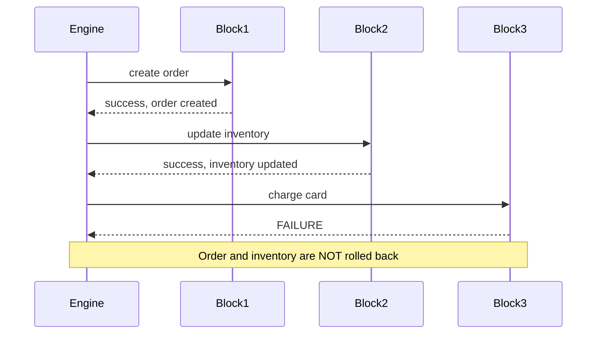
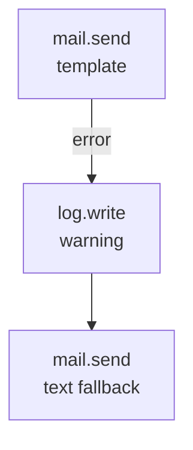
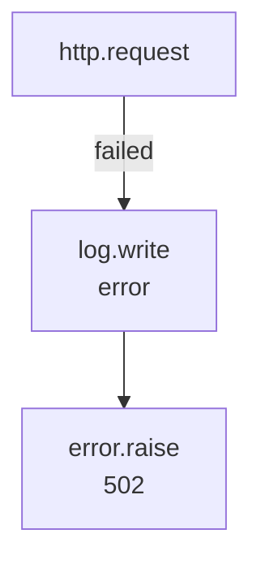
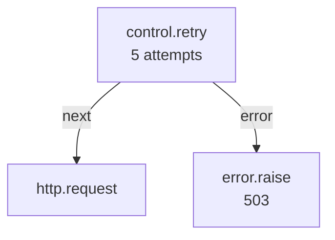
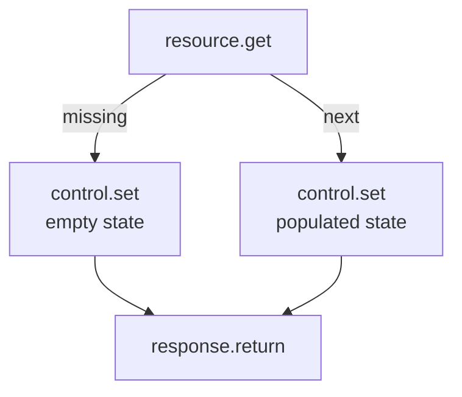

In Pawabase, a block failure is not a crash — it's a *routing decision*. Every block that can fail declares an `error` handle, and the engine follows it if one is drawn. If no `error` edge exists, the run fails outright with a typed `FlowError`.

<CardGroup cols={2}>
  <Card title="Error handles" icon="link">Draw an edge from a block's `error` handle to catch failures.</Card>
  <Card title="error.raise" icon="stop">Deliberately fail a run with a chosen status and message.</Card>
  <Card title="control.retry" icon="sync">Retry a sub-graph with backoff on failure.</Card>
  <Card title="Partial writes" icon="database">Flows don't auto-rollback — use db.transaction for atomicity.</Card>
</CardGroup>

## How block errors work

When a block's `run()` raises any exception, the engine catches it and looks for an `error` handle edge from that node:

```python
async def _execute_node(self, node_id: str) -> str | None:
    try:
        result = await block.run(config, self)
    except FlowError as exc:
        if self.targets(node_id, "error") and exc.code != "raised":
            return await self._handle_error(node_id, exc)
        raise
    except Exception as exc:
        if self.targets(node_id, "error"):
            return await self._handle_error(node_id, exc)
        raise FlowError(str(exc), node=node_id, code="block_failed") from exc
```

Two paths:

1. **An `error` edge exists** → the engine calls `_handle_error`, which sets `state["error"]` and returns the `"error"` handle. The run continues down the error branch.
2. **No `error` edge exists** → the exception propagates up as a `FlowError`, and the run fails.

The `state["error"]` object populated by `_handle_error` looks like:

```json
{
  "message": "Order not found",
  "type": "FlowError",
  "node": "load"
}
```

Inside an error branch, `{{ error.message }}`, `{{ error.type }}`, and `{{ error.node }}` are all available in templates.

## Error handles by block

Most blocks declare `handles = ["next"]` with an implicit `error` handle available as an opt-in edge. Blocks that *branch* on errors declare their handles explicitly:

| Block | Handles | Error behavior |
| --- | --- | --- |
| `resource.get` | `next`, `missing` | No exception on missing record; follows `missing` |
| `resource.update` | `next`, `missing` | Same |
| `auth.lookup` | `next`, `missing` | Same |
| `control.if` | `true`, `false` | Never errors on the condition itself |
| `control.foreach` | `each`, `done` | Errors on too many items |
| `http.request` | `next`, `failed` | Non-2xx/3xx follows `failed` |
| `mail.send` | none (implicit `error`) | Send failure follows `error` if drawn |
| `validate.schema` | `next`, `invalid` | Only when `on_invalid: "branch"` |
| Any non-trigger block | `next` + implicit `error` | Add an `error` edge to catch |

<Note>
An `error` handle is opt-in per block. If you don't draw an edge from a block's `error` handle, exceptions from that block fail the run. You decide per-block whether to handle errors or let them propagate.
</Note>

## `error.raise` — Fail deliberately

Fail the run with a chosen HTTP status, message, and code. This is the block form of raising a `FlowError` directly, used for every "this request is invalid" branch throughout a flow.

| Config | Type | Required | Default | Range |
| --- | --- | --- | --- | --- |
| `status` | `integer` | no | `400` | `400`–`599` |
| `message` | `string` | yes | — | — |
| `code` | `string` | no | `"error"` | — |

**Handles:** none — `error.raise` is always terminal.

```json
{
  "id": "not_found",
  "data": {
    "block": "error.raise",
    "config": { "status": 404, "code": "order_not_found", "message": "No order with that id" }
  }
}
```

The resulting error's `status`/`code`/`message` are exactly what an HTTP-triggered flow's caller sees. For non-HTTP flows, the error is recorded in the run's trace and the job's status reflects the failure.

## FlowError types

Every `FlowError` has:

| Attribute | Description |
| --- | --- |
| `message` | Human-readable description |
| `status` | HTTP status code (when the flow serves a request) |
| `code` | Machine-readable error code |
| `node` | Where the error occurred |
| `details` | Additional context |

Common `FlowError` codes raised by built-in blocks:

| Code | Raised by | Meaning |
| --- | --- | --- |
| `timeout` | `FlowRun.execute()` | Flow exceeded its `timeout` (HTTP `504`) |
| `too_many_steps` | `FlowRun._execute_node()` | Exceeded `MAX_STEPS` (10,000) |
| `too_many_items` | `control.foreach` | More than 10,000 items in a loop |
| `write_refused` | `db.query` | Attempted a write SQL statement |
| `not_a_number` | `math.calculate` | Non-numeric value in a calculation |
| `division_by_zero` | `math.calculate` | Division by zero |
| `missing_secret` | `crypto.hash` | HMAC secret not found |
| `bad_json` | `json.parse` | Invalid JSON text |
| `missing_secret` | `secret.get` | Named secret doesn't exist |
| `unknown_flow` / `unknown_function` | `queue.flow` / `queue.function` | Target doesn't exist |
| `origin_not_allowed` | Gateway | CORS violation |
| `rate_limit_exceeded` | Gateway | Rate limit exceeded |
| `unauthenticated` / `missing_role` / `missing_permission` | `auth.require` | Auth failure |

## `control.retry` — Retry with backoff

Re-runs a sub-graph with exponential backoff until it succeeds, up to `attempts` times.

| Config | Type | Required | Default | Description |
| --- | --- | --- | --- | --- |
| `attempts` | `integer` | no | `3` | Number of retry attempts (1–10) |
| `delay` | `integer` | no | `1` | Initial delay in seconds |

**Handles:** `next` (succeeded), `error` (all retries exhausted).

```json
{
  "id": "retry_payment",
  "data": {
    "block": "control.retry",
    "config": { "attempts": 5, "delay": 2 }
  }
}
```

`control.retry` wraps everything reachable through its `next` handle. If the retry body fails, the engine waits `delay` seconds, then re-executes the entire sub-graph. After `attempts` failures, it follows the `error` handle.

This is distinct from `http.request`'s built-in `retries` config (which retries a single HTTP call) and from `control.delay` + `queue.flow` (which dispatches a separate job). Use `control.retry` when the retry should also redo steps *before* the failing step — for example, re-fetching a token that might have expired before retrying the API call.

<Tip>
`control.retry` is most useful for external API calls that might be temporarily unavailable, or for `db.transaction` operations that might fail due to serialization conflicts. For operations that are safe to retry (idempotent writes, GET requests), `control.retry` adds resilience without complex logic.
</Tip>

## Partial writes and why flows don't auto-rollback

Each `resource.*` block commits independently, the moment it runs — exactly as a normal API request would. If a later block in the same run fails, writes made by earlier blocks are **not** rolled back automatically.



If you need several writes to succeed or fail together, use **`db.transaction`**, which applies a list of resource operations atomically:

```json
{
  "id": "place_order",
  "data": {
    "block": "db.transaction",
    "config": {
      "operations": [
        {"op": "create", "resource": "orders", "data": {...}},
        {"op": "update", "resource": "inventory", "id": "...", "data": {...}}
      ]
    }
  }
}
```

Inside a `db.transaction`, all operations share one database transaction. If any fails, every write in the list is rolled back. And crucially, the `after_write` effects (events, cache invalidation, realtime) only fire **after** the transaction commits — a rolled-back transaction never emits a stray event.

<Warning>
Flows don't auto-rollback because each `resource.*` block behaves exactly like a normal API request — it commits independently. This is intentional: it means a flow behaves the same way whether it succeeds or fails mid-way. If you need atomicity, use `db.transaction`.
</Warning>

## Timeout errors

A flow's `timeout` field (default 60 seconds, max 900) is enforced by `FlowRun.execute()` via `asyncio.wait_for`:

```python
try:
    await asyncio.wait_for(self._walk(start), timeout=self.timeout)
except TimeoutError:
    raise FlowError(f"flow exceeded {self.timeout}s", status=504, code="timeout") from exc
```

When a flow times out, it raises a `FlowError` with `status=504` and `code="timeout"`. For HTTP-triggered flows, this becomes a `504 Gateway Timeout` response. For background jobs, the job record shows a failed status.

Steps are also capped at `MAX_STEPS = 10,000` — a safety net against accidental infinite graphs. Exceeding it raises `FlowError(code="too_many_steps")`.

## Retry patterns for failed jobs

When a flow is dispatched as a background job (`queue.flow`, `queue.function`), the job itself can be retried by the queue system:

- **Failed job records** are stored via `RecordFailedJobRepository` in `app.jobs.failed`
- The `QueueWorker` tracks processed jobs and their status
- Job-level retries are configured per queue, not per flow

For flow-level retries (retrying a specific step within a running flow), use `control.retry`. For job-level retries (retrying an entire flow dispatch that failed), configure the queue's retry policy.

## Error handling patterns

### Pattern 1: Catch and fall back



### Pattern 2: Catch, log, and raise



### Pattern 3: Catch and retry with delay



### Pattern 4: Graceful degradation



## Validation errors vs. run-time errors

There are two categories of failure in Pawabase flows: **validation errors** and **run-time errors**. Validation errors are caught by `validate_flow` before the flow is ever saved or executed — they include unknown blocks, dangling edges, edges into handles a block doesn't declare, duplicate node ids, and missing triggers. These are structural problems with the flow definition itself.

Run-time errors occur during execution of a valid flow. They include block failures (a `resource.get` that can't reach the database, a `mail.send` that times out), `error.raise` calls, timeouts, and step limits. The engine handles run-time errors by either routing them down an `error` handle (if one is drawn) or propagating them as a `FlowError` that fails the run.

`validate_flow` (in `pawabase_kit.flows.engine`) is the function that performs structural validation:

```python
def validate_flow(flow: Mapping[str, Any], registry: BlockRegistry | None = None) -> list[str]:
    registry = registry or default_registry()
    problems: list[str] = []
    nodes = flow.get("nodes")
    if not isinstance(nodes, list) or not nodes:
        return ["a flow needs at least one node"]
    ids = set()
    triggers = 0
    for node in nodes:
        node_id = node.get("id")
        if not node_id:
            problems.append("every node needs an id")
            continue
        if node_id in ids:
            problems.append(f"duplicate node id {node_id!r}")
        ids.add(node_id)
        key = block_key(node)
        if key not in registry:
            problems.append(f"node {node_id!r} uses unknown block {key!r}")
            continue
        block = registry.get(key)
        triggers += block.trigger
    for edge in flow.get("edges", []) or []:
        if edge.get("source") not in ids or edge.get("target") not in ids:
            problems.append(
                f"edge {edge.get('source')!r} → {edge.get('target')!r} references a missing node"
            )
            continue
        source = next(n for n in nodes if n.get("id") == edge["source"])
        key = block_key(source)
        if key in registry:
            handles = registry.get(key).handles
            handle = edge.get("sourceHandle") or "next"
            if handles != ["*"] and handle not in handles and handle != "error":
                problems.append(f"block {key!r} has no {handle!r} output")
    if triggers == 0:
        problems.append("a flow needs a trigger block")
    return problems
```

## Common mistakes

<AccordionGroup>
  <Accordion title="Not wiring the missing handle on resource.get">
    `resource.get` follows a `missing` handle instead of throwing. If you don't draw an edge out of `missing`, that branch ends quietly — the flow doesn't fail, and nothing downstream runs. Always wire `missing` explicitly, usually to `error.raise` with `status: 404`.
  </Accordion>
  <Accordion title="Assuming failed steps are rolled back automatically">
    Each `resource.*` block commits independently. Use `db.transaction` for atomic multi-row writes. See [Partial writes](#partial-writes-and-why-flows-dont-auto-rollback).
  </Accordion>
  <Accordion title="Using http.request's retries instead of control.retry">
    `http.request.retries` retries a single HTTP call. `control.retry` re-runs an entire sub-graph. For a call that's safe to retry on its own, `http.request.retries` is simpler. For a retry that needs surrounding context, use `control.retry`.
  </Accordion>
  <Accordion title="Forgetting that error.raise has no outgoing handles">
    Any edge drawn out of `error.raise` is unreachable — the run always stops there. Put branching upstream of the `error.raise` node, not after it.
  </Accordion>
  <Accordion title="Not handling the error branch at all">
    If a block can fail and you don't draw an `error` edge, the run fails with a `FlowError`. This is fine for critical paths, but for optional operations (sending a non-critical notification), always add an `error` edge so the flow completes gracefully.
  </Accordion>
</AccordionGroup>

## Next

<CardGroup cols={2}>
  <Card title="Control flow" icon="git-branch" href="/flows/control-flow">How control.retry works.</Card>
  <Card title="Runs and testing" icon="beaker" href="/flows/runs-and-testing">How to inspect error traces in Studio.</Card>
  <Card title="Platform blocks" icon="plug" href="/flows/platform-blocks">http.request's built-in retries and error handling.</Card>
  <Card title="Block reference" icon="list" href="/flows/block-reference">Every block, every config key, in one page.</Card>
</CardGroup>
