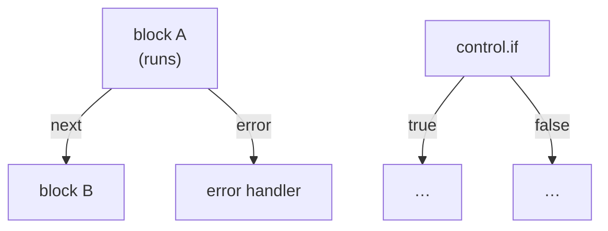
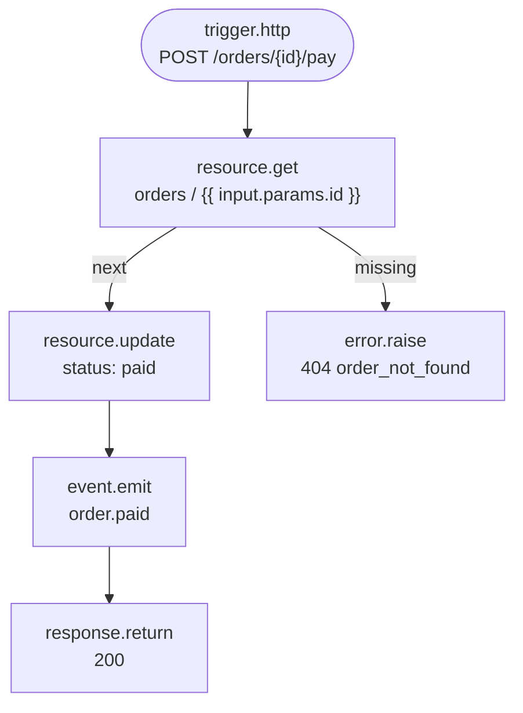
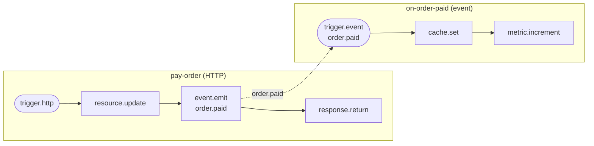
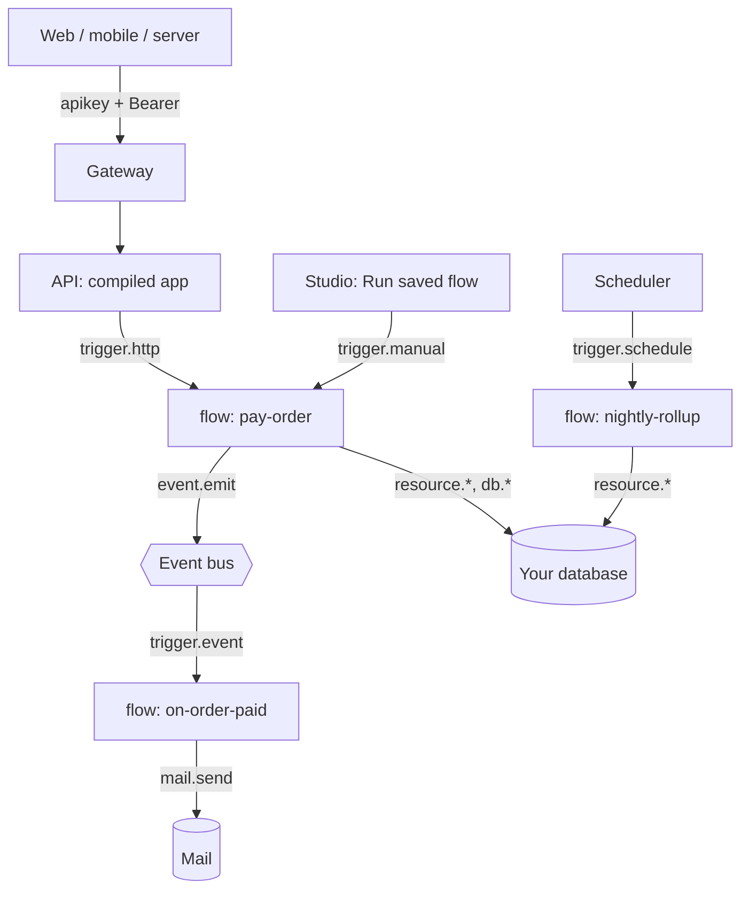
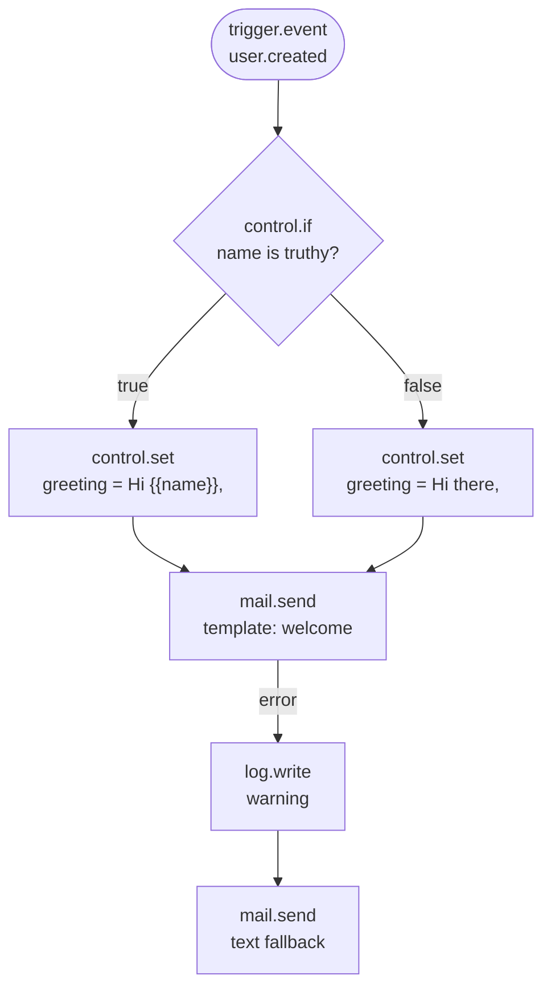
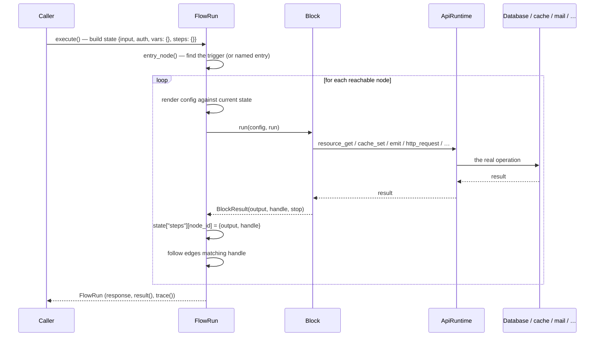

Every backend eventually needs logic that doesn't fit a resource's CRUD operations: charge a card when an order is marked paid, send a welcome email after signup, roll up a nightly report, verify a webhook signature and update three tables atomically. In most frameworks that logic lives in a request handler, a background worker, or a serverless function — code, deployed, that only your team can read.

In Pawabase it lives in a **flow**: a named graph of **blocks** connected by **edges**, stored as JSON like every other [definition](/concepts/mental-model#1-definitions-are-data), started by a **trigger**, and run by one engine wherever it's invoked — an HTTP request, an event, a schedule, a webhook, a queue, or a click in Studio.

<CardGroup cols={3}>
  <Card title="Declarative" icon="file-json">A flow is `{nodes, edges}`. Studio's visual editor reads and writes it directly; you can also author it as JSON or generate it from Python.</Card>
  <Card title="One engine, every trigger" icon="waypoints">The same graph runs whether it's called over HTTP, fired by an event, woken by a schedule, or run by hand from Studio.</Card>
  <Card title="Inspectable" icon="list-tree">Every run can be recorded with a full step-by-step trace: what ran, what it returned, how long it took, and where it failed.</Card>
</CardGroup>

This page explains what a flow is made of, why Pawabase prefers this shape over hand-written code for backend logic, and walks through a complete, realistic flow end to end. The pages that follow go deep on each part: the [visual editor](/flows/editor), [triggers](/flows/triggers), the [template language](/flows/templates), [state](/flows/state), [branching and loops](/flows/control-flow), and [errors and retries](/flows/errors-and-retries). The full catalogue of blocks lives in [data blocks](/flows/data-blocks), [resource blocks](/flows/resource-blocks), [platform blocks](/flows/platform-blocks) and the consolidated [block reference](/flows/block-reference).

## What a flow is

A flow has exactly one job: describe what should happen, as a small graph, so that the platform can run it, validate it, show it to you, and change it without a deploy. Structurally, a flow is:

```json
{
  "name": "pay-order",
  "description": "Marks an order paid and notifies the store.",
  "enabled": true,
  "timeout": 60,
  "record_runs": true,
  "definition": {
    "nodes": [ /* … */ ],
    "edges": [ /* … */ ]
  }
}
```

| Field | Type | Meaning |
| --- | --- | --- |
| `name` | string | Stable identifier. Used in URLs (`/flows/v1/<name>`), in `queue.flow` dispatches, and in the Studio sidebar. Immutable once created. |
| `description` | string | Free text, shown in Studio and in generated docs. |
| `enabled` | boolean | A disabled flow refuses every trigger with `409 flow '<name>' is disabled` rather than running. |
| `timeout` | number | Seconds the whole run may take before it's aborted with a `504`. Default `60`, maximum `900`. |
| `record_runs` | boolean | Whether each execution is written to the `flow_runs` table with its full trace. Default `true`. Turn it off for extremely high-frequency flows where you don't need history. |
| `definition.nodes` | array | The blocks, each a node in the graph. |
| `definition.edges` | array | The connections between them. |

That's the whole shape. There's no separate "workflow language" to learn beyond the blocks and the template syntax — a flow is data you could hand-write, generate from a script (as the [blueprints](/build/blueprints) do), or edit with mouse and keyboard in Studio.

<Note>
This is the same shape [`@xyflow/react`](https://reactflow.dev) (React Flow) uses for its own graphs, which is not a coincidence — Studio's canvas *is* an `@xyflow/react` canvas, and it reads and writes `definition.nodes`/`definition.edges` directly, with no translation layer in between. What you see on the canvas is exactly what's stored.
</Note>

## Nodes: one block each

Every node wraps exactly one **block** — a discrete unit of behavior like "get a record," "call an external API," or "branch on a condition." A node looks like this:

```json
{
  "id": "load",
  "position": { "x": 80, "y": 220 },
  "data": {
    "block": "resource.get",
    "config": { "resource": "orders", "id": "{{ input.params.id }}" }
  }
}
```

| Key | Meaning |
| --- | --- |
| `id` | The node's name within this flow. Must be unique. Other blocks reference this node's result as `steps.<id>.output` (see [State](/flows/state)). Renaming a node in Studio automatically rewrites every edge and reference that pointed at it. |
| `position` | `{x, y}` canvas coordinates. Cosmetic only — it has no effect on execution order, which is determined entirely by edges. |
| `data.block` | The block's key, e.g. `resource.get`, `control.if`, `mail.send`. This selects which `Block` subclass runs. |
| `data.config` | The block's configuration. Every value may contain `{{ }}` templates (see [Templates](/flows/templates)); most blocks have them rendered before `run()` is called. |
| `data.label` | Optional. A friendlier name shown on the canvas; doesn't affect `steps.<id>`. |

A block is a Python class with a `key`, a declared `config` schema (so Studio can render a form for it without any block-specific frontend code), a list of output `handles`, and an async `run(config, run)` method. Blocks never talk to your database, cache, or mail provider directly — they call a `Runtime` the host service injects, so the exact same block code runs against the real API in production and against a fake runtime in tests. [The full catalogue →](/flows/block-reference)

## Edges: connections with a handle

An edge connects one node's *output* to another node's *input*, and it does so through a **handle** — the name of the outgoing path a block chose to follow:

```json
{ "id": "load-reply", "source": "load", "target": "reply" }
{ "id": "load-missing", "source": "load", "target": "missing", "sourceHandle": "missing" }
```

| Key | Meaning |
| --- | --- |
| `id` | Free-form; used only for Studio's canvas state. |
| `source` / `target` | Node ids. |
| `sourceHandle` | Which of the source block's outputs this edge follows. Omitted (or `"next"`) means the block's default, single-output path. |

Most blocks have one handle, `next`, so most edges omit `sourceHandle` entirely. Blocks that branch declare more:

| Block | Handles | Meaning |
| --- | --- | --- |
| `control.if` | `true`, `false` | Which way the condition went. |
| `control.foreach` | `each`, `done` | `each` re-enters the loop body once per item; `done` fires once, after the last item. |
| `control.switch` | one per case, plus `default` | Named branches. |
| `resource.get` / `resource.update` | `next`, `missing` | The record did or didn't exist. |
| `http.request` | `next`, `failed` | The response status was or wasn't 2xx/3xx. |
| `validate.schema` | `next`, `invalid` (when `on_invalid: "branch"`) | The payload did or didn't pass validation. |
| `auth.user` / `auth.lookup` | `next`, `anonymous` / `missing` | Whether a user was found. |
| `policy.check` | `allowed`, `denied` | The policy's decision. |
| `cache.get` | `hit`, `miss` | Whether the key was cached. |
| any non-trigger block | …plus `error` | Optional: if you draw an edge from a block's `error` handle, exceptions from that block are caught and routed there instead of failing the run. See [Errors and retries](/flows/errors-and-retries). |

When a block finishes, the engine looks up every edge whose `source` is that node and whose `sourceHandle` matches the handle the block returned, and continues down all of them (a node can fan out to more than one target). If no edge matches the handle, that branch of the run simply ends — quietly, not as an error.



## Triggers vs. action blocks

Blocks fall into two roles:

<Tabs>
  <Tab title="Triggers">
    A **trigger** block is where a run starts. Its `trigger = True` class attribute marks it; the engine looks for the first (or a named) trigger node as the run's entry point, and its `run()` just hands back `input` — the payload that caused the run — unchanged. Everything about *when* the flow fires (which route, which event pattern, which cron expression) lives in the trigger node's `config`, which the API reads at compile time to wire up routes, event subscriptions and the scheduler.

    A flow can have more than one trigger node; when it does, whichever one is bound to the route, event, or schedule that fired becomes the entry point for that run. See [Triggers](/flows/triggers) for the full list and how the "Start from" selector works in Studio.
  </Tab>
  <Tab title="Action blocks">
    Everything else — `resource.get`, `control.if`, `mail.send`, `http.request`, `response.return`, and around fifty others — does work: it reads or writes something, evaluates a condition, or transforms a value, and returns a `BlockResult` with an `output` (stored for later blocks to read) and a `handle` (which edges to follow next).
  </Tab>
</Tabs>

## Why flows instead of code

Pawabase could have let you write a Python function for every piece of backend logic — and for genuinely code-shaped problems (a pricing algorithm, a parser, a library integration with a fussy SDK) you still can, with a [function](/functions/overview) that a flow can call through `function.call`. But for the overwhelming majority of backend logic — *when X happens, check Y, then do Z, then respond* — a flow is deliberately preferred, for the same reasons [policies](/policies/overview) are preferred over `if` statements scattered through handlers:

- **It's data, so it's inspectable without reading code.** Studio renders the graph, a non-engineer can follow the arrows, and a reviewer can diff a JSON change in a pull request without spinning up the project.
- **One engine runs it everywhere.** The identical graph executes whether it's invoked over HTTP, by an event, on a schedule, from a webhook, as a background job, or by a click of "Run saved flow" in Studio — there's no "the webhook handler does something slightly different from the cron job" drift, because there's exactly one handler: `run_flow`.
- **Every run is recorded the same way.** `record_runs: true` gives you a queryable history in `flow_runs` — status, input, output, the full step trace, logs, duration — for every trigger kind, without instrumenting anything. [Errors and retries →](/flows/errors-and-retries)
- **The platform validates it before it runs.** `validate_flow` catches unknown blocks, dangling edges, edges into handles a block doesn't have, and missing triggers *before* the flow is saved (Studio's **Validate** button, and the `POST …/flows/validate` endpoint, both call it) — not the first time a request hits a typo in production.
- **It composes with everything else that's data.** A flow's HTTP trigger references a [policy](/policies/overview) by name; its blocks read and write [resources](/resources/overview) whose fields, validation and [transformers](/transformers/overview) are themselves definitions; it can call a [function](/functions/overview) for the one piece that really does need code.

<Tip>
None of this means code is second-class. `function.call` and `queue.function` exist precisely so a flow can drop into Python for the part that's genuinely an algorithm, while keeping the *shape* of the operation — trigger, steps, branches, response — visible as a graph.
</Tip>

## A complete worked example

Here's a full, realistic flow: marking an order as paid over HTTP. It loads the order, fails cleanly if it doesn't exist, updates it, emits an event for anything downstream (email, analytics, inventory) to react to, and replies with the result. This is the `PAY_FLOW` used throughout the flow engine's own test suite, reproduced exactly.

```json pay-order.json
{
  "name": "pay-order",
  "description": "POST /orders/{id}/pay — marks an order paid and announces it.",
  "enabled": true,
  "timeout": 60,
  "record_runs": true,
  "definition": {
    "nodes": [
      {
        "id": "start",
        "data": { "block": "trigger.http", "config": { "method": "POST", "path": "/orders/{id}/pay" } }
      },
      {
        "id": "load",
        "data": { "block": "resource.get", "config": { "resource": "orders", "id": "{{ input.params.id }}" } }
      },
      {
        "id": "paid",
        "data": {
          "block": "resource.update",
          "config": { "resource": "orders", "id": "{{ input.params.id }}", "data": { "status": "paid" } }
        }
      },
      {
        "id": "event",
        "data": {
          "block": "event.emit",
          "config": {
            "event": "order.paid",
            "payload": {
              "id": "{{ steps.load.output.id }}",
              "total": "{{ steps.load.output.total }}"
            }
          }
        }
      },
      {
        "id": "reply",
        "data": {
          "block": "response.return",
          "config": {
            "status": 200,
            "body": { "paid": true, "order": "{{ steps.paid.output }}", "by": "{{ auth.user_id }}" }
          }
        }
      },
      {
        "id": "missing",
        "data": {
          "block": "error.raise",
          "config": { "status": 404, "message": "no such order", "code": "order_not_found" }
        }
      }
    ],
    "edges": [
      { "id": "start-load", "source": "start", "target": "load" },
      { "id": "load-paid", "source": "load", "target": "paid" },
      { "id": "load-missing", "source": "load", "target": "missing", "sourceHandle": "missing" },
      { "id": "paid-event", "source": "paid", "target": "event" },
      { "id": "event-reply", "source": "event", "target": "reply" }
    ]
  }
}
```



### Reading it step by step

<Steps>
  <Step title="trigger.http starts the run">
    The API compiled `method: POST, path: /orders/{id}/pay` into a real route at build time (see [The mental model](/concepts/mental-model#2-each-environment-compiles-into-an-app)). When a matching request arrives, a `FlowRun` is created with `input` set to the request payload — `{"params": {"id": "..."}, "body": {...}, "query": {...}}` — and `auth` set to the caller's policy context, exactly like the context a [policy](/policies/overview#what-a-policy-can-see) would see. `trigger.http`'s own `run()` just returns that `input` unchanged, so `steps.start.output` and `input` hold the same value.
  </Step>
  <Step title="resource.get loads the order">
    `{{ input.params.id }}` reads the `:id` path parameter. `resource.get` calls `runtime.resource_get("orders", id)`. If the record exists, it follows `next` with the record as its output; if not, it follows `missing` — with **no exception raised**. That's why the graph has two edges out of `load`: one to `paid` (found), one to `missing` (not found), rather than a single `next` edge and a try/catch.
  </Step>
  <Step title="Two branches, two endings">
    On the `missing` path, `error.raise` immediately fails the run with a `404` and the message `"no such order"` — this is a **deliberate** failure a flow author chose, not an unhandled bug, and it shows up in the trace as any block failure would. [Errors and retries →](/flows/errors-and-retries) On the happy path, `resource.update` writes `{"status": "paid"}` onto the same record and its output — the updated row — becomes `steps.paid.output`.
  </Step>
  <Step title="event.emit tells the rest of the platform">
    Nothing downstream is wired directly into this flow. Instead it emits `order.paid` with a payload built from the record *loaded earlier* (`steps.load.output`), not the one just updated — a common and deliberate pattern: read fields you know are unchanged (like `total`) from wherever they're most convenient, since every finished step's output stays addressable for the rest of the run. A separate flow, `on-order-paid` below, or a webhook subscription, or a realtime channel, reacts to `order.paid` independently. This is how Pawabase keeps "mark it paid" decoupled from "everything that should happen when it's paid" — see [Events](/events/overview).
  </Step>
  <Step title="response.return ends the run and answers the request">
    `body` mixes three different sources in one object: a literal (`true`), a previous step's output (`steps.paid.output`), and the caller's identity (`auth.user_id`) — all through templates. `response.return` has no outgoing handles; it's always a terminal block. Whatever it sets becomes the flow's `FlowResponse`, and the run stops.
  </Step>
</Steps>

### A second flow that reacts to the first

Because `pay-order` only *emits* `order.paid`, a second, completely independent flow can subscribe to it — this is `NOTIFY_FLOW` from the same test suite:

```json on-order-paid.json
{
  "name": "on-order-paid",
  "definition": {
    "nodes": [
      { "id": "start", "data": { "block": "trigger.event", "config": { "event": "order.paid" } } },
      {
        "id": "store",
        "data": {
          "block": "cache.set",
          "config": { "key": "last-paid", "value": "{{ input.event.payload.id }}", "ttl": 60 }
        }
      },
      { "id": "metric", "data": { "block": "metric.increment", "config": { "name": "orders.paid" } } }
    ],
    "edges": [
      { "id": "start-store", "source": "start", "target": "store" },
      { "id": "store-metric", "source": "store", "target": "metric" }
    ]
  }
}
```

Notice the event's payload arrives at `input.event.payload.id`, not `input.id` — the trigger's `input` for `trigger.event` is the event envelope, not the bare payload. [Triggers →](/flows/triggers#triggerevent) covers this shape precisely.



## How a run actually executes

At a mechanical level, `FlowRun.execute()` finds the entry node (the flow's single trigger, or the one named by `entry` when several triggers exist), then walks the graph depth-first with an explicit stack — not Python recursion — so a very long chain of blocks doesn't hit a stack-depth limit. For each node it:

1. Deep-copies the node's `config` so nothing in the stored definition can be mutated by a run.
2. Renders every `{{ }}` template in that config against the run's current state, unless the block opted into `raw_config` (control blocks that need to see the *unrendered* condition, so they can decide what to render and when).
3. Calls the block's `run(config, self)`.
4. Records a `Step` — node id, block key, duration, the handle returned, the output, any error — into the run's trace.
5. Stores the output at `state["steps"][node_id]`, so later blocks can read it.
6. Follows every edge whose `sourceHandle` matches the returned handle.

A run stops when a block sets `stop=True` (as `response.return` and `control.stop` do), when it runs out of reachable nodes, when it exceeds `MAX_STEPS` (10,000 — a safety net against accidental infinite graphs), or when its total wall-clock time exceeds the flow's `timeout`.

<Note>
`FlowRun.execute()` raises `FlowError` on failure — including a flow that runs past its `timeout` (HTTP `504`, code `timeout`) — so callers (the HTTP route, the job runner, the event processor) get a consistent, typed failure to translate into a response, a retry decision, or a dead-letter, instead of a raw exception. See [Errors and retries](/flows/errors-and-retries).
</Note>

## Where flows fit in the platform



Flows sit exactly where [The mental model](/concepts/mental-model) says custom logic sits: compiled from a definition, guarded at their entry by a [policy](/policies/overview), and reading/writing your data through the same runtime resource operations and raw SQL use everywhere else. A flow never talks to your database directly with its own connection — it always goes through `runtime.resource_*` or the read-only `db.query`/`db.transaction` blocks, which is what keeps events, caching and validation consistent regardless of what triggered the write.

## Flows compared to writing a handler by hand

| | Hand-written handler | Pawabase flow |
| --- | --- | --- |
| Where it lives | A file in your codebase, deployed with the rest of your service | A JSON definition, saved instantly, versioned per environment |
| Who can read it | Engineers who can read the language | Anyone who can follow arrows on a canvas, plus engineers reading the JSON |
| Multiple entry points (HTTP + event + cron) | Usually three separate functions that must be kept in sync | One graph, one entry-point selector |
| Change without a deploy | No | Yes — saving a flow takes effect on the next request |
| Built-in run history | You build your own logging | `flow_runs` with input, output, trace, logs, duration for every trigger kind |
| Where retries/branches are visible | Buried in `try`/`except` and `if` | Named handles (`error`, `true`/`false`, `missing`) drawn as edges |
| Escape hatch for real algorithms | N/A, it's already code | `function.call` / `queue.function` into a [function](/functions/overview) |

## Common mistakes

<AccordionGroup>
  <Accordion title="Expecting a missing resource.get to raise an exception">
    It doesn't. `resource.get`, `resource.update` and `auth.lookup` follow a `missing` handle instead of throwing. If you don't draw an edge out of `missing`, that branch of the run just ends quietly — the flow doesn't fail, and nothing downstream runs. Always wire `missing` explicitly, usually to `error.raise` or a `response.return` with a `404`.
  </Accordion>
  <Accordion title="Reaching for auth to mean what a policy already decided">
    A flow's `trigger.http` node has its own `policy`, evaluated *before* the run starts — [Policies: where they apply](/policies/overview#where-policies-apply). Everything inside the flow runs with the platform's own service rights (`resource_create`, `db.transaction`, etc. don't re-check policies); use `policy.check` or `auth.require` inside the flow only when you need a *finer* decision than the trigger's gate already made.
  </Accordion>
  <Accordion title="Assuming node order in the JSON matters">
    It doesn't. Execution order is entirely determined by edges from the entry node. `nodes` can be listed in any order; Studio just lays them out top-down by graph depth for readability.
  </Accordion>
  <Accordion title="Forgetting a flow needs at least one trigger block">
    `validate_flow` refuses to save a graph with zero nodes whose `trigger = True`, with the message `"a flow needs a trigger block"`. Even a flow you'll only ever run by hand from Studio needs a `trigger.manual` node.
  </Accordion>
</AccordionGroup>

## The full block catalogue, by category

A flow is only as expressive as its blocks, and Pawabase ships a broad one — roughly fifty blocks out of the box, every one of them a thin, typed wrapper around a platform capability (see [The `Runtime` protocol](#the-runtime-protocol) below). This is the map; each block's exact configuration keys, output shape and handles are documented in depth on the three catalogue pages.

<Tabs>
  <Tab title="Triggers">
    Where a run starts. Covered in full on [Triggers](/flows/triggers).
    | Key | Fires when |
    | --- | --- |
    | `trigger.http` | A request reaches a route bound to this flow |
    | `trigger.event` | A platform event matching a name or pattern is published |
    | `trigger.schedule` | A cron expression or interval elapses |
    | `trigger.resource` | A resource is created, updated or deleted |
    | `trigger.webhook` | A verified inbound webhook is received |
    | `trigger.realtime` | A client publishes to a realtime channel |
    | `trigger.job` | The flow is dispatched as a background job (`queue.flow`) |
    | `trigger.manual` | Started by hand from Studio or the platform API |
  </Tab>
  <Tab title="Control">
    Branching, looping, variables, delays, retries and stopping. Covered in full on [Branching and loops](/flows/control-flow).
    | Key | Does |
    | --- | --- |
    | `control.if` | Follows `true` or `false` from a condition |
    | `control.switch` | Follows a handle named by a value, or `default` |
    | `control.foreach` | Runs a body once per item (sequential, `item`/`index` in scope) |
    | `control.set` | Sets `vars.<name>` for later blocks |
    | `control.merge` | Merges several objects (later keys win) |
    | `control.delay` | Waits up to 300 seconds |
    | `control.stop` | Ends the run without a response |
    | `control.retry` | Re-runs a body with backoff until it succeeds |
  </Tab>
  <Tab title="Data">
    Transformation, validation, JSON, maths, ids, hashing, time. Covered in full on [Data blocks](/flows/data-blocks).
    | Key | Does |
    | --- | --- |
    | `transform.map` | Applies a [transformer](/transformers/overview) to a value |
    | `transform.template` | Builds a value from a template |
    | `transform.pick` | Keeps only some keys of an object (or list of objects) |
    | `validate.schema` | Validates a value against field definitions |
    | `json.parse` / `json.stringify` | Between JSON text and values |
    | `math.calculate` | add, subtract, multiply, divide, round, min, max, sum, average |
    | `util.id` | A UUID4 or random token |
    | `crypto.hash` | SHA-256 / SHA-512 / HMAC-SHA256 |
    | `time.now` | The current time, in `iso`, `date` or `unix` form |
  </Tab>
  <Tab title="Resources and data">
    Resource CRUD and the raw database. Covered in full on [Resource blocks](/flows/resource-blocks).
    | Key | Does |
    | --- | --- |
    | `resource.list` / `.get` / `.create` / `.update` / `.delete` | The five resource operations |
    | `db.query` | A single **read-only** SQL statement |
    | `db.transaction` | Several resource writes, atomically |
  </Tab>
  <Tab title="Platform">
    Auth, cache, events, jobs, realtime, storage, mail, outbound HTTP, code, observability, responses. Covered in full on [Platform blocks](/flows/platform-blocks).
    | Key | Does |
    | --- | --- |
    | `auth.require` / `auth.user` / `auth.lookup` / `policy.check` | Identity and access inside a flow |
    | `cache.get` / `.set` / `.delete` / `.invalidate` | The cache |
    | `event.emit` | Publishes a platform event |
    | `queue.flow` / `queue.function` | Runs a flow or function as a background job |
    | `realtime.publish` | Sends to a realtime channel |
    | `storage.put` / `.read` / `.signed_url` / `.delete` | A storage bucket |
    | `mail.send` | An email |
    | `http.request` | Calls an external HTTP API |
    | `webhook.send` | Delivers to subscribed outbound webhooks |
    | `secret.get` | Loads a secret into `vars` |
    | `function.call` | Calls a Python function inline |
    | `log.write` / `metric.increment` | Observability |
    | `response.return` / `error.raise` | End the run |
  </Tab>
</Tabs>

## The `Runtime` protocol

Every block's `run()` receives two arguments: its rendered `config`, and the `FlowRun` itself (through which it reaches `run.runtime`, `run.state`, and helpers like `run.render()`). Blocks never import a database driver, a cache client, or an SMTP library — they only ever call methods on a `Runtime`, an interface with one method per platform capability:

```python
class Runtime(Protocol):
    # data
    async def resource_list(self, resource, *, filters=None, sort=None, limit=50, offset=0) -> dict: ...
    async def resource_get(self, resource, record_id) -> dict | None: ...
    async def resource_create(self, resource, data) -> dict: ...
    async def resource_update(self, resource, record_id, data) -> dict | None: ...
    async def resource_delete(self, resource, record_id) -> bool: ...
    async def db_query(self, sql, params=None) -> list[dict]: ...
    async def db_transaction(self, operations) -> list: ...
    # cache
    async def cache_get(self, key) -> Any: ...
    async def cache_set(self, key, value, ttl=None, tags=None) -> None: ...
    # events, queues, realtime
    async def emit(self, name, payload) -> str: ...
    async def dispatch_flow(self, flow, input, *, delay=0, queue=None) -> str: ...
    async def publish(self, channel, event, payload) -> dict: ...
    # storage, mail, outbound
    async def storage_put(self, bucket, key, content, content_type="") -> dict: ...
    async def send_mail(self, to, subject, *, text=None, html=None, template=None, data=None) -> dict: ...
    async def http_request(self, method, url, *, headers=None, json=None, ...) -> dict: ...
    # platform
    async def secret(self, name) -> str | None: ...
    async def call_function(self, name, input) -> Any: ...
    async def identity_user(self, user_id) -> dict | None: ...
    async def check_policy(self, ref, context) -> bool: ...
    async def log(self, level, message, data=None) -> None: ...
    async def metric(self, name, value=1.0, tags=None) -> None: ...
```

In the API this interface is implemented by `ApiRuntime`, whose methods land on real Sillo capabilities — Resource stores for `resource_*`, `sillo.cache` for the cache methods, `sillo.events` for `emit`, `sillo.work` for job dispatch, Angula for `publish`, `sillo.storage` for buckets, `sillo.mail` for `send_mail`, and Sillo's HTTP client for `http_request`. In tests, a fake `Runtime` stands in, so block logic can be tested with no network, no database and no real mail server. This split is *why* a flow behaves identically whether it's exercised by an integration test, run by hand in Studio, or serving live traffic: the block code is the same, only what's on the other side of `Runtime` differs.

<Note>
`db_query` is deliberately narrower than a raw SQL escape hatch. `ApiRuntime.db_query` calls `is_read_only(sql)` before running anything and refuses with `400 write_refused` if the statement isn't a single `select`/`with`/`explain`/`pragma`/`show`/`describe` — no semicolons, no `insert`/`update`/`delete`/`drop`/`alter`/`create`/`truncate`/`grant`/`attach` anywhere in it. Writes always go through `resource.*` blocks (so events and validation fire) or `db.transaction` (for atomic multi-row writes). [Resource blocks →](/flows/resource-blocks#dbquery-and-dbtransaction)
</Note>

## Operations belong to the flow, not to a request

Because `resource.create`, `resource.update`, `db.transaction` and friends call the runtime directly rather than going through the same policy-gated route a client would hit, **writes made inside a flow run with the platform's own service rights** and don't re-evaluate resource policies. This is the same rule described in [Policies FAQ: are policies evaluated for flows and functions writing data?](/policies/overview#faq) — the security boundary is the flow's own *entry* (its trigger's `policy`, or an `auth.require`/`policy.check` block you add deliberately inside the graph), not each individual write it makes once running. Keep this in mind when writing a flow that's reachable by more than one kind of caller: gate the trigger tightly, and add `policy.check` for any decision finer than "may this caller invoke the flow at all."

## Environments, versioning and promotion

Flows are definitions like any other, which means they follow the platform's general rules for [environments and promotion](/operate/environments-and-promotion):

- A flow is saved **per environment**. `development` and `production` can have entirely different flow definitions under the same name, which is how you iterate on automation safely — build and test `pay-order` in `development`, then promote it once it's right.
- Saving a flow (create, update, or toggling `enabled`) increments that environment's version. The compiled app picks up the change on the next request; other services refresh their cached environment state within seconds. No restart, no deploy.
- `name` is immutable once a flow is created — it's referenced from routes, `queue.flow` calls, and Studio URLs, so renaming would silently break all three. Delete and recreate under a new name if you truly need to rename one; check first what references the old name.
- Promotion copies the flow's `definition` verbatim into the target environment. If a flow references a resource, policy, secret or mail template that doesn't exist yet in that environment, promote those first — the flow will save, but any block touching the missing definition will fail at run time with a clear error rather than at promotion time.

## Testing a flow before you trust it

Three levels, roughly in order of how early you'd use them:

1. **Validate**, from Studio or `POST /flows/validate` — catches structural problems (unknown blocks, dangling edges, edges into handles a block doesn't declare, no trigger) with zero side effects, against a definition that hasn't even been saved yet.
2. **Run saved flow**, from Studio's Run panel or `POST …/flows/{name}/run` — actually executes the *saved* version against real data, with an optional `entry` (which trigger to start from) and an optional `as_user` auth context, and returns the full trace. This is a real execution: if a block writes a record, that record is written. [The visual editor →](/flows/editor#testing-a-saved-flow)
3. **Trigger it for real** — call the route, publish the event, wait for the schedule — and inspect the resulting row in `flow_runs` (when `record_runs` is on) from Studio's **Events & runs** page or `GET …/flow-runs`.

<Warning>
"Run saved flow" always runs the version currently **saved** to the environment, not whatever's unsaved on the canvas. Save first if you've just changed something you want to test.
</Warning>

## Limits worth knowing up front

| Limit | Value | Where it's enforced |
| --- | --- | --- |
| Flow `timeout` | 1–900 seconds, default 60 | `FlowRun.execute()`; exceeding it raises `504 timeout` |
| Steps per run | 10,000 | `FlowRun._execute_node`; guards against accidental infinite graphs |
| `control.foreach` items | 10,000 | `ForEach.run`; raises `too_many_items` beyond that |
| `control.foreach` concurrency | fixed at 1 (sequential) | the block's `concurrency` field caps at `maximum: 1` |
| `control.delay` | 0–300 seconds | longer waits belong in a delayed `queue.flow`/`queue.function` dispatch instead |
| `control.retry` attempts | 1–10, default 3 | `Retry.run`, backed by Sillo's `async_retry` helper |
| `function.call` nesting depth | 8 | `ApiRuntime.call_function`; raises `too_deep` beyond that |
| Trace output per step | 2,000 characters | `Step.to_dict`; longer outputs are truncated with `…` in the trace (not in what later blocks actually receive) |

## FAQ

<AccordionGroup>
  <Accordion title="Can a flow call another flow synchronously and wait for its result?">
    Not directly. `queue.flow` **dispatches** another flow as a background job and returns immediately with `{"job_id": ...}` — it doesn't wait for or return that flow's output. If you need synchronous reuse of logic across flows, pull the shared part into a [function](/functions/overview) and call it inline with `function.call`, which does return its result.
  </Accordion>
  <Accordion title="Can one flow have several HTTP triggers, for different routes?">
    Yes — a flow can have as many trigger nodes of any kind as you like, including several `trigger.http` nodes for different methods or paths. Each is compiled into its own route, and each run's `entry` is set to whichever trigger fired. See [Triggers: entry point selection](/flows/triggers#entry-point-selection-with-multiple-triggers).
  </Accordion>
  <Accordion title="Do flows scale? What happens under load?">
    A flow triggered by HTTP runs synchronously in the request, so it scales exactly the way the rest of your API does. A flow triggered by an event, schedule, or `queue.flow`/`queue.function` runs as a background job through Sillo's work queue, with its own concurrency independent of request traffic. Either way, a flow's cost is the sum of the blocks it actually executes — a `control.if` that skips a branch doesn't pay for it.
  </Accordion>
  <Accordion title="Is there a way to share logic between flows besides queue.flow and function.call?">
    Not as a first-class "subflow" block today. The two supported patterns are: dispatch another flow as an independent background job (`queue.flow`, fire-and-forget), or factor the shared logic into a [function](/functions/overview) and call it inline (`function.call`, synchronous, returns a value). Duplicate a short sequence of blocks across a couple of flows rather than reaching for premature abstraction; if the duplication grows, that's the signal to extract a function.
  </Accordion>
  <Accordion title="What happens to a flow's writes if a later block in the same run fails?">
    Nothing is rolled back automatically — each `resource.*` block commits independently, the moment it runs, exactly as a normal API request would. If you need several writes to succeed or fail together, use `db.transaction`, which applies a list of resource operations atomically and only fires their `after_write` effects (events, cache invalidation) once the transaction has actually committed. [Errors and retries →](/flows/errors-and-retries#partial-writes-and-why-flows-dont-auto-rollback)
  </Accordion>
</AccordionGroup>

## A second worked example: welcome email with a fallback

The `pay-order` flow above is a clean, linear example. Real flows usually branch. Here's a signup-triggered flow that looks up a user, tries to send a branded welcome email through a template, and falls back to a plain one if the template send fails — using `control.if`, `http.request`'s `failed` handle indirectly via `mail.send`'s underlying behavior, and `error` handles throughout.

```json welcome-email.json
{
  "name": "welcome-email",
  "description": "On user.created: send a welcome email, falling back to plain text if the templated send fails.",
  "enabled": true,
  "timeout": 30,
  "record_runs": true,
  "definition": {
    "nodes": [
      { "id": "start", "data": { "block": "trigger.event", "config": { "event": "user.created" } } },
      {
        "id": "has_name",
        "data": { "block": "control.if", "config": { "condition": { "truthy": "$input.event.payload.name" } } }
      },
      {
        "id": "greeting_named",
        "data": { "block": "control.set", "config": { "values": { "greeting": "Hi {{ input.event.payload.name }}," } } }
      },
      {
        "id": "greeting_default",
        "data": { "block": "control.set", "config": { "values": { "greeting": "Hi there," } } }
      },
      {
        "id": "send",
        "data": {
          "block": "mail.send",
          "config": {
            "to": "{{ input.event.payload.email }}",
            "subject": "Welcome!",
            "template": "welcome",
            "data": { "greeting": "{{ vars.greeting }}" }
          }
        }
      },
      {
        "id": "fallback",
        "data": {
          "block": "mail.send",
          "config": {
            "to": "{{ input.event.payload.email }}",
            "subject": "Welcome!",
            "text": "{{ vars.greeting }} welcome aboard."
          }
        }
      },
      {
        "id": "log_failure",
        "data": {
          "block": "log.write",
          "config": {
            "level": "warning",
            "message": "templated welcome email failed, sent plain text instead",
            "data": { "email": "{{ input.event.payload.email }}" }
          }
        }
      }
    ],
    "edges": [
      { "id": "start-has_name", "source": "start", "target": "has_name" },
      { "id": "has_name-named", "source": "has_name", "target": "greeting_named", "sourceHandle": "true" },
      { "id": "has_name-default", "source": "has_name", "target": "greeting_default", "sourceHandle": "false" },
      { "id": "named-send", "source": "greeting_named", "target": "send" },
      { "id": "default-send", "source": "greeting_default", "target": "send" },
      { "id": "send-error", "source": "send", "target": "log_failure", "sourceHandle": "error" },
      { "id": "log-fallback", "source": "log_failure", "target": "fallback" }
    ]
  }
}
```



This example demonstrates three things worth internalizing before you build your own flows:

1. **Two branches can converge on the same next node.** Both `greeting_named` and `greeting_default` have an edge into `send` — a node doesn't need exactly one incoming edge, and `send` runs once regardless of which branch produced `vars.greeting`.
2. **An `error` handle is opt-in, per block.** Only `send` has one drawn; if `fallback`'s own `mail.send` also fails, there's no `error` edge out of it, so the run fails there — which is the right behavior, since there's no further fallback to attempt.
3. **`control.set` is a cheap way to make branches converge on a single variable name**, rather than templating `steps.greeting_named.output` vs. `steps.greeting_default.output` conditionally downstream. See [State: vars](/flows/state#vars-values-set-with-controlset).

## Anatomy of a run, end to end



Every block sees the *same* `run.state` dictionary — there's no per-block sandbox — so a block early in the graph can write to `vars` and a block much later can read it, and every finished step's output stays addressable by `steps.<id>.output` for the rest of the run, not just the block immediately after it. [State →](/flows/state) goes deep on exactly what's in `run.state` and how long it lives.

## Building a flow: the short version

The full editing experience — palette, canvas, inspector, run panel — is covered in depth on [The visual editor](/flows/editor). In outline, building a flow in Studio looks like this:

<Steps>
  <Step title="Create the flow">Studio → **Build → Flows → New flow**. Give it a name (permanent) and a description.</Step>
  <Step title="Add a trigger">Drag a trigger block from the palette onto the empty canvas — usually `trigger.http` or `trigger.event`. Configure its method/path or event pattern in the inspector.</Step>
  <Step title="Add action blocks and connect them">Drag blocks onto the canvas, connect their handles to build the graph, and fill in each block's configuration with literal values and `{{ }}` templates.</Step>
  <Step title="Validate">Click **Validate** to catch structural problems before saving — unknown blocks, dangling edges, a missing trigger.</Step>
  <Step title="Save">Saving commits the definition to this environment and bumps its version. The flow is live on the next matching request.</Step>
  <Step title="Test">Use **Run saved flow** with sample input (and, if you need to test as a specific caller, an `as_user` auth context) to see the full trace before you trust it with real traffic.</Step>
</Steps>

## Glossary

| Term | Meaning |
| --- | --- |
| **Flow** | A named, saved graph of blocks: `{name, description, enabled, timeout, record_runs, definition: {nodes, edges}}`. |
| **Block** | A class implementing one discrete operation (`resource.get`, `control.if`, …), described by a `key`, `config` schema, `handles`, and an async `run()`. |
| **Node** | One placement of a block inside a specific flow's `definition.nodes`, with its own `id`, `position`, and `config`. |
| **Edge** | A directed connection `source → target` through a named `sourceHandle`, in `definition.edges`. |
| **Handle** | The name of one of a block's possible outputs (`next`, `true`/`false`, `missing`, `error`, …), used to pick which edges to follow. |
| **Trigger** | A block with `trigger = True`; where a run begins. A flow needs at least one. |
| **Entry node** | The specific trigger node a given run actually started from — the flow's only trigger, or the one named by `entry` when it has several. |
| **Run** (`FlowRun`) | One execution: its `state`, its `steps` trace, and (if it was triggered by HTTP) its `response`. |
| **Step** | One executed block's record in the trace: `node`, `block`, `duration_ms`, `handle`, `output`, `error`. |
| **`vars`** | A run-scoped dictionary set with `control.set`, readable as `{{ vars.<name> }}` from anywhere later in the same run. |
| **`steps.<id>.output`** | The recorded output of a node that has already run in this execution. |
| **Registry** (`BlockRegistry`) | The process-wide catalogue of every known block, filled from Pawabase's built-ins plus any `pawabase.blocks` entry points from installed packages. |
| **Runtime** | The interface (`resource_get`, `cache_set`, `emit`, …) blocks use to reach platform capabilities, implemented for real by `ApiRuntime` and faked in tests. |

## Flows, functions and routes: which to reach for

Pawabase gives you three ways to run custom logic, and they compose rather than compete:

| | Flow | [Function](/functions/overview) | [Custom route](/routes/overview) with a Python handler |
| --- | --- | --- | --- |
| Authored as | A graph of blocks (Studio, or generated JSON) | Python, `@function(...)` | Python, a Sillo router |
| Best for | Multi-step automation with clear branches: validate → write → notify → respond | A genuine algorithm: pricing, parsing, a fussy SDK | Logic that needs full framework access Sillo itself provides |
| Callable from | HTTP, events, schedules, webhooks, realtime, jobs, Studio | `function.call` (inline, synchronous) or `queue.function` (background) | Only HTTP |
| Visible without reading code | Yes — the canvas | No | No |
| Run history built in | Yes (`flow_runs`, when `record_runs` is on) | Only when dispatched as a job | No |
| Where it lives | Saved per environment, in Studio | Project code (`code/<project>/functions/`) | Project code (`code/<project>/routes.py`) |

A common, healthy pattern: a flow handles the *shape* of an operation (trigger → validate → branch → write → notify → respond), and calls out to a function with `function.call` for the one step that's genuinely an algorithm rather than a sequence of platform operations — exactly like `submit_review` in the [commerce blueprint](/build/blueprints#commerce) uses plain blocks for everything except the one thing (`db.query` for a duplicate/verified-purchase check) that reads more naturally as SQL than as a chain of resource calls.

## Debugging a flow that isn't doing what you expect

<Steps>
  <Step title="Check whether it ran at all">
    Studio's **Events & runs** page (or `GET …/flow-runs?flow=<name>`) lists every recorded run, newest first, with `status`. If there's no row, the trigger never fired — check the route path, the event name/pattern, or the schedule expression, not the flow's internals.
  </Step>
  <Step title="Open the run and read the trace top to bottom">
    Each step shows its `handle` and `duration_ms`; a step whose `handle` doesn't match the edge you expected to follow is usually the actual bug — a condition that evaluated the opposite of what you assumed, most often because of a template that silently rendered to `None`. [Templates: missing paths →](/flows/templates#missing-paths-resolve-to-none)
  </Step>
  <Step title="Reproduce it with Run saved flow">
    Feed the same `input` (and, if the original run was authenticated, a matching `as_user`) into Studio's Run panel to get a fresh trace without waiting for the real trigger to fire again. [The visual editor →](/flows/editor#testing-a-saved-flow)
  </Step>
  <Step title="Check field-by-field, not block-by-block">
    Click a node in the canvas after a test run to see its **Last run** output in the inspector — often the block itself worked exactly right, and the surprise is one field of its output feeding the wrong template further down the graph.
  </Step>
</Steps>

## Designing flows that stay readable

A flow with forty nodes and no discipline is as unreadable as a forty-branch `if`/`elif` chain. A few habits keep flows legible as they grow:

<Steps>
  <Step title="Name nodes for what they do, not what block they use">
    `load_order` reads better than `resource_get_1`. Studio auto-generates ids from the block name on drop (`get`, `get2`, …); rename them as you build. Because `steps.<id>.output` is how every later block reads a result, a good id doubles as documentation everywhere it's referenced.
  </Step>
  <Step title="Put the happy path down the middle, error branches to the side">
    Studio lays nodes out by graph depth automatically, but you can still drag nodes to keep the "everything went fine" chain visually straight and error/`missing` branches visibly peeling off — the moment a reviewer has to trace a branch to understand whether it's the common case or the exception, the flow has gotten harder to review than it needs to be.
  </Step>
  <Step title="Prefer several small flows over one flow with many triggers">
    A single flow *can* have `trigger.http`, `trigger.event` and `trigger.schedule` nodes all at once, each becoming its own entry point into a shared tail of blocks — useful when three different things genuinely produce the same follow-up (see [Triggers: entry point selection](/flows/triggers#entry-point-selection-with-multiple-triggers)). But when the *branches themselves* diverge quickly after each trigger, two flows that each emit an event the other can subscribe to are usually easier to reason about than one large flow with three unrelated fronts.
  </Step>
  <Step title="Push repeated tails into their own flow, dispatched with queue.flow">
    If several flows end with "commit stock, update lifetime value, email a receipt, notify the store," give that tail its own flow (triggered on the event the others emit, like `order.paid` in the [worked example](#a-complete-worked-example)) rather than copy-pasting the same dozen blocks into each one.
  </Step>
  <Step title="Use control.set to name a value once, not five templates">
    If three later blocks all need the same computed value, compute it once with `control.set` (or `math.calculate`) and reference `{{ vars.<name> }}` from all three, instead of repeating the same `{{ steps.a.output.x | int }}` expression — cheaper to read, and only one place to fix if the upstream shape changes. [State: vars →](/flows/state#vars-values-set-with-controlset)
  </Step>
</Steps>

## Idempotency: flows can run more than once

Nothing about the flow engine guarantees a given trigger fires exactly once. Events can be redelivered, webhooks can retry, a schedule and a manual re-run can overlap, and a client can legitimately submit the same request twice after a timeout. Flows that write data should be written defensively:

- **Prefer natural keys over blind creates.** `submit_review` in the commerce blueprint checks for an existing review by `product_id` + `user_id` (`resource.list` with those filters, then `control.if` on `truthy: "$steps.dupe.output.total"`) before creating one, and fails with `409 already_reviewed` on a repeat rather than silently duplicating.
- **Use `resource.update` to converge on a state, not `resource.create` to append one.** `pay-order`'s core write is `resource.update` on the order's existing row to `{"status": "paid"}` — running the flow twice against an already-paid order just writes the same status again, harmlessly, rather than creating a second "paid" record.
- **Guard event-triggered writes with a status check when the event might be redelivered.** The commerce blueprint's `payment_gateway` flow explicitly checks `done_before` (`{"eq": ["$steps.find.output.data.0.status", "captured"]}`) and routes a repeat notification from the payment gateway to a `log.write` marked `"duplicate gateway notification ignored"` instead of capturing the payment a second time.
- **`db.transaction` is atomic, not idempotent** — running the same transaction twice applies it twice. Idempotency is a property you design into the operations, not something the transaction primitive gives you for free.

## Security considerations specific to flows

- **A flow's trigger is its only gate.** Everything inside runs with service rights (see [Operations belong to the flow, not to a request](#operations-belong-to-the-flow-not-to-a-request)), so an under-guarded `trigger.http` — `policy: null` defaulting to `authenticated` per [Policies: where they apply](/policies/overview#where-policies-apply), or worse, a shorthand you didn't mean — is the entire exposure, not each block inside.
- **Secrets never enter the trace.** `secret.get` stores the resolved value into `vars.<name>` for the rest of the run to use, but the *secret block's own output* is `{"name": ..., "loaded": true}` — the value itself is never recorded as a step's output, so it can't leak through `flow_runs.trace` or Studio's trace viewer. Downstream blocks that use `{{ vars.<name> }}` (say, in an `http.request` header) still pass the real value at call time; just be mindful that *that* block's own output (the HTTP response) could echo it back if the remote API is careless, and would then be recorded.
- **`auth` in a flow's state is exactly the policy context.** Anything a [policy could see](/policies/overview#what-a-policy-can-see) about the caller — `roles`, `permissions`, `org`, `aal` — a flow can read too, at `{{ auth.* }}`. Treat it the same way you'd treat it in a policy: safe to branch on, not safe to echo into a response verbatim if it contains anything sensitive like `claims`.
- **`db.query`'s read-only enforcement is a safety net, not a substitute for careful SQL.** It stops an accidental `UPDATE` from a copy-pasted query, but a `SELECT` can still be an expensive one; keep the same discipline (indexes, `LIMIT`, parameterization with `?`/`$1` placeholders — never string-interpolated values) you'd use anywhere else.

## Compared with general-purpose automation tools

If you've used Zapier, n8n, Make, or a workflow engine like Temporal, flows will look immediately familiar — a canvas, nodes, connections — but the differences matter for what a flow is *for*:

<Tabs>
  <Tab title="Zapier / Make / n8n">
    These tools connect *external* SaaS products together: "when a Typeform is submitted, add a Google Sheets row." Pawabase flows automate *your own backend*: they read and write your resources, your database, your storage, with no per-execution pricing and no data leaving your environment to a third-party orchestrator. A flow can still call out to an external API with `http.request` or `webhook.send`, but that's one block among many operating on your own data model — not the tool's whole reason to exist.
    | | Zapier / n8n | Pawabase flows |
    | --- | --- | --- |
    | Primary use | Glue between SaaS products | Your backend's own business logic |
    | Data model | None of its own; moves data between others' | Reads/writes your resources and database directly |
    | Where it runs | Third-party infrastructure | Your Pawabase environment |
    | Auth model | Per-integration OAuth | The same policy engine as the rest of your API |
    | Pricing shape | Often per-execution/per-task | Included; a flow run is a normal operation on your environment |
  </Tab>
  <Tab title="Temporal / durable-execution engines">
    Temporal is built for **long-running, durable workflows** — a process that might wait days for a human approval step, survive a worker crash mid-execution, and resume exactly where it left off, with strong guarantees about exactly-once side effects. Flows are simpler and more immediate: a run executes start-to-finish within its `timeout` (max 900 seconds), state lives only for the duration of that execution, and there's no built-in "wait for an external signal for three days" primitive — a `control.delay` tops out at 300 seconds by design, and anything longer is meant to be a delayed `queue.flow`/`queue.function` dispatch instead. If you need true multi-day durable orchestration with compensating transactions, that's a different problem than flows solve; for "when X happens, do these ten things to my own data, branching and retrying along the way," a flow is a much smaller, more inspectable tool for the job.
  </Tab>
</Tabs>

## Naming conventions worth adopting

Flow names are permanent, appear in URLs (`/flows/v1/<name>`), in `queue.flow` targets, and in every `flow_runs` row, so a little discipline up front pays off:

| Pattern | Use for | Example |
| --- | --- | --- |
| `verb-noun` | A flow that answers an HTTP request or is run by hand | `pay-order`, `cancel-order`, `submit-review` |
| `on-<event>` | A flow whose only trigger is an event | `on-order-paid`, `on-user-created`, `cart-recovered` |
| `<noun>-sweep` / `daily-<noun>` / `nightly-<noun>` | A scheduled flow | `abandoned-cart-sweep`, `daily-rollup`, `payout-run` |
| `<noun>-webhook` / `<provider>-webhook` | A flow whose only trigger is an inbound webhook | `payment-gateway`, `stripe-webhook` |

These are conventions, not constraints the engine enforces — `name` only has to match the platform's general name pattern (lower-case letters, digits, `-` and `_`) — but a consistent scheme makes the Studio flow list and `flow_runs` history scannable at a glance, which matters more as a project accumulates dozens of flows.

## Reading this section as a whole

The seven pages under **Flows** build on each other in a deliberate order. This overview establishes the shape (nodes, edges, handles, triggers vs. actions) and the philosophy (why data over code). From here:

- [**The visual editor**](/flows/editor) is where you'll spend most of your time building and testing flows day to day — palette, canvas, node inspector, the Run panel, and reading a trace.
- [**Triggers**](/flows/triggers) covers every way a flow can start in full configuration detail, and exactly how a flow with several triggers decides its entry point for a given run.
- [**Templates**](/flows/templates) is the syntax every block's configuration leans on — `{{ path | filter:arg }}` — worth reading closely once, since it's used identically in every block on every flow you'll ever build.
- [**State**](/flows/state) explains precisely what a run can see at any point: `input`, `auth`, `vars`, `steps.<id>.output`, and what changes inside a `control.foreach` body.
- [**Branching and loops**](/flows/control-flow) is the deepest of the control blocks, with a full worked example of nested branching.
- [**Errors and retries**](/flows/errors-and-retries) closes the loop on what happens when something goes wrong: how a block's failure surfaces, how to catch it with an `error` handle, and how `flow_runs` records the outcome either way.

Alongside these, three reference pages catalogue every block in exhaustive per-key detail rather than repeating it across the conceptual pages: [Data blocks](/flows/data-blocks), [Resource blocks](/flows/resource-blocks), and [Platform blocks](/flows/platform-blocks), consolidated in [Block reference](/flows/block-reference).

## Next

<CardGroup cols={2}>
  <Card title="The visual editor" icon="pen-tool" href="/flows/editor">Palette, canvas, node inspector, and testing a flow from Studio.</Card>
  <Card title="Triggers" icon="zap" href="/flows/triggers">Every way a flow can start, and how multi-trigger flows pick an entry point.</Card>
  <Card title="Templates" icon="braces" href="/flows/templates">The full `{{ }}` syntax and every filter.</Card>
  <Card title="State" icon="database" href="/flows/state">`vars`, `steps.<node>.output`, and loop scoping.</Card>
  <Card title="Branching and loops" icon="git-branch" href="/flows/control-flow">`control.if`, `control.foreach`, and nested control flow.</Card>
  <Card title="Errors and retries" icon="triangle-alert" href="/flows/errors-and-retries">What happens when a block fails, and how to catch it.</Card>
</CardGroup>
