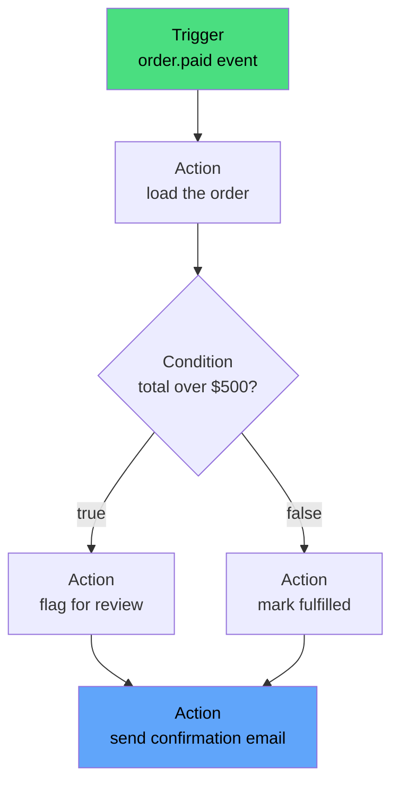
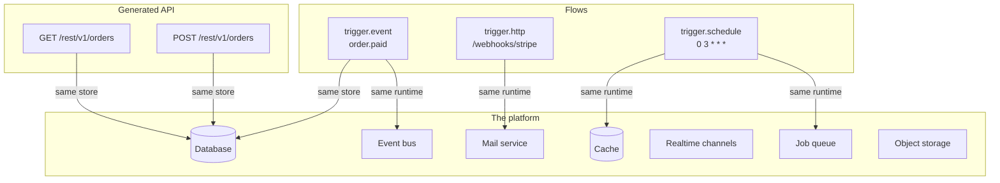
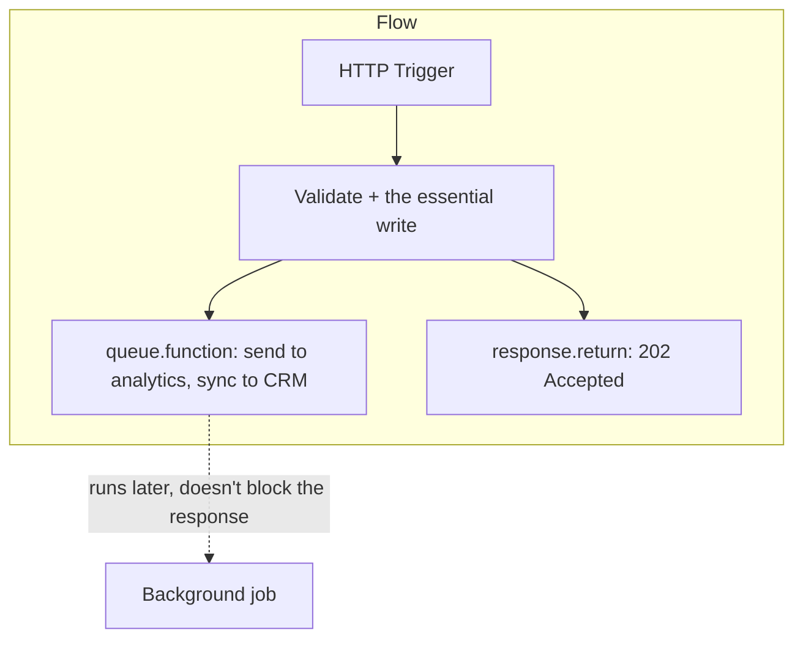
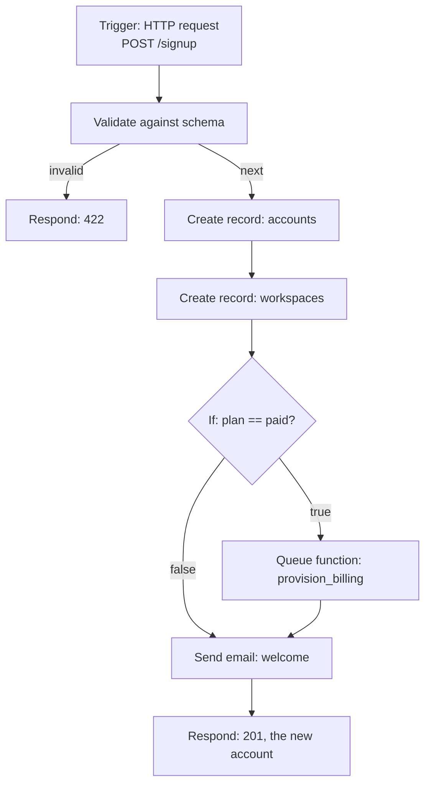
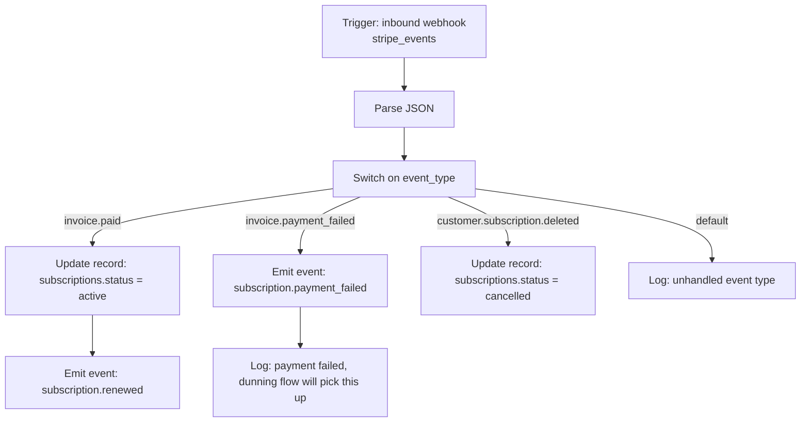
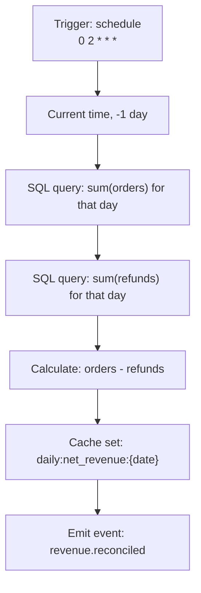

A **Flow** is a piece of server-side automation: something that runs on its own, in reaction to something happening, rather than something a client asks for and waits on. A welcome email after signup, a payment being captured and reconciled, a nightly rollup of yesterday's numbers, a webhook from a payment provider being verified and applied — in Pawabase, all of these are Flows.

You build a Flow visually, in Studio: drop a Trigger on the canvas, wire Steps after it, connect each Step's branches to whatever should happen next. This page is the map — what a Flow is made of, the vocabulary the rest of the Flows docs use, and where to go for depth on each piece.

<CardGroup cols={3}>
  <Card title="Triggers" icon="waypoints" href="/flows/triggers">Every way to start a Flow.</Card>
  <Card title="Control flow" icon="git-branch" href="/flows/control-flow">Branching, looping, retrying, stopping.</Card>
  <Card title="Block reference" icon="list" href="/flows/block-reference">Every block, in one index.</Card>
</CardGroup>
<CardGroup cols={3}>
  <Card title="Data blocks" icon="shapes" href="/flows/data-blocks">Transform, validate, compute.</Card>
  <Card title="Resource blocks" icon="database" href="/flows/resource-blocks">Read and write your records.</Card>
  <Card title="Platform blocks" icon="plug" href="/flows/platform-blocks">Mail, HTTP, events, storage, cache.</Card>
</CardGroup>
<CardGroup cols={3}>
  <Card title="State" icon="layers-stacked" href="/flows/state">What a Step can see while it runs.</Card>
  <Card title="Templates" icon="code" href="/flows/templates">Writing `{{ }}` expressions.</Card>
  <Card title="Recipes" icon="chef-hat" href="/flows/recipes">Complete, worked Flows.</Card>
</CardGroup>

## The mental model

A Flow is made of **Steps** connected by **branches**.

- A **Trigger** is the Step that starts a run — an HTTP request, a platform event, a schedule, and so on. Every Flow has at least one.
- An **Action** is a Step that does something — reads a record, sends an email, calls an external API, writes to the cache.
- A **Condition** is a Step that decides which way the run goes next, based on the data seen so far.
- A **branch** is a named outcome a Step can produce. Most Actions have exactly one branch, `next` — there's only one way forward. A Condition, or an Action that can fail in an expected way, has more than one: `true`/`false`, `next`/`missing`, `hit`/`miss`. In Studio, a branch is one of the labeled connectors coming out the side of a Step; you drag a connection from a branch to whichever Step should run next.
- A **Variable** is a named value you set during a run (with the Set variables Action) and read back later in the same run.
- An **Expression** is a `{{ }}` template inside a config field — a way to reach into the data the run has produced so far and drop it into a field, rather than typing a literal.

That's the whole vocabulary. Everything else — the thirty-plus kinds of Action, the shape of the data each Trigger hands you, how Expressions resolve — builds on these five ideas.



Two branches can converge on the same next Step — both `D` and `E` above lead into `F`. A Step doesn't need exactly one Step feeding into it, and it doesn't need exactly one Step after it either: an Action can fan out to several unrelated next Steps, all of which run.

## A first Flow

Concretely, here's a complete, minimal Flow: it fires on a platform event, loads the record the event refers to, and sends an email. This is the actual shape a Flow definition takes — the same `nodes`/`edges` structure Studio saves when you build it on the canvas, and the same format every example later in these docs uses.

```json
{
  "name": "notify_order_shipped",
  "description": "Email the customer when their order ships.",
  "enabled": true,
  "timeout": 30,
  "definition": {
    "nodes": [
      { "id": "start", "data": { "block": "trigger.event", "config": { "event": "order.shipped" } } },
      { "id": "load", "data": { "block": "resource.get", "config": { "resource": "orders", "id": "{{ input.payload.order_id }}" } } },
      {
        "id": "notify",
        "data": {
          "block": "mail.send",
          "config": {
            "to": "{{ steps.load.output.email }}",
            "template": "order_shipped",
            "data": { "tracking_url": "{{ steps.load.output.tracking_url }}" }
          }
        }
      }
    ],
    "edges": [
      { "id": "e1", "source": "start", "target": "load" },
      { "id": "e2", "source": "load", "target": "notify" }
    ]
  }
}
```

Reading it: `start` is the Trigger, listening for an `order.shipped` event. `load` runs next by default — an edge with no `sourceHandle` always means "the `next` branch" — and reads the order the event refers to. `notify` reads the just-loaded order's `email` and `tracking_url` straight out of `steps.load.output`, and sends the mail. There's no branch wired off `notify`'s own `next`, so once it finishes, the run simply ends.

Every Flow, however large, is built from exactly this: a Trigger, some number of Steps, and connections between named branches. [Recipes](/flows/recipes) works through five complete, realistic Flows built the same way.

## How a Flow fits into the platform

Pawabase compiles each environment's Flows, resources, and routes into one running app. The Actions that touch your data — `resource.create`, `resource.update`, and the rest — call into the exact same store a generated `POST /rest/v1/<resource>` route uses. A Flow isn't a separate, slower path to your data; it's the same path, entered from a different direction.



Because of this, a resource Action inherits everything the generated route does — field validation, defaults, cache invalidation, and the `<resource>.created`/`updated`/`deleted` events other Flows can react to.

<Note>
Resource and platform Actions run with **service rights** — a `resource.get` on `invoices` inside a Flow can read every invoice, regardless of who triggered the run. Flows are trusted the same way a secret key is trusted. If a caller's own permissions should limit what a Flow does, check them explicitly, with the Trigger's own policy (for `trigger.http`) or with a `Require sign-in`/`Check policy` Action inside the Flow. See [Platform blocks](/flows/platform-blocks) for both.
</Note>

## How a run actually proceeds

When a Trigger fires, Pawabase starts a run and gives it a fresh pool of state (described in full below). From there:

1. It looks at the Step whose branches lead nowhere yet followed from the Trigger, renders that Step's config — resolving every `{{ }}` Expression against the state so far — and runs it.
2. The Step produces an output and a branch name (`next`, `true`, `missing`, whatever applies).
3. That output is recorded at `steps.<id>.output`, so any later Step can read it.
4. The run follows every connection wired to the branch that was returned — sometimes one Step, sometimes several, sometimes none, which quietly ends that path.
5. It repeats until every reachable path has ended, or a Step tells the run to stop outright.

Two Steps end a run outright rather than letting it continue: `response.return` answers the triggering HTTP request (if there is one) and stops, and `control.stop` stops without answering anything. `error.raise` also ends the run, but as a failure rather than a normal stop — even if you've drawn an `error` branch off it, `error.raise` always fails the run.

A run can branch into more than one active path at once — two Actions wired to the same branch both run — but Pawabase never runs two *different* Flows, or two separate triggerings of the same Flow, as part of one run. Each Trigger firing starts its own, independent run with its own state.

## Starting a run: Triggers

Every Flow needs at least one Trigger. A Trigger doesn't transform anything — it just declares *when* a run should begin, and hands the triggering payload through as its output (available to later Steps as `input`).

| Trigger | Fires when |
| --- | --- |
| HTTP request | A request reaches a route this Flow is bound to |
| Event | A matching platform event is published |
| Schedule | A cron expression or fixed interval elapses |
| Resource change | A resource is created, updated, or deleted |
| Inbound webhook | A verified inbound webhook payload arrives |
| Realtime message | A client publishes to a matching realtime channel |
| Background job | The Flow is dispatched as a job (by `queue.flow`, or the API) |
| Manual run | Someone runs the Flow from Studio or the platform API |

The full field list for each one, and the exact shape `input` takes, is on [Triggers](/flows/triggers).

### Choosing a Trigger

| If you're building… | Use |
| --- | --- |
| A REST-style endpoint a client calls directly | HTTP request |
| A reaction to something that already happened elsewhere in your app | Event |
| Something recurring — a digest, a rollup, a cleanup sweep | Schedule |
| A reaction to one specific resource's own create/update/delete | Resource change |
| A callback from a third-party service (payments, shipping, a partner API) | Inbound webhook |
| A reaction to a client publishing on a realtime channel | Realtime message |
| Work handed off from another Flow via `queue.flow` | Background job |
| Something you'll only ever start by hand, or from your own tooling | Manual run |

An Event Trigger and a Resource change Trigger can look similar — both fire on something that already happened — but they answer different questions. A Resource change Trigger is scoped to one resource and its own operations (`orders` being `created`); an Event Trigger listens for a named event that any part of the platform, including your own Flows, chose to publish (`order.paid`, which might be emitted well after the resource write itself, once payment actually clears).

## Conditions and loops: control blocks

Ten blocks decide the path a run takes: `If`, `Switch`, `For each`, `While`, `Set variables`, `Merge objects`, `Delay`, `Stop`, `Retry`, and `Timeout`. None of them touch your database, send anything, or call an outside service.

| Block | Branches | What it decides |
| --- | --- | --- |
| `control.if` | `true`, `false` | Which of two paths a run takes |
| `control.switch` | one per case, plus `default` | Which of several named paths a run takes |
| `control.foreach` | `each`, `done` | How many times a branch repeats, once per item in a list |
| `control.while` | `body`, `done` | How many times a branch repeats, while a condition holds |
| `control.set` | `next` | Nothing — it writes a Variable and moves on |
| `control.merge` | `next` | Nothing — it combines several objects into one |
| `control.delay` | `next` | When the run continues (after a pause, up to 300 seconds) |
| `control.stop` | *(none)* | That the run ends here, with no HTTP response |
| `control.retry` | `attempt`, `next` | Whether a branch is re-attempted after it fails |
| `control.timeout` | `attempt`, `next`, `timeout` | Whether a branch finished before a deadline |

`control.if` and `control.while` take a **condition**, not a template — a small JSON language of its own, described next. Full explanations and worked examples for all ten: [Control flow](/flows/control-flow).

### Conditions, briefly

A condition is a JSON object with one key naming an operator, evaluated against the run's current data. Operands that start with `$` are paths into that data (`$input.status`, `$auth.user_id`); anything else is a literal.

```json
{ "all": [{ "eq": ["$input.status", "paid"] }, { "gt": ["$input.total", 100] }] }
```

The full operator set — comparison (`eq`, `ne`, `gt`, `gte`, `lt`, `lte`), collection and string (`in`, `not_in`, `contains`, `starts_with`, `ends_with`, `matches`), presence (`exists`, `truthy`, `empty`), the combinators (`all`, `any`, `not`), and the policy shorthands (`authenticated`, `role`, `permission`, `owner`, `service`, `kind`, `scope`, `aal`) — is documented once, on [Block reference → Condition syntax](/flows/block-reference#condition-syntax), and used identically by `control.if`, `control.while`, `transform.filter`, and `policy.check`.

## Doing the work: Actions

The remaining 46 blocks are Actions, split into three families by what they touch.

**Data** (14 blocks) reshape a value already in hand: `Transform`, `Template`, `Pick fields`, `Filter list`, `Sort list`, `Group list`, `Batch list`, `Validate`, `Parse JSON`, `Stringify JSON`, `Calculate`, `Generate id`, `Hash`, `Current time`. None of them call anything outside the run. See [Data blocks](/flows/data-blocks).

**Resources** (5 blocks, plus `db.query`/`db.transaction`) read and write your records: `List records`, `Get record`, `Create record`, `Update record`, `Delete record`. They go through the same store a generated route uses. See [Resource blocks](/flows/resource-blocks).

**Platform** (26 blocks) are everything else a Flow can do: check or load the caller (`auth.*`, `policy.check`), read and write the cache, emit events, call another Flow inline (`flow.call`) or dispatch background Jobs (`queue.flow`, `queue.function`), publish to realtime channels, read and write object storage, send mail, make outbound HTTP calls, send outbound webhooks, read secrets, call a Python Function inline (`function.call`), write logs and metrics, and end the run with a response or an error (`response.return`, `error.raise`). See [Platform blocks](/flows/platform-blocks).

<Warning>
`flow.call`, `queue.flow`, and `function.call` are easy to mix up. `flow.call` runs a **Flow** inline and continues with its result. `queue.flow` dispatches a **different Flow** to run later, as a background Job — it doesn't wait, and its output is just a job id. `function.call` calls a Python **Function** inline and continues with whatever it returns.
</Warning>

Every block, its exact config fields, and its branches are indexed in one place on [Block reference](/flows/block-reference) — that page is the fast lookup; the category pages linked above are where the worked examples and gotchas live.

### Branch names you'll see everywhere

Most branch names are specific to one block, but the same handful recur across many of them, and it's worth knowing what each one means before you hit it for the first time:

| Branch | Appears on | Means |
| --- | --- | --- |
| `next` | Almost every block | The single, ordinary way forward |
| `true` / `false` | `control.if` | Which side of the condition held |
| `missing` | `resource.get`, `resource.update`, `auth.lookup` | The record or user didn't exist — not an error, just an expected outcome |
| `invalid` | `validate.schema` (when `on_invalid` is `"branch"`) | The value failed validation |
| `hit` / `miss` | `cache.get` | Whether the key was found in the cache |
| `allowed` / `denied` | `policy.check` | What the policy decided |
| `anonymous` | `auth.user` | The caller isn't signed in |
| `failed` | `http.request` | The response status was outside 200–399 |
| `each` / `done` | `control.foreach` | Once per item, then once after the last one |
| `body` / `done` | `control.while` | Once per iteration while the condition holds, then once after |
| `attempt` / `next` | `control.retry` | The branch to retry, and where a successful attempt continues |
| `attempt` / `timeout` | `control.timeout` | The branch to run, and where it goes if the deadline passes first |
| `default` | `control.switch` | No case in `cases` matched the value |
| `error` | Any block | Opt-in — wire it explicitly to catch that Step's own failure |

## What a Step can see: state

Every Step in a run shares one pool of data. At the start of a run it holds:

| Key | Holds |
| --- | --- |
| `input` | Whatever the Trigger handed through |
| `auth` | The caller Pawabase resolved for this run (or an empty/service context) |
| `project`, `env` | Which project and environment the run belongs to |
| `vars` | Values written by `control.set`; starts empty |
| `steps` | Every finished Step's output, keyed by the Step's id: `steps.<id>.output` |
| `run` | Bookkeeping about this run itself — its id, the Flow's name, and (once a request triggers it) a request id |

Two more show up conditionally: `error` appears once a Step fails and its `error` branch is taken (`error.message`, `error.type`, `error.node`), and inside a `control.foreach` body, `item` and `index` hold the current element and its position. A Step reads any of this with a `{{ }}` Expression — `{{ steps.load.output.email }}`, `{{ vars.discount }}`, `{{ input.body.id }}` — and the full picture, including exactly what the host adds beyond the engine's own keys, is on [State](/flows/state).

Midway through the `notify_order_shipped` example above, right after `load` finishes, the state looks roughly like this:

```json
{
  "input": { "event": "order.shipped", "payload": { "order_id": "ord_9f2" }, "id": "evt_1", "timestamp": "2026-09-30T03:00:00Z" },
  "auth": {},
  "project": "acme",
  "env": "production",
  "vars": {},
  "steps": {
    "load": { "output": { "id": "ord_9f2", "email": "alice@example.com", "tracking_url": "https://…" }, "handle": "next" }
  },
  "run": { "id": "9c1f…", "flow": "notify_order_shipped" }
}
```

`notify`'s `to` field, `{{ steps.load.output.email }}`, resolves against exactly this dictionary — which is why a Step can only ever reference a Step that ran *before* it. Referencing a Step that hasn't executed yet, or doesn't exist, resolves to nothing rather than raising: see [Templates → edge cases](/flows/templates#edge-cases) for exactly how a missing path behaves.

## Flows and the rest of the platform

A Flow doesn't live off to the side of Pawabase's other capabilities — it's one more way of reaching the exact same subsystems your generated API, your Studio data browser, and your own code all reach. Understanding *how* a Flow touches each capability is what lets you predict what it will (and won't) do automatically.

### Resources

Every `resource.*` block calls into the same `store` a generated `/rest/v1/<resource>` route uses — see [How a Flow fits into the platform](#how-a-flow-fits-into-the-platform) above. This means a `resource.create` inside a Flow gets the resource's field validation, defaults, and (on the API) its `after_write` behavior — cache invalidation, the `<resource>.created`/`updated`/`deleted` event, and any realtime push the resource has enabled — for free, the same way a REST client's `POST` would. The one thing it does *not* get is the resource's own read/write **policy** — resource blocks run with service rights, described in the note above. If you want a Flow's write to be exactly as restricted as an ordinary client's would be, put an explicit `policy.check` in front of it rather than assuming the resource's policy is still in effect.

### Auth

`auth` in a Flow's state is resolved the same way it is for a REST request — from whatever credential (session, API key, service token) reached the Trigger — but a Flow doesn't automatically *require* one. A schedule or background job has no caller to resolve at all, so its `auth` is `{}`. Two blocks exist specifically to bring a Flow's own auth posture in line with a resource's or a route's: `auth.require` fails the run outright if the caller isn't signed in (optionally checking a role or permission), and `policy.check` evaluates an arbitrary policy — the same condition language a resource's own `read`/`write` policy uses — against the caller, a record, and extra input you supply. A Flow's HTTP Trigger can also carry its own `policy` field, checked before the Flow's first Step ever runs, which is usually the more efficient place to put an access check than a `policy.check` Step further down the graph.

### Storage

The four `storage.*` blocks (`storage.put`, `storage.read`, `storage.signed_url`, `storage.delete`) are thin wrappers over the same bucket-backed object storage your project's file uploads use. A Flow is a natural place to run something *after* a file lands — an inbound webhook Trigger that receives a document, `storage.put`s it, then calls `storage.signed_url` to hand back a link the caller can fetch it from; or a scheduled Flow that reads a nightly export with `storage.read`, transforms it, and writes the result back under a new key. Storage blocks don't validate content — a `storage.put` will happily write malformed JSON or an oversized payload if you ask it to. If a resource has a file-upload field of its own, prefer that resource's built-in upload handling for anything user-facing, and reach for `storage.*` blocks in a Flow for the automation layered around files rather than as the primary upload path.

### Realtime

`realtime.publish` sends a message to a channel the same way a client's own publish would, and `trigger.realtime` starts a Flow when a client publishes to a matching channel — the two together let a Flow sit in the middle of a realtime exchange: receive a client's message, validate or enrich it, then publish a derived message back (to the same channel, a different one, or several). This is the standard shape for anything that needs server-side authority over a realtime interaction — a chat message that needs profanity filtering before it reaches other participants, a multiplayer action that needs a rules check before being broadcast. A resource with realtime enabled also pushes its own `created`/`updated`/`deleted` notifications automatically, without a Flow's involvement at all — reach for `realtime.publish` only when the message isn't naturally a resource write, or needs shape beyond what the resource's own realtime payload provides.

### Mail

`mail.send` is the only Flow-level way to send email, and it's deliberately the same mail service every other part of the platform uses — a template registered for transactional email elsewhere is the same `template` name a Flow's `mail.send` can reference. The natural fit is exactly what [A first Flow](#a-first-flow) demonstrates: an Event or Resource change Trigger reacting to something that just happened, followed by a `mail.send` built from that event's own data. For anything beyond "send this one email" — a drip sequence, a digest that batches several events into one send — combine `mail.send` with `control.delay`, `queue.flow`, or a Schedule Trigger rather than expecting a single block to manage timing on its own.

### Queues and background jobs

`queue.flow` and `queue.function` are a Flow's only way to hand work to the background job system — described in full in [Flows, Functions, and custom routes](#flows-functions-and-custom-routes-three-ways-to-run-your-own-logic) below. The job queue is also how Pawabase decouples a slow or unreliable dependency from a request a caller is actively waiting on: an HTTP-triggered Flow that needs to call three slow external APIs can do the fast, essential part inline, `queue.function` the slow part, and `response.return` immediately — the caller doesn't wait on a job that isn't essential to the response they need right now.



## Flows, Functions, and custom routes: three ways to run your own logic

Pawabase has three different mechanisms for logic you write yourself, and they sit at three different layers. Getting the right one isn't just a style preference — the wrong choice either fights the platform (writing imperative Python to express something that's naturally a graph) or hits a wall (trying to express something graph-shaped, like a WebSocket upgrade, as a Flow).

| Mechanism | Shape | Where it runs | Reach for it when |
| --- | --- | --- | --- |
| **Flow** | A graph of Steps and branches, built in Studio | The flow engine, inside this process | The logic is naturally "when X happens, check Y, then do Z" — branches, loops, and Actions on your own data, visible to anyone who opens Studio |
| **Function** | A single Python callable, registered with `@function` | Called inline (`function.call`) or as a background job (`queue.function`) | The logic is more naturally an algorithm than a graph — pricing math, parsing, ranking, a call to a third-party SDK with its own client object — but it still belongs inside a Flow's own orchestration |
| **Extension route** | A full Sillo route, registered through the `pawabase.routes` entry point | The same HTTP process as the rest of the API, entirely outside the flow engine | The endpoint itself needs something a Flow's request/response model can't express — a WebSocket upgrade, a streaming response, custom middleware, an upload processed as raw bytes rather than a parsed JSON body |

The three aren't mutually exclusive — the common shape, described in [flows-or-code](/code/flows-or-code), is a **hybrid**: a Flow owns the orchestration (trigger, validate, branch, write, notify) and calls out to a Function for the one Step that's genuinely an algorithm, via `function.call`. An extension route is the outlier of the three: it bypasses the Flow engine entirely, so a Flow can't call an extension route, and an extension route doesn't get a Flow's trace, branches, or Studio visibility — it's a deliberate trade of all of that for full framework access. See [Extension routes](/code/extension-routes) for when that trade is worth it, and [Functions](/code/functions) and [Flows or code](/code/flows-or-code) for the fuller Flow-vs-Function comparison, including a side-by-side of versioning, run history, testing, and error handling across all three.

### The three-way test

A quick way to sort a new piece of logic into the right bucket:

1. **Does the endpoint itself need raw HTTP/WebSocket access — streaming, an upgrade, custom middleware, a non-JSON body?** If yes, it's an extension route; nothing else on this page applies to it.
2. **Otherwise, is the logic mostly "when this happens, check that, then do the other thing" — expressible as Triggers, Conditions, and Actions on data you already have blocks for?** If yes, it's a Flow.
3. **Within that Flow, is there a piece that's easier to write as an algorithm than to assemble from blocks — a calculation, a parse, a call into a Python SDK with its own client object?** If yes, that piece is a Function, called from the Flow with `function.call` (inline) or `queue.function` (background).

Two blocks inside a Flow do the actual composing described above, and it's worth being precise about which is which, because the names are close and the wrong one silently does the wrong thing:

| Block | Runs | Waits for a result? | Use when |
| --- | --- | --- | --- |
| `function.call` | A Function, inline, in the current run | Yes — continues with its return value | The logic is easier to write in Python than to assemble from Actions, but still belongs in *this* run |
| `queue.function` | A Function, as a background Job | No — output is just a job id | The work can happen after this run answers, and doesn't need to affect its result |
| `flow.call` | A different Flow, inline | Yes — continues with its final result | The next step is a reusable Flow and its result is needed now |
| `queue.flow` | A different Flow, as a background Job | No — output is just a job id | The next step is itself substantial enough to be its own Flow, and doesn't need to block this one |

`flow.call` is useful for intentional, reusable orchestration. Keep the called Flow focused and avoid circular call graphs; nested inline calls are capped at eight levels. If the work can happen independently, prefer `queue.flow` or a platform event instead.

## Writing Expressions

Any config field can hold a `{{ expression }}` — a lookup into the state above, optionally piped through a filter:

```json
{ "greeting": "Hi {{ input.body.name | default:'there' }}," }
```

A string that is *entirely* one `{{ }}` expression resolves to that expression's actual value — `"{{ input.items }}"` passes a list through unchanged, not its text form. A handful of blocks (`control.if`, `control.while`, `transform.filter`) instead take a raw **condition** object, described above, with `$`-prefixed paths rather than `{{ }}` wrapping. The full syntax, filters, and edge cases are on [Templates](/flows/templates).

## Error handling, briefly

When a Step's Action raises, the engine looks for an `error` branch wired out of that Step. If one exists, the run follows it — `state.error` is populated with what failed and where, and the run continues down that path. If none exists, the run fails outright.

Any Step can have an `error` branch drawn from it, regardless of what branches it otherwise declares. `control.retry` and `control.timeout` are the two blocks built specifically to wrap a branch and react to its own failure or slowness without you drawing an `error` branch at all. The full picture — including why a Flow doesn't auto-rollback partial writes, and how `db.transaction` gives you atomicity where you need it — is on [Errors and retries](/flows/errors-and-retries).

## Validating a Flow

Before a Flow definition is saved, Pawabase checks it for structural problems: an unknown block, an edge pointing at a Step that doesn't exist, a branch a block doesn't declare, or no Trigger at all. Studio runs this check automatically on save and shows any problems inline; the same check is available as `POST /flows/validate` if you're generating or reviewing Flow definitions outside Studio.

Validation is cheap and has no side effects — a Flow that validates cleanly still might fail at run time (a missing secret, a resource that doesn't exist), but it will at least be *structurally* runnable.

## Limits

| Limit | Value |
| --- | --- |
| Flow timeout | 1–900 seconds, default 60 |
| Steps executed per run | 10,000 |
| `control.foreach` items | 10,000 |
| `control.delay` | 0–300 seconds |
| `control.retry` attempts | 1–10, default 3 |
| `control.retry` base delay | 0–30 seconds, default 0.5 |
| `control.while` iterations | 1–10,000, default 1,000 |
| `control.timeout` deadline | up to 300 seconds |
| Recorded output per Step | 2,000 characters (longer values are truncated in the trace) |

Exceeding the run timeout or the step count fails the run with a clear error, logged in the run's trace; a `control.foreach` or `control.while` past its own limit fails just that Step, so an `error` branch on it can still catch the problem.

| Exceeded | Fails as | HTTP status (if triggered by HTTP) |
| --- | --- | --- |
| Flow timeout | The whole run | 504 |
| Steps per run | The whole run | 500 |
| `control.foreach` items | That Step | 500 (or wherever its `error` branch leads) |
| `control.while` iterations | That Step | 500 (or wherever its `error` branch leads) |
| `control.delay` past 300s | That Step, before it ever waits | 500 |

A Step failing outright — as opposed to following a branch built for the expected case, like `missing` or `invalid` — always means either the Step itself hit one of these limits, an external call failed, or something in your own config was wrong for the data at hand (dividing by zero in `math.calculate`, invalid JSON in `json.parse`). [Errors and retries](/flows/errors-and-retries) covers every failure mode block by block.

## Inspecting a run

Every run produces a trace: the Steps it visited, in order, each with its duration, the branch it took, its output, and any error. Studio's **Runs** panel shows this for both saved runs (if the Flow records them) and one-off manual runs you trigger from the editor. See [Runs and testing](/flows/runs-and-testing) for how to read a trace and re-run a Flow with adjusted input.

## Three realistic scenarios, start to finish

The `notify_order_shipped` Flow earlier on this page is deliberately tiny — three Steps, no branching — because it's meant to teach the shape, not the scale. Real Flows usually combine several of the ideas above (Triggers, Conditions, `vars`, background Jobs, deliberate error handling) in one graph. Three walkthroughs below show that combination at a size closer to what you'll actually build; [Recipes](/flows/recipes) has five more, each as a complete, copy-pasteable Flow definition.

### Scenario 1: a signup that needs to provision more than one thing

A new account signup needs to: create the account record, create a default workspace for it, send a welcome email, and — only for accounts on a paid plan selected at signup — kick off a background Job that provisions billing. Sketched as a Flow:



Notice the shape: validation happens *before* anything is written (catching a bad payload for the cost of one Step, not three), the two record creates are sequential because `workspaces` needs the account's `id`, the plan check only affects one downstream path, and both paths converge back on `welcome` — a paid signup and a free signup both get the same welcome email, just one of them also kicks off billing provisioning first. `provision_billing` is dispatched with `queue.function` rather than `function.call` deliberately: billing provisioning can take longer than a signup request should make a browser wait on, and its result doesn't change what the signup response says.

### Scenario 2: a subscription that needs to react to a third party's clock

Most SaaS billing is driven by events a payment provider emits on its own schedule — a renewal succeeding, a card failing, a subscription being cancelled from the provider's own dashboard. A Flow triggered by an inbound webhook is the natural home for this, because the provider (not your own schedule) decides when it fires:



The Flow itself stays narrow — decode, route, update the one record each event type implies, emit an event for anything a *different* Flow should react to. `subscription.payment_failed` doesn't try to handle dunning logic inline; it emits an event and lets a separate, purpose-built Flow (see [Recipes → subscription renewal with dunning](/flows/recipes#subscription-renewal-with-dunning) for the full version of that second Flow) own the retry schedule and the eventual cancellation. Splitting "receive the provider's signal" from "decide what a failure means for this subscriber" keeps either half changeable without touching the other.

### Scenario 3: a nightly job that also needs to be safely re-run by hand

A Flow that reconciles a day's numbers — orders placed, refunds issued, a computed net revenue figure written somewhere a dashboard reads — needs to run once a night, but also needs to be safe to re-run manually if the schedule was ever missed (a deploy that briefly took the scheduler down, say) or if a number needs recomputing after a data fix:



Two choices make this safe to re-run, and both generalize to any scheduled Flow: it derives the date it's reconciling from `time.now`'s `offset_seconds` relative to *when it runs*, rather than assuming it always runs exactly at 2 AM for "yesterday" in some other sense; and `cache.set`'s key includes the date being reconciled (`daily:net_revenue:2026-09-29`), so running it twice for the same day overwrites the same key with the same (or corrected) answer rather than accumulating duplicate records the way a `resource.create` on every run would. A Flow meant to be re-run safely should almost always prefer an idempotent write — an update keyed by something stable, or a cache entry — over an unconditional create.

## Getting started

<Steps>
  <Step title="Open the Flow editor">
    In Studio, create a new Flow. The canvas starts empty — you add Steps from the block picker on the side.
  </Step>
  <Step title="Add a Trigger">
    Every Flow needs one. An HTTP request Trigger and an Event Trigger cover most first Flows.
  </Step>
  <Step title="Add Actions and wire the branches">
    Drop the Actions you need, then connect each one's branches to whatever should run next. Leave a branch unconnected and that path simply ends the run there.
  </Step>
  <Step title="Validate and save">
    Studio checks the Flow's structure as you save. Fix anything it flags before moving on.
  </Step>
  <Step title="Run it and read the trace">
    Trigger it for real, or run it manually from the editor, then inspect the trace to confirm each Step saw what you expected.
  </Step>
</Steps>

## Common patterns

**Read, compute, write.** Load with `resource.get`, compute with `math.calculate` or `db.query`, write back with `resource.update` or `db.transaction`. This is the shape of most Flows.

**Emit and forget.** When a Flow's result should trigger downstream work, emit a platform event rather than trying to invoke another Flow directly — there is no block for that. A separate Flow, triggered by the event, stays decoupled from the one that emitted it.

**Validate early, fail clearly.** Put `validate.schema` right after an HTTP Trigger to catch a bad payload before anything else runs. Set `on_invalid` to `"branch"` when you want to answer with your own response instead of a bare `422`.

**Don't leave `missing` unwired.** `resource.get`, `resource.update`, and `auth.lookup` all have a `missing` branch for exactly the case where the record or user doesn't exist. Leaving it unconnected means that case silently ends the run — almost never what you want for something a caller is waiting on.

**Converge branches through a Variable.** When two branches each need to produce a value a later Step reads, have both write to the same `vars.<name>` with `control.set`, rather than making the later Step check which branch actually ran.

**Guard entry, not every Action.** Resource and platform Actions run with service rights and don't re-check policies on their own, so put the access check — `auth.require`, `policy.check`, or an HTTP Trigger's own `policy` field — once, near the top of the Flow, rather than repeating it before every write.

**Build a list before handing it to `db.transaction`.** `db.transaction`'s `operations` field is a plain JSON list — it can't branch or loop internally. Assemble the list first with `control.foreach` and `control.set`, then pass the finished list to `db.transaction` in one Step.

**Answer fast, finish slow.** For an HTTP-triggered Flow where only part of the work needs to happen before the caller gets a response, do that part inline and `queue.function`/`queue.flow` the rest before `response.return`. A caller waiting on a `POST /signup` shouldn't also wait on a CRM sync or an analytics call that has nothing to do with whether their signup succeeded.

**Make a scheduled Flow safe to re-run.** Derive whatever "period" a scheduled Flow reconciles (yesterday, last hour) from `time.now`'s `offset_seconds` relative to when it actually runs, and write results with an update keyed by something stable (a date, a cache key) rather than an unconditional `resource.create`. A Flow that can safely be re-run by hand is much easier to operate than one that silently double-counts on a retry.

**Prefer an event over a second Trigger on the same condition.** If two unrelated Flows both need to react to "an order was paid," don't give each its own `trigger.resource` on the same write — emit `order.paid` once (or let the resource's own `<resource>.updated` event serve that purpose) and let both Flows subscribe to it with an Event Trigger. This also means adding a third consumer later needs no change to the Flow that produces the event.

**Keep a Trigger's own policy as the first line of defense for an HTTP-triggered Flow.** An HTTP Trigger's `policy` field is checked before the Flow's first Step runs — cheaper, and easier to audit at a glance, than a `policy.check` Step buried a few nodes into the graph. Reach for a `policy.check` Step instead when the check genuinely depends on data the Flow has to load first (a specific record's owner, say), not as the default place to put an entry check.

## Common mistakes

<AccordionGroup>
  <Accordion title="Assuming a resource Action checks the caller's permissions">
    It doesn't. Resource and platform Actions run with service rights, the same as a secret key would. If a caller's own rights should limit what happens, check them explicitly — they aren't checked for you partway through a Flow.
  </Accordion>
  <Accordion title="Expecting control.foreach to run iterations in parallel">
    Its `concurrency` field is fixed at a maximum of 1 — loops are always sequential. To process items in parallel, dispatch each one as a separate Job with `queue.flow` or `queue.function` instead of looping over them in one run.
  </Accordion>
  <Accordion title="Wrapping a condition field in {{ }}">
    `control.if`, `control.while`, and `transform.filter` take a raw condition object with `$`-prefixed paths, not a `{{ }}` Expression. Wrapping the condition in `{{ }}` doesn't evaluate it — it's passed through as literal text.
  </Accordion>
  <Accordion title="Treating a missing path as an error">
    An Expression that references a path which doesn't exist yet, or never will, doesn't fail the run — it resolves to nothing. If a Step then receives an empty value it can't work with, *that* Step is what fails, not the Expression.
  </Accordion>
  <Accordion title="Drawing a branch out of control.stop, response.return, or error.raise">
    None of the three have any outgoing branches. Anything wired from them in Studio is unreachable — the run always ends at that Step.
  </Accordion>
  <Accordion title="Reaching for function.call to run another Flow">
    It calls a Python Function, not a Flow. To run another Flow, dispatch it with `queue.flow` — as a background Job, not inline — or trigger it independently with a platform event.
  </Accordion>
</AccordionGroup>

## Glossary

| Term | Meaning |
| --- | --- |
| **Flow** | One piece of automation — a Trigger plus the Steps and branches reachable from it |
| **Step** | A single unit of work in a Flow: a Trigger, a Condition, or an Action |
| **Trigger** | The Step that starts a run |
| **Action** | A Step that does something — reads data, calls a service, sends something |
| **Condition** | A Step that decides which branch a run takes, based on a JSON condition object |
| **Branch** | A named outcome a Step can produce (`next`, `true`/`false`, `missing`, …), wired to whatever runs next |
| **Variable** | A named value written with `control.set` and read back later in the same run, as `vars.<name>` |
| **Expression** | A `{{ }}` template in a config field, resolved against the run's state |
| **State** | The shared data every Step in a run can read: `input`, `auth`, `project`, `env`, `vars`, `steps`, `run`, and — once populated — `error` |
| **Run** | One execution of a Flow, from its Trigger to wherever it stops |
| **Trace** | The recorded, step-by-step history of a run |
| **Queue / Job** | Background work dispatched with `queue.flow` or `queue.function`, run outside the triggering request |

## Next

<CardGroup cols={2}>
  <Card title="Block reference" icon="list" href="/flows/block-reference">Every block, its config, and its branches.</Card>
  <Card title="Triggers" icon="waypoints" href="/flows/triggers">What starts a Flow, and what lands in `input`.</Card>
  <Card title="Control flow" icon="git-branch" href="/flows/control-flow">If/switch/foreach/while/retry, in depth.</Card>
  <Card title="Data blocks" icon="shapes" href="/flows/data-blocks">Transform, validate, compute, query.</Card>
  <Card title="Resource blocks" icon="database" href="/flows/resource-blocks">Read and write your records.</Card>
  <Card title="Platform blocks" icon="plug" href="/flows/platform-blocks">Auth, cache, events, jobs, storage, mail, HTTP.</Card>
  <Card title="State" icon="layers-stacked" href="/flows/state">The full state model, in depth.</Card>
  <Card title="Templates" icon="code" href="/flows/templates">Expression syntax, filters, edge cases.</Card>
  <Card title="Recipes" icon="chef-hat" href="/flows/recipes">Complete, worked Flows.</Card>
  <Card title="Errors and retries" icon="triangle-alert" href="/flows/errors-and-retries">Failure handling, in depth.</Card>
</CardGroup>
