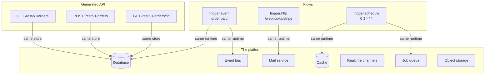
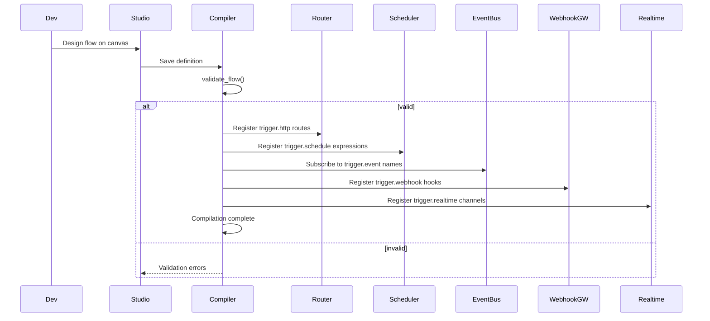
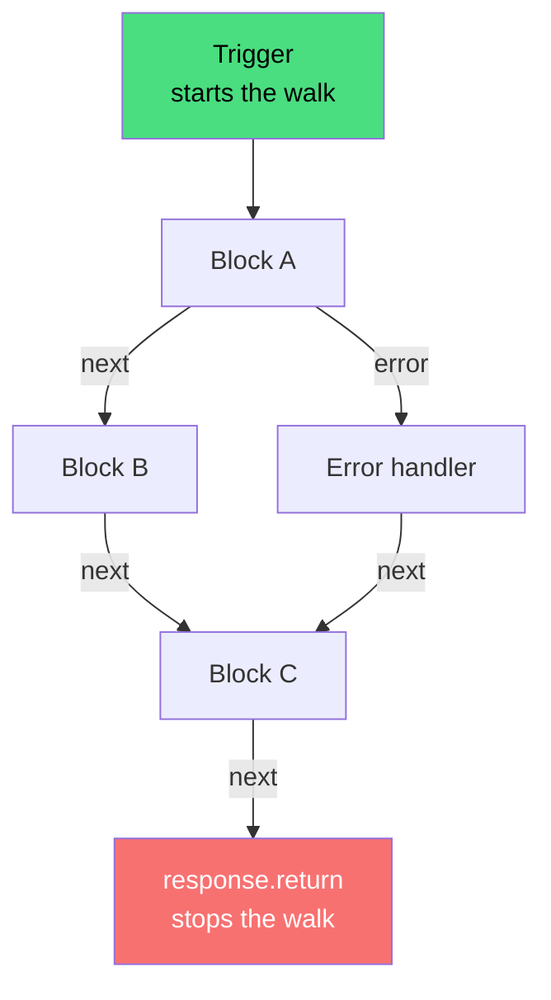
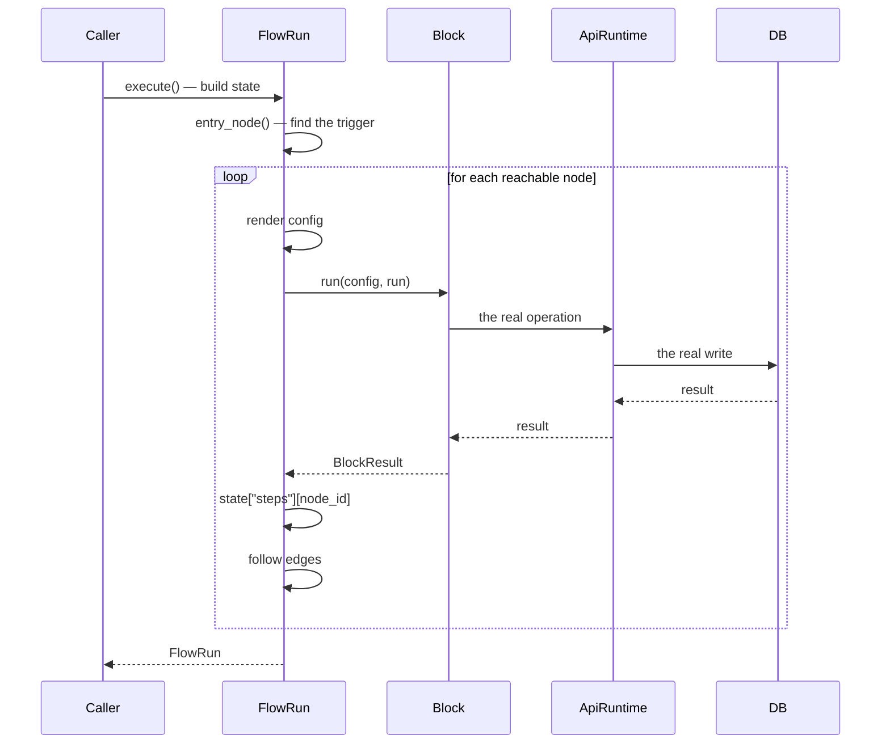

A **flow** is a directed graph of blocks that runs when triggered. It is the unit of automation in Pawabase — whether it is sending a welcome email, processing a payment, aggregating nightly data, or reacting to a realtime event, it is a flow.

This page covers what a flow is, how it fits in the platform, how it compiles, and the five categories of blocks that make up every flow. Everything else is detail — triggers, control flow, data operations, platform integrations, and resource access — and each is covered on its own page.

<CardGroup cols={3}>
  <Card title="Triggers" icon="waypoints" href="/flows/triggers">Every way to start a flow.</Card>
  <Card title="Control flow" icon="git-branch" href="/flows/control-flow">Branching, looping, and stopping.</Card>
  <Card title="Data blocks" icon="shapes" href="/flows/data-blocks">Compute, transform, validate.</Card>
</CardGroup>
<CardGroup cols={3}>
  <Card title="Resource blocks" icon="database" href="/flows/resource-blocks">Read and write records.</Card>
  <Card title="Platform blocks" icon="plug" href="/flows/platform-blocks">Mail, HTTP, events, storage.</Card>
  <Card title="State" icon="layers-stacked" href="/flows/state">What the run state contains.</Card>
</CardGroup>
<CardGroup cols={3}>
  <Card title="Recipes" icon="chef-hat" href="/flows/recipes">Complete end-to-end examples.</Card>
  <Card title="Custom blocks" icon="puzzle-piece" href="/flows/custom-blocks">Extend with your own blocks.</Card>
  <Card title="Runs and testing" icon="beaker" href="/flows/runs-and-testing">Execute, validate, inspect.</Card>
</CardGroup>

## How flows fit in the platform

Pawabase is a **runtime + platform**. The runtime executes flows; the platform provides the resources, events, and services flows operate on. Every flow compiles into an app, and every generated route (`/rest/v1/<resource>`) runs through the same runtime that a flow uses.

The key insight is that a `resource.create` inside a flow and a `POST /rest/v1/orders` from a client hit the **same store, the same validation, the same cache invalidation, and the same event pipeline**. The difference is only in how the request arrives — through a trigger node or through a generated route.

## How flows compile

Each environment compiles its flow definitions into an app. The compilation process:

1. **Validates** every flow definition — unknown blocks, dangling edges, missing triggers
2. **Registers** every trigger route with the API router — `trigger.http` nodes become real HTTP endpoints
3. **Registers** every `trigger.event` name with the event bus
4. **Registers** every `trigger.schedule` expression with the scheduler
5. **Registers** every `trigger.webhook` hook with the webhook gateway
6. **Registers** every `trigger.realtime` channel with the realtime server
7. **Registers** every `trigger.resource` resource-action pair with the resource event emitter

<Tip>
When a flow fails to compile, Studio shows the validation errors at save time. You can also call `POST /flows/validate` programmatically or use `from pawabase_kit.flows.engine import validate_flow` in CI.
</Tip>

## The block catalogue

Every flow is a graph of blocks. Blocks fall into five categories — triggers, control, data, platform, and resource. The full reference for every built-in block is on the [Blocks reference](/flows/block-reference) page.

### Triggers — how a flow starts

| Block | Key | Description |
| --- | --- | --- |
| HTTP request | `trigger.http` | Fires on an inbound request to a registered route |
| Platform event | `trigger.event` | Fires when a named event is emitted |
| Schedule | `trigger.schedule` | Fires on a cron expression or interval |
| Background job | `trigger.job` | Fires when a background job is dispatched |
| Manual | `trigger.manual` | Fires from Studio's Run panel or the API |
| Webhook | `trigger.webhook` | Fires on a signed inbound payload |
| Realtime | `trigger.realtime` | Fires on a realtime channel event |
| Resource change | `trigger.resource` | Fires on a record create/update/delete |

Every flow needs exactly one trigger (unless it has multiple triggers and an explicit `entry` node). A flow with no trigger fails validation.

### Control — branching and looping

| Block | Key | Handles | Description |
| --- | --- | --- | --- |
| Branch | `control.if` | `true`, `false` | Conditional execution |
| Route | `control.switch` | dynamic | Multi-way branching |
| Assign | `control.set` | `next` | Write to `vars` |
| Merge | `control.merge` | `next` | Combine two branches |
| Loop | `control.foreach` | `next`, `error` | Iterate over items |
| Delay | `control.delay` | `next` | Pause execution |
| Stop | `control.stop` | `next` | Halt the walk |
| Retry | `control.retry` | `next`, `error` | Retry on failure |

Control blocks shape how the walk through the graph proceeds. A `control.if` with a `true` edge and a `false` edge is the most common branching pattern; a `control.foreach` turns a single node into a loop body.

### Data — compute and transform

| Block | Key | Description |
| --- | --- | --- |
| Map | `transform.map` | Apply an expression to every item |
| Template | `transform.template` | Fill a template with values |
| Pick | `transform.pick` | Extract fields from an object |
| Schema | `validate.schema` | Validate against a schema |
| Parse JSON | `json.parse` | Parse a JSON string |
| Stringify | `json.stringify` | Serialize to JSON |
| Calculate | `math.calculate` | Arithmetic operations |
| UID | `util.id` | Generate identifiers |
| Hash | `crypto.hash` | Hash a value |
| Now | `time.now` | Current timestamp |
| SQL query | `db.query` | Execute raw SQL |
| Transaction | `db.transaction` | Atomic multi-operation writes |

Data blocks handle everything from simple field extraction to complex SQL queries and atomic transactions.

### Platform — events, mail, HTTP, storage

| Block | Key | Description |
| --- | --- | --- |
| Require auth | `auth.require` | Enforce authentication |
| Look up user | `auth.user` / `auth.lookup` | Resolve the current user |
| Check policy | `policy.check` | Evaluate a policy |
| Emit event | `event.emit` | Emit a platform event |
| Send mail | `mail.send` | Send an email |
| HTTP request | `http.request` | Make an outbound HTTP call |
| Webhook | `webhook.send` | Send a webhook |
| Realtime | `realtime.publish` | Broadcast to a channel |
| Cache get/set | `cache.get` / `cache.set` | Read/write the cache |
| Storage | `storage.*` | Read/write objects |
| Secret | `secret.get` | Read a secret |
| Call function | `function.call` | Invoke another flow |
| Log | `log.write` | Write a structured log |
| Metric | `metric.increment` | Increment a counter |
| Response | `response.return` | Return an HTTP response |
| Error | `error.raise` | Raise an error |

Platform blocks are the bridge between a flow and the outside world. Every one of them runs with **service rights** — they bypass resource policies because flows are server-side code, trusted the same way a secret key is trusted.

### Resource — read and write records

| Block | Key | Handles | Description |
| --- | --- | --- | --- |
| List | `resource.list` | `next` | List records with filters |
| Get | `resource.get` | `next`, `missing` | Get one record by id |
| Create | `resource.create` | `next` | Create a record |
| Update | `resource.update` | `next`, `missing` | Update a record |
| Delete | `resource.delete` | `next` | Delete a record |

Resource blocks go through the same store every generated route uses. A `resource.create` inside a flow validates fields, applies defaults, and emits `<resource>.created` — the same as a client `POST`. They run with service rights and do not re-evaluate the resource's own policies.

<Note>
For operations these five blocks can't express — joins, aggregates, `GROUP BY`, `OR` conditions, or atomic multi-row writes — use [`db.query`](/flows/data-blocks#db-query-sql-query) and [`db.transaction`](/flows/data-blocks#db-transaction) from the data category.
</Note>

## The mental model

Three mental models make everything else click:

1. **Each environment compiles into an app** — flows, routes, events, schedules, webhooks, and realtime channels all compile into a single deployable app per environment.
2. **Each generated route uses the same store** — a `resource.create` inside a flow and a `POST /rest/v1/<resource>` from a client hit the same database, the same validation, and the same cache invalidation.
3. **A flow is a graph, not a pipeline** — blocks are nodes, edges are directed connections between handles (`next`, `error`, `missing`, `true`, `false`, etc.), and the engine walks the graph depth-first with an explicit stack.

## Error handling overview

When a block raises, the engine checks for an `error` edge out of that node. If one exists, the walk follows it. If not, the run fails. This applies to all block types — triggers, control, data, platform, and resource.

The [`control.retry`](/flows/control-flow#retry) block wraps any block in a retry loop with configurable attempts and delay. The [`error.raise`](/flows/platform-blocks#error-raise) block explicitly raises a `FlowError` that can be caught by an `error` edge.

Every run produces a `FlowRun` object with a `trace()` method that lists every step — node id, block key, duration, handle, output, and any error. Inspect traces from Studio's **Events & runs** page or `GET …/flow-runs`.

## Limits

| Limit | Value |
| --- | --- |
| Flow `timeout` | 1–900 seconds, default 60 |
| Steps per run | 10,000 |
| `control.foreach` items | 10,000 |
| `control.delay` | 0–300 seconds |
| `control.retry` attempts | 1–10, default 3 |
| `function.call` nesting depth | 8 |
| Trace output per step | 2,000 characters |

## What happens when a run exceeds a limit

- **Timeout** → `FlowError` with `status=504, code="timeout"`
- **Max steps** → `FlowError` with `code="too_many_steps"`
- **Too many foreach items** → `FlowError` with `code="too_many_items"`
- **Too deep function calls** → `FlowError` with `code="too_deep"`

All of these are logged in the run's trace and visible in Studio.

## The execution engine

The flow engine lives in `pawabase_kit.flows.engine`. `FlowRun.execute()` finds the entry node, then walks the graph **depth-first with an explicit stack** — not Python recursion — so a very long chain of blocks doesn't hit a stack-depth limit.

For each node it visits:

1. **Deep-copies** the node's config so nothing stored can be mutated by a run
2. **Renders** every `{{ }}` template in the config against the run's current state
3. **Calls** the block's `run(config, run)`
4. **Records a Step** — node id, block key, duration, handle, output, error
5. **Stores the output** at `state["steps"][node_id]`
6. **Follows every edge** whose `sourceHandle` matches the returned handle

The full engine source is in [`services/api/app/worker.py`](https://github.com/sillohq/pawabase/blob/main/services/api/app/worker.py) and the registry is in [`packages/kit/pawabase_kit/flows/registry.py`](https://github.com/sillohq/pawabase/blob/main/packages/kit/pawabase_kit/flows/registry.py).

## Validation

`validate_flow` catches structural problems before the flow is saved — unknown blocks, dangling edges, edges into handles a block doesn't declare, and missing triggers. It returns a list of problem strings (empty when the flow can run).

Validation is a cheap, zero-side-effect check. Use it liberally — validate as you build in Studio, and validate programmatically in CI if you generate flow definitions from scripts.

## How to get started

<Steps>
  <Step title="Open the flow editor">
    Go to Studio and click **New flow**. The canvas starts empty — you add blocks from the palette on the left.
  </Step>
  <Step title="Add a trigger">
    Search for `trigger.http` or `trigger.event` and drop it on the canvas. Every flow needs at least one trigger.
  </Step>
  <Step title="Add blocks and connect them">
    Search for any block — `resource.get`, `mail.send`, `control.if` — and wire nodes together. The edges follow handles: `next`, `error`, `missing`, `true`, `false`.
  </Step>
  <Step title="Validate and save">
    Click **Validate** to catch structural problems. Save to compile the flow into the environment.
  </Step>
  <Step title="Run it">
    Click **Run saved flow** from the panel, or wait for the trigger to fire. Inspect the trace afterwards.
  </Step>
</Steps>

## Where to go next

<CardGroup cols={2}>
  <Card title="Triggers" icon="waypoints" href="/flows/triggers">Every trigger type and its `input` shape.</Card>
  <Card title="Control flow" icon="git-branch" href="/flows/control-flow">If/switch/foreach/set — how flows branch and loop.</Card>
  <Card title="Data blocks" icon="shapes" href="/flows/data-blocks">Compute, transform, validate, query.</Card>
  <Card title="Resource blocks" icon="database" href="/flows/resource-blocks">Read and write records.</Card>
  <Card title="Platform blocks" icon="plug" href="/flows/platform-blocks">Events, mail, HTTP, storage, cache.</Card>
  <Card title="State" icon="layers-stacked" href="/flows/state">What the run state contains.</Card>
  <Card title="Templates" icon="code" href="/flows/templates">Template syntax, operators, filters.</Card>
  <Card title="Recipes" icon="chef-hat" href="/flows/recipes">Complete end-to-end examples.</Card>
  <Card title="Runs and testing" icon="beaker" href="/flows/runs-and-testing">Execute, validate, inspect.</Card>
  <Card title="Custom blocks" icon="puzzle-piece" href="/flows/custom-blocks">Extend with your own blocks.</Card>
</CardGroup>

## Complete block reference quick table

| Category | Blocks |
| --- | --- |
| Triggers | `trigger.http`, `trigger.event`, `trigger.schedule`, `trigger.job`, `trigger.manual`, `trigger.webhook`, `trigger.realtime`, `trigger.resource` |
| Control | `control.if`, `control.switch`, `control.set`, `control.merge`, `control.foreach`, `control.delay`, `control.stop`, `control.retry` |
| Data | `transform.map`, `transform.template`, `transform.pick`, `validate.schema`, `json.parse`, `json.stringify`, `math.calculate`, `util.id`, `crypto.hash`, `time.now`, `db.query`, `db.transaction` |
| Platform | `auth.require`, `auth.user`, `auth.lookup`, `policy.check`, `event.emit`, `mail.send`, `http.request`, `webhook.send`, `realtime.publish`, `cache.get`, `cache.set`, `storage.*`, `secret.get`, `function.call`, `log.write`, `metric.increment`, `response.return`, `error.raise` |
| Resource | `resource.list`, `resource.get`, `resource.create`, `resource.update`, `resource.delete` |

Every block is detailed on the [Blocks reference](/flows/block-reference) page — each one's config keys, handles, output shape, and a worked example.

## Common flow patterns

### Read, compute, write

The most common shape: load data with `resource.get`, compute with `math.calculate` or `db.query`, write back with `resource.update` or `db.transaction`.

### Emit and forget

When a flow triggers downstream work, emit an event with `event.emit` rather than calling another flow directly. Decouples the emitter from its consumers.

### Validate early, fail fast

Put `validate.schema` right after a `trigger.http` node to catch bad payloads immediately. Use `on_invalid: "branch"` to handle validation errors with a custom response.

### Branch on missing

Always wire the `missing` handle on `resource.get`, `resource.update`, and `auth.lookup`. An unhandled `missing` branch ends the run quietly — which is almost never what you want.

### Use control.set to converge branches

When two branches produce a value a downstream block needs, write both to the same `vars.<name>` with `control.set`.

### Schedule with time.now offset

Use `trigger.schedule` to fire, then `time.now` with `offset_seconds` inside the flow body to compute the correct period.

## Glossary

| Term | Meaning |
| --- | --- |
| **Block** | A single node in a flow's graph — a unit of execution with a `run()` method |
| **Handle** | An output port on a block — `next`, `error`, `missing`, `true`, `false`, etc. |
| **Edge** | A directed connection between nodes, following a specific handle |
| **Trigger** | A block with `trigger = True` that serves as a flow's entry point |
| **Run** | One execution of a flow definition — produces a `FlowRun` |
| **Trace** | The step-by-step record of a run — every node visited, its output, duration, and handle |
| **State** | The dictionary `{input, auth, vars, steps, error, stopped}` that drives execution |
| **Template** | A `{{ }}` expression resolved against the run state |
| **Schema** | A resource's field definitions — used to validate `resource.create`/`resource.update` |
| **Registry** | The catalog mapping block keys to block classes |
| **FlowRun** | The object produced by executing a flow — exposes `execute()`, `trace()`, `result()`, `state` |

## Next

<CardGroup cols={2}>
  <Card title="Blocks reference" icon="shapes" href="/flows/block-reference">Every built-in block and its config.</Card>
  <Card title="Control flow" icon="git-branch" href="/flows/control-flow">How if/switch/foreach/set shape the walk.</Card>
  <Card title="Data blocks" icon="shapes" href="/flows/data-blocks">Compute, transform, validate, query.</Card>
  <Card title="Resource blocks" icon="database" href="/flows/resource-blocks">Read and write records.</Card>
</CardGroup>
