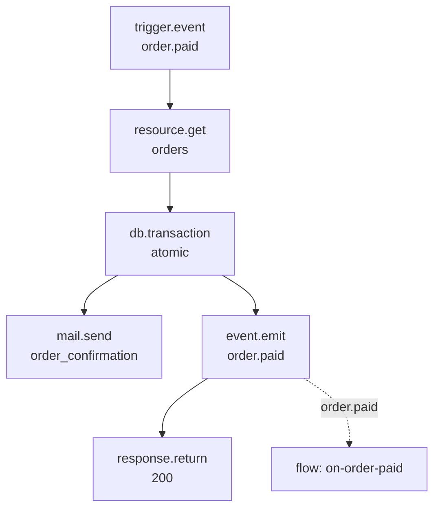
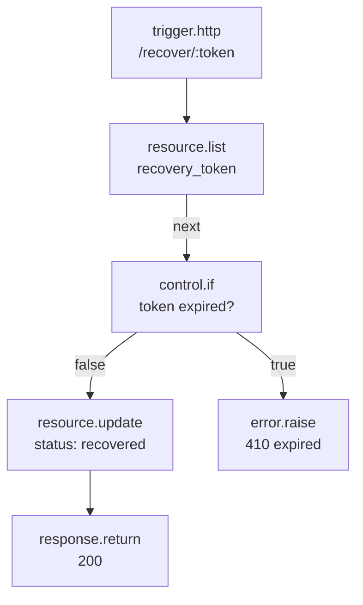
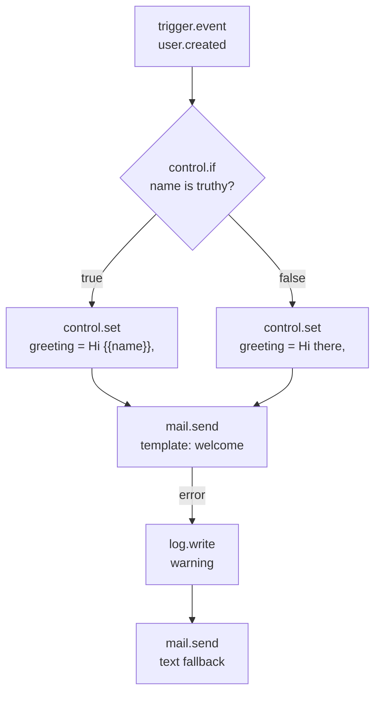

Every flow concept is easier to internalize when you see it in a complete, working example. This page walks through five flows that put triggers, data blocks, control blocks, platform blocks, and error handling together.

## Order fulfilment pipeline

When an order is paid, multiple downstream systems need to react: inventory must be committed, a receipt emailed, and analytics updated. Rather than one enormous flow, Pawabase uses event-driven composition — the `capture_payment` flow emits `order.paid`, and separate flows subscribe to it.

```json
{
  "name": "capture_payment",
  "description": "Process a payment, commit inventory, and announce the order.",
  "enabled": true,
  "timeout": 60,
  "record_runs": true,
  "definition": {
    "nodes": [
      { "id": "start", "data": { "block": "trigger.event", "config": { "event": "order.paid" } } },
      { "id": "load", "data": { "block": "resource.get", "config": { "resource": "orders", "id": "{{ input.event.payload.order_id }}" } } },
      { "id": "commit", "data": { "block": "db.transaction", "config": {
        "operations": [
          {"op": "update", "resource": "orders", "id": "{{ input.event.payload.order_id }}", "data": {"status": "paid"}},
          {"op": "update", "resource": "inventory", "id": "{{ steps.load.output.variant_id }}", "data": {"reserved": "{{ steps.load.output.reserved | int }}"}}
        ]
      }}},
      { "id": "receipt", "data": { "block": "mail.send", "config": {
        "to": "{{ steps.load.output.email }}", "template": "order_confirmation",
        "data": {"order": "{{ steps.load.output }}"}
      }}},
      { "id": "emit", "data": { "block": "event.emit", "config": {
        "event": "order.paid", "payload": {"order_id": "{{ steps.load.output.id }}"}
      }}},
      { "id": "reply", "data": { "block": "response.return", "config": {
        "status": 200, "body": {"paid": true, "order": "{{ steps.load.output }}"}
      }}}
    ],
    "edges": [
      {"id": "start-load", "source": "start", "target": "load"},
      {"id": "load-commit", "source": "load", "target": "commit"},
      {"id": "commit-receipt", "source": "commit", "target": "receipt"},
      {"id": "commit-emit", "source": "commit", "target": "emit"},
      {"id": "emit-reply", "source": "emit", "target": "reply"}
    ]
  }
}
```

Notice three things:

1. **`db.transaction` keeps the inventory commit and the order status update atomic** — if either fails, neither happens.
2. **`event.emit` decouples notification from fulfilment** — a separate `on-order-paid` flow subscribes to `order.paid` and handles stock-commitment and analytics independently.
3. **`response.return` is at the end** — the HTTP request answers only after the transaction commits, the receipt is queued, and the event is emitted.



## Abandoned cart recovery

Generate a recovery token, stamp it on a record, email a link, and handle the return visit. This flow demonstrates `util.id`, `time.now`, `resource.create`, `mail.send`, and the round-trip through `trigger.http`.

```json
[
  { "id": "token", "data": { "block": "util.id", "config": { "kind": "token", "length": 32 } } },
  { "id": "now", "data": { "block": "time.now", "config": {} } },
  {
    "id": "record",
    "data": {
      "block": "resource.create",
      "config": {
        "resource": "abandoned_carts",
        "data": {
          "store_id": "{{ item.store_id }}", "cart_id": "{{ item.id }}",
          "email": "{{ item.email }}", "recovery_status": "emailed",
          "recovery_token": "{{ steps.token.output }}", "notified_at": "{{ steps.now.output }}"
        }
      }
    }
  },
  {
    "id": "mail",
    "data": {
      "block": "mail.send",
      "config": {
        "to": "{{ item.email }}", "template": "cart_recovery",
        "data": { "token": "{{ steps.token.output }}" }
      }
    }
  }
]
```

The recipient follows `https://shop.example.com/recover/{{ token }}`. A `trigger.http` flow looks the record up by `recovery_token` with a `resource.list` filter, checks the token hasn't expired (using `time.now` and `offset_seconds`), and either completes the checkout or returns a `410` if the token has expired.



## Welcome email with fallback

A signup-triggered flow that looks up a user, tries to send a branded welcome email through a template, and falls back to plain text if the template send fails. This demonstrates `control.if`, `control.set`, and `error` handles.

```json
{
  "id": "send", "data": {
    "block": "mail.send",
    "config": {
      "to": "{{ input.event.payload.email }}",
      "template": "welcome",
      "data": { "greeting": "{{ vars.greeting }}" }
    }
  }
}
```

```json
{"id": "send-error", "source": "send", "target": "log_failure", "sourceHandle": "error"}
```



Two things worth internalizing:
1. **Two branches converge on the same next node** — both `greeting_named` and `greeting_default` have edges into `send`.
2. **An `error` handle is opt-in, per block** — only `send` has one drawn; if `fallback`'s own `mail.send` also fails, there's no `error` edge out of it, so the run fails there.

## Nightly rollup

A scheduled flow that aggregates yesterday's data. It demonstrates `trigger.schedule`, `time.now` with `offset_seconds`, `db.query` with aggregate SQL, `math.calculate`, and `response.return` (which is discarded for non-HTTP flows but still ends the run cleanly).

```json
{
  "id": "day", "data": {
    "block": "time.now",
    "config": { "format": "date", "offset_seconds": -86400 }
  }
}
```

```json
{
  "id": "stats", "data": {
    "block": "db.query",
    "config": {
      "sql": "SELECT COALESCE(AVG(rating), 0) AS avg, COUNT(*) AS n FROM reviews WHERE date = ? AND status = 'approved'",
      "params": ["{{ steps.day.output }}"]
    }
  }
}
```

```json
{
  "id": "round", "data": {
    "block": "math.calculate",
    "config": { "operation": "round", "values": ["{{ steps.stats.output.0.avg }}"], "digits": 1 }
  }
}
```

```json
{
  "id": "store", "data": {
    "block": "cache.set",
    "config": {
      "key": "daily:rating:avg",
      "value": "{{ steps.round.output }}",
      "ttl": 86400,
      "tags": ["daily:rating"]
    }
  }
}
```

The schedule fires at 3 AM with `trigger.schedule` and `cron: "0 3 * * *"`. The `offset_seconds: -86400` ensures the rollup always summarizes the *previous* day regardless of when the job fires. The result is cached for dashboards to read.

## Webhook verification

An inbound webhook flow that verifies a signature, parses the payload, validates it, and routes on event type. This demonstrates `trigger.webhook`, `json.parse`, `validate.schema`, `control.switch`, and `error.raise`.

```json
[
  { "id": "start", "data": { "block": "trigger.webhook", "config": { "hook": "partner_events" } } },
  { "id": "decode", "data": { "block": "json.parse", "config": { "text": "{{ input.body }}" } } },
  {
    "id": "check",
    "data": {
      "block": "validate.schema",
      "config": {
        "value": "{{ steps.decode.output }}",
        "fields": [
          { "name": "event_type", "type": "string", "required": true },
          { "name": "data", "type": "object", "required": true }
        ],
        "on_invalid": "branch"
      }
    }
  },
  {
    "id": "route",
    "data": {
      "block": "control.switch",
      "config": { "condition": { "eq": ["{{ steps.decode.output.event_type }}", "payment_confirmed"] } }
    }
  }
]
```

The `trigger.webhook` block verifies the signature before the flow starts — if the HMAC-SHA256 signature doesn't match, the request is rejected with `400` and the flow never runs. The `validate.schema` with `on_invalid: "branch"` lets the flow handle a malformed payload itself (log it, return a custom error) rather than a bare `422`.

## Common patterns

### Read, compute, write

The most common flow shape: load data, compute a result, write it back. Use `resource.get` → compute blocks → `resource.update` (or `db.transaction` for atomic multi-row writes).

### Emit and forget

When a flow triggers downstream work, emit an event rather than calling other flows directly. This keeps flows decoupled and lets downstream consumers be added later without changing the emitter.

### Validate early, fail fast

Put `validate.schema` right after a `trigger.http` node to catch bad payloads immediately. Use `on_invalid: "branch"` when you want to handle validation errors with a custom response.

### Branch on missing

Always wire the `missing` handle on `resource.get`, `resource.update`, and `auth.lookup`. An unhandled `missing` branch ends the run quietly — which is almost never what you want.

### Use control.set to converge branches

When two branches produce a value that a downstream block needs, write both to the same `vars.<name>` with `control.set` rather than having downstream blocks reference `steps.branch_a.output` vs. `steps.branch_b.output`.

## Next

<CardGroup cols={2}>
  <Card title="Triggers" icon="waypoints" href="/flows/triggers">Every trigger type.</Card>
  <Card title="Control flow" icon="git-branch" href="/flows/control-flow">Branching and looping.</Card>
  <Card title="Errors and retries" icon="triangle-alert" href="/flows/errors-and-retries">Handling failures.</Card>
  <Card title="Custom blocks" icon="puzzle-piece" href="/flows/custom-blocks">Extending with your own blocks.</Card>
</CardGroup>
