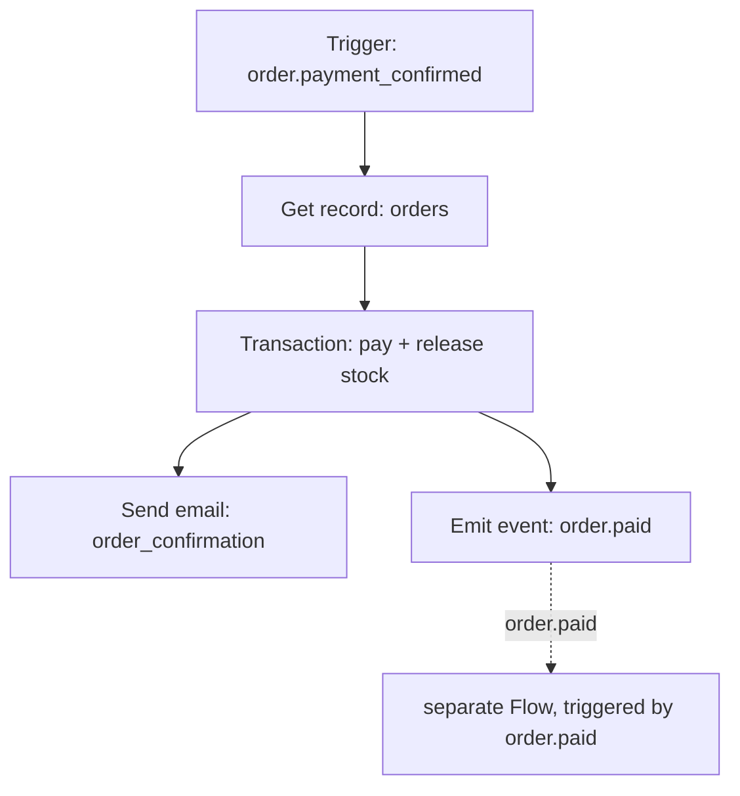
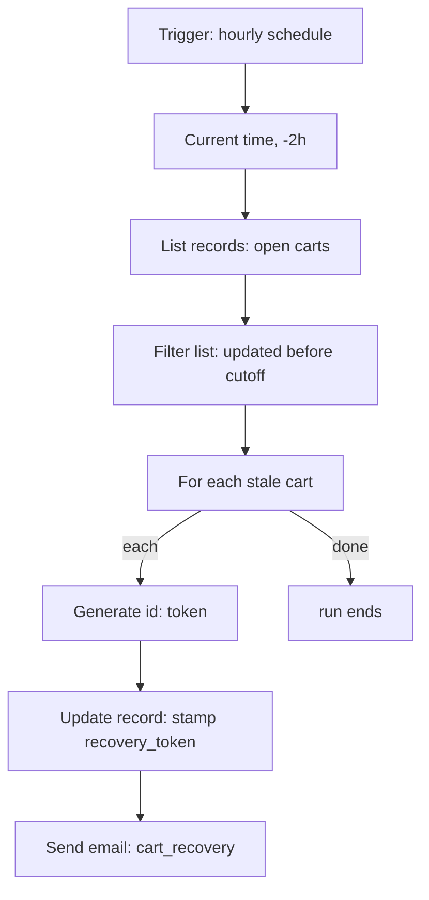
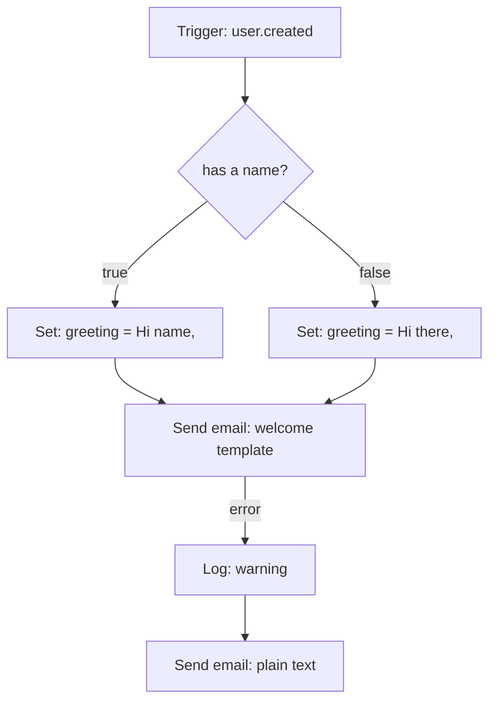
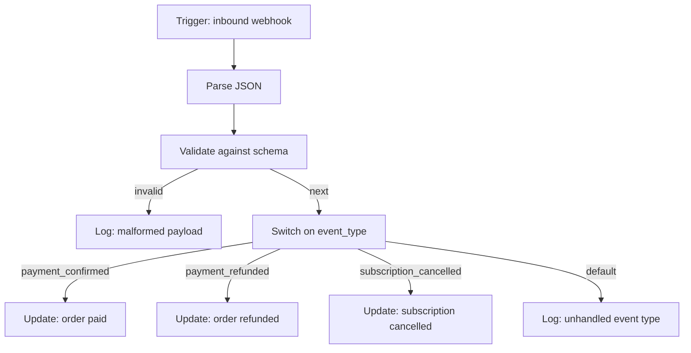

Every recipe below is a complete Flow definition — the actual `nodes`/`edges` shape Studio saves when you build it on the canvas, in the same format used throughout [Block reference](/flows/block-reference). Copy one, adjust the resource names and templates for your project, and validate it before you rely on it.

<Note>
Every config field shown here matches the real block schemas exactly — field names like `control.switch`'s `value`/`cases` (not `condition`) and `control.retry`'s `attempts`/`base_delay` (not `delay`) are easy to get wrong from memory. If a field name here disagrees with something you've seen elsewhere, trust [Block reference](/flows/block-reference).
</Note>

## Order fulfilment pipeline

When an order is paid, several things need to happen: inventory needs to be committed, a receipt needs to go out, and other parts of the system need to know. Rather than one Flow that does everything, this one does the minimum inside the triggering request — commit the write — and emits an event for everything else to react to independently.

```json
{
  "name": "capture_payment",
  "description": "Mark an order paid, commit its inventory reservation, and announce it.",
  "enabled": true,
  "timeout": 60,
  "record_runs": true,
  "definition": {
    "nodes": [
      { "id": "start", "data": { "block": "trigger.event", "config": { "event": "order.payment_confirmed" } } },
      { "id": "load", "data": { "block": "resource.get", "config": { "resource": "orders", "id": "{{ input.payload.order_id }}" } } },
      {
        "id": "commit",
        "data": {
          "block": "db.transaction",
          "config": {
            "operations": [
              { "op": "update", "resource": "orders", "id": "{{ input.payload.order_id }}", "data": { "status": "paid" } },
              { "op": "update", "resource": "inventory", "id": "{{ steps.load.output.variant_id }}", "data": { "reserved": false } }
            ]
          }
        }
      },
      {
        "id": "receipt",
        "data": {
          "block": "mail.send",
          "config": {
            "to": "{{ steps.load.output.email }}",
            "template": "order_confirmation",
            "data": { "order": "{{ steps.load.output }}" }
          }
        }
      },
      {
        "id": "announce",
        "data": {
          "block": "event.emit",
          "config": { "event": "order.paid", "payload": { "order_id": "{{ steps.load.output.id }}" } }
        }
      }
    ],
    "edges": [
      { "id": "e1", "source": "start", "target": "load" },
      { "id": "e2", "source": "load", "target": "commit" },
      { "id": "e3", "source": "commit", "target": "receipt" },
      { "id": "e4", "source": "commit", "target": "announce" }
    ]
  }
}
```

Three things worth noticing:

1. **`db.transaction` keeps the order-status update and the inventory release atomic** — if either write fails, neither lands. A `resource.update` on `orders` followed by a separate `resource.update` on `inventory` would not give you that guarantee; a failure between the two would leave the order paid but the inventory still reserved.
2. **`commit` fans out to two Actions.** Both `receipt` and `announce` are wired to `commit`'s `next` branch, so both run once the transaction succeeds — there's no need for them to run in sequence, since neither depends on the other's output.
3. **Nothing calls another Flow directly.** A separate Flow, triggered by `trigger.event` on `order.paid`, can pick up stock reordering, analytics, or a Slack notification — all independently, all addable later without touching this Flow.



## Abandoned-cart recovery

Two Flows: the first runs on a schedule, finds carts nobody has touched in a while, and emails each one a recovery link; the second handles the click. This recipe shows why the first one needs a `control.foreach` — `item` only means something inside that loop's `each` branch, and the earlier version of this recipe skipped showing that.

### Flow 1 — find stale carts and email them

```json
{
  "name": "recover_abandoned_carts",
  "description": "Every hour, email a recovery link to carts untouched for 2+ hours.",
  "enabled": true,
  "timeout": 300,
  "definition": {
    "nodes": [
      { "id": "start", "data": { "block": "trigger.schedule", "config": { "cron": "0 * * * *" } } },
      { "id": "cutoff", "data": { "block": "time.now", "config": { "offset_seconds": -7200 } } },
      {
        "id": "carts",
        "data": {
          "block": "resource.list",
          "config": {
            "resource": "carts",
            "filters": { "status": "open" },
            "limit": 200
          }
        }
      },
      {
        "id": "stale",
        "data": {
          "block": "transform.filter",
          "config": {
            "value": "{{ steps.carts.output.data }}",
            "condition": { "lt": ["$item.updated_at", "$steps.cutoff.output"] }
          }
        }
      },
      {
        "id": "loop",
        "data": {
          "block": "control.foreach",
          "config": { "items": "{{ steps.stale.output }}" }
        }
      },
      {
        "id": "token",
        "data": { "block": "util.id", "config": { "kind": "token", "length": 32 } }
      },
      {
        "id": "stamp",
        "data": {
          "block": "resource.update",
          "config": {
            "resource": "carts",
            "id": "{{ item.id }}",
            "data": { "status": "recovery_emailed", "recovery_token": "{{ steps.token.output }}" }
          }
        }
      },
      {
        "id": "mail",
        "data": {
          "block": "mail.send",
          "config": {
            "to": "{{ item.email }}",
            "template": "cart_recovery",
            "data": { "token": "{{ steps.token.output }}", "cart_id": "{{ item.id }}" }
          }
        }
      }
    ],
    "edges": [
      { "id": "e1", "source": "start", "target": "cutoff" },
      { "id": "e2", "source": "cutoff", "target": "carts" },
      { "id": "e3", "source": "carts", "target": "stale" },
      { "id": "e4", "source": "stale", "target": "loop" },
      { "id": "e5", "source": "loop", "target": "token", "sourceHandle": "each" },
      { "id": "e6", "source": "token", "target": "stamp" },
      { "id": "e7", "source": "stamp", "target": "mail" }
    ]
  }
}
```

The `loop` Step's `each` branch is what makes `item.email`, `item.id`, and every other `item.*` reference inside `token`, `stamp`, and `mail` resolve to *the cart currently being processed* — `token`, `stamp`, and `mail` are the loop's body, reached only through `loop`'s `each` branch, one full pass per stale cart. `items` is the only config field `control.foreach` takes; there's no separate field to name the loop variable — it's always `item`, with `index` alongside it.



### Flow 2 — the recovery link

```json
{
  "name": "recover_cart_click",
  "description": "A recipient followed their recovery link.",
  "enabled": true,
  "timeout": 30,
  "definition": {
    "nodes": [
      { "id": "start", "data": { "block": "trigger.http", "config": { "method": "GET", "path": "/recover/{token}" } } },
      {
        "id": "find",
        "data": {
          "block": "resource.list",
          "config": { "resource": "carts", "filters": { "recovery_token": "{{ input.params.token }}" }, "limit": 1 }
        }
      },
      {
        "id": "check",
        "data": {
          "block": "control.if",
          "config": { "condition": { "empty": "$steps.find.output.data" } }
        }
      },
      {
        "id": "expired",
        "data": { "block": "error.raise", "config": { "status": 410, "message": "This recovery link has expired.", "code": "cart_recovery_expired" } }
      },
      {
        "id": "restore",
        "data": {
          "block": "resource.update",
          "config": {
            "resource": "carts",
            "id": "{{ steps.find.output.data.0.id }}",
            "data": { "status": "open" }
          }
        }
      },
      {
        "id": "reply",
        "data": {
          "block": "response.return",
          "config": { "status": 200, "body": { "cart": "{{ steps.restore.output }}" } }
        }
      }
    ],
    "edges": [
      { "id": "e1", "source": "start", "target": "find" },
      { "id": "e2", "source": "find", "target": "check" },
      { "id": "e3", "source": "check", "target": "expired", "sourceHandle": "true" },
      { "id": "e4", "source": "check", "target": "restore", "sourceHandle": "false" },
      { "id": "e5", "source": "restore", "target": "reply" }
    ]
  }
}
```

`resource.list` never fails on zero matches — it returns an empty `data` array — so the "not found" case here is checked explicitly with `control.if` and `{"empty": "$steps.find.output.data"}`, rather than relying on a `missing` branch (`resource.list` doesn't have one; only `resource.get`, `resource.update`, and `auth.lookup` do).

## Welcome email with a fallback

A Flow triggered on signup that greets a user by name when it has one, and falls back to a generic greeting otherwise — then falls back again, to plain text, if the templated send itself fails.

```json
{
  "name": "send_welcome_email",
  "description": "Greet a new user, falling back to plain text if the templated send fails.",
  "enabled": true,
  "timeout": 30,
  "definition": {
    "nodes": [
      { "id": "start", "data": { "block": "trigger.event", "config": { "event": "user.created" } } },
      {
        "id": "has_name",
        "data": { "block": "control.if", "config": { "condition": { "exists": "$input.payload.name" } } }
      },
      {
        "id": "greet_named",
        "data": { "block": "control.set", "config": { "values": { "greeting": "Hi {{ input.payload.name }}," } } }
      },
      {
        "id": "greet_default",
        "data": { "block": "control.set", "config": { "values": { "greeting": "Hi there," } } }
      },
      {
        "id": "send",
        "data": {
          "block": "mail.send",
          "config": {
            "to": "{{ input.payload.email }}",
            "template": "welcome",
            "data": { "greeting": "{{ vars.greeting }}" }
          }
        }
      },
      {
        "id": "log_failure",
        "data": {
          "block": "log.write",
          "config": {
            "level": "warning",
            "message": "Templated welcome email failed, sending plain text instead",
            "category": "mail",
            "data": { "email": "{{ input.payload.email }}", "error": "{{ error.message }}" }
          }
        }
      },
      {
        "id": "fallback",
        "data": {
          "block": "mail.send",
          "config": {
            "to": "{{ input.payload.email }}",
            "subject": "Welcome",
            "text": "{{ vars.greeting }} welcome aboard."
          }
        }
      }
    ],
    "edges": [
      { "id": "e1", "source": "start", "target": "has_name" },
      { "id": "e2", "source": "has_name", "target": "greet_named", "sourceHandle": "true" },
      { "id": "e3", "source": "has_name", "target": "greet_default", "sourceHandle": "false" },
      { "id": "e4", "source": "greet_named", "target": "send" },
      { "id": "e5", "source": "greet_default", "target": "send" },
      { "id": "e6", "source": "send", "target": "log_failure", "sourceHandle": "error" },
      { "id": "e7", "source": "log_failure", "target": "fallback" }
    ]
  }
}
```



Two things worth internalizing here, both general to every Flow:

1. **Both branches converge on `send`.** `greet_named` and `greet_default` each write the same `vars.greeting`, so `send` (and `fallback`, further down) can reference one name regardless of which branch actually ran.
2. **The `error` branch is opt-in, per Step.** Only `send` has one drawn. If `fallback`'s own `mail.send` also fails, there's no `error` branch out of *it*, so the run fails there rather than looping — which is the right behavior for a last-resort fallback.

## Nightly rollup

A scheduled Flow that aggregates the previous day's reviews and caches the result for a dashboard to read. It shows `time.now`'s `offset_seconds`, a read-only `db.query`, and `math.calculate`'s `round`.

```json
{
  "name": "nightly_review_rollup",
  "description": "Cache yesterday's average review rating.",
  "enabled": true,
  "timeout": 60,
  "definition": {
    "nodes": [
      { "id": "start", "data": { "block": "trigger.schedule", "config": { "cron": "0 3 * * *" } } },
      {
        "id": "day",
        "data": { "block": "time.now", "config": { "format": "date", "offset_seconds": -86400 } }
      },
      {
        "id": "stats",
        "data": {
          "block": "db.query",
          "config": {
            "sql": "SELECT COALESCE(AVG(rating), 0) AS avg, COUNT(*) AS n FROM reviews WHERE date = $1 AND status = 'approved'",
            "params": ["{{ steps.day.output }}"]
          }
        }
      },
      {
        "id": "round",
        "data": {
          "block": "math.calculate",
          "config": { "operation": "round", "values": ["{{ steps.stats.output.0.avg }}"], "digits": 1 }
        }
      },
      {
        "id": "store",
        "data": {
          "block": "cache.set",
          "config": {
            "key": "daily:rating:avg",
            "value": { "average": "{{ steps.round.output }}", "count": "{{ steps.stats.output.0.n }}", "date": "{{ steps.day.output }}" },
            "ttl": 86400,
            "tags": ["daily:rating"]
          }
        }
      }
    ],
    "edges": [
      { "id": "e1", "source": "start", "target": "day" },
      { "id": "e2", "source": "day", "target": "stats" },
      { "id": "e3", "source": "stats", "target": "round" },
      { "id": "e4", "source": "round", "target": "store" }
    ]
  }
}
```

`offset_seconds: -86400` is what makes this a rollup of *yesterday* regardless of exactly when the 3 AM schedule actually fires — the timestamp is computed relative to the run, not hardcoded. `math.calculate`'s `values` field always takes a list, even for a single-number operation like `round`: `["{{ steps.stats.output.0.avg }}"]`, not a bare value.

## Inbound webhook verification and routing

An inbound webhook Flow that decodes a JSON payload, validates its shape, and routes on an event-type field. This is the recipe that most needed its `control.switch` config fixed — it takes `value` and `cases`, not a `condition`.

```json
{
  "name": "handle_partner_webhook",
  "description": "Decode, validate, and route an inbound partner webhook by event type.",
  "enabled": true,
  "timeout": 30,
  "definition": {
    "nodes": [
      { "id": "start", "data": { "block": "trigger.webhook", "config": { "hook": "partner_events" } } },
      { "id": "decode", "data": { "block": "json.parse", "config": { "text": "{{ input.body }}" } } },
      {
        "id": "check",
        "data": {
          "block": "validate.schema",
          "config": {
            "value": "{{ steps.decode.output }}",
            "fields": [
              { "name": "event_type", "type": "string", "required": true },
              { "name": "data", "type": "object", "required": true }
            ],
            "on_invalid": "branch"
          }
        }
      },
      {
        "id": "bad_payload",
        "data": {
          "block": "log.write",
          "config": { "level": "warning", "message": "Malformed partner webhook payload", "category": "webhooks", "data": "{{ steps.check.output }}" }
        }
      },
      {
        "id": "route",
        "data": {
          "block": "control.switch",
          "config": {
            "value": "{{ steps.decode.output.event_type }}",
            "cases": ["payment_confirmed", "payment_refunded", "subscription_cancelled"]
          }
        }
      },
      {
        "id": "handle_payment",
        "data": {
          "block": "resource.update",
          "config": {
            "resource": "orders",
            "id": "{{ steps.decode.output.data.order_id }}",
            "data": { "status": "paid" }
          }
        }
      },
      {
        "id": "handle_refund",
        "data": {
          "block": "resource.update",
          "config": {
            "resource": "orders",
            "id": "{{ steps.decode.output.data.order_id }}",
            "data": { "status": "refunded" }
          }
        }
      },
      {
        "id": "handle_cancel",
        "data": {
          "block": "resource.update",
          "config": {
            "resource": "subscriptions",
            "id": "{{ steps.decode.output.data.subscription_id }}",
            "data": { "status": "cancelled" }
          }
        }
      },
      {
        "id": "ignore",
        "data": {
          "block": "log.write",
          "config": { "level": "info", "message": "Unhandled partner event type", "category": "webhooks", "data": { "event_type": "{{ steps.decode.output.event_type }}" } }
        }
      }
    ],
    "edges": [
      { "id": "e1", "source": "start", "target": "decode" },
      { "id": "e2", "source": "decode", "target": "check" },
      { "id": "e3", "source": "check", "target": "bad_payload", "sourceHandle": "invalid" },
      { "id": "e4", "source": "check", "target": "route" },
      { "id": "e5", "source": "route", "target": "handle_payment", "sourceHandle": "payment_confirmed" },
      { "id": "e6", "source": "route", "target": "handle_refund", "sourceHandle": "payment_refunded" },
      { "id": "e7", "source": "route", "target": "handle_cancel", "sourceHandle": "subscription_cancelled" },
      { "id": "e8", "source": "route", "target": "ignore", "sourceHandle": "default" }
    ]
  }
}
```

`trigger.webhook` verifies the inbound signature before the Flow ever runs — an unverified request never reaches `decode`. `validate.schema`'s `on_invalid: "branch"` means a malformed payload takes the `invalid` branch and gets logged, rather than failing the run with a bare `422`. And `route`'s branches are exactly the three strings listed in its `cases` array, plus `default` for anything else — there's no `condition` field on `control.switch` at all.



## How to choose which recipe to start from

| Scenario | Recipe |
| --- | --- |
| A payment lands and several systems need to react | Order fulfilment pipeline |
| Recovering carts nobody finished checking out | Abandoned-cart recovery |
| Sending a welcome email that shouldn't fail silently | Welcome email with a fallback |
| Aggregating numbers on a schedule for a dashboard | Nightly rollup |
| Receiving and routing an inbound webhook | Inbound webhook verification and routing |

Combining patterns is normal — emit an event from one Flow and let another one subscribe, the way the order-fulfilment recipe leaves room for a separate Flow to react to `order.paid`.

## Next

<CardGroup cols={2}>
  <Card title="Block reference" icon="list" href="/flows/block-reference">Every block's exact config fields.</Card>
  <Card title="Triggers" icon="waypoints" href="/flows/triggers">Every Trigger type and its `input` shape.</Card>
  <Card title="Control flow" icon="git-branch" href="/flows/control-flow">If/switch/foreach/while/retry, in depth.</Card>
  <Card title="Errors and retries" icon="triangle-alert" href="/flows/errors-and-retries">Handling failure deliberately.</Card>
</CardGroup>
