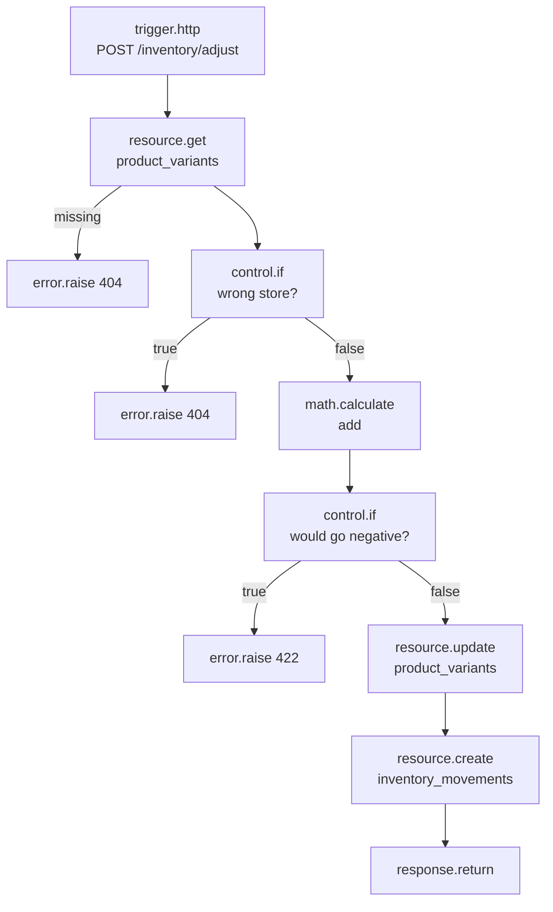

Most flows spend most of their time doing one thing: reading and writing rows. The five **resource blocks** — `resource.list`, `resource.get`, `resource.create`, `resource.update`, `resource.delete` — are how a flow does that without dropping to raw SQL. Each one calls straight into the same `store` object a generated `/rest/v1/<resource>` route uses (see [The mental model](/concepts/mental-model#2-each-environment-compiles-into-an-app)), so a `resource.create` node inside a flow validates fields, applies defaults, and — on the API — fires `resource.*` events and invalidates caches exactly like a client `POST` would.

<Note>
Resource blocks run with **service rights**. They do not re-evaluate the resource's own [policies](/policies/overview) — a `resource.get` on `invoices` inside a flow can read every invoice regardless of who triggered the run. This is deliberate: flows are your server-side code, trusted the same way a secret key is trusted. Guard the *entry* to the flow (its [trigger's policy](/flows/triggers), or an [`auth.require`](/flows/platform-blocks#auth-require)/[`policy.check`](/flows/platform-blocks#policy-check) node inside it) if a caller's rights should limit what the flow is allowed to do. This is spelled out in [Policies → FAQ](/policies/overview#faq).
</Note>

If you need something these five blocks can't express — a join, an aggregate, several writes that must land together — see [Data blocks → db.query and db.transaction](/flows/data-blocks#db-query-sql-query), which sit right alongside them in the block catalogue's `resources` category.

## Quick reference

| Key | Title | Handles | Config keys |
| --- | --- | --- | --- |
| `resource.list` | List records | `next` | `resource`, `filters`, `sort`, `limit`, `offset` |
| `resource.get` | Get record | `next`, `missing` | `resource`, `id` |
| `resource.create` | Create record | `next` | `resource`, `data` |
| `resource.update` | Update record | `next`, `missing` | `resource`, `id`, `data` |
| `resource.delete` | Delete record | `next` | `resource`, `id` |

Every one of them shares the same `resource` config key: the resource's `name`, exactly as it appears in the URL segment of `/rest/v1/<resource>`.

---

## resource.list — List records

Lists records of a resource with equality filters, sorting, and pagination — the flow equivalent of `GET /rest/v1/<resource>?filter[...]=...&sort=...&limit=...&offset=...`.

| Config | Type | Required | Default | Description |
| --- | --- | --- | --- | --- |
| `resource` | `string` | yes | — | The resource's name |
| `filters` | `json` | no | `{}` | Equality filters, `{field: value}` — every entry is AND-ed |
| `sort` | `string` | no | — | A field name; prefix with `-` to sort descending, e.g. `-created_at` |
| `limit` | `integer` | no | `50` | Page size |
| `offset` | `integer` | no | `0` | How many rows to skip |

**Output:** `{"data": [...], "total": <int>, "limit": <int>, "offset": <int>}` — the same envelope a `GET /rest/v1/<resource>` list response uses.

```json
{
  "id": "recent_orders",
  "data": {
    "block": "resource.list",
    "config": {
      "resource": "orders",
      "filters": { "store_id": "{{ auth.org }}", "status": "paid" },
      "sort": "-placed_at",
      "limit": 20
    }
  }
}
```

`filters` is **equality only** — every key/value pair becomes `field = value`, and every pair is combined with AND. There's no way to express `>`, `<`, `OR`, or a full-text search through `resource.list`'s config; for anything richer, use [`db.query`](/flows/data-blocks#db-query-sql-query) instead.

### The "does one exist?" idiom

Because there's no dedicated "exists" block, flows across this platform use `resource.list` with `limit: 1` and then check `total`:

```json
[
  {
    "id": "find",
    "data": {
      "block": "resource.list",
      "config": { "resource": "carts", "filters": { "token": "{{ input.params.token }}" }, "limit": 1 }
    }
  },
  {
    "id": "no_cart",
    "data": {
      "block": "control.if",
      "config": { "condition": { "not": { "truthy": "$steps.find.output.total" } } }
    }
  },
  {
    "id": "missing",
    "data": { "block": "error.raise", "config": { "status": 404, "code": "cart_not_found", "message": "This cart no longer exists" } }
  }
]
```
Edge `find → no_cart`, then `no_cart → missing` on `true`. The matched row itself, when found, is read as `steps.find.output.data.0` — see [Control flow](/flows/control-flow) for how `control.if` branches and [State](/flows/state) for the `steps.<node>.output` addressing.

<Tip>
Reach for `resource.list` with a `limit: 1` filter (rather than `resource.get`) whenever you're looking a record up by something other than its primary key — a `token`, a `slug`, a unique `email` — because `resource.get`'s `id` config is always the resource's id field.
</Tip>

### Paginating through everything

`resource.list` never returns more than `limit` rows in one call. To process an entire table in a background job, loop with increasing `offset`, or — more simply — use `db.query` with `LIMIT`/`OFFSET` inside a `control.foreach` that follows a `db.query` returning ids. Most sweep-style flows in this codebase reach directly for `db.query` instead of paging `resource.list`, because the SQL version can filter with more than equality (see [Recipes → Abandoned cart recovery](/flows/recipes#abandoned-cart-recovery), which sweeps with a `db.query` on a time cutoff, not `resource.list`).

## resource.get — Get record

Loads exactly one record by id.

| Config | Type | Required | Description |
| --- | --- | --- | --- |
| `resource` | `string` | yes | The resource's name |
| `id` | `string` | yes | The record's id |

**Handles:** `next` (found), `missing` (no such record — the block does not raise, it branches).

**Output:** the record (on `next`), or `null` (on `missing`).

```json
{
  "id": "order",
  "data": {
    "block": "resource.get",
    "config": { "resource": "orders", "id": "{{ input.params.id }}" }
  }
}
```

Because `resource.get` branches instead of raising, the standard pattern right after it is a `missing` edge into an [`error.raise`](/flows/platform-blocks#error-raise) node:

```json
{
  "edges": [
    { "id": "load-order", "source": "http", "target": "order" },
    { "id": "order-missing", "source": "order", "target": "missing", "sourceHandle": "missing" },
    { "id": "order-next", "source": "order", "target": "paid" }
  ]
}
```
```json
{
  "id": "missing",
  "data": {
    "block": "error.raise",
    "config": { "status": 404, "code": "order_not_found", "message": "No such order" }
  }
}
```

This exact three-node shape (`resource.get` → `missing` handle → `error.raise`) appears at the start of nearly every flow in the commerce blueprint that operates on a single record reached from a URL parameter — `fulfil_order`, `cancel_order`, `mark_paid`, and more. It's worth memorising as the default way to load a record from an id.

<Tip>
`resource.get` never applies a policy — it will happily return a record that belongs to someone else. If the flow is reached through a route with a path parameter (`/orders/{id}/fulfil`), tenancy has to be checked explicitly. The blueprint's convention is a `control.if` right after the load:

```json
{
  "id": "foreign",
  "data": {
    "block": "control.if",
    "config": { "condition": { "ne": ["$steps.order.output.store_id", "$auth.org"] } }
  }
}
```
followed by the *same* `404` (not `403`) on the `true` branch — so a request for someone else's order looks identical to one for an order that doesn't exist at all, exactly the way [Policies → From decision to HTTP response](/policies/overview#from-decision-to-http-response) recommends for ordinary resource routes.
</Tip>

## resource.create — Create record

Creates a record.

| Config | Type | Required | Description |
| --- | --- | --- | --- |
| `resource` | `string` | yes | The resource's name |
| `data` | `json` | yes | The fields to set |

**Output:** the created record, including server-assigned fields (`id`, `created_at`/`updated_at` when the resource has `timestamps: true`, and any field defaults).

```json
{
  "id": "new_customer",
  "data": {
    "block": "resource.create",
    "config": {
      "resource": "customers",
      "data": {
        "store_id": "{{ vars.cart.store_id }}",
        "email": "{{ input.body.email | lower }}",
        "name": "{{ input.body.name }}"
      }
    }
  }
}
```

`data` is validated against the resource's own field definitions exactly like a client `POST` — required fields, types, `min`/`max`, `enum`, uniqueness — so a bad value fails the run with the same `422` a REST client would get. Because it runs with service rights, `resource.create` can set fields a normal caller couldn't (an `owner_field` other than the caller, a `status` a policy would otherwise block) — that's the point of doing the write from a flow rather than exposing the raw operation.

On the API, every successful `resource.create` also runs `after_write`: it emits `<resource>.created`, invalidates the resource's cache tags, and pushes to any realtime channel the resource has enabled (see [The mental model → 5. Everything emits events](/concepts/mental-model#5-everything-emits-events)). A flow doesn't need to emit that event itself.

## resource.update — Update record

Updates the given fields of a record (a partial update — fields not present in `data` are left alone).

| Config | Type | Required | Description |
| --- | --- | --- | --- |
| `resource` | `string` | yes | The resource's name |
| `id` | `string` | yes | The record's id |
| `data` | `json` | yes | The fields to change |

**Handles:** `next` (updated), `missing` (no such record).

**Output:** the updated record (on `next`), or `null` (on `missing`).

```json
{
  "id": "mark_paid",
  "data": {
    "block": "resource.update",
    "config": {
      "resource": "orders",
      "id": "{{ steps.order.output.id }}",
      "data": { "payment_status": "paid", "paid_at": "{{ steps.now.output }}" }
    }
  }
}
```

Like `resource.create`, a successful update runs `after_write`: `<resource>.updated` fires, caches invalidate, realtime notifies. Like `resource.get`, a missing target branches to `missing` rather than raising — wire it to an `error.raise` the same way.

<Warning>
`data` **replaces** each field it names; it does not merge into nested JSON fields or increment numbers. There is no `{"$inc": 1}`-style operator. To increment a counter you always read the current value first (with a preceding `resource.get`/`db.query`) and compute the new one with [`math.calculate`](/flows/data-blocks#math-calculate-calculate) before writing it back — see the `purchase_count`/`orders_count`/`usage_count` updates throughout [Recipes](/flows/recipes) for the pattern, or the direct example under `math.calculate`'s worked examples.
</Warning>

## resource.delete — Delete record

Deletes a record.

| Config | Type | Required | Description |
| --- | --- | --- | --- |
| `resource` | `string` | yes | The resource's name |
| `id` | `string` | yes | The record's id |

**Output:** a boolean — `true` if a row was deleted, `false` if there was nothing to delete at that id.

```json
{
  "id": "remove_line",
  "data": {
    "block": "resource.delete",
    "config": { "resource": "cart_items", "id": "{{ input.body.item_id }}" }
  }
}
```

Unlike `resource.get`/`resource.update`, `resource.delete` doesn't branch on "missing" — it returns `false` on the `next` handle either way, so check the boolean with a `control.if` afterwards if the flow needs to react differently to "deleted" versus "there was nothing there":

```json
{
  "id": "check",
  "data": { "block": "control.if", "config": { "condition": { "eq": ["$steps.remove_line.output", false] } } }
}
```

A successful delete (one that actually removed a row) still runs `after_write` and emits `<resource>.deleted` with the record as it was just before deletion.

---

## A complete worked example: full CRUD in one flow

The flow below is a self-contained "adjust stock" endpoint that exercises all five resource blocks together — `resource.get` to load, `resource.list` to look something up by a non-id field, `resource.update` to write the new stock level, `resource.create` to leave an audit trail, and (in a companion flow) `resource.delete` to remove that audit trail if it's ever retracted. It's adapted directly from the commerce blueprint's `adjust_stock` flow.

```json
{
  "name": "adjust_stock",
  "description": "POST /inventory/adjust: change a variant's stock by a delta, refusing to go negative unless backorders are allowed.",
  "definition": {
    "nodes": [
      { "id": "http", "data": { "block": "trigger.http", "config": { "method": "POST", "path": "/inventory/adjust" } } },
      { "id": "variant", "data": { "block": "resource.get", "config": { "resource": "product_variants", "id": "{{ input.body.variant_id }}" } } },
      { "id": "missing", "data": { "block": "error.raise", "config": { "status": 404, "code": "variant_not_found", "message": "No such variant" } } },
      { "id": "foreign", "data": { "block": "control.if", "config": { "condition": { "ne": ["$steps.variant.output.store_id", "$auth.org"] } } } },
      { "id": "not_yours", "data": { "block": "error.raise", "config": { "status": 404, "code": "variant_not_found", "message": "No such variant" } } },
      { "id": "new_stock", "data": { "block": "math.calculate", "config": { "operation": "add", "values": ["{{ steps.variant.output.stock }}", "{{ input.body.delta }}"], "digits": 0 } } },
      { "id": "negative", "data": { "block": "control.if", "config": { "condition": { "all": [ { "lt": ["$steps.new_stock.output", 0] }, { "not": { "truthy": "$steps.variant.output.allow_backorder" } } ] } } } },
      { "id": "below_zero", "data": { "block": "error.raise", "config": { "status": 422, "code": "negative_stock", "message": "Stock can't go below zero for this variant" } } },
      { "id": "save", "data": { "block": "resource.update", "config": { "resource": "product_variants", "id": "{{ input.body.variant_id }}", "data": { "stock": "{{ steps.new_stock.output | int }}" } } } },
      { "id": "movement", "data": { "block": "resource.create", "config": { "resource": "inventory_movements", "data": {
          "store_id": "{{ steps.variant.output.store_id }}",
          "variant_id": "{{ input.body.variant_id }}",
          "delta": "{{ input.body.delta }}",
          "balance_after": "{{ steps.new_stock.output | int }}",
          "reason": "{{ input.body.reason }}",
          "actor_id": "{{ auth.user_id }}"
      } } } },
      { "id": "reply", "data": { "block": "response.return", "config": { "body": { "variant": "{{ steps.save.output }}", "movement": "{{ steps.movement.output }}" } } } }
    ],
    "edges": [
      { "id": "e1", "source": "http", "target": "variant" },
      { "id": "e2", "source": "variant", "target": "missing", "sourceHandle": "missing" },
      { "id": "e3", "source": "variant", "target": "foreign" },
      { "id": "e4", "source": "foreign", "target": "not_yours", "sourceHandle": "true" },
      { "id": "e5", "source": "foreign", "target": "new_stock", "sourceHandle": "false" },
      { "id": "e6", "source": "new_stock", "target": "negative" },
      { "id": "e7", "source": "negative", "target": "below_zero", "sourceHandle": "true" },
      { "id": "e8", "source": "negative", "target": "save", "sourceHandle": "false" },
      { "id": "e9", "source": "save", "target": "movement" },
      { "id": "e10", "source": "movement", "target": "reply" }
    ]
  }
}
```



Trace this in Studio (see [Runs and testing](/flows/runs-and-testing)) and you'll see every step's output feed the next: `variant.output.stock` into the `math.calculate` node, its output into both `resource.update`'s `data.stock` and `resource.create`'s `data.balance_after`.

---

## resource.list vs db.query vs Studio's data browser

It's a common question when a flow's data need grows past simple equality filters. Here's how to decide:

| Need | Reach for |
| --- | --- |
| Equality filters, sort by one field, standard pagination | `resource.list` |
| A join, an aggregate, `GROUP BY`, a subquery, `OR` conditions | `db.query` (see [Data blocks](/flows/data-blocks#db-query-sql-query)) |
| Several resource writes that must all succeed or all fail together | `db.transaction` |
| One-off exploration while building a flow, not part of the flow itself | Studio's data browser, or [Studio's SQL console](/data/database-console) |

`resource.list` and `resource.get` also respect the resource's **soft-delete** and **timestamps** configuration the same way the REST API does — a soft-deleted resource's `resource.list` excludes deleted rows by default, matching what a client sees.

## Common mistakes

<AccordionGroup>
  <Accordion title="Expecting resource operations inside a flow to be policy-checked">
    They're not. A flow runs with service rights; the resource's own `list`/`get`/`create`/`update`/`delete` policies never re-evaluate for a `resource.*` block. Guard the flow's own entry point instead — its trigger's policy, or an explicit `auth.require`/`policy.check` node.
  </Accordion>
  <Accordion title="Treating resource.update's data as a merge for nested objects">
    A JSON-typed field's whole value is replaced by whatever `data` provides for that key, not deep-merged. Read the current value and merge it yourself in a template or a `control.merge` node (see [Control flow](/flows/control-flow#control-merge)) if you only want to change part of a nested object.
  </Accordion>
  <Accordion title="Forgetting resource.delete doesn't branch on missing">
    Unlike `resource.get`/`resource.update`, `resource.delete` always follows `next` and returns a boolean. Check `steps.<node>.output` with `control.if` if the flow needs to react to "there was nothing to delete."
  </Accordion>
  <Accordion title="Using resource.list to check tenancy instead of comparing fields directly">
    When you already hold the record (from `resource.get`), comparing `$steps.<node>.output.store_id` to `$auth.org` in a `control.if` is cheaper and clearer than an extra `resource.list` round trip just to "confirm" ownership.
  </Accordion>
  <Accordion title="Relying on resource.list's default limit of 50 for a sweep or export">
    A flow meant to process *everything* (a nightly export, a full recompute) needs to either page explicitly with increasing `offset`, or switch to `db.query` with its own `LIMIT`. Fifty rows silently missing the rest of a table is a common source of "the flow ran but only some of the resource was affected."
  </Accordion>
</AccordionGroup>

## FAQ

<AccordionGroup>
  <Accordion title="Can resource.create/update set a field a policy would otherwise refuse?">
    Yes — resource blocks run with service rights and bypass policies entirely, the same as a secret-key request. This is exactly why flows are the recommended way to do "an admin-only mutation that a normal user's request should trigger" (charge a payment, settle an order): the user-facing route enforces a policy at the door, and the flow behind it can do whatever the business logic requires.
  </Accordion>
  <Accordion title="Does resource.list's total account for filters?">
    Yes — `total` is the count of rows matching `filters`, not the whole table, exactly like a REST list response's `total`.
  </Accordion>
  <Accordion title="What happens if resource is misspelled or doesn't exist in this environment?">
    The block fails the run — there is no silent no-op. Studio's flow editor also flags an unknown resource name at save time via `/flows/validate` when it can (see [Runs and testing](/flows/runs-and-testing#validating-before-you-save)).
  </Accordion>
  <Accordion title="Can I read a record's relations (belongs_to/has_many) through resource.get?">
    `resource.get` returns the record's own columns only. Load a related resource with a second `resource.get`/`resource.list` using the foreign key field, or use `db.query` with a `JOIN` when you need several related records shaped together in one call.
  </Accordion>
</AccordionGroup>

## Next

<CardGroup cols={2}>
  <Card title="Data blocks" icon="shapes" href="/flows/data-blocks">db.query, db.transaction, math.calculate, time.now, and more.</Card>
  <Card title="Platform blocks" icon="plug" href="/flows/platform-blocks">Events, mail, HTTP, storage, cache.</Card>
  <Card title="Control flow" icon="git-branch" href="/flows/control-flow">If/switch/for each — how flows branch and loop around these blocks.</Card>
  <Card title="Recipes" icon="chef-hat" href="/flows/recipes">Full flows built from resource blocks end to end.</Card>
</CardGroup>
