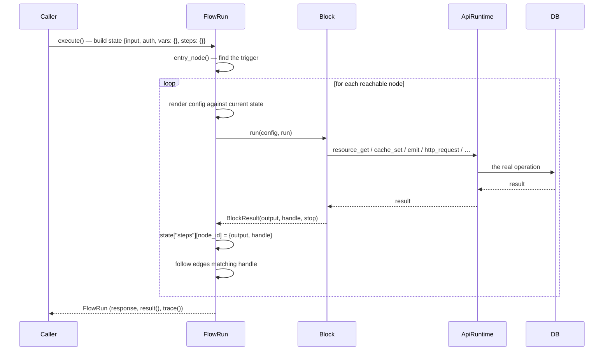

A flow definition is one thing — a JSON graph stored per environment. A **run** is one execution of that graph: it walks the nodes, calls the blocks, records every step, and produces a response (for HTTP-triggered flows) or a result (for background flows). This page covers how runs execute, how to validate a flow before it runs, and how to inspect the results.

<CardGroup cols={3}>
  <Card title="Validate" icon="shield-check">Catch structural problems before saving — zero side effects.</Card>
  <Card title="Run saved flow" icon="play">Execute the saved version against real data, with a full trace.</Card>
  <Card title="Inspect runs" icon="list-tree">Query flow_runs for input, output, trace, logs, and duration.</Card>
</CardGroup>

## How a run executes

`FlowRun.execute()` finds the entry node (the flow's single trigger, or the one named by `entry` when several triggers exist), then walks the graph **depth-first with an explicit stack** — not Python recursion — so a very long chain of blocks doesn't hit a stack-depth limit.

```python
async def execute(self) -> FlowRun:
    start = self.entry_node()
    try:
        await asyncio.wait_for(self._walk(start), timeout=self.timeout)
    except TimeoutError:
        raise FlowError(f"flow exceeded {self.timeout}s", status=504, code="timeout") from exc
    return self
```

For each node it visits:

1. **Deep-copies** the node's `config` so nothing in the stored definition can be mutated by a run.
2. **Renders** every `{{ }}` template in the config against the run's current state, unless the block opted into `raw_config` (control blocks that need to see the unrendered condition).
3. **Calls** the block's `run(config, self)`.
4. **Records a Step** — node id, block key, duration, the handle returned, the output, any error — into the run's trace.
5. **Stores the output** at `state["steps"][node_id]`, so later blocks can read it.
6. **Follows every edge** whose `sourceHandle` matches the returned handle.

A run stops when:
- A block sets `stop=True` (as `response.return` and `control.stop` do)
- It runs out of reachable nodes
- It exceeds `MAX_STEPS` (10,000 — a safety net against accidental infinite graphs)
- Its total wall-clock time exceeds the flow's `timeout`



## Validating a flow

`validate_flow` catches structural problems **before** the flow is saved — unknown blocks, dangling edges, edges into handles a block doesn't declare, and missing triggers. It returns a list of problem strings (empty when the flow can run):

```python
def validate_flow(flow, registry=None) -> list[str]:
    problems = []
    # ... checks every node and edge
    if triggers == 0:
        problems.append("a flow needs a trigger block")
    return problems
```

You can validate from:
- **Studio's Validate button** — calls `POST /flows/validate` with the definition on the canvas (not yet saved)
- **`POST /flows/validate`** — the platform API endpoint, same validation logic
- **Programmatically** — `from pawabase_kit.flows.engine import validate_flow`

Validation checks:

1. **At least one node** — an empty `nodes` list fails
2. **Every node has an id** — duplicate ids are flagged
3. **Every block key is known** — unknown block keys fail
4. **Every edge references existing nodes** — dangling edges fail
5. **Every edge's sourceHandle exists** — edges into handles a block doesn't declare fail (unless `handles = ["*"]`)
6. **At least one trigger** — `trigger = True` must be present

<Tip>
Validation is a cheap, zero-side-effect check. Use it liberally — validate as you build in Studio, and validate programmatically in CI if you generate flow definitions from scripts.
</Tip>

## Running a saved flow

From Studio's **Run saved flow** panel, or via `POST …/flows/{name}/run` on the platform API. This executes the *saved* version of the definition against real data.

**Options:**

| Option | Description |
| --- | --- |
| `entry` | Which trigger node to start from (when the flow has several) |
| `as_user` | Override the auth context to run as a specific user |
| `input` | Supply custom input (for manual triggers) |

The run is real — if a block writes a record, that record is written. You can inspect the full trace afterwards.

<Warning>
"Run saved flow" always runs the version currently **saved** to the environment, not whatever's unsaved on the canvas. Save first if you've just changed something you want to test.
</Warning>

## The flow runs list

When `record_runs` is `true` (the default), every execution is written to the `flow_runs` table. Query it from Studio's **Events & runs** page or `GET …/flow-runs`:

| Field | Description |
| --- | --- |
| `id` | Run uuid |
| `flow_name` | The flow's name |
| `trigger` | `http`, `event`, `schedule`, `job`, `manual`, `webhook`, `realtime`, `resource` |
| `status` | `running`, `completed`, `failed`, `timeout` |
| `input` | The trigger payload |
| `output` | The response body (for HTTP) or the last step's output |
| `trace` | Full step-by-step trace (each step: node, block, duration_ms, handle, output, error) |
| `logs` | Structured log lines from `log.write` |
| `duration_ms` | Total wall-clock time |
| `started_at` / `finished_at` | Timestamps |
| `error` | Error message if the run failed |

You can filter by flow name, trigger type, status, and time range. The trace view shows each step's output and duration, and clicking a node in the canvas shows its **Last run** output in the inspector.

## Run as — testing with specific callers

When testing a flow that requires authentication, you can run it `as_user` — supplying a user id that populates the `auth` state for that run. This lets you test how the flow behaves for different callers without needing to actually sign in.

The `as_user` context populates `run.state["auth"]` with the user's roles, permissions, and identity, exactly as the gateway would have resolved from a bearer token. This is essential for testing flows that use `auth.require`, `auth.user`, `policy.check`, or `auth.lookup`.

## Debugging a run

<Steps>
  <Step title="Check whether it ran at all">
    Studio's **Events & runs** page lists every recorded run with `status`. If there's no row, the trigger never fired — check the route path, the event name/pattern, or the schedule expression.
  </Step>
  <Step title="Open the run and read the trace top to bottom">
    Each step shows its `handle` and `duration_ms`. A step whose `handle` doesn't match the edge you expected to follow is usually the actual bug — a condition that evaluated the opposite of what you assumed, most often because of a template that silently rendered to `None`.
  </Step>
  <Step title="Reproduce it with Run saved flow">
    Feed the same `input` (and, if the original run was authenticated, a matching `as_user`) into Studio's Run panel to get a fresh trace without waiting for the real trigger to fire again.
  </Step>
  <Step title="Check field-by-field, not block-by-block">
    Click a node in the canvas after a test run to see its **Last run** output in the inspector — often the block itself worked exactly right, and the surprise is one field of its output feeding the wrong template further down the graph.
  </Step>
</Steps>

## Limits enforced during execution

| Limit | Value | Where enforced |
| --- | --- | --- |
| Flow `timeout` | 1–900 seconds, default 60 | `FlowRun.execute()`; exceeding it raises `504 timeout` |
| Steps per run | 10,000 | `FlowRun._execute_node`; guards against accidental infinite graphs |
| `control.foreach` items | 10,000 | `ForEach.run`; raises `too_many_items` beyond that |
| `control.delay` | 0–300 seconds | longer waits belong in a delayed `queue.flow`/`queue.function` dispatch |
| `control.retry` attempts | 1–10, default 3 | `Retry.run`, backed by Sillo's `async_retry` helper |
| `function.call` nesting depth | 8 | `ApiRuntime.call_function`; raises `too_deep` beyond that |
| Trace output per step | 2,000 characters | `Step.to_dict`; longer outputs are truncated with `…` in the trace (not in what later blocks actually receive) |

## The FlowRun object

Every run produces a `FlowRun` instance with these public methods:

| Method | Returns |
| --- | --- |
| `execute()` | Runs to completion; raises `FlowError` on failure |
| `entry_node()` | The id of the trigger node that started this run |
| `render(value, extra)` | Render templates in *value* against the current state |
| `result()` | The run's value: the `response.body` (if HTTP), or the last step's output |
| `trace()` | List of step dicts: `{node, block, started_at, duration_ms, handle, output, error}` |
| `state` | The full run state dictionary |
| `logs` | List of log entries written by `log.write` |
| `response` | The `FlowResponse` (status, body, headers) if `response.return` was reached |
| `stopped` | Whether `control.stop` was called |
| `id` | UUID4 hex string for this run |

## Common mistakes

<AccordionGroup>
  <Accordion title="Testing an unsaved flow">
    "Run saved flow" always runs the version currently **saved** to the environment. If you've just changed something on the canvas but haven't saved, you're testing the old version. Save first.
  </Accordion>
  <Accordion title="Assuming a missing run means a bug in the flow">
    If there's no row in `flow_runs`, the trigger never fired. Check the route path, event name/pattern, or schedule expression — the flow itself might be perfectly fine.
  </Accordion>
  <Accordion title="Not checking the handle in the trace">
    A step's `handle` tells you which edge the block followed. If it says `"error"` but you expected `"next"`, the block failed and the error edge was taken. This is the first thing to check when a run doesn't behave as expected.
  </Accordion>
  <Accordion title="Ignoring timeout errors">
    A `504 timeout` means the flow ran past its `timeout` setting. Consider optimizing the flow, splitting it into smaller flows, or increasing the timeout (max 900 seconds).
  </Accordion>
</AccordionGroup>

## Next

<CardGroup cols={2}>
  <Card title="Flows overview" icon="waypoints" href="/flows/overview">How flows fit in the platform.</Card>
  <Card title="Errors and retries" icon="triangle-alert" href="/flows/errors-and-retries">What happens when a block fails.</Card>
  <Card title="State" icon="database" href="/flows/state">What the run state contains.</Card>
  <Card title="Recipes" icon="chef-hat" href="/flows/recipes">Complete flows tested end to end.</Card>
</CardGroup>
