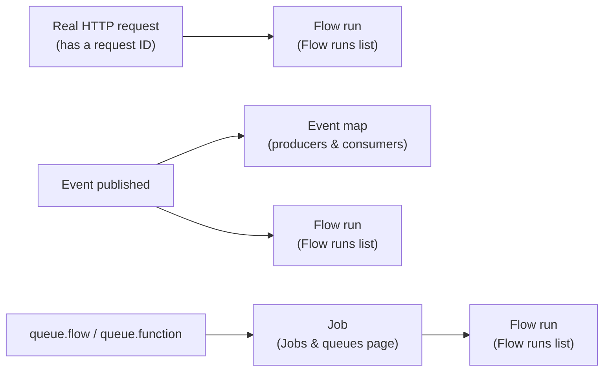

A Flow definition is a graph sitting in an environment. A **run** is one execution of that graph — start at a Trigger, walk edges, call blocks, and either produce a response (for an HTTP-triggered Flow) or finish quietly (for everything else). This page is about the run: how to validate a Flow before it's ever executed, how to trigger a run manually from Studio while you're building, what the resulting trace shows you, and how to work backward from a failed or surprising run to the actual cause.

<CardGroup cols={3}>
  <Card title="Validate" icon="shield-check">Catch structural problems before saving — nothing executes.</Card>
  <Card title="Run saved flow" icon="play">Execute the saved definition for real, with a full trace.</Card>
  <Card title="Flow runs" icon="list-tree">Every past run, filterable by status and trigger, with its input, output, and trace.</Card>
</CardGroup>

## Validating before you save

The editor's **Validate** button checks the graph currently on the canvas — including unsaved changes — for problems that would stop it from running, without executing anything:

- No trigger block anywhere in the graph
- A node with no ID, or two nodes sharing the same ID
- An edge pointing at a node that doesn't exist
- A block key the current environment doesn't recognize (usually a block from a package that isn't installed here)
- An edge drawn from a handle a block doesn't actually have

Any problems found are listed in the Flow tab as a plain list of one-line descriptions — no execution, no side effects, nothing written anywhere. Validate liberally while you're sketching a graph's shape; it's free, and it catches the kind of mistake that's otherwise only visible once you try to run the thing and it fails with a slightly confusing error.

<Tip>
An unrecognized block key almost always means the flow references a block from a package that isn't installed, or enabled, in *this* environment. If a flow validates fine in one environment and fails to validate in another with an "unknown block" error, check which packages are enabled there.
</Tip>

### What validation actually catches, with examples

Each problem Validate reports maps to something concrete on the canvas:

| Problem reported | What's actually wrong |
| --- | --- |
| "a flow needs a trigger block" | No node on the canvas is a Trigger — every graph needs at least one entry point |
| "every node needs an id" | A node somehow has no ID — rare in practice, since the editor assigns one automatically when you add a block |
| `duplicate node id 'load'` | Two nodes share the ID `load` — usually from copy-pasting a node and not renaming the copy |
| `node 'x' uses unknown block 'foo.bar'` | A node's block key doesn't match anything in this environment's catalogue — the package that defines it isn't installed or enabled here |
| `edge 'a' → 'b' references a missing node` | An edge points at a node ID that no longer exists — usually left over after deleting a node without also cleaning up an edge that referenced it |
| `block 'control.if' has no 'maybe' output` | An edge is drawn from a handle the block doesn't actually have — typically from hand-editing a flow definition outside the editor, since the canvas itself won't let you draw an edge from a handle that doesn't exist |

Validation runs the same check whether you click the button in the editor, or generate a Flow definition some other way and submit it — the rules are identical either way, so a Flow that validates clean in Studio will validate clean wherever else it's checked.

## Running a Flow manually from Studio

The editor's **Run** tab — available once the Flow has been saved at least once — is a full test harness for the **saved** version of the Flow.

<Warning>
"Run saved flow" always executes the version currently saved to this environment, never whatever's unsaved on the canvas. If you've just changed something and want to test that change, save first.
</Warning>

### What you configure before running

| Field | Purpose |
| --- | --- |
| **Input** | A JSON editor for the Trigger payload. For an HTTP-triggered flow this is typically `{"params": {...}, "body": {...}, "query": {...}}`; for an event-triggered flow, the event envelope shape. |
| **Start from** | Shown only when the Flow has more than one Trigger node — a dropdown of every Trigger by its node ID, choosing which one this run enters at. |
| **Run as** | An optional JSON object describing the caller — for example `{"authenticated": true, "user_id": "42", "roles": ["admin"]}` — which becomes this run's `auth` state. |

Leaving **Run as** empty runs the Flow with **service rights** — the same trust level an operator or a server-side secret key gets elsewhere on the platform. This matters specifically for any Flow that uses **Require sign-in**, **Check policy**, or reads `auth` in a Condition: an empty **Run as** bypasses all of them, because there's no caller identity to check against. If a Flow behaves differently in Studio than it does for a real caller, an auth mismatch between the real request and what you filled into **Run as** is the first thing to check.

### A test run is a real execution

<Warning>
Clicking **Run saved flow** executes the Flow for real. If a Step writes a record, sends an email, calls an external API, or emits an event, that write, that email, that call, that event all genuinely happen — there is no dry-run or simulated mode. Test against a `development` environment, and be deliberate with input that would reach a **Send email**, **HTTP request**, or **Emit event** Step.
</Warning>

This is a deliberate trade-off: a simulated run that faked side effects would tell you less about whether the Flow actually works, at the cost of a much more complex engine. In exchange, testing from Studio is trustworthy in a way a mock never quite is — if it worked in a test run against development data, it will work the same way against production data, because it's the exact same code path.

## Building and testing a Flow iteratively

The practical rhythm for building anything past a couple of Steps is: add one Step (or one small group — a Condition and its two branches), save, run it once, read the trace, then add the next piece. Testing after every small addition, rather than wiring up the whole graph first and running it once at the end, keeps each failure small enough to be obvious.

Walking through building the order-fulfillment example from [State](/flows/state#a-worked-example-order-fulfillment) this way:

<Steps>
  <Step title="Start with just the Trigger and the first real Step">
    Add the event Trigger and a **Get record** Step that loads the order. Save, then run with a manual **Input** matching a real `order.created` event — `{"event": "order.created", "payload": {"order_id": "ord_1"}}`. Check the trace: did `load_order` return the record you expected? This is the cheapest possible point to catch a wrong resource name or a wrong ID path.
  </Step>
  <Step title="Add the next Step, and confirm what the previous one handed it">
    Add **Get record** for the customer, reading `{{ steps.load_order.output.customer_id }}`. Run again. If `get_customer` comes back `missing` when you expected a hit, click `load_order`'s **Last run** and check whether `customer_id` is actually the field name on the order record — this is often where a docs-vs-reality mismatch about a resource's own field names shows up.
  </Step>
  <Step title="Add branching once the Steps feeding it are confirmed working">
    Add the **If** checking the customer's tier, and both **Set variables** Steps for the discount rate. Run once with input that should take the `true` branch, and once with input that should take `false` — confirming both paths, not just the one you tested first.
  </Step>
  <Step title="Add the Step that has a real side effect last">
    Only once everything upstream is confirmed working, add the **Call function** Step that actually charges the customer. By this point you already trust the data reaching it, which means a test run of this last piece is actually testing the charge logic — not accidentally re-discovering a stale customer ID from three Steps earlier.
  </Step>
</Steps>

This ordering — read-only Steps first, side-effecting Steps last — also limits how much a test run of an unfinished Flow can do in the real world while you're still getting the earlier Steps right.

## Reading the result of a run

Once a test run finishes, the Run tab shows:

<Steps>
  <Step title="Status badge">`succeeded` in green, or `failed` in red.</Step>
  <Step title="Error, if any">When the run failed, the error's message is shown, with the ID of the failing node appended.</Step>
  <Step title="Response or result">If the Flow reached a **Respond** block, its `{status, body, headers}` is shown as formatted JSON. Otherwise, the last Step's output is shown as the run's result.</Step>
  <Step title="Trace">Every Step that ran, in the order it actually executed — not the order it's laid out on the canvas.</Step>
  <Step title="Logs">Any entries written by **Log** Steps during the run, in order.</Step>
</Steps>

Clicking a node on the canvas after a test run also updates that node's own **Last run** section in the Block tab — the same Step data, scoped to just that one node, which is often the fastest way to check one Step's exact input and output without scanning the whole trace.

## The trace, in depth

The trace is the single most useful thing a run produces. Each entry in it shows:

| Field | Meaning |
| --- | --- |
| Node | The ID of the Step that ran — the same ID shown on its block in the canvas, and the same one referenced as `steps.<id>.output` in templates. |
| Block | Which block ran (`resource.get`, not whatever display label you gave the node). |
| Duration | Wall-clock time this one Step took. |
| Handle | Which output the Step returned — `next`, `missing`, `true`, `error`, etc. |
| Output | The Step's return value. |
| Error | Present only if the Step failed. |

Because the trace is ordered by **actual execution order**, not by canvas layout, it's the fastest way to see real control flow through a graph with several branches — especially one where a Condition took the branch you didn't expect.

On the canvas itself, after a test run, every node that appears in the trace is highlighted to show whether it ran successfully or failed, so you can see at a glance which part of the graph the run actually touched.

<Tip>
A Step's output in the trace is bounded — very long strings and very large lists or objects are truncated past a fixed size, with a marker showing how much was cut off. This keeps a trace with a huge API response in it readable; if you need to inspect the untruncated value, check it at the source (the external API's own logs, say) rather than in the trace.
</Tip>

<Note>
Fields that look like credentials — anything named like a password, token, API key, or authorization header — are automatically redacted in the trace, wherever they appear nested inside a Step's recorded input or output. This is why a trace is safe to read (and to leave visible to teammates) even for a Step that handles a secret.
</Note>

## Reading logs

A **Log** Step's entries appear in the Run tab's **Logs** section for a test run, and are stored alongside a real run's trace when it's later opened from the Flow runs list. Each entry carries more than just a message:

| Field | Purpose |
| --- | --- |
| `level` | `debug`, `info`, `warning`, or `error` — lets you filter noisy Flows down to what matters |
| `message` | The text itself, with any `{{ }}` templates already resolved |
| `category` | A stable area name you choose — `billing`, `checkout`, `authorization` — for grouping related log lines across different Flows |
| `code` | A stable, machine-readable event code, useful for searching for "every time this exact thing happened" across many runs |
| `tags` | Free-form key/value labels for anything else worth attaching — a customer ID, an order ID, a batch number |
| `node` | Which Step wrote this entry — automatic, not something you set |

A **Log** Step placed right after a Step whose output you're unsure about — `{"message": "customer resolved: {{ steps.get_customer.output.id }}, tier: {{ steps.get_customer.output.tier }}"}` — is often faster than reading the full trace, especially while you're still actively building and re-running a Flow many times in a row.

## The Flow runs list

Studio's **Events & runs** page has a **Flow runs** tab listing every past execution recorded for this environment, most recent first:

| Column | Meaning |
| --- | --- |
| Flow | Which Flow ran — click through to open it in the editor |
| Status | `succeeded`, `failed`, or `running` |
| Trigger | What kind of trigger started it — `http`, `event`, `schedule`, `job`, `manual`, `webhook`, `realtime`, `resource` |
| Duration | Total wall-clock time |
| Error | The failure message, if the run failed |
| When | How long ago it ran |

Filter by status to see only failures, and click any row to open the full run detail — the same input, output, trace, and logs the Run tab shows for a manual test run, for a run that happened for real. This is where you go to investigate a Flow that failed (or behaved oddly) when triggered by something other than a manual test — a real webhook, a real schedule firing, a real background job.

<Tip>
Every recorded run is stored with its full trace by default (the Flow tab's **Record runs** setting). Turn this off only for an extremely high-frequency Flow where you don't need per-run history — with it off, a run still executes exactly the same way, it's just not kept afterward for later inspection.
</Tip>

## Correlating a run with everything else that happened

A single external event can touch more than one place in Studio, and knowing where to look depends on how the Flow was actually triggered:

- **An HTTP-triggered run** that came from a real API request shares a request ID with that request. If you're investigating a report from a specific API call (a support ticket referencing a request ID from a response header, say), filtering the Flow runs list — or matching that ID against a run's detail — connects the two.
- **A run dispatched as a background job** (via **Queue flow** or **Queue function**) shows up in both the Flow runs list (as a run, with its trace) and the **Jobs & queues** page (as a job, with its queue, status, and attempt count). If a dispatched Flow is failing repeatedly, the Jobs & queues page tells you whether it's still retrying or has landed on the Failed tab; the Flow runs list (or the job detail's own trace) tells you *why* each attempt failed.
- **An event-triggered run** is one consumer of that event. Studio's **Events & runs** page has an **Events** tab listing the event itself (with its payload) and an **Event map** tab showing every producer and consumer of a given event name — useful when a Flow *should* have triggered and apparently didn't, to confirm the event was actually published in the first place.



## Testing a Flow through its real Trigger instead of the Run tab

The Run tab's manual **Input** field is the most direct way to test a Flow, but it means constructing the Trigger payload by hand, and it always uses **Start from** rather than the platform's normal routing. Two other ways to exercise a Flow closer to how it fires for real:

- **An event-triggered Flow** can be exercised by publishing the event it listens for directly, rather than simulating it as Run tab input. The Events & runs page's **Emit test event** button opens a form for an event name and a JSON payload; emitting it fires every Flow subscribed to that event exactly as a real occurrence of it would, including any Flow you didn't mean to also trigger by using a broader event name than intended. This is the more realistic test for a Flow that reacts to an event also published by other parts of the platform, since it exercises the actual event-routing path rather than skipping straight to the Flow.
- **An HTTP-triggered Flow** can simply be called at its real route with any HTTP client, the same way a real caller would — more setup than the Run tab, but the only way to verify things the Run tab's simulated input can't, such as the exact response headers or how the route matches path parameters.

Both still count as real executions with real side effects, exactly like a Run tab test run — the distinction is only in how the run gets started, not in what it does once it's running.

## Diagnosing a Flow you're actively building

The usual loop while building a multi-Step Flow: add a Step or two, save, run it once from the Run tab, check the trace, adjust, repeat. A few problems come up often enough to be worth naming directly.

<AccordionGroup>
  <Accordion title="A Step failed because a template resolved to nothing">
    The most common cause of a Step behaving strangely isn't a bug in the block — it's a path like `{{ steps.load_oder.output.id }}` (note the typo) that silently resolved to an empty value instead of raising anything. Click the failing (or wrong-looking) node's **Last run** in the inspector and check the exact input it received; a `null` or blank string where you expected a real value points straight at the template. See [State](/flows/state#a-path-that-doesnt-exist) for exactly how a missing path resolves.
  </Accordion>
  <Accordion title="A condition evaluated the branch you didn't expect">
    Read the trace, find the Condition Step, and check which handle it returned (`true` vs `false`, or which Switch case). If it took the "wrong" branch, the most common cause is a type mismatch — comparing a string `"49.99"` against a number `49.99`, say — or a path that resolved to `null` rather than the value you assumed was there.
  </Accordion>
  <Accordion title="A loop or retry never seems to finish, or the run hits the step limit">
    A **While** whose condition never becomes false, or a **For each** over a list that's much larger than expected, is the usual cause of a run that either times out or hits the overall step cap. Check the loop's condition or its item source directly — often the input driving it was shaped differently than assumed (an object instead of a list, say).
  </Accordion>
  <Accordion title="The Flow works in Studio's test panel but not for the real trigger">
    Almost always an authentication mismatch: an empty **Run as** field runs with service rights, bypassing anything **Require sign-in** or **Check policy** would otherwise enforce. Re-test with a **Run as** value matching the real caller's roles and permissions.
  </Accordion>
  <Accordion title="No run shows up at all for something that should have triggered it">
    If there's no row for it in Flow runs, the Trigger itself never fired — check the route path for an HTTP trigger, the event name for an event trigger, or the schedule expression for a scheduled one. The Flow's own logic was never reached.
  </Accordion>
</AccordionGroup>

## Testing with different callers

Because **Run as** shapes the entire `auth` state for a test run, it's worth deliberately testing a Flow with more than one caller shape if it branches on identity at all — not just running it once with whatever's convenient.

```json
// An authenticated regular user
{ "authenticated": true, "user_id": "usr_42", "roles": ["member"], "permissions": [] }
```

```json
// An admin
{ "authenticated": true, "user_id": "usr_1", "roles": ["admin"], "permissions": ["*"] }
```

```json
// Explicitly anonymous (equivalent to leaving Run as blank)
{ "authenticated": false }
```

For a Flow guarded by **Require sign-in** with a specific role, or one that reads `{{ auth.roles }}` in a Condition to change its own behavior for admins, running it once as a plain member and once as an admin — and confirming both trace differently, in the way you actually intended — catches an authorization bug well before a real user finds it. Testing only with an empty **Run as** (service rights) tells you nothing about whether the Flow's own role checks work, since service rights typically pass every check that exists.

## A complete debugging session, end to end

Here's a realistic sequence: a Flow that applies a shipping discount is returning the wrong total for some orders, and the trace is where the actual cause gets found.

**Symptom.** The Flow's response comes back with `discount_applied: true` but `final_total` equal to the original total — as if no discount was actually subtracted.

**Trace, read top to bottom:**

```json
[
  { "node": "load_order", "handle": "next", "output": { "id": "ord_9", "subtotal": 200 } },
  { "node": "check_tier", "handle": "true", "output": true },
  { "node": "set_discount", "handle": null, "output": { "discount_rate": 0.15 } },
  { "node": "compute_final", "handle": null, "output": 200 }
]
```

**Reading it:** `check_tier` correctly took the `true` branch, and `set_discount` correctly set `discount_rate` to `0.15` — both exactly as intended. The bug is downstream, in `compute_final`. Clicking that node's **Last run** shows its input:

```json
{ "operation": "multiply", "values": [200, "{{ vars.discount_rate }}"] }
```

There it is: the `values` field still shows the raw, **unrendered** template text for the second operand rather than `0.15` — which means this Step's configuration never actually got the template resolved into a number the way every other field on this page does. Checking the block's configuration in the inspector shows the field was mistyped as a plain string field rather than pasted as `{{ vars.discount_rate }}` inside the calculation's expected JSON shape — a formatting mismatch specific to how that block's `values` field expects its inputs, not a state or template problem at all.

**Fix and re-test:** correcting the field's shape and re-running produces `compute_final`'s output as `170` — `200 * (1 - 0.15)` — and a matching `final_total` in the response. The lesson generalizes: when a Step's *output* doesn't match what its *inputs* should have produced, the input the Step actually received — visible in its **Last run**, or in the trace's recorded `input` — is almost always where the real explanation is, not the block's own logic.

## Limits worth knowing while testing

A few fixed limits shape what you'll see in a trace, particularly for a Flow with loops or nested function calls:

| Limit | Value | What happens past it |
| --- | --- | --- |
| Flow timeout | 1–900 seconds, 60 by default | The run fails with a timeout error; for an HTTP-triggered Flow, the caller sees a `504` |
| Steps per run | 10,000 | The run fails — this guards against a graph that loops forever by accident, not something you'll hit at normal Flow sizes |
| For each items | 10,000 per loop | The Step fails rather than iterating further |
| While iterations | Configurable per loop, 1,000 by default, up to 10,000 | The Step fails once the loop's own limit is reached |
| Function call nesting | 8 levels | A function calling a function calling a function, more than 8 deep, fails rather than recursing further |
| Trace output size | ~2,000 characters per field | Longer output is truncated in the trace display, not in what the Step actually returns to the next one |

None of these are things you configure to make a Flow work — they're safety nets. Hitting one (especially the step limit or the nesting limit) is a strong signal that a loop's condition, or a chain of function calls, isn't doing what you think it is, and the trace is where you go to see exactly which Step or which iteration is responsible.

## Common mistakes

<AccordionGroup>
  <Accordion title="Testing an unsaved flow">
    "Run saved flow" always runs the version currently saved to the environment. If you changed something on the canvas but haven't saved, you're testing the old version without realizing it.
  </Accordion>
  <Accordion title="Treating a test run as side-effect-free">
    There's no dry-run mode. A test run that reaches a Send email or HTTP request Step really sends the email and really makes the call. Test against development, and think about what each Step you're about to run will actually do.
  </Accordion>
  <Accordion title="Assuming a missing run row means a bug in the Flow">
    No row in Flow runs means the Trigger never fired — check the trigger configuration itself before assuming anything about the Flow's own logic.
  </Accordion>
  <Accordion title="Not checking which handle a Step actually returned">
    A Step's handle in the trace tells you exactly which edge it followed. If it's `error` where you expected `next`, or `false` where you expected `true`, that's the actual bug — read the Step's recorded input to see why.
  </Accordion>
  <Accordion title="Testing only with service rights">
    An empty **Run as** bypasses every authorization check a Flow might have. If the Flow branches on the caller's role or permissions at all, test it as more than one kind of caller — not just once, with whatever's convenient.
  </Accordion>
  <Accordion title="Confusing an event's test emission with a real occurrence">
    **Emit test event** fires every Flow actually subscribed to that event name, not just the one you're focused on testing. Check the Event map first if there's more than one consumer of the event you're about to emit, so a test doesn't unintentionally exercise something else at the same time.
  </Accordion>
</AccordionGroup>

## Next

<CardGroup cols={2}>
  <Card title="State" icon="layers-stacked" href="/flows/state">What a Flow can see while it runs, and how templates resolve.</Card>
  <Card title="Errors and retries" icon="triangle-alert" href="/flows/errors-and-retries">Error handles, Fail, Retry, and reading a failed run.</Card>
  <Card title="The visual editor" icon="pen-tool" href="/flows/editor">The canvas, the palette, and the inspector in full.</Card>
  <Card title="Recipes" icon="chef-hat" href="/flows/recipes">Complete Flows, built and tested end to end.</Card>
</CardGroup>
