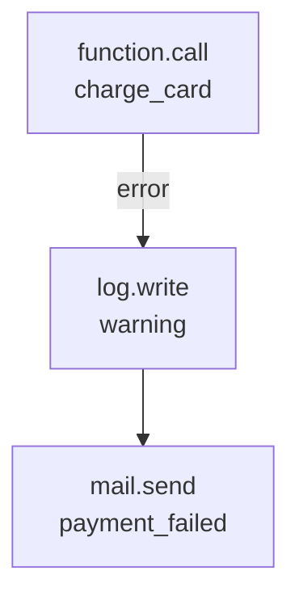
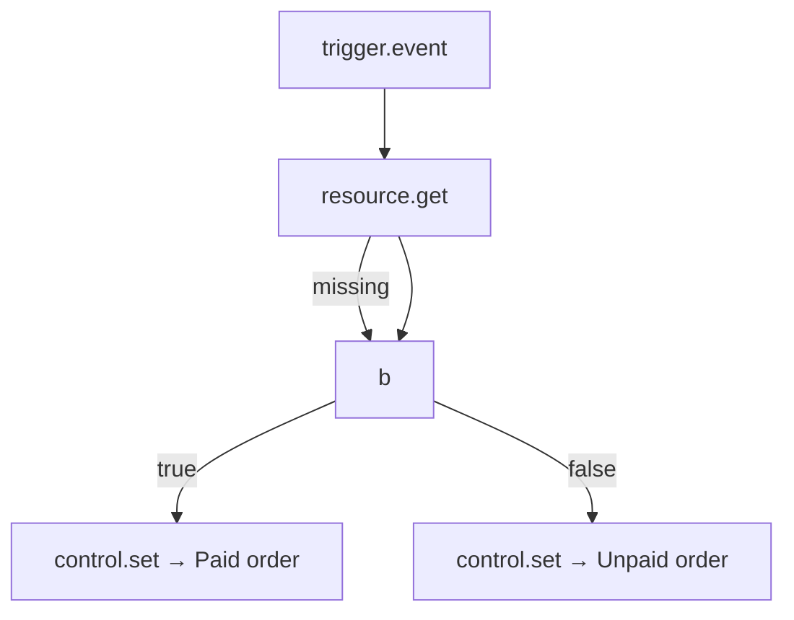

Every flow execution is driven by one Python dictionary — `run.state`. Blocks read from it and write to it, and the engine passes it through as it walks the graph. Understanding state is the difference between guessing why a block didn't see what you expected and reading the actual execution trace.

<CardGroup cols={2}>
  <Card title="Input" icon="arrow-right">The trigger payload, always at `input`.</Card>
  <Card title="Auth" icon="shield-check">The resolved caller, at `auth`.</Card>
  <Card title="Vars" icon="tag">Custom key-value store for passing data between branches.</Card>
  <Card title="Steps" icon="list-tree">Every block's output, keyed by node id.</Card>
  <Card title="Error" icon="triangle-alert">Populated when an error handle is taken.</Card>
</CardGroup>

## The state dictionary

The complete shape of `run.state` at the start of every execution:

```json
{
  "input": { ... },
  "auth": { ... },
  "vars": {},
  "steps": {},
  "error": null,
  "stopped": false,
  "current_node": null,
  "count": 0
}
```

| Key | Type | Default | Set by | Description |
| --- | --- | --- | --- | --- |
| `input` | object | trigger payload | the trigger | The incoming data — the event body, the HTTP request, the schedule payload, etc. |
| `auth` | object | `{}` (service rights) | the engine | The resolved caller — `user_id`, `org`, `roles`, `permissions`. |
| `vars` | object | `{}` | `control.set` | A flat namespace for passing values between branches and across loop iterations. |
| `steps` | object | `{}` | the engine | Every block's output, keyed by node id: `{"node_id": {"output": ..., "handle": "next"}}`. |
| `error` | object \| null | `null` | `_handle_error` | Populated when an error edge is taken: `{message, type, node}`. |
| `stopped` | boolean | `false` | `control.stop` | Whether `control.stop` was called. |
| `current_node` | string \| null | `null` | the engine | The id of the node currently being executed. |
| `count` | integer | `0` | the engine | How many nodes have been visited so far (guards `MAX_STEPS`). |

Every block also has access to the run itself via `self` inside its `run(config, run)` call — that's how `control.set` writes to `vars`, how `auth.require` reads `auth`, and how `resource.get` calls `resource.list` on the runtime.

## `input` — the trigger payload

`input` is whatever the trigger supplied. It is **never** `None` — even an empty request arrives as `{}` — and it is the only way data enters a flow from outside.

| Trigger | `input` shape |
| --- | --- |
| `trigger.http` | The full request object: `body`, `params`, `headers`, `query` |
| `trigger.event` | The event envelope: `{event, payload, id, timestamp}` |
| `trigger.schedule` | `{schedule, fired_at, previous_run}` |
| `trigger.webhook` | `{body, headers, params}` |
| `trigger.realtime` | `{channel, event, data}` |
| `trigger.job` | `{job_id, payload, schedule}` |
| `trigger.manual` | Whatever was supplied in the Run panel |
| `trigger.resource` | `{resource, action, record, previous}` |

```json
{
  "id": "greet",
  "data": {
    "block": "control.set",
    "config": {
      "vars": { "user_email": "{{ input.event.payload.email }}" }
    }
  }
}
```

When an HTTP request arrives at `/webhooks/stripe`, the body is in `input.body`. The path parameter `id` lives in `input.params.id`. When a Stripe `payment_intent.succeeded` event fires, the full event envelope is in `input.event`.

## `auth` — the resolved caller

`auth` is populated by the engine before any block runs. Its shape depends on how the flow was triggered:

```json
{
  "user_id": "usr_abc123",
  "org": "org_xyz",
  "roles": ["admin", "billing"],
  "permissions": ["invoices:write", "customers:read"],
  "is_admin": true
}
```

When a flow runs with **service rights** — either because it was triggered by a schedule, a background job, or explicitly with `as_user` left empty — `auth` is `{}`. No user, no org, no roles. Blocks that need an authenticated caller (like `auth.require`) will raise `401` in that case.

`auth` is used by platform blocks (`auth.require`, `auth.user`, `auth.lookup`, `policy.check`) and by templates via `$auth.org`.

```mermaid
flowchart LR
  Trigger --> Engine
  Engine -->|resolves bearer token| Auth[auth: user_id, org, roles]
  Engine -->|no token / service| Empty[auth: {}]
  Auth -->|read in templates| "$auth.org"
  Empty -->|read in templates| "$auth.org → undefined"
```

<Tip>
A `trigger.http` that requires a signed API key still populates `auth` if the key resolves to an operator or service account. The `auth` state is whatever the gateway resolved — not necessarily a human user.
</Tip>

## `vars` — custom key-value store

`vars` is a flat namespace initialized to `{}` at the start of every run. It is written to by `control.set` and read by any subsequent block's templates via `{{ vars.<name> }}`. It is the escape hatch for passing data between branches that can't both reference `{{ steps.<node>.output }}`.

```json
[
  {
    "id": "branch_a",
    "data": { "block": "control.if", "config": { "condition": { "truthy": "$input.event.payload.has_discount" } } }
  },
  {
    "id": "set_discount",
    "data": { "block": "control.set", "config": { "vars": { "discount": "{{ input.event.payload.discount_percent }}" } } }
  },
  {
    "id": "set_none",
    "data": { "block": "control.set", "config": { "vars": { "discount": "0" } } }
  }
]
```

Edges from `branch_a` go to `set_discount` on `true` and `set_none` on `false`. Both write to `vars.discount`, so the next block reads `{{ vars.discount }}` without needing to know which branch it came from.

`vars` persists for the **lifetime of the run only**. It is not stored anywhere after the run completes, and it is not shared between concurrent runs of the same flow.

<Warning>
`vars` is **not** a database. It exists only in memory for the duration of a single run. If you need a value to survive across runs, write it to a record with `resource.update` or to the cache with `cache.set`.
</Warning>

## `steps` — every block's output

The engine records every block's result in `steps`, keyed by the node's id:

```json
{
  "steps": {
    "load_order": { "output": { "id": "ord_1", "status": "paid", "total": 49.99 }, "handle": "next" },
    "compute_tax": { "output": 4.99, "handle": "next" },
    "charge": { "output": { "charge_id": "ch_789", "status": "succeeded" }, "handle": "next" }
  }
}
```

Any block can read any earlier block's output using templates:

```json
{
  "id": "summary",
  "data": {
    "block": "control.set",
    "config": {
      "vars": {
        "order_total": "{{ steps.load_order.output.total }}",
        "tax": "{{ steps.compute_tax.output }}",
        "charge_status": "{{ steps.charge.output.status }}"
      }
    }
  }
}
```

Templates in `control.set`, `control.if`, and `control.switch` see `steps` because those blocks render their config against the **current** state — which already includes every block executed so far.

<Tip>
The step output is the **raw block return value**, not a wrapped object. If a `mail.send` returns `{sent: true}`, you read it as `{{ steps.send.output.sent }}` — not `{{ steps.send.output.data.sent }}`.
</Tip>

## `error` — populated on error edges

When a block raises and there is an `error` edge out of it, the engine populates `state["error"]`:

```json
{
  "error": {
    "message": "Card declined",
    "type": "FlowError",
    "node": "charge_card"
  }
}
```

Inside the error branch, blocks can reference `{{ error.message }}`, `{{ error.type }}`, and `{{ error.node }}`:

```json
[
  { "id": "charge", "data": { "block": "function.call", "config": { "function": "charge_card", "args": ["{{ input.body.amount }}"] } } },
  { "id": "log", "data": { "block": "log.write", "config": { "level": "warning", "message": "Payment failed: {{ error.message }} (type: {{ error.type }})" } } },
  { "id": "fallback", "data": { "block": "mail.send", "config": { "to": "{{ auth.user.email }}", "template": "payment_failed" } } }
]
```



`error` is reset to `null` at the start of every run, so an error branch that completes successfully doesn't leave a stale error in state for subsequent nodes.

## `stopped` and `current_node`

`state["stopped"]` becomes `true` when `control.stop` is called — the engine halts the walk immediately, even if there are more reachable nodes. `state["current_node"]` tracks which node is being executed, useful for logging and debugging.

## Template resolution order

When a template like `{{ vars.greeting }}` or `{{ steps.load.output.total }}` is rendered, the engine resolves it in this order:

1. `input` — `{{ input.body.email }}`
2. `auth` — `{{ auth.org }}` (shorthand `$auth.org`)
3. `vars` — `{{ vars.discount }}` (shorthand `$vars.discount`)
4. `steps` — `{{ steps.load.output.total }}` (shorthand `$steps.load.output.total`)
5. `error` — `{{ error.message }}`
6. `item` / `index` — available inside `control.foreach` bodies

If a template can't be resolved (a referenced key doesn't exist), it renders as `undefined` — the engine does **not** raise for missing template variables. This is why a block can silently receive `undefined` as an argument and fail in an unexpected way downstream.

## Complete state walkthrough

Consider this flow, traced step by step through the state dictionary:

```json
{
  "name": "process_order",
  "definition": {
    "nodes": [
      { "id": "t", "data": { "block": "trigger.event", "config": { "event": "order.created" } } },
      { "id": "a", "data": { "block": "resource.get", "config": { "resource": "orders", "id": "{{ input.event.payload.order_id }}" } } },
      { "id": "b", "data": { "block": "control.if", "config": { "condition": { "truthy": "$steps.a.output.paid" } } } },
      { "id": "c", "data": { "block": "control.set", "config": { "vars": { "label": "Paid order" } } } },
      { "id": "d", "data": { "block": "control.set", "config": { "vars": { "label": "Unpaid order" } } } }
    ],
    "edges": [
      { "source": "t", "target": "a" },
      { "source": "a", "target": "b", "sourceHandle": "missing" },
      { "source": "a", "target": "b" },
      { "source": "b", "target": "c", "sourceHandle": "true" },
      { "source": "b", "target": "d", "sourceHandle": "false" }
    ]
  }
}
```



After execution, `state` looks like:

```json
{
  "input": { "event": "order.created", "payload": { "order_id": "ord_1" } },
  "auth": { "user_id": "usr_abc", "org": "org_xyz" },
  "vars": { "label": "Paid order" },
  "steps": {
    "t": { "output": { "event": "order.created" }, "handle": "next" },
    "a": { "output": { "id": "ord_1", "paid": true }, "handle": "next" },
    "b": { "output": true, "handle": "next" },
    "c": { "output": { "label": "Paid order" }, "handle": "next" }
  },
  "error": null,
  "stopped": false,
  "current_node": "c",
  "count": 4
}
```

## Common mistakes

<AccordionGroup>
  <Accordion title="Referencing a step that hasn't run yet">
    Templates resolve against the *current* state. A block can only read `{{ steps.<id>.output }}` for nodes that executed *before* it. Forward references render as `undefined` silently.
  </Accordion>
  <Accordion title="Assuming `auth` is always populated">
    Background flows (schedules, jobs) run with service rights — `auth` is `{}`. Use `auth.require` or `auth.lookup` to guard the flow's entry point if an authenticated caller is required.
  </Accordion>
  <Accordion title="Treating vars as persistent storage">
    `vars` exists only in memory for the current run. Write to `resource.update` or `cache.set` if you need the value to survive across runs.
  </Accordion>
  <Accordion title="Reading a block's output directly from the definition">
    A block's output is only available as `steps.<node>.output`. Never reference `{{ steps.<node>.output.some_field }}` from a node that comes *before* the block in the graph — it won't exist yet.
  </Accordion>
</AccordionGroup>

## Next

<CardGroup cols={2}>
  <Card title="Runs and testing" icon="beaker" href="/flows/runs-and-testing">How a run executes and how to inspect results.</Card>
  <Card title="Control flow" icon="git-branch" href="/flows/control-flow">How if/switch/foreach/set shape the walk through state.</Card>
  <Card title="Templates" icon="code" href="/flows/templates">Template syntax, operators, and filters.</Card>
  <Card title="Custom blocks" icon="puzzle-piece" href="/flows/custom-blocks">Extending with your own blocks.</Card>
</CardGroup>
