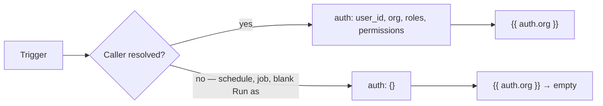
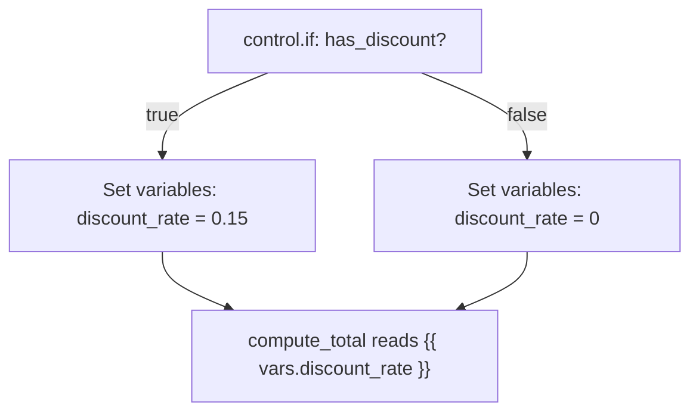
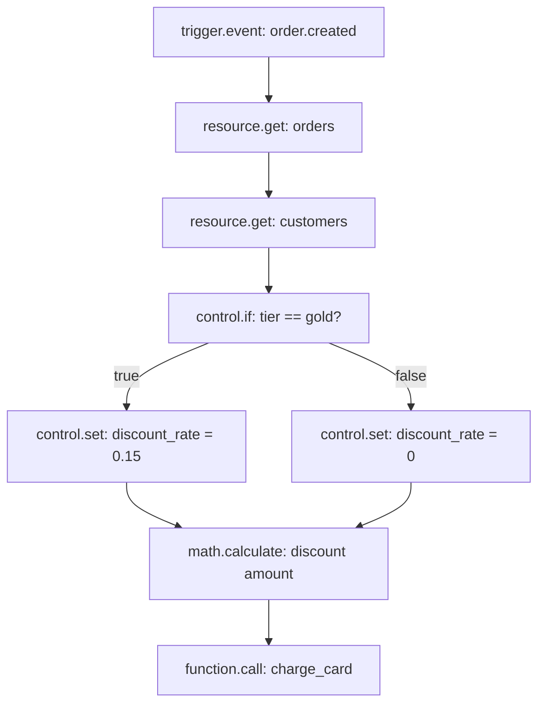

Every Flow run carries a single pool of data forward as it moves from block to block. A trigger populates part of it, `control.set` adds to it, and every finished Step adds its output to it. This page is about that pool: what's in it, how it fills up as a run progresses, and how a template like `{{ steps.load_order.output.total }}` actually finds the value it names.

Understanding this is the difference between guessing why a block didn't get the value you expected, and reading a run's trace and knowing exactly where to look.

<CardGroup cols={2}>
  <Card title="input" icon="arrow-right-to-line">What the Trigger handed the run. Never missing — an empty request still arrives as `{}`.</Card>
  <Card title="auth" icon="shield-check">Who's calling, if anyone. Empty for scheduled and background runs.</Card>
  <Card title="vars" icon="tag">Values you set yourself with a Set variables Step, for passing data across branches.</Card>
  <Card title="steps" icon="list-tree">Every finished Step's output, keyed by its Step ID.</Card>
</CardGroup>

## The namespaces available during a run

A Flow's data lives in a handful of named namespaces. Every one of them is reachable from any block's configuration, in a template:

| Namespace | Where it comes from | Present from the start? |
| --- | --- | --- |
| `input` | The Trigger that started this run | Yes — always, even if empty |
| `auth` | The caller's identity, resolved before the first Step runs | Yes — `{}` when there's no caller |
| `vars` | Values written by Set variables Steps (and a couple of others, noted below) | Yes — starts empty |
| `steps` | Every finished Step's output and the handle it returned, keyed by Step ID | Yes — starts empty, fills in as Steps finish |
| `project`, `env` | Which project and environment this run belongs to | Yes — set once, for the whole run |
| `run` | Identifying details about this particular run: its ID, the Flow's name, and (for API-triggered runs) a request ID | Yes — set once, for the whole run |
| `error` | Details about the most recent error an Error handle caught | Only after the first Error handle fires — see below |
| `item`, `index` | The current element and position inside a For each loop body | Only inside that loop's body |

A couple of things that are *not* in this list, on purpose, because a Studio user never reaches for them directly:

- **Which Step is currently running**, and **how many Steps have run so far** — the engine tracks both internally (to enforce the run's step limit and to label loop/retry bodies), but neither is a value your templates can read. You see the equivalent information in the trace instead: every executed Step lists its own ID and its position in the run.
- **Whether the run has been stopped** by a Stop block — again, this drives the engine's own walk of the graph, not something a template reads.

If you're looking for "how far has this run gotten," the trace is the place to look — covered in [Runs and testing](/flows/runs-and-testing) — not a state value.

## How a template finds a value

A configuration field like

```json
{ "body": "{{ steps.load_order.output.total }}" }
```

is a **path lookup**, not a search. `steps.load_order.output.total` is read as a chain of dotted segments — `steps`, then `load_order` inside that, then `output`, then `total` — walking straight down the namespaces above. There's no fallback order across `input`, `auth`, `vars` and so on: you always name the exact namespace you mean, and the engine walks down from there. `{{ vars.discount_rate }}` reads `vars`, then `discount_rate` inside it. `{{ steps.a.output }}` reads `steps`, then `a`, then `output`. Nothing implicit happens beyond that single walk.

The same dotted-path reading is used in two places that look slightly different on the surface:

- Inside `{{ }}` in a block's configuration — this is the syntax you'll use in nearly every field.
- Inside a Condition (an If, a While, a Switch's underlying comparisons) written against a `$`-prefixed path, e.g. `{"eq": ["$input.status", "paid"]}`. The `$path` form and the `{{ path }}` form read the exact same namespaces the exact same way; `$` is just the shorthand a Condition's JSON uses instead of double braces.

### Filters

A template can pipe its looked-up value through one or more filters, separated by `|`:

```
{{ steps.load_order.output.total | default:0 }}
{{ input.body.email | lower }}
{{ vars.items | length }}
```

| Filter | Does |
| --- | --- |
| `default:<value>` | Substitutes `<value>` when the looked-up value is `null` or an empty string |
| `upper` / `lower` | Uppercases / lowercases a string |
| `json` | Serializes the value as a JSON string |
| `length` | The length of a string, list, or object |
| `int` / `float` / `str` / `bool` | Type conversion |
| `first` / `last` | The first / last element of a list |
| `keys` | The list of an object's keys |

### A whole-value template returns the value itself

A configuration field that is *entirely* one template — nothing before or after the `{{ }}` — returns the underlying value with its real type intact:

```json
{ "items": "{{ input.body.items }}" }
```

If `input.body.items` is a list of objects, `items` receives that list of objects — not a stringified version of it. This is what lets `resource.create`'s `data` field, or `control.foreach`'s `items` field, take a whole object or array straight out of state.

A template *embedded* inside a longer string, on the other hand, always becomes text:

```json
{ "message": "Order {{ steps.load_order.output.id }} totals {{ steps.load_order.output.total }}" }
```

Here each `{{ }}` is replaced with the value's string form (objects and lists are rendered as JSON text) and stitched into the surrounding string.

### A path that doesn't exist

If any segment of the path is missing — the object doesn't have that key, the list is shorter than the index, or an earlier segment was never set — the lookup simply comes up empty. Nothing raises, and nothing marks the run as failed for it.

- In a whole-value template, the field becomes `null`.
- Embedded in a longer string, the missing piece becomes an empty string, silently.

This is worth remembering, because it means a typo in a path — `steps.load_oder.output.total`, `input.boyd.email` — doesn't announce itself as an error. The block downstream simply receives `null` or a blank string and fails (or, worse, silently does the wrong thing) further along. When a Step's behavior doesn't match what you configured, checking the exact spelling of every path it reads is the first thing to try — the [trace](/flows/runs-and-testing) will show you the value each Step actually received.

### Conditions and the `$path` shorthand in full

Every Condition — the setting on an If, a While, or the comparisons you can build against a Switch's value — is a small JSON structure whose operands are `$`-prefixed paths into the same namespaces described above. The full comparison and logical vocabulary:

| Operator | Shape | True when |
| --- | --- | --- |
| `eq` | `{"eq": [a, b]}` | `a` equals `b` |
| `ne` | `{"ne": [a, b]}` | `a` does not equal `b` |
| `gt` / `gte` | `{"gt": [a, b]}` | `a` is greater than (or equal to) `b` |
| `lt` / `lte` | `{"lt": [a, b]}` | `a` is less than (or equal to) `b` |
| `in` / `not_in` | `{"in": [a, list]}` | `a` is (or isn't) a member of `list` |
| `contains` | `{"contains": [list, value]}` | `list` contains `value` |
| `starts_with` / `ends_with` | `{"starts_with": [a, prefix]}` | string `a` starts (or ends) with `prefix` |
| `matches` | `{"matches": [a, pattern]}` | string `a` matches a regular expression |
| `exists` | `{"exists": "$path"}` | the path resolves to something other than empty |
| `truthy` | `{"truthy": "$path"}` | the path resolves to a value that isn't `false`, `0`, `null`, or empty |
| `empty` | `{"empty": "$path"}` | the opposite of `truthy` |
| `all` / `any` | `{"all": [cond, cond, ...]}` | every / at least one child condition is true |
| `not` | `{"not": cond}` | the child condition is false |

```json
{
  "all": [
    { "eq": ["$input.body.status", "paid"] },
    { "gt": ["$input.body.total", 100] },
    { "not": { "empty": "$steps.get_customer.output.email" } }
  ]
}
```

Each `$path` operand is read exactly the same dotted-path lookup used everywhere else in this page — `$input.body.total` reads `input`, then `body`, then `total`, and a missing segment resolves the same empty way a `{{ }}` template does.

<Tip>
A record-level access policy (used by **Check policy**, and by a resource's own read/write policies) adds a further set of shorthand operators — `authenticated`, `role`, `permission`, `owner`, and a few others — that expand into `eq`/`any`/`all` conditions against `auth` and `credential` automatically. Those are covered where policies are documented; a plain Condition on an If, While, or Switch inside a Flow only ever needs the table above.
</Tip>

### Nested access: objects, lists, and mixed paths

A path segment can also be a list index, written as a plain number:

```json
{ "sku": "{{ input.body.line_items.0.sku }}" }
```

`input.body.line_items.0.sku` walks `input`, then `body`, then `line_items` (a list), then index `0` inside it, then `sku` on that element. Any depth of nesting is fine, as long as each segment matches the actual shape underneath it — a numeric segment against something that isn't a list, or a name segment against something that isn't an object, resolves the same empty way a missing key does. There's no special syntax for "the last item of a list" inside a path itself; use the `last` filter for that instead (`{{ input.body.line_items | last }}`).

## `input` — what the Trigger handed the run

`input` is populated once, before the first Step runs, by whichever Trigger started this execution. Its shape depends entirely on the Trigger type:

| Trigger | `input` shape |
| --- | --- |
| HTTP request | `{ body, params, query, headers }` |
| Event | The event envelope: `{ event, payload, id, timestamp }` |
| Schedule | `{ schedule, fired_at, previous_run }` |
| Webhook | `{ body, headers, params }` |
| Realtime message | `{ channel, event, data }` |
| Background job | `{ job_id, payload, schedule }` |
| Manual (Studio's test panel) | Whatever JSON you typed into the Input box |
| Resource change | `{ resource, action, record, previous }` |

`input` is never absent — an HTTP request with no body still arrives as `input.body == {}`, not `null`. This is the only path data enters a Flow from the outside; everything else in `vars` and `steps` is derived from `input`, directly or indirectly, by the Steps that run.

```json
{ "id": "load_order",
  "data": { "block": "resource.get",
            "config": { "resource": "orders", "id": "{{ input.params.order_id }}" } } }
```

When a request arrives at a route with an `:order_id` path segment, that value is at `input.params.order_id`. A Stripe-style webhook's JSON body lands in `input.body`, and its nested fields follow from there — `input.body.data.object.id`, and so on.

### `input` for each Trigger type, in detail

**HTTP request.** A Flow behind a route sees the full request shape:

```json
{
  "body": { "email": "a@example.com", "plan": "pro" },
  "params": { "id": "acct_42" },
  "query": { "referrer": "landing" },
  "headers": { "user-agent": "..." }
}
```

Path segments declared on the route (`/accounts/:id`) land in `params`; the query string lands in `query`; a JSON request body lands in `body`. All four keys are always present, even if empty.

**Event.** A Flow triggered by a platform or custom event sees the event envelope, not just the payload:

```json
{
  "event": "order.created",
  "payload": { "order_id": "ord_1", "total": 49.99 },
  "id": "evt_8f2c",
  "timestamp": "2026-09-30T14:02:11Z"
}
```

The event's own data is under `input.payload` — `{{ input.payload.order_id }}` — while `input.event` is the event's name, useful if one Flow is configured to react to more than one event pattern and needs to branch on which one actually fired.

**Schedule.** A Flow triggered on a timer sees:

```json
{ "schedule": "0 * * * *", "fired_at": "2026-09-30T14:00:00Z", "previous_run": "2026-09-30T13:00:00Z" }
```

`previous_run` is `null` the very first time a schedule fires. This is the shape to reach for when a scheduled Flow needs to process "everything since it last ran."

**Webhook** (an inbound delivery from an external service through a configured webhook endpoint) mirrors the HTTP shape, minus route parameters: `{ body, headers, params }`.

**Resource change.** A Flow triggered by a record being created, updated, or deleted sees:

```json
{ "resource": "orders", "action": "updated", "record": { "id": "ord_1", "status": "shipped" }, "previous": { "id": "ord_1", "status": "paid" } }
```

`previous` is the record's prior state for an update, and `null` for a create. Comparing `input.record.status` against `input.previous.status` is the standard way to react only to a specific field actually changing, rather than to every update regardless of what changed.

**Manual** (Studio's test panel). Whatever JSON you typed into the **Input** field on the Run tab, unchanged — this is the one Trigger type where `input`'s shape is entirely up to you, which is why it's worth shaping your manual test input to match whatever a real Trigger of the same kind would actually produce.

## `auth` — who's calling, if anyone

`auth` is resolved by the engine before the first Step runs, from however the caller was authenticated:

```json
{
  "user_id": "usr_abc123",
  "org": "org_xyz",
  "roles": ["admin", "billing"],
  "permissions": ["invoices:write", "customers:read"]
}
```

When a run has no caller to resolve — a schedule fired it, a background job dispatched it, or Studio's test panel was run with **Run as** left blank — `auth` is `{}`. Blocks that require a signed-in caller (`auth.require`) fail with a `401` in that case; blocks that merely read from `auth` (a template referencing `{{ auth.org }}`) simply get nothing back.



<Tip>
A request authenticated with a service or API key, rather than a person, still populates `auth` — whatever identity the gateway resolved. `auth.user_id` isn't guaranteed to be a human user; it's whoever or whatever made the call.
</Tip>

## `vars` — values you set yourself

`vars` starts empty and stays in memory for exactly the lifetime of one run. It's the general-purpose place to put a value you've computed or chosen, so later Steps — including ones on a different branch than the one that computed it — can read it without needing to know which branch it came from.

You write to it with a **Set variables** Step:

```json
{ "id": "set_discount",
  "data": { "block": "control.set",
            "config": { "values": { "discount_rate": "{{ steps.check_tier.output.rate }}" } } } }
```

The field is `values` — an object mapping each variable name to the value (or template) it should hold. Every key you put in `values` is merged into `vars`, so a second Set variables Step later in the run can add more variables without clobbering the ones already set.

```json
{ "id": "set_shipping",
  "data": { "block": "control.set",
            "config": { "values": { "shipping_method": "standard" } } } }
```

After both Steps above have run, `vars` holds both `discount_rate` and `shipping_method` — later Steps read either with `{{ vars.discount_rate }}` and `{{ vars.shipping_method }}`.

<Tip>
A couple of other blocks also write into `vars`: **Read secret** stores the secret's value under the name you give it (or the secret's own name, if you don't), so it can be used in later templates without appearing anywhere in the trace.
</Tip>

`vars` merging both branches of a condition into the same variable is the standard way to make a downstream Step branch-agnostic:



Whichever branch ran, `compute_total` reads the same path and doesn't need an If of its own to know which branch fired.

<Warning>
`vars` is not a database. It exists only for the duration of a single run and isn't shared between concurrent runs of the same Flow. If a value needs to survive past this run, write it with **Update record** or **Cache set** instead.
</Warning>

## `steps` — every finished Step's output

Every time a Step finishes — successfully or by taking an error branch — its result is recorded under `steps.<step id>`:

```json
{
  "steps": {
    "load_order": { "output": { "id": "ord_1", "status": "paid", "total": 49.99 }, "handle": "next" },
    "get_customer": { "output": { "id": "cus_1", "email": "a@example.com", "tier": "gold" }, "handle": "next" }
  }
}
```

Each entry has two fields: `output` (whatever the block returned) and `handle` (which output the block took — `next`, `missing`, `true`, and so on). Any later Step reads an earlier one's output with a template:

```json
{ "id": "confirm_email",
  "data": { "block": "mail.send",
            "config": {
              "to": "{{ steps.get_customer.output.email }}",
              "subject": "Order {{ steps.load_order.output.id }} confirmed"
            } } }
```

<Tip>
`steps.<id>.output` is the block's **raw** return value — never wrapped in an extra layer. If Get record returns `{ "id": "cus_1", "email": "..." }`, you read the email as `{{ steps.get_customer.output.email }}`, not `{{ steps.get_customer.output.data.email }}`.
</Tip>

Because a Step's ID is exactly the node ID shown on its block in the canvas, renaming a node's ID in the inspector changes what path later Steps need to use to reach it — the inspector rewrites edges automatically when you rename a node, but it does **not** rewrite `{{ steps.<old id>... }}` references inside other nodes' configuration. Recheck downstream Steps after a rename.

### You can only read a Step that ran before you, on the path that led to you

`steps` only ever contains Steps that have actually finished by the time the current Step runs — not every Step that exists somewhere in the graph. Two consequences:

- A Step later in the same path can read an earlier one's output. A Step earlier in the path can never read a later one's output — there's nothing there yet, and the lookup comes up empty rather than erroring.
- If two branches both lead somewhere and only one of them actually ran (an If took `false`), the Step that never ran never appears in `steps` at all — not even as `null`. A template reading `{{ steps.that_step.output }}` after a branch that skipped it gets the same empty result as a typo would.

## `item` and `index` — inside a loop body

Inside a **For each** Step's body, two extra values are available for the duration of that one iteration: `item` (the current element) and `index` (its position, starting at `0`):

```json
{ "id": "loop", "data": { "block": "control.foreach", "config": { "items": "{{ input.body.line_items }}" } } }
```

A Step inside that loop's body reads the current element directly:

```json
{ "id": "add_item",
  "data": { "block": "resource.create",
            "config": { "resource": "order_lines",
                        "data": { "sku": "{{ item.sku }}", "qty": "{{ item.quantity }}", "position": "{{ index }}" } } } }
```

`item` and `index` exist only inside that one iteration of that one loop's body. Once the loop finishes (or the body Step finishes, for a single iteration), they're gone — a Step after the loop can't read them, and a Step inside a *different* loop sees only its own loop's current `item`/`index`, never a value left over from a previous loop.

<Tip>
A `for each`'s own output — `{{ steps.loop.output }}` — is the list of every iteration's last Step output, in order. That's how you carry a loop's results forward without reading `item`/`index` outside the loop.
</Tip>

## `error` — populated once an Error handle fires

Most Steps have an **Error** handle you can optionally connect. Nothing is added to state for a Step that fails *without* a connected Error handle — the run simply fails. But the moment a connected Error handle fires, the engine drops a small object into `error`:

```json
{ "error": { "message": "Order not found", "type": "FlowError", "node": "load_order" } }
```

From inside that error branch, a template can reference `{{ error.message }}`, `{{ error.type }}`, and `{{ error.node }}`:

```json
{ "id": "log_failure",
  "data": { "block": "log.write",
            "config": { "level": "warning", "message": "{{ error.node }} failed: {{ error.message }}" } } }
```

<Warning>
Unlike `input`, `auth`, and `vars`, `error` is **not** reset or cleared as the run continues past the branch that handled it. If a second, unrelated Step fails later in the same run and takes its own Error handle, `error` is simply overwritten with that failure's details. And if no later failure overwrites it, a Step that runs much further downstream — one that never had anything to do with the original failure — could still technically read a stale `{{ error.message }}` left over from earlier in the run. In practice this only matters if you reference `error` outside the error branch that's meant to handle it; keep `error` reads confined to the branch immediately following the failing Step, and it behaves exactly as expected.
</Warning>

See [Errors and retries](/flows/errors-and-retries) for the full mechanics of which blocks have Error handles, how `control.retry` interacts with this, and how to design branches around failures.

## `project`, `env`, and `run`

Three more namespaces are set once, at the very start of the run, and don't change:

| Path | Holds |
| --- | --- |
| `project` | The project's reference this run belongs to |
| `env` | Which environment ran it — `development`, `production`, or another environment name |
| `run.id` | This run's own unique ID |
| `run.flow` | The Flow's name |

These are mostly useful for logging — a **Log** Step's entries already include the run ID and Flow name automatically, but you can also pull `{{ run.id }}` into a Step's own configuration (tagging an outbound webhook payload with the originating run, for instance).

## A worked example: order fulfillment

Here's how state fills in as a realistic multi-step Flow runs — an order-fulfillment Flow triggered by an `order.created` event.

```json
{
  "nodes": [
    { "id": "t", "data": { "block": "trigger.event", "config": { "event": "order.created" } } },
    { "id": "load_order", "data": { "block": "resource.get",
        "config": { "resource": "orders", "id": "{{ input.payload.order_id }}" } } },
    { "id": "get_customer", "data": { "block": "resource.get",
        "config": { "resource": "customers", "id": "{{ steps.load_order.output.customer_id }}" } } },
    { "id": "check_tier", "data": { "block": "control.if",
        "config": { "condition": { "eq": ["$steps.get_customer.output.tier", "gold"] } } } },
    { "id": "gold_discount", "data": { "block": "control.set",
        "config": { "values": { "discount_rate": 0.15 } } } },
    { "id": "no_discount", "data": { "block": "control.set",
        "config": { "values": { "discount_rate": 0 } } } },
    { "id": "compute_discount", "data": { "block": "math.calculate",
        "config": { "operation": "multiply",
                    "values": ["{{ steps.load_order.output.subtotal }}",
                               "{{ vars.discount_rate }}"] } } },
    { "id": "charge", "data": { "block": "function.call",
        "config": { "function": "charge_card",
                    "input": { "customer_id": "{{ steps.get_customer.output.id }}",
                               "amount": "{{ steps.load_order.output.subtotal }}",
                               "discount": "{{ steps.compute_discount.output }}" } } } }
  ],
  "edges": [
    { "source": "t", "target": "load_order" },
    { "source": "load_order", "target": "get_customer" },
    { "source": "get_customer", "target": "check_tier" },
    { "source": "check_tier", "target": "gold_discount", "sourceHandle": "true" },
    { "source": "check_tier", "target": "no_discount", "sourceHandle": "false" },
    { "source": "gold_discount", "target": "compute_discount" },
    { "source": "no_discount", "target": "compute_discount" },
    { "source": "compute_discount", "target": "charge" }
  ]
}
```



Walking through what `state` holds by the time `charge` runs:

```json
{
  "input": { "event": "order.created", "payload": { "order_id": "ord_1" } },
  "auth": {},
  "vars": { "discount_rate": 0.15 },
  "steps": {
    "t": { "output": { "event": "order.created" }, "handle": "next" },
    "load_order": { "output": { "id": "ord_1", "customer_id": "cus_1", "subtotal": 49.99 }, "handle": "next" },
    "get_customer": { "output": { "id": "cus_1", "tier": "gold" }, "handle": "next" },
    "check_tier": { "output": true, "handle": "true" },
    "gold_discount": { "output": { "discount_rate": 0.15 }, "handle": "next" },
    "compute_discount": { "output": 7.4985, "handle": "next" }
  },
  "project": "acme",
  "env": "production",
  "run": { "id": "9f2c1e...", "flow": "fulfill_order" }
}
```

Notice `no_discount` never appears in `steps` at all — the `false` branch didn't run for this particular order, so there's simply nothing recorded for that node. If a later Step mistakenly referenced `{{ steps.no_discount.output }}`, it would get an empty result rather than an error, for exactly that reason.

## A second example: a loop building up totals

The same order-fulfillment Flow continues here, now processing each line item of the order to compute a shipping total — showing how `item`, `index`, `vars`, and `steps` all interact once a loop is involved.

```json
{
  "nodes": [
    { "id": "loop", "data": { "block": "control.foreach",
        "config": { "items": "{{ steps.load_order.output.line_items }}" } } },
    { "id": "get_weight", "data": { "block": "resource.get",
        "config": { "resource": "products", "id": "{{ item.product_id }}" } } },
    { "id": "add_weight", "data": { "block": "control.set",
        "config": { "values": { "running_weight": "{{ vars.running_weight | default:0 }}" } } } }
  ],
  "edges": [
    { "source": "loop", "target": "get_weight", "sourceHandle": "each" },
    { "source": "get_weight", "target": "add_weight" }
  ]
}
```

Inside one iteration of the loop, with `item` bound to the second line item (`index` == `1`):

```json
{
  "item": { "product_id": "prod_9", "quantity": 2 },
  "index": 1,
  "steps": {
    "load_order": { "output": { "line_items": [ "..." ] }, "handle": "next" },
    "get_weight": { "output": { "id": "prod_9", "weight_kg": 0.4 }, "handle": "next" }
  },
  "vars": { "discount_rate": 0.15, "running_weight": 0 }
}
```

`get_weight`'s output for *this* iteration is available as `{{ steps.get_weight.output }}` while the loop body for item `1` is running — but by the time the loop moves on to item `2`, that same `steps.get_weight` entry is overwritten with item `2`'s result. A Step **outside** the loop that reads `{{ steps.get_weight.output }}` after the loop finishes sees only the *last* iteration's value, not a list of all of them. If you need every iteration's result, read `{{ steps.loop.output }}` instead — the For each block's own output, which collects the body's last Step output from every iteration into one list, in order:

```json
{ "steps": { "loop": { "output": [
  { "id": "prod_1", "weight_kg": 0.2 },
  { "id": "prod_9", "weight_kg": 0.4 }
], "handle": "done" } } }
```

<Warning>
A Step inside a loop's body is re-run once per iteration, and each run **overwrites** that same node's entry in `steps` with the newest iteration's result. Reference a loop body's Step output only from *inside* the same iteration of the same loop — reach for the loop block's own output (`steps.<loop id>.output`, a list) to collect results across iterations instead.
</Warning>

## A complete trace: state at every step of an 8-step fulfillment Flow

The two examples above show state at a single moment. This section walks the *entire* state pool through every Step of a longer, more realistic Flow — an order being fulfilled once it's paid, from the triggering event through committing inventory, charging any outstanding balance, and notifying the customer. The point isn't the specific business logic; it's watching exactly which keys exist, and what they hold, at each of the eight Steps in turn.

```json
{
  "nodes": [
    { "id": "trig", "data": { "block": "trigger.event", "config": { "event": "order.ready_to_fulfill" } } },
    { "id": "load_order", "data": { "block": "resource.get", "config": { "resource": "orders", "id": "{{ input.payload.order_id }}" } } },
    { "id": "load_items", "data": { "block": "resource.list", "config": { "resource": "order_items", "filters": { "order_id": "{{ input.payload.order_id }}" }, "limit": 100 } } },
    { "id": "reserve", "data": { "block": "control.foreach", "config": { "items": "{{ steps.load_items.output.data }}" } } },
    { "id": "decrement", "data": { "block": "resource.update", "config": { "resource": "inventory", "id": "{{ item.variant_id }}", "data": { "reserved_delta": "{{ item.quantity }}" } } } },
    { "id": "balance", "data": { "block": "math.calculate", "config": { "operation": "subtract", "values": ["{{ steps.load_order.output.total }}", "{{ steps.load_order.output.amount_paid }}"] } } },
    { "id": "needs_charge", "data": { "block": "control.if", "config": { "condition": { "gt": ["$steps.balance.output", 0] } } } },
    { "id": "charge", "data": { "block": "function.call", "config": { "function": "charge_remaining_balance", "input": { "order_id": "{{ steps.load_order.output.id }}", "amount": "{{ steps.balance.output }}" } } } },
    { "id": "mark_fulfilled", "data": { "block": "resource.update", "config": { "resource": "orders", "id": "{{ steps.load_order.output.id }}", "data": { "status": "fulfilled" } } } },
    { "id": "notify", "data": { "block": "mail.send", "config": { "to": "{{ steps.load_order.output.email }}", "template": "order_fulfilled", "data": { "order": "{{ steps.load_order.output }}" } } } }
  ],
  "edges": [
    { "source": "trig", "target": "load_order" },
    { "source": "load_order", "target": "load_items" },
    { "source": "load_items", "target": "reserve" },
    { "source": "reserve", "target": "decrement", "sourceHandle": "each" },
    { "source": "reserve", "target": "balance", "sourceHandle": "done" },
    { "source": "balance", "target": "needs_charge" },
    { "source": "needs_charge", "target": "charge", "sourceHandle": "true" },
    { "source": "needs_charge", "target": "mark_fulfilled", "sourceHandle": "false" },
    { "source": "charge", "target": "mark_fulfilled" },
    { "source": "mark_fulfilled", "target": "notify" }
  ]
}
```

**Step 1 — `trig` fires.** State starts with just the four always-present namespaces populated, plus an empty `steps`:

```json
{ "input": { "event": "order.ready_to_fulfill", "payload": { "order_id": "ord_77" } }, "auth": {}, "vars": {}, "steps": {} }
```

**Step 2 — `load_order` finishes.** `steps` gains its first entry:

```json
{ "steps": { "load_order": { "output": { "id": "ord_77", "total": 129.00, "amount_paid": 50.00, "email": "a@example.com" }, "handle": "next" } } }
```

Notice `amount_paid` is less than `total` here — this order was placed with a partial deposit, which is exactly what makes the `balance`/`needs_charge` branch later in this Flow meaningful for this particular run. A different order, paid in full, would take the Flow's other path.

**Step 3 — `load_items` finishes.** A second, independent `steps` entry, unrelated to `load_order`'s shape:

```json
{ "steps": { "load_order": { "...": "as above" }, "load_items": { "output": { "data": [ { "variant_id": "var_1", "quantity": 2 }, { "variant_id": "var_9", "quantity": 1 } ], "total": 2, "limit": 100, "offset": 0 }, "handle": "next" } } }
```

**Step 4 — inside the `reserve` loop, first iteration.** `item` and `index` appear, scoped to this one iteration, and `decrement`'s own entry in `steps` reflects only *this* iteration so far:

```json
{ "item": { "variant_id": "var_1", "quantity": 2 }, "index": 0, "steps": { "decrement": { "output": { "id": "var_1", "reserved": 2 }, "handle": "next" } } }
```

**Step 4, continued — second iteration.** `item`/`index` move on, and `decrement`'s entry in `steps` is *overwritten* with this iteration's result — exactly the behavior called out in the warning above:

```json
{ "item": { "variant_id": "var_9", "quantity": 1 }, "index": 1, "steps": { "decrement": { "output": { "id": "var_9", "reserved": 1 }, "handle": "next" } } }
```

**Step 4, done.** Once every item has been processed, `reserve` itself finishes and follows `done`. `item`/`index` disappear entirely — nothing after `reserve` can read them — and `reserve`'s own output is the full, ordered list of both iterations' results, which is how a Step after the loop would see *all* of them rather than just the last one:

```json
{ "steps": { "reserve": { "output": [ { "id": "var_1", "reserved": 2 }, { "id": "var_9", "reserved": 1 } ], "handle": "done" } } }
```

**Step 5 — `balance` finishes.** A plain number, not an object — `math.calculate`'s output is whatever the arithmetic produces, here `129.00 - 50.00`:

```json
{ "steps": { "balance": { "output": 79.0, "handle": "next" } } }
```

**Step 6 — `needs_charge` finishes.** Since `79.0 > 0`, this Condition takes `true`:

```json
{ "steps": { "needs_charge": { "output": true, "handle": "true" } } }
```

**Step 7 — `charge` finishes** (this run took the `true` branch, so `charge` runs; a fully-paid order would skip straight to `mark_fulfilled` and `charge` would never appear in `steps` at all for that run):

```json
{ "steps": { "charge": { "output": { "charge_id": "ch_44", "status": "succeeded" }, "handle": "next" } } }
```

**Step 8 — `mark_fulfilled`, then `notify`.** Both read from `load_order`'s output, computed all the way back in Step 2 — a template doesn't care how many Steps ago a value was produced, only that it was produced *before* the Step reading it:

```json
{ "steps": { "mark_fulfilled": { "output": { "id": "ord_77", "status": "fulfilled" }, "handle": "next" }, "notify": { "output": { "sent": true }, "handle": "next" } } }
```

By the time `notify` runs, `steps` holds nine entries in total (`trig` counts as one, since Triggers record an output too): `trig`, `load_order`, `load_items`, `reserve`, `decrement` (only the *last* iteration's value — the individual iterations are gone), `balance`, `needs_charge`, `charge`, and `mark_fulfilled`. Nothing about `vars` was ever touched in this particular Flow — not every Flow needs one, and a `vars` namespace that stays `{}` for an entire run is neither a bug nor a sign anything was skipped.

## More edge cases worth knowing

The core rule — a template can only read a Step that has already finished, on the path that led to the current Step — covers most surprises, but a few specific shapes of "not yet" are worth spelling out individually, because each looks slightly different in a trace.

### Referencing a Step that hasn't run yet, anywhere in the graph

A template can name a Step that exists on the canvas but comes *later* in the graph — nothing stops you from typing `{{ steps.charge.output.charge_id }}` into a field on `load_order`, even though `charge` runs several Steps afterward. This isn't caught at validation time, because Pawabase doesn't statically analyze which Steps precede which inside every template — it only resolves paths at the moment a Step actually runs. The practical effect: `load_order`'s field renders to an empty value (or `null`, for a whole-value template) every single time, since `steps.charge` will never exist yet at the point `load_order` runs, regardless of what the rest of the graph eventually does. This is a modeling mistake caught by *behavior*, not by Studio's Validate button — the fix is recognizing that a Step can only meaningfully reference something upstream of it, never downstream, and rearranging which Step actually needs the value.

### Referencing a Step inside a branch that was never taken

This is different from a forward reference — the Step being referenced is earlier in the graph, but it sits inside a branch that this particular run never walked down. Using the `needs_charge` example above: a fully-paid order takes the `false` branch straight to `mark_fulfilled`, so `charge` never runs for that order. If `mark_fulfilled` — or, worse, some later Step reachable from *both* branches — referenced `{{ steps.charge.output.charge_id }}` unconditionally, it would get an empty value on every fully-paid order and a real value only on orders that needed a top-up charge. This is a common source of "it works for some orders but not others" bugs, and it's worth checking specifically whenever a Step downstream of an `If` or `Switch` needs a value that only *one* of the branches actually produces — either move the reference so it only appears inside that branch, or have both branches write the value to the same `vars.<name>` first (the pattern shown earlier in this page), so the downstream Step has exactly one path to read from regardless of which branch ran.

### Deeply nested lookups through more than one collection

A path can walk through several nested lists and objects in sequence, and each segment is resolved independently — there's no shortcut that fails the whole lookup early if an *earlier* segment turns out fine but a *later* one doesn't exist:

```json
{ "sku": "{{ steps.load_order.output.line_items.0.variant.options.1.value }}" }
```

Reading this: `steps` → `load_order` → `output` → `line_items` (a list) → index `0` → `variant` (an object) → `options` (a list) → index `1` → `value`. If `line_items.0` exists but has no `variant` key, the walk still doesn't raise — it produces an empty result at that point and stays empty through every remaining segment, exactly as a single missing key would. The deeper the path, the more segments that each independently have to exist for the whole thing to resolve, and the harder it becomes to tell *which* segment was the actual problem just by looking at the final empty result. This is exactly the case the "Don't nest a path deeper than the data actually needs" design pattern (above) is warning about — a **Log** Step placed right before a deeply-nested reference, printing the intermediate value (`{{ steps.load_order.output.line_items.0.variant }}` on its own), narrows down which segment broke far faster than staring at the final `null`.

### Referencing state from inside a Retry or Timeout attempt branch

Inside a **Retry**'s `attempt` branch, state behaves exactly like it does anywhere else — `steps` accumulates normally as the attempt branch's own Steps finish. What's worth knowing is what happens *across* attempts: if the attempt branch fails partway through (Step A succeeds, Step B fails) and Retry tries again, the *entire* attempt branch reruns from its first Step, which means Step A's entry in `steps` is recomputed and overwritten on the second attempt — the same overwrite behavior a loop body's Steps show, for the same underlying reason (they're the same node, running again). A Step *after* Retry's `next` handle only ever sees the successful attempt's final values, never any partial state from an attempt that failed along the way.

### Referencing state from inside a Timeout attempt branch that got cut off

If **Timeout**'s attempt branch is still running when the deadline passes, the branch is abandoned mid-flight — whatever Steps inside it had already finished did genuinely run (any writes they made happened for real), but the branch's own Steps never get to record output for whichever Step was in progress when the cutoff hit, and the `timeout` handle's own output is just `{"timeout_seconds": <the configured limit>}`, not anything from inside the abandoned branch. A Step following the `timeout` handle can't read `{{ steps.<node inside the attempt branch>.output }}` for the Step that was interrupted — that entry was never written. Steps inside the attempt branch that *did* finish before the cutoff are recorded normally and remain readable from later Steps on the *same* path that led through the attempt branch, but not from the `timeout` path, which forked off before the aborted Step's own state would ever have replayed onto it.

## Where `record` and `credential` fit in

Two more values show up in specific, narrower contexts rather than being part of the general run state described above:

- **Check policy**'s configuration accepts its own `record` and `input` fields, which become part of the context that specific policy check evaluates against — alongside `auth`, `project`, and `env`. These aren't separate state namespaces you can template into from other blocks; they exist only for the duration of that one policy evaluation, scoped to the record (and optional extra input) you pass in.
- **`credential`** describes what kind of caller made the request at the platform level — distinct from `auth`, which describes *who* — and is mostly relevant to policy conditions that need to distinguish a service-to-service call from a human one (the `service` shorthand mentioned above). Day-to-day Flow building rarely needs to reference it directly.

## How state shows up in logs and traces

Everything described on this page exists to be read by templates — but it's also exactly what you see reflected back at you when you inspect a run:

- A **Log** Step's `data` and `tags` fields are themselves templated against state, the same as any other configuration — `{{ steps.load_order.output.id }}` in a log message resolves the same way it would anywhere else. This makes a well-placed Log Step one of the most direct ways to snapshot a piece of state at a specific point in a run, without waiting to page through the full trace afterward.
- Every Step's recorded `input` in the trace is the **already-rendered** configuration — meaning any template inside it has already been resolved against state at the moment that Step ran. Reading a Step's `input` in the trace is a reliable way to answer "what did this path actually resolve to," which is often more informative than staring at the raw `{{ }}` expression in the block's configuration.

See [Runs and testing](/flows/runs-and-testing#the-trace-in-depth) for the full detail on reading a trace, and how credential-shaped fields are automatically redacted wherever they appear.

## Design patterns worth knowing

A few habits make a Flow's state easier to reason about as it grows past a handful of Steps:

**Give every Step a name that matches what it does, not what block it uses.** `get_customer` is a better node ID than `get2` — not just for readability on the canvas, but because that ID is exactly what every downstream `{{ steps.<id>.output }}` reference will look like. Renaming later means finding and updating every reference by hand (the editor doesn't do this for you), so naming deliberately from the start avoids a round of cleanup.

**Prefer `vars` for values that both branches of a Condition need to agree on**, and `steps` for anything that's naturally tied to one specific block's result. A discount rate computed differently on two branches of an If, and needed identically afterward, is a `vars` value. An order's ID, needed exactly as `resource.get` returned it, is read straight from `steps` — there's no need to also copy it into a `vars` entry.

**Keep a loop body's Steps focused on that one iteration**, and read a loop's aggregate result from the loop block's own output (`steps.<loop id>.output`) afterward, rather than trying to accumulate a result across iterations by reading and rewriting the same `vars` entry inside the loop body. It works, but it's easy to reason about incorrectly — a For each's own collected output is usually the more direct route to the same result.

**Don't nest a path deeper than the data actually needs.** A path like `steps.a.output.data.result.value.inner` that only exists because of how a chain of transformations was built up is a sign to add an intermediate Set variables Step that extracts and flattens the one value you actually need — both for readability, and because a single missing segment anywhere in a long chain silently produces an empty result with no indication of which segment was the problem.

## State does not cross into a dispatched Flow

**Queue flow** starts a separate background job that runs a different Flow entirely — not a sub-graph of the current one. That dispatched Flow gets a completely fresh state: its own `input` (exactly what you pass in the `input` configuration field), its own empty `vars`, and its own empty `steps`. Nothing from the dispatching run's `vars` or `steps` is implicitly available to it.

```json
{ "id": "notify_downstream",
  "data": { "block": "queue.flow",
            "config": { "flow": "send_shipping_notification",
                        "input": { "order_id": "{{ steps.load_order.output.id }}",
                                   "customer_email": "{{ steps.get_customer.output.email }}" } } } }
```

If the dispatched Flow needs a value the current run computed, pass it explicitly through `input`, the same way you'd shape any other Trigger's payload — there's no other channel between the two runs' state.

## Quick reference: every path at a glance

| You want | Path |
| --- | --- |
| A field from the Trigger payload | `{{ input.<path> }}` |
| The signed-in caller's ID | `{{ auth.user_id }}` |
| A value you set yourself | `{{ vars.<name> }}` |
| An earlier Step's whole output | `{{ steps.<step id>.output }}` |
| One field of an earlier Step's output | `{{ steps.<step id>.output.<field> }}` |
| Which handle an earlier Step returned | `{{ steps.<step id>.handle }}` |
| The current loop element / position | `{{ item }}` / `{{ index }}` |
| The failure that triggered this error branch | `{{ error.message }}`, `{{ error.type }}`, `{{ error.node }}` |
| This run's own ID | `{{ run.id }}` |
| Which environment this is running in | `{{ env }}` |
| A Condition comparing two of the above | `{"eq": ["$input.body.status", "paid"]}` |

## Common mistakes

<AccordionGroup>
  <Accordion title="Referencing a Step that hasn't run on this path">
    A template can only read `{{ steps.<id>.output }}` for Steps that ran *before* the current one, on the path that led here. A forward reference, or a reference to a Step on a branch that didn't run, resolves to an empty value silently — nothing marks it as wrong.
  </Accordion>
  <Accordion title="Using vars for the wrong field name">
    `control.set`'s configuration field is `values`, not `vars` — `vars` is the name of the *namespace* the values land in, not the field you write to in the block's configuration.
  </Accordion>
  <Accordion title="Assuming auth is always populated">
    Scheduled and background-job Flows run with no caller — `auth` is `{}`. Guard a Flow's entry point with **Require sign-in** or **Look up user** if it must only run for an authenticated caller.
  </Accordion>
  <Accordion title="Treating vars as persistent storage">
    `vars` lives only in memory for the current run. Write to a record or to the cache if a value needs to survive across runs.
  </Accordion>
  <Accordion title="Reading a stale error outside its branch">
    `error` isn't reset after the branch that handles it finishes. Keep `{{ error.* }}` references inside the branch that immediately follows the failing Step, not scattered later in the graph.
  </Accordion>
  <Accordion title="Reading a loop body's Step output after the loop, expecting every iteration's value">
    A Step inside a loop body overwrites its own `steps` entry on every iteration — only the last iteration's value survives there once the loop finishes. Use the loop block's own output for the full, ordered list of every iteration's result.
  </Accordion>
  <Accordion title="Comparing values of different types in a Condition">
    `{"eq": ["$input.body.total", "100"]}` compares a number against a string and will not match `100` the number, even though they look equal. Use the `int` or `float` filter (in a template) — or make sure the Condition compares the same type on both sides — when the incoming value's type isn't guaranteed.
  </Accordion>
</AccordionGroup>

## Next

<CardGroup cols={2}>
  <Card title="Errors and retries" icon="triangle-alert" href="/flows/errors-and-retries">What happens when a block fails, and how to catch it.</Card>
  <Card title="Runs and testing" icon="beaker" href="/flows/runs-and-testing">Running a Flow in Studio and reading its trace.</Card>
  <Card title="Control flow" icon="git-branch" href="/flows/control-flow">If, Switch, For each, While, and Set variables in depth.</Card>
  <Card title="The visual editor" icon="pen-tool" href="/flows/editor">The canvas, the inspector, and the block palette.</Card>
</CardGroup>
