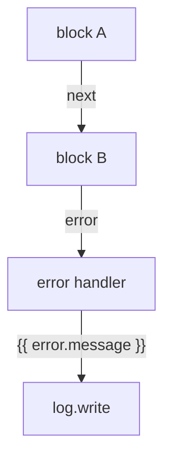

Every flow execution has a **state** — a dictionary that lives for the duration of that run and is shared by every block in the graph. The state is what makes a flow a graph rather than a sequence of independent functions: a block that ran ten steps ago is still accessible to the block that's running now.

```python
self.state: dict[str, Any] = {
    "input": input,          # the trigger payload
    "auth": dict(auth or {}), # the caller's policy context
    "project": project,
    "env": env,
    "vars": {},              # set with control.set
    "steps": {},             # each finished block's output
    "run": {"id": self.id, "flow": name},
}
```

## The state keys in detail

### `input` — the trigger payload

What starts the run. Its shape depends on the trigger:

| Trigger | `input` shape |
| --- | --- |
| `trigger.http` | `{"params": {...}, "body": {...}, "query": {...}, "headers": {...}}` |
| `trigger.event` | `{"event": "name", "payload": {...}, "id": "...", "published_at": "..."}` |
| `trigger.schedule` | `{"scheduled_at": "<iso>"}` |
| `trigger.job` | Whatever the `queue.flow` caller passed as `input` |
| `trigger.manual` | Whatever Studio or `POST /flows/{name}/run` supplied |

Path parameters from `trigger.http` land in `input.params`. The request body (if any) lands in `input.body`. For `trigger.event`, the event's payload is at `input.event.payload`, the event name at `input.event.name`, and the event id at `input.event.id`.

### `auth` — the caller's policy context

Who triggered the run. Contains at minimum `authenticated` (boolean), `user_id` (if signed in), `roles`, `permissions`, and `org`. For scheduled and event-triggered runs, `auth` is typically `{"authenticated": false, "kind": "system"}`.

```json
{
  "auth": {
    "authenticated": true,
    "user_id": "8",
    "email": "ada@example.com",
    "roles": ["admin"],
    "permissions": ["orders:write", "customers:read"],
    "org": "store-7"
  }
}
```

You can read this in templates as `{{ auth.user_id }}`, `{{ auth.authenticated }}`, `{{ auth.roles }}`, etc. The `auth` object is the same one the gateway resolved from the API key and bearer token before the flow started.

<Note>
A scheduled or event-triggered run typically has `auth.authenticated: false`. If a flow reachable via `trigger.event` or `trigger.schedule` needs to act as a specific user, use `POST /flows/{name}/run` with `as_user` — see [Runs and testing → Run as](/flows/runs-and-testing#run-as).
</Note>

### `vars` — run-scoped variables

A dictionary initially empty, populated with `control.set` blocks and readable as `{{ vars.<name> }}` from anywhere later in the same run. Variables persist for the entire execution, across branches and loops.

```json
{ "id": "greet", "data": { "block": "control.set", "config": { "values": { "greeting": "Hi {{ input.event.payload.name }}" } } } }
```

```json
{ "id": "use", "data": { "block": "response.return", "config": { "body": { "msg": "{{ vars.greeting }}" } } } }
```

`control.set` is a cheap way to make branches converge on a single variable name — instead of downstream blocks referencing `steps.greeting_named.output` vs. `steps.greeting_default.output` conditionally, both branches write to `vars.greeting` and the downstream block reads one name.

```mermaid
flowchart LR
  A[control.if] -->|"true"| B[control.set: vars.greeting = Hi]
  A -->|"false"| C[control.set: vars.greeting = Hi there]
  B --> D[response.return: {{ vars.greeting }}]
  C --> D
```

### `steps` — each block's recorded output

Every finished block's output is stored at `state["steps"][node_id]`. This is how later blocks read earlier results. The structure for each step is:

```json
{
  "steps": {
    "load": {
      "output": {"id": "42", "total_minor": 1000, "currency": "usd"},
      "handle": "next"
    },
    "calculate": {
      "output": 500,
      "handle": "next"
    }
  }
}
```

A block reads a previous step's output with `{{ steps.<node_id>.output }}` or a specific field with `{{ steps.<node_id>.output.field }}`. Because `steps` is part of `state`, it's available to the template engine — so any block can reference any finished block's output, not just the immediately preceding one.

<Tip>
The output of `db.query` is always a **list**, so a scalar is `steps.<node>.output.0.<column>`. A `resource.get` output is a single row object, so `steps.<node>.output.field` works directly.
</Tip>

### `run` — the run's own identity

```json
{
  "run": {
    "id": "abc123def456",
    "flow": "pay-order"
  }
}
```

`run.id` is a UUID4 hex string assigned when `FlowRun` is constructed. `run.flow` is the flow's name. These are available in templates but are rarely needed — they're mainly useful for logging or correlation.

## State lifetime and isolation

Each execution gets a fresh state dictionary. Two concurrent runs of the same flow have completely independent states — they never see each other's `vars`, `steps`, or `input`. The state lives in memory for the duration of `FlowRun.execute()`, which is bounded by the flow's `timeout` (default 60 seconds, max 900). When the run finishes — successfully, with an error, or because it hit `control.stop` — the state is discarded.

The state is also **deep-copied** for each node's execution. When the engine calls a block, it deep-copies the node's `config` so nothing in the stored definition can be mutated by a run. Blocks can write to `state["vars"]` and `state["steps"]`, but they cannot modify the stored flow definition.

## How blocks read state

Blocks receive the rendered `config` (templates resolved against state) and the `run` instance itself, through which they reach `run.state`, `run.runtime`, and `run.render()`:

```python
async def run(self, config, run):
    # config is already rendered — templates are resolved
    # run.state is the raw state dict
    user_id = run.state["auth"].get("user_id")
    # or access via templates in config:
    previous_output = run.state["steps"]["load"]["output"]
```

The `run.render()` method lets blocks render additional values against state at runtime:

```python
greeting = run.render("Hi {{ input.event.payload.name }}")
```

## The `error` key in state

When a block fails and its error is caught by an `error` handle edge, the state gets populated with an `error` key:

```json
{
  "error": {
    "message": "Order not found",
    "type": "FlowError",
    "node": "load"
  }
}
```

Inside the error branch, blocks can reference `{{ error.message }}`, `{{ error.type }}`, and `{{ error.node }}`. This lets you build flows that handle their own failures — logging the error, falling back to a secondary path, or returning a custom error response.



## State and control blocks

`control.set` writes to `state["vars"]`. `control.foreach` temporarily adds `item` and `index` to state during the loop body. `control.if` does not modify state — it only chooses which branch to follow. `control.delay` pauses execution without modifying state. `control.stop` ends the run, leaving whatever state was built up as-is (it's discarded when the run stops).

```python
# Inside control.foreach, the state gets item and index:
self.state["item"] = current_item
self.state["index"] = current_index
# Run the loop body (targets) with these in scope
# After the body, restore the previous state values
```

## Debugging state

When a run doesn't behave as expected, the most productive thing to check is the state at the point of failure:

1. **Open the run** in Studio's trace view
2. **Click a node** to see its recorded output and handle in the inspector
3. **Check whether the step ran at all** — if there's no entry in `steps`, the branch that should have reached it was never taken (a condition evaluated the opposite of what you expected)
4. **Verify the template resolved to what you expect** — a common bug is a template resolving to `None` because a path doesn't exist, which then propagates downstream as a silent `None` rather than an error

<Warning>
A template that resolves to `None` is not an error — it's a valid string value `"None"` or a JSON `null` depending on context. If `{{ steps.missing.output }}` resolves to `None`, a block receiving it gets `None` as its configuration value, not an error. Always guard against missing paths.
</Warning>

## Next

<CardGroup cols={2}>
  <Card title="Control flow" icon="git-branch" href="/flows/control-flow">How control.set populates vars and control.foreach sets item and index.</Card>
  <Card title="Triggers" icon="waypoints" href="/flows/triggers">What input looks like for each trigger type.</Card>
  <Card title="Errors and retries" icon="triangle-alert" href="/flows/errors-and-retries">How error branches populate the error state.</Card>
  <Card title="Runs and testing" icon="beaker" href="/flows/runs-and-testing">How to inspect state after a run completes.</Card>
</CardGroup>
