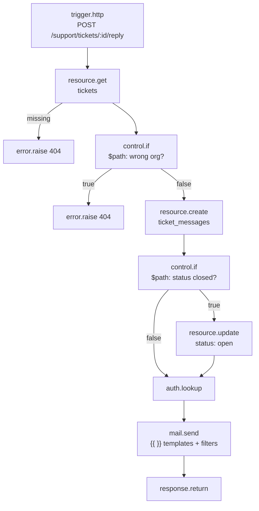

A Flow's config is JSON. Almost none of the values in it are meant to be typed literally — `{{ input.body.email }}` needs to become whatever email address actually triggered this run. That substitution is what a **template expression** does, and the whole mechanism is small enough to read in one sitting: a dotted-path lookup into the run's state, piped through an optional chain of filters. There is no arithmetic, no function calls, no string concatenation operator, and no way to write a literal object or number inside `{{ }}`. If you've used a templating language like Jinja or Handlebars, lower your expectations — this is closer to a spreadsheet cell reference than a scripting language, and that's deliberate: a block's config should describe *what value to use*, not carry logic of its own.

This page covers the real, complete syntax: where `{{ }}` expressions are evaluated, where a second `$`-prefixed syntax is used instead (and why the two are not interchangeable), the full list of filters, and how missing values behave.

## Two syntaxes, not one

Pawabase flows use two different expression syntaxes, and mixing them up is the single most common source of a config value that silently does nothing:

| Syntax | Looks like | Used in | Evaluated by |
| --- | --- | --- | --- |
| `{{ }}` template | `{{ input.body.email \| lower }}` | Ordinary config fields — a block's `to`, `url`, `body`, `message`, `data`, and similar | The flow engine, automatically, before the block's `run()` is called |
| `$` path | `{"eq": ["$input.status", "paid"]}` | The `condition` field of `control.if` and `control.while`, and policy objects (`policy.check`'s `policy` field, and stored policies) | The condition/policy evaluator, when the block itself reads its raw config |

A block's config is templated automatically — every string, object, and array value passes through the template renderer before the block ever sees it, replacing any `{{ }}` it finds. `resource.get`'s `id: "{{ input.params.id }}"`, `mail.send`'s `to: "{{ steps.order.output.email }}"`, `http.request`'s `url` — all of these are ordinary templated fields, and the [resource blocks](/flows/resource-blocks) and [platform blocks](/flows/platform-blocks) pages are full of exactly this pattern.

A handful of blocks opt out of that automatic step. `control.if` and `control.while` declare `raw_config = True`, which means the flow engine hands them their config **unrendered** — untouched `{{ }}` sequences and all — because their `condition` field isn't meant to be turned into a string at all. It's a small JSON expression tree (`{"eq": [...]}`, `{"not": {...}}`) built out of comparison and combinator keys, and the values inside it are read with `$`-prefixed paths instead of `{{ }}`:

```json
{
  "id": "already_paid",
  "data": {
    "block": "control.if",
    "config": { "condition": { "eq": ["$input.status", "paid"] } }
  }
}
```

You saw this exact pattern already, if you've read the resource or platform blocks pages — the worked examples there use `"condition": {"ne": ["$steps.variant.output.store_id", "$auth.org"]}` and `"condition": {"not": {"truthy": "$steps.find.output.total"}}}` for precisely this reason. Those *aren't* templates; putting `{{ }}` inside a `control.if` condition doesn't get rendered — it's parsed as a literal string value inside the condition tree, which is almost never what you want.

The condition/policy operators themselves (`eq`, `not`, `all`, `truthy`, and the rest) belong to the policy engine, documented in full on [Policies](/policies/overview) — this page only covers what you need to read and write the `$path` values that appear *inside* those condition objects, and the `{{ }}` template syntax everywhere else. The two systems share the same underlying dotted-path lookup, which is why the mental model below applies to both, but they are configured, and evaluated, completely separately. Don't reach for a filter (`| upper`) inside a condition, and don't reach for `all`/`any`/`eq` inside a `{{ }}` template — neither exists on the other side.

## Where each syntax actually appears, block by block

It's worth being concrete about which config fields on the blocks you already know use `{{ }}` and which use `$path`, rather than leaving it as an abstract rule. Every field below is documented in full on [Resource blocks](/flows/resource-blocks) and [Platform blocks](/flows/platform-blocks) — this is just the same information organized by syntax:

| Block | Fields that use `{{ }}` | Fields that use `$path` |
| --- | --- | --- |
| `resource.list` | `resource`, `filters` (values), `sort`, `limit`, `offset` | — |
| `resource.get` / `.update` / `.delete` | `resource`, `id`, `data` (values) | — |
| `resource.create` | `resource`, `data` (values) | — |
| `control.if` / `control.while` | — (the whole `condition` field is raw) | `condition`'s operand values |
| `control.foreach` | `items` | — |
| `control.set` | the values being assigned into `vars` | — |
| `policy.check` | `record`, `input` (the context the policy reads) | `policy`, when it's an inline condition object |
| `cache.get` / `.set` / `.delete` / `.invalidate` | `key`, `value`, `ttl`, `tags` | — |
| `event.emit` / `webhook.send` | `event`, `payload` | — |
| `queue.flow` / `queue.function` | `flow`/`function`, `input`, `delay`, `queue` | — |
| `realtime.publish` | `channel`, `event`, `payload` | — |
| `storage.put` / `.read` / `.signed_url` / `.delete` | `bucket`, `key`, `content`, `content_type` | — |
| `mail.send` | `to`, `subject`, `text`, `html`, `data` | — |
| `http.request` | `method`, `url`, `headers`, `params`, `body`, `timeout` | — |
| `secret.get` | `name`, `as` | — |
| `function.call` | `function`, `input` | — |
| `log.write` | `message`, `data`, `category`, `code`, `tags` | — |
| `metric.increment` | `name`, `value`, `tags` | — |
| `response.return` | `status`, `body`, `headers` | — |
| `error.raise` | `status`, `message`, `code` | — |

The pattern holds everywhere: a block uses `$path` only inside a field whose whole purpose is to hold a condition or a policy reference, and `{{ }}` for every ordinary data field. If you're ever unsure which a specific field expects, the tell is `raw_config` on the block itself (documented on the block's own reference entry) — `True` means the block's condition-shaped fields use `$path`; every other block on the platform uses `{{ }}` for all of its fields.

## The mental model: a lookup, not a language

A template expression is:

```
path.to.value | filter_one | filter_two:argument
```

Evaluating it does exactly two things, in order:

1. Split the dotted `path` and walk it through the run's state, one segment at a time.
2. Pass the resulting value through each `| filter` left to right, each filter transforming the value into the next.

That's the entire engine. There's no operator precedence to learn because there are no operators — just a path, and a pipeline of filters after it.

## What `$path` and `{{ path }}` both resolve against

Both syntaxes read from the same run state, the same way [State](/flows/state) documents it:

| Segment | What it holds |
| --- | --- |
| `input` | The trigger payload — an HTTP body/params/headers, an event's payload, a schedule's tick, whatever started this run |
| `auth` | The caller: `auth.user_id`, `auth.org`, `auth.roles`, `auth.permissions`, `auth.authenticated` |
| `project`, `env` | Which project and environment this run belongs to |
| `vars` | Values set with `control.set`, and secrets loaded with `secret.get` |
| `steps.<node id>.output` | Every finished block's output, keyed by its node id |
| `item`, `index` | Inside a `control.foreach` body — the current element and its position |
| `error` | Inside an error branch — `error.message`, `error.type`, `error.node` |
| `run` | The current run's own id and flow name (`run.id`, `run.flow`) |

Dotted access walks through nested objects and arrays the same way in every context:

```json
"{{ input.body.email }}"                  → the trigger's body.email
"{{ steps.load.output.data.0.name }}"     → the first item of an array field, by numeric index
"{{ auth.org }}"                          → the caller's organization
"$steps.new_stock.output"                 → the same kind of path, read by a condition instead of a template
```

A numeric path segment (`data.0`) indexes into a list the same way a name indexes into an object — there's no separate array syntax. Indexing past the end of a list, or into something that isn't a list, resolves the same way any other missing value does: silently, to nothing (see below), rather than raising.

There's exactly one special, non-obvious path worth knowing: `now`, used bare with no parentheses, resolves to the current UTC timestamp — `{{ now }}`. It isn't a function; it's a magic path segment the lookup recognizes before it even looks at the state dictionary. It's the only "dynamic" value the lookup can produce that isn't already sitting somewhere in `input`/`auth`/`vars`/`steps`.

## Missing values: quiet by design

Looking up a path that doesn't exist — a typo, an optional field the caller left out, a step that hasn't run yet — never raises. It resolves to nothing, and what "nothing" looks like depends on where the expression sits:

- **A template that is the *entire* value** (the string is exactly `"{{ input.optional }}"`, nothing before or after) returns the underlying value as-is, whatever type it is — including `null` if the path was missing. A block that receives `{"resource": "orders", "id": "{{ input.params.id }}"}` and finds no `params.id` gets a literal JSON `null` for `id`, not the string `"null"`.
- **A template embedded inside a larger string** (`"Order {{ steps.load.output.id }} shipped"`) substitutes the rendered value's text into that string. A missing value renders as an empty string in that position — `"Order {{ missing }} shipped"` becomes `"Order  shipped"` — rather than the word "null" or "undefined" appearing in output a customer might read.
- A value that comes back as a `list` or `dict` and gets substituted into a larger string (not the whole value) is turned into its JSON text, not its Python repr — `"Tags: {{ input.tags }}"` with `tags: ["a", "b"]` becomes `Tags: ["a","b"]`. Pull the array out on its own (`"{{ input.tags }}"` as the entire field) if the block wants the real list, and see the `json` filter below for formatting one for display.

This is why `resource.get`/`resource.update` branch to a `missing` handle instead of the block raising when a record isn't found, and why `control.if`'s `truthy` check exists (`policies.overview`) rather than every flow author having to guard against missing fields by hand — the lookup layer was built to make "this field might not be there" the normal case, not an exception.

Because nothing raises for a missing path, a typo in a path (`{{ steps.loda.output }}` instead of `{{ steps.load.output }}`) is not caught by the template engine at all — it silently resolves to nothing, and the *block* that receives it is what eventually fails, often with a confusing error far from the actual mistake. See [Common mistakes](#common-mistakes) below.

## How rendering actually works

It helps to know the exact two-step process the engine runs on a block's config, because it explains several behaviors above that would otherwise look inconsistent.

Before a non-`raw_config` block runs, the engine walks its entire config — recursively, through every nested object and array — looking for strings. Two regular expressions do the work: one matches a string that is *entirely* one `{{ ... }}` expression and nothing else; the other finds every `{{ ... }}` occurrence *inside* a larger string, however many there are.

For a string that matches the "entire value" pattern, the engine evaluates the expression and returns its result directly, with its native type — this is why `"{{ steps.order.output }}"` on its own produces a real JSON object, not a string containing one. For any other string, the engine finds every `{{ ... }}` it contains and replaces each one with its rendered value's text — `None` becomes `""`, a `dict` or `list` becomes its JSON text, and anything else becomes its plain string form. A string with no `{{` in it at all is returned completely untouched, without even attempting a match — which is also why there's no way to "escape" a literal `{{` that isn't meant to be a template: the engine can't tell your intention apart from an actual expression once it sees that character pair.

A string can contain more than one `{{ }}` expression, and each is resolved independently against the same state:

```json
"{{ steps.order.output.customer.first }} {{ steps.order.output.customer.last }} <{{ steps.order.output.customer.email | lower }}>"
```

produces something like `Alice Smith <alice@example.com>` — three separate lookups, each substituted into its own position in the same string.

This same two-step process — walk, find strings, render whichever ones qualify — runs recursively through nested arrays and objects in a config value, which is why a `body` field that's a whole JSON object full of `{{ }}` expressions at various levels (like the `http.request` example below) works without you having to template the object as a whole; each leaf string is handled on its own.

## Filters

A filter appears after a `|`, and can take one argument after a `:`. There are exactly twelve, and this is the complete, exhaustive list — nothing else exists, no matter what the block or the situation:

| Filter | What it does |
| --- | --- |
| `default` | Falls back to a literal if the value is `None` or `""` |
| `upper` | Uppercases the value's string form |
| `lower` | Lowercases the value's string form |
| `json` | Serializes the value to a JSON string |
| `length` | The length of a string, list, or object |
| `int` | Converts to an integer |
| `float` | Converts to a floating-point number |
| `str` | Converts to a string, treating `None` as `""` |
| `bool` | Converts to a boolean |
| `first` | The first element of a list |
| `last` | The last element of a list |
| `keys` | The keys of an object, as a list |

Filters chain left to right — each one's output feeds the next one's input:

```json
"{{ input.body.tags | first | upper }}"
```

reads `input.body.tags`, takes its first element, then uppercases that element's string form.

### `default` — fall back when a value is missing

```json
"{{ input.body.name | default:\"Guest\" }}"
```

Falls back to `"Guest"` whenever the piped-in value is `None` or the empty string — not for `0`, `false`, or an empty list, which are left alone. The argument after `:` is parsed as JSON first (so `default:0`, `default:true`, and `default:[]` give you the number, boolean, and empty list respectively), and only falls back to being treated as a plain string if it isn't valid JSON — which is exactly what happens with an unquoted word like `default:Guest` (no JSON parses to that, so it's kept as the literal string `"Guest"`). Quoting it as `default:"Guest"` gets you the same string more explicitly, and is the safer habit since it works whether or not the fallback happens to look like a JSON literal.

```json
"{{ vars.retry_count | default:0 }}"     → 0 as a number, not "0"
"{{ input.body.notes | default:\"\" }}"  → "" if notes is missing
```

### `upper` / `lower` — case conversion

```json
"{{ input.body.email | lower }}"    → "alice@example.com"
"{{ input.body.plan | upper }}"     → "ENTERPRISE"
```

Both convert `None` straight through unchanged rather than turning it into the string `"none"` — a common way to accidentally end up storing a lowercased `null` is to skip a `default` filter before one of these on an optional field.

### `json` — serialize to a JSON string

```json
"{{ steps.order.output | json }}"
```

Turns any value — including a list or object — into its JSON text. This is the filter to reach for whenever a block's config field is *text* (a `log.write` message, a `mail.send` body, a webhook signature payload you're constructing by hand) but the value you want in it is structured. Values that can't serialize as JSON fall back to their string form rather than failing the render.

### `length` — count elements or characters

```json
"{{ input.body.items | length }}"    → 3, for a 3-item array
"{{ input.body.email | length }}"    → 21, for a 21-character string
"{{ input.body.meta | length }}"     → the number of keys, for an object
```

`None` counts as length `0` rather than raising — useful directly in a message: `"{{ steps.errors.output | length }} errors"`.

### `int` / `float` — numeric conversion

```json
"{{ input.body.quantity | int }}"     → 3, from "3" or 3.0
"{{ input.params.price | float }}"    → 19.99, from "19.99"
```

An empty value (`None` or `""`) converts to `None`, not `0` — chain `default:0` first if you need a number no matter what: `"{{ input.body.quantity | default:0 | int }}"`. A value that genuinely can't convert (`"abc" | int`) raises inside the filter, which fails the block the same way any other bad input would — there's no silent `0` fallback for garbage input, only for absence.

### `str` / `bool` — coercion to text or truth

```json
"{{ steps.total.output | str }}"     → "42", from the number 42
"{{ input.body.active | bool }}"     → true / false
```

`str` turns `None` into `""`, not the text `"None"` — useful when you need a config field to always be a string, even when the source value might be missing. `bool` follows ordinary truthiness: `0`, `""`, `None`, `[]`, and `{}` are all falsy; everything else is truthy.

### `first` / `last` — pick an element

```json
"{{ input.body.recipients | first }}"    → the first address in a list
"{{ steps.list.output.data | last }}"    → the most recently returned row, if the list is already sorted that way
```

Both return `None` for an empty or missing list rather than raising — worth pairing with `default` if the block downstream requires a value: `"{{ input.body.tags | first | default:\"general\" }}"`.

### `keys` — the field names of an object

```json
"{{ input.body.metadata | keys }}"    → ["source", "campaign"]
```

Returns an empty list for anything that isn't an object — a list, a string, `None` — rather than raising. Mostly useful for diagnostics (`log.write` messages that mention which fields a caller sent) since there's no companion filter for values; get those with a specific path instead.

## Putting it together: realistic examples

### Building a notification message from order data

A `log.write` message combining several pieces of an order, with a graceful fallback for an optional field:

```json
{
  "id": "note",
  "data": {
    "block": "log.write",
    "config": {
      "level": "info",
      "message": "Order {{ steps.order.output.id }} for {{ steps.order.output.customer.email | lower }} totalling {{ steps.order.output.total_minor | int }} ({{ steps.order.output.currency | upper }}), {{ steps.order.output.items | length }} item(s), note: {{ steps.order.output.gift_note | default:\"none\" }}"
    }
  }
}
```

An email using a stored template — most of the interesting substitution happens on the template's own side, so the flow only needs to pass the data through, ideally with a fallback for a customer name that might be blank:

```json
{
  "id": "receipt",
  "data": {
    "block": "mail.send",
    "config": {
      "to": "{{ steps.order.output.customer.email | lower }}",
      "template": "order_confirmation",
      "data": {
        "customer_name": "{{ steps.order.output.customer.name | default:\"there\" }}",
        "order": "{{ steps.order.output }}",
        "item_count": "{{ steps.order.output.items | length }}"
      }
    }
  }
}
```

An email sent directly, without a stored template, where the subject line is a string with an embedded expression and the body needs `| length` to describe a list without dumping its JSON into the text:

```json
{
  "id": "alert",
  "data": {
    "block": "mail.send",
    "config": {
      "to": ["ops@example.com"],
      "subject": "{{ steps.errors.output | length }} failures in the nightly export",
      "text": "The export run for {{ input.event.payload.date }} finished with {{ steps.errors.output | length }} failing rows. First failure: {{ steps.errors.output | first | json }}"
    }
  }
}
```

### An outbound HTTP call built entirely from templated fields

```json
{
  "id": "charge",
  "data": {
    "block": "http.request",
    "config": {
      "method": "POST",
      "url": "https://api.paymentprovider.example.com/charges",
      "headers": {
        "Authorization": "Bearer {{ vars.PROVIDER_KEY }}",
        "Idempotency-Key": "{{ steps.order.output.id }}"
      },
      "body": {
        "amount": "{{ steps.order.output.total_minor | int }}",
        "currency": "{{ steps.order.output.currency | lower }}",
        "customer_email": "{{ steps.order.output.customer.email | lower }}",
        "metadata": { "order_id": "{{ steps.order.output.id | str }}" }
      },
      "timeout": 15
    }
  }
}
```

Every value in `body` here is its own independent whole-value template — `"{{ steps.order.output.total_minor | int }}"` sends a real JSON number, not the digit characters wrapped in a string, because the field is *entirely* one `{{ }}` expression rather than an expression embedded in a longer string.

### A webhook payload assembled with `json`

```json
{
  "id": "notify_partners",
  "data": {
    "block": "webhook.send",
    "config": {
      "event": "order.exported",
      "payload": {
        "order_id": "{{ steps.order.output.id }}",
        "line_items": "{{ steps.order.output.items | json }}",
        "exported_by": "{{ auth.user_id | default:\"system\" }}"
      }
    }
  }
}
```

`line_items` needs `| json` here only if the receiving system expects a JSON-encoded *string* field rather than a nested array — leaving the filter off and letting `"{{ steps.order.output.items }}"` resolve as the whole value would pass the real array through unchanged, which is usually what you want for a JSON payload. Reach for `| json` specifically when the target field's own schema calls for a string.

## The `$path` syntax, briefly

Everywhere a raw condition object is evaluated — `control.if`, `control.while`, `policy.check`'s inline `policy`, and any stored [policy](/policies/overview) — values are read with a `$`-prefixed dotted path instead of `{{ }}`:

```json
{ "condition": { "eq": ["$input.status", "paid"] } }
{ "condition": { "gte": ["$steps.stock.output.quantity", 1] } }
{ "condition": { "not": { "truthy": "$auth.org" } } }
```

The `$` strips off and the rest is looked up exactly the way a `{{ }}` path is — same dotted segments, same array indexing, same silent-on-missing behavior. A literal string that happens to start with a dollar sign is written `$$` (`"$$5 off"` resolves to the literal text `"$5 off"`) so it isn't mistaken for a path.

What you can't do with `$path`: pipe it through a filter. There's no `$input.email | lower` — filters are a `{{ }}`-template concept only. If a condition genuinely needs a transformed value (a lowercased email compared against a lowercased literal, say), do the transformation earlier in the flow with `control.set` and a `{{ }}` template, storing the result in `vars`, then reference `$vars.<name>` from the condition.

The comparison operators (`eq`, `ne`, `gt`, `gte`, `lt`, `lte`, `in`, `not_in`, `contains`, `starts_with`, `ends_with`, `matches`), the unary checks (`exists`, `truthy`, `empty`), and the combinators (`all`, `any`, `not`) that go around these `$path` values are documented in full on [Policies](/policies/overview) — this page stops at the boundary of how to *reference* a value, not how conditions are built out of them.

## A complete worked example: both syntaxes in one flow

The flow below handles `POST /support/tickets/{id}/reply` — it loads a ticket, checks that the caller owns it using a `$path` condition, builds a reply notification using `{{ }}` templates and several filters, and replies to the request. It's small enough to show every piece of state the two syntaxes touch in one place.

```json
{
  "name": "reply_to_ticket",
  "description": "POST /support/tickets/{id}/reply: adds a reply and notifies the ticket's owner.",
  "definition": {
    "nodes": [
      { "id": "http", "data": { "block": "trigger.http", "config": { "method": "POST", "path": "/support/tickets/{id}/reply" } } },
      { "id": "ticket", "data": { "block": "resource.get", "config": { "resource": "tickets", "id": "{{ input.params.id }}" } } },
      { "id": "missing", "data": { "block": "error.raise", "config": { "status": 404, "code": "ticket_not_found", "message": "No such ticket" } } },
      { "id": "foreign", "data": { "block": "control.if", "config": { "condition": { "ne": ["$steps.ticket.output.org", "$auth.org"] } } } },
      { "id": "not_yours", "data": { "block": "error.raise", "config": { "status": 404, "code": "ticket_not_found", "message": "No such ticket" } } },
      { "id": "reply", "data": { "block": "resource.create", "config": {
          "resource": "ticket_messages",
          "data": {
            "ticket_id": "{{ input.params.id }}",
            "author_id": "{{ auth.user_id }}",
            "body": "{{ input.body.message }}"
          }
      } } },
      { "id": "closed", "data": { "block": "control.if", "config": { "condition": { "eq": ["$steps.ticket.output.status", "closed"] } } } },
      { "id": "reopen", "data": { "block": "resource.update", "config": { "resource": "tickets", "id": "{{ input.params.id }}", "data": { "status": "open" } } } },
      { "id": "recipient", "data": { "block": "auth.lookup", "config": { "user_id": "{{ steps.ticket.output.owner_id }}" } } },
      { "id": "notify", "data": { "block": "mail.send", "config": {
          "to": "{{ steps.recipient.output.email | lower }}",
          "subject": "New reply on ticket {{ steps.ticket.output.id }}",
          "text": "{{ auth.user_id | default:\"Someone\" }} replied to your ticket: {{ input.body.message }}\n\nThis ticket has {{ steps.ticket.output.messages | length | default:0 }} prior replies."
      } } },
      { "id": "done", "data": { "block": "response.return", "config": { "status": 201, "body": "{{ steps.reply.output }}" } } }
    ],
    "edges": [
      { "source": "http", "target": "ticket" },
      { "source": "ticket", "target": "missing", "sourceHandle": "missing" },
      { "source": "ticket", "target": "foreign" },
      { "source": "foreign", "target": "not_yours", "sourceHandle": "true" },
      { "source": "foreign", "target": "reply", "sourceHandle": "false" },
      { "source": "reply", "target": "closed" },
      { "source": "closed", "target": "reopen", "sourceHandle": "true" },
      { "source": "closed", "target": "recipient", "sourceHandle": "false" },
      { "source": "reopen", "target": "recipient" },
      { "source": "recipient", "target": "notify" },
      { "source": "notify", "target": "done" }
    ]
  }
}
```



Every `control.if` here reads a `$path` condition against the ticket that was just loaded (`$steps.ticket.output.org`, `$steps.ticket.output.status`) compared to either a literal or another `$path` (`$auth.org`). Every other node's config is an ordinary `{{ }}` template — including the `mail.send` node, which chains three different filters (`| lower`, `| default:"Someone"`, `| length` immediately followed by `| default:0` in case the ticket happens to have no `messages` field at all) across a subject line and a multi-line body built from four separate lookups.

## Debugging a template that isn't doing what you expect

Because a bad path resolves silently instead of raising, the fastest way to find out what a template actually produced is to look at what the block actually received — not to stare at the expression and guess. Every executed step in a flow run keeps its rendered `input` (the block's config, after templates resolved) alongside its `output`, and Studio's [trace view](/flows/runs-and-testing#the-trace-view) shows both for every node. If a `mail.send` went out with the wrong recipient, or a `resource.update` set a field to `null` unexpectedly, the trace entry for that node shows exactly what config the block ran with — which tells you immediately whether the problem is the template (it rendered to the wrong thing) or the block itself (it rendered correctly and something downstream is wrong).

A `log.write` node dropped in right before the block you're debugging, with `data` set to the same expression you're unsure about, is the other common technique — it lets you see a rendered value in the log without needing the block under test to actually run with it yet.

## The whole engine, verbatim

Because the entire template engine is genuinely this small, here it is in full — `pawabase_core/templating.py`, unabridged. There is nothing held back or simplified in the sections above; every filter and every behavior described on this page comes directly from this file:

```python
"""``{{ path }}`` lookups in block configuration.

A template is a lookup, not a language: ``{{ steps.fetch.output.id }}`` reads a
value, and a small set of filters formats it. A string that is entirely one
template returns the value itself, not its text, so ``"{{ input.items }}"``
passes a list along unchanged.
"""

_TEMPLATE = re.compile(r"\{\{\s*(.+?)\s*\}\}")
_WHOLE = re.compile(r"^\{\{\s*(.+?)\s*\}\}$")


def _apply_filter(value, name, argument):
    if name == "default":
        return value if value not in (None, "") else _literal(argument)
    if name == "upper":
        return str(value).upper() if value is not None else value
    if name == "lower":
        return str(value).lower() if value is not None else value
    if name == "json":
        return json.dumps(value, default=str)
    if name == "length":
        return len(value) if value is not None else 0
    if name == "int":
        return int(value) if value not in (None, "") else None
    if name == "float":
        return float(value) if value not in (None, "") else None
    if name == "str":
        return "" if value is None else str(value)
    if name == "bool":
        return bool(value)
    if name == "first":
        return value[0] if value else None
    if name == "last":
        return value[-1] if value else None
    if name == "keys":
        return list(value.keys()) if isinstance(value, Mapping) else []
    raise ValueError(f"unknown template filter {name!r}")


def _literal(argument):
    if argument is None:
        return None
    try:
        return json.loads(argument)
    except ValueError:
        return argument


def evaluate_expression(expression, state):
    """Evaluate ``path | filter:arg | filter``."""
    parts = [part.strip() for part in expression.split("|")]
    value = lookup(state, parts[0])
    for spec in parts[1:]:
        name, _, argument = spec.partition(":")
        value = _apply_filter(value, name.strip(), argument.strip() or None)
    return value


def render(value, state):
    """Render every template inside *value* (strings, lists and dicts)."""
    if isinstance(value, str):
        whole = _WHOLE.match(value)
        if whole:
            return evaluate_expression(whole.group(1), state)
        if "{{" not in value:
            return value

        def substitute(match):
            result = evaluate_expression(match.group(1), state)
            if result is None:
                return ""
            if isinstance(result, (dict, list)):
                return json.dumps(result, default=str)
            return str(result)

        return _TEMPLATE.sub(substitute, value)
    if isinstance(value, list):
        return [render(item, state) for item in value]
    if isinstance(value, Mapping):
        return {key: render(item, state) for key, item in value.items()}
    return value
```

A quality worth naming explicitly, now that you can see it: an unrecognized filter name raises `ValueError` from `_apply_filter` rather than being silently ignored — unlike a missing *path*, a misspelled *filter* (`| lenght` instead of `| length`) does fail loudly, right at render time, rather than producing a quiet wrong answer. That asymmetry — silent on a missing value, loud on an unknown filter — is worth keeping in mind: it means a typo in a path and a typo in a filter name fail completely differently, and only one of the two shows up immediately in the run's error rather than downstream in the block.

## Common mistakes

<AccordionGroup>
  <Accordion title="Putting {{ }} inside a control.if condition">
    `control.if` and `control.while` read their `condition` unrendered — `{{ }}` inside one isn't evaluated as a template, it's parsed as a literal string value inside the condition tree. Use `$input.status`, not `{{ input.status }}`, inside a condition object.
  </Accordion>
  <Accordion title="Expecting a filter to work inside a $path condition">
    Filters (`| lower`, `| default:...`) only exist in `{{ }}` templates. A condition value like `$input.email` is a plain lookup with no pipeline. Precompute a transformed value with `control.set` first if a condition needs one.
  </Accordion>
  <Accordion title="Assuming a typo'd path raises where you can see it">
    `{{ steps.loda.output }}` (misspelled) silently resolves to nothing rather than raising at the template — the failure, if any, shows up later, in whichever block received the empty value. Check the flow's trace for the actual rendered `config` of a step, not just the template you wrote, when a value seems wrong.
  </Accordion>
  <Accordion title="Expecting {{ input.tags }} embedded in a string to look human-readable">
    A list or object substituted into a larger string renders as its JSON text — `"Tags: {{ input.tags }}"` becomes `Tags: ["a","b"]`, brackets and quotes included. Pull the value out as the whole field, or write your own formatting using `first`/`last`/`length`, if you need something else.
  </Accordion>
  <Accordion title="Reaching for a function that doesn't exist">
    There is no `now()`, `uuid()`, `format_date()`, `format_currency()`, or any other function-call syntax — the engine has no parser for parentheses at all. The only dynamic, non-state path is the bare word `now`. A value like a UUID or a formatted date has to come from somewhere else in the flow — a `resource.create`'s server-assigned `id`, or a block written in [Functions](/code/overview) if the platform's built-in blocks don't produce it directly.
  </Accordion>
  <Accordion title="Writing {{ 42 }} or {{ [1, 2, 3] }} expecting a literal value">
    Everything between `{{` and `}}` is parsed as a dotted lookup path, never as a JSON literal. `{{ 42 }}` looks up a top-level state key literally named `42` (which doesn't exist, so it resolves to nothing) — it does not produce the number 42. Write the literal directly in the JSON config instead of wrapping it in `{{ }}`.
  </Accordion>
</AccordionGroup>

## FAQ

<AccordionGroup>
  <Accordion title="Can I write my own filter?">
    Not from Studio or from a flow definition — the twelve filters are fixed in the templating engine itself. A platform team that also deploys Python alongside their Pawabase environment could add a new filter only by changing `pawabase_core`'s own source, which is a framework change, not a per-flow one. For anything a filter can't express, do the transformation in a [Function](/code/overview) and call it with `function.call`, or precompute it with [`math.calculate`](/flows/data-blocks#math-calculate-calculate) and [data blocks](/flows/data-blocks).
  </Accordion>
  <Accordion title="Why does the same {{ }} syntax work differently as a whole field versus inside a string?">
    A field that is *entirely* one `{{ }}` expression returns the underlying value with its real type intact — a number stays a number, a list stays a list. A `{{ }}` expression appearing alongside other text has to become part of that text, so it's converted to a string (or JSON, for a list/object) first. This is why `"id": "{{ input.params.id }}"` and `"message": "id: {{ input.params.id }}"` can behave differently even though they reference the same path.
  </Accordion>
  <Accordion title="Does a template ever run before the trigger's own input is available?">
    No — `input` is populated as soon as the run starts, before the first block executes, so every node in the flow can read `input.*` from its very first step onward. `steps.<node id>.output` is the one piece of state that fills in gradually, one entry per finished block, which is why referencing a node that hasn't run yet resolves to nothing.
  </Accordion>
  <Accordion title="Is there a way to concatenate two values without embedding them in a longer string?">
    Not as an operator — there's no `concat` filter or `+` syntax. Embedding both values in one string field does the equivalent job: `"{{ input.body.first }} {{ input.body.last }}"` produces `"Alice Smith"`. If the result needs to be a value in its own right (not just text going somewhere), build it with `control.set` and reference the resulting `vars.<name>` afterward.
  </Accordion>
  <Accordion title="What happens if a filter argument itself needs to contain a colon or a pipe character?">
    The engine splits a filter spec on the *first* `:` only (`name.partition(":")`), so an argument containing further colons is preserved as part of the argument text — `default:"10:30"` gives the filter the argument `"10:30"`. A literal `|` inside an argument, however, has no escape: the expression is split on every `|` before filters are parsed, so an argument that needs to contain a pipe character isn't expressible directly — compute it upstream with `control.set` instead.
  </Accordion>
</AccordionGroup>

## Next

<CardGroup cols={2}>
  <Card title="State" icon="layers-stacked" href="/flows/state">What the run state dictionary contains, in full.</Card>
  <Card title="Policies" icon="shield-check" href="/policies/overview">The condition operators used inside $path expressions.</Card>
  <Card title="Platform blocks" icon="plug" href="/flows/platform-blocks">mail.send, http.request, webhook.send, and every other templated field in context.</Card>
  <Card title="Control flow" icon="git-branch" href="/flows/control-flow">How control.if and control.foreach use $path conditions and templated fields respectively.</Card>
</CardGroup>
