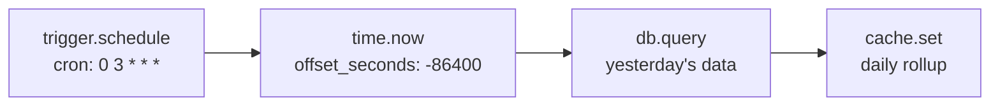
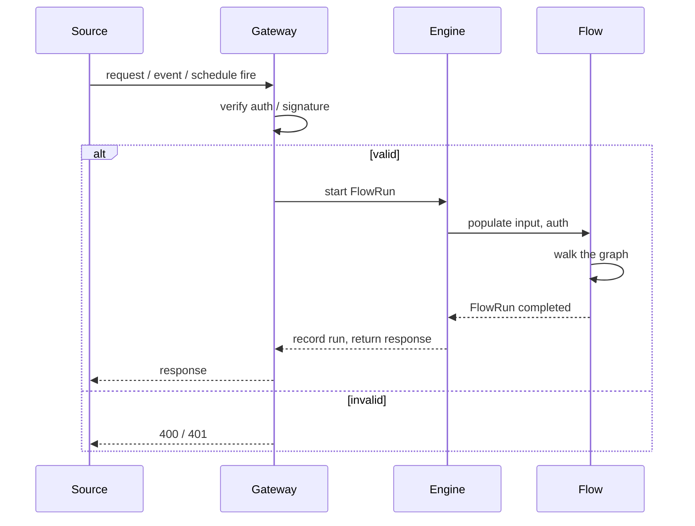

A flow needs exactly one entry point — a trigger. When the trigger fires, the engine starts a `FlowRun`, populates `input`, and begins walking the graph. This page covers every trigger type, what data it supplies, and how to choose between them.

<CardGroup cols={3}>
  <Card title="HTTP" icon="globe">Inbound requests — REST, webhooks, and custom endpoints.</Card>
  <Card title="Event" icon="bolt">Platform events — user actions, system events, emitted events.</Card>
  <Card title="Schedule" icon="clock">Cron-based and interval-based recurring execution.</Card>
</CardGroup>
<CardGroup cols={3}>
  <Card title="Job" icon="list-todo">Background jobs dispatched by the scheduler.</Card>
  <Card title="Webhook" icon="link">Signed inbound payloads from external services.</Card>
  <Card title="Realtime" icon="radio">WebSocket and realtime channel events.</Card>
</CardGroup>
<CardGroup cols={3}>
  <Card title="Manual" icon="hand-pointer">Triggered from Studio's Run panel or the API.</Card>
  <Card title="Resource" icon="database">Reactions to CRUD operations on a resource.</Card>
  <Card title="Comparison" icon="table-columns">Which trigger to choose.</Card>
</CardGroup>

## Trigger comparison

| Trigger | `input` shape | Auth | Best for |
| --- | --- | --- | --- |
| `trigger.http` | `{body, params, headers, query}` | Bearer / API key | REST endpoints, form submissions |
| `trigger.event` | `{event, payload, id, timestamp}` | Service | User actions, cross-flow events |
| `trigger.schedule` | `{schedule, fired_at, previous_run}` | Service | Nightly jobs, periodic aggregates |
| `trigger.job` | `{job_id, payload, schedule}` | Service | Background processing |
| `trigger.manual` | Whatever you supply | Configurable | Testing, one-off processing |
| `trigger.webhook` | `{body, headers, params}` | Signature verified | External service callbacks |
| `trigger.realtime` | `{channel, event, data}` | Service | WebSocket-driven updates |
| `trigger.resource` | `{resource, action, record, previous}` | Service | Reacting to data changes |

## `trigger.http` — Inbound requests

The workhorse trigger. Fires when an HTTP request hits a registered route.

```json
{ "id": "http", "data": { "block": "trigger.http", "config": { "method": "POST", "path": "/orders" } } }
```

| Config | Type | Required | Description |
| --- | --- | --- | --- |
| `method` | `string` | yes | `GET`, `POST`, `PUT`, `PATCH`, `DELETE` |
| `path` | `string` | yes | The route path (can include `:param` segments) |
| `auth` | `string` | no | `"required"` or `"optional"` — whether a bearer token is needed |
| `policy` | `string` | no | Policy name to evaluate on the request |

**`input` shape:**

```json
{
  "body": { "name": "Alice", "email": "alice@example.com" },
  "params": { "id": "ord_1" },
  "headers": { "authorization": "Bearer ...", "content-type": "application/json" },
  "query": { "page": "1" }
}
```

Path parameters are accessible as `{{ input.params.id }}`. The request body is parsed as JSON and available as `{{ input.body }}`. Query strings are in `{{ input.query }}`.

<Tip>
Use `method: "ANY"` to accept all HTTP methods on a single route — common for webhook-style endpoints that handle both `GET` (health check) and `POST` (inbound payload).
</Tip>

### Path parameters

```json
{ "block": "trigger.http", "config": { "method": "GET", "path": "/users/:user_id/orders/:order_id" } }
```

```json
"{{ input.params.user_id }}" → "usr_abc"
"{{ input.params.order_id }}" → "ord_1"
```

### Auth modes

- `"required"` — a valid bearer token must be present; the flow runs with that user's auth context
- `"optional"` — a bearer token is welcome but not required; flows with service rights if absent
- omitted — defaults to `"optional"`

## `trigger.event` — Platform events

Fires when a named event is emitted — either by another flow via `event.emit`, by the platform itself, or by a `trigger.event` node listening for a specific pattern.

```json
{ "id": "event", "data": { "block": "trigger.event", "config": { "event": "order.paid" } } }
```

| Config | Type | Required | Description |
| --- | --- | --- | --- |
| `event` | `string` | yes | The event name (or pattern) to listen for |

**`input` shape:**

```json
{
  "event": "order.paid",
  "payload": { "order_id": "ord_1", "amount": 49.99 },
  "id": "evt_abc123",
  "timestamp": "2026-09-28T12:00:00Z"
}
```

Events flow through the platform's event bus. When a flow emits `order.paid` via `event.emit`, every flow with a `trigger.event` listening for that name fires — independently, concurrently, and with its own `FlowRun`.

<Note>
Events are **fire-and-forget**. The emitting flow does not wait for subscribers. Each subscriber runs in its own `FlowRun` with its own timeout and error handling.
</Note>

### Event patterns

You can listen for a wildcard pattern. For example, `event: "order.*"` matches `order.created`, `order.paid`, `order.cancelled`. The matching event name is available as `{{ input.event }}`, and the captured segment is available via the engine's pattern resolution.

## `trigger.schedule` — Recurring execution

Fires on a cron schedule or at a fixed interval.

```json
{ "id": "sched", "data": { "block": "trigger.schedule", "config": { "cron": "0 3 * * *" } } }
```

| Config | Type | Required | Description |
| --- | --- | --- | --- |
| `cron` | `string` | yes | Cron expression (5 fields: `min hour dom mon dow`) |
| `interval` | `string` | no | Alternative to `cron`: `1h`, `30m`, `1d` |
| `timezone` | `string` | no | IANA timezone, default `"UTC"` |
| `enabled` | `boolean` | no | Whether the schedule is active |

**`input` shape:**

```json
{
  "schedule": { "cron": "0 3 * * *", "timezone": "UTC" },
  "fired_at": "2026-09-28T03:00:00Z",
  "previous_run": "2026-09-27T03:00:00Z"
}
```



<Tip>
Use `time.now` with `offset_seconds` inside the flow body to compute the previous period. The trigger's `fired_at` is the exact moment the job started — a rollup for "yesterday" needs to subtract a day from `fired_at`, not rely on the trigger payload alone.
</Tip>

## `trigger.job` — Background jobs

Fires when a background job is dispatched to the platform's job queue. Jobs are typically created by the scheduler processing `queue.flow` or `queue.function` dispatches.

```json
{ "id": "job", "data": { "block": "trigger.job", "config": { "job_type": "process_batch" } } }
```

| Config | Type | Required | Description |
| --- | --- | --- | --- |
| `job_type` | `string` | yes | The job type to listen for |

**`input` shape:**

```json
{
  "job_id": "job_abc123",
  "payload": { "batch_id": "batch_456" },
  "schedule": { "cron": "0 3 * * *" }
}
```

Jobs run in the background — they don't hold an HTTP connection open. The platform's job queue manages concurrency, retries, and dead-letter handling. A `trigger.job` node is the entry point for any flow that runs as a background process.

## `trigger.manual` — Manual execution

Fires when triggered from Studio's Run panel, the platform API (`POST …/flows/{name}/run`), or programmatically.

```json
{ "id": "manual", "data": { "block": "trigger.manual", "config": {} } }
```

**`input` shape** is whatever you supply in the Run panel:

```json
{ "name": "process_order", "input": { "order_id": "ord_1", "force": true } }
```

Manual triggers are essential for testing. You can supply custom `input`, override `auth` via `as_user`, and choose which trigger node to start from when a flow has several.

<Tip>
Combine `trigger.manual` with a `control.if` on `{{ input.force }}` to build flows that can be run both from a real event and manually — with the manual run taking a faster path for testing.
</Tip>

## `trigger.webhook` — Signed inbound payloads

Fires when an external service sends a POST request with a cryptographic signature. The platform verifies the signature **before** the flow starts — if the signature is invalid, the request is rejected with `400` and the flow never runs.

```json
{ "id": "webhook", "data": { "block": "trigger.webhook", "config": { "hook": "stripe_events" } } }
```

| Config | Type | Required | Description |
| --- | --- | --- | --- |
| `hook` | `string` | yes | The webhook hook name (registered in the platform) |
| `signature_header` | `string` | no | Header name containing the signature (default `"X-Signature"`) |
| `algorithm` | `string` | no | HMAC algorithm (default `"hmac_sha256"`) |

**`input` shape:**

```json
{
  "body": { "data": { "object": { "id": "pi_123" } }, "event": "payment_intent.succeeded" },
  "headers": { "x-signature": "hmac_sha256=...", "content-type": "application/json" },
  "params": {}
}
```

The signature verification happens at the platform gateway — `trigger.webhook` only runs if verification succeeds. This means inside the flow, `input.body` is already trusted payload data.

<Warning>
A `trigger.webhook` that receives an invalid signature returns `400` immediately. There is no `error` branch to catch this — the rejection happens before the flow starts.
</Warning>

### Webhook idempotency

External services may retry webhook deliveries. Always design webhook-triggered flows to be idempotent — a second `payment_intent.succeeded` event for the same payment should not double-charge. Use `resource.list` with the event id as a filter to check whether the flow already processed this event.

## `trigger.realtime` — Realtime channel events

Fires when a realtime channel event is broadcast. This is the entry point for flows that react to live WebSocket connections.

```json
{ "id": "realtime", "data": { "block": "trigger.realtime", "config": { "channel": "collaboration", "event": "cursor_move" } } }
```

| Config | Type | Required | Description |
| --- | --- | --- | --- |
| `channel` | `string` | yes | The realtime channel name |
| `event` | `string` | yes | The event name on that channel |

**`input` shape:**

```json
{
  "channel": "collaboration",
  "event": "cursor_move",
  "data": { "userId": "usr_abc", "x": 120, "y": 340 }
}
```

Realtime triggers are useful for flows that need to react to live user interactions — cursor positions, annotations, collaborative edits — and can also push results back through `realtime.broadcast`.

## `trigger.resource` — Data change reactions

Fires when a record on a resource is created, updated, or deleted. This is the flow equivalent of a database trigger.

```json
{ "id": "resource", "data": { "block": "trigger.resource", "config": { "resource": "orders", "actions": ["create", "update"] } } }
```

| Config | Type | Required | Description |
| --- | --- | --- | --- |
| `resource` | `string` | yes | The resource name |
| `actions` | `array` | yes | `["create"]`, `["update"]`, `["delete"]`, or any combination |

**`input` shape:**

```json
{
  "resource": "orders",
  "action": "update",
  "record": { "id": "ord_1", "status": "paid", "updated_at": "..." },
  "previous": { "id": "ord_1", "status": "pending", "updated_at": "..." }
}
```

`trigger.resource` fires for every matching mutation — including those made by flows themselves via `resource.create`/`resource.update`. Be careful of infinite loops: a flow that updates a record on which it's listening would trigger itself. Guard against this with a `control.if` that checks whether the change is meaningful (e.g., comparing `{{ input.record.status }}` to `{{ input.previous.status }}`).

## Choosing the right trigger

<AccordionGroup>
  <Accordion title="Inbound request from a client app?">
    Use `trigger.http`. It gives you the full request context — body, params, headers, query — and the flow's output becomes the HTTP response.
  </Accordion>
  <Accordion title="React to something another flow does?">
    Use `trigger.event` with `event.emit`. Decouple the emitter from the consumers so they can evolve independently.
  </Accordion>
  <Accordion title="Run something on a schedule?">
    Use `trigger.schedule` with a `cron` expression. For one-off delays, use `queue.flow`/`queue.function` instead.
  </Accordion>
  <Accordion title="Process a background task?">
    Use `trigger.job` when the work is dispatched through the job queue. Use `trigger.manual` for ad-hoc runs.
  </Accordion>
  <Accordion title="Receive a signed callback from Stripe, GitHub, or another service?">
    Use `trigger.webhook`. The platform verifies the signature before the flow runs — the flow never sees an unverified request.
  </Accordion>
  <Accordion title="React to a live WebSocket event?">
    Use `trigger.realtime`. The flow runs when the channel event is broadcast.
  </Accordion>
  <Accordion title="React when a database record changes?">
    Use `trigger.resource`. Be careful of infinite loops when the flow itself modifies the same resource.
  </Accordion>
  <Accordion title="Testing a flow you just built?">
    Use `trigger.manual` from Studio's Run panel. Supply custom `input` and optionally `as_user`.
  </Accordion>
</AccordionGroup>

## Trigger lifecycle

Every trigger follows the same lifecycle:



The gateway handles auth verification and signature checks **before** the flow starts. If verification fails, the flow never runs and there is no `error` branch to catch it — the request is rejected outright.

## Common mistakes

<AccordionGroup>
  <Accordion title="Using `trigger.event` for something that should be `trigger.http`">
    If a client app needs a synchronous response, use `trigger.http`. `trigger.event` is fire-and-forget — the emitter doesn't wait.
  </Accordion>
  <Accordion title="Assuming `trigger.resource` won't fire for the flow's own writes">
    It will. A flow that listens for `orders:update` and then updates an order via `resource.update` triggers itself. Always guard with a condition.
  </Accordion>
  <Accordion title="Not making webhook flows idempotent">
    External services retry. Design webhook flows to handle duplicate events gracefully.
  </Accordion>
  <Accordion title="Using `trigger.schedule` with a timezone mismatch">
    The cron runs in UTC by default. If your business logic depends on local time, set `timezone` explicitly or use `time.now` with the correct offset inside the flow.
  </Accordion>
</AccordionGroup>

## Next

<CardGroup cols={2}>
  <Card title="Flows overview" icon="waypoints" href="/flows/overview">How flows fit in the platform.</Card>
  <Card title="Platform blocks" icon="plug" href="/flows/platform-blocks">Events, mail, HTTP, storage, cache — the platform tools.</Card>
  <Card title="Control flow" icon="git-branch" href="/flows/control-flow">How flows branch and loop after a trigger fires.</Card>
  <Card title="Custom blocks" icon="puzzle-piece" href="/flows/custom-blocks">Extending with your own blocks.</Card>
</CardGroup>
