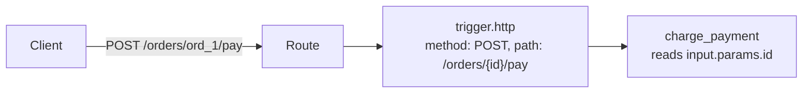
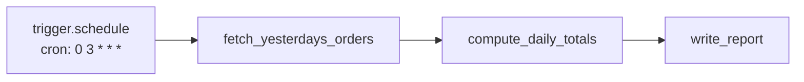
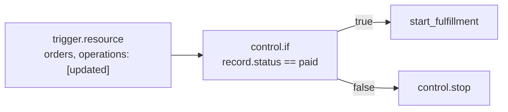
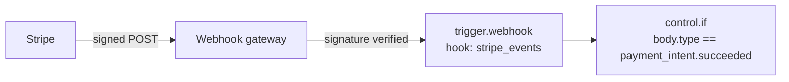
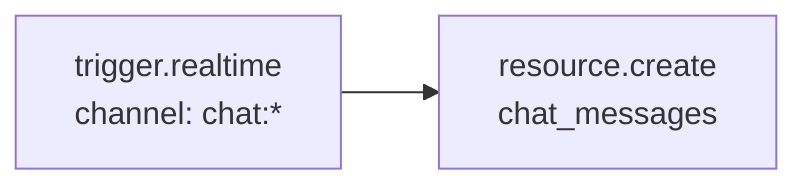

A Flow needs exactly one starting point: a **Trigger**. When a Trigger fires, the engine starts a run, puts the Trigger's payload into `input`, and begins walking the Flow's Steps. A Flow can contain more than one Trigger node — useful when the same logic should be reachable both from a real event and from a manual test run — but exactly one Trigger node is where any given run actually started.

This page covers every Trigger, its Studio configuration field by field, and the exact shape of `input` it produces, so you never have to guess what's available to the first `control.if` or Step after it.

<CardGroup cols={3}>
  <Card title="HTTP" icon="globe">Inbound requests — REST endpoints and direct invocation.</Card>
  <Card title="Event" icon="bolt">Platform events emitted by another Flow or the platform itself.</Card>
  <Card title="Schedule" icon="clock">Cron or fixed-interval recurring execution.</Card>
</CardGroup>
<CardGroup cols={3}>
  <Card title="Resource" icon="database">Reactions to a resource being created, updated, or deleted.</Card>
  <Card title="Webhook" icon="link">Verified inbound payloads from an external service.</Card>
  <Card title="Realtime" icon="radio">A client publishing to a realtime channel.</Card>
</CardGroup>
<CardGroup cols={3}>
  <Card title="Job" icon="list-todo">The Flow dispatched as a background job.</Card>
  <Card title="Manual" icon="hand-pointer">Started from Studio or the platform API.</Card>
  <Card title="Comparison" icon="table-columns">Which Trigger to choose.</Card>
</CardGroup>

## Trigger comparison

| Trigger | `input` shape | Fires when |
| --- | --- | --- |
| `trigger.http` | The parsed request — see below, shape differs by whether `path` is set | An HTTP request reaches this Flow |
| `trigger.event` | `{ event: { name, payload, id, source, actor, occurred_at, request_id } }` | A matching platform event is published |
| `trigger.schedule` | `{ scheduled_at }` (or the schedule's configured payload) | The schedule fires |
| `trigger.resource` | `{ event: { name, payload: { resource, change, record }, ... } }` | A resource record is created, updated, or deleted |
| `trigger.webhook` | `{ hook, headers, body }` | A verified inbound webhook is received |
| `trigger.realtime` | `{ event: { name: "realtime.message", payload: { channel, event, data }, ... } }` | A client publishes to a matching channel |
| `trigger.job` | Whatever payload the dispatcher supplied | The Flow is dispatched as a background job |
| `trigger.manual` | Whatever you supply in Studio's Run panel | Run from Studio or the platform API |

## Two syntaxes you'll see across every Trigger

Trigger configuration fields are plain strings, numbers, and one JSON Condition field (`trigger.http`'s `policy`) — not Expressions. `input` itself, once the run starts, is read the same way from every later Step: `{{ input.body.email }}`, `$input.event.payload.record.id`, and so on, exactly as described in [Control flow](/flows/control-flow). If you haven't read that page yet, its "Two ways to reference state" section explains the difference between the `{{ }}` Expression syntax used in ordinary fields and the `$path` Condition syntax used in fields like `policy`.

## `trigger.http` — Inbound HTTP requests

**Purpose.** Start a Flow from an HTTP request — either a request to a custom Route you've defined, or a direct call to this Flow's own invocation URL.

**Mental model.** A Flow with a `trigger.http` node is reachable two different ways, and which one applies is decided entirely by whether `path` is set:

- **`path` set:** the Trigger only fires when a Route (configured separately in Studio's Routes) matches this exact `method` and `path`, and that Route is bound to this Flow. `input` is the Route's parsed request.
- **`path` left empty:** the Flow becomes directly invocable at `POST /flows/v1/<flow-name>`. `input` is just the request body — nothing else. This is the fast path for calling a Flow from your own backend or from a test client without defining a Route first.

A Flow with several `trigger.http` nodes picks the one whose `method`/`path` matches the incoming Route; if none matches exactly, the first `trigger.http` node in the Flow is used as a fallback entry point.

**When to use.** Any Flow that should answer an HTTP client directly and produce an immediate response. Pair with `response.return` to control the status code and body sent back.

**When not to use.** For work that doesn't need to answer a caller synchronously — processing that can happen after the request returns — prefer `trigger.event` or dispatching a job, so the caller isn't kept waiting on Steps it doesn't need a result from.

### Studio configuration

| Field | Type | Required | Default | Description |
| --- | --- | --- | --- | --- |
| `method` | string (enum) | No | `POST` | One of `GET`, `POST`, `PUT`, `PATCH`, `DELETE` |
| `path` | string | No | — | The Route path this Trigger answers, e.g. `/orders/{id}/pay`. Leave empty to invoke this Flow directly at `/flows/v1/<name>` |
| `policy` | Condition | No | `authenticated` | Who may call the Flow directly when `path` is empty. Ignored when `path` is set — the Route's own policy governs instead |

<Warning>
There is no `auth` field on `trigger.http`. Access control is entirely the `policy` Condition (for direct invocation) or the bound Route's own policy (when `path` is set) — never a separate required/optional flag on the Trigger itself.
</Warning>

### Inputs, outputs

`trigger.http`'s own output is always just `input` passed through — the interesting part is what `input` contains, and that depends on `path`:

**With `path` set** (served through a Route):

```json
{
  "params": { "id": "ord_1" },
  "query": { "page": "1" },
  "body": { "status": "paid" }
}
```

Path segments named in the Route (`{id}`) land in `input.params`; the query string in `input.query`; a parsed JSON body in `input.body`. There is no `headers` key here — a Route's request model validates and shapes the body before the Flow ever sees it.

**With `path` empty** (direct invocation):

```json
{ "status": "paid", "total": 49.99 }
```

`input` *is* the parsed request body — not wrapped in a `body` key. `input.params` and `input.query` don't exist in this mode; there's no Route to supply them.

### Execution behavior

For a Route-bound `trigger.http`, the Route's request model (defined separately, not part of the Trigger config) validates the body before this Trigger's Flow ever starts — an invalid body never reaches your Flow. For direct invocation, the body is parsed as JSON with no schema validation unless you add a `control.if` to check it yourself.

### Examples

Simple — a Flow invoked directly, no Route:

```json
{ "method": "POST" }
```

Called as `POST /flows/v1/process_payment` with any JSON body; `policy` defaults to `authenticated`, so only a signed-in caller (or a service credential) may call it.

Realistic — order fulfillment, a Route-bound Trigger reacting to a specific endpoint:

```json
{ "method": "POST", "path": "/orders/{id}/pay" }
```



Restricting direct invocation to service credentials only:

```json
{ "method": "POST", "policy": { "service": true } }
```

### Related blocks

`response.return` to shape the HTTP response; Routes (configured separately) for public REST endpoints with request/response schemas, rate limits, and caching — `trigger.http` with `path` set is the Flow-side half of a Route.

### Troubleshooting

<AccordionGroup>
  <Accordion title="input.body is undefined">
    You're on a Route-bound Trigger (`path` set) but reading `input` as if it were direct-invocation shape. Use `input.body.<field>`, not `input.<field>`, whenever `path` is set.
  </Accordion>
  <Accordion title="Calling POST /flows/v1/<name> returns 404">
    Direct invocation only exists for a Flow whose `trigger.http` node has `path` empty. If every `trigger.http` node in the Flow has a `path`, there is no direct-invocation URL — call the Route instead.
  </Accordion>
  <Accordion title="policy seems to have no effect">
    `policy` only governs direct invocation. If the Trigger has `path` set, access is controlled by the Route's own policy, configured where the Route is defined, not here.
  </Accordion>
</AccordionGroup>

## `trigger.event` — Platform events

**Purpose.** Start a Flow when a named event is published on the platform's event bus — by another Flow, a resource write, or the platform itself.

**Mental model.** Publish/subscribe. Whatever emits the event doesn't know or care which Flows are listening; every `trigger.event` whose pattern matches fires independently, in its own run, with its own timeout.

**When to use.** Decoupling: a Flow that processes a payment shouldn't need to know about every Flow that reacts to `order.paid` — it just publishes the event and lets subscribers come and go independently.

**When not to use.** When the caller needs a synchronous answer — events are fire-and-forget; nothing waits for a subscriber to finish. Use `trigger.http` for anything that must answer its caller directly.

### Studio configuration

| Field | Type | Required | Default | Description |
| --- | --- | --- | --- | --- |
| `event` | string | Yes | — | The event name or glob pattern to listen for, e.g. `order.paid` or `order.*` |

### Inputs, outputs

```json
{
  "event": {
    "name": "order.paid",
    "payload": { "order_id": "ord_1", "amount": 49.99 },
    "id": "3f9c2b1a...",
    "source": "flows",
    "actor": "usr_abc",
    "occurred_at": "2026-09-28T12:00:00+00:00",
    "request_id": "req_123"
  }
}
```

Every field of the event is available under `input.event` — the event's own data is always under `input.event.payload`, never directly under `input`. The matching event name is `input.event.name`; when `event` is a pattern like `order.*`, `input.event.name` tells you which concrete event matched.

### Execution behavior

Events are delivered at-least-once and processed independently per subscriber — a slow or failing subscriber Flow doesn't block or delay any other subscriber, and doesn't block the Flow that published the event either.

### Examples

Simple:

```json
{ "event": "order.paid" }
```

Realistic — order fulfillment, react to any order state change and branch on which one:

```json
{ "event": "order.*" }
```

```json
{ "condition": { "eq": ["$input.event.name", "order.refunded"] } }
```

### Related blocks

`trigger.resource`, a specialized form of the same mechanism scoped to a resource's own lifecycle events; the platform block that publishes custom events, documented in [Platform blocks](/flows/platform-blocks).

### Troubleshooting

<AccordionGroup>
  <Accordion title="input.payload doesn't exist">
    The event's data is nested one level deeper than you might expect: `input.event.payload`, not `input.payload`.
  </Accordion>
  <Accordion title="The Flow doesn't fire for events I expect it to match">
    Patterns use shell-style globbing (`order.*` matches `order.paid`, not `order.line_item.added` — a single `*` doesn't cross a `.` the way some pattern languages allow multiple segments). Use the exact event name if you're unsure a pattern is scoped the way you expect.
  </Accordion>
</AccordionGroup>

## `trigger.schedule` — Recurring execution

**Purpose.** Start a Flow on a recurring schedule, managed by the platform's scheduler process.

**Mental model.** Cron, or a fixed interval — pick one. The scheduler tracks the last run and fires the next one on time regardless of how long the previous run took (subject to the platform's own scheduling reconciliation).

**When to use.** Nightly rollups, periodic cleanup, polling a third party that has no webhook of its own.

**When not to use.** A one-off delayed action tied to a specific record (send a reminder 3 days after signup) — that's better modeled as a delayed job dispatch than a recurring schedule.

### Studio configuration

| Field | Type | Required | Default | Description |
| --- | --- | --- | --- | --- |
| `cron` | string | No | — | A cron expression, e.g. `0 3 * * *` |
| `every` | integer | No | — | Or a fixed interval in seconds, as an alternative to `cron` |

Set one or the other. Neither field is individually marked required in the schema, but a schedule needs one of them to mean anything — leaving both empty produces a Trigger that never fires on its own.

### Inputs, outputs

```json
{ "scheduled_at": "2026-09-28T03:00:00+00:00" }
```

If the schedule was configured with its own fixed payload (set where the schedule itself is defined, alongside `cron`/`every`), that payload is delivered as `input` instead of the default `{ scheduled_at }` shape.

### Execution behavior

`cron` and `every` describe *when* the scheduler fires this Trigger; they are evaluated by the platform's scheduler process, not by the Flow engine itself. There is no per-Trigger `timezone` or `enabled` field — a cron expression runs in UTC, and enabling or disabling a schedule is done where the schedule itself is managed, not as a config field on this block.

### Examples

Simple — nightly at 3am UTC:

```json
{ "cron": "0 3 * * *" }
```

Every 15 minutes:

```json
{ "every": 900 }
```

Realistic — order fulfillment, a nightly rollup of the previous day's orders:



<Tip>
`input.scheduled_at` is the moment the schedule fired — for "yesterday's" data, compute an offset from `scheduled_at` inside the Flow rather than assuming the payload already contains a date range.
</Tip>

### Related blocks

Job dispatch blocks (see [Platform blocks](/flows/platform-blocks)) for one-off delayed work tied to a specific record, rather than a recurring schedule.

### Troubleshooting

<AccordionGroup>
  <Accordion title="Expecting a timezone field">
    There isn't one on this Trigger. `cron` is evaluated in UTC; convert inside the Flow if your business logic depends on local time.
  </Accordion>
  <Accordion title="Setting both cron and every">
    Only set one. The scheduler is defined around one or the other; setting both leaves it ambiguous which governs the fire time.
  </Accordion>
</AccordionGroup>

## `trigger.resource` — Data change reactions

**Purpose.** Start a Flow when a record on a given resource is created, updated, or deleted.

**Mental model.** A specialized `trigger.event`, scoped to one resource's own lifecycle. Under the hood it's the same event delivery mechanism — the resource publishes an event on every matching write, and this Trigger listens for it.

**When to use.** Reacting to data changes regardless of what caused them — the REST API, another Flow, a Function, or a transaction all trigger the same way, as long as the resource is configured to publish events.

**When not to use.** If only writes made through one specific Flow or Route matter, put the reaction directly after that write instead of listening resource-wide — a resource-wide Trigger fires for *every* write, including ones you didn't anticipate.

### Studio configuration

| Field | Type | Required | Default | Description |
| --- | --- | --- | --- | --- |
| `resource` | string | Yes | — | The resource name to watch |
| `operations` | array of strings | No | all three | Which changes to react to: `created`, `updated`, `deleted` |

<Warning>
The values are past tense — `created`, `updated`, `deleted` — not `create`/`update`/`delete`. Leaving `operations` empty listens for all three.
</Warning>

### Inputs, outputs

```json
{
  "event": {
    "name": "orders.updated",
    "payload": {
      "resource": "orders",
      "change": "updated",
      "record": { "id": "ord_1", "status": "paid", "total": 49.99 }
    },
    "id": "3f9c2b1a...",
    "source": "resources",
    "occurred_at": "2026-09-28T12:00:01+00:00"
  }
}
```

<Warning>
There is no `previous` field. The event carries the record's *current* state after the write — `input.event.payload.record` — not a before/after pair. If a Flow needs to know what changed, it must compare against a value it fetched or stored itself before this Trigger fired, or read only what it needs from the current record.
</Warning>

### Execution behavior

`trigger.resource` fires for every matching write, including writes made by Flows themselves. A Flow that listens for `orders` updates and then writes back to the same order will trigger itself — guard against infinite loops with a `control.if` that only proceeds when the change is one this Flow hasn't already made (for example, checking a status value this Flow itself sets, so a second pass sees no further change to react to).

### Examples

Simple — react to any change on `orders`:

```json
{ "resource": "orders" }
```

Realistic — order fulfillment, only react to updates, not creation or deletion:

```json
{ "resource": "orders", "operations": ["updated"] }
```



### Related blocks

`trigger.event` for reacting to custom, non-resource events; `control.if` immediately after this Trigger to filter down to the specific change that matters, since `operations` only filters by kind of change, not by field.

### Troubleshooting

<AccordionGroup>
  <Accordion title="Looking for input.previous or input.action">
    They don't exist. Use `input.event.payload.record` for the current record and `input.event.payload.change` for which operation happened (`created`/`updated`/`deleted`).
  </Accordion>
  <Accordion title="A Flow seems to trigger itself repeatedly">
    Very likely: the Flow writes to the same resource it listens on. Add a `control.if` guard that only proceeds on changes the Flow hasn't already made itself.
  </Accordion>
</AccordionGroup>

## `trigger.webhook` — Inbound webhooks

**Purpose.** Start a Flow when an external service (Stripe, GitHub, a partner API) posts a payload to a webhook endpoint the platform verifies for you.

**Mental model.** The platform's inbound webhook gateway checks the signature *before* your Flow ever runs. By the time `trigger.webhook` fires, the payload is trusted — there's no signature to check inside the Flow itself.

**When to use.** Any inbound callback from a third party that signs its requests.

**When not to use.** For your own services calling into Pawabase, `trigger.http` is simpler — webhook verification exists specifically for payloads whose authenticity you can't otherwise establish.

### Studio configuration

| Field | Type | Required | Default | Description |
| --- | --- | --- | --- | --- |
| `hook` | string | Yes | — | The inbound webhook's slug, as registered in the platform's webhook settings |

<Warning>
There is no `signature_header` or `algorithm` field here. Signature verification — which header carries the signature, which algorithm and secret to use — is configured where the inbound webhook endpoint itself is set up, not on this Trigger node. `trigger.webhook`'s only job is naming which registered hook it answers.
</Warning>

### Inputs, outputs

```json
{
  "hook": "stripe_events",
  "headers": { "user-agent": "Stripe/1.0", "content-type": "application/json" },
  "body": { "type": "payment_intent.succeeded", "data": { "object": { "id": "pi_123" } } }
}
```

Only a small set of headers is forwarded (those starting with `x-`, plus `user-agent` and `content-type`); the header carrying the signature itself is stripped, since it's already been verified and is never meaningful inside the Flow. There is no `params` or `query` key — a webhook endpoint has no path parameters or query string of its own.

### Execution behavior

If the inbound signature doesn't verify, the request is rejected before this Trigger fires at all — the Flow never runs, and there's no error Branch that can observe an invalid signature; it simply never starts.

### Examples

```json
{ "hook": "stripe_events" }
```

Realistic — order fulfillment, handling a payment confirmation from a processor:



<Note>
External services retry webhook deliveries. Design a webhook-triggered Flow to be idempotent — check whether this event's id has already been processed before acting on it a second time, so a retried delivery doesn't double-charge or double-fulfill.
</Note>

### Related blocks

`trigger.event`, if you'd rather have the webhook gateway publish a platform event (fan-out to several subscribers) instead of running one Flow directly — that's a choice made in the webhook's own target configuration, not on this Trigger.

### Troubleshooting

<AccordionGroup>
  <Accordion title="Expecting input.params or input.query">
    Neither exists on `trigger.webhook`. Only `hook`, `headers`, and `body` are present.
  </Accordion>
  <Accordion title="A retried delivery processes the payload twice">
    Design for it — external services retry on any ambiguous response. Check for the event's id before acting, or make the underlying write itself idempotent (an upsert keyed on the external event id).
  </Accordion>
  <Accordion title="Trying to configure the signature algorithm on this block">
    That configuration lives with the webhook endpoint itself, in Studio's webhook settings — not on the `trigger.webhook` node.
  </Accordion>
</AccordionGroup>

## `trigger.realtime` — Realtime channel events

**Purpose.** Start a Flow when a client publishes a message to a matching realtime channel.

**Mental model.** The realtime layer's counterpart to `trigger.event` — a client-originated message becomes a platform event under the hood, and this Trigger listens for it on a channel pattern.

**When to use.** Server-side reactions to live client activity — validating a message before broadcasting it further, persisting a chat message, reacting to a presence change.

### Studio configuration

| Field | Type | Required | Default | Description |
| --- | --- | --- | --- | --- |
| `channel` | string | Yes | — | The channel name or glob pattern to listen on, e.g. `chat:*` |

<Warning>
There is no separate `event` field. `channel` is the only thing you configure — which event name on that channel matters, if that distinction applies to your use of realtime, is something you read from `input.event.payload.event` at run time, not something you filter on here.
</Warning>

### Inputs, outputs

```json
{
  "event": {
    "name": "realtime.message",
    "payload": { "channel": "chat:room_42", "event": "message.sent", "data": { "text": "hi", "user_id": "usr_abc" } },
    "id": "3f9c2b1a...",
    "occurred_at": "2026-09-28T12:00:00+00:00"
  }
}
```

The channel the message actually arrived on is `input.event.payload.channel` — useful when `channel` is a pattern like `chat:*` and you need to know which concrete channel matched.

### Examples

```json
{ "channel": "chat:*" }
```

Realistic — persist a chat message a client published to a room channel:



### Related blocks

The platform's realtime broadcast block (see [Platform blocks](/flows/platform-blocks)) to push a Flow's result back out to subscribers of a channel.

### Troubleshooting

<AccordionGroup>
  <Accordion title="Looking for an event config field to filter by message type">
    It doesn't exist on this Trigger. Filter inside the Flow with a `control.if` on `input.event.payload.event` instead.
  </Accordion>
</AccordionGroup>

## `trigger.job` — Background jobs

**Purpose.** Start a Flow when it's dispatched to run as a background job, off the request path.

**Mental model.** The entry point for anything queued rather than run inline — the counterpart to `trigger.http` for work that doesn't need to answer a caller synchronously.

**When to use.** Long-running or bulk work dispatched from another Flow, a Function, or the scheduler, where a caller shouldn't wait for it to finish.

### Studio configuration

| Field | Type | Required | Default | Description |
| --- | --- | --- | --- | --- |
| `queue` | string | No | `"default"` | The named queue this job runs on |

<Warning>
The field is `queue`, not `job_type`. A Flow doesn't declare a job "type" on this Trigger — it declares which queue its dispatched runs should be processed on, which is a scheduling/isolation concern (separating high-priority work from bulk work, for instance), not an identifier you branch on.
</Warning>

### Inputs, outputs

`input` is exactly whatever payload the dispatching code supplied when it queued the job — there's no fixed shape imposed by the Trigger itself. A dispatch from the scheduler, another Flow, or your own backend can each hand this Trigger a different shape; document the expected shape wherever this Flow is dispatched from.

### Execution behavior

Jobs are picked up by the platform's queue workers and don't hold any caller's connection open. Concurrency, retry-on-worker-crash, and dead-letter handling for the queue itself are managed by the platform's job infrastructure, separately from anything this Trigger configures.

### Examples

```json
{ "queue": "default" }
```

Realistic — order fulfillment, a bulk reconciliation job kept off the default queue so it can't starve latency-sensitive jobs:

```json
{ "queue": "bulk" }
```

### Related blocks

`trigger.schedule` for work that should recur on its own, rather than being dispatched on demand; `trigger.manual` for ad-hoc runs during development.

### Troubleshooting

<AccordionGroup>
  <Accordion title="Expecting a fixed input shape">
    There isn't one — `trigger.job`'s `input` is entirely up to whatever dispatched it. Check the dispatching Flow or Function for the payload shape it sends.
  </Accordion>
  <Accordion title="Work on one queue seems to compete with work on another">
    It shouldn't, if they're genuinely different `queue` values — each named queue is processed independently. If contention shows up anyway, confirm both jobs are really configured with different `queue` values and not both defaulting to `"default"`.
  </Accordion>
</AccordionGroup>

## `trigger.manual` — Manual runs

**Purpose.** Start a Flow from Studio's Run panel or the platform API, with whatever input you supply on the spot.

**Mental model.** The escape hatch for testing and one-off runs — no external system needs to fire anything.

**When to use.** Building and testing a Flow before wiring a real Trigger; one-off administrative runs.

### Studio configuration

`trigger.manual` takes no configuration fields at all — there's nothing to set on the node itself.

### Inputs, outputs

`input` is exactly whatever you type into Studio's Run panel (or pass to the platform API's manual-run call) when starting the run — there's no default shape, and no fields to configure on the Trigger that would shape it for you.

### Examples

Running with a hand-crafted payload from Studio's Run panel, to exercise a Flow that normally starts from `trigger.resource`:

```json
{ "event": { "name": "orders.updated", "payload": { "resource": "orders", "change": "updated", "record": { "id": "ord_1", "status": "paid" } } } }
```

<Tip>
Because `trigger.manual` imposes no shape, you can hand it an `input` payload that mimics another Trigger's shape — as above — to test downstream Steps without needing the real event, webhook, or schedule to fire.
</Tip>

### Related blocks

Every other Trigger — `trigger.manual` is most useful paired with one of them during development, run against a payload shaped like whichever real Trigger the Flow will eventually use.

## Choosing the right Trigger

<AccordionGroup>
  <Accordion title="An inbound request from a client app that needs a response?">
    Use `trigger.http`. Set `path` if it should be served through a Route with a schema and policy of its own; leave it empty for a Flow you call directly.
  </Accordion>
  <Accordion title="Reacting to something another Flow or the platform does?">
    Use `trigger.event`. Keep the emitter and its subscribers decoupled — the emitter shouldn't know who's listening.
  </Accordion>
  <Accordion title="Running something on a schedule?">
    Use `trigger.schedule` with `cron` or `every`. For a one-off delay tied to a specific record, dispatch a delayed job instead.
  </Accordion>
  <Accordion title="Reacting when a resource record changes?">
    Use `trigger.resource`. Filter to the operations you care about, and guard against the Flow triggering itself if it writes back to the same resource.
  </Accordion>
  <Accordion title="Receiving a signed callback from an external service?">
    Use `trigger.webhook`. The platform verifies the signature before the Flow ever runs.
  </Accordion>
  <Accordion title="Reacting to a live client-published realtime message?">
    Use `trigger.realtime` with a channel pattern.
  </Accordion>
  <Accordion title="Processing something dispatched as background work?">
    Use `trigger.job`. Give it a distinct `queue` if it shouldn't compete with latency-sensitive jobs.
  </Accordion>
  <Accordion title="Testing a Flow you're building?">
    Use `trigger.manual` from Studio's Run panel with a hand-crafted `input`.
  </Accordion>
</AccordionGroup>

## Common mistakes

<AccordionGroup>
  <Accordion title="Adding an auth field to trigger.http">
    It doesn't exist. Access control on a direct-invocation `trigger.http` is the `policy` Condition; on a Route-bound one, it's the Route's own policy.
  </Accordion>
  <Accordion title="Expecting trigger.event's payload directly under input">
    It's nested: `input.event.payload`, with `input.event.name` alongside it — never `input.payload` on its own.
  </Accordion>
  <Accordion title="Looking for input.previous on trigger.resource">
    There is no before/after pair — only the current `input.event.payload.record`.
  </Accordion>
  <Accordion title="Writing operations values in present tense">
    `trigger.resource`'s `operations` values are `created`, `updated`, `deleted` — not `create`, `update`, `delete`.
  </Accordion>
  <Accordion title="Configuring a signature header or algorithm on trigger.webhook">
    That's configured on the webhook endpoint itself, not on this Trigger — `trigger.webhook` only takes `hook`.
  </Accordion>
  <Accordion title="Assuming trigger.resource won't fire for a Flow's own writes">
    It will — a Flow that listens for changes on a resource it also writes to will trigger itself. Guard with a condition.
  </Accordion>
  <Accordion title="Not making webhook-triggered Flows idempotent">
    External services retry deliveries. Check for duplicate event ids before acting a second time.
  </Accordion>
</AccordionGroup>

## Next

<CardGroup cols={2}>
  <Card title="Control flow" icon="git-branch" href="/flows/control-flow">Branching, looping, variables, and retries after a Trigger fires.</Card>
  <Card title="State" icon="database" href="/flows/state">Everything a Step can read: `input`, `vars`, `steps`, `auth`, `run`.</Card>
  <Card title="Platform blocks" icon="plug" href="/flows/platform-blocks">Events, mail, HTTP, storage, and queue blocks.</Card>
  <Card title="Errors and retries" icon="triangle-alert" href="/flows/errors-and-retries">What happens when a Step fails.</Card>
</CardGroup>
