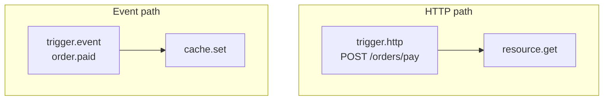

A flow is useless without something to start it. A **trigger** is the block that begins a run — it declares *when* a flow fires and hands the platform the configuration it needs to wire up the actual route, event subscription, or scheduled job. Every flow must have at least one trigger block; without one, `validate_flow` refuses to save it.

<CardGroup cols={2}>
  <Card title="HTTP triggers" icon="globe">Respond to requests at `POST /flows/v1/<name>` or custom routes bound to the flow.</Card>
  <Card title="Event triggers" icon="bolt">React to platform events like `order.paid` or `user.created`.</Card>
  <Card title="Schedule triggers" icon="calendar">Run on cron expressions or intervals, reconciled every 15 seconds.</Card>
  <Card title="Resource triggers" icon="database">Fire when a resource record is created, updated, or deleted.</Card>
  <Card title="Webhook triggers" icon="link">Receive verified inbound webhooks from external services.</Card>
  <Card title="Realtime triggers" icon="signal">React when a client publishes to a realtime channel.</Card>
  <Card title="Job triggers" icon="clock">Run when dispatched as a background job via `queue.flow`.</Card>
  <Card title="Manual triggers" icon="hand-pointer">Start by hand from Studio or the platform API.</Card>
</CardGroup>

## How triggers work

Every trigger block extends `_Trigger` from `pawabase_kit.flows.blocks.triggers`, which sets `trigger = True` and `category = "triggers"` on the class. At runtime, a trigger's `run()` method simply returns the run's input unchanged — a trigger never transforms the payload, it only declares *that* a run should start and hands back `input` as `steps.<trigger>.output`.

```python
class _Trigger(Block):
    category = "triggers"
    trigger = True

    async def run(self, config, run):
        return BlockResult(output=run.state["input"])
```

The configuration each trigger accepts is read by the **host** — the API compiles `trigger.http` nodes into actual HTTP routes, the scheduler picks up `trigger.schedule` nodes and registers cron/interval jobs, the event processor watches `trigger.event` nodes for matching publications, and so on. The trigger block itself knows nothing about routes or cron expressions; it only declares its shape in `config`.

## Trigger blocks at a glance

| Key | Config keys | Handles | Description |
| --- | --- | --- | --- |
| `trigger.http` | `method`, `path`, `policy` | — (terminal) | HTTP request to a route |
| `trigger.event` | `event` | — | Platform event matching a name or pattern |
| `trigger.schedule` | `cron`, `every` | — | Cron expression or interval |
| `trigger.resource` | `resource`, `operations` | `next` | Resource create/update/delete |
| `trigger.webhook` | `hook` | — | Verified inbound webhook |
| `trigger.realtime` | `channel` | — | Client publishes to a realtime channel |
| `trigger.job` | `queue` | — | Background job dispatch |
| `trigger.manual` | *(none)* | — | Started from Studio or the platform API |

## trigger.http — HTTP request

Runs when a request reaches an HTTP route bound to this flow. The API compiles the `method` and `path` at build time into a real route — see [The mental model](/concepts/mental-model#2-each-environment-compiles-into-an-app) for how a flow definition becomes a compiled app.

| Config | Type | Required | Default | Description |
| --- | --- | --- | --- | --- |
| `method` | `string` | no | `"POST"` | `GET`, `POST`, `PUT`, `PATCH`, or `DELETE` |
| `path` | `string` | yes | — | Route path with `{param}` placeholders, e.g. `/orders/{id}/pay` |
| `policy` | `json` | no | — | A policy name or inline condition; gates who may invoke the flow directly |

**Output:** `input` — the full request envelope `{"params": {...}, "body": {...}, "query": {...}, "headers": {...}}`. Path parameters land in `input.params`, the request body in `input.body`.

```json
{
  "id": "start",
  "data": {
    "block": "trigger.http",
    "config": {
      "method": "POST",
      "path": "/orders/{id}/pay",
      "policy": "authenticated"
    }
  }
}
```

When a `POST` to `/orders/42/pay` arrives with a valid `apikey` and a bearer token satisfying the `authenticated` policy, the flow starts with `input.params.id = "42"` and `input.body` holding the JSON payload.

### The `policy` config on trigger.http

The `policy` config is separate from any policy attached to the route in Studio. It's the flow's own gate: evaluated *before* the run starts, it determines whether the trigger fires at all. If the caller fails this policy, they never reach the flow — they get a `403` (or `401`) from the gateway before `FlowRun.execute()` is even called. This mirrors how a `trigger.http` node without a `policy` still requires a valid API key, but adds a *semantic* authorization check on top.

```json
{
  "id": "start",
  "data": {
    "block": "trigger.http",
    "config": {
      "method": "POST",
      "path": "/admin/override",
      "policy": {"role": ["admin"]}
    }
  }
}
```

Only callers holding the `admin` role can invoke this flow. The gateway enforces the policy using the same engine that guards resources and custom routes.

<Warning>
A `trigger.http` node's `policy` is evaluated *before* the run starts and gates the entire flow. Everything inside the flow runs with the platform's own service rights — resource writes don't re-check policies. Use `policy.check` inside the flow if you need a finer decision than the trigger's gate already made.
</Warning>

## trigger.event — Platform event

Runs when a platform event matching a name or pattern is published. Events are emitted by resource writes (`after_write` effects), by `event.emit` blocks inside other flows, by the scheduler (when a schedule fires an event target), and by many other platform actions.

| Config | Type | Required | Description |
| --- | --- | --- | --- |
| `event` | `string` | yes | Event name or pattern (supports `*` wildcards) |

**Output:** the event envelope, available at `input.event.payload`, `input.event.name`, `input.event.id`.

```json
{
  "id": "start",
  "data": {
    "block": "trigger.event",
    "config": { "event": "order.paid" }
  }
}
```

Event matching works by **exact name** and **pattern** with `*` wildcards. A trigger with `event: "order.*"` matches `order.paid`, `order.cancelled`, and `order.refunded`. The `*` matches exactly one dot-separated segment — `order.*.refunded` would match `order.us.refunded` but not `order.paid`.

```json
{
  "id": "start",
  "data": {
    "block": "trigger.event",
    "config": { "event": "*.created" }
  }
}
```

This matches any event ending in `.created`, which is a common pattern for reacting to "anything new" across a project.

### The event envelope shape

When a `trigger.event` starts a run, `input` is the full event envelope, not just the payload:

```json
{
  "event": "order.paid",
  "payload": { "order_id": "42", "store_id": "7" },
  "id": "evt_abc123",
  "published_at": "2026-09-28T10:00:00+00:00"
}
```

So inside the flow, `{{ input.event.payload.order_id }}` reads the order id, and `{{ input.event.name }}` reads `"order.paid"`. This is different from an HTTP trigger, where `input` is the request envelope.

<Note>
`event.emit` fires synchronously as part of the current run but publishes to a durable queue — consumers (other flows, functions, webhooks) process asynchronously. A slow consumer never blocks the flow that emitted the event.
</Note>

## trigger.schedule — Cron and interval

Runs on a schedule managed by the scheduler process. The `PlatformScheduler` reconciles its registered jobs with the database every `RECONCILE_SECONDS` (15) seconds, adding new schedules, re-registering changed ones, and dropping removed ones.

| Config | Type | Required | Description |
| --- | --- | --- | --- |
| `cron` | `string` | no | A cron expression, e.g. `"0 3 * * *"` for 3 AM UTC daily |
| `every` | `integer` | no | An interval in seconds, e.g. `3600` for hourly |

At least one of `cron` or `every` is required. When the scheduler fires a schedule that targets a flow, it dispatches a `RunFlowJob` with `trigger: "schedule"` and `input: {"scheduled_at": "<iso timestamp>"}`. The flow's entry node is set to whichever trigger node is named by `entry` in the schedule spec (typically the `trigger.schedule` node itself).

```json
{
  "id": "start",
  "data": {
    "block": "trigger.schedule",
    "config": { "cron": "0 3 * * *" }
  }
}
```

```json
{
  "id": "start",
  "data": {
    "block": "trigger.schedule",
    "config": { "every": 3600 }
  }
}
```

### How the scheduler picks up a trigger.schedule node

When the scheduler reconciles, it iterates every enabled environment's compiled state and looks for `trigger.schedule` nodes in each flow's definition:

```python
for flow in state.flows.values():
    for node in flow.definition.get("nodes", []):
        if data.get("block") != "trigger.schedule":
            continue
        config = data.get("config") or {}
        if not config.get("cron") and not config.get("every"):
            continue
        spec = {
            "kind": "flow",
            "flow": flow.name,
            "node": node["id"],
            "cron": config.get("cron"),
            "every": config.get("every"),
            ...
        }
```

This means a flow can have **multiple** `trigger.schedule` nodes, each firing independently — one node for a daily rollup at 3 AM, another for an hourly digest. The scheduler registers each as its own job.

### Cron vs. interval

| Cron | Interval |
| --- | --- |
| `"0 3 * * *"` (3 AM daily) | `3600` (every hour) |
| `"0 9 * * 1"` (9 AM Mondays) | `600` (every 10 minutes) |
| `"0 0 1 * *"` (1st of month) | `86400` (daily) |
| `"*/15 * * * *"` (every 15 min) | Any positive integer |

Cron expressions follow the standard 5-field format (`minute hour day-of-month month day-of-week`). Interval schedules use a floating-point number of seconds. Both are passed to Sillo's `CronTrigger` or `IntervalTrigger` respectively.

<Warning>
Run exactly one scheduler. Sillo's scheduler keeps its schedule registry in memory — two scheduler processes would each fire every job, doubling your workload. If you scale the scheduler horizontally, use only one instance.
</Warning>

## trigger.resource — Resource change

Runs after a resource record is created, updated, or deleted. The trigger watches for `after_write` effects emitted by the platform's resource operations.

| Config | Type | Required | Description |
| --- | --- | --- | --- |
| `resource` | `string` | yes | The resource name |
| `operations` | `array` of `"created" \| "updated" \| "deleted"` | no | Which operations fire the trigger (defaults to all three) |

**Handles:** `next` (the trigger always fires forward).

```json
{
  "id": "start",
  "data": {
    "block": "trigger.resource",
    "config": {
      "resource": "orders",
      "operations": ["created", "updated"]
    }
  }
}
```

The event payload for a resource trigger contains the record and the operation type. The run's `input` holds the full resource event envelope. This is how you build "react to data changes" flows without writing a single line of polling code.

<Note>
Resource triggers fire from the same `after_write` effect system that powers realtime broadcasting and cache invalidation. The trigger sees the record *after* it was committed — including any fields that were computed or transformed by the resource's own transformers.
</Note>

## trigger.webhook — Inbound webhook

Runs when a verified inbound webhook is received. The webhook's signature is validated before the flow starts — if the signature fails, the request is rejected with `400` and the flow never runs.

| Config | Type | Required | Description |
| --- | --- | --- | --- |
| `hook` | `string` | yes | The inbound webhook slug (defined in Studio) |

**Handles:** `next` (verified) or the run fails immediately with `400` on signature failure.

```json
{
  "id": "start",
  "data": {
    "block": "trigger.webhook",
    "config": { "hook": "stripe-events" }
  }
}
```

The webhook's signing secret is stored as a [secret](/operate/secrets) and never appears in the flow definition. The `hook` slug references an `InboundHook` record that knows which URL to listen on, which signing algorithm to use, and which events to accept. See [Webhooks → Inbound](/webhooks/inbound) for the full webhook system.

## trigger.realtime — Realtime message

Runs when a client publishes to a realtime channel matching the configured pattern.

| Config | Type | Required | Description |
| --- | --- | --- | --- |
| `channel` | `string` | yes | Channel pattern, e.g. `"chat:*"` or `"store:{id}"` |

**Handles:** `next`.

```json
{
  "id": "start",
  "data": {
    "block": "trigger.realtime",
    "config": { "channel": "chat:*" }
  }
}
```

The published payload becomes `input.event.payload`. See [Realtime](/realtime/overview) for how clients publish and how channel policies (`subscribe`/`publish`) govern who can send.

## trigger.job — Background job

Runs when the flow is dispatched as a background job via `queue.flow` or `queue.function`. This is the entry point for flows that are called programmatically rather than by an external event.

| Config | Type | Required | Default | Description |
| --- | --- | --- | --- | --- |
| `queue` | `string` | no | `"default"` | Which named queue to consume from |

**Handles:** `next`.

```json
{
  "id": "start",
  "data": {
    "block": "trigger.job",
    "config": { "queue": "priority" }
  }
}
```

The dispatched run's `input` comes from whatever the `queue.flow` caller passed in `config.input`, with `trigger: "job"` and `auth` forwarded from the dispatching flow's run context.

## trigger.manual — Manual run

Started by hand from Studio's **Run saved flow** panel or via `POST …/flows/{name}/run` on the platform API. `trigger.manual` has no configuration — it declares nothing about how the run should be parameterized; that comes from the caller.

```json
{
  "id": "start",
  "data": { "block": "trigger.manual" }
}
```

Every flow needs at least one trigger node to pass `validate_flow`. Even a flow you'll only ever run by hand from Studio needs a `trigger.manual` node.

<Note>
When running a flow manually, you can supply `input` and `as_user` auth context. See [Runs and testing → Run as](/flows/runs-and-testing#run-as) for how that affects the run's `auth` state.
</Note>

## Entry point selection with multiple triggers

A flow can have more than one trigger node of any kind. When the flow runs, the engine determines the **entry node** from whichever trigger fired:

```python
def entry_node(self) -> str:
    if self._trigger:
        return self._trigger  # the named trigger node
    for node_id, node in self._nodes.items():
        block = self.registry.get(block_key(node))
        if block.trigger:
            return node_id  # the first trigger found
```

- If the run was started with a specific `entry` (e.g. a schedule specifies which `trigger.schedule` node to use, or Studio's Run panel selects a trigger), that node's `id` is passed as `trigger` and becomes the entry point.
- If no `entry` is specified, the engine walks `definition.nodes` and picks the first one whose block has `trigger = True`.

This means a flow with `trigger.http` and `trigger.event` nodes runs different sub-graphs depending on which one fired — the `entry` is set, and the engine starts walking the graph from that node. Edges out of the other trigger node are simply unreachable in that run, which is by design.



## Common mistakes

<AccordionGroup>
  <Accordion title="Forgetting a flow needs at least one trigger block">
    `validate_flow` refuses to save a graph with zero nodes whose `trigger = True`, with the message `"a flow needs a trigger block"`. Even a flow you'll only ever run by hand from Studio needs a `trigger.manual` node.
  </Accordion>
  <Accordion title="Assuming a trigger block transforms the payload">
    A trigger's `run()` just returns `input` unchanged. If you need to transform the starting payload, add a `transform.template` or `control.set` node immediately after the trigger.
  </Accordion>
  <Accordion title="Using trigger.event with an exact name when a pattern is needed">
    If your event name varies (e.g. `order.us.paid`, `order.eu.paid`), use `order.*.paid` instead of an exact match. A trigger with an exact name only fires for that exact string.
  </Accordion>
  <Accordion title="Adding multiple trigger.schedule nodes with the same cron">
    This creates two jobs that fire at the same time, doubling your work. If you need a flow to run on multiple schedules, use separate trigger nodes with different cron expressions, or use a single scheduler with conditional logic inside the flow.
  </Accordion>
</AccordionGroup>

## Next

<CardGroup cols={2}>
  <Card title="Templates" icon="code" href="/flows/templates">How `{{ }}` templates work and what variables are available.</Card>
  <Card title="State" icon="database" href="/flows/state">What a block can see: input, auth, vars, and steps.</Card>
  <Card title="Control flow" icon="git-branch" href="/flows/control-flow">Branching, looping, variables, delays, and stopping.</Card>
  <Card title="Block reference" icon="list" href="/flows/block-reference">Every block, every config key, in one page.</Card>
</CardGroup>
