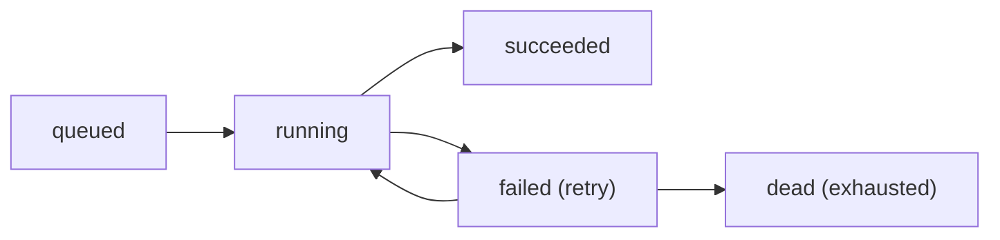
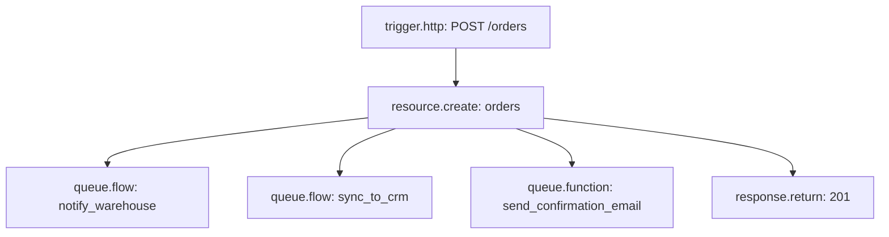

Queues move work off the request path. Instead of doing slow, retryable, or non-essential work synchronously — calling a payment provider, sending an email, updating a third-party system — you dispatch a job and let a worker process it asynchronously. The caller gets a fast response; the slow work happens in the background with its own retry budget.

Pawabase has one queue system shared by all background work: flow executions from events and schedules, function invocations, email delivery, and outbound webhook delivery all go through the same named queues. You can dispatch your own background jobs by calling `queue.flow` or `queue.function` from a flow.

## The platform queues

The worker listens on these queues by default:

| Queue | What runs on it |
| --- | --- |
| `events` | Event fan-out processing |
| `flows` | Flow runs triggered by events, schedules, and explicit dispatch |
| `functions` | Python function invocations |
| `webhooks` | Outbound webhook deliveries |
| `mail` | Email sends |
| `default` | Catch-all for miscellaneous background work |

You can add custom queue names with `PAWABASE_WORKER_QUEUES` (a comma-separated list). A custom queue is available to target with `queue.flow`'s `queue` field, letting you isolate long-running or low-priority work from latency-sensitive jobs.

## Dispatching jobs from a flow

Two blocks dispatch background jobs from a flow:

### `queue.flow` — dispatch another flow as a job

```json
{
  "id": "dispatch_export",
  "data": {
    "block": "queue.flow",
    "config": {
      "flow": "generate_monthly_report",
      "input": {
        "month": "{{ input.body.month }}",
        "account_id": "{{ auth.org }}"
      },
      "queue": "default",
      "delay": 0
    }
  }
}
```

| Field | Type | Required | Default | Description |
| --- | --- | --- | --- | --- |
| `flow` | string | Yes | — | The name of the flow to dispatch |
| `input` | JSON object | No | `{}` | The payload handed to the flow as `input` |
| `queue` | string | No | `"default"` | Which queue to place the job on |
| `delay` | integer (seconds) | No | `0` | How long to wait before the job becomes eligible for pickup |

The block's output is `{ "job_id": "<id>" }`. The job id can be used to track the job's status in Studio or through the Platform API. The dispatched flow starts running independently — the current flow does not wait.

### `queue.function` — dispatch a Python function as a job

```json
{
  "id": "sync_crm",
  "data": {
    "block": "queue.function",
    "config": {
      "function": "sync_customer_to_crm",
      "input": {
        "customer_id": "{{ steps.create_customer.output.id }}"
      },
      "queue": "default"
    }
  }
}
```

| Field | Type | Required | Default | Description |
| --- | --- | --- | --- | --- |
| `function` | string | Yes | — | The registered function name |
| `input` | JSON object | No | `{}` | The payload passed to the function |
| `queue` | string | No | `"default"` | Which queue to place the job on |
| `delay` | integer (seconds) | No | `0` | Delay before the job is eligible for pickup |

## Job lifecycle

Every dispatched job moves through these states:



| State | Meaning |
| --- | --- |
| `queued` | The job is waiting for a worker to pick it up |
| `running` | A worker is executing it |
| `succeeded` | The job finished without error |
| `failed` (with retries remaining) | The job raised an error; it will be retried |
| `dead` | All retry attempts exhausted; in the dead-letter queue |

## Retry policy

**By default, every job has `tries=1` — meaning no automatic retries.** A job that fails once is immediately dead-lettered.

This default is intentional. Automatic retries for arbitrary business logic can cause double-processing unless the handler is idempotent. Since idempotency is not always guaranteed, the default is to fail fast and let a human or an explicit `control.retry` block decide whether retry is appropriate.

If you want a flow to retry on worker-level failure (the worker crashes, a transient network error), configure retries explicitly at the dispatch site or use `control.retry` blocks inside the flow:

```json
{
  "id": "dispatch_with_retries",
  "data": {
    "block": "queue.flow",
    "config": {
      "flow": "send_payment_receipt",
      "input": { "order_id": "{{ input.event.payload.record.id }}" }
    }
  }
}
```

Within the `send_payment_receipt` flow, wrap the email step in a `control.retry` block:

```json
{
  "id": "retry_send",
  "data": {
    "block": "control.retry",
    "config": { "attempts": 3, "base_delay": 2 }
  }
}
```

This gives you retry behavior with explicit backoff, without risking unintended double-processing of the whole flow.

## Concurrency

The worker processes jobs concurrently up to `PAWABASE_WORKER_CONCURRENCY` (default: `4`). All queues share this concurrency pool — a large batch of email jobs will consume capacity that might otherwise be available for `flows` queue jobs. Use separate workers or dedicated queues to isolate high-priority work.

A single named queue processes its jobs in arrival order (FIFO). There is no priority within a queue — if you need priority, use separate queues (`queue: "high"` and `queue: "default"`) and size your worker capacity accordingly.

## Dead-letter queue

When a job exhausts its retry attempts (or fails with `tries=1`), it moves to the dead-letter queue. Dead-lettered jobs are visible in **Studio → Operate → Failed jobs**. For each failed job you can:

- See the full error message and stack trace.
- See the original input payload.
- See how many attempts were made.
- Re-run the job with its original input.
- Discard it.

A re-run creates a new job with the same input on the same queue with the same retry budget as the original configuration. It is not automatically idempotent — if the original job partially succeeded, re-running it may duplicate side effects.

## Delayed jobs

Both `queue.flow` and `queue.function` support a `delay` field in seconds. A delayed job sits in the queue but isn't eligible for pickup until the delay has elapsed:

```json
{
  "flow": "send_trial_reminder",
  "input": { "account_id": "{{ steps.create_account.output.id }}" },
  "delay": 259200
}
```

This schedules a trial-reminder email three days (259,200 seconds) from now. The delay is relative to when the job is dispatched, not to a specific time. For calendar-based scheduling ("run at 9am next Monday"), use the [scheduler](/jobs/schedules) instead.

<Warning>
Delayed jobs are stored in Redis with an expiry. If Redis is restarted without persistence enabled, delayed jobs may be lost. For critical delayed work, use the scheduler, which is backed by the platform database, not only Redis.
</Warning>

## Monitoring queue health

Studio's **Operate → Observability** view shows:

- Queue depths (how many jobs are waiting) per queue.
- Worker in-flight jobs (how many are currently running).
- Job throughput rates.
- Failed job counts per queue.

Watch queue depth as a leading indicator of problems: a growing depth means jobs are arriving faster than workers can process them, which usually means either a processing error causing retries, a dependency that's slow or unavailable, or insufficient worker concurrency.

## Production patterns

### Offloading slow dependencies

When a flow must call a slow or unreliable external API (a warehouse, a CRM, an analytics platform), do the fast essential work synchronously and dispatch everything else:



All three dispatches happen before the response, but they don't block it — `queue.flow` and `queue.function` return as soon as the job is enqueued, not when it finishes.

### Processing a large list item-by-item in the background

Rather than looping through 1,000 records in one flow (which would time out), dispatch one job per batch:

```json
{
  "id": "chunk_and_dispatch",
  "data": {
    "block": "control.foreach",
    "config": { "items": "{{ steps.batch_records.output }}" }
  }
}
```

Inside each iteration:

```json
{
  "id": "dispatch_batch",
  "data": {
    "block": "queue.flow",
    "config": {
      "flow": "process_batch",
      "input": { "records": "{{ item }}" },
      "queue": "bulk"
    }
  }
}
```

Using a dedicated `bulk` queue keeps bulk processing from crowding out the `default` queue.

### Idempotent job handlers

When a job may be delivered more than once (retries, manual re-runs), guard the expensive side effects:

```json
{
  "id": "dedup_check",
  "data": {
    "block": "cache.get",
    "config": { "key": "job_done:{{ input.order_id }}" }
  }
}
```

Check the cache first. If it's a hit, stop. If it's a miss, do the work, then set the cache key.

## Troubleshooting

<AccordionGroup>
  <Accordion title="A job dispatched with queue.flow never runs">
    Check: (1) the worker process is running; (2) the queue name matches a queue the worker listens on; (3) the flow exists and is enabled. A job on a queue no worker is listening to simply stays in the queue indefinitely.
  </Accordion>
  <Accordion title="A job fails immediately with no retries">
    By default, `tries=1` — one attempt, then dead-lettered. Add a `control.retry` block inside the flow if you want retry behavior within the flow's own logic.
  </Accordion>
  <Accordion title="A delayed job didn't run at the expected time">
    Delays are implemented with Redis key expiry. If Redis was unavailable when the delay expired, the job may have been dropped. For reliable time-based scheduling, use the scheduler instead of a delayed job.
  </Accordion>
  <Accordion title="Re-running a dead-lettered job causes duplicate side effects">
    The re-run uses the original input — it doesn't know what the original attempt did before failing. Add idempotency checks inside the flow to detect and skip already-completed work before re-running.
  </Accordion>
</AccordionGroup>

<CardGroup cols={2}>
  <Card title="Schedules" icon="clock" href="/jobs/schedules">Recurring and one-off scheduled work.</Card>
  <Card title="Failed jobs" icon="alert-circle" href="/operate/jobs-and-failures">Inspecting and re-running failed jobs in Studio.</Card>
</CardGroup>
