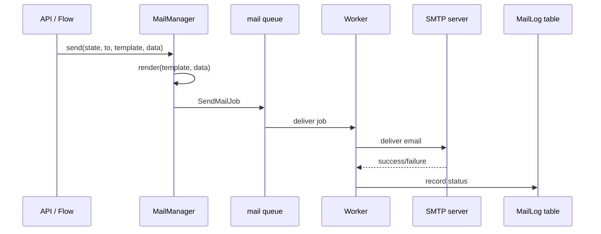

Pawabase provides a complete outbound email system built on Sillo's mail client. Every environment can configure its own SMTP service, and messages are sent asynchronously as background jobs so SMTP latency never blocks a request.

<CardGroup cols={3}>
  <Card title="Send mail" icon="paper-plane">Send email via `platform.mail.send()` or flow blocks.</Card>
  <Card title="Templates" icon="file-code">Jinja2 templates written in Studio, rendered in a sandbox.</Card>
  <Card title="Delivery tracking" icon="chart-line">Every message is logged in `MailLog` with delivery status.</Card>
</CardGroup>

## How mail works

The mail system is built around the `MailManager`, which is bound to the `Platform` object and available throughout the API process. When you send mail, the manager:

1. **Resolves the environment's mail config** — reads `infra.mail` settings from the environment's configuration, including SMTP host, port, credentials, and sender address.
2. **Renders the template** (if a template name is provided) — uses Jinja2's `SandboxedEnvironment` so templates written in Studio cannot access Python internals.
3. **Queues the send** — dispatches a `SendMailJob` onto the `mail` queue, so the SMTP call happens asynchronously.
4. **Logs the result** — records a `MailLog` row with the delivery status (`sent`, `failed`, or `suppressed`).



## Sending mail programmatically

From Python code (a function, a scheduled job, or an event handler), send mail using the platform's mail manager:

```python
await platform.mail.send(
    state,
    to=["student@example.com"],
    subject="Report card ready",
    template="report-card",
    data={"student_name": "Ada", "grade": "A"},
    source="flow",
)
```

The `send` method accepts either raw text/HTML or a template name with data. When a template is provided, it is rendered through Jinja2 before the email is sent. The `state` parameter provides the project and environment context, which determines which SMTP configuration is used.

## Sending mail from flows

Flows can send email using the `mail.send` block:

```json
{
  "id": "send-report",
  "data": {
    "block": "mail.send",
    "config": {
      "to": "{{ steps.get_student.output.email }}",
      "template": "report-card",
      "data": { "student_id": "{{ steps.get_student.output.id }}" }
    }
  }
}
```

The `mail.send` block queues a `SendMailJob` onto the `mail` queue. The job is retried up to 3 times with a 5-second backoff if the SMTP server is temporarily unavailable.

## Suppressed sending

If an environment has no SMTP configuration (no `host` set in `infra.mail`), messages are **suppressed** — they are logged but not actually sent. This is useful for development, where you want to verify mail logic without setting up an SMTP server.

When suppressed, the `MailLog` record has `status: "suppressed"` and `result.provider_response.suppressed` is `true`. Studio shows what would have been sent, so you can preview emails without a mail server.

To enable suppression in a production-like environment, set `suppress: true` in the `infra.mail` configuration.

## Mail delivery lifecycle

A mail message goes through these stages from send to delivery:

1. **Queued** — `SendMailJob` is pushed to the `mail` queue
2. **Active** — a worker picks up the job and begins execution
3. **Sent** — the SMTP server accepts the message; `MailLog.status` is set to `"sent"`
4. **Failed** — the SMTP server rejects the message or the connection fails; the job is retried
5. **Suppressed** — no SMTP is configured; the message is logged but not sent

After 3 retries, a failed job is recorded in the `FailedJobRecord` table and is visible in Studio's **Observability → Jobs and Failures**.

## Mail logging

Every mail message creates a `MailLog` record:

| Field | Description |
| --- | --- |
| `project` | The project reference |
| `env` | The environment name |
| `to` | Recipient email addresses |
| `subject` | The email subject |
| `template` | The template name (if used) |
| `status` | `sent`, `failed`, or `suppressed` |
| `message_id` | The provider's message ID |
| `error` | Error message if delivery failed |
| `source` | Where the send was triggered from |

Studio's **Observability → Mail** dashboard shows mail delivery metrics, recent sends, and failures.

<Warning>
Mail delivery is asynchronous. A flow that sends email continues immediately after the `mail.send` block executes — it does not wait for the email to be delivered. If you need to verify delivery before continuing, use a function call instead of a flow mail block.
</Warning>

## Mail manager internals

The `MailManager` is the central mail service, bound to the `Platform` object and available throughout the API process. It manages SMTP client connections, template rendering, and mail logging.

### Client management

The `MailManager` caches `MailClient` instances keyed by `(project_ref, env_name, config_hash)`. This means:

- Each environment gets its own SMTP client configuration
- Changing the mail configuration creates a new client (old clients are closed on `MailManager.close()`)
- The client is reused across requests within the same environment

```python
def client(self, state: EnvironmentState) -> MailClient:
    config = self._config(state)
    key = (state.project_ref, state.env_name, repr(sorted(vars(config).items())))
    client = self._clients.get(key)
    if client is None:
        client = self._clients[key] = MailClient(config)
    return client
```

### Template rendering

Templates are rendered in Jinja2's `SandboxedEnvironment` with `autoescape=True`. The rendering happens before the email is queued, so the rendered content is what gets sent.

```python
def render(self, state: EnvironmentState, template: str, data: Mapping[str, Any]) -> tuple[str, str | None, str | None]:
    stored = state.mail_templates.get(template)
    if stored is None:
        raise KeyError(f"no mail template {template!r}")
    subject = _jinja.from_string(stored.subject or "").render(**data)
    html = _jinja.from_string(stored.html).render(**data) if stored.html else None
    text = _jinja.from_string(stored.text).render(**data) if stored.text else None
    return subject, html, text
```

The `state.mail_templates` dictionary contains all mail templates for the environment, loaded from `MailTemplate` records. Template names are strings defined in Studio.

### Mail configuration resolution

The `MailManager._config()` method reads `infra.mail` settings from the environment and constructs a `MailConfig`:

```python
def _config(self, state: EnvironmentState) -> MailConfig:
    raw = {
        key: self.platform.resolve_value(state, value)
        for key, value in (state.infra.get("mail") or {}).items()
    }
    configured = bool(raw.get("host"))
    port = int(raw.get("port") or 587)
    use_ssl = bool(raw.get("use_ssl", port == 465))
    return MailConfig(
        smtp_host=raw.get("host") or "localhost",
        smtp_port=port,
        smtp_username=raw.get("username") or None,
        smtp_password=raw.get("password") or None,
        use_ssl=use_ssl,
        use_tls=bool(raw.get("use_tls", not use_ssl and port == 587)),
        default_from=raw.get("from") or f"no-reply@{state.project_ref}.pawabase.local",
        default_reply_to=raw.get("reply_to") or None,
        suppress_send=not configured or bool(raw.get("suppress")),
        template_directory=None,
    )
```

Key behavior: `suppress_send` is automatically `true` when no `host` is configured, meaning messages are logged but not sent. This makes development with no SMTP server completely seamless.

## Mail configuration in Studio

Mail settings are configured per environment in Studio's **Infrastructure** section. The `infra.mail` object supports these fields:

| Field | Required | Default | Description |
| --- | --- | --- | --- |
| `host` | No (disables sending) | — | SMTP server hostname |
| `port` | No | `587` | SMTP server port |
| `use_ssl` | No | Auto (true for 465) | Use SSL/TLS |
| `use_tls` | No | Auto (true for 587) | Use STARTTLS |
| `username` | No | — | SMTP authentication username |
| `password` | No | — | SMTP authentication password |
| `from` | No | `no-reply@{project}.pawabase.local` | Default sender address |
| `reply_to` | No | — | Default reply-to address |
| `suppress` | No | `false` | Suppress sending (log only) |

The `password` field can use `secret://NAME` references, which the platform resolves automatically before connecting to the SMTP server.

## Mail debugging

When mail isn't working as expected, check these things:

1. **Is `infra.mail.host` configured?** — If not, all messages are suppressed. Check the `MailLog` for `status: "suppressed"`.
2. **Are credentials correct?** — The `password` field can reference a `secret://NAME`. Verify the secret exists and is resolved correctly.
3. **Is the SMTP server reachable?** — Failed deliveries will show `status: "failed"` in `MailLog` with an error message.
4. **Is the template name correct?** — `MailManager.render()` raises `KeyError` if the template doesn't exist in `state.mail_templates`.
5. **Are there enough queue workers?** — Mail jobs are queued on the `mail` queue. If all workers are busy, emails are delayed.

## Mail and flows

Flows can integrate mail into any workflow:

```json
{
  "id": "registration-flow",
  "nodes": [
    {
      "id": "signup",
      "data": { "block": "auth.signup", "config": { "email": "{{ body.email }}" } }
    },
    {
      "id": "send-welcome",
      "data": {
        "block": "mail.send",
        "config": {
          "to": "{{ steps.signup.output.email }}",
          "template": "welcome-email",
          "data": { "name": "{{ steps.signup.output.display_name }}" }
        }
      }
    },
    {
      "id": "notify-admin",
      "data": {
        "block": "mail.send",
        "config": {
          "to": "admin@example.com",
          "subject": "New user registered",
          "text": "A new user has signed up: {{ steps.signup.output.email }}"
        }
      }
    }
  ]
}
```

The `mail.send` block queues a `SendMailJob` asynchronously. The flow continues immediately after the block completes — it does not wait for the email to be sent.

## Mail and functions

Python functions can also send mail using the platform's mail manager:

```python
from app.platform import get_platform

async def send_notification(ctx, to, subject, template, data):
    platform = get_platform()
    state = await platform.state(ctx.project, ctx.env)
    result = await platform.mail.send(
        state, to=to, subject=subject, template=template, data=data
    )
    return {"message_id": result["message_id"], "suppressed": result["suppressed"]}
```

## Next

<CardGroup cols={2}>
  <Card title="Templates" icon="file-code" href="/mail/templates">How to create and manage mail templates.</Card>
  <Card title="Jobs & queues" icon="clock" href="/jobs/queues">How the mail queue works.</Card>
</CardGroup>

## Summary

Pawabase's mail system provides a complete, asynchronous email solution built on Sillo's mail client. With per-environment SMTP configuration, Jinja2 template rendering in a sandbox, background job processing, and full delivery tracking via `MailLog`, you can send transactional and notification emails with confidence. Development works without an SMTP server thanks to the `suppress_send` feature, and production deployments are fully monitored through Studio's observability dashboards.
