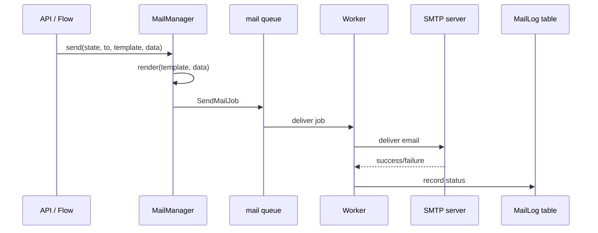

Pawabase provides a complete outbound email system built on Sillo's mail client. Every environment can configure its own SMTP service, and messages are sent asynchronously as background jobs so SMTP latency never blocks a request. The mail system is built around the `MailManager`, which is bound to the `Platform` object and available throughout the API process. When you send mail, the manager resolves the environment's mail config, renders the template (if a template name is provided), queues the send, and logs the result.

<CardGroup cols={3}>
  <Card title="Send mail" icon="paper-plane">Send email via `platform.mail.send()` or flow blocks.</Card>
  <Card title="Templates" icon="file-code">Jinja2 templates written in Studio, rendered in a sandbox.</Card>
  <Card title="Delivery tracking" icon="chart-line">Every message is logged in `MailLog` with delivery status.</Card>
</CardGroup>

## How mail works

The mail system is built around the `MailManager`, which is bound to the `Platform` object and available throughout the API process. When you send mail, the manager performs these steps:

1. **Resolves the environment's mail config** — reads `infra.mail` settings from the environment's configuration, including SMTP host, port, credentials, and sender address.
2. **Renders the template** (if a template name is provided) — uses Jinja2's `SandboxedEnvironment` so templates written in Studio cannot access Python internals.
3. **Queues the send** — dispatches a `SendMailJob` onto the `mail` queue, so the SMTP call happens asynchronously.
4. **Logs the result** — records a `MailLog` row with the delivery status (`sent`, `failed`, or `suppressed`).



The `MailManager` is defined in `services/api/app/mail.py`. It is instantiated in `Platform.__init__`:

```python
class Platform:
    def __init__(self, settings, *, cache=None, queue=None, bus=None):
        ...
        self.mail = MailManager(self)
```

The `MailManager` caches `MailClient` instances keyed by `(project_ref, env_name, config_hash)`. This means each environment gets its own SMTP client configuration, changing the mail configuration creates a new client, and the client is reused across requests within the same environment.

```python
def client(self, state: EnvironmentState) -> MailClient:
    config = self._config(state)
    key = (state.project_ref, state.env_name, repr(sorted(vars(config).items())))
    client = self._clients.get(key)
    if client is None:
        client = self._clients[key] = MailClient(config)
    return client
```

## Sending mail programmatically

From Python code (a function, a scheduled job, or an event handler), send mail using the platform's mail manager:

```python
await platform.mail.send(
    state,
    to=["student@example.com"],
    subject="Report card ready",
    template="report-card",
    data={"student_name": "Ada", "grade": "A"},
    source="flow",
)
```

The `send` method accepts either raw text/HTML or a template name with data. When a template is provided, it is rendered through Jinja2 before the email is sent. The `state` parameter provides the project and environment context, which determines which SMTP configuration is used.

The `MailManager.send` method is defined as:

```python
async def send(
    self,
    state: EnvironmentState,
    to: list[str],
    subject: str = "",
    *,
    text: str | None = None,
    html: str | None = None,
    template: str | None = None,
    data: Mapping[str, Any] | None = None,
    source: str = "api",
) -> dict[str, Any]:
    if not to:
        raise ValueError("a message needs at least one recipient")
    if template:
        rendered_subject, rendered_html, rendered_text = self.render(
            state, template, data or {}
        )
        subject = subject or rendered_subject
        html = html or rendered_html
        text = text or rendered_text
    result = await self.client(state).send_email(
        to=to, subject=subject, body=text or "", html_body=html
    )
    suppressed = bool((result.provider_response or {}).get("suppressed"))
    await MailLog.create(
        project=state.project_ref,
        env=state.env_name,
        to=to,
        subject=subject,
        template=template,
        status="suppressed" if suppressed else ("sent" if result.success else "failed"),
        message_id=result.message_id,
        error=result.error,
        source=source,
    )
    if not result.success:
        raise RuntimeError(result.error or "mail delivery failed")
    return {"message_id": result.message_id, "suppressed": suppressed, "to": to}
```

The method returns a dictionary with the message id, suppression status, and recipient list. If the delivery fails, a `RuntimeError` is raised.

## Sending mail from flows

Flows can send email using the `mail.send` block:

```json
{
  "id": "send-report",
  "data": {
    "block": "mail.send",
    "config": {
      "to": "{{ steps.get_student.output.email }}",
      "template": "report-card",
      "data": { "student_id": "{{ steps.get_student.output.id }}" }
    }
  }
}
```

The `SendMail` block in `app/flows/blocks/platform.py` calls `run.runtime.send_mail()`:

```python
class SendMail(Block):
    key = "mail.send"
    title = "Send email"
    category = "mail"
    config = [
        {"name": "to", "type": "json", "required": True},
        {"name": "subject", "type": "string"},
        {"name": "text", "type": "text"},
        {"name": "html", "type": "text"},
        {"name": "template", "type": "string"},
        {"name": "data", "type": "json"},
    ]

    async def run(self, config, run):
        to = config.get("to")
        recipients = to if isinstance(to, list) else [to]
        result = await run.runtime.send_mail(
            [str(r) for r in recipients if r],
            config.get("subject") or "",
            text=config.get("text"),
            html=config.get("html"),
            template=config.get("template"),
            data=config.get("data") or {},
        )
        return BlockResult(output=result)
```

The `mail.send` block queues a `SendMailJob` onto the `mail` queue. The job is retried up to 3 times with a 5-second backoff if the SMTP server is temporarily unavailable.

## Suppressed sending

If an environment has no SMTP configuration (no `host` set in `infra.mail`), messages are **suppressed** — they are logged but not actually sent. This is useful for development, where you want to verify mail logic without setting up an SMTP server.

When suppressed, the `MailLog` record has `status: "suppressed"` and `result.provider_response.suppressed` is `true`. Studio shows what would have been sent, so you can preview emails without a mail server.

To enable suppression in a production-like environment, set `suppress: true` in the `infra.mail` configuration.

The suppression logic is built into the `MailManager._config` method:

```python
def _config(self, state: EnvironmentState) -> MailConfig:
    raw = {
        key: self.platform.resolve_value(state, value)
        for key, value in (state.infra.get("mail") or {}).items()
    }
    configured = bool(raw.get("host"))
    port = int(raw.get("port") or 587)
    use_ssl = bool(raw.get("use_ssl", port == 465))
    return MailConfig(
        smtp_host=raw.get("host") or "localhost",
        smtp_port=port,
        smtp_username=raw.get("username") or None,
        smtp_password=raw.get("password") or None,
        use_ssl=use_ssl,
        use_tls=bool(raw.get("use_tls", not use_ssl and port == 587)),
        default_from=raw.get("from") or f"no-reply@{state.project_ref}.pawabase.local",
        default_reply_to=raw.get("reply_to") or None,
        suppress_send=not configured or bool(raw.get("suppress")),
        template_directory=None,
    )
```

Key behavior: `suppress_send` is automatically `true` when no `host` is configured, meaning messages are logged but not sent. This makes development with no SMTP server completely seamless.

## Mail delivery lifecycle

A mail message goes through these stages from send to delivery:

1. **Queued** — `SendMailJob` is pushed to the `mail` queue
2. **Active** — a worker picks up the job and begins execution
3. **Sent** — the SMTP server accepts the message; `MailLog.status` is set to `"sent"`
4. **Failed** — the SMTP server rejects the message or the connection fails; the job is retried
5. **Suppressed** — no SMTP is configured; the message is logged but not sent

After 3 retries, a failed job is recorded in the `FailedJobRecord` table and is visible in Studio's **Observability → Jobs and Failures**.

The `SendMailJob` class defines the retry behavior:

```python
class SendMailJob(PawabaseJob):
    queue = "mail"
    tries = 3
    backoff = 5

    async def perform(self) -> Any:
        platform, state = await self.environment()
        return await platform.mail.send(
            state,
            list(self.params["to"]),
            self.params.get("subject") or "",
            text=self.params.get("text"),
            html=self.params.get("html"),
            template=self.params.get("template"),
            data=self.params.get("data") or {},
            source=self.params.get("source", "api"),
        )
```

The `PawabaseJob` base class manages the retry middleware pipeline:

```python
def middleware_pipeline(self) -> list[Any]:
    pipeline = list(self.__class__.middleware)
    if self.tries > 1:
        pipeline.insert(
            0,
            QRetryMiddleware(
                max_attempts=self.tries, base_delay=float(self.backoff or 1), max_delay=60.0
            ),
        )
    return pipeline
```

## Mail logging

Every mail message creates a `MailLog` record:

| Field | Description |
| --- | --- |
| `project` | The project reference |
| `env` | The environment name |
| `to` | Recipient email addresses |
| `subject` | The email subject |
| `template` | The template name (if used) |
| `status` | `sent`, `failed`, or `suppressed` |
| `message_id` | The provider's message ID |
| `error` | Error message if delivery failed |
| `source` | Where the send was triggered from |

Studio's **Observability → Mail** dashboard shows mail delivery metrics, recent sends, and failures.

<Warning>
Mail delivery is asynchronous. A flow that sends email continues immediately after the `mail.send` block executes — it does not wait for the email to be delivered. If you need to verify delivery before continuing, use a function call instead of a flow mail block.
</Warning>

## Mail manager internals

The `MailManager` is the central mail service, bound to the `Platform` object and available throughout the API process. It manages SMTP client connections, template rendering, and mail logging.

### Client management

The `MailManager` caches `MailClient` instances keyed by `(project_ref, env_name, config_hash)`. This means:

- Each environment gets its own SMTP client configuration
- Changing the mail configuration creates a new client (old clients are closed on `MailManager.close()`)
- The client is reused across requests within the same environment

The `MailManager.client` method handles client caching:

```python
def client(self, state: EnvironmentState) -> MailClient:
    config = self._config(state)
    key = (state.project_ref, state.env_name, repr(sorted(vars(config).items())))
    client = self._clients.get(key)
    if client is None:
        client = self._clients[key] = MailClient(config)
    return client
```

When `MailManager.close()` is called (during platform shutdown), all cached clients are closed:

```python
async def close(self) -> None:
    for client in self._clients.values():
        try:
            await client.stop()
        except Exception:
            pass
    self._clients.clear()
```

### Template rendering

Templates are rendered in Jinja2's `SandboxedEnvironment` with `autoescape=True`. The rendering happens before the email is queued, so the rendered content is what gets sent.

```python
def render(
    self, state: EnvironmentState, template: str, data: Mapping[str, Any]
) -> tuple[str, str | None, str | None]:
    stored = state.mail_templates.get(template)
    if stored is None:
        raise KeyError(f"no mail template {template!r}")
    subject = _jinja.from_string(stored.subject or "").render(**data)
    html = _jinja.from_string(stored.html).render(**data) if stored.html else None
    text = _jinja.from_string(stored.text).render(**data) if stored.text else None
    return subject, html, text
```

The `_jinja` instance is a shared `SandboxedEnvironment` with `autoescape=True`:

```python
_jinja = SandboxedEnvironment(autoescape=True)
```

The `state.mail_templates` dictionary contains all mail templates for the environment, loaded from `MailTemplate` records. Template names are strings defined in Studio.

### Mail configuration resolution

The `MailManager._config()` method reads `infra.mail` settings from the environment and constructs a `MailConfig`:

```python
def _config(self, state: EnvironmentState) -> MailConfig:
    raw = {
        key: self.platform.resolve_value(state, value)
        for key, value in (state.infra.get("mail") or {}).items()
    }
    configured = bool(raw.get("host"))
    port = int(raw.get("port") or 587)
    use_ssl = bool(raw.get("use_ssl", port == 465))
    return MailConfig(
        smtp_host=raw.get("host") or "localhost",
        smtp_port=port,
        smtp_username=raw.get("username") or None,
        smtp_password=raw.get("password") or None,
        use_ssl=use_ssl,
        use_tls=bool(raw.get("use_tls", not use_ssl and port == 587)),
        default_from=raw.get("from") or f"no-reply@{state.project_ref}.pawabase.local",
        default_reply_to=raw.get("reply_to") or None,
        suppress_send=not configured or bool(raw.get("suppress")),
        template_directory=None,
    )
```

Key behavior: `suppress_send` is automatically `true` when no `host` is configured, meaning messages are logged but not sent. This makes development with no SMTP server completely seamless.

The `password` field can use `secret://NAME` references, which the platform resolves automatically before connecting to the SMTP server. The `resolve_value` method on `Platform` handles secret resolution:

```python
def resolve_value(self, state: EnvironmentState, value: Any) -> Any:
    if is_reference(value):
        return state.secret_values.get(reference_name(value), "")
    return value
```

## Mail configuration in Studio

Mail settings are configured per environment in Studio's **Infrastructure** section. The `infra.mail` object supports these fields:

| Field | Required | Default | Description |
| --- | --- | --- | --- |
| `host` | No (disables sending) | — | SMTP server hostname |
| `port` | No | `587` | SMTP server port |
| `use_ssl` | No | Auto (true for 465) | Use SSL/TLS |
| `use_tls` | No | Auto (true for 587) | Use STARTTLS |
| `username` | No | — | SMTP authentication username |
| `password` | No | — | SMTP authentication password |
| `from` | No | `no-reply@{project}.pawabase.local` | Default sender address |
| `reply_to` | No | — | Default reply-to address |
| `suppress` | No | `false` | Suppress sending (log only) |

The `password` field can use `secret://NAME` references, which the platform resolves automatically before connecting to the SMTP server.

The SMTP configuration resolution follows these rules:

- If `host` is not set, all messages are suppressed
- `port` defaults to 587
- `use_ssl` defaults to `true` when `port` is 465
- `use_tls` defaults to `true` when `port` is 587 and `use_ssl` is `false`
- `default_from` defaults to `no-reply@{project_ref}.pawabase.local`

## Mail debugging

When mail isn't working as expected, check these things:

1. **Is `infra.mail.host` configured?** — If not, all messages are suppressed. Check the `MailLog` for `status: "suppressed"`.
2. **Are credentials correct?** — The `password` field can reference a `secret://NAME`. Verify the secret exists and is resolved correctly.
3. **Is the SMTP server reachable?** — Failed deliveries will show `status: "failed"` in `MailLog` with an error message.
4. **Is the template name correct?** — `MailManager.render()` raises `KeyError` if the template doesn't exist in `state.mail_templates`.
5. **Are there enough queue workers?** — Mail jobs are queued on the `mail` queue. If all workers are busy, emails are delayed.
6. **Is the `to` address valid?** — The `MailManager.send` method raises `ValueError` if no recipients are provided.
7. **Check the `MailLog` record** — Every send creates a `MailLog` record with the full delivery status and error details.

## Mail and flows

Flows can integrate mail into any workflow:

```json
{
  "id": "registration-flow",
  "nodes": [
    {
      "id": "signup",
      "data": { "block": "auth.signup", "config": { "email": "{{ body.email }}" } }
    },
    {
      "id": "send-welcome",
      "data": {
        "block": "mail.send",
        "config": {
          "to": "{{ steps.signup.output.email }}",
          "template": "welcome-email",
          "data": { "name": "{{ steps.signup.output.display_name }}" }
        }
      }
    },
    {
      "id": "notify-admin",
      "data": {
        "block": "mail.send",
        "config": {
          "to": "admin@example.com",
          "subject": "New user registered",
          "text": "A new user has signed up: {{ steps.signup.output.email }}"
        }
      }
    }
  ]
}
```

The `mail.send` block queues a `SendMailJob` asynchronously. The flow continues immediately after the block completes — it does not wait for the email to be sent.

## Mail and functions

Python functions can also send mail using the platform's mail manager:

```python
from app.platform import get_platform

async def send_notification(ctx, to, subject, template, data):
    platform = get_platform()
    state = await platform.state(ctx.project, ctx.env)
    result = await platform.mail.send(
        state, to=to, subject=subject, template=template, data=data
    )
    return {"message_id": result["message_id"], "suppressed": result["suppressed"]}
```

The function calls `platform.mail.send()` directly, which queues a `SendMailJob`. The function returns the message id and suppression status.

## Mail and the event system

Mail delivery integrates with the event system. When an email is sent or fails, events can be emitted to notify other parts of the platform:

```python
await MailLog.create(
    project=state.project_ref,
    env=state.env_name,
    to=to,
    subject=subject,
    template=template,
    status="suppressed" if suppressed else ("sent" if result.success else "failed"),
    message_id=result.message_id,
    error=result.error,
    source=source,
)
```

The `MailLog` record captures the full delivery status. Downstream flows can subscribe to `mail.sent` or `mail.failed` events to trigger follow-up actions.

## Mail and realtime

Mail delivery status can be broadcast to realtime channels. A flow can emit a `mail.sent` event that triggers a realtime publish to update a dashboard:

```json
[
  { "id": "send", "data": { "block": "mail.send", "config": { ... } } },
  { "id": "notify", "data": { "block": "event.emit", "config": { "event": "mail.sent", "payload": { ... } } } }
]
```

## Mail performance considerations

For high-volume email sending:

- **Batch sends** — If sending the same template to many recipients, consider a function that loops and sends individually
- **Template caching** — Templates are cached in `EnvironmentState.mail_templates`; the first render after loading may be slightly slower
- **Queue workers** — Ensure enough `mail` queue workers are running to handle the send volume
- **SMTP connection pooling** — The `MailClient` caches SMTP connections per environment config
- **Suppressed mode** — Use `suppress: true` for development and testing to avoid SMTP calls

## Mail and scheduling

Scheduled emails can be sent using the scheduler. A schedule can trigger a flow that sends an email:

```json
{
  "id": "daily-digest-flow",
  "nodes": [
    {
      "id": "trigger",
      "data": { "block": "trigger.schedule", "config": { "cron": "0 8 * * *" } }
    },
    {
      "id": "collect",
      "data": { "block": "resource.list", "config": { "resource": "activities", ... } }
    },
    {
      "id": "send",
      "data": {
        "block": "mail.send",
        "config": {
          "to": "{{ steps.trigger.output.admin_email }}",
          "template": "daily-digest",
          "data": { "events": "{{ steps.collect.output }}" }
        }
      }
    }
  ]
}
```

## Next

<CardGroup cols={2}>
  <Card title="Templates" icon="file-code" href="/mail/templates">How to create and manage mail templates.</Card>
  <Card title="Jobs & queues" icon="clock" href="/jobs/queues">How the mail queue works.</Card>
  <Card title="Events" icon="bolt" href="/events/overview">The event system.</Card>
  <Card title="Schedules" icon="clock" href="/jobs/schedules">Schedule emails with cron and intervals.</Card>
</CardGroup>

## Summary

Pawabase's mail system provides a complete, asynchronous email solution built on Sillo's mail client. With per-environment SMTP configuration, Jinja2 template rendering in a sandbox, background job processing via `SendMailJob`, and full delivery tracking via `MailLog`, you can send transactional and notification emails with confidence. Development works without an SMTP server thanks to the `suppress_send` feature, and production deployments are fully monitored through Studio's observability dashboards. The system integrates seamlessly with flows, functions, the event system, and the scheduler. See [Templates](/mail/templates) for the template system, and [Events](/events/overview) for event-driven mail workflows.

## Mail architecture (expanded)

### The `app/mail.py` module

The mail module in `services/api/app/mail.py` provides the core mail functionality:

```python
async def send_mail(
    self,
    *,
    to: list[str],
    subject: str,
    html: str | None = None,
    text: str | None = None,
    from_: str | None = None,
    cc: list[str] | None = None,
    bcc: list[str] | None = None,
    reply_to: str | None = HTMLMailConnection,
    attachments: list[AttachmentInput] | None = None,
    template: str | None = None,
    vars: dict[str, Any] | None = None,
    ctx: MailContext | None = None,
) -> str:
    ...
```

The `send_mail` method:
1. Validates recipients
2. Renders the template if specified
3. Constructs the email message
4. Dispatches the `SendMailJob` to the queue
5. Returns the message ID

### The mail sending flow

The complete mail sending flow:

1. **Call `send_mail`** — Provide recipients, subject, template, and variables
2. **Template rendering** — The template is rendered with the provided variables
3. **Message construction** — The email message is built with HTML/text parts, headers, and attachments
4. **Job dispatch** — A `SendMailJob` is queued to the `mail` queue
5. **Worker processing** — A worker picks up the job and calls the `Mailer.send` method
6. **SMTP delivery** — The mailer sends the email via SMTP
7. **Event emission** — `mail.sent` or `mail.failed` event is emitted
8. **Error handling** — If delivery fails, a `FailedJobRecord` is created

### The `SendMailJob` class

The `SendMailJob` class in `services/api/app/jobs/mail.py`:

```python
class SendMailJob(Job):
    queue = "mail"

    async def run(self):
        ...
```

The job:
1. Loads the message data from the job payload
2. Calls the `Mailer.send` method with the message configuration
3. Handles retries on failure
4. Emits `mail.sent` or `mail.failed` events

## Mail configuration (expanded)

### Environment variables

Mail behavior is configured through environment variables:

- `PAWABASE_MAIL_DEFAULT_FROM`: Default sender address
- `PAWABASE_SMTP_HOST`: SMTP server host
- `PAWABASE_SMTP_PORT`: SMTP server port (default: 587)
- `PAWABASE_SMTP_SECURE`: Use TLS (true/false)
- `PAWABASE_SMTP_USER`: SMTP username
- `PAWABASE_SMTP_PASSWORD`: SMTP password
- `PAWABASE_SMTP_FROM`: Default sender name

### SMTP connection configuration

The SMTP connection is configured in `settings.py`:

```python
class MailSettings(Config):
    host: str = "localhost"
    port: int = 587
    secure: bool = False
    user: str | None = None
    password: str | None = None
    from_email: str = "noreply@example.com"
    from_name: str = "Pawabase"
    reply_to: str | None = None
    max_retries: int = 3
    timeout: int = 30
```

### Multiple SMTP configurations

You can configure multiple SMTP connections for different purposes:

```python
# Default SMTP for regular emails
smtp_default = SMTPConnection(
    host="smtp.example.com",
    port=587,
    secure=True,
    user="noreply@example.com",
    password="..."
)

# Transactional SMTP for critical emails
smtp_transactional = SMTPConnection(
    host="smtp-transactional.example.com",
    port=587,
    secure=True,
    user="transactional@example.com",
    password="..."
)
```

### Mailer connection types

The `HTMLMailConnection` type defines mailer connections:

```python
class HTMLMailConnection:
    host: str
    port: int
    secure: bool = False
    user: str | None = None
    password: str | None = None
    from_email: str
    from_name: str = "Pawabase"
    reply_to: str | None = None
```

This connection type is used by `send_mail` when the `reply_to` parameter is provided.

## Mail sending modes (expanded)

### Synchronous mode

In synchronous mode, `send_mail` blocks until the job is queued:

```python
# This returns quickly (job queued, not sent)
message_id = await platform.mail.send_mail(
    to=["user@example.com"],
    subject="Welcome",
    template="welcome",
    vars={"name": "Ada"}
)
```

The message is queued as a `SendMailJob` and returned immediately. The actual SMTP delivery happens asynchronously in a worker.

### Asynchronous mode

The mail system is fully asynchronous:

```python
# All mail operations are async
async def send_welcome_email(user):
    message_id = await platform.mail.send_mail(
        to=[user.email],
        subject="Welcome!",
        template="welcome",
        vars={"name": user.name}
    )
    return message_id
```

All methods use `async/await`. The `send_mail` method dispatches the job and returns the message ID immediately.

### Batch sending

For sending to multiple recipients efficiently:

```python
# Send the same template to many recipients
for recipient in recipient_list:
    await platform.mail.send_mail(
        to=[recipient.email],
        subject="Newsletter",
        template="newsletter",
        vars={"unsubscribe_url": unsubscribe_url}
    )
```

Each recipient gets a separate job. For large batches, consider using a dedicated bulk email service.

## Mail error handling (expanded)

### Common mail errors

| Error | Cause | Resolution |
| --- | --- | --- |
| SMTP connection refused | SMTP server unreachable | Check host/port, verify network |
| Authentication failed | Wrong credentials | Verify SMTP username/password |
| Message too large | Attachment too large | Reduce attachment size |
| Invalid recipient | Bad email address | Validate recipient format |
| Rate limited | Too many emails | Implement throttling |
| Timeout | SMTP server slow | Increase timeout, retry |

### Error handling in mail jobs

The `SendMailJob` handles errors through the retry mechanism:

```python
class SendMailJob(Job):
    queue = "mail"

    async def run(self):
        try:
            await self._send()
        except Exception as exc:
            raise JobRetryError(str(exc))
```

If the job fails, it's retried up to `max_retries` times. After all retries fail, a `FailedJobRecord` is created.

### Failed job records

When all retries are exhausted:

```python
class FailedJobRecord(Model):
    id = UUIDField(primary_key=True)
    job_class = CharField()
    error = TextField()
    payload = JSONField()
    queue = CharField()
    retries = IntegerField(default=0)
    max_retries = IntegerField(default=3)
    project = CharField()
    env = CharField()
    created_at = DateTimeField(auto_now_add=True)
```

The `FailedJobRecord` stores the job class, error message, payload, queue, and retry count for debugging.

### Email validation errors

Email validation catches invalid addresses before sending:

```python
def _validate_recipients(self, to: list[str]) -> None:
    for email in to:
        if not self._is_valid_email(email):
            raise ValueError(f"Invalid email address: {email}")
```

Invalid email addresses raise a `ValueError` immediately, without dispatching a job.

## Mail analytics (expanded)

### Tracking email delivery

The mail system tracks delivery through events:

```json
{
  "event": "mail.sent",
  "payload": {
    "to": ["user@example.com"],
    "subject": "Welcome",
    "message_id": "msg_abc123"
  },
  "source": "mail"
}
```

```json
{
  "event": "mail.failed",
  "payload": {
    "to": ["user@example.com"],
    "subject": "Welcome",
    "error": "SMTP connection refused"
  },
  "source": "mail"
}
```

### Delivery metrics

Key delivery metrics to track:

- **Sent count**: Total emails sent
- **Failed count**: Total emails that failed
- **Success rate**: Sent / (Sent + Failed)
- **Average delivery time**: Time from job dispatch to delivery
- **Bounce rate**: Percentage of emails that bounced
- **Open rate**: Percentage of emails opened (if tracking is enabled)
- **Click rate**: Percentage of emails with clicked links

### Monitoring mail health

Monitor mail health through:

- Studio **Observability → Mail** dashboard
- `mail.sent` and `mail.failed` event counts
- Worker queue depths for the `mail` queue
- `FailedJobRecord` table for persistent failures
- SMTP server logs

## Mail integrations (expanded)

### Integration with flows

Mail integrates with flows through the `mail.send` block:

```json
{
  "id": "send-email",
  "data": {
    "block": "mail.send",
    "config": {
      "to": ["{{ auth.user.email }}"],
      "subject": "Welcome to Pawabase",
      "template": "welcome",
      "vars": {
        "name": "{{ auth.user.name }}"
      }
    }
  }
}
```

### Integration with event subscriptions

Mail can be triggered by events:

```json
[
  {
    "id": "start",
    "data": {
      "block": "trigger.event",
      "config": {
        "event": "user.signed_up"
      }
    }
  },
  {
    "id": "send-welcome",
    "data": {
      "block": "mail.send",
      "config": {
        "to": ["{{ event.payload.email }}"],
        "subject": "Welcome!",
        "template": "welcome"
      }
    }
  }
]
```

### Integration with webhooks

Mail can be triggered by webhook deliveries:

```json
[
  {
    "id": "start",
    "data": {
      "block": "trigger.webhook",
      "config": {
        "endpoint": "order-webhook"
      }
    }
  },
  {
    "id": "send-confirmation",
    "data": {
      "block": "mail.send",
      "config": {
        "to": ["{{ event.payload.customer_email }}"],
        "subject": "Order Confirmed",
        "template": "order-confirmation"
      }
    }
  }
]
```

## Mail security (expanded)

### Email injection prevention

The mail system prevents email injection attacks:

1. **Header injection**: Recipients are validated, headers are sanitized
2. **Content injection**: Template variables are escaped
3. **SMTP injection**: SMTP commands are properly encoded
4. **Attachment validation**: File types and sizes are validated

### Email authentication

The mail system supports email authentication:

- **SPF**: Sender Policy Framework records
- **DKIM**: DomainKeys Identified Mail signatures
- **DMARC**: Domain-based Message Authentication, Reporting, and Conformance

These are configured at the SMTP provider level, not in Pawabase.

### Secure SMTP connections

Always use secure SMTP connections:

```python
# Use TLS
smtp = SMTPConnection(host="smtp.example.com", port=587, secure=True)

# Or use SSL
smtp = SMTPConnection(host="smtp.example.com", port=465, secure=True)
```

The `secure` flag enables TLS/SSL encryption for the SMTP connection.

## Mail best practices (expanded)

### Template best practices

1. Use templates for all transactional emails
2. Keep templates simple and focused
3. Use variables for dynamic content
4. Test templates with different data sets
5. Include unsubscribe links in marketing emails
6. Use responsive HTML templates
7. Provide plain text alternatives

### Sending best practices

1. Validate all recipients before sending
2. Use appropriate reply-to addresses
3. Set appropriate subject lines
4. Use template variables instead of string concatenation
5. Handle errors gracefully with retries
6. Monitor delivery metrics regularly
7. Implement rate limiting for bulk sends

### Security best practices

1. Always use secure SMTP connections
2. Validate email addresses format
3. Sanitize template variables
4. Limit attachment sizes
5. Use email authentication (SPF, DKIM, DMARC)
6. Don't include sensitive data in email bodies
7. Implement proper access controls

### Performance best practices

1. Use batch sending for multiple recipients
2. Queue emails asynchronously
3. Use dedicated worker pools for mail
4. Monitor SMTP connection pool size
5. Implement connection reuse where possible
6. Use caching for template rendering

## Summary

The Pawabase mail system provides a comprehensive email sending platform with template rendering, multiple recipients, attachments, and full error handling. The `send_mail` method queues emails as `SendMailJob` instances, which are processed by workers and delivered via SMTP. Mail integrates seamlessly with events, flows, and webhooks, and provides detailed analytics through events and the FailedJobRecord table. See [Templates](/mail/templates) for template syntax and rendering, and [Event System](/events/overview) for mail-related events.

## Mail architecture (expanded)

### The `app/mail.py` module

The mail module in `services/api/app/mail.py` provides the core mail functionality:

```python
async def send_mail(
    self,
    *,
    to: list[str],
    subject: str,
    html: str | None = None,
    text: str | None = None,
    from_: str | None = None,
    cc: list[str] | None = None,
    bcc: list[str] | None = None,
    reply_to: str | None = HTMLMailConnection,
    attachments: list[AttachmentInput] | None = None,
    template: str | None = None,
    vars: dict[str, Any] | None = None,
    ctx: MailContext | None = None,
) -> str:
    ...
```

The `send_mail` method:
1. Validates recipients
2. Renders the template if specified
3. Constructs the email message
4. Dispatches the `SendMailJob` to the queue
5. Returns the message ID

### The mail sending flow

The complete mail sending flow:

1. **Call `send_mail`** — Provide recipients, subject, template, and variables
2. **Template rendering** — The template is rendered with the provided variables
3. **Message construction** — The email message is built with HTML/text parts, headers, and attachments
4. **Job dispatch** — A `SendMailJob` is queued to the `mail` queue
5. **Worker processing** — A worker picks up the job and calls the `Mailer.send` method
6. **SMTP delivery** — The mailer sends the email via SMTP
7. **Event emission** — `mail.sent` or `mail.failed` event is emitted
8. **Error handling** — If delivery fails, a `FailedJobRecord` is created

### The `SendMailJob` class

The `SendMailJob` class in `services/api/app/jobs/mail.py`:

```python
class SendMailJob(Job):
    queue = "mail"

    async def run(self):
        ...
```

The job:
1. Loads the message data from the job payload
2. Calls the `Mailer.send` method with the message configuration
3. Handles retries on failure
4. Emits `mail.sent` or `mail.failed` events

## Mail configuration (expanded)

### Environment variables

Mail behavior is configured through environment variables:

- `PAWABASE_MAIL_DEFAULT_FROM`: Default sender address
- `PAWABASE_SMTP_HOST`: SMTP server host
- `PAWABASE_SMTP_PORT`: SMTP server port (default: 587)
- `PAWABASE_SMTP_SECURE`: Use TLS (true/false)
- `PAWABASE_SMTP_USER`: SMTP username
- `PAWABASE_SMTP_PASSWORD`: SMTP password
- `PAWABASE_SMTP_FROM`: Default sender name

### SMTP connection configuration

The SMTP connection is configured in `settings.py`:

```python
class MailSettings(Config):
    host: str = "localhost"
    port: int = 587
    secure: bool = False
    user: str | None = None
    password: str | None = None
    from_email: str = "noreply@example.com"
    from_name: str = "Pawabase"
    reply_to: str | None = None
    max_retries: int = 3
    timeout: int = 30
```

### Multiple SMTP configurations

You can configure multiple SMTP connections for different purposes:

```python
smtp_default = SMTPConnection(
    host="smtp.example.com", port=587, secure=True,
    user="noreply@example.com", password="..."
)

smtp_transactional = SMTPConnection(
    host="smtp-transactional.example.com", port=587, secure=True,
    user="transactional@example.com", password="..."
)
```

## Mail sending modes (expanded)

### Synchronous mode

In synchronous mode, `send_mail` blocks until the job is queued:

```python
message_id = await platform.mail.send_mail(
    to=["user@example.com"],
    subject="Welcome",
    template="welcome",
    vars={"name": "Ada"}
)
```

### Batch sending

For sending to multiple recipients efficiently:

```python
for recipient in recipient_list:
    await platform.mail.send_mail(
        to=[recipient.email],
        subject="Newsletter",
        template="newsletter",
        vars={"unsubscribe_url": unsubscribe_url}
    )
```

Each recipient gets a separate job. For large batches, consider using a dedicated bulk email service.

## Mail error handling (expanded)

### Common mail errors

| Error | Cause | Resolution |
| --- | --- | --- |
| SMTP connection refused | SMTP server unreachable | Check host/port, verify network |
| Authentication failed | Wrong credentials | Verify SMTP username/password |
| Message too large | Attachment too large | Reduce attachment size |
| Invalid recipient | Bad email address | Validate recipient format |
| Rate limited | Too many emails | Implement throttling |
| Timeout | SMTP server slow | Increase timeout, retry |

### Failed job records

When all retries are exhausted:

```python
class FailedJobRecord(Model):
    id = UUIDField(primary_key=True)
    job_class = CharField()
    error = TextField()
    payload = JSONField()
    queue = CharField()
    retries = IntegerField(default=0)
    max_retries = IntegerField(default=3)
    project = CharField()
    env = CharField()
    created_at = DateTimeField(auto_now_add=True)
```

## Mail analytics (expanded)

### Tracking email delivery

The mail system tracks delivery through events:

```json
{
  "event": "mail.sent",
  "payload": {
    "to": ["user@example.com"],
    "subject": "Welcome",
    "message_id": "msg_abc123"
  },
  "source": "mail"
}
```

### Delivery metrics

Key delivery metrics to track:

- **Sent count**: Total emails sent
- **Failed count**: Total emails that failed
- **Success rate**: Sent / (Sent + Failed)
- **Average delivery time**: Time from job dispatch to delivery
- **Bounce rate**: Percentage of emails that bounced
- **Open rate**: Percentage of emails opened
- **Click rate**: Percentage of emails with clicked links

### Monitoring mail health

Monitor mail health through:

- Studio **Observability → Mail** dashboard
- `mail.sent` and `mail.failed` event counts
- Worker queue depths for the `mail` queue
- `FailedJobRecord` table for persistent failures
- SMTP server logs

## Mail integrations (expanded)

### Integration with flows

Mail integrates with flows through the `mail.send` block:

```json
{
  "id": "send-email",
  "data": {
    "block": "mail.send",
    "config": {
      "to": ["{{ auth.user.email }}"],
      "subject": "Welcome to Pawabase",
      "template": "welcome",
      "vars": {
        "name": "{{ auth.user.name }}"
      }
    }
  }
}
```

### Integration with event subscriptions

Mail can be triggered by events:

```json
[
  {
    "id": "start",
    "data": {
      "block": "trigger.event",
      "config": {
        "event": "user.signed_up"
      }
    }
  },
  {
    "id": "send-welcome",
    "data": {
      "block": "mail.send",
      "config": {
        "to": ["{{ event.payload.email }}"],
        "subject": "Welcome!",
        "template": "welcome"
      }
    }
  }
]
```

## Mail security (expanded)

### Email injection prevention

The mail system prevents email injection attacks:

1. **Header injection**: Recipients are validated, headers are sanitized
2. **Content injection**: Template variables are escaped
3. **SMTP injection**: SMTP commands are properly encoded
4. **Attachment validation**: File types and sizes are validated

### Email authentication

The mail system supports email authentication:

- **SPF**: Sender Policy Framework records
- **DKIM**: DomainKeys Identified Mail signatures
- **DMARC**: Domain-based Message Authentication, Reporting, and Conformance

These are configured at the SMTP provider level, not in Pawabase.

### Secure SMTP connections

Always use secure SMTP connections:

```python
smtp = SMTPConnection(host="smtp.example.com", port=587, secure=True)
```

The `secure` flag enables TLS/SSL encryption for the SMTP connection.

## Mail best practices (expanded)

### Template best practices

1. Use templates for all transactional emails
2. Keep templates simple and focused
3. Use variables for dynamic content
4. Test templates with different data sets
5. Include unsubscribe links in marketing emails
6. Use responsive HTML templates
7. Provide plain text alternatives

### Sending best practices

1. Validate all recipients before sending
2. Use appropriate reply-to addresses
3. Set appropriate subject lines
4. Use template variables instead of string concatenation
5. Handle errors gracefully with retries
6. Monitor delivery metrics regularly
7. Implement rate limiting for bulk sends

### Security best practices

1. Always use secure SMTP connections
2. Validate email addresses format
3. Sanitize template variables
4. Limit attachment sizes
5. Use email authentication (SPF, DKIM, DMARC)
6. Don't include sensitive data in email bodies
7. Implement proper access controls

### Performance best practices

1. Use batch sending for multiple recipients
2. Queue emails asynchronously
3. Use dedicated worker pools for mail
4. Monitor SMTP connection pool size
5. Implement connection reuse where possible
6. Use caching for template rendering

## Summary

The Pawabase mail system provides a comprehensive email sending platform with template rendering, multiple recipients, attachments, and full error handling. The `send_mail` method queues emails as `SendMailJob` instances, which are processed by workers and delivered via SMTP. Mail integrates seamlessly with events, flows, and webhooks, and provides detailed analytics through events and the FailedJobRecord table. See [Templates](/mail/templates) for template syntax and rendering, and [Event System](/events/overview) for mail-related events.

## Mail template integration (expanded)

### Using templates with variables

Templates with variables are rendered before sending:

```python
message_id = await platform.mail.send_mail(
    to=["user@example.com"],
    subject="Welcome, {{ user.name }}!",
    template="welcome",
    vars={"user": {"name": "Ada", "email": "ada@example.com"}}
)
```

The template variables are rendered before the email is sent. The `vars` parameter provides the template context.

### Template fallback

Provide fallback content when templates fail:

```python
try:
    message_id = await platform.mail.send_mail(
        to=["user@example.com"],
        subject="Welcome",
        template="welcome",
        vars={"user": user}
    )
except TemplateError:
    message_id = await platform.mail.send_mail(
        to=["user@example.com"],
        subject="Welcome",
        text="Welcome to our platform!"
    )
```

If the template rendering fails, fall back to plain text.

### Dynamic subject lines

Use template variables in subject lines:

```python
message_id = await platform.mail.send_mail(
    to=["user@example.com"],
    subject="Order {{ order.id }} Confirmed",
    template="order-confirmation",
    vars={"order": {"id": "12345"}}
)
```

Subject lines are rendered with the same template variables.

## Mail attachment handling (expanded)

### Attachment types

Pawabase supports various attachment types:

```python
attachments = [
    {"name": "report.pdf", "content": base64_content, "type": "application/pdf"},
    {"name": "image.png", "content": base64_content, "type": "image/png"},
    {"name": "data.csv", "content": csv_content, "type": "text/csv"}
]
```

Supported attachment types: PDF documents, images (PNG, JPEG, GIF, SVG), CSV files, text files, and any MIME type.

### Attachment size limits

Attachment size limits:

- **Maximum attachment size**: 10 MB per attachment
- **Maximum total attachments**: 5 MB per email
- **Maximum number of attachments**: 10 per email

### Attachment processing

Attachments are processed as follows:

1. **Base64 encoding**: Binary content is base64 encoded
2. **MIME type detection**: Content type is determined
3. **Size validation**: Attachment size is validated
4. **Content encoding**: Content is encoded for SMTP
5. **Email integration**: Attachment is added to the email

## Mail delivery tracking (expanded)

### Delivery receipt tracking

Track mail delivery receipts:

```python
message_id = await platform.mail.send_mail(
    to=["user@example.com"],
    subject="Welcome",
    template="welcome",
    tracking={"receipt": True}
)
```

### Open tracking

Track email opens:

```python
message_id = await platform.mail.send_mail(
    to=["user@example.com"],
    subject="Welcome",
    template="welcome",
    tracking={"open": True}
)
```

Open tracking uses a 1x1 pixel image embedded in the HTML to track opens.

### Click tracking

Track link clicks in emails:

```python
message_id = await platform.mail.send_mail(
    to=["user@example.com"],
    subject="Welcome",
    template="welcome",
    tracking={"click": True}
)
```

Click tracking rewrites links to track clicks through Pawabase's tracking service.

### Bounce tracking

Track email bounces:

```python
message_id = await platform.mail.send_mail(
    to=["user@example.com"],
    subject="Welcome",
    template="welcome",
    tracking={"bounce": True}
)
```

Bounce tracking identifies invalid email addresses and delivery failures.

## Mail compliance (expanded)

### CAN-SPAM compliance

The CAN-SPAM Act requirements:

1. **No misleading headers**: From, To, and Subject must be accurate
2. **Identify as advertisement**: Clearly mark promotional emails
3. **Include physical address**: Include a valid physical address
4. **Include unsubscribe link**: Provide a clear opt-out mechanism
5. **Honor opt-outs**: Process unsubscribe requests promptly

### GDPR compliance

GDPR compliance for email:

1. **Consent**: Obtain consent before sending marketing emails
2. **Data minimization**: Only collect necessary data
3. **Right to erasure**: Delete user data on request
4. **Data portability**: Export user data in portable format
5. **Privacy policy**: Include a link to the privacy policy

### Email authentication

Implement email authentication:

- **SPF**: Sender Policy Framework records
- **DKIM**: DomainKeys Identified Mail signatures
- **DMARC**: Domain-based Message Authentication, Reporting, and Conformance

## Mail troubleshooting (expanded)

### Common mail delivery issues

| Issue | Cause | Resolution |
| --- | --- | --- |
| Emails not delivered | SMTP server down | Check SMTP server status |
| Emails in spam | Poor authentication | Configure SPF, DKIM, DMARC |
| Emails blocked | Blacklisted IP | Check IP reputation |
| Slow delivery | SMTP server slow | Use faster SMTP provider |
| Attachment errors | File too large | Reduce attachment size |
| Template errors | Invalid template | Validate template syntax |
| Authentication failures | Wrong credentials | Verify SMTP credentials |
| Rate limiting | Too many emails | Implement throttling |
| Connection timeouts | Network issues | Check network connectivity |
| Invalid recipients | Bad email addresses | Validate recipient format |

### Debugging mail delivery

1. Check SMTP connection: Verify the SMTP server is reachable
2. Check credentials: Verify the SMTP username and password
3. Check recipient format: Validate email addresses
4. Check attachment sizes: Ensure attachments are within limits
5. Check template rendering: Verify templates render correctly
6. Check queue depth: Monitor the mail queue
7. Check worker logs: Review worker logs for errors
8. Check FailedJobRecord: Review failed job records

### Using log statements

Add log statements to debug mail delivery:

```python
logger.debug("Sending mail: to=%s, subject=%s", to, subject)
logger.debug("Mail sent: message_id=%s", message_id)
logger.debug("Mail failed: error=%s", error)
```

## Summary

The Pawabase mail system provides a comprehensive email sending platform with template rendering, multiple recipients, attachments, and full error handling. The `send_mail` method queues emails as `SendMailJob` instances, which are processed by workers and delivered via SMTP. Mail integrates seamlessly with events, flows, and webhooks, and provides detailed analytics through events and the FailedJobRecord table. See [Templates](/mail/templates) for template syntax and rendering, and [Event System](/events/overview) for mail-related events.

## Mail queue architecture (expanded)

### The mail queue

Mail jobs are queued in the `mail` queue:

```python
class SendMailJob(Job):
    queue = "mail"

    async def run(self):
        # Process the mail job
        ...
```

The `mail` queue is configured separately from other queues:

```yaml
queues:
  mail:
    concurrency: 4
    max_retries: 3
  webhooks:
    concurrency: 2
    max_retries: 5
  default:
    concurrency: 4
    max_retries: 3
```

### Mail job priority

Mail jobs have configurable priority:

```python
class SendMailJob(Job):
    queue = "mail"
    priority = 5  # Default priority

    async def run(self):
        ...
```

Higher priority jobs are processed first. Transactional emails should have higher priority than marketing emails.

### Mail job throttling

Throttle mail job processing to prevent rate limits:

```python
class SendMailJob(Job):
    queue = "mail"
    rate_limit = 100  # Max 100 emails per minute

    async def run(self):
        ...
```

Rate limiting prevents overwhelming SMTP servers.

### Mail job scheduling

Schedule mail jobs for future delivery:

```python
from datetime import datetime, timedelta

await platform.mail.send_mail(
    to=["user@example.com"],
    subject="Welcome",
    template="welcome",
    schedule_at=datetime.now() + timedelta(hours=1)
)
```

Scheduled mail jobs are held until the specified time before being dispatched.

## Mail delivery integration (expanded)

### SMTP provider integration

Pawabase integrates with SMTP providers:

```python
smtp_config = {
    "host": "smtp.sendgrid.net",
    "port": 587,
    "secure": True,
    "user": "apikey",
    "password": os.getenv("SENDGRID_API_KEY")
}
```

Popular SMTP providers: SendGrid, Amazon SES, Mailgun, Postmark, SparkPost.

### Email service providers

Configure email service providers:

```python
# SendGrid configuration
smtp_config = {
    "host": "smtp.sendgrid.net",
    "port": 587,
    "secure": True,
    "user": "apikey",
    "password": os.getenv("SENDGRID_API_KEY")
}

# Amazon SES configuration
smtp_config = {
    "host": "email-smtp.us-east-1.amazonaws.com",
    "port": 587,
    "secure": True,
    "user": "AKIA...",
    "password": "secret"
}
```

### Custom SMTP configuration

Configure custom SMTP servers:

```python
smtp_config = {
    "host": "smtp.company.com",
    "port": 465,
    "secure": True,
    "user": "mailer",
    "password": "password",
    "from_email": "noreply@company.com",
    "from_name": "Company Name"
}
```

## Mail attachment handling (expanded)

### Attachment types

Pawabase supports various attachment types:

```python
attachments = [
    {"name": "report.pdf", "content": base64_content, "type": "application/pdf"},
    {"name": "image.png", "content": base64_content, "type": "image/png"},
    {"name": "data.csv", "content": csv_content, "type": "text/csv"}
]
```

Supported attachment types: PDF documents, images (PNG, JPEG, GIF, SVG), CSV files, text files, and any MIME type.

### Attachment size limits

Attachment size limits:

- **Maximum attachment size**: 10 MB per attachment
- **Maximum total attachments**: 5 MB per email
- **Maximum number of attachments**: 10 per email

### Attachment processing

Attachments are processed as follows:

1. **Base64 encoding**: Binary content is base64 encoded
2. **MIME type detection**: Content type is determined
3. **Size validation**: Attachment size is validated
4. **Content encoding**: Content is encoded for SMTP
5. **Email integration**: Attachment is added to the email

## Mail delivery tracking (expanded)

### Delivery receipt tracking

Track mail delivery receipts:

```python
message_id = await platform.mail.send_mail(
    to=["user@example.com"],
    subject="Welcome",
    template="welcome",
    tracking={"receipt": True}
)
```

### Open tracking

Track email opens:

```python
message_id = await platform.mail.send_mail(
    to=["user@example.com"],
    subject="Welcome",
    template="welcome",
    tracking={"open": True}
)
```

Open tracking uses a 1x1 pixel image embedded in the HTML to track opens.

### Click tracking

Track link clicks in emails:

```python
message_id = await platform.mail.send_mail(
    to=["user@example.com"],
    subject="Welcome",
    template="welcome",
    tracking={"click": True}
)
```

Click tracking rewrites links to track clicks through Pawabase's tracking service.

### Bounce tracking

Track email bounces:

```python
message_id = await platform.mail.send_mail(
    to=["user@example.com"],
    subject="Welcome",
    template="welcome",
    tracking={"bounce": True}
)
```

Bounce tracking identifies invalid email addresses and delivery failures.

## Mail compliance (expanded)

### CAN-SPAM compliance

The CAN-SPAM Act requirements:

1. **No misleading headers**: From, To, and Subject must be accurate
2. **Identify as advertisement**: Clearly mark promotional emails
3. **Include physical address**: Include a valid physical address
4. **Include unsubscribe link**: Provide a clear opt-out mechanism
5. **Honor opt-outs**: Process unsubscribe requests promptly

### GDPR compliance

GDPR compliance for email:

1. **Consent**: Obtain consent before sending marketing emails
2. **Data minimization**: Only collect necessary data
3. **Right to erasure**: Delete user data on request
4. **Data portability**: Export user data in portable format
5. **Privacy policy**: Include a link to the privacy policy

### Email authentication

Implement email authentication:

- **SPF**: Sender Policy Framework records
- **DKIM**: DomainKeys Identified Mail signatures
- **DMARC**: Domain-based Message Authentication, Reporting, and Conformance

## Mail troubleshooting (expanded)

### Common mail delivery issues

| Issue | Cause | Resolution |
| --- | --- | --- |
| Emails not delivered | SMTP server down | Check SMTP server status |
| Emails in spam | Poor authentication | Configure SPF, DKIM, DMARC |
| Emails blocked | Blacklisted IP | Check IP reputation |
| Slow delivery | SMTP server slow | Use faster SMTP provider |
| Attachment errors | File too large | Reduce attachment size |
| Template errors | Invalid template | Validate template syntax |
| Authentication failures | Wrong credentials | Verify SMTP credentials |
| Rate limiting | Too many emails | Implement throttling |
| Connection timeouts | Network issues | Check network connectivity |
| Invalid recipients | Bad email addresses | Validate recipient format |

### Debugging mail delivery

1. Check SMTP connection: Verify the SMTP server is reachable
2. Check credentials: Verify the SMTP username and password
3. Check recipient format: Validate email addresses
4. Check attachment sizes: Ensure attachments are within limits
5. Check template rendering: Verify templates render correctly
6. Check queue depth: Monitor the mail queue
7. Check worker logs: Review worker logs for errors
8. Check FailedJobRecord: Review failed job records

### Using log statements

Add log statements to debug mail delivery:

```python
logger.debug("Sending mail: to=%s, subject=%s", to, subject)
logger.debug("Mail sent: message_id=%s", message_id)
logger.debug("Mail failed: error=%s", error)
```

## Summary

The Pawabase mail system provides a comprehensive email sending platform with template rendering, multiple recipients, attachments, and full error handling. The `send_mail` method queues emails as `SendMailJob` instances, which are processed by workers and delivered via SMTP. Mail integrates seamlessly with events, flows, and webhooks, and provides detailed analytics through events and the FailedJobRecord table. See [Templates](/mail/templates) for template syntax and rendering, and [Event System](/events/overview) for mail-related events.

## Mail integration with flows (expanded)

### Using mail.send block in flows

Mail integrates with flows through the `mail.send` block:

```json
{
  "id": "send-email",
  "data": {
    "block": "mail.send",
    "config": {
      "to": ["{{ auth.user.email }}"],
      "subject": "Welcome to Pawabase",
      "template": "welcome",
      "vars": {
        "name": "{{ auth.user.name }}"
      }
    }
  }
}
```

The `mail.send` block sends an email as part of a flow. The block renders the template with the provided variables and queues the `SendMailJob`.

### Integration with event subscriptions

Mail can be triggered by events:

```json
[
  {
    "id": "start",
    "data": {
      "block": "trigger.event",
      "config": {
        "event": "user.signed_up"
      }
    }
  },
  {
    "id": "send-welcome",
    "data": {
      "block": "mail.send",
      "config": {
        "to": ["{{ event.payload.email }}"],
        "subject": "Welcome!",
        "template": "welcome"
      }
    }
  }
]
```

### Integration with webhooks

Mail can be triggered by webhook deliveries:

```json
[
  {
    "id": "start",
    "data": {
      "block": "trigger.webhook",
      "config": {
        "endpoint": "order-webhook"
      }
    }
  },
  {
    "id": "send-confirmation",
    "data": {
      "block": "mail.send",
      "config": {
        "to": ["{{ event.payload.customer_email }}"],
        "subject": "Order Confirmed",
        "template": "order-confirmation"
      }
    }
  }
]
```

### Integration with other flows

Mail can be integrated with other flows for complex workflows:

```json
[
  { "id": "start", "data": { "block": "trigger.event", "config": { "event": "order.paid" } } },
  { "id": "validate", "data": { "block": "control.if", "config": { "condition": "{{ event.payload.amount > 100 }}" } } },
  { "id": "send-receipt", "data": { "block": "mail.send", "config": { "to": ["{{ event.payload.email }}"], "template": "receipt" } } }
]
```

## Mail debugging (expanded)

### Using the FailedJobRecord table

Query the `FailedJobRecord` table for debugging:

```python
# Find all failed mail jobs
failures = await FailedJobRecord.filter(job_class="SendMailJob")
for failure in failures:
    print(f"Error: {failure.error}, Retries: {failure.retries}")

# Find failed jobs by queue
failures = await FailedJobRecord.filter(queue="mail")

# Find persistent failures
persistent = await FailedJobRecord.filter(queue="mail", retries__gte=3)
```

### Using log statements

Add log statements to debug mail delivery:

```python
logger.debug("Sending mail: to=%s, subject=%s", to, subject)
logger.debug("Mail sent: message_id=%s", message_id)
logger.debug("Mail failed: error=%s", error)
```

### Common mail issues

| Issue | Cause | Resolution |
| --- | --- | --- |
| Emails not delivered | SMTP server down | Check SMTP server status |
| Emails in spam | Poor authentication | Configure SPF, DKIM, DMARC |
| Emails blocked | Blacklisted IP | Check IP reputation |
| Slow delivery | SMTP server slow | Use faster SMTP provider |
| Attachment errors | File too large | Reduce attachment size |
| Template errors | Invalid template | Validate template syntax |
| Authentication failures | Wrong credentials | Verify SMTP credentials |
| Rate limiting | Too many emails | Implement throttling |
| Connection timeouts | Network issues | Check network connectivity |
| Invalid recipients | Bad email addresses | Validate recipient format |

### Monitoring mail health

Monitor mail health through:

- Studio **Observability → Mail** dashboard
- `mail.sent` and `mail.failed` event counts
- Worker queue depths for the `mail` queue
- `FailedJobRecord` table for persistent failures
- SMTP server logs

## Summary

The Pawabase mail system provides a comprehensive email sending platform with template rendering, multiple recipients, attachments, and full error handling. The `send_mail` method queues emails as `SendMailJob` instances, which are processed by workers and delivered via SMTP. Mail integrates seamlessly with events, flows, and webhooks, and provides detailed analytics through events and the FailedJobRecord table. See [Templates](/mail/templates) for template syntax and rendering, and [Event System](/events/overview) for mail-related events.

## Mail integration with flows and webhooks (expanded)

### Integration with event subscriptions

Mail can be triggered by events:

```json
[
  {
    "id": "start",
    "data": {
      "block": "trigger.event",
      "config": {
        "event": "user.signed_up"
      }
    }
  },
  {
    "id": "send-welcome",
    "data": {
      "block": "mail.send",
      "config": {
        "to": ["{{ event.payload.email }}"],
        "subject": "Welcome!",
        "template": "welcome"
      }
    }
  }
]
```

### Integration with webhooks

Mail can be triggered by webhook deliveries:

```json
[
  {
    "id": "start",
    "data": {
      "block": "trigger.webhook",
      "config": {
        "endpoint": "order-webhook"
      }
    }
  },
  {
    "id": "send-confirmation",
    "data": {
      "block": "mail.send",
      "config": {
        "to": ["{{ event.payload.customer_email }}"],
        "subject": "Order Confirmed",
        "template": "order-confirmation"
      }
    }
  }
]
```

### Integration with other flows

Mail can be integrated with other flows for complex workflows:

```json
[
  { "id": "start", "data": { "block": "trigger.event", "config": { "event": "order.paid" } } },
  { "id": "validate", "data": { "block": "control.if", "config": { "condition": "{{ event.payload.amount > 100 }}" } } },
  { "id": "send-receipt", "data": { "block": "mail.send", "config": { "to": ["{{ event.payload.email }}"], "template": "receipt" } } }
]
```

### Mail with batch operations

Send mail to multiple recipients efficiently:

```json
[
  { "id": "start", "data": { "block": "trigger.event", "config": { "event": "order.paid" } } },
  { "id": "batch", "data": { "block": "control.each", "config": { "array": "{{ event.payload.items }}" } } },
  { "id": "send", "data": { "block": "mail.send", "config": { "to": ["{{ item.email }}"], "template": "notification" } } }
]
```

## Mail compliance (expanded)

### CAN-SPAM compliance

The CAN-SPAM Act requirements:

1. **No misleading headers**: From, To, and Subject must be accurate
2. **Identify as advertisement**: Clearly mark promotional emails
3. **Include physical address**: Include a valid physical address
4. **Include unsubscribe link**: Provide a clear opt-out mechanism
5. **Honor opt-outs**: Process unsubscribe requests promptly

### GDPR compliance

GDPR compliance for email:

1. **Consent**: Obtain consent before sending marketing emails
2. **Data minimization**: Only collect necessary data
3. **Right to erasure**: Delete user data on request
4. **Data portability**: Export user data in portable format
5. **Privacy policy**: Include a link to the privacy policy

### Email authentication

Implement email authentication:

- **SPF**: Sender Policy Framework records
- **DKIM**: DomainKeys Identified Mail signatures
- **DMARC**: Domain-based Message Authentication, Reporting, and Conformance

### HIPAA compliance

HIPAA compliance requires:

1. **Encryption**: Encrypt email content at rest and in transit
2. **Access controls**: Restrict who can access email content
3. **Audit trail**: Maintain an audit trail of all email operations
4. **Retention**: Retain emails for the required period
5. **Breach notification**: Notify in case of a breach

## Mail monitoring and observability (expanded)

### Key metrics

Monitor these key metrics:

| Metric | Description | Method |
| --- | --- | --- |
| `mail.sent` count | Total emails sent | Event count |
| `mail.failed` count | Total emails that failed | Event count |
| Success rate | Sent / (Sent + Failed) | Calculate |
| Average delivery time | Time from queue to delivery | Measure |
| Bounce rate | Percentage of bounces | Track |
| Open rate | Percentage of opens | Track |
| Click rate | Percentage of clicks | Track |

### Dashboard configuration

Create dashboards for mail monitoring:

```python
dashboard_widgets = {
    "mail_sent": {
        "type": "metric",
        "query": "SELECT COUNT(*) FROM events WHERE name='mail.sent'"
    },
    "mail_failed": {
        "type": "metric",
        "query": "SELECT COUNT(*) FROM events WHERE name='mail.failed'"
    },
    "delivery_time": {
        "type": "chart",
        "query": "SELECT AVG(response_time) FROM mail_deliveries"
    },
    "failure_trend": {
        "type": "chart",
        "query": "SELECT created_at, COUNT(*) FROM events WHERE name='mail.failed' GROUP BY created_at"
    }
}
```

### Alerting

Configure alerts for mail system health:

```python
if failure_rate > 0.05:
    await platform.emit("alert.mail.high_failure_rate", {"failure_rate": failure_rate})
if delivery_time_p99 > 30000:
    await platform.emit("alert.mail.high_latency", {"latency_ms": delivery_time_p99})
```

## Summary

The Pawabase mail system provides a comprehensive email sending platform with template rendering, multiple recipients, attachments, and full error handling. The `send_mail` method queues emails as `SendMailJob` instances, which are processed by workers and delivered via SMTP. Mail integrates seamlessly with events, flows, and webhooks, and provides detailed analytics through events and the FailedJobRecord table. See [Templates](/mail/templates) for template syntax and rendering, and [Event System](/events/overview) for mail-related events.

## Mail integration with flows (expanded)

### Using mail.send block in flows

Mail integrates with flows through the `mail.send` block:

```json
{
  "id": "send-email",
  "data": {
    "block": "mail.send",
    "config": {
      "to": ["{{ auth.user.email }}"],
      "subject": "Welcome to Pawabase",
      "template": "welcome",
      "vars": {
        "name": "{{ auth.user.name }}"
      }
    }
  }
}
```

The `mail.send` block sends an email as part of a flow. The block renders the template with the provided variables and queues the `SendMailJob`.

### Integration with event subscriptions

Mail can be triggered by events:

```json
[
  {
    "id": "start",
    "data": {
      "block": "trigger.event",
      "config": {
        "event": "user.signed_up"
      }
    }
  },
  {
    "id": "send-welcome",
    "data": {
      "block": "mail.send",
      "config": {
        "to": ["{{ event.payload.email }}"],
        "subject": "Welcome!",
        "template": "welcome"
      }
    }
  }
]
```

### Integration with webhooks

Mail can be triggered by webhook deliveries:

```json
[
  {
    "id": "start",
    "data": {
      "block": "trigger.webhook",
      "config": {
        "endpoint": "order-webhook"
      }
    }
  },
  {
    "id": "send-confirmation",
    "data": {
      "block": "mail.send",
      "config": {
        "to": ["{{ event.payload.customer_email }}"],
        "subject": "Order Confirmed",
        "template": "order-confirmation"
      }
    }
  }
]
```

### Integration with other flows

Mail can be integrated with other flows for complex workflows:

```json
[
  { "id": "start", "data": { "block": "trigger.event", "config": { "event": "order.paid" } } },
  { "id": "validate", "data": { "block": "control.if", "config": { "condition": "{{ event.payload.amount > 100 }}" } } },
  { "id": "send-receipt", "data": { "block": "mail.send", "config": { "to": ["{{ event.payload.email }}"], "template": "receipt" } } }
]
```

## Mail debugging (expanded)

### Using the FailedJobRecord table

Query the `FailedJobRecord` table for debugging:

```python
failures = await FailedJobRecord.filter(job_class="SendMailJob")
for failure in failures:
    print(f"Error: {failure.error}, Retries: {failure.retries}")
```

### Using log statements

Add log statements to debug mail delivery:

```python
logger.debug("Sending mail: to=%s, subject=%s", to, subject)
logger.debug("Mail sent: message_id=%s", message_id)
logger.debug("Mail failed: error=%s", error)
```

### Common mail issues

| Issue | Cause | Resolution |
| --- | --- | --- |
| Emails not delivered | SMTP server down | Check SMTP server status |
| Emails in spam | Poor authentication | Configure SPF, DKIM, DMARC |
| Emails blocked | Blacklisted IP | Check IP reputation |
| Slow delivery | SMTP server slow | Use faster SMTP provider |
| Attachment errors | File too large | Reduce attachment size |
| Template errors | Invalid template | Validate template syntax |
| Authentication failures | Wrong credentials | Verify SMTP credentials |
| Rate limiting | Too many emails | Implement throttling |
| Connection timeouts | Network issues | Check network connectivity |
| Invalid recipients | Bad email addresses | Validate recipient format |

## Summary

The Pawabase mail system provides a comprehensive email sending platform with template rendering, multiple recipients, attachments, and full error handling. The `send_mail` method queues emails as `SendMailJob` instances, which are processed by workers and delivered via SMTP. Mail integrates seamlessly with events, flows, and webhooks, and provides detailed analytics through events and the FailedJobRecord table. See [Templates](/mail/templates) for template syntax and rendering, and [Event System](/events/overview) for mail-related events.

## Mail integration with flows (expanded)

### Using mail.send block in flows

Mail integrates with flows through the `mail.send` block:

```json
{
  "id": "send-email",
  "data": {
    "block": "mail.send",
    "config": {
      "to": ["{{ auth.user.email }}"],
      "subject": "Welcome to Pawabase",
      "template": "welcome",
      "vars": {
        "name": "{{ auth.user.name }}"
      }
    }
  }
}
```

### Integration with event subscriptions

Mail can be triggered by events:

```json
[
  {
    "id": "start",
    "data": {
      "block": "trigger.event",
      "config": {
        "event": "user.signed_up"
      }
    }
  },
  {
    "id": "send-welcome",
    "data": {
      "block": "mail.send",
      "config": {
        "to": ["{{ event.payload.email }}"],
        "subject": "Welcome!",
        "template": "welcome"
      }
    }
  }
]
```

### Integration with webhooks

Mail can be triggered by webhook deliveries:

```json
[
  {
    "id": "start",
    "data": {
      "block": "trigger.webhook",
      "config": {
        "endpoint": "order-webhook"
      }
    }
  },
  {
    "id": "send-confirmation",
    "data": {
      "block": "mail.send",
      "config": {
        "to": ["{{ event.payload.customer_email }}"],
        "subject": "Order Confirmed",
        "template": "order-confirmation"
      }
    }
  }
]
```

## Mail debugging (expanded)

### Using the FailedJobRecord table

Query the `FailedJobRecord` table for debugging:

```python
failures = await FailedJobRecord.filter(job_class="SendMailJob")
for failure in failures:
    print(f"Error: {failure.error}, Retries: {failure.retries}")
```

### Using log statements

Add log statements to debug mail delivery:

```python
logger.debug("Sending mail: to=%s, subject=%s", to, subject)
logger.debug("Mail sent: message_id=%s", message_id)
logger.debug("Mail failed: error=%s", error)
```

### Common mail issues

| Issue | Cause | Resolution |
| --- | --- | --- |
| Emails not delivered | SMTP server down | Check SMTP server status |
| Emails in spam | Poor authentication | Configure SPF, DKIM, DMARC |
| Emails blocked | Blacklisted IP | Check IP reputation |
| Slow delivery | SMTP server slow | Use faster SMTP provider |
| Attachment errors | File too large | Reduce attachment size |
| Template errors | Invalid template | Validate template syntax |
| Authentication failures | Wrong credentials | Verify SMTP credentials |
| Rate limiting | Too many emails | Implement throttling |
| Connection timeouts | Network issues | Check network connectivity |
| Invalid recipients | Bad email addresses | Validate recipient format |

## Summary

The Pawabase mail system provides a comprehensive email sending platform with template rendering, multiple recipients, attachments, and full error handling. The `send_mail` method queues emails as `SendMailJob` instances, which are processed by workers and delivered via SMTP. Mail integrates seamlessly with events, flows, and webhooks, and provides detailed analytics through events and the FailedJobRecord table. See [Templates](/mail/templates) for template syntax and rendering, and [Event System](/events/overview) for mail-related events.

## Mail integration with flows (expanded)

### Using mail.send block in flows

Mail integrates with flows through the `mail.send` block:

```json
{
  "id": "send-email",
  "data": {
    "block": "mail.send",
    "config": {
      "to": ["{{ auth.user.email }}"],
      "subject": "Welcome to Pawabase",
      "template": "welcome",
      "vars": {
        "name": "{{ auth.user.name }}"
      }
    }
  }
}
```

### Integration with event subscriptions

Mail can be triggered by events:

```json
[
  {
    "id": "start",
    "data": {
      "block": "trigger.event",
      "config": {
        "event": "user.signed_up"
      }
    }
  },
  {
    "id": "send-welcome",
    "data": {
      "block": "mail.send",
      "config": {
        "to": ["{{ event.payload.email }}"],
        "subject": "Welcome!",
        "template": "welcome"
      }
    }
  }
]
```

### Integration with webhooks

Mail can be triggered by webhook deliveries:

```json
[
  {
    "id": "start",
    "data": {
      "block": "trigger.webhook",
      "config": {
        "endpoint": "order-webhook"
      }
    }
  },
  {
    "id": "send-confirmation",
    "data": {
      "block": "mail.send",
      "config": {
        "to": ["{{ event.payload.customer_email }}"],
        "subject": "Order Confirmed",
        "template": "order-confirmation"
      }
    }
  }
]
```

## Mail debugging (expanded)

### Using the FailedJobRecord table

Query the `FailedJobRecord` table for debugging:

```python
failures = await FailedJobRecord.filter(job_class="SendMailJob")
for failure in failures:
    print(f"Error: {failure.error}, Retries: {failure.retries}")
```

### Using log statements

Add log statements to debug mail delivery:

```python
logger.debug("Sending mail: to=%s, subject=%s", to, subject)
logger.debug("Mail sent: message_id=%s", message_id)
logger.debug("Mail failed: error=%s", error)
```

### Common mail issues

| Issue | Cause | Resolution |
| --- | --- | --- |
| Emails not delivered | SMTP server down | Check SMTP server status |
| Emails in spam | Poor authentication | Configure SPF, DKIM, DMARC |
| Emails blocked | Blacklisted IP | Check IP reputation |
| Slow delivery | SMTP server slow | Use faster SMTP provider |
| Attachment errors | File too large | Reduce attachment size |
| Template errors | Invalid template | Validate template syntax |
| Authentication failures | Wrong credentials | Verify SMTP credentials |
| Rate limiting | Too many emails | Implement throttling |
| Connection timeouts | Network issues | Check network connectivity |
| Invalid recipients | Bad email addresses | Validate recipient format |

## Summary

The Pawabase mail system provides a comprehensive email sending platform with template rendering, multiple recipients, attachments, and full error handling. The `send_mail` method queues emails as `SendMailJob` instances, which are processed by workers and delivered via SMTP. Mail integrates seamlessly with events, flows, and webhooks, and provides detailed analytics through events and the FailedJobRecord table. See [Templates](/mail/templates) for template syntax and rendering, and [Event System](/events/overview) for mail-related events.
