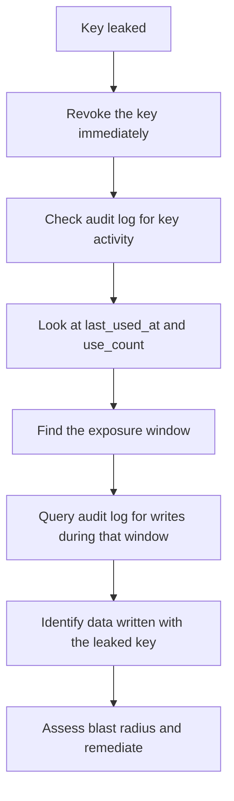

Every administrative action that touches the platform's management plane is recorded in the audit log. The audit log captures who did what, when, and to what — providing a complete, tamper-resistant history of every change made through Studio or the Platform API.

This page covers the audit log's data model, which actions are recorded, how to query the log, and how to use it for compliance, debugging, and security investigations.

<CardGroup cols={3}>
  <Card title="Management plane only" icon="shield">The audit log records changes to definitions, keys, secrets, users, and platform configuration — not data-plane reads and writes. Those are in EventLog and JobRun.</Card>
  <Card title="Actor-attributed" icon="user">Every entry records the actor: a user id, an operator email, or `service` for automated platform actions.</Card>
  <Card title="Queryable" icon="search">Filterable by project, environment, actor, action, and time range. Studio surfaces this in the Audit Log panel.</Card>
</CardGroup>

## The AuditEntry model

The audit log is backed by the `AuditEntry` model:

```python services/api/database/models/projects.py
class AuditEntry(Model):
    id = fields.IntField(primary_key=True)
    project = fields.CharField(max_length=63, null=True, db_index=True)
    env = fields.CharField(max_length=63, null=True)
    actor = fields.CharField(max_length=255, null=True)
    action = fields.CharField(max_length=100)
    target = fields.CharField(max_length=255, default="")
    details = AnyJSONField(default=dict)
```

| Field | Purpose |
| --- | --- |
| `project` | Which project the change belongs to |
| `env` | Which environment (or null for platform-level changes) |
| `actor` | Who made the change — a user id, operator email, or `service` |
| `action` | The type of change (`project.created`, `key.revoked`, `definition.updated`, …) |
| `target` | What was changed (a key prefix, a resource name, a definition id) |
| `details` | Additional context, structured as JSON — the old and new values, the request id |

The `details` field is where the real forensic value lives. It captures the before-and-after state of whatever changed, plus the request id that ties the entry to the full request trace in [Observability](/operate/observability).

## What actions are recorded

The audit log captures every write operation on the management plane. The action names follow a `resource.verb` pattern:

### Projects and environments

| Action | When |
| --- | --- |
| `project.created` | A new project is created |
| `project.updated` | Project metadata changes |
| `project.deleted` | A project is removed |
| `environment.created` | A new environment is added to a project |
| `environment.updated` | Environment config (`infra`, `auth`, `settings`) changes |
| `environment.promoted` | Definitions are promoted between environments |

### API keys

| Action | When |
| --- | --- |
| `key.created` | A new API key is generated (the `target` is the key `prefix`) |
| `key.updated` | A key's name, scopes, or expiry changes |
| `key.revoked` | A key is revoked (`target` is the key `prefix`, `details` includes the revocation reason if provided) |
| `key.expired` | A key passes its `expires_at` and stops working (recorded retroactively) |

### Secrets

| Action | When |
| --- | --- |
| `secret.created` | A new secret is stored (the `target` is the secret name) |
| `secret.updated` | A secret's value is rotated |
| `secret.deleted` | A secret is removed |

### Definitions

| Action | When |
| --- | --- |
| `definition.created` | A new resource, schema, policy, route, flow, function, bucket, or other definition |
| `definition.updated` | Any definition is modified |
| `definition.deleted` | A definition is removed |
| `definition.promoted` | A definition is promoted from another environment |

### Users and operators

| Action | When |
| --- | --- |
| `user.created` | A new user account is created |
| `user.updated` | User profile or role changes |
| `user.deleted` | A user account is removed |
| `operator.created` | A platform operator is created |
| `operator.role_changed` | An operator's role is updated |

### Platform configuration

| Action | When |
| --- | --- |
| `config.updated` | Platform-level settings change |
| `webhook.created` / `webhook.updated` / `webhook.deleted` | Outbound webhook endpoint changes |
| `schedule.created` / `schedule.updated` / `schedule.deleted` | Scheduled work changes |
| `subscription.created` / `subscription.updated` | Event subscription changes |

## How entries are created

Audit entries are created by the Platform API's route handlers, which write to the `AuditEntry` model as part of handling the request. Because every management-plane route is authenticated (via `OperatorBackend` or a service token), the actor identity is always known at write time.

```python
# Simplified pattern used throughout the platform routes
await AuditEntry.create(
    project=project, env=env,
    actor=ctx.user.identity,  # from the verified operator or service token
    action="key.revoked",
    target=key.prefix,
    details={"old_scopes": key.scopes, "request_id": request_id},
)
```

The `actor` field comes from the authenticated request — either the operator's identity (for Studio-driven actions) or `"service"` (for automated platform actions like scheduled jobs that modify definitions). The `details` field includes the request id, which ties the audit entry to the full request trace.

## Querying the audit log

### In Studio

Studio's **Audit Log** panel provides a searchable, filterable interface:

1. Navigate to **Settings → Audit Log** (or the equivalent section in your Studio layout).
2. Filter by project, environment, actor, or action type.
3. Click any entry to see the full `details` JSON, including the request id.
4. Use the request id to trace the full request chain in [Observability](/operate/observability).

### Via the Platform API

```bash Query audit entries for a project
curl "$STUDIO/studio/api/platform/projects/acme/audit" \
  -H "Authorization: Bearer $OPERATOR_TOKEN"

# Filter by environment and action
curl "$STUDIO/studio/api/platform/projects/acme/audit?env=production&action=key.revoked" \
  -H "Authorization: Bearer $OPERATOR_TOKEN"

# Filter by actor
curl "$STUDIO/studio/api/platform/projects/acme/audit?actor=ada@example.com" \
  -H "Authorization: Bearer $OPERATOR_TOKEN"
```

The response returns entries ordered by recency (most recent first), with pagination support.

## Using the audit log for security investigations

The audit log is the primary tool for investigating security incidents. When a secret key is leaked, for example, the investigation workflow is:



Key patterns to search for:

- **Who accessed what, and when.** Filter by `actor`, `action`, and time range to reconstruct the sequence of events during an exposure window.
- **Who changed definitions.** If a policy was weakened or a resource's `owner_field` was removed, the audit log shows exactly when and by whom.
- **Who created keys.** A key you didn't create is a sign of unauthorized access. Filter by `key.created` and check the actor.
- **Who revoked or modified secrets.** Unusual secret activity can indicate a compromised operator account.

## Audit log vs. other records

The audit log is one of several record types in Pawabase. Understanding which record to consult for which question is essential:

| Question | Where to look |
| --- | --- |
| Who changed a definition? | **Audit log** — `AuditEntry` |
| Who read data? | **Event log** — `EventLog` (if events are enabled on the resource) |
| What events fired? | **Event log** — `EventLog` |
| What jobs ran and failed? | **Job runs** — `JobRun`, `FailedJobRecord` |
| What flows executed? | **Flow runs** — `FlowRun` |
| When did a worker process last report? | **Worker heartbeat** — `WorkerHeartbeat` |
| What requests were handled? | **Telemetry** — `RequestRecord` |
| What webhooks were delivered? | **Webhook deliveries** — `WebhookDelivery` |

The audit log captures **management-plane intent** — the human or automated action that changed the platform's configuration. It does not capture data-plane activity, which is the responsibility of the event bus, job records, and telemetry.

## Retention and integrity

Audit entries are stored in the platform database alongside all other platform state. They are ordered by `-id` (most recent first) and indexed by `project` and `env`. Because they live in the same database as everything else, they inherit the database's backup and retention policies.

For compliance purposes, audit entries should never be deleted or modified. The `AuditEntry` model has no soft-delete mechanism — entries are append-only from the application's perspective. Any framework that manages the database should enforce that the audit table is not truncated or altered.

<Tip>
If you need audit logs to survive a database wipe (for example, if the platform database is corrupted and restored from a backup), configure your database backup strategy to retain the audit table separately. A backup that restores the platform state but loses audit entries creates a gap in the compliance record.
</Tip>

## Operational checklist

<AccordionGroup>
  <Accordion title="Daily review">
    1. Check for new `key.created` entries — are there keys you didn't create?
    2. Check for `secret.updated` entries — were any secrets rotated without your knowledge?
    3. Check for `definition.updated` or `definition.deleted` entries — were any definitions removed unexpectedly?
    4. Check for `user.deleted` or `operator.role_changed` entries — is the change expected?
  </Accordion>
  <Accordion title="Incident response">
    1. Identify the scope: filter by project, env, and time window.
    2. Identify the actor: who made the changes?
    3. Trace the request: use the request id in the `details` field to follow the full trace in Observability.
    4. Assess data impact: cross-reference with EventLog and JobRun for data-plane consequences.
    5. Document findings: the audit log is the authoritative record — capture the relevant entries as evidence.
  </Accordion>
  <Accordion title="Compliance and reporting">
    1. Export audit entries for the reporting period via the Platform API.
    2. Group by actor and action to show the full chain of administrative changes.
    3. Cross-reference with user management records (who has access, when they were added/removed).
    4. Retain exports separately from the live database for long-term compliance.
  </Accordion>
</AccordionGroup>
