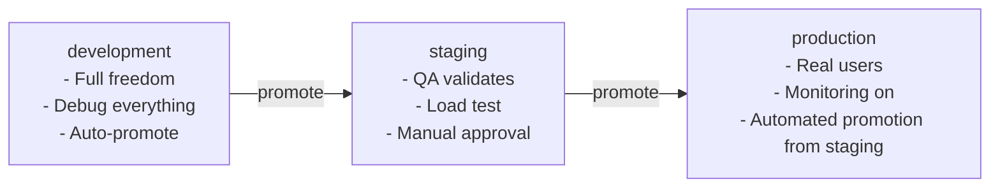

A Pawabase project is a collection of environments — isolated stages like `development`, `staging`, and `production` — each with its own configuration, definitions, API keys, users, and compiled application. An environment is the unit of deployment and the boundary between "this works on my machine" and "this is in users' hands."

This page covers how environments are created and configured, how the promotion workflow moves definitions between stages, how environment settings control the behavior of every service that touches the project, and how the version field drives recompilation and cache invalidation.

<CardGroup cols={3}>
  <Card title="Fully isolated" icon="box">Each environment has its own database tables, keys, secrets, users, and compiled app. `acme/development` and `acme/production` are completely separate — a leaked dev token never works in production.</Card>
  <Card title="Promoted, not deployed" icon="arrow-up">Definitions move from one environment to another through `POST …/promote`, which copies them over. The compiled app is rebuilt from whatever is currently defined — there is no separate build step.</Card>
  <Card title="Version-tracked" icon="refresh">Every environment has a `version` counter bumped on each definition change, so the API knows when to rebuild the compiled app and invalidate caches.</Card>
</CardGroup>

## Environment model

Each environment is a row in the `Environment` model with several JSON config fields that drive different parts of the platform:

```python api/database/models/projects.py
class Environment(Model):
    project = fields.ForeignKeyField("models.Project", ...)
    name = fields.CharField(max_length=63)          # "development", "production"
    is_default = fields.BooleanField(default=False)  # first env is default
    infra = AnyJSONField(default=dict)               # DB, storage, mail config
    auth = AnyJSONField(default=dict)                # Akountz token lifetimes, providers
    settings = AnyJSONField(default=dict)            # CORS origins, rate limits, public docs
    version = fields.IntField(default=1)             # bumped on definition changes
```

The `project` foreign key ties an environment to its project. The `name` is unique within a project — you can't have two environments with the same name in the same project. The `is_default` flag marks which environment a project starts with; the first environment created is typically the default.

## Environment configuration fields

### `infra` — infrastructure

The `infra` field controls the developer's infrastructure for this environment: the database URL, storage configuration, and mail settings. All credentials inside `infra` are `secret://NAME` references that the platform resolves at runtime.

```json infra example
{
  "database": {
    "url": "postgres://user:secret://DB_PASSWORD@host:5432/db",
    "pool_size": 10
  },
  "storage": {
    "bucket": "my-bucket",
    "credentials": "secret://S3_CREDENTIALS"
  },
  "mail": {
    "smtp_host": "smtp.mailgun.org",
    "smtp_user": "secret://SMTP_USER",
    "smtp_password": "secret://SMTP_PASSWORD"
  }
}
```

The platform's `DataSourcePool`, `StorageManager`, and `MailManager` each call `resolve_value()` on the relevant config fields before passing them to their underlying drivers. This means a developer configures the environment once and the platform handles the secret resolution transparently.

### `auth` — authentication configuration

The `auth` field controls Akountz behavior for this environment: token lifetimes, password rules, and enabled OAuth providers. All secrets referenced here (provider client secrets, etc.) use `secret://NAME` references.

```json auth example
{
  "token": {
    "access_ttl": 900,
    "refresh_ttl": 2592000
  },
  "password": {
    "min_length": 8,
    "require_special": true
  },
  "providers": {
    "google": {
      "client_id": "google-client-id",
      "client_secret": "secret://GOOGLE_CLIENT_SECRET"
    }
  },
  "redirect_urls": ["https://app.example.com/auth/callback"]
}
```

The `access_ttl` and `refresh_ttl` values control how long access tokens and refresh tokens live. The default access token lifetime is 15 minutes — short enough that a leaked token has limited exposure, but long enough that background refresh in a mobile app doesn't require human interaction.

### `settings` — platform behavior

The `settings` field controls behavior that isn't about infrastructure or authentication:

```json settings example
{
  "cors_origins": "https://app.example.com,http://localhost:3000",
  "public_docs": false,
  "rate_limit": 600,
  "rate_window": 60,
  "max_upload_bytes": 52428800
}
```

| Setting | Default | Purpose |
| --- | --- | --- |
| `cors_origins` | `http://localhost:8090,http://127.0.0.1:8090` | Comma-separated origins allowed for publishable keys |
| `public_docs` | `false` | Whether the Atlas API reference is publicly accessible at `/docs/v1/*` |
| `rate_limit` | `600` | Requests per window per key or client |
| `rate_window` | `60` | Window duration in seconds |
| `max_upload_bytes` | `50MB` | Maximum request body size |

## Creating and listing environments

### In Studio

Studio's **Environments** section provides the interface for managing all environments for a project:

1. Navigate to **Build → Environments**.
2. Click **New environment**.
3. Enter a **name** (`development`, `staging`, `production`).
4. Optionally mark it as **default** (the first environment created is usually default).
5. Configure `infra`, `auth`, and `settings` (or do this later).

The default environment is where the project starts. When a new project is created, one environment is created automatically and marked as default. Additional environments are added as the project moves through stages.

### Via the Platform API

```bash Create an environment
curl -X POST "$STUDIO/studio/api/platform/projects/acme/envs" \
  -H "content-type: application/json" -H "X-XSRF-TOKEN: $XSRF" -b cookies.txt \
  -d '{"name": "staging", "is_default": false}'
```

```bash List all environments for a project
curl "$STUDIO/studio/api/platform/projects/acme/envs" \
  -H "Authorization: Bearer $OPERATOR_TOKEN"
```

## Promoting definitions between environments

The promotion workflow moves definitions (resources, schemas, policies, routes, flows, functions, buckets, and everything else that lives in the definitions tables) from one environment to another. This is the mechanism that lets you develop in `development`, validate in `staging`, and ship to `production` without manually recreating every definition.

```bash Promote all definitions from staging to production
curl -X POST "$STUDIO/studio/api/platform/projects/acme/envs/staging/promote" \
  -H "content-type: application/json" -H "X-XSRF-TOKEN: $XSRF" -b cookies.txt \
  -d '{"target_env": "production"}'
```

What happens during promotion:

1. Every definition kind (schemas, resources, routes, policies, transformers, flows, functions, buckets, mail templates, event subscriptions, webhook endpoints, inbound hooks, schedules) is copied from the source environment to the target environment.
2. If a definition with the same name already exists in the target, it is **replaced** — promotion is an overwrite, not a merge.
3. The target environment's `version` is bumped.
4. The compiled app for the target environment is invalidated from cache. On the next request to that environment, `state.compiled()` rebuilds it from the new definitions.

<Note>
Promotion copies definitions, not data. The data in each environment's database stays isolated — `acme/development` and `acme/production` have separate tables and separate rows. Promotion moves the *shape* of the API, not the *content* of the database.
</Note>

### Promoting a single definition

You can also promote individual definitions, which is useful when you want to move a single resource or flow without promoting everything:

```bash Promote a single resource
curl -X POST "$STUDIO/studio/api/platform/projects/acme/envs/development/promote" \
  -H "content-type: application/json" -H "X-XSRF-TOKEN: $XSRF" -b cookies.txt \
  -d '{"target_env": "production", "resource": "invoices"}'
```

### The promotion order

When promoting all definitions, the platform handles dependencies in the correct order: schemas first (resources reference them), then resources, then routes, then policies, then flows and functions. This means you don't have to think about dependency order yourself — a resource that references a schema can be promoted after the schema, even if the schema was created later.

## Version and recompilation

Every environment has a `version` field that starts at `1` and is bumped every time a definition is created, updated, or deleted. This version is the mechanism that drives cache invalidation and recompilation.

```python api/database/models/projects.py
class Environment(Model):
    version = fields.IntField(default=1)
```

When a request arrives for `/rest/v1/*`, the `DataPlaneDispatcher` calls `await state.compiled()`. If the environment's current version matches the version the compiled app was built with, the cached compiled app is returned. If the version has changed (because a definition was modified), the compiled app is rebuilt from scratch and cached under the new version.

```mermaid
flowchart LR
    A[Definition changed] --> B[Environment.version bumped]
    B --> C[state.compiled() sees version mismatch]
    C --> D[Rebuild Sillo app from definitions]
    D --> E[Cache the compiled app under new version]
    E --> F[Next request uses the new app]
```

This means the compiled app is **always** built from the current definitions — there is no stale compiled app serving requests after a definition changes. The version check is atomic: it happens at the moment `compiled()` is called, and the cache is invalidated as part of the same operation.

The version also drives cache invalidation for read operations that have `cache_ttl` set on a resource. When a resource's definition changes, the version bumps, and any cache entries tagged with that resource are invalidated immediately.

## Environment isolation in practice

### Users and identity

Users are scoped per environment. A user who exists in `acme/development` is a completely different identity from the same email address in `acme/production`. Their access tokens are signed with different derived keys (one per environment), so a development token is structurally impossible to use in production.

This means:

- Testing with real user data in development doesn't affect production.
- A user who signs in through the development environment's sign-up form gets a token for `acme/development` that can't access `acme/production` endpoints.
- When you promote definitions, the existing production users are untouched.

### API keys

API keys are per environment. A publishable key created in `acme/development` has no meaning in `acme/production`. When you promote definitions, you typically also need to create corresponding API keys in the target environment if they don't already exist.

This is why the key management page in Studio is environment-scoped — you're always looking at keys for one specific environment.

### Data

Each environment has its own database. In a typical setup, the platform database (which stores projects, environments, definitions, keys, and audit entries) is shared, but each environment's project data lives in separate tables or a separate database. The `default_data_url` in `ApiSettings` shows this pattern:

```python
default_data_url: str = "sqlite://storage/data/{project}__{env}.db"
```

The `{project}` and `{env}` substitution means `acme/development` and `acme/production` use completely separate data stores. This is what makes "development can break things without affecting production" more than a slogan — it's enforced by the database layer.

## Promotion workflow: recommended stages

The typical workflow moves definitions through three stages:



### Development

`development` is where you build. Definitions change frequently, the database is populated with test data, and `inline_worker` and `inline_scheduler` are typically enabled so you can see flows and schedules fire without a separate worker process. The `is_default` flag is usually set here.

### Staging

`staging` mirrors production configuration as closely as possible. It's where QA validates that everything works end-to-end with realistic data and realistic API keys. This is the environment where you'd run load tests and verify that rate limits, CORS, and authentication all behave as they will in production.

Promotion from development to staging is typically a manual step — someone reviews the changes and confirms they're ready.

### Production

`production` is where real users interact with your API. It should have the most restrictive settings: tight CORS origins, short token lifetimes, rate limits at their intended production values, and `public_docs` off unless you explicitly want the API reference to be public.

Promotion from staging to production can be automated once the staging validation is complete, or it can require manual approval depending on your release process.

## Operational checklist

<AccordionGroup>
  <Accordion title="Setting up a new project">
    1. Create the project via **Build → Projects → New project**.
    2. The first environment is created automatically as the default (typically `development`).
    3. Configure `infra` (database, storage, mail) and `auth` (token lifetimes, providers).
    4. Create your first definitions: schemas, resources, policies.
    5. Create API keys for the environment.
    6. Start defining flows and functions.
  </Accordion>
  <Accordion title="Promoting to a new environment">
    1. Create the target environment (e.g. `staging`).
    2. Configure its `infra` and `auth` settings (separate database, separate credentials).
    3. Create the API keys for the target environment.
    4. Promote definitions from the source environment.
    5. Verify the compiled app works — try a few endpoints against the new environment.
    6. Check that the `version` field was bumped and that the cache was invalidated.
  </Accordion>
  <Accordion title="Moving from staging to production">
    1. Ensure all tests pass in staging.
    2. Verify production configuration is restrictive (CORS, rate limits, `public_docs: false`).
    3. Create production API keys (don't reuse staging keys).
    4. Promote definitions from staging.
    5. Monitor the audit log and [Observability](/operate/observability) for the first few requests.
    6. If something is wrong, you can promote back to staging immediately — the version system handles the recompilation.
  </Accordion>
</AccordionGroup>

## Comparing environments with other concepts

| Concept | What it controls | Not the same as |
| --- | --- | --- |
| **Environment** | Isolated stage with its own config, definitions, keys, and data | A deployment target — environments exist across multiple deployment targets |
| **Project** | The application boundary — groups environments | An environment — a project has at least one |
| **Compiled app** | The running Sillo app for one `(project, env)` pair | A deployment artifact — the compiled app is built on demand from definitions |
| **Version** | Triggers recompilation and cache invalidation | A release number — versions are internal, monotonically increasing counters |
