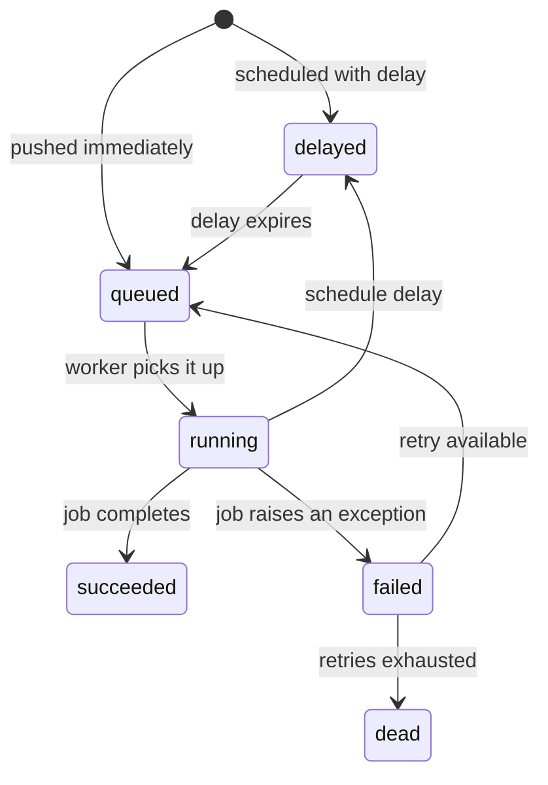
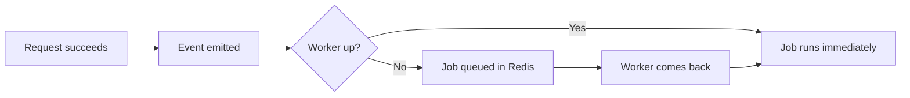

Background work in Pawabase runs on a set of named queues. Every asynchronous consequence of a request — an event fan-out, a flow triggered by a schedule, an outbound webhook delivery, an email — becomes a job queued on one of these queues. A separate worker process consumes jobs, executes them, and handles failures with retries and eventual dead-lettering.

This page covers the job architecture, the lifecycle of a job from queue to completion, how retries work, what happens when a job exhausts its retries, and how to inspect and replay failed jobs in Studio.

<CardGroup cols={3}>
  <Card title="Six platform queues" icon="layers">`events`, `webhooks`, `flows`, `functions`, `mail`, and `default`. Any additional queue can be added via `PAWABASE_WORKER_QUEUES`.</Card>
  <Card title="At-least-once delivery" icon="repeat">Events use a durable Redis backlog. Jobs are pushed to queues and consumed by workers — if a worker crashes mid-execution, the job is re-queued.</Card>
  <Card title="Heartbeat monitoring" icon="pulse">Every worker and the scheduler report a `WorkerHeartbeat` row every 10 seconds. Studio's Workers panel shows live status.</Card>
</CardGroup>

## The platform queues

The platform uses a fixed set of queues, defined in `PLATFORM_QUEUES`:

```python services/api/app/platform.py
PLATFORM_QUEUES = ["events", "webhooks", "flows", "functions", "mail", "default"]
```

Each queue corresponds to a job class with a `queue` attribute set to match:

| Queue | Job class | What runs there | Triggered by |
| --- | --- | --- | --- |
| `flows` | `RunFlowJob` | One flow execution | `trigger.event`, `trigger.resource`, `trigger.schedule`, `trigger.realtime` nodes; event subscriptions targeting a flow |
| `functions` | `RunFunctionJob` | One function invocation | Event subscriptions targeting a function |
| `webhooks` | Webhook delivery | Signed HTTP deliveries to outbound endpoints | Any event matching a webhook endpoint's `events` list |
| `mail` | Mail job | Outbound email jobs | `send_mail` actions in flows/functions; platform notifications |
| `events` | Event bus backlog | Durable Redis-backed event log | Every `platform.bus.publish` call |
| `default` | Anything unnamed | Fallback queue | Jobs queued without specifying a queue |

Additional queues can be added per-environment via the `PAWABASE_WORKER_QUEUES` environment variable. A worker process that starts with this variable configured will consume both the platform queues and any additional queues, enabling multi-tenant or custom queue usage without running separate worker processes.

```bash Configure worker to consume additional queues
PAWABASE_WORKER_QUEUES=custom-queue,notifications python -m app.worker
```

## Job lifecycle

A job goes through well-defined states from creation to completion:



### Pushing a job

Jobs are pushed onto queues by the `Platform.dispatch()` method:

```python services/api/app/platform.py
async def dispatch(self, job, *, project, env, queue=None, delay=0, **kwargs):
    queue_name = queue or job.queue
    payload = json.dumps({"job": job.job_reference(), "args": [], "kwargs": {...}})
    job_id = await self.queue.push(queue_name, payload, delay=int(delay or 0))
    # ... records JobRun entry with status "queued" or "delayed"
```

A `JobRun` row is created in the database immediately when a job is pushed. This row is the job's permanent history — it records the job class, target, source, queue, status, payload, and timestamps. Even if the worker crashes before recording the job, the push itself is persisted in Redis, so the job won't be lost.

### Executing a job

When a worker picks up a job, it:

1. Deserializes the payload (using `PayloadSerializer`) into the job class instance.
2. Calls the job's `run()` method.
3. If the job succeeds, the `JobRun` status is updated to `succeeded` and `finished_at` is set.
4. If the job raises an exception, the job is retried or dead-lettered.

The `import app.jobs` statement in `build_worker()` is critical — every job class must be importable by name for the deserializer to reconstruct a queued payload back into a runnable job. This import happens before the worker starts pulling messages, in every process that might run one.

## Retry policy

Failed jobs are retried according to the queue worker's `WorkerOptions`:

```python QueueWorker options
WorkerOptions(
    concurrency=4,    # jobs processed in parallel
    queues=queues,    # which queues to consume
    sleep=1.0,        # seconds between polls
    timeout=300.0,    # seconds before a job is considered hung
)
```

The retry mechanism works through `RecordFailedJobRepository`. When a job fails, the repository records the failure (exception type, traceback, timestamp). The worker then decides whether to retry based on the job class's retry configuration:

- **Max attempts**: defined per job class via the `tries` attribute. A job that fails more times than `tries` allows is considered dead.
- **Backoff**: retries are spaced with increasing delay, so a job that fails repeatedly doesn't hammer the failing service.
- **Dead-letter**: once a job exhausts all retries, it's moved to a dead-letter state. The `FailedJobRecord` model persists the final failure state.

```python services/api/database/models/activity.py
class FailedJobRecord(Model):
    job_id = fields.CharField(max_length=64, db_index=True)
    queue = fields.CharField(max_length=128, db_index=True)
    job_class = fields.CharField(max_length=255)
    payload = fields.TextField()
    exception = fields.TextField()
    failed_at = fields.FloatField()
```

The `FailedJobRecord` is the last resort — it persists the job's payload, the exception that caused the final failure, and the timestamp. This is what Studio shows when you inspect a dead job.

## What happens when a worker is unreachable

<Tip>
The worker is the one process whose absence doesn't cause an immediate outage. Requests still succeed — the API handles them inline, events are emitted to the bus, and jobs are queued. The only cost is that the asynchronous work happens later.
</Tip>

When the worker is down or unreachable:

- **Events** still get emitted and queued. The event bus's Redis backlog holds them until the event processor (and then the worker) is available.
- **Flows** triggered by events or schedules are enqueued as `RunFlowJob`s on the `flows` queue. They sit there until a worker picks them up.
- **Webhook deliveries** are scheduled but not sent. They retry with backoff once the worker is back.
- **Mail** jobs are queued but not sent.
- **Direct paths** (plain resource reads/writes, directly-invoked flows or functions under `/flows/v1`/`/functions/v1`) are completely unaffected, because those execute inline in the API process.



The key insight: a slow or down worker makes everything asynchronous *back up*, not *fail*. Nothing crashes. The only signal that something's wrong is the worker's missing heartbeat — which is why Studio's status page and [Observability](/operate/observability) both surface it explicitly.

## The worker heartbeat

Every standalone worker process beats a `WorkerHeartbeat` row into the database every 10 seconds while running:

```python services/api/app/worker.py
async def heartbeat(name, queues, worker, stop):
    while not stop.is_set():
        await upsert(WorkerHeartbeat,
            name=name,
            defaults={
                "queues": queues,
                "started_at": started,
                "last_seen": datetime.now(UTC),
                "processed": worker._jobs_processed,
                "concurrency": worker.options.concurrency,
                "status": "paused" if worker._paused else "running",
            },
        )
        await asyncio.wait_for(stop.wait(), timeout=10)
```

The heartbeat row includes the queues the worker consumes, how many jobs it has processed, its configured concurrency, and whether it's currently paused. When the worker stops (on shutdown or crash), the heartbeat status is updated to `stopped`.

An inline worker (running inside the API process with `inline_worker=true`) has **no heartbeat at all**. Studio treats an inline worker as alive purely from the fact that the API process is still running — the status check special-cases workers with no `last_seen` row.

```python services/studio/routes/__init__.py
# Workers with no last_seen row count as up only while
# worker.get("alive") is true, which the API's /workers endpoint reports.
```

## Inspecting and replaying failed jobs

### In Studio

Studio's **Jobs** panel shows all job runs, filterable by project, environment, queue, status, and job class:

1. Navigate to **Observability → Jobs**.
2. Filter by status (`failed`, `succeeded`, `queued`).
3. Click a failed job to see the exception, the stack trace, and the full payload.
4. Click **Replay** to push the job back onto its queue with the same payload.

Replay creates a new `JobRun` with the same job class, target, and payload, but a fresh id and status. The original failed `JobRun` retains its error for reference.

### Via the Platform API

```bash List failed jobs
curl "$STUDIO/studio/api/platform/projects/acme/envs/production/runs?status=failed" \
  -H "Authorization: Bearer $OPERATOR_TOKEN"

Replay a failed job
curl -X POST "$STUDIO/studio/api/platform/projects/acme/envs/production/runs/$JOB_RUN_ID/replay" \
  -H "X-XSRF-TOKEN: $XSRF" -b cookies.txt
```

### Dead-letter jobs

Jobs that have exhausted all retries are dead. They are visible in Studio and accessible via the Platform API. A dead job means something is fundamentally wrong — the downstream service is down, the payload is malformed in a way that can't be fixed by retrying, or the job's code has a bug that wasn't caught in testing.

Dead jobs should be investigated individually. Replaying a dead job without fixing the underlying issue will just create another dead job.

## Monitoring job health

### Through Observability

The `JobRun` model backs the job history, and the `WorkerHeartbeat` model backs the worker status. Together they give you:

- **Queue depth**: jobs in `queued` status that haven't been picked up yet.
- **Worker liveness**: the last time each worker's heartbeat row was updated.
- **Failure rate**: the ratio of `failed` to `succeeded` `JobRun` records over a time window.
- **Average duration**: `duration_ms` on completed `JobRun` records.

### Metrics

The platform writes metrics for job activity:

```python
# Jobs dispatched
note("jobs", f"{job.__name__}:{job_id}", append=True)
```

The `MetricCounter` model records per-minute counters. Custom code can write metrics via `note("metric_name", value, append=True)` which increments the counter for the current request's project and environment.

## Inline vs. standalone workers

Development uses inline workers for convenience; production uses standalone workers for throughput:

| | Inline worker | Standalone worker |
| --- | --- | --- |
| Process | Inside the API process (`python -m app.main` with `inline_worker=true`) | `python -m app.worker` as a separate process |
| Concurrency | 2 (hard-coded) | Configurable via `PAWABASE_WORKER_CONCURRENCY` (default 4) |
| Heartbeat | None | Every 10 seconds |
| Signal handling | Disabled (belongs to the server) | Full signal handling (SIGINT, SIGTERM) |
| Use case | Development, single-process setups | Production, multi-process setups |
| Redis required? | No (in-process fallback) | Yes (queue connection) |

```python services/api/app/config.py
inline_worker: bool = True      # default for development
inline_scheduler: bool = False  # default: separate scheduler process
```

The `inline_worker` default is `True` because development setups typically don't have Redis running. When Redis is available (and `inline_worker=false`), the API process runs as the gateway and API only, and a separate worker process handles all queued work.

## Operational checklist

<AccordionGroup>
  <Accordion title="Debugging a slow worker">
    1. Check the worker's heartbeat in Studio — is it still reporting?
    2. Check queue depth — are jobs accumulating faster than the worker can process them?
    3. Check `PAWABASE_WORKER_CONCURRENCY` — is the concurrency setting too low for the load?
    4. Check individual job run durations — is one particular job type taking unusually long?
    5. Consider scaling horizontally — add more worker processes, each consuming from the same queues.
  </Accordion>
  <Accordion title="Handling a dead job">
    1. Find the dead job in Studio's Jobs panel or via the Platform API.
    2. Read the exception and stack trace from the `FailedJobRecord`.
    3. Check the `payload` — is the job data malformed or unexpectedly large?
    4. Reproduce the failure locally if possible.
    5. Fix the underlying issue (job code, downstream service, payload format).
    6. Replay the job after the fix.
    7. If the payload was caused by a bug in event generation, check whether the same issue will affect future events.
  </Accordion>
  <Accordion title="Scaling workers">
    1. Add more worker replicas — they all consume from the same queues safely.
    2. Increase `PAWABASE_WORKER_CONCURRENCY` if the bottleneck is CPU-bound work within a single worker.
    3. For I/O-bound work (webhook deliveries, emails), increase concurrency rather than adding replicas.
    4. Monitor the worker heartbeat and job run durations to validate that scaling has the desired effect.
  </Accordion>
</AccordionGroup>
