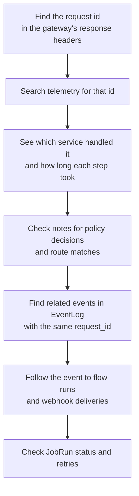

Observability in Pawabase is built on a single telemetry system that runs inside every service. Every request, every event, every job, and every flow run is recorded with a request id that ties them all together, so you can follow a single operation from the gateway through the compiled app, through the event bus, and into the worker — all the way from a user-facing `POST` to a delayed webhook delivery hours later.

This page covers how telemetry is recorded, what the request inspector shows, how to query records, what the metrics look like, and how to use the internal telemetry endpoints for debugging and automation.

<CardGroup cols={3}>
  <Card title="One request id, everywhere" icon="link">Every hop in a request's life carries the same request id. From the gateway's `X-Request-ID` to the event processor's `EventLog.row.request_id` to the flow run's `request_id` field.</Card>
  <Card title="In-memory ring buffer" icon="database">Telemetry records are kept in a bounded in-memory deque (5,000 entries by default) per service. Studio merges every service's records through `GET /internal/v1/telemetry/requests`.</Card>
  <Card title="Sink-extensible" icon="plug">Telemetry supports custom sinks — pipe records to a logging system, an external metrics platform, or a debugging tool. Sinks are fire-and-forget; telemetry failures never fail a request.</Card>
</CardGroup>

## How telemetry is recorded

Every Pawabase service uses `pawabase_kit.telemetry.Telemetry`, a Sillo installable. It adds two things to the service's ASGI stack:

1. **`RequestIdMiddleware`** — assigns a unique `X-Request-ID` to every request.
2. **`TelemetryRecorder`** — captures a `RequestRecord` for every request after it completes.

```python packages/kit/pawabase_kit/telemetry.py
class TelemetryRecorder:
    async def __call__(self, scope, receive, send):
        started = time.perf_counter()
        token = _trace.set(trace)    # binds a trace dict to the current task
        try:
            await self.app(scope, receive, capture)
        finally:
            _trace.reset(token)
            await self.telemetry.record(self._build(scope, ..., trace, error))
```

Each `RequestRecord` captures:

| Field | What it's for |
| --- | --- |
| `service` | Which service handled the request (`api`, `akountz`, `angula`, `studio`) |
| `request_id` | The unique id — the thread that ties everything together |
| `method`, `path` | The HTTP method and path |
| `route` | Which route matched (e.g. `grades.create`) |
| `status` | The HTTP status code |
| `duration_ms` | How long the request took |
| `project`, `env` | The project and environment (for `/rest/v1` requests) |
| `role` | The credential role (`anon`, `service`, `operator`) |
| `user` | The authenticated user's identity (if any) |
| `ip`, `user_agent` | Client address and user agent |
| `error` | Any exception that occurred |
| `notes` | Arbitrary key-value pairs attached during the request |

The `notes` field is the most flexible part. Any code can call `note("cache", "hit")` or `note("events", "order.created", append=True)` to attach diagnostic information to the record. This is what lets the compiled app's `DataPlaneDispatcher` leak internal decisions (which policy ran, which route matched, how a list query was planned) back out to telemetry without every route having to implement custom logging.

```python services/api/app/dispatch.py
FORWARDED_KEYS = ("user", "auth", "auth_scheme", "route", "pawabase.policy", "pawabase.plan")
```

After the compiled app finishes, the dispatcher copies these keys from the inner scope back onto the outer scope, where the `TelemetryRecorder` picks them up and stores them in `notes`. This is why Observability can show you "policy `own_rows` refused this request" even though the compiled app is otherwise a black box to the telemetry system.

## The request inspector in Studio

Studio's **Observability** section provides a request inspector that queries every service's telemetry through `GET /internal/v1/telemetry/requests`. Each service exposes this endpoint through its internal router:

```python packages/kit/pawabase_kit/service.py
def internal_router(name: str, telemetry: Telemetry) -> Router:
    router = Router(prefix="/internal/v1/telemetry")
    @router.get("/requests", auth=SERVICE_ONLY, exclude_from_schema=True)
    async def requests(ctx: HttpContext):
        return {
            "service": name,
            "requests": telemetry.query(
                limit=..., project=q.get("project"), env=q.get("env"),
                status_min=..., request_id=..., path_prefix=...,
            ),
        }
```

Studio merges the results from all services into a unified timeline. You can filter by project, environment, status code, request id, or path prefix.

The request inspector shows:

- **Timeline view**: a chronological list of requests with status codes and durations.
- **Trace detail**: clicking a request shows the full `RequestRecord`, including `notes` (which policies ran, which routes matched, cache hits/misses, events emitted).
- **Request id search**: type a request id to find every record across every service that shares it — the full chain from gateway to worker.

## Querying telemetry

The `Telemetry.query()` method supports filtering by project, environment, status, request id, and path prefix:

```python
# All requests for a specific project and environment
telemetry.query(project="acme", env="production")

# All 5xx errors across any project
telemetry.query(status_min=500)

# Everything related to a specific request
telemetry.query(request_id="abc123def456")

# All requests under a path prefix
telemetry.query(path_prefix="/rest/v1/invoices")
```

The `Telemetry.summary()` method returns aggregate statistics for the in-memory window:

```python
telemetry.summary()
# → {
#   "service": "api",
#   "uptime_seconds": 3600.5,
#   "total": 15234,
#   "errors": 12,
#   "window": 5000,
#   "by_status": {"2xx": 15100, "4xx": 122, "5xx": 12},
#   "p50_ms": 45.2,
#   "p95_ms": 230.1,
#   "p99_ms": 890.3,
# }
```

The window is a bounded deque (5,000 entries by default). Older records are evicted as new ones arrive. This means the summary covers the most recent requests, not a rolling window of all time. For longer retention, add a sink that persists records to an external system.

## Event inspection

Every platform event is recorded in the `EventLog` model (`services/api/database/models/activity.py`). The event processor writes a row for every event it handles, including the full list of consumers it dispatched to and whether each dispatch succeeded.

```python services/api/database/models/activity.py
class EventLog(Model):
    event_id = fields.CharField(max_length=64, unique=True, db_index=True)
    project, env, name, source, actor, payload
    request_id = fields.CharField(max_length=64, null=True)
    occurred_at = fields.CharField(max_length=40)
    consumers = AnyJSONField(default=list)   # every consumer and its outcome
```

The `consumers` list is the key to understanding event fan-out. Each entry records the consumer type (`flow`, `function`, `realtime`, `webhook`), the target, and whether the dispatch succeeded:

```json consumers example
[
  {"type": "flow", "target": "send-welcome-email", "status": "queued"},
  {"type": "webhook", "target": "endpoints", "status": "queued"},
  {"type": "realtime", "target": "resource:grades", "status": "done"}
]
```

In Studio's event inspector, you can see which events fired, what consumers they had, and whether any dispatch failed. Combined with the request id, you can trace an event from its original request all the way to every flow, function, webhook, and realtime publication it triggered.

## Job runs and flow runs

Queued jobs are recorded in the `JobRun` model and flow executions in the `FlowRun` model:

```python services/api/database/models/activity.py
class JobRun(Model):
    id, project, env, queue, job, target, source, status
    attempts, max_attempts, payload, result, error
    started_at, finished_at, duration_ms, worker

class FlowRun(Model):
    id, project, env, flow, trigger, status
    input, output, error, trace, logs
    duration_ms, request_id, job_id
```

`JobRun` tracks the lifecycle of every queued job — from `queued` through `running` to `succeeded` or `failed`. The `attempts` and `max_attempts` fields show retry progress. The `worker` field identifies which process picked up the job.

`FlowRun` is more detailed: it captures the full step trace (`trace`) and execution logs (`logs`), plus the flow's input and output. This is what you see when you click a flow run in Studio's flow debugger — every node visited, every step's output, and any errors.

## Metrics

The `MetricCounter` model records per-minute counters written by `metric.increment` calls and platform code:

```python services/api/database/models/activity.py
class MetricCounter(Model):
    project, env, name, tags, window, value, count
```

Metrics are stored at one-minute granularity and are unique by `(project, env, name, tags, window)`. The platform uses metrics for things like request counts by status, queue depths, and event throughput. Custom code can write metrics via `note("metric_name", value, append=True)` which increments the counter for the current request's project and environment.

## Internal telemetry endpoints

Every service exposes telemetry endpoints at `/internal/v1/telemetry` that Studio and automation tools can query. These endpoints are protected by `SERVICE_ONLY` auth — they require a valid service token.

```python packages/kit/pawabase_kit/service.py
@router.get("/requests", auth=SERVICE_ONLY)
async def requests(ctx: HttpContext):
    return {"service": name, "requests": telemetry.query(...)}

@router.get("/summary", auth=SERVICE_ONLY)
async def summary(ctx: HttpContext):
    return telemetry.summary()
```

The `/summary` endpoint is particularly useful for health checks and dashboards. It returns the service's uptime, total requests processed, error count, request window size, status code distribution, and latency percentiles — all from in-memory data, with no database query.

## Custom sinks

You can attach a sink to any service's `Telemetry` instance to persist records beyond the in-memory ring buffer:

```python from pawabase_kit.telemetry import Telemetry, Sink

async def my_sink(record: dict) -> None:
    await send_to_external_platform(record)

telemetry.add_sink(my_sink)
```

Sinks are called in the `finally` block of the `TelemetryRecorder`, after the response has already been sent. They must not raise — the recorder wraps each sink call in a try/except and silently continues if a sink fails, because telemetry must never fail a request.

```python packages/kit/pawabase_kit/telemetry.py
async def record(self, record: RequestRecord) -> None:
    self.records.append(record)
    for sink in self.sinks:
        try:
            await sink(record)
        except Exception:  # telemetry must never fail a request
            pass
```

## Reading a request trace

When debugging, the request id is your most powerful tool. Here's how to use it:



The full chain from a single `POST` to a delayed webhook delivery looks like this:

1. **Gateway**: request id assigned, `X-Request-ID` in response headers.
2. **API**: same request id on the `RequestRecord` for the `/rest/v1` call, plus `notes` showing the route and policy.
3. **Event log**: the `EventLog` row has `request_id` set, recording which event fired and which consumers were dispatched.
4. **Flow run**: the `FlowRun` has `request_id` pointing back to the original request, with the full step trace.
5. **Webhook delivery**: the `WebhookDelivery` record shows attempts, response status, and errors — all tied to the same event, which is tied to the same request id.

<Tip>
If you're trying to explain "why did this webhook fire twice?", start from the request id, not the webhook log. The event processor's dedup check (`EventLog.filter(event_id=event.id).exists()`) makes it idempotent against at-least-once delivery, but if you see two event logs with the same id, the dedup is working correctly — the duplicate is a different event that happened to have the same content.
</Tip>

## Operational checklist

<AccordionGroup>
  <Accordion title="Debugging a 403 or 404">
    1. Find the request id from the response or the gateway logs.
    2. Query `telemetry.query(request_id=...)` on the API service.
    3. Check `notes.pawabase.policy` — if it's set, the policy refused the request. If `notes.route` is set, the route matched.
    4. For `404`, check whether the record has a `route` at all — if not, the path didn't match any route (the gateway fell through to its own app).
  </Accordion>
  <Accordion title="Checking if events are flowing">
    1. Find the event in the EventLog by name and project/env.
    2. Check the `consumers` list — are all expected consumers queued?
    3. Check the corresponding `FlowRun` or `JobRun` for status.
    4. If consumers are missing, the event processor may be down — check the event bus and the `EventProcessor` process.
  </Accordion>
  <Accordion title="Monitoring latency">
    Use `telemetry.summary()` for p50/p95/p99 latency across the in-memory window. For production dashboards, attach a sink to a metrics platform. The `/internal/v1/telemetry/summary` endpoint is available for scraping.
  </Accordion>
</AccordionGroup>
