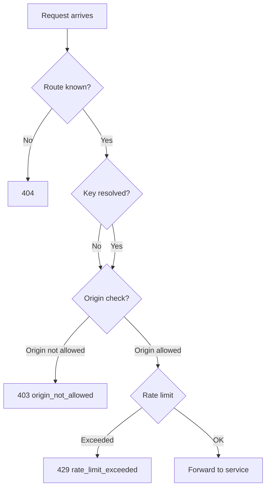

Rate limiting and CORS enforcement are two of the gateway's first-line defenses. They operate at the edge of the system — before the request reaches any service — and they protect your project from abuse, scraping, and unintended cross-origin access.

Rate limits control how many requests a client can make in a given window. CORS enforcement ensures that a publishable key only works from origins you've explicitly allowed. Together, they define who can reach your API, how fast, and from where.

<CardGroup cols={3}>
  <Card title="Gateway-level enforcement" icon="door-open">Both rate limits and CORS are enforced by the gateway. A blocked request never reaches the API process, so it doesn't consume database connections or trigger policy evaluation.</Card>
  <Card title="Per-key and per-IP" icon="users">Rate limit buckets are keyed by API key (if resolved) or client IP. Publishable keys share one bucket per key; anonymous traffic is rate-limited per IP.</Card>
  <Card title="Configurable per environment" icon="slider">Every rate limit and CORS setting is per environment — `development` can be lenient while `production` is tight.</Card>
</CardGroup>

## Rate limiting

### How the gateway enforces rate limits

The gateway applies rate limiting as one of its early checks, after key resolution and origin checking but before forwarding the request. The `RateLimitMiddleware` from Sillo handles the counting and backend logic, wrapped in Pawabase's `RouteRateLimit` middleware which produces the standard 429 response format:

```python packages/kit/pawabase_kit/ratelimit.py
class RouteRateLimit(BaseMiddleware):
    async def dispatch(self, ctx, call_next):
        result = await self.limiter.check(ctx)
        if result is not None and not result.allowed:
            retry_after = max(int(result.retry_after), 1)
            return json_response(
                {
                    "error": "rate_limit_exceeded",
                    "message": "Too many requests. Slow down and retry later.",
                    "retry_after": retry_after,
                },
                status_code=429,
                headers={
                    "Retry-After": str(retry_after),
                    "X-RateLimit-Limit": str(result.limit),
                    "X-RateLimit-Remaining": "0",
                },
            )
```

A rate-limited request receives:

```
HTTP/1.1 429 Too Many Requests
Content-Type: application/json
Retry-After: 12

{"error": "rate_limit_exceeded", "message": "Too many requests. Slow down and retry later.", "retry_after": 12}
```

The `Retry-After` header is always at least `1` (`max(int(result.retry_after), 1)`), so a client that blindly retries after the stated delay never busy-loops on a zero or negative value. The `X-RateLimit-Limit` and `X-RateLimit-Remaining` headers are included on every response (not just rate-limited ones) when the limiter is active, so clients can self-adjust.

### How the rate limit key is derived

The rate limit bucket depends on whether a key was resolved:

```python
def _limit_key(ctx: HttpContext) -> str:
    key_id = ctx.scope.get(KEY_SCOPE)
    if key_id:
        return f"key:{key_id}"
    forwarded = ctx.headers.get("x-forwarded-for")
    client = ctx.scope.get("client")
    return "ip:" + (forwarded.split(",")[0].strip() if forwarded else (client[0] if client else "unknown"))
```

| Situation | Bucket key | Effect |
| --- | --- | --- |
| Request with a resolved API key | `key:<key_id>` | Every request using the same key shares one bucket |
| Anonymous request (no key) | `ip:<first X-Forwarded-For or client IP>` | All requests from the same IP share one bucket |

If a key was resolved, the bucket is keyed by the key id — every request using the same API key shares one bucket, regardless of which IP it comes from. This is almost always what you want: a mobile app's users share a publishable key, so the key's rate limit is the budget for all users together. If no key was resolved at all, the bucket falls back to the client's IP address.

The limit itself comes from `RateLimitConfig(limit=settings.rate_limit, window=settings.rate_window, namespace="gw", …)` — a default of 600 requests per 60-second window per key or client, configurable per deployment.

### Rate limit backends

| Backend | When to use | Tradeoff |
| --- | --- | --- |
| `memory` (default) | Single instance, development, or tests | Each replica enforces its own limit independently — correct for one instance, wrong for multiple |
| `redis` | Production with multiple gateway replicas | Shared across all replicas — rate limits are correct regardless of which replica handles the request |

When using `redis`, the rate limiter uses Sillo's `RedisBackend` connected to the platform's Redis URL. When Redis is not configured, the in-memory backend is used — which means each gateway replica enforces its own limit independently. For a single-instance deployment, that's fine. For multiple replicas behind a load balancer, use Redis so that the total requests across all replicas don't exceed the limit.

### Per-route rate limiting

Individual resources and routes can define their own rate limits, which are enforced in addition to the gateway-level limit:

```json Resource rate_limit example
{
  "name": "reports",
  "rate_limit": {"limit": 100, "window": 60}
}
```

```json RouteDef rate_limit example
{
  "path": "/reports/export",
  "rate_limit": {"limit": 10, "window": 60}
}
```

Per-route rate limits are enforced by the compiled app itself, not the gateway. They apply in addition to the gateway-level limit — a request that exceeds the gateway limit is rejected before it reaches the compiled app, and a request that passes the gateway but exceeds the route's limit is rejected by the compiled app's rate limit middleware.

## CORS enforcement

### How the gateway enforces origins

For publishable keys, the gateway checks the `Origin` header against the environment's configured `cors_origins`. If the origin doesn't match, the request is refused with `403 origin_not_allowed` — before the request is proxied to any service.

This check applies only to the `anon` role (publishable keys). Secret keys aren't expected to arrive with a browser `Origin` header, so there's nothing to check. The check also only applies to the `Origin` header — it's a CORS-specific check, not a general access control mechanism.

```python packages/kit/pawabase_kit/settings.py
class PlatformSettings(Config):
    cors_origins: str = "http://localhost:8090,http://127.0.0.1:8090"
    
    def origins(self) -> list[str]:
        """The CORS origins as a list."""
        return [origin.strip() for origin in self.cors_origins.split(",") if origin.strip()]
```

The `cors_origins` field is a comma-separated string, parsed into a list at runtime. The gateway checks the request's `Origin` header against this list with an exact match — no wildcards, no substring matching.

### Configuring origins per environment

Every environment has its own `cors_origins` setting, stored in the `settings` JSON field of the `Environment` model:

```json Production environment settings
{
  "cors_origins": "https://app.example.com,https://admin.example.com",
  "public_docs": false,
  "rate_limit": 600,
  "rate_window": 60
}
```

```json Development environment settings
{
  "cors_origins": "http://localhost:3000,http://localhost:8090,http://127.0.0.1:3000",
  "public_docs": true,
  "rate_limit": 10000,
  "rate_window": 60
}
```

Keep the production list tight. A publishable key is intentionally public — it ships in your JavaScript bundle, your mobile app, your `.env.local`. The only thing standing between "this key works on my site" and "this key works on any site that copies my JS bundle" is the origin allow-list.

<Warning>
Never use a wildcard (`*`) in production `cors_origins`. A wildcard means any origin can use your publishable key, which defeats the purpose of the origin check entirely. If you need to support a dynamically-changing set of origins (e.g. a multi-tenant app where each tenant has its own origin), implement the origin check at the application level instead, and use a restrictive gateway configuration.
</Warning>

### Origins and the browser's behavior

The gateway's origin check works at the HTTP level — it decides whether to proxy the request at all. Browsers' same-origin policy is a separate mechanism that controls whether JavaScript can *make* the request in the first place. For cross-origin requests from JavaScript, the browser sends a CORS preflight (`OPTIONS`) request before the actual request. The gateway's origin check happens on the actual request, not the preflight — but since the preflight is also proxied through the gateway, it goes through the same key resolution and origin check.

For routes that don't require a key (`/auth/v1/authorize/*`, `/hooks/v1/*`, `/storage/v1/signed/*`, `/docs/v1/*`), the gateway doesn't perform an origin check because there's no resolved context with CORS origins to check against. These routes rely on their own authentication mechanisms (pre-signed URLs, hook signatures, operator tokens).

## Configuring rate limits and CORS

### Via Studio

1. Navigate to **Build → Settings → Environment settings** for the target environment.
2. Set **Rate limit** (requests per window) and **Rate window** (seconds).
3. Set **Allowed origins** (comma-separated list).
4. Save — the environment's `settings` JSON is updated and the change takes effect immediately.

### Via the Platform API

```bash Update rate limits and CORS for an environment
curl -X PATCH "$STUDIO/studio/api/platform/projects/acme/envs/production/settings" \
  -H "content-type: application/json" -H "X-XSRF-TOKEN: $XSRF" -b cookies.txt \
  -d '{
    "rate_limit": 300,
    "rate_window": 60,
    "cors_origins": "https://app.example.com,https://admin.example.com"
  }'
```

### Per-environment defaults

The platform provides sensible defaults for each environment type:

| Setting | Development | Staging | Production |
| --- | --- | --- | --- |
| `rate_limit` | 10,000 | 1,000 | 600 |
| `rate_window` | 60 | 60 | 60 |
| `cors_origins` | `localhost` origins | Narrow list | Production origins only |
| `public_docs` | `true` | `false` | `false` |
| `max_upload_bytes` | 50MB | 50MB | Configurable |

These are the platform defaults — they can be overridden per environment in the `settings` JSON field.

## Interaction between rate limits and CORS

Rate limiting and CORS enforcement operate at different stages of the gateway's check sequence, and they interact in important ways:



Key interactions:

1. **CORS check comes before rate limit** for publishable keys. A request from an unauthorized origin is refused with `403` before the rate limiter ever counts it. This means an attacker from a blocked origin can't exhaust your rate limit budget.
2. **Secret keys skip CORS** entirely. There's no origin check for secret keys because they're not expected from browsers. The rate limit is the only gateway-level defense for secret-keyed requests.
3. **Anonymous requests use IP-based rate limiting**. Since there's no key, the rate limit falls back to the client IP. This is less precise than key-based rate limiting (many users can share one IP behind a NAT) but it's the only option for keyless traffic.
4. **Per-route rate limits are additive**. A request that passes the gateway's rate limit still faces the compiled app's per-route limit. Both limits are enforced independently.

## Operational checklist

<AccordionGroup>
  <Accordion title="Setting up a new environment">
    1. Configure `cors_origins` with only the actual app origins.
    2. Set the rate limit appropriate for the environment (lenient for development, restrictive for production).
    3. Decide whether `public_docs` should be enabled (only if the API reference is meant to be public).
    4. Test with a request from an allowed origin — it should succeed.
    5. Test with a request from a blocked origin — it should get `403 origin_not_allowed`.
    6. Test rate limiting by making enough requests to exceed the limit — it should get `429 rate_limit_exceeded`.
  </Accordion>
  <Accordion title="Diagnosing rate limit issues">
    1. Check the `X-RateLimit-Limit` and `X-RateLimit-Remaining` headers on recent responses.
    2. Determine if the limit is per-key or per-IP (check whether the client sends an API key).
    3. If multiple replicas are in use and you're not using Redis, the effective limit is per-replica — consider enabling Redis.
    4. Check the gateway's rate limit metrics (if configured with a sink) to see the distribution of rate-limited requests.
    5. Consider whether the limit is too restrictive for the actual use case, or whether the client is making too many requests and needs to be optimized.
  </Accordion>
  <Accordion title="CORS debugging">
    1. If a publishable-key request gets `403 origin_not_allowed`, check the `Origin` header the client is sending.
    2. Compare it against the environment's `cors_origins` list — the match must be exact (including protocol and port).
    3. Remember that `cors_origins` is comma-separated, not a JSON array — the platform parses it into a list internally.
    4. If you need to add a new origin, update the environment settings and recompile.
  </Accordion>
</AccordionGroup>
