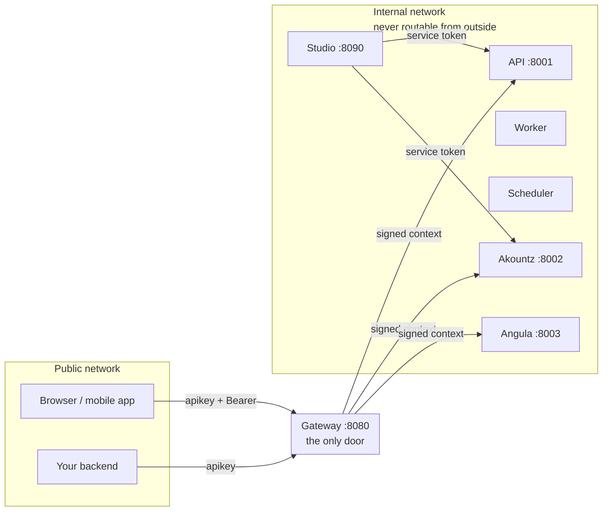
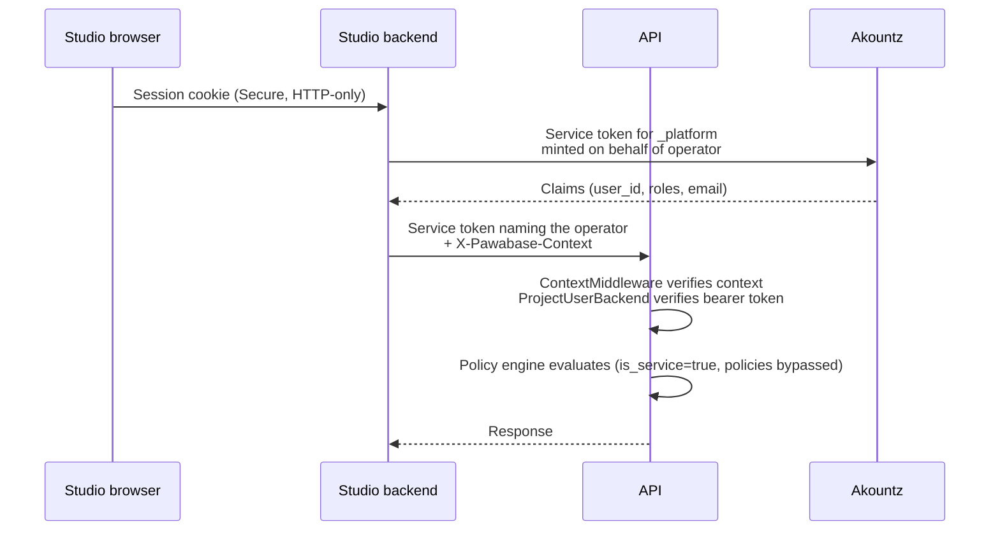
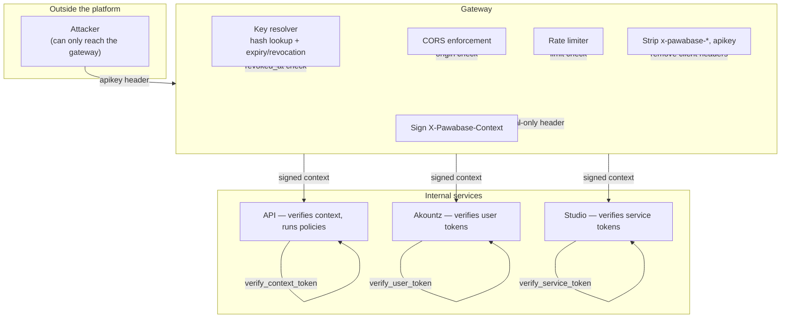

Pawabase's security model is built on one fundamental assumption: the internal network between services is trusted, and the public network is not. Everything else follows from that split. The gateway is the only door. Every internal call carries a credential the receiving service verifies itself. No service trusts a header a client could have set. No service reaches into another service's database.

This page covers the security architecture in depth: the trusted-network model, how authentication and authorization work together, the specific attack surfaces and how they're mitigated, credential hygiene best practices, and the operational security practices that keep a Pawabase installation secure.

<CardGroup cols={3}>
  <Card title="One door" icon="door-open">The gateway is the only public entry point. Internal services are unreachable from outside the network — no path exists to skip the gateway.</Card>
  <Card title="Signed context" icon="signature">Every internal call carries a signed `X-Pawabase-Context` that each service verifies independently. Client-supplied `x-pawabase-*` headers are stripped before forwarding.</Card>
  <Card title="Zero-trust between services" icon="link">Services verify every internal call's token, audience, and signature. A token minted for one service cannot be replayed against another.</Card>
</CardGroup>

## The trusted-network model

The entire security architecture rests on the distinction between the public network (everything a browser, mobile app, or external server can reach) and the internal network (the services talking to each other).



Everything outside the gateway is unreachable from the public network. The route table has no public entry for `/internal/` or `/admin/` — `route_for()` checks blocked prefixes before anything else. There is no way to skip the gateway and hit an internal service directly, because the gateway simply has no public route for it.

Within the internal network, services don't trust each other by position. Every call from one service to another carries a service token that the receiving service verifies. The `ServiceBackend` checks the token's signature against the installation's `internal_secret` and verifies the `audience` claim matches the receiving service's name.

```python packages/kit/pawabase_kit/auth.py
class ServiceBackend(AuthenticationBackend):
    async def authenticate(self, ctx) -> AuthResult:
        token = ctx.headers.get(SERVICE_HEADER)
        if not token:
            return _FAIL
        claims = verify_service_token(token, self.secret, audience=self.audience)
        # audience binding prevents replay across services
```

This means a service token minted for Angula (`audience="angula"`) cannot be replayed against Akountz (`audience="akountz"`), even by another internal caller. The audience is embedded in the token's `aud` claim and verified against the receiving service's name.

## Authentication vs. authorization

Pawabase separates two questions that many platforms conflate:

| Question | Answered by | Mechanism |
| --- | --- | --- |
| **Who is calling?** | Authentication | API key resolution, user token verification, operator session validation |
| **What are they allowed to do?** | Authorization | Policy engine, scope checks, origin enforcement |

The authentication chain runs first and is mandatory. The authorization layer runs second and can refuse based on the authenticated identity. Neither substitutes for the other.

### Authentication in the gateway

The gateway's key resolver is the only place in the system that ever sees a plaintext API key. It locates the key, hashes it (SHA-256), looks up the `ProjectKey` row by `key_hash`, checks revocation and expiry, and builds a `PlatformContext`. The raw key is stripped and replaced with a signed context header.

```python packages/kit/pawabase_kit/auth.py
class ContextMiddleware:
    async def __call__(self, scope, receive, send):
        context = None
        for name, value in scope.get("headers", ()):
            if name == CONTEXT_HEADER.encode():
                try:
                    context = verify_context_token(value.decode("latin-1"), self.secret)
                except TokenInvalid:
                    context = None
                break
        scope[SCOPE_KEY] = context
```

Inside the API process, `ContextMiddleware` verifies the signed context *again*, independently, against the service's own copy of the internal secret. This is a deliberate second check: the context header crossed a process boundary, and the API process does not trust it just because it arrived on an internal network.

### Authorization via policies

Once a request is authenticated, the policy engine decides what the caller is allowed to do. Policies are evaluated in the compiled app and have access to the full `auth` and `credential` context sections — the authenticated user's claims and the resolved platform context, respectively.

Policies can check:

- **`authenticated`**: whether the caller has a user token
- **`kind`**: `"user"`, `"operator"`, `"service"`, or `"anonymous"`
- **`credential.role`**: `"publishable"` or `"secret"` (the key's stored role)
- **`credential.is_service`**: `true` for secret keys, operators, and service tokens (the single property the policy engine branches on)
- **`auth.roles`, `auth.permissions`**: the user's roles and permissions
- **`auth.aal`**: the authenticator assurance level
- **`auth.user_id`, `auth.email`, `auth.org`**: identity claims

## Credential hygiene

### Never ship a secret key client-side

This is the single most important security rule on this page. A secret key in a browser bundle, mobile app binary, public repository, or client-visible config object is functionally equivalent to publishing root credentials to your data. Anyone who extracts it bypasses every policy you've written, with no rate-limit-by-user to slow them down (only the gateway's key-based rate limit applies, shared across every caller of that one key).

If you need client-side elevated behavior, use a publishable key whose roles your policies recognize, or move the operation server-side. There is no exception to this rule.

```python
# WRONG: a secret key in client-side code
const API_KEY = "pb_sk_abc123";  // never do this

# CORRECT: a publishable key with policies doing the authorization
const API_KEY = "pb_pk_xyz789";  // policies control access
```

### Keep secret keys out of environment variable history

`.env` files committed by accident, shell history with `export PAWABASE_KEY=pb_sk_…`, or CI logs that echo environment variables during debugging are common leak vectors that have nothing to do with the application code itself.

Use Pawabase's own [Secrets](/operate/secrets) for configuration values that need to be kept confidential. Secrets are encrypted at rest, referenced as `secret://NAME` in environment config, and never appear in plaintext in any config file or log.

### Scope integrations to least privilege

Every third-party integration, cron job, or CI pipeline that needs a secret key should get one scoped to exactly what it does. An unscoped secret key handed to a low-stakes nightly script is unnecessary exposure. If that script's environment is compromised, the blast radius should be "can write students and guardians," not "can do anything, including reading every bucket and invoking every route."

See [API keys → Scopes](/operate/api-keys#scopes-narrowing-a-keys-power) for the full worked example.

## The service token chain

Pawabase is several services rather than one monolith, and they call each other constantly. Every inter-service call carries a service token, and the chain of trust looks like this:



When an operator clicks "save policy" in Studio, Studio's backend mints a service token that names *that specific operator* and forwards it to the API. The API's audit log records the individual operator who made the change, not just "Studio." This is the same mechanism behind the `sub` claim in a service token — it identifies the human on whose behalf the call is made.

If there's no `sub` in the service token, the identity is `kind = "service"` and an `admin` role is granted by default. This is the platform calling itself with no specific human behind the action.

## Attack surfaces and mitigations

### Compromised API key

| Key type | Impact | Mitigation |
| --- | --- | --- |
| Publishable | Attacker can read data the key is allowed to see, within scope and policy limits | Revoke immediately; the gateway checks `revoked_at` on every request |
| Secret | Attacker has root access to the environment's data; all policies bypassed | Revoke immediately; rotate the master key if the key was exfiltrated from the platform |

Both types are revoked by setting `revoked_at` on the `ProjectKey` row. The gateway checks this on every request, and the check is immediate — there is no propagation delay.

### Compromised user token

| Situation | Impact | Mitigation |
| --- | --- | --- |
| Token stolen before expiry | Attacker can act as the user until the token expires | Token lifetime is 15 minutes by default; revoke the session to invalidate all tokens from it |
| Token stolen after expiry | No impact — the token is rejected by `verify_user_token` | Short default lifetime bounds the exposure window |
| Token from wrong environment | Rejected — the signature won't verify against the other environment's derived key | Per-environment signing keys make cross-environment replay structurally impossible |

The rotating refresh token mechanism means that using the old refresh token after the legitimate client has refreshed produces a reuse signal that Akountz can act on — typically treating it as a compromise indicator and revoking the whole session.

### Compromised master key

The `master_key` is the root of trust for all stored secrets. A compromised master key means every `Secret` row's ciphertext can be decrypted. This is the most severe credential compromise possible.

**Mitigation**: Rotate `PAWABASE_MASTER_KEY` immediately, re-save every `Secret` row with the new key, and back up the old key securely in case you need to decrypt historical backups. The fixed salt means the same master key always derives the same Fernet key, so backing up the old key is essential for data recovery.

### Compromised internal_secret

The `internal_secret` is used to sign service tokens and the gateway's `X-Pawabase-Context` header. A compromised `internal_secret` means an attacker can mint valid service tokens and context headers.

**Mitigation**: Every service in one installation must share the same `internal_secret`, so rotating it requires updating every service simultaneously. This is why the `internal_secret` should be a long, random value that is never shared outside the installation. `PlatformSettings.validate_for_production()` checks that it's not a development default and is at least 32 characters.

### Compromised jwt_master_secret

The `jwt_master_secret` is the root from which each project environment's user-token signing key is derived. A compromised `jwt_master_secret` means an attacker can derive the signing key for any project environment and mint valid user tokens for any user.

**Mitigation**: Same pattern as the master key — rotate immediately and re-issue all user tokens. The derived-key architecture limits the blast radius slightly (the master key alone doesn't produce valid tokens; you also need to know the project and env), but a compromised master key makes every environment's tokens forgeable.

## Production startup validation

Every Pawabase service calls `settings.validate_for_production()` before starting. This checks that all three root secrets have been replaced from their development defaults:

```python packages/kit/pawabase_kit/settings.py
def validate_for_production(self) -> list[str]:
    problems = []
    for field in ("internal_secret", "jwt_master_secret", "master_key"):
        value = getattr(self, field)
        if value.startswith("dev-") or len(value) < 32:
            problems.append(
                f"PAWABASE_{field.upper()} must be set to a random value of 32+ characters"
            )
    return problems
```

If any of these fields still has a development default value, the service refuses to start in production mode (`app_env == "production"`). This catches the most common misconfiguration — deploying with the default secrets from the template — before it can cause a security incident.

```python packages/kit/pawabase_kit/service.py
if settings.app_env == "production":
    problems = settings.validate_for_production()
    if problems:
        raise ConfigurationError("; ".join(problems))
```

## Operational security checklist

<AccordionGroup>
  <Accordion title="New installation hardening">
    1. Set all three root secrets (`PAWABASE_INTERNAL_SECRET`, `PAWABASE_JWT_MASTER_SECRET`, `PAWABASE_MASTER_KEY`) to long, random values before starting any service in production mode.
    2. Create the first operator from the `PAWABASE_ADMIN_EMAIL` and `PAWABASE_ADMIN_PASSWORD` settings, then rotate the operator's password through Studio.
    3. Create the `production` environment and configure `cors_origins` with only your actual app origins.
    4. Disable `public_docs` for production.
    5. Set restrictive rate limits for the production environment.
    6. Verify that `validate_for_production()` passes before deploying any service.
  </Accordion>
  <Accordion title="Ongoing security hygiene">
    1. Rotate the `master_key` periodically and re-save all secrets.
    2. Rotate all `internal_secret` and `jwt_master_secret` values together, on a schedule, with a coordinated restart of all services.
    3. Review the audit log daily for unauthorized changes.
    4. Review API keys for expiry, scope creep, and orphaned keys (check `last_used_at`).
    5. Keep the platform updated — security patches to Sillo or the kit should be applied promptly.
  </Accordion>
  <Accordion title="Incident response: leaked secret key">
    1. Revoke the key immediately (gateway checks `revoked_at` on every request).
    2. Create a replacement with tighter scopes.
    3. Update every configuration that referenced the old key.
    4. Check the audit log for the exposure window.
    5. Assess data written during the exposure (secret keys bypass policies — check for rows that shouldn't exist).
    6. If the leak came from a client bundle, fix the underlying pattern, not just the key.
  </Accordion>
  <Accordion title="Incident response: compromised operator account">
    1. Revoke all sessions for the affected operator (Akountz session revocation).
    2. Check the audit log for all actions taken by that operator.
    3. Identify any definitions, keys, or secrets that were changed during the compromise window.
    4. Rotate any credentials the operator had access to.
    5. Investigate how the account was compromised (phishing, credential reuse, MFA bypass).
  </Accordion>
</AccordionGroup>

## Summary: the security model in one diagram



The attacker's only path into the platform is the gateway, and the gateway strips every header a client could use to impersonate the platform before forwarding. Every internal service verifies every credential independently, using keys that are never shared with the client side. The platform's security is not a single lock — it's a series of gates, each one checking a different aspect of the request, and each one operating on the assumption that the previous gate may have been wrong.
