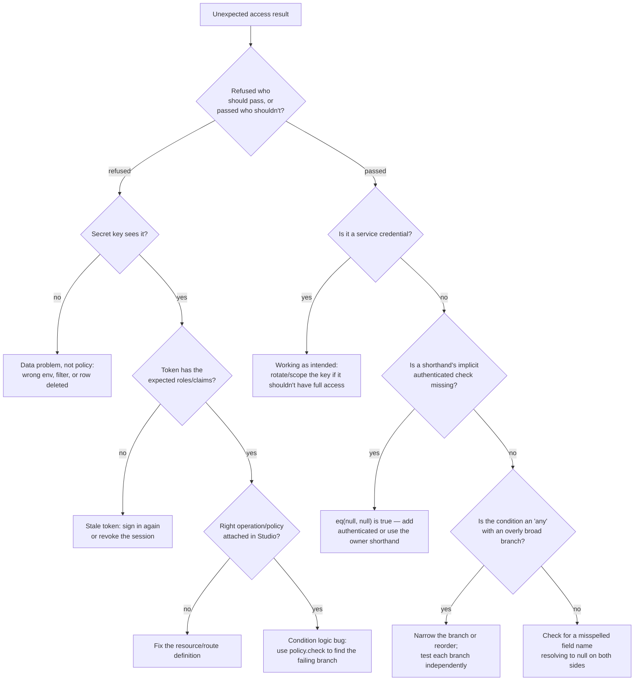

Access bugs come in two flavours: **someone is refused who should get in**, or, far worse, **someone gets in who shouldn't**. This page gives you a method for both: read the response, isolate the cause, trace it in Studio, test the condition directly, and lock the fix in with an automated check.

Treat this page as a checklist to work through top to bottom, not a menu to pick from. Nearly every "the policy is wrong" report turns out to be a wrong assumption about the token, the record, or which operation actually ran — the steps below are ordered to rule those out before you touch the condition itself.

## Step 1: read the response

The status code tells you which layer made the decision.

| Status | Body (typical) | Layer | Meaning |
| --- | --- | --- | --- |
| `401` | `Send a valid project API key in the apikey header.` | Gateway | Missing, unknown, revoked or expired API key |
| `401` | `Authentication required` / `invalid token` | API | No or bad user token where one is needed (including owner-field creates) |
| `403` | `This API key lacks the 'resource:write' scope` | API | Key scopes |
| `403` | `policy 'finance_staff' refused` | Policy | The named policy said no |
| `404` | `Not found` | Policy or data | The row doesn't exist, **or** a read policy hides it |
| `422` | `{"detail": [{"loc": ["body", "title"], …}]}` | Validation | The body is invalid; no policy ran |
| `422` / `409` | `{"error": "overpayment", …}` | A flow | Business rule in the handler, not a policy |
| `429` | rate-limit message + `x-ratelimit-*` headers | Gateway / route | Too many requests |

<Tip>
Refusal messages always include the **policy's name**, including merged lists (`policy 'mfa+role:bursar' refused`). Start there.
</Tip>

### Reading the reason string precisely

Every `Decision` the engine produces carries a `reason` built from one template: `f"policy {policy.name!r} {'allowed' if allowed else 'refused'}"`. Two consequences follow directly from that:

1. **The name in the message is the name the *reference* resolved to, not necessarily the name you typed.** If a route's policy is `null`, the message says `policy 'authenticated' refused` because `resolve_ref(None)` returns the `authenticated` built-in. If it's a parameterised built-in like `"role:bursar"`, the resolved policy's name is literally the string `"role:bursar"`, so the message reads `policy 'role:bursar' refused`.
2. **A list reference produces a compound name.** `["mfa", "role:bursar"]` resolves to a policy named `"mfa+role:bursar"` (joined with `+`, in the order given), so the refusal reads `policy 'mfa+role:bursar' refused`. This tells you the request failed the merged `all`, but not *which* member failed — for that you need Step 3 or Step 4 below.

This means the very first thing worth checking, before touching the condition, is: **is the name in the message the name I expect?** A common mistake is attaching a policy to the wrong operation (`get` instead of `list`, or `update` instead of `create`) — the refusal will name a policy that looks unrelated to what you were trying to do, and that mismatch is the bug, not the policy's logic.

### The service-credential shortcut never appears as a refusal

`Decision(True, "service", "service credential bypasses policies")` is the only decision the engine can produce for a service credential, and it is always `allowed=True`. If you are debugging with a secret key and still seeing a refusal, the refusal is coming from somewhere else in the stack — most often API-key scope enforcement (`PermissionDenied` for a missing scope) or validation, both of which run independently of the policy engine. A secret key genuinely cannot be refused by a policy; if it looks like one was, re-read the response body for the scope message.

## Step 2: isolate the cause

Work through these questions in order. Each one removes a layer.

<Steps>
  <Step title="Does the row exist?">
    Repeat the request with a **secret key** (from a trusted machine). Secret keys bypass policies. If the row is found now, a policy is hiding it. If it's still missing, it doesn't exist, your filter excludes it, or you're in the wrong environment.
  </Step>
  <Step title="Is the caller who you think?">
    Call `GET /auth/v1/user` with the same token. Check `roles`, `id` and the environment. Tokens are snapshots: roles granted after the token was issued aren't in it until the next refresh.
  </Step>
  <Step title="Which policy applies?">
    Look at the resource or route definition in Studio. Is it the operation you think (`update` vs `create`)? Is it a named policy, a parameterised built-in, an inline condition, or `null` (secret keys only, on resources)?
  </Step>
  <Step title="What does the policy see?">
    Reconstruct the context: `$auth` from the token, `$record` from the row (fetch it with a secret key), `$input` from your body. Walk the condition by hand, or run it in a flow with `policy.check` (below).
  </Step>
  <Step title="Is it a list?">
    For lists, remember [planning](/policies/pushdown): role checks are decided before the query, and AND-ed equalities become SQL. A `total: null` tells you a residual remained.
  </Step>
</Steps>

### A decision tree for the two failure directions

Because "someone was refused who should pass" and "someone passed who shouldn't" need almost opposite instincts, it helps to name which one you're chasing before you start:



The "passed who shouldn't" branch is the more dangerous one and deserves special attention: it is almost always one of exactly three root causes — a missing `authenticated` guard next to a `null == null` equality, an `any` branch that's broader than intended, or a field name typo that makes both sides of a comparison resolve to `null` and satisfy `eq`. Check those three before assuming the engine itself is misbehaving; the engine's comparison logic is exhaustively tested and is very rarely the actual bug.

## Step 3: trace it in Studio

Once you've confirmed *which* policy ran and roughly *why* it's suspicious, Studio's Observability view lets you see the exact decision the engine made for a specific request, without re-deriving the context from the token by hand.

<Steps>
  <Step title="Find the request in Observability">
    Go to **Observability → Requests** and filter by path, method, status code, or time range. Each row is one request the gateway routed into your environment. If you know roughly when the problematic request happened, narrow by time first — the list is otherwise ordered newest-first and can be long on a busy project.
  </Step>
  <Step title="Open the request detail">
    Click the row. The detail panel shows the resolved route or resource operation, the status code returned, the caller's `credential.role` and `auth.kind`, and a **Policy** field naming exactly which policy decided the request — the same name that appears in the refusal message, including merged list names like `mfa+role:bursar`.
  </Step>
  <Step title="Read the decision, not just the outcome">
    The Policy field shows the policy name and whether it allowed or refused. For a `list` request, the panel additionally shows whether the plan was **unrestricted**, **refused before any query ran**, or **had a residual** — this is where `total: null` in the response is explained: the residual line names the leftover condition that was checked per row.
  </Step>
  <Step title="Compare the request's auth snapshot against a fresh token">
    The detail panel shows the `auth.roles`, `auth.permissions`, and `auth.claims.app` values **as they were in the token that was used**, not the user's current state. This is the fastest way to catch a stale-token bug: if Observability shows an old role that you've since revoked, the fix is a session refresh or revocation, not a policy change.
  </Step>
  <Step title="Trace back from a 404">
    Because refused reads return `404` rather than `403`, Observability is the only place that distinguishes "this row doesn't exist" from "a policy hid it" without you having to replay the request with a secret key. A `404` row in Observability still carries the resolved policy name and its `allowed: false` decision if a policy refused it; if the row shows no policy decision at all, the row genuinely doesn't exist or the id in the path didn't match any record.
  </Step>
  <Step title="Check the environment version at the time of the request">
    Every request is tagged with the environment version that served it. If a policy was edited and the refusal you're investigating happened *before* the edit, the request detail will show the older version number. This matters because policy changes take effect on the **next** request after a save — if you're testing immediately after editing a policy, confirm you're looking at a request made after the save, not a cached tab replaying an old request.
  </Step>
</Steps>

Open the refused request in [Observability](/operate/observability) to inspect the deciding policy and the caller's authentication snapshot together.

### What Observability can't tell you

Observability shows you the *decision*, not a step-by-step trace of *why* a compound condition evaluated the way it did. If a policy is `{"any": [A, B, C]}` and the decision was `false`, Observability tells you the whole `any` refused — it doesn't tell you that `A` and `B` were `false` while `C` raised a type mismatch that also resolved to `false`. For that level of detail, move to Step 4 and evaluate the condition directly with the exact context Observability showed you.

Likewise, Observability doesn't replay a request with a different token. If you want to know "would this same request have succeeded for a different role," you need to either make the request again with a different user's token, or reconstruct the context and run it through `policy.check` in a scratch flow (next).

## Step 4: test with `policy.check`

A test flow with a `policy.check` block lets you pass any `record` and `input` and see `allowed` or `denied` in the run trace, without touching real data or needing a second user account for every role you want to check.

<Steps>
  <Step title="Create a scratch flow">
    In **Build → Flows**, add a new flow triggered by an HTTP route you control, for example `POST /debug/check-policy`. Give the route a permissive policy (`role: admin`, or restrict it to your own development environment) since this flow is a debugging tool, not something to leave open in production.
  </Step>
  <Step title="Add a policy.check block">
    ```json
    { "block": "policy.check", "config": {
      "policy": "family_access",
      "record": "{{ input.record }}",
      "input": "{{ input.input }}"
    } }
    ```
    The block's `record` and `input` are templates resolved from the flow's state — here, taken straight from the debug route's own request body, so you can POST any hypothetical record and see the result.
  </Step>
  <Step title="Branch on allowed / denied">
    `policy.check` exposes two handles. Wire a `response.json` block to each one that echoes back the decision, so a single POST tells you the outcome without digging through the run trace:
    ```json
    { "block": "response.json", "config": { "body": { "allowed": true, "policy": "family_access" } } }
    ```
  </Step>
  <Step title="Call it with the exact context you're debugging">
    ```bash
    curl -X POST "$GW/flows/v1/debug-check-policy" \
      -H "apikey: $PK" -H "Authorization: Bearer $SUSPECT_TOKEN" \
      -H "content-type: application/json" \
      -d '{"record": {"status": "draft", "author_id": "12"}, "input": {}}'
    ```
    Because `auth` in a `policy.check` block comes from **the caller who triggered the flow**, calling this route with the suspect user's own token reproduces their exact `auth` context — roles, claims, aal, everything — against a `record` you control precisely. This isolates the record/input side of the condition from the auth side: if it still refuses with a record you're certain should pass, the bug is in how the condition reads `$auth`; if it passes with your test record but the real request still fails, the bug is in the real record's actual field values.
  </Step>
  <Step title="Bisect a compound condition">
    For an `all` or `any` with several children, temporarily point the debug flow's `policy.check` at each child individually (paste just that fragment as an inline condition in a second `policy.check` block, or edit the `policy` field between calls) to find exactly which branch is deciding the outcome. This is the direct answer to what Observability can't show you: a branch-by-branch trace.
  </Step>
</Steps>

<Warning>
Delete or lock down the debug route before promoting to production. A `policy.check` route that accepts an arbitrary `record` is a convenient way to probe what data *would* pass a policy — useful for you, useful for an attacker. Gate it with a role only your team holds, or remove it from the promoted definitions entirely.
</Warning>

### Testing pure conditions without any server

For the fastest possible iteration — no flow, no HTTP round trip — the `evaluate` function is a pure function you can call directly if you have Python access to the project (a local script, a notebook, or a CI test):

```python
from pawabase_kit.policies import evaluate

condition = {
    "any": [
        {"role": ["admin", "principal", "teacher"]},
        {"all": [
            {"eq": ["$record.published", True]},
            {"contains": ["$record.guardian_user_ids", "$auth.user_id"]},
        ]},
    ]
}

context = {
    "auth": {"authenticated": True, "roles": ["guardian"], "user_id": "8"},
    "record": {"published": True, "guardian_user_ids": ["8"]},
}

assert evaluate(condition, context) is True
```

This is the same code path the engine runs in production, so a result here is trustworthy — there's no separate "simulation" semantics to worry about diverging from the real thing. It's the fastest way to confirm a hypothesis ("I think the `contains` check is failing because `guardian_user_ids` is a string, not a list") before touching Studio at all: just construct the exact context you suspect and watch it fail the same way.

## Step 5: automate role-by-role checks

A policy that's correct today can silently break the next time someone edits it, adds a role, or renames a field. The fix for "silently" is a test suite that runs after every policy change, not a habit of manually re-checking every endpoint by hand.

### The shape of a role-by-role check

For every resource operation and every actor in your system, decide the expected outcome, then assert it. The school tutorial's suite is the reference shape: one row per `(actor, resource, operation, expected)` tuple.

| Actor | Resource | Operation | Record | Expected |
| --- | --- | --- | --- | --- |
| anonymous | `posts` | `list` | — | 200, only `published` |
| author (owns draft) | `posts` | `get` | their own draft | 200 |
| author (owns draft) | `posts` | `update` → `status: published` | their own draft | 403 |
| editor | `posts` | `update` → `status: published` | any draft | 200 |
| author (not owner) | `posts` | `update` | someone else's draft | 403 (or 404 if not readable) |
| admin | `posts` | `delete` | a published post | 200 |
| author | `posts` | `delete` | a published post | 403 |

Writing this table down **before** writing the conditions is the single highest-leverage habit in policy design: it turns "does this feel right?" into "does row 4 pass?", which is checkable by a machine.

### Automating it against a real environment

The most trustworthy automated check exercises the real HTTP surface with real tokens, because it also catches gateway-level and validation-level failures (a `401` from a missing scope, a `422` from a schema change) that a pure `evaluate()` call would never see. A minimal runner:

```python
import httpx

GATEWAY = "https://gw.pawabase.com"
PROJECT_KEY = {"apikey": PUBLISHABLE_KEY}

CASES = [
    # (label, method, path, token, body, expected_status)
    ("anon lists only published", "GET", "/rest/v1/posts", None, None, 200),
    ("author cannot publish own draft", "PATCH", "/rest/v1/posts/7", AUTHOR_TOKEN,
     {"status": "published"}, 403),
    ("editor can publish", "PATCH", "/rest/v1/posts/7", EDITOR_TOKEN,
     {"status": "published"}, 200),
    ("author cannot delete published post", "DELETE", "/rest/v1/posts/9", AUTHOR_TOKEN,
     None, 403),
    ("admin can delete published post", "DELETE", "/rest/v1/posts/9", ADMIN_TOKEN,
     None, 200),
]

def run():
    failures = []
    for label, method, path, token, body, expected in CASES:
        headers = dict(PROJECT_KEY)
        if token:
            headers["Authorization"] = f"Bearer {token}"
        resp = httpx.request(method, GATEWAY + path, headers=headers, json=body)
        if resp.status_code != expected:
            failures.append(f"{label}: expected {expected}, got {resp.status_code} — {resp.text}")
    if failures:
        raise SystemExit("\n".join(failures))
    print(f"{len(CASES)} policy checks passed")

if __name__ == "__main__":
    run()
```

Run this script:

- **after every policy edit**, before moving on to the next change;
- **as a required CI step before promotion**, so a policy regression can't reach staging or production;
- **on a schedule against production** (with a dedicated, clearly-labelled test user per role), to catch drift caused by something outside your own changes — an Akountz role rename, a schema migration that dropped a denormalised field a policy depends on, or another team's edit to a shared named policy.

### Automating it with `evaluate()` for faster, offline iteration

When you're iterating on the condition language itself rather than the full request path, skip the network and assert directly against `evaluate`:

```python
from pawabase_kit.policies import evaluate

EDITABLE_POST = {
    "any": [
        {"role": ["editor", "admin"]},
        {"all": [
            {"owner": "author_id"},
            {"eq": ["$record.status", "draft"]},
            {"not": {"eq": ["$input.status", "published"]}},
        ]},
    ]
}

def ctx(roles, user_id, record, input_=None):
    return {
        "auth": {"authenticated": True, "roles": roles, "user_id": user_id},
        "record": record,
        "input": input_ or {},
    }

def test_author_cannot_publish_own_draft():
    c = ctx(["author"], "7", {"author_id": "7", "status": "draft"}, {"status": "published"})
    assert evaluate(EDITABLE_POST, c) is False

def test_author_can_edit_own_draft_title():
    c = ctx(["author"], "7", {"author_id": "7", "status": "draft"}, {"title": "New title"})
    assert evaluate(EDITABLE_POST, c) is True

def test_editor_can_publish_any_draft():
    c = ctx(["editor"], "99", {"author_id": "7", "status": "draft"}, {"status": "published"})
    assert evaluate(EDITABLE_POST, c) is True

def test_anonymous_cannot_edit():
    c = {"auth": {"authenticated": False, "roles": [], "user_id": None},
         "record": {"author_id": "7", "status": "draft"}, "input": {}}
    assert evaluate(EDITABLE_POST, c) is False
```

This style runs in milliseconds and belongs in your regular unit test suite (pytest, or whatever your project already uses), right alongside tests for the rest of your Python code. It's the right tool for testing the *condition's logic* — every branch, every edge case, every null. It is not a substitute for the end-to-end HTTP suite above, which is the only one that catches gateway scopes, resource `enabled` flags, transformer interference, and the actual wiring between a route and a policy.

### What a good regression suite covers

<AccordionGroup>
  <Accordion title="Every role, not just the ones you changed">
    A policy edit that fixes a bug for editors can quietly break something for authors. Run the whole table every time, not just the rows you think are affected.
  </Accordion>
  <Accordion title="The anonymous caller">
    Every publicly reachable operation needs at least one row asserting what an anonymous, publishable-key caller can and cannot see. This is the row most often missing, and the one an accidental `public` or bare `true` condition breaks silently.
  </Accordion>
  <Accordion title="Boundary values, not just typical ones">
    For a spending-limit policy like `{"lte": ["$input.amount", 500000]}`, test exactly `500000` (should pass) and `500001` (should fail), not just "a small amount" and "a large amount."
  </Accordion>
  <Accordion title="Transitions, not just states">
    For update policies that reason about `$input` (can't reassign, can't publish), test the transition itself: patch exactly the forbidden field, and separately patch an allowed field on the same record, to confirm the policy isn't accidentally blocking everything.
  </Accordion>
  <Accordion title="List pagination and totals, not just presence/absence">
    For a `list` operation, assert not just that the right rows come back but that `total` is a number (fully pushed down) or explicitly `null` (a residual exists) — a policy edit that turns a pushdown-friendly condition into a residual-heavy one is a performance regression, not a correctness one, and only a total-aware assertion catches it.
  </Accordion>
  <Accordion title="Service credentials, once">
    One row confirming a secret key sees everything (bypassing every policy) is enough — you don't need to repeat it per resource — but it should exist somewhere in the suite so a future change to the gate logic itself is caught.
  </Accordion>
</AccordionGroup>

## Common failure patterns, cross-referenced

These are the failure signatures debugging turns up most often, each pointing at the concept and page that explains the underlying mechanism.

<AccordionGroup>
  <Accordion title="A read policy that should match returns 404 for a signed-in user">
    Confirm with a secret key first (Step 2). If the secret key sees the row, the policy is refusing. Reconstruct the context and check for a misspelled field (`$record.ownr_id` resolves to `null`, and `eq(null, "$auth.user_id")` is always `false`). See [conditions: error handling](/policies/conditions#error-handling-in-conditions).
  </Accordion>
  <Accordion title="An anonymous caller can read a row with no owner">
    This is the classic `eq(null, null) == true` trap. The fix is to always pair a raw `eq` on an owner-shaped field with `{"authenticated": true}`, or use the `owner` shorthand, which includes it automatically. See [operators: the null edge case in eq](/policies/operators#the-null-edge-case-in-eq).
  </Accordion>
  <Accordion title="A list returns fewer rows than per_page with rows still available">
    This isn't a bug — it's a residual. `total: null` in the response confirms it. Keep paging until a short or empty page, per [pushdown: residuals](/policies/pushdown#residuals-what-they-mean-for-you).
  </Accordion>
  <Accordion title="A time-window policy never lets anyone in, or never keeps anyone out">
    `$now` is a Python `datetime`; stored fields are ISO strings; comparing them is always `false`. Switch to a maintained boolean flag. See [operators: time](/policies/operators#time).
  </Accordion>
  <Accordion title="A policy that used to work now refuses everyone right after a role rename">
    Role names are string literals inside `{"role": "..."}` conditions; renaming a role in Akountz doesn't rename it inside stored conditions. Search your policies for the old role name and update them, then re-run the regression suite.
  </Accordion>
  <Accordion title="A field a policy depends on is always null even though the database has data">
    Undeclared columns are invisible to the API entirely, including to policies. Add the field to the resource's schema. See [context: when a value isn't what you expect](/policies/context#when-a-value-isnt-what-you-expect).
  </Accordion>
  <Accordion title="A policy.check inside a scheduled flow always allows">
    Scheduled flows run with a service-level context, and service credentials bypass every policy unconditionally. Guard scheduled data access with explicit logic in the flow, not `policy.check`. See [context: inside flows](/policies/context#inside-flows-policycheck).
  </Accordion>
</AccordionGroup>

## Debugging worked scenarios end to end

These four walkthroughs are the scenarios teams hit most often in production. Each follows the same method: read the response, isolate, trace, test, automate.

<Tabs>
  <Tab title="Multi-tenant isolation leak">
    **Symptom:** a user in organization `acme` can see a handful of rows belonging to organization `globex` in a list response.

    1. **Read the response.** Status is `200`, `total: null` — a residual exists, which is already suspicious for a tenancy rule that should be a clean pushdown.
    2. **Isolate.** The policy is `{"any": [{"role": "admin"}, {"eq": ["$record.org_id", "$auth.org"]}]}`. Fetch one of the leaked rows with a secret key: its `org_id` is `"globex"`, but the caller's `auth.org` is `"acme"`.
    3. **Trace in Studio.** Observability shows the request's `auth.org` as `"acme"` and the resolved policy as the `any` above, with the plan marked as **unrestricted** — meaning the `role: admin` branch decided `true` at plan time. The caller's token has `roles: ["admin", "member"]` — they're a platform admin who also happens to belong to `acme`, and the `role: admin` branch makes their access unrestricted across every tenant.
    4. **Test.** `policy.check` with the caller's real token and a `globex` record confirms: `role: admin` matches, so the whole `any` is `true`, independent of `org_id`.
    5. **Fix and automate.** The `admin` role was meant to mean "admin of my own org," not "admin of every org," but the condition doesn't say that. Rename the broad role to `platform_admin` (granted only to your own staff) and add an org-scoped `org_admin` role for tenant administrators, then add a regression row: *org_admin in acme, listing globex records, expects zero rows.*
  </Tab>
  <Tab title="Role-gated admin action silently open">
    **Symptom:** a non-admin user successfully calls `POST /reports/{id}/publish`, a route intended for `report_publisher` only.

    1. **Read the response.** `200`, no refusal at all.
    2. **Isolate.** The route's `policy` field in Studio is `null`. For a **custom route**, `null` defaults to `authenticated` — not to any role restriction. The route was never actually gated by role; every signed-in user could call it.
    3. **Trace in Studio.** Observability confirms: the resolved policy name on every successful call is `authenticated`, not `report_publisher`.
    4. **Test.** Not needed — the definition itself is the bug, not the condition's logic.
    5. **Fix and automate.** Set `"policy": "report_publisher"` explicitly on the route. Add a regression row: *a plain authenticated user (no role), calling publish, expects 403.* This is exactly the kind of gap the "default policy per entry point" table in the [overview](/policies/overview#where-policies-apply) exists to prevent — the default for routes is permissive by design, so forgetting to override it is silent.
  </Tab>
  <Tab title="Owner-only access failing for the legitimate owner">
    **Symptom:** a user gets `404` fetching a record they created themselves minutes ago.

    1. **Read the response.** `404` on a `get` — could be missing data or a hidden row.
    2. **Isolate.** Secret key finds the row immediately: it exists. `GET /auth/v1/user` with the caller's token shows their `user_id` is `"41"`. The row's owner field, fetched with the secret key, is `"41"` too — they match as strings.
    3. **Trace in Studio.** Observability shows the resolved policy `owner:created_by`, decision `refused`. The auth snapshot in that request shows `user_id: 41` as an **integer**, not a string — the token was minted by a legacy client that serialized the claim incorrectly.
    4. **Test.** `evaluate({"owner": "created_by"}, {"auth": {"authenticated": True, "user_id": 41}, "record": {"created_by": "41"}})` — this actually returns `True`, because id normalisation converts both to strings for `eq`. So the mismatch isn't normalisation. Re-checking the record: `created_by` was stored as `"41 "` with a trailing space from a bulk-import script, which fails `eq` even after normalisation (normalisation converts int-to-string, it never trims whitespace).
    5. **Fix and automate.** Fix the data (a migration that trims the column) and add a check to the import script. Add a regression row that specifically covers *owner id round-trips as an integer from a token* — the normalisation behavior is correct and worth asserting so nobody "fixes" it by mistake later.
  </Tab>
  <Tab title="Time-boxed access via AAL never actually turning on">
    **Symptom:** a sensitive `payments` route is supposed to allow bursars only within 10 minutes of completing a second factor, but a bursar who authenticated with 2FA an hour ago can still call it.

    1. **Read the response.** `200` — successfully allowed, but shouldn't have been.
    2. **Isolate.** The policy is `["mfa", "role:bursar"]`, i.e. `{"all": [{"authenticated": true}, {"aal": "aal2"}, {"contains": ["$auth.roles", "bursar"]}]}`. `$auth.aal` reflects the assurance level **at the time the token was issued**, and tokens are snapshots — `aal2` doesn't expire when the token itself is still valid.
    3. **Trace in Studio.** Observability confirms `auth.aal: "aal2"` on the hour-old request. The `mfa` shorthand only checks *whether* a second factor was used to mint this token, not *how long ago*.
    4. **Test.** Confirms the condition language has no notion of elapsed time relative to `aal` — `$now` and `$auth.aal` are unrelated fields, and there's no `$auth.aal_issued_at` in the context.
    5. **Fix and automate.** This requirement (time-boxed, not just present) can't be expressed in the condition language alone, because the context doesn't carry *when* the second factor was verified. Two options: shorten the access token's lifetime so the whole token — not just the AAL claim — expires quickly for bursar sessions, forcing re-authentication; or move the check into a [Python policy](/policies/python-policies) that reads a session-verification timestamp from `auth.claims.app` (set by a step-up flow at the moment of the 2FA challenge) and compares it against `$now` in Python, outside the JSON condition language. Add a regression row for whichever fix is chosen, and note in the policy's `description` that AAL alone isn't time-boxed — the next person who reads the condition needs to know this without re-discovering it.
  </Tab>
</Tabs>

## FAQ

<AccordionGroup>
  <Accordion title="Why does the same policy refuse in Studio's preview but allow in production?">
    Studio's preview typically runs against the **development** environment, which can have different policies, different roles seeded on your test user, or a different environment version than production. Confirm you're comparing the same environment, and that the test user's token was minted after any recent role changes.
  </Accordion>
  <Accordion title="Can I see the exact SQL a list policy produced?">
    Not directly from Studio. Observability shows the resolved policy and whether the plan was unrestricted, refused, or had a residual with pushed-down filters, but the literal SQL is in your database's own query log, matched by request id if your database logging includes it. See [pushdown: observability](/policies/pushdown#observability).
  </Accordion>
  <Accordion title="How do I debug a Python policy?">
    A Python policy's `handler` runs like any other function in your project — add logging inside it, or unit test it directly by calling it with a constructed context dict, exactly as you would `evaluate()` for a JSON condition. Because Python policies are opaque to the engine's `partial()` function, they're always a residual on lists; Observability will show the policy's name but not a branch-level trace. See [Python policies](/policies/python-policies).
  </Accordion>
  <Accordion title="A policy I deleted is still being enforced — why?">
    If another definition still references it by name, deleting a policy leaves that reference broken and the operation fails closed (refused, not allowed) rather than silently falling back to something permissive. Check the environment's Overview page for definitions with broken references before assuming the deletion didn't take effect.
  </Accordion>
  <Accordion title="Is there a way to dry-run a policy change before saving it?">
    Not as a distinct "dry run" mode. The reliable equivalent is: build the change in a feature branch of your definitions (if you manage them as code), or edit it directly in **development**, then run your automated role-by-role suite against development before promoting. Because policy changes take effect immediately on save with no separate deploy step, the automated suite is your safety net, not a preview feature.
  </Accordion>
  <Accordion title="What's the fastest way to reproduce a customer's exact failure without their token?">
    If you know their user id, roles and claims, construct an equivalent context and run it through `evaluate()` or a `policy.check` debug flow (Step 4) rather than trying to impersonate them. For issues that depend on the literal token (aal, org, session), you'll need either their cooperation to reproduce it live, or a support-only impersonation flow that's outside the scope of the policy engine itself.
  </Accordion>
</AccordionGroup>

## Next

<CardGroup cols={2}>
  <Card title="Policies overview" icon="shield-check" href="/policies/overview">The mental model and where policies apply.</Card>
  <Card title="The condition language" icon="brackets" href="/policies/conditions">Every form the grammar allows.</Card>
  <Card title="Pushdown" icon="arrow-down-to-line" href="/policies/pushdown">Why `total: null` shows up and what it means.</Card>
  <Card title="Recipes" icon="chef-hat" href="/policies/recipes">Conditions for real situations, ready to adapt.</Card>
</CardGroup>
