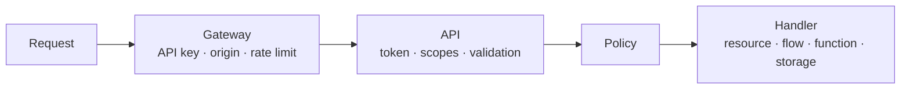

Policies are only as strong as the coverage of the places that enforce them. This page lists every **enforcement point** in Pawabase, what it checks, when, with which default, and what it returns on refusal, plus the few paths that are deliberately *not* governed by caller policies and how they're protected instead.

## Find the attachment in Studio

An enforcement point is where a definition's policy reference becomes an access decision. In Studio, a resource exposes that reference in **Build → Resources** → **Access**, where every enabled operation has its own switch and **Policy** picker. The picker label **Secret keys only** for an empty resource policy is consequential: it is not the same default used by routes or buckets.

The distinction continues outside Resources. **Build → Policies** manages named conditions behind saved references; **Settings → Realtime** contains **Default policy**, **Subscribe**, and **Publish** controls for channel rules; bucket forms label their fields **Read policy** and **Write policy**. Read each control together with this page's enforcement point, because a selected name is universal but the context and default are not.

## The layers of a request

Before any policy runs, two other layers have already made decisions:



| Layer | Decides | Refusal |
| --- | --- | --- |
| Gateway | Is the API key valid for this environment? Is the origin allowed (publishable keys)? Within rate limits? | `401`, CORS failure, `429` |
| Authentication | Is the user token valid, unexpired and for this environment? | `401` |
| Scopes | Does the key carry the operation's scope? | `403` |
| Validation | Is the body well-formed? | `422` |
| **Policy** | May this caller do this, to this data? | `403` / `404` |

Policies are the last line, not the only one. But they're the only line that understands your data.

## Resource operations

The most important enforcement point, and the most nuanced.

| Operation | Scope | When the policy runs | `$record` | Refusal |
| --- | --- | --- | --- | --- |
| `list` | `resource:read` | Planned before the query; residual per row | each row | `403` if decided false up front; otherwise rows are just excluded |
| `get` | `resource:read` | After loading the row | the row | `404` |
| `create` | `resource:write` | After validation and owner-field assignment, before insert | the new row | `403` (`401` if an owner field needs a user) |
| `update` | `resource:write` | After loading the existing row, before the update | the existing row | `403` for signed-in callers, `404` for anonymous |
| `delete` | `resource:write` | After loading the row, before the delete | the row | `403` for signed-in callers, `404` for anonymous |

**Defaults:** an operation must be **enabled** to exist at all. An enabled operation with policy `null` admits **only secret keys and operators**.

**Expand:** related rows returned by `?expand=` are checked against the **related** resource's read policy (`get`, falling back to `list`) and shaped by its transformer. A relation to a resource with no read operation returns related rows only to service credentials.

**Side effects:** after a permitted write, events, realtime publication and cache invalidation happen regardless of who wrote. They're part of the data, not the request.

## Custom routes

```json
{ "method": "POST", "path": "/finance/payments", "policy": "finance_staff", "…": "…" }
```

- Scope: `routes:invoke`.
- The policy runs **before** the handler, with `$input` (the validated body) and `$request.params`. No `$record`.
- Default when `null`: `authenticated`.
- Refusal: `403`.

Record-level checks belong **inside** the handler: a flow loads the record and uses `control.if` / `policy.check` / `error.raise`.

## Direct flow invocation

`POST /flows/v1/<name>` runs a flow directly if it has a `trigger.http` node **without a path**. That node's `policy` config decides access (default `authenticated`). Flows with only path-bound HTTP triggers can't be invoked directly; they're served by custom routes.

## Functions

`POST /functions/v1/<name>` checks the function's `@function(policy=…)`, default `authenticated`. When a function is the handler of a custom route, the **route's** policy applies to the request, and the function runs as the handler.

```python
@function("next_admission_no", policy="school_admin")
async def next_admission_no(ctx): ...
```

## Storage

Every object operation checks the bucket's policies:

| Operation | Endpoint | Action | Policy |
| --- | --- | --- | --- |
| Download | `GET /storage/v1/object/{bucket}/{key}` | `read` | read policy (or public) |
| List | `GET /storage/v1/list/{bucket}` | `list` | read policy |
| Upload | `PUT`/`POST /storage/v1/object/{bucket}/{key}` | `write` | write policy |
| Delete | `DELETE /storage/v1/object/{bucket}/{key}` | `delete` | write policy |
| Create a signed URL | `POST /storage/v1/sign/{bucket}/{key}` | the requested method | the policy for that action |

- **Signed URLs** carry a grant. Whoever holds the URL may perform that one action until it expires, without an API key or token. The policy is checked when the URL is **created**, not when it's used. Keep expiry short.
- Public buckets allow reads by anyone (no key needed); writes still need the write policy.
- Defaults: `authenticated` for both (reads open for public buckets).
- Bucket policies must be JSON conditions; they see `$auth`, `$credential` and `$object`.

[Storage access →](/storage/access)

## Realtime

Each channel operation is checked against the first **channel rule** whose pattern matches:

| Client action | Policy |
| --- | --- |
| `subscribe` (and `history`) | the rule's `subscribe` |
| `publish` | the rule's `publish` (and the environment must allow client publishing) |
| `presence` | allowed if the rule enables presence and the client is subscribed |

Channels matching no rule use the environment's realtime `default_policy` (`authenticated` by default). Templated patterns like `user:{{ auth.user_id }}` claim every `user:*` channel, so another user's private channel is refused by the template rather than falling through to the default. Servers publish over HTTP with a secret key. [Channel rules →](/realtime/channel-rules)

## Inside flows

The `policy.check` block evaluates any policy with an explicit `record` and `input` and the flow's caller context, following `allowed` or `denied`. Use it when a route's handler needs a record-level decision:

```text
http → resource.get invoice → policy.check family_access (record = invoice)
     → allowed: continue
     → denied:  error.raise 404
```

## What is not governed by caller policies

Some paths have no "caller" in the policy sense. They're protected differently:

| Path | Protection |
| --- | --- |
| **Secret keys and operators** | Bypass policies by design. Protect the keys; use scoped keys for integrations. |
| **Flows and functions writing data** | Run with platform rights. Guard their **entry** (route, trigger, `@function` policy) and validate inside. |
| **Event subscriptions, webhooks, schedules** | Triggered by the platform, not callers. Subscription `condition`s filter events; they don't authorise people. |
| **Inbound hooks** (`/hooks/v1/…`) | Verified by signature (HMAC, Pawabase signature or token), not by policy. Treat payloads as untrusted input. |
| **Auth endpoints** (`/auth/v1/…`) | Akountz's own rules: sign-up enabled, password policy, lockout, redirect allowlists, MFA. |
| **The database console** | Operators only, audited; writes need an explicit opt-in. |
| **Direct database access** | Outside Pawabase entirely. Use your database's own users and network controls. |

<Warning>
Because flows write with platform rights, a flow triggered by a **public** route can write anything its blocks are configured to write. Always give public routes a tight policy and validate inputs inside the flow (types come from the route's schema; business rules from `control.if`).
</Warning>

## Defaults at a glance

| Enforcement point | Policy when unset |
| --- | --- |
| Resource operation (enabled) | Secret keys and operators only |
| Custom route | `authenticated` |
| Direct flow call | `authenticated` |
| Function | `authenticated` |
| Bucket read | `authenticated` (anyone if public) |
| Bucket write | `authenticated` |
| Realtime channel (no rule) | `default_policy`, `authenticated` unless changed |

## Coverage review

Use this list when reviewing a project:

<Check>Every enabled resource operation has a deliberate policy.</Check>
<Check>Resources nobody should write directly (payments, audit tables) have `create`/`update`/`delete` disabled, and are written only by flows.</Check>
<Check>Every custom route has a policy at least as strict as the data its flow writes.</Check>
<Check>Buckets holding personal data aren't public, and their key layout supports per-user or per-org rules.</Check>
<Check>Channel rules exist for every channel family your apps use, especially `resource:*` change feeds.</Check>
<Check>Inbound hooks use signature verification (not `none`) in production.</Check>
<Check>Secret keys live only on servers; integrations use scoped keys.</Check>

## Every enforcement point, systematically

The table below is the complete list of places a policy reference can be attached in Pawabase, cross-checked directly against the engine, gate and storage adapter source rather than against any single feature's docs. Each row names the exact field that carries the reference and the module responsible for evaluating it.

| # | Enforcement point | Where the reference lives | Evaluated by |
| --- | --- | --- | --- |
| 1 | Resource `list` | `operations.list.policy` | `PolicyEngine.plan` (planned, then `row_allowed` per residual row) |
| 2 | Resource `get` | `operations.get.policy` | `PolicyEngine.check` |
| 3 | Resource `create` | `operations.create.policy` | `PolicyEngine.check` |
| 4 | Resource `update` | `operations.update.policy` | `PolicyEngine.check` |
| 5 | Resource `delete` | `operations.delete.policy` | `PolicyEngine.check` |
| 6 | Expanded/related reads (`?expand=`) | the related resource's own `get`/`list` policy | `PolicyEngine.check`/`plan`, recursively |
| 7 | Custom route | `policy` on the route definition | `PolicyGate.authenticate` (a Sillo `useAuth` subclass) |
| 8 | Direct flow invocation | `policy` on the flow's path-less `trigger.http` node | `PolicyGate`, same as a route |
| 9 | Function (`/functions/v1/<name>`) | `@function(policy=...)` | `PolicyGate` |
| 10 | Function as a route handler | the **route's** policy, not the function's own | `PolicyGate` on the route |
| 11 | Storage read/list/stat | bucket `read_policy` | `PolicyStorage.allows` |
| 12 | Storage write/delete | bucket `write_policy` | `PolicyStorage.allows` |
| 13 | Signed URL creation | the policy for the requested action, checked once at creation | `PolicyStorage.allows`, via the signing endpoint |
| 14 | Realtime `subscribe`/`history` | the matching channel rule's `subscribe` | the realtime service's policy check (same `PolicyEngine`) |
| 15 | Realtime `publish` | the matching channel rule's `publish` | same, plus the environment's client-publish toggle |
| 16 | Realtime `presence` | the channel rule's presence flag | same, gated on an active subscription |
| 17 | Flow `policy.check` block | the block's `policy` config, with an explicit `record`/`input` | `PolicyEngine.check`, called directly by the block |

This list was cross-checked against `apps/docs/policies/overview.mdx` (entry-point table and "where policies apply" section), `apps/docs/flows/platform-blocks.mdx` (the `policy.check` block's exact config fields and its interaction with `auth.require`), and the engine, gate and storage source directly. One realtime doc page (`apps/docs/realtime/channel-rules.mdx`) currently contains inaccuracies — it describes policy evaluation happening "at the gateway" before proxying to a component it calls "Angula," and lists operators (`neq`, `and`, `or`) that don't exist in the condition language (the real operators are `ne`, `all`, `any` — see [operators](/policies/operators)). Rows 14–16 above are stated from the engine and this page's own pre-existing, verified content rather than from that page; if you're cross-referencing realtime documentation elsewhere, prefer this page and [conditions](/policies/conditions)/[operators](/policies/operators) for the actual condition grammar.

There is no enforcement point beyond this list. If you've added a route, a function, a bucket, a channel, or a flow trigger and it doesn't appear above, it either inherits its policy from something that does (a route-handled function, entry 10) or it is one of the explicitly ungoverned paths in [what is not governed by caller policies](#what-is-not-governed-by-caller-policies).

### Resource operations: the five-row table, expanded

The core table earlier on this page gives the *when* and the *refusal* for each operation. Here's the *why* behind two rows that are easy to misread.

**Why `create` can return `401` instead of `403`.** Most policy refusals for signed-in callers are `403` — the caller is known, they're just not allowed to do this. `create` is the one operation where an **anonymous** caller can be refused with `401` instead: when the resource has an owner field, the server needs a `$auth.user_id` to stamp onto the new row, and an anonymous caller has none. This isn't strictly a policy decision (the policy might be `authenticated`, which would refuse an anonymous caller with `403` on its own) — it's specifically the owner-field assignment step failing before the policy even gets a fully-formed candidate row to evaluate, which the platform reports as "you need to be signed in" (`401`) rather than "you're signed in but not allowed" (`403`).

**Why `get` on a nonexistent row and `get` on a row you can't see look identical.** Both return `404` with the same generic body. This is deliberate (see [from decision to HTTP response](/policies/overview#from-decision-to-http-response) on the overview page), but it has a debugging consequence worth stating plainly here: you cannot distinguish "this id was never valid" from "this id is valid but refused" by inspecting the response alone. The only way to tell them apart is to repeat the request with a secret key (bypasses the policy) or check Studio's Observability, which records the policy's decision even when the client-facing response hides it.

### Custom routes: what the gate does before your handler runs

`PolicyGate` (a `sillo.auth.useAuth` subclass) runs in two steps, both before your route's own code executes:

1. **Authenticate.** It calls the parent `useAuth.authenticate`, which resolves whatever credential the request carries (token, key, or neither) into the `auth`/`credential` parts of the context, without yet deciding anything about the route's specific policy.
2. **Scope, then policy.** If the gate was configured with a `scope` argument (as it is for every resource-operation route Pawabase generates internally, and as you can configure on your own routes), it checks `platform.allows_scope(scope)` first and raises `PermissionDenied` with a scope-specific message if it's missing — **before** the policy runs at all. Only once the scope check passes does it build the full policy context (`build_policy_context`) and call `engine.check(self.policy, context)`.

The order matters for what error a caller sees: a request with the right token but a key that lacks `resource:write` gets the scope error, never the policy's own refusal reason, even if the policy would also have refused it. If you're debugging "why does this request fail" and the error mentions a scope rather than a policy name, the policy never ran.

### Storage: the read/write split, and what "action" means to a condition

`PolicyStorage.allows` maps five possible actions down to just two policies: `read`, `list`, and `stat` all check `read_policy`; everything else (`write`, `delete`) checks `write_policy`. There's no separate policy for "delete" versus "upload" — if a bucket's use case needs uploads allowed but deletes forbidden for the same role, that distinction has to be expressed **inside** the write condition itself, using `$object.action`:

```json
// write_policy: uploads by members, deletes by admins only
{ "any": [
  { "all": [ { "eq": ["$object.action", "write"] }, { "role": "member" } ] },
  { "all": [ { "eq": ["$object.action", "delete"] }, { "role": "admin" } ] }
] }
```

Without checking `$object.action` explicitly, a single `write_policy` of `{"role": "member"}` grants members both upload **and** delete on every object the policy admits — a common surprise for a first storage setup, since "write" reads like "upload" but covers deletion too.

### Realtime: the "first matching rule wins" behavior, precisely

Channel rules are matched by pattern, and the **first** rule whose pattern matches the channel name is the one whose `subscribe`/`publish` policy applies — later rules that would also match are never consulted, even if they're more specific. A templated pattern like `user:{{ auth.user_id }}` matches only the *literal* channel name for the current caller (Pawabase substitutes the template before comparing), so it doesn't accidentally intercept a differently-shaped channel; but two **static** rules that both match the same literal name, or a broad rule ordered before a narrow one, resolve by whichever comes first in the rule list. When authoring channel rules, order the most specific patterns first, exactly as you would with routing rules in any pattern-matching system — this page is the canonical source for that behavior even where other realtime documentation is inconsistent (see the note under [Every enforcement point, systematically](#every-enforcement-point-systematically) above).

### Flows: `policy.check` versus `auth.require`

Two blocks look similar but answer different questions, and they compose:

- **`auth.require`** is the flow equivalent of a route's `policy: "authenticated"` gate — it asks only "is there a valid signed-in caller at this point in the flow," with no record or input involved. Use it right after a trigger that has no policy of its own (an event trigger, a schedule), to guard a manual re-run of the same flow, since schedule and event triggers don't have a caller-facing policy the way `trigger.http` does.
- **`policy.check`** asks the full question — any policy reference, against an explicit `record` and `input` you supply — and branches on `allowed`/`denied` rather than raising by itself. It's the block you reach for once "is anyone signed in" isn't precise enough and the decision genuinely depends on *which* record or *what* was submitted.

A flow can use both: `auth.require` immediately after a schedule trigger to stop a manual "run now" from an unauthenticated context, then a `policy.check` deeper in the flow once a specific record has been loaded and there's something record-shaped to evaluate against.

## Compared with Supabase and Firebase

| Entry point | Pawabase | Supabase | Firebase |
| --- | --- | --- | --- |
| Table/collection rows | Policies per operation, planned into SQL | RLS per table and command | Rules per document path |
| Custom endpoints | Route policies | Edge Functions check auth themselves | Cloud Functions check auth themselves |
| Files | Bucket read/write policies | RLS on `storage.objects` | Storage rules |
| Realtime | Channel rules with policies | Realtime authorization via RLS on `realtime.messages` | Rules apply to listeners |
| Server bypass | Secret key | `service_role` key | Admin SDK |

The shape is similar across all three: a server credential that bypasses rules, and rules at each entry point. Pawabase's difference is one condition language and one policy library across all of them.
