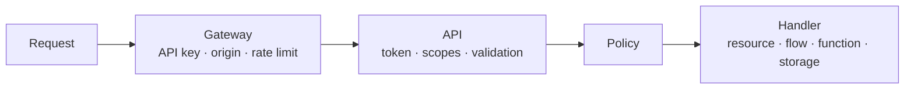

Policies are only as strong as the coverage of the places that enforce them. This page lists every **enforcement point** in Pawabase, what it checks, when, with which default, and what it returns on refusal, plus the few paths that are deliberately *not* governed by caller policies and how they're protected instead.

## The layers of a request

Before any policy runs, two other layers have already made decisions:



| Layer | Decides | Refusal |
| --- | --- | --- |
| Gateway | Is the API key valid for this environment? Is the origin allowed (publishable keys)? Within rate limits? | `401`, CORS failure, `429` |
| Authentication | Is the user token valid, unexpired and for this environment? | `401` |
| Scopes | Does the key carry the operation's scope? | `403` |
| Validation | Is the body well-formed? | `422` |
| **Policy** | May this caller do this, to this data? | `403` / `404` |

Policies are the last line, not the only one. But they're the only line that understands your data.

## Resource operations

The most important enforcement point, and the most nuanced.

| Operation | Scope | When the policy runs | `$record` | Refusal |
| --- | --- | --- | --- | --- |
| `list` | `resource:read` | Planned before the query; residual per row | each row | `403` if decided false up front; otherwise rows are just excluded |
| `get` | `resource:read` | After loading the row | the row | `404` |
| `create` | `resource:write` | After validation and owner-field assignment, before insert | the new row | `403` (`401` if an owner field needs a user) |
| `update` | `resource:write` | After loading the existing row, before the update | the existing row | `403` for signed-in callers, `404` for anonymous |
| `delete` | `resource:write` | After loading the row, before the delete | the row | `403` for signed-in callers, `404` for anonymous |

**Defaults:** an operation must be **enabled** to exist at all. An enabled operation with policy `null` admits **only secret keys and operators**.

**Expand:** related rows returned by `?expand=` are checked against the **related** resource's read policy (`get`, falling back to `list`) and shaped by its transformer. A relation to a resource with no read operation returns related rows only to service credentials.

**Side effects:** after a permitted write, events, realtime publication and cache invalidation happen regardless of who wrote. They're part of the data, not the request.

## Custom routes

```json
{ "method": "POST", "path": "/finance/payments", "policy": "finance_staff", "…": "…" }
```

- Scope: `routes:invoke`.
- The policy runs **before** the handler, with `$input` (the validated body) and `$request.params`. No `$record`.
- Default when `null`: `authenticated`.
- Refusal: `403`.

Record-level checks belong **inside** the handler: a flow loads the record and uses `control.if` / `policy.check` / `error.raise`.

## Direct flow invocation

`POST /flows/v1/<name>` runs a flow directly if it has a `trigger.http` node **without a path**. That node's `policy` config decides access (default `authenticated`). Flows with only path-bound HTTP triggers can't be invoked directly; they're served by custom routes.

## Functions

`POST /functions/v1/<name>` checks the function's `@function(policy=…)`, default `authenticated`. When a function is the handler of a custom route, the **route's** policy applies to the request, and the function runs as the handler.

```python
@function("next_admission_no", policy="school_admin")
async def next_admission_no(ctx): ...
```

## Storage

Every object operation checks the bucket's policies:

| Operation | Endpoint | Action | Policy |
| --- | --- | --- | --- |
| Download | `GET /storage/v1/object/{bucket}/{key}` | `read` | read policy (or public) |
| List | `GET /storage/v1/list/{bucket}` | `list` | read policy |
| Upload | `PUT`/`POST /storage/v1/object/{bucket}/{key}` | `write` | write policy |
| Delete | `DELETE /storage/v1/object/{bucket}/{key}` | `delete` | write policy |
| Create a signed URL | `POST /storage/v1/sign/{bucket}/{key}` | the requested method | the policy for that action |

- **Signed URLs** carry a grant. Whoever holds the URL may perform that one action until it expires, without an API key or token. The policy is checked when the URL is **created**, not when it's used. Keep expiry short.
- Public buckets allow reads by anyone (no key needed); writes still need the write policy.
- Defaults: `authenticated` for both (reads open for public buckets).
- Bucket policies must be JSON conditions; they see `$auth`, `$credential` and `$object`.

[Storage access →](/storage/access)

## Realtime

Each channel operation is checked against the first **channel rule** whose pattern matches:

| Client action | Policy |
| --- | --- |
| `subscribe` (and `history`) | the rule's `subscribe` |
| `publish` | the rule's `publish` (and the environment must allow client publishing) |
| `presence` | allowed if the rule enables presence and the client is subscribed |

Channels matching no rule use the environment's realtime `default_policy` (`authenticated` by default). Templated patterns like `user:{{ auth.user_id }}` claim every `user:*` channel, so another user's private channel is refused by the template rather than falling through to the default. Servers publish over HTTP with a secret key. [Channel rules →](/realtime/channel-rules)

## Inside flows

The `policy.check` block evaluates any policy with an explicit `record` and `input` and the flow's caller context, following `allowed` or `denied`. Use it when a route's handler needs a record-level decision:

```text
http → resource.get invoice → policy.check family_access (record = invoice)
     → allowed: continue
     → denied:  error.raise 404
```

## What is not governed by caller policies

Some paths have no "caller" in the policy sense. They're protected differently:

| Path | Protection |
| --- | --- |
| **Secret keys and operators** | Bypass policies by design. Protect the keys; use scoped keys for integrations. |
| **Flows and functions writing data** | Run with platform rights. Guard their **entry** (route, trigger, `@function` policy) and validate inside. |
| **Event subscriptions, webhooks, schedules** | Triggered by the platform, not callers. Subscription `condition`s filter events; they don't authorise people. |
| **Inbound hooks** (`/hooks/v1/…`) | Verified by signature (HMAC, Pawabase signature or token), not by policy. Treat payloads as untrusted input. |
| **Auth endpoints** (`/auth/v1/…`) | Akountz's own rules: sign-up enabled, password policy, lockout, redirect allowlists, MFA. |
| **The database console** | Operators only, audited; writes need an explicit opt-in. |
| **Direct database access** | Outside Pawabase entirely. Use your database's own users and network controls. |

<Warning>
Because flows write with platform rights, a flow triggered by a **public** route can write anything its blocks are configured to write. Always give public routes a tight policy and validate inputs inside the flow (types come from the route's schema; business rules from `control.if`).
</Warning>

## Defaults at a glance

| Enforcement point | Policy when unset |
| --- | --- |
| Resource operation (enabled) | Secret keys and operators only |
| Custom route | `authenticated` |
| Direct flow call | `authenticated` |
| Function | `authenticated` |
| Bucket read | `authenticated` (anyone if public) |
| Bucket write | `authenticated` |
| Realtime channel (no rule) | `default_policy`, `authenticated` unless changed |

## Coverage checklist

Use this list when reviewing a project:

<Check>Every enabled resource operation has a deliberate policy.</Check>
<Check>Resources nobody should write directly (payments, audit tables) have `create`/`update`/`delete` disabled, and are written only by flows.</Check>
<Check>Every custom route has a policy at least as strict as the data its flow writes.</Check>
<Check>Buckets holding personal data aren't public, and their key layout supports per-user or per-org rules.</Check>
<Check>Channel rules exist for every channel family your apps use, especially `resource:*` change feeds.</Check>
<Check>Inbound hooks use signature verification (not `none`) in production.</Check>
<Check>Secret keys live only on servers; integrations use scoped keys.</Check>

## Compared with Supabase and Firebase

| Entry point | Pawabase | Supabase | Firebase |
| --- | --- | --- | --- |
| Table/collection rows | Policies per operation, planned into SQL | RLS per table and command | Rules per document path |
| Custom endpoints | Route policies | Edge Functions check auth themselves | Cloud Functions check auth themselves |
| Files | Bucket read/write policies | RLS on `storage.objects` | Storage rules |
| Realtime | Channel rules with policies | Realtime authorization via RLS on `realtime.messages` | Rules apply to listeners |
| Server bypass | Secret key | `service_role` key | Admin SDK |

The shape is similar across all three: a server credential that bypasses rules, and rules at each entry point. Pawabase's difference is one condition language and one policy library across all of them.
