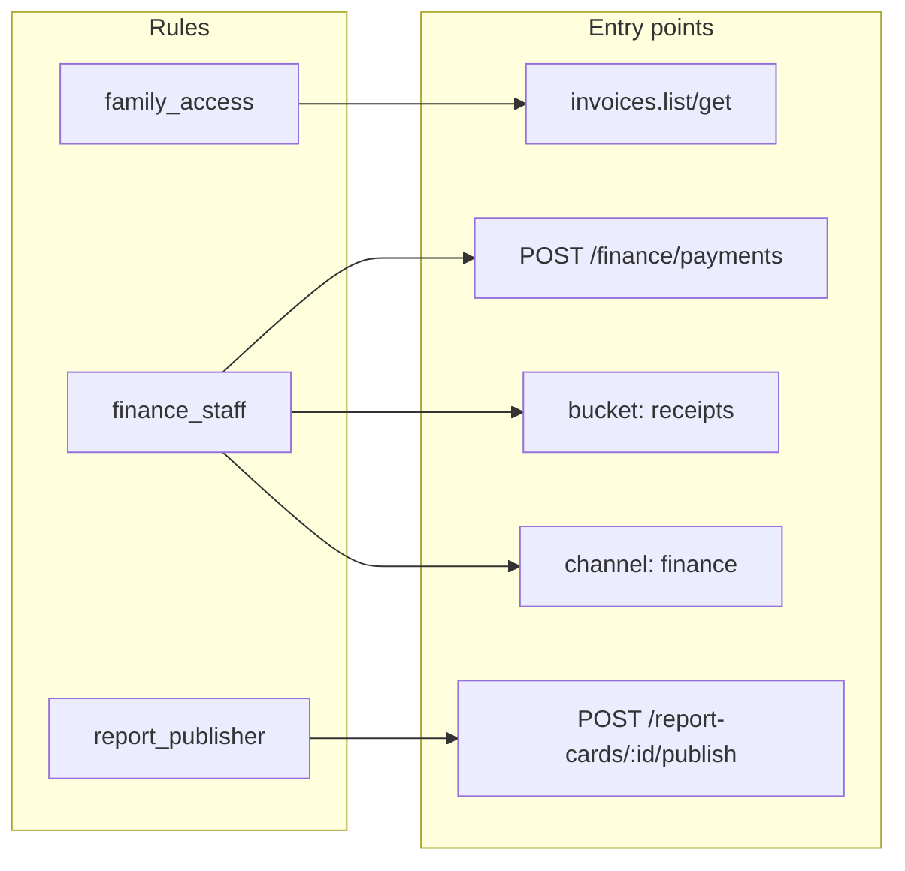
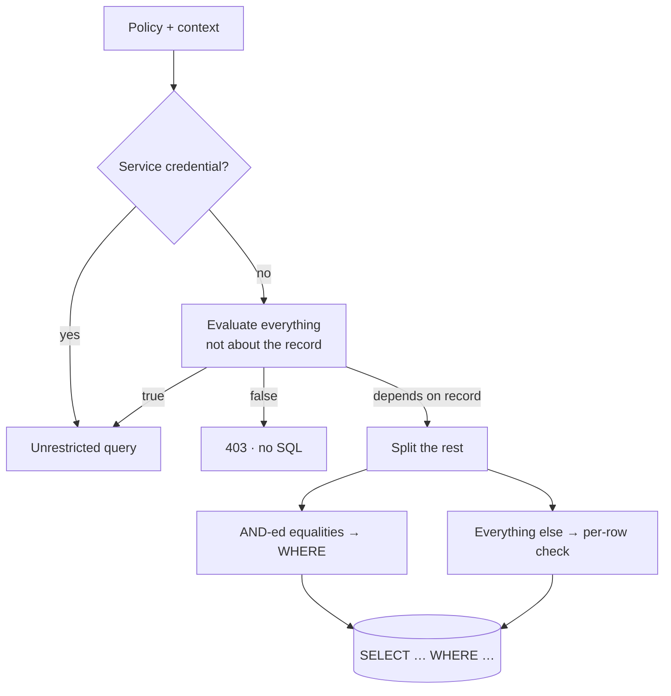

Every backend has to answer one question thousands of times a second: **may this caller do this?** In Pawabase that answer always comes from a **policy**, a small JSON condition that is stored as data, named, reused, versioned with the rest of your definitions, and evaluated by one engine wherever an access decision is made.

This page is the complete introduction. It explains what a policy is, what it can see, where it applies, how decisions turn into HTTP responses, and how to design a policy set that stays readable as your project grows. It ends with a side-by-side comparison with Supabase Row Level Security and Firebase Security Rules.

<CardGroup cols={3}>
  <Card title="Declarative" icon="file-json">A policy is JSON, not code. Studio edits it with a rule builder, the API validates it before saving, and promotion copies it.</Card>
  <Card title="Reusable" icon="recycle">Name a rule once (`finance_staff`) and reference it from resources, routes, buckets, channels and flows.</Card>
  <Card title="Database-aware" icon="database">On list requests, conditions on record fields are turned into SQL, so pagination and totals stay correct.</Card>
</CardGroup>

## A first policy

Here is the most common policy in any multi-user application, "people can only see their own rows":

```json
{
  "name": "own_rows",
  "description": "Signed-in users see their own rows",
  "condition": {
    "all": [
      { "authenticated": true },
      { "eq": ["$record.user_id", "$auth.user_id"] }
    ]
  }
}
```

Read it aloud: *all of these must hold: the caller is signed in, and the record's `user_id` equals the caller's user id.*

Three things are worth noticing already:

1. **Operands that start with `$` are paths** into the evaluation context (`$record.user_id`, `$auth.user_id`). Everything else is a literal value.
2. **The condition is data.** You can store it, diff it, review it in a pull request, and render it as a form.
3. **It doesn't say which operation it guards.** That's decided where you *reference* it, so the same `own_rows` policy can guard `get`, `update` and `delete` on five different resources.

Attaching it is one line in a resource definition:

```json
"operations": {
  "list":   { "enabled": true, "policy": "own_rows" },
  "get":    { "enabled": true, "policy": "own_rows" },
  "create": { "enabled": true, "policy": "authenticated" },
  "update": { "enabled": true, "policy": "own_rows" },
  "delete": { "enabled": true, "policy": "own_rows" }
}
```

<Tip>
For this exact rule you don't need to write a policy at all. The built-in shorthand `{"owner": "user_id"}` (or the reference `"owner:user_id"`) means the same thing. [Shorthands →](/policies/shorthands)
</Tip>

## Why policies instead of code

Most frameworks put access control inside request handlers: `if user.id != post.author_id: raise Forbidden()`. That works until:

- the same rule has to be enforced in five handlers, a background job and a websocket;
- a list endpoint forgets to filter and leaks rows;
- someone asks "who can read invoices?" and the answer is spread across twenty files.

Pawabase inverts this. Rules live in **one place per rule**, entry points **reference** them, and the engine applies them identically everywhere:



Changing who counts as finance staff is one edit, and every entry point follows on the next request.

## What a policy can see

When a policy runs, it's evaluated against a **context**: a JSON object describing the caller, the credential, the request and the data. Here is a realistic context for a guardian reading an invoice:

```json
{
  "auth": {
    "authenticated": true,
    "kind": "user",
    "user_id": "8",
    "email": "chioma.nwosu@example.com",
    "roles": ["guardian"],
    "permissions": ["family.read"],
    "org": null,
    "aal": "aal1",
    "session_id": "549136e9…",
    "claims": { "sub": "8", "roles": ["guardian"], "aal": "aal1", "…": "…" }
  },
  "credential": { "role": "publishable", "is_service": false, "scopes": [], "key_id": "k_9f2…" },
  "request": {
    "method": "GET",
    "path": "/rest/v1/invoices/44",
    "ip": "102.89.3.17",
    "params": { "id": "44" },
    "query": { "expand": "student" }
  },
  "project": "school",
  "env": "production",
  "record": {
    "id": 44, "invoice_no": "INV-202600001", "student_id": 12, "amount": 210000,
    "balance": 0, "status": "paid", "guardian_user_ids": ["8"]
  },
  "input": null
}
```

| Section | Where it comes from | Typical use |
| --- | --- | --- |
| `auth` | The user access token (Akountz), or an anonymous placeholder | Roles, ownership, organization, MFA level |
| `credential` | The API key the gateway resolved | Service bypass, key scopes |
| `request` | The HTTP request | Path params, query, client IP |
| `record` | The row being read or written | Ownership, status, tenancy |
| `input` | The submitted body | Restricting what may be written |
| `project`, `env` | The platform context | Environment-specific rules |
| `now` | The clock | Time windows |

Storage policies also see `$object` (`key`, `segments`, `action`), subscription conditions see `$event`, and flows can pass any record and input to the `policy.check` block. The full list is in the [context reference](/policies/context).

<Note>
`record` depends on the operation. For `create` it's the **new** row (after the owner field is set). For `update` it's the row **before** the change, and `input` is the patch. That lets update policies reason about transitions: who owns it now, and what are they trying to change?
</Note>

## Where policies apply

One engine guards every way into your data:

| Entry point | Where you set the policy | If you leave it empty |
| --- | --- | --- |
| Resource `list` / `get` / `create` / `update` / `delete` | `operations.<op>.policy` | Secret keys and operators only |
| Custom route | `policy` on the route | `authenticated` |
| Direct flow invocation (`/flows/v1/<name>`) | `policy` on the flow's `trigger.http` node | `authenticated` |
| Function (`/functions/v1/<name>`) | `@function(policy=…)` in code | `authenticated` |
| Storage bucket | `read_policy`, `write_policy` | `authenticated` (reads are open when the bucket is public) |
| Realtime channel | `subscribe`, `publish` on a channel rule | `authenticated` |
| Event subscription | `condition` (filters events rather than callers) | every matching event |
| Inside a flow | `policy.check` block | — |

[Enforcement points in depth →](/policies/enforcement-points)

## How a reference is written

Wherever a policy is accepted, you can give:

```json
"policy": "finance_staff"                 // a stored, Python or built-in policy, by name
"policy": "role:librarian"                // a parameterised built-in
"policy": "owner:borrower_user_id"        // …with a column
"policy": { "role": ["admin", "bursar"] } // an inline condition
"policy": ["mfa", "role:bursar"]          // a list: all must pass
"policy": null                            // the entry point's default (see above)
```

Six built-ins are always available: `public`, `deny`, `authenticated`, `service`, `owner` and `mfa`. [References →](/policies/references)

## From decision to HTTP response

The engine returns a **decision** (allowed or refused, the policy's name and a reason such as `policy 'finance_staff' refused`). The entry point turns it into a response:

| Situation | Status | Body |
| --- | --- | --- |
| No token where one is needed, or an owner field on an anonymous create | `401` | `Authentication required` |
| API key lacks the needed scope | `403` | `This API key lacks the 'resource:write' scope` |
| `create` refused | `403` | `policy 'teaching_staff' refused` |
| `get` of a row the caller can't read | `404` | `Not found` (the row's existence isn't revealed) |
| `update` / `delete` refused, signed-in caller | `403` | `policy 'author_or_admin' refused` |
| `update` / `delete` refused, anonymous caller | `404` | `Not found` |
| `list` whose policy is false before any SQL | `403` | the policy's reason |
| `list` with a residual | `200` | only the permitted rows |
| Custom route, function or flow refused | `403` | the policy's reason |

<Tip>
A `404` on a record you know exists almost always means a **read policy** is hiding it. Try the same request with a secret key: if it's found, the policy is the reason.
</Tip>

## Lists are planned, not filtered after the fact

Checking a policy on one row is simple. On a list it's the difference between a correct API and a subtly broken one. Pawabase **plans** the policy before the query:

1. Everything that doesn't depend on the row (roles, authentication, scopes, request data) is evaluated immediately. If the result is `true`, the query runs unrestricted; if it's `false`, the request is refused with no SQL.
2. What's left mentions only record fields. **AND-ed equalities** between a record field and a known value (`$record.user_id == "8"`) become SQL `WHERE` clauses.
3. Anything else is a **residual** checked on each row as it's read.



That's why `GET /rest/v1/notes` for Ada returns full pages of *her* notes with an exact `total`, rather than a page of 20 rows with 3 left after filtering. [Pushdown in depth →](/policies/pushdown)

## Secret keys bypass policies

Requests made with a **secret key**, and operator requests from Studio, are *service credentials*. The engine allows them before evaluating anything:

```text
Decision(allowed=True, policy="service", reason="service credential bypasses policies")
```

This is deliberate: your own servers, scripts and admin tools need full access, and routing them through policies would force you to model "the backend itself" as a user. The consequence is equally deliberate: **a secret key must never reach a browser or an app.** Use publishable keys in clients and let policies do their job.

If a server integration should have *limited* power, give it a secret key with [scopes](/concepts/credentials#scopes) (for example `resource:read` only), or a publishable key plus a service-account user whose roles your policies recognise.

## Defining policies

<Tabs>
  <Tab title="In Studio">
    <Steps>
      <Step title="Open Policies">Go to **Build → Policies → New policy**.</Step>
      <Step title="Name it after who it admits">`finance_staff`, `family_access`, `report_publisher`. Names are fixed once created.</Step>
      <Step title="Build the rule">
        The **Who passes** section is a rule builder. Choose **All of**, **Any of** or **None of**, then add rules:
        - *Is signed in*, *Has role*, *Has permission*, *Owns the record (field)*, *Uses a secret key*, *Signed in with 2FA*, *Key has scope*, *Caller kind is*;
        - *Compare values…* for any `left op right` comparison, with autocomplete for common paths like `$auth.user_id` and `$record.owner_id`;
        - *Check a value…* for `exists`, `truthy` and `empty`;
        - **Group** to nest another All/Any/None block.
      </Step>
      <Step title="Check the JSON">The **JSON** tab shows exactly what will be stored. Edit either view; they stay in sync.</Step>
      <Step title="Save">The condition is validated before it's stored. Invalid operators or shapes are refused with a message.</Step>
    </Steps>
    <Frame caption="The rule builder for report_access.">
      
    </Frame>
  </Tab>
  <Tab title="With the Platform API">
    ```bash
    curl -X POST "$STUDIO/studio/api/platform/projects/school/envs/development/policies" \
      -H "content-type: application/json" -H "X-XSRF-TOKEN: $XSRF" -b cookies.txt \
      -d '{
        "name": "finance_staff",
        "description": "The bursary, plus school admins.",
        "condition": { "role": ["admin", "principal", "bursar"] }
      }'
    ```
    Replace with `PUT …/policies/finance_staff`, delete with `DELETE`. Definitions scripts usually upsert: try `PUT`, fall back to `POST` on `404`.
  </Tab>
  <Tab title="In Python">
    For rules a JSON condition can't express (calling another service, walking a graph), register a Python policy in project code:
    ```python code/school/policies.py
    from pawabase_kit.policies import policy

    @policy("same_department", description="Staff in the record's department")
    async def same_department(context):
        me = context["auth"].get("claims", {}).get("app", {}).get("department_id")
        return me is not None and str(me) == str((context.get("record") or {}).get("department_id"))
    ```
    Reference it by name like any other. [Python policies →](/policies/python-policies)
  </Tab>
</Tabs>

## Designing a policy set

Good policy sets read like an org chart, not like a list of endpoints.

<Steps>
  <Step title="List the actors">
    Who uses the system? For a school: admins, the principal, teachers, the bursar, the librarian, guardians, students, and your own servers.
  </Step>
  <Step title="Name groups of actors">
    `staff`, `school_admin`, `teaching_staff`, `finance_staff`, `library_staff`. These are role-only policies, cheap to evaluate and easy to reason about.
  </Step>
  <Step title="Name relationships to data">
    `family_access` (staff, the student themself, or a guardian), `author_or_admin`, `borrower_or_library`. These combine actor groups with record conditions.
  </Step>
  <Step title="Name state-dependent rules">
    `report_access` (staff, or family once published), `announcement_audience` (staff, or published and addressed to the caller's role).
  </Step>
  <Step title="Attach them per operation">
    Reads are usually broader than writes; deletes are usually narrowest. Fill in the table resource by resource.
  </Step>
</Steps>

| Resource | list / get | create | update | delete |
| --- | --- | --- | --- | --- |
| `students` | `family_access` | `school_admin` | `school_admin` | `school_admin` |
| `invoices` | `family_access` | `finance_staff` | `finance_staff` | `school_admin` |
| `payments` | `finance_staff` | `finance_staff` | *disabled* | *disabled* |
| `report_cards` | `report_access` | `teaching_staff` | `teaching_staff` | `school_admin` |

That table *is* your access-control documentation. Keep it in your README.

## A complete worked example: a blog

Requirements:

- anyone can read **published** posts;
- signed-in users can create posts (they become the author);
- authors can edit and delete their **own drafts**;
- editors can edit any post and publish it;
- only admins can delete published posts.

<Steps>
  <Step title="Resource settings">
    `posts` with fields `title`, `body`, `status` (`draft`/`published`), `author_id`, and **owner field** `author_id`, so the author is set by the server on create.
  </Step>
  <Step title="Policies">
    ```json
    // readable_post
    { "any": [
      { "eq": ["$record.status", "published"] },
      { "owner": "author_id" },
      { "role": ["editor", "admin"] }
    ] }
    ```
    ```json
    // editable_post
    { "any": [
      { "role": ["editor", "admin"] },
      { "all": [ { "owner": "author_id" }, { "eq": ["$record.status", "draft"] },
                 { "not": { "eq": ["$input.status", "published"] } } ] }
    ] }
    ```
    ```json
    // deletable_post
    { "any": [
      { "role": "admin" },
      { "all": [ { "owner": "author_id" }, { "eq": ["$record.status", "draft"] } ] }
    ] }
    ```
  </Step>
  <Step title="Attach">
    `list`/`get` → `readable_post`, `create` → `authenticated`, `update` → `editable_post`, `delete` → `deletable_post`.
  </Step>
  <Step title="Test the edges">
    ```bash
    # anonymous: only published posts
    curl "$GW/rest/v1/posts" -H "apikey: $PK"
    # an author trying to publish their own draft: 403
    curl -X PATCH "$GW/rest/v1/posts/7" -H "apikey: $PK" -H "Authorization: Bearer $AUTHOR" \
      -H "content-type: application/json" -d '{"status": "published"}'
    # an editor publishing it: 200
    curl -X PATCH "$GW/rest/v1/posts/7" -H "apikey: $PK" -H "Authorization: Bearer $EDITOR" \
      -H "content-type: application/json" -d '{"status": "published"}'
    ```
  </Step>
</Steps>

Notice how `editable_post` uses `$input` to forbid a *transition* (draft → published) for authors, while letting them edit their drafts freely. That's the kind of rule that's awkward in most systems and one line here.

## Compared with Supabase and Firebase

<Tabs>
  <Tab title="Supabase RLS">
    Supabase enforces access with Postgres **Row Level Security**: SQL `CREATE POLICY` statements per table and command, evaluated by the database for every row.
    ```sql
    create policy "own rows" on notes for select
      using (auth.uid() = user_id);
    ```
    | | Supabase RLS | Pawabase policies |
    | --- | --- | --- |
    | Language | SQL expressions | JSON conditions (+ Python escape hatch) |
    | Reuse | Copy per table/command, or SQL functions | Named policies referenced anywhere |
    | Scope | Tables (and storage via `storage.objects`) | Resources, routes, functions, flows, buckets, channels |
    | Where evaluated | Inside Postgres | In the platform, with equalities pushed into SQL |
    | Databases | Postgres only | Postgres, MySQL, SQLite |
    | Editing | SQL in migrations or the dashboard | Rule builder, JSON, API; promoted between environments |
    RLS is extremely powerful when your team thinks in SQL, and it protects the database even from direct connections. Pawabase policies cover more entry points with one vocabulary and don't require your database to be Postgres. [Full comparison →](/compare/supabase)
  </Tab>
  <Tab title="Firebase Security Rules">
    Firebase uses its own rules language, evaluated per document request:
    ```js
    match /notes/{id} {
      allow read, update, delete: if request.auth != null && request.auth.uid == resource.data.userId;
      allow create: if request.auth != null;
    }
    ```
    | | Firebase rules | Pawabase policies |
    | --- | --- | --- |
    | Language | Custom rules DSL | JSON conditions |
    | Queries | Rules aren't filters: queries must be constrained to match the rules or they fail | Policies are planned into the query; lists return what you may see |
    | Reuse | Functions inside the rules file | Named policies across all entry points |
    | Roles | Custom claims, set from a server | Roles and permissions managed in Akountz, in every token |
    | Deploy | `firebase deploy` of a rules file | Saved in Studio or via API, live on the next request |
    The biggest practical difference: in Firebase a query that *could* return a document you can't read is rejected, so clients must mirror the rules in their queries. In Pawabase the platform applies the policy to the query for you. [Full comparison →](/compare/firebase)
  </Tab>
</Tabs>

## Common mistakes

<AccordionGroup>
  <Accordion title="Leaving an operation's policy empty and expecting 'signed-in users'">
    For **resource operations**, `null` means *secret keys and operators only*, the safest default. Pick `authenticated` explicitly if that's what you mean.
  </Accordion>
  <Accordion title="Using a transformer to hide data">
    Transformers shape responses; they don't control access. A field omitted by a transformer is still readable by flows and still writable by anyone who can update the row. Use policies for access, `read_only`/`write_only` fields for what can be written or returned.
  </Accordion>
  <Accordion title="Filtering in the client instead of in a policy">
    If the UI filters `?filter[user_id]=me` but the policy is `authenticated`, anyone can remove the filter and read everything. The policy is the security boundary; filters only narrow what you're already allowed to see.
  </Accordion>
  <Accordion title="Making an admin-assigned user id the owner field">
    Owner fields are overwritten with whoever writes the row. For fields like `guardians.user_id` that an administrator sets, use a normal field and compare it in the policy.
  </Accordion>
  <Accordion title="ORs on huge tables">
    An `any` of record conditions can't be pushed into SQL, so lists check each row after reading. Fine for thousands of rows; for millions, restructure so an AND-ed equality on an indexed column does the narrowing. [Designing for pushdown →](/policies/pushdown#designing-for-pushdown)
  </Accordion>
  <Accordion title="Shipping a secret key in an app">
    Secret keys bypass every policy. If one ships in a client, every policy is irrelevant. Revoke it immediately and rotate. [API keys →](/operate/api-keys)
  </Accordion>
</AccordionGroup>

## FAQ

<AccordionGroup>
  <Accordion title="Can a policy query the database?">
    JSON conditions can't; they only read the context. Put the data they need in the token (roles, permissions, org) or on the record (denormalised ids like `guardian_user_ids`), or write a [Python policy](/policies/python-policies), which can do anything but can't be pushed into SQL.
  </Accordion>
  <Accordion title="Are policies evaluated for flows and functions writing data?">
    Flows and functions write through the platform runtime with service rights; resource policies don't re-run for their writes. Guard the **entry** to the flow or function (its route, trigger or `@function` policy), or use a `policy.check` block inside the flow for finer decisions.
  </Accordion>
  <Accordion title="How do I see why a request was refused?">
    The response carries the policy's name (`policy 'finance_staff' refused`). Studio's Observability records the policy used for each request. [Debugging →](/policies/debugging)
  </Accordion>
  <Accordion title="Do policy changes need a restart?">
    No. Saving a policy increments the environment version; the next request uses the new rule, and other services refresh their cached configuration within seconds.
  </Accordion>
  <Accordion title="Can different environments have different policies?">
    Yes. Policies are per environment like every definition. Normally you design in development and [promote](/operate/environments-and-promotion), but you can deliberately differ (for example a more open staging).
  </Accordion>
</AccordionGroup>

## Next

<CardGroup cols={2}>
  <Card title="The condition language" icon="brackets" href="/policies/conditions">Groups, comparisons, checks, paths and literals.</Card>
  <Card title="Shorthands" icon="zap" href="/policies/shorthands">`role`, `owner`, `permission`, `aal` and friends.</Card>
  <Card title="Pushdown" icon="arrow-down-to-line" href="/policies/pushdown">How lists stay correct and fast.</Card>
  <Card title="Recipes" icon="chef-hat" href="/policies/recipes">Tenancy, families, publishing, time windows.</Card>
</CardGroup>
