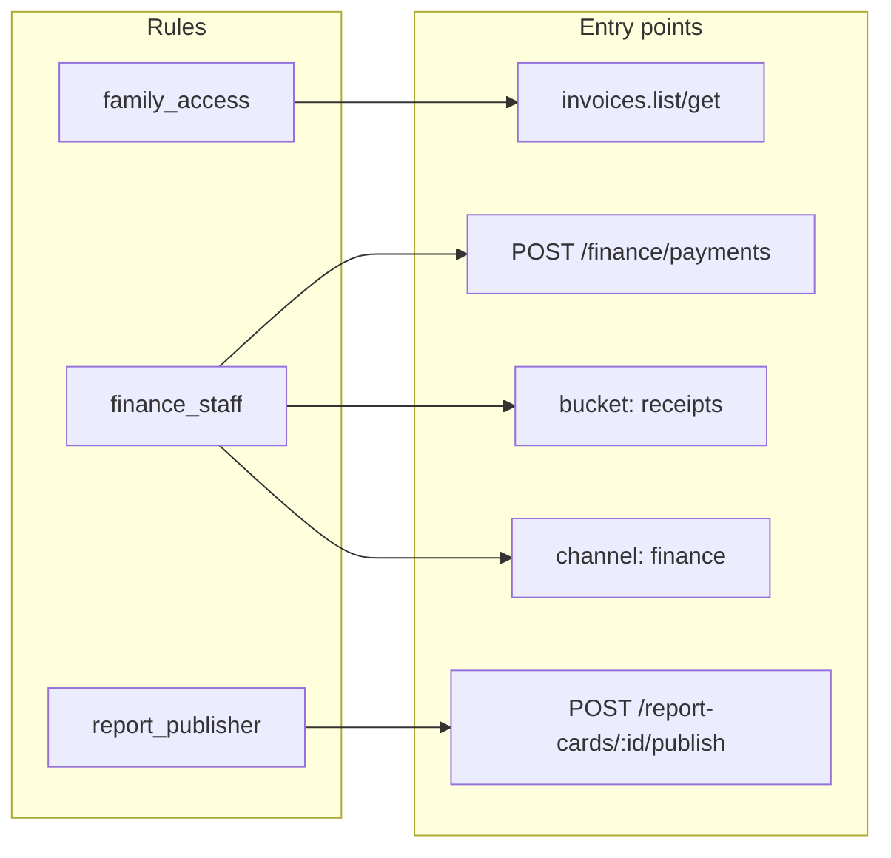
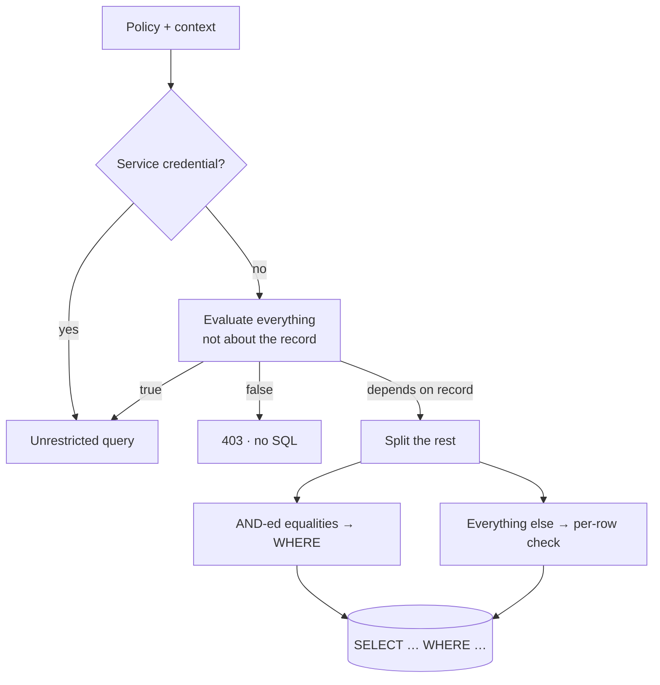

Every backend has to answer one question thousands of times a second: **may this caller do this?** In Pawabase that answer always comes from a **policy**, a small JSON condition that is stored as data, named, reused, versioned with the rest of your definitions, and evaluated by one engine wherever an access decision is made.

This page is the complete introduction. It explains what a policy is, what it can see, where it applies, how decisions turn into HTTP responses, and how to design a policy set that stays readable as your project grows. It ends with a side-by-side comparison with Supabase Row Level Security and Firebase Security Rules.

<CardGroup cols={3}>
  <Card title="Declarative" icon="file-json">A policy is JSON, not code. Studio edits it with a rule builder, the API validates it before saving, and promotion copies it.</Card>
  <Card title="Reusable" icon="recycle">Name a rule once ({`finance_staff`}) and reference it from resources, routes, buckets, channels and flows.</Card>
  <Card title="Database-aware" icon="database">On list requests, conditions on record fields are turned into SQL, so pagination and totals stay correct.</Card>
</CardGroup>

## The policy workspace in Studio

A policy is a named answer to an access question; an attachment is the place that asks that question. Keeping those ideas separate prevents a common mistake: editing one resource operation when the rule itself is shared by a route, bucket, or channel. In Studio, open **Build → Policies** to manage named answers. The list is headed **Policies**, shows each policy's **name** and **description**, and offers **New policy**.

The editor uses an identity area followed by **Who passes**. That panel writes the `condition` stored with the policy; its rule and group controls are not a separate rule language. A policy's **Name** is the reusable reference used by the **Policy** picker elsewhere in Studio. Its **Description** should state the intended boundary in reader language, such as “Signed-in users can read rows in their active organization,” because the condition alone may not explain the business decision.

<Info>
Saving a policy does not attach it. A resource uses its **Access** panel; routes, buckets, channel rules, and other policy-aware forms expose a **Policy**, **Read policy**, **Write policy**, **Subscribe**, or **Publish** picker. The picker offers built-ins, policies from **This project**, parameterised choices, custom rules, and **Must satisfy several policies (all of)…**.
</Info>

## A first policy

Here is the most common policy in any multi-user application, "people can only see their own rows":

```json
{
  "name": "own_rows",
  "description": "Signed-in users see their own rows",
  "condition": {
    "all": [
      { "authenticated": true },
      { "eq": ["$record.user_id", "$auth.user_id"] }
    ]
  }
}
```

Read it aloud: *all of these must hold: the caller is signed in, and the record's `user_id` equals the caller's user id.*

Three things are worth noticing already:

1. **Operands that start with `$` are paths** into the evaluation context (`$record.user_id`, `$auth.user_id`). Everything else is a literal value.
2. **The condition is data.** You can store it, diff it, review it in a pull request, and render it as a form.
3. **It doesn't say which operation it guards.** That's decided where you *reference* it, so the same `own_rows` policy can guard `get`, `update` and `delete` on five different resources.

Attaching it is one line in a resource definition:

```json
"operations": {
  "list":   { "enabled": true, "policy": "own_rows" },
  "get":    { "enabled": true, "policy": "own_rows" },
  "create": { "enabled": true, "policy": "authenticated" },
  "update": { "enabled": true, "policy": "own_rows" },
  "delete": { "enabled": true, "policy": "own_rows" }
}
```

<Tip>
For this exact rule you don't need to write a policy at all. The built-in shorthand `{"owner": "user_id"}` (or the reference `"owner:user_id"`) means the same thing. [Shorthands →](/policies/shorthands)
</Tip>

## Why policies instead of code

Most frameworks put access control inside request handlers: `if user.id != post.author_id: raise Forbidden()`. That works until:

- the same rule has to be enforced in five handlers, a background job and a websocket;
- a list endpoint forgets to filter and leaks rows;
- someone asks "who can read invoices?" and the answer is spread across twenty files.

Pawabase inverts this. Rules live in **one place per rule**, entry points **reference** them, and the engine applies them identically everywhere:



Changing who counts as finance staff is one edit, and every entry point follows on the next request. This is not merely a convenience; it is a structural guarantee that access control cannot drift apart from the definitions that describe your application. When a policy changes, every entry point that references it changes on the next request, without a deploy, without a restart, without a code push. The environment's compiled app picks up the new rule immediately because saving a definition increments the environment version and the compiled app is rebuilt on the next request.

The deeper architectural point is that **policies are definitions, like schemas, flows, and routes**. They live in the platform's own database, versioned per environment, promoted between environments as a unit, and validated against the same request models the API itself enforces. This means a policy cannot be accidentally committed to production with a typo in a field name; the validation step catches it when you save, not when a user gets a 403. It also means you can diff, review, and roll back policies exactly as you would a schema migration.

Consider the alternative. In a framework that uses inline access control, changing who can access a resource means finding every handler that guards it, editing each one, and hoping none were missed. In Pawabase, the policy is the single source of truth. The entry points merely *reference* it. This separation of "who may do this" from "where this is enforced" is what makes policies scale: a team of ten can each own a set of policies, and every entry point in the system reflects those decisions without anyone having to coordinate changes across files.

## What a policy can see

When a policy runs, it's evaluated against a **context**: a JSON object describing the caller, the credential, the request and the data. Here is a realistic context for a guardian reading an invoice:

```json
{
  "auth": {
    "authenticated": true,
    "kind": "user",
    "user_id": "8",
    "email": "chioma.nwosu@example.com",
    "roles": ["guardian"],
    "permissions": ["family.read"],
    "org": null,
    "aal": "aal1",
    "session_id": "549136e9…",
    "claims": { "sub": "8", "roles": ["guardian"], "aal": "aal1", "…": "…" }
  },
  "credential": { "role": "publishable", "is_service": false, "scopes": [], "key_id": "k_9f2…" },
  "request": {
    "method": "GET",
    "path": "/rest/v1/invoices/44",
    "ip": "102.89.3.17",
    "params": { "id": "44" },
    "query": { "expand": "student" }
  },
  "project": "school",
  "env": "production",
  "record": {
    "id": 44, "invoice_no": "INV-202600001", "student_id": 12, "amount": 210000,
    "balance": 0, "status": "paid", "guardian_user_ids": ["8"]
  },
  "input": null
}
```

| Section | Where it comes from | Typical use |
| --- | --- | --- |
| `auth` | The user access token (Akountz), or an anonymous placeholder | Roles, ownership, organization, MFA level |
| `credential` | The API key the gateway resolved | Service bypass, key scopes |
| `request` | The HTTP request | Path params, query, client IP |
| `record` | The row being read or written | Ownership, status, tenancy |
| `input` | The submitted body | Restricting what may be written |
| `project`, `env` | The platform context | Environment-specific rules |
| `now` | The clock | Time windows |

Storage policies also see `$object` (`key`, `segments`, `action`), subscription conditions see `$event`, and flows can pass any record and input to the `policy.check` block. The full list is in the [context reference](/policies/context).

<Note>
`record` depends on the operation. For `create` it's the **new** row (after the owner field is set). For `update` it's the row **before** the change, and `input` is the patch. That lets update policies reason about transitions: who owns it now, and what are they trying to change?
</Note>

Understanding the context is essential to writing correct policies, because every path in a condition resolves against it. A path that doesn't exist in the context doesn't raise an error; it resolves to `null`. This means `$record.nonexistent_field` is simply `null`, and comparisons with it behave according to the operator's null semantics. For `eq`, `null == null` is `true`, which means an ownership check like `{"eq": ["$record.owner_id", "$auth.user_id"]}` could pass for an anonymous caller on a row with no owner unless you also require `{"authenticated": true}`. The `owner` shorthand handles this correctly by including `authenticated` in its expansion, which is why it's preferred over writing the equality directly.

The `auth` object deserves special attention because it's the richest source of authorization facts. It comes from the caller's access token, which is issued by Akountz and signed with a per-environment derived key. The token carries the user's roles, permissions, organization, authentication assurance level, and custom claims under `auth.claims.app` (set only by administrators) and `auth.claims.meta` (set by the user themselves). For policy purposes, you should only read from `auth.claims.app`, because `auth.claims.meta` can be changed by the user at any time and is not a reliable authorization source. This distinction matters: a user could grant themselves a permission by editing their metadata, but they cannot elevate their role or change their `app_metadata` without an administrative action.

## Where policies apply

One engine guards every way into your data:

| Entry point | Where you set the policy | If you leave it empty |
| --- | --- | --- |
| Resource `list` / `get` / `create` / `update` / `delete` | `operations.<op>.policy` | Secret keys and operators only |
| Custom route | `policy` on the route | `authenticated` |
| Direct flow invocation (`/flows/v1/<name>`) | `policy` on the flow's `trigger.http` node | `authenticated` |
| Function (`/functions/v1/<name>`) | `@function(policy=…)` in code | `authenticated` |
| Storage bucket | `read_policy`, `write_policy` | `authenticated` (reads are open when the bucket is public) |
| Realtime channel | `subscribe`, `publish` on a channel rule | `authenticated` |
| Event subscription | `condition` (filters events rather than callers) | every matching event |
| Inside a flow | `policy.check` block | — |

[Enforcement points in depth →](/policies/enforcement-points)

The consistency of this model is deliberate. Whether a user accesses data through a REST endpoint, a custom route, a visual flow, a Python function, a storage bucket, or a realtime channel, the same policy engine evaluates the same JSON condition language against the same context structure. There is no separate rules language for storage, no custom middleware for routes, and no per-surface authorization model to learn. This is the "one engine, every entry point" principle in practice.

The defaults are also carefully chosen to be safe. For resource operations, leaving a policy as `null` means *only secret keys and operators* can access the operation. This is the safest possible default: an enabled operation with no rule shouldn't accidentally be open to the world. For custom routes, functions, and flow HTTP triggers, the default is `authenticated` because those are called by your application's users. For storage buckets, reads default to `authenticated` but are open for public buckets (a deliberate design choice for content that should be publicly accessible), while writes always require authentication. Understanding these defaults is critical because they mean you can never accidentally leave an operation public, but you also must explicitly set `authenticated` if that's what you intend.

## How a reference is written

Wherever a policy is accepted, you can give:

```json
"policy": "finance_staff"                 // a stored, Python or built-in policy, by name
"policy": "role:librarian"                // a parameterised built-in
"policy": "owner:borrower_user_id"        // …with a column
"policy": { "role": ["admin", "bursar"] } // an inline condition
"policy": ["mfa", "role:bursar"]          // a list: all must pass
"policy": null                            // the entry point's default (see above)
```

Six built-ins are always available: `public`, `deny`, `authenticated`, `service`, `owner` and `mfa`. [References →](/policies/references)

The variety of reference forms is a feature, not a complication. A **named reference** is for rules you reuse across the system. An **inline condition** is for rules used exactly once. A **parameterised built-in** is for a single shorthand with an argument. A **list** composes multiple references into one AND-ed condition without creating a new policy. And `null` delegates to the entry point's safe default. Each form exists because the situation it describes is genuinely different from the others, and the engine resolves each form to the same evaluation pipeline.

When a list of references is used, the engine merges them into a single condition internally: `["mfa", "role:bursar"]` becomes `{"all": [{"all": [{"authenticated": true}, {"aal": "aal2"}]}, {"role": "bursar"}]}`. This merged policy is then planned and pushed down like any other condition, meaning lists are not a second-class citizen in the query planning system. The merged policy gets a name derived from its parts (`mfa+role:bursar`), which is what appears in refusal messages and observability logs.

## From decision to HTTP response

The engine returns a **decision** (allowed or refused, the policy's name and a reason such as `policy 'finance_staff' refused`). The entry point turns it into a response:

| Situation | Status | Body |
| --- | --- | --- |
| No token where one is needed, or an owner field on an anonymous create | `401` | `Authentication required` |
| API key lacks the needed scope | `403` | `This API key lacks the 'resource:write' scope` |
| `create` refused | `403` | `policy 'teaching_staff' refused` |
| `get` of a row the caller can't read | `404` | `Not found` (the row's existence isn't revealed) |
| `update` / `delete` refused, signed-in caller | `403` | `policy 'author_or_admin' refused` |
| `update` / `delete` refused, anonymous caller | `404` | `Not found` |
| `list` whose policy is false before any SQL | `403` | the policy's reason |
| `list` with a residual | `200` | only the permitted rows |
| Custom route, function or flow refused | `403` | the policy's reason |

<Tip>
A `404` on a record you know exists almost always means a **read policy** is hiding it. Try the same request with a secret key: if it's found, the policy is the reason.
</Tip>

The distinction between `403` and `404` on reads is a deliberate security choice. When a `get` request is refused, the API returns `404 Not Found` rather than `403 Forbidden` because returning `403` would confirm that the row exists. An attacker could use `403` responses to enumerate valid record IDs. For writes by signed-in users, `403` is used instead because the caller already knows the row exists (they're trying to modify it). For lists, `403` is returned when the policy is false before any query runs, because the list endpoint itself exists and the caller is simply not permitted to see any rows.

This means that as a developer, you should never assume a `404` means "the data doesn't exist" on a read operation. It could mean "the data exists but you're not allowed to see it." This is the same principle that governs directory listings on web servers: don't leak the existence of resources through different error codes.

## Lists are planned, not filtered after the fact

Checking a policy on one row is simple. On a list it's the difference between a correct API and a subtly broken one. Pawabase **plans** the policy before the query:

1. Everything that doesn't depend on the row (roles, authentication, scopes, request data) is evaluated immediately. If the result is `true`, the query runs unrestricted; if it's `false`, the request is refused with no SQL.
2. What's left mentions only record fields. **AND-ed equalities** between a record field and a known value (`$record.user_id == "8"`) become SQL `WHERE` clauses.
3. Anything else is a **residual** checked on each row as it's read.



That's why `GET /rest/v1/notes` for Ada returns full pages of *her* notes with an exact `total`, rather than a page of 20 rows with 3 left after filtering. [Pushdown in depth →](/policies/pushdown)

The planning mechanism is implemented in the policy engine's `plan` method, which evaluates the condition using `partial` evaluation before any rows are read. The `partial` function walks the condition tree and decides everything it can without access to a specific record. Role checks, authentication checks, scope checks, and comparisons against `$auth`, `$credential`, `$request`, and `$input` paths are all decided at plan time. Only conditions that mention `$record` or `$input` are deferred to the per-row residual check.

This design has a profound practical consequence: for a policy like `{"all": [{"role": "admin"}, {"eq": ["$record.org_id", "$auth.org"]}]}`, when an admin makes the request, the `role` branch evaluates to `true` at plan time, making the entire `all` true, and the query runs with no policy WHERE clause at all. For a non-admin, the `role` branch evaluates to `false`, and the request is refused with a `403` before any SQL is executed. Only for callers who pass the role check but still need the org filter does the engine fall through to the residual check. The `any` combinator makes this even more powerful: `{"any": [{"role": "admin"}, {"eq": ["$record.org_id", "$auth.org"]}]}` gives staff an unrestricted plan and everyone else a pushed-down equality.

## Secret keys bypass policies

Requests made with a **secret key**, and operator requests from Studio, are *service credentials*. The engine allows them before evaluating anything:

```text
Decision(allowed=True, policy="service", reason="service credential bypasses policies")
```

This is deliberate: your own servers, scripts and admin tools need full access, and routing them through policies would force you to model "the backend itself" as a user. The consequence is equally deliberate: **a secret key must never reach a browser or an app.** Use publishable keys in clients and let policies do their job.

If a server integration should have *limited* power, give it a secret key with [scopes](/concepts/credentials#scopes) (for example `resource:read` only), or a publishable key plus a service-account user whose roles your policies recognise. The credential context carries the key's role, scopes, and key_id, so policies can reason about exactly what a given key is permitted to do. The `scope` shorthand checks whether a key carries a specific scope, and the `service` shorthand checks whether the caller is using a service credential. These two shorthands together cover the entire spectrum of server-side access patterns.

It's worth understanding the full credential model. Pawabase has three credential roles: `publishable` (browser-safe, policies apply), `secret` (server-side, bypasses policies), and `operator` (platform operator acting through Studio). Each key also has optional scopes like `resource:read`, `resource:write`, and `resource:*`, plus any custom scopes you mint. The `credential` section of the policy context exposes all of this, allowing policies to make fine-grained decisions about server-to-server communication. For example, a partner integration might get a publishable key with the custom scope `partner:orders`, and the policy would check `{"all": [{"authenticated": true}, {"scope": "partner:orders"}]}` to ensure both a user token and the correct scope are present.

## Defining policies

<Tabs>
  <Tab title="In Studio">
    <Steps>
      <Step title="Open Policies">Go to **Build → Policies → New policy**.</Step>
      <Step title="Name it after who it admits">{`finance_staff`}, {`family_access`}, {`report_publisher`}. Names are fixed once created.</Step>
      <Step title="Build the rule">
        The **Who passes** section is a rule builder. Choose **All of**, **Any of** or **None of**, then add rules:
        - *Is signed in*, *Has role*, *Has permission*, *Owns the record (field)*, *Uses a secret key*, *Signed in with 2FA*, *Key has scope*, *Caller kind is*;
        - *Compare values…* for any `left op right` comparison, with autocomplete for common paths like `$auth.user_id` and `$record.owner_id`;
        - *Check a value…* for `exists`, `truthy` and `empty`;
        - **Group** to nest another All/Any/None block.
      </Step>
      <Step title="Check the JSON">The **JSON** tab shows exactly what will be stored. Edit either view; they stay in sync.</Step>
      <Step title="Save">The condition is validated before it's stored. Invalid operators or shapes are refused with a message.</Step>
    </Steps>
    <Frame caption="The rule builder for report_access.">
      
    </Frame>
  </Tab>
  <Tab title="With the Platform API">
    ```bash
    curl -X POST "$STUDIO/studio/api/platform/projects/school/envs/development/policies" \
      -H "content-type: application/json" -H "X-XSRF-TOKEN: $XSRF" -b cookies.txt \
      -d '{
        "name": "finance_staff",
        "description": "The bursary, plus school admins.",
        "condition": { "role": ["admin", "principal", "bursar"] }
      }'
    ```
    Replace with `PUT …/policies/finance_staff`, delete with `DELETE`. Definitions scripts usually upsert: try `PUT`, fall back to `POST` on `404`.
  </Tab>
  <Tab title="In Python">
    For rules a JSON condition can't express (calling another service, walking a graph), register a Python policy in project code:
    ```python code/school/policies.py
    from pawabase_kit.policies import policy

    @policy("same_department", description="Staff in the record's department")
    async def same_department(context):
        me = context["auth"].get("claims", {}).get("app", {}).get("department_id")
        return me is not None and str(me) == str((context.get("record") or {}).get("department_id"))
    ```
    Reference it by name like any other. [Python policies →](/policies/python-policies)
  </Tab>
</Tabs>

The Studio rule builder is the primary authoring experience for most teams. It presents the policy's condition as a tree of rule groups, where each group is an `all`, `any`, or `not` combinator containing individual rules. A rule is one of several types: a boolean check (signed in / signed out), a role membership check, a permission check, an ownership check against a named column, a secret-key check, an MFA check, a key-scope check, a caller-kind check, or a comparison between two values. Each rule type maps to exactly one JSON condition construct, and the builder ensures that only valid combinations are possible. When you switch to the JSON tab, you see the canonical representation; when you edit the JSON directly, the builder updates to reflect it. This bidirectional sync means you can use the builder for 90% of your policies and drop to raw JSON for the 10% that need it.

The Platform API is the programmatic path. Every policy CRUD operation is available through the Studio API, which means you can manage policies as part of your infrastructure-as-code pipeline. Upsert patterns (`PUT` with fallback to `POST`) are standard across all definition types, and you can batch-promote policies between environments alongside the resources and routes that reference them.

## Designing a policy set

Good policy sets read like an org chart, not like a list of endpoints.

<Steps>
  <Step title="List the actors">
    Who uses the system? For a school: admins, the principal, teachers, the bursar, the librarian, guardians, students, and your own servers.
  </Step>
  <Step title="Name groups of actors">
    `staff`, `school_admin`, `teaching_staff`, `finance_staff`, `library_staff`. These are role-only policies, cheap to evaluate and easy to reason about.
  </Step>
  <Step title="Name relationships to data">
    `family_access` (staff, the student themself, or a guardian), `author_or_admin`, `borrower_or_library`. These combine actor groups with record conditions.
  </Step>
  <Step title="Name state-dependent rules">
    `report_access` (staff, or family once published), `announcement_audience` (staff, or published and addressed to the caller's role).
  </Step>
  <Step title="Attach them per operation">
    Reads are usually broader than writes; deletes are usually narrowest. Fill in the table resource by resource.
  </Step>
</Steps>

| Resource | list / get | create | update | delete |
| --- | --- | --- | --- | --- |
| `students` | `family_access` | `school_admin` | `school_admin` | `school_admin` |
| `invoices` | `family_access` | `finance_staff` | `finance_staff` | `school_admin` |
| `payments` | `finance_staff` | `finance_staff` | *disabled* | *disabled* |
| `report_cards` | `report_access` | `teaching_staff` | `teaching_staff` | `school_admin` |

That table *is* your access-control documentation. Keep it in your README.

The layered approach to policy design is worth emphasizing because it's what separates a manageable policy set from an unmaintainable one. The first layer is **actor groups** — cheap, role-only checks that don't need the record. `staff`, `school_admin`, `teaching_staff`, `finance_staff`, and `library_staff` are all examples. They're evaluated first because they're decided before any SQL runs, and they're building blocks for everything else. The second layer is **relationships** — an actor group OR a relationship to the record. `family_access`, `author_or_admin`, `borrower_or_library` combine who someone is with what data they're touching. The third layer is **state** — relationships plus record state. `report_access` and `announcement_audience` are examples. And the fourth layer is **assurance** — sensitive operations combine with `mfa` in lists like `["mfa", "finance_staff"]`.

This layering means that when a policy set grows to hundreds of policies, each one is a composition of a small number of named building blocks rather than a unique, standalone condition. A change to "who counts as staff" is one edit to the `staff` policy, and every policy that references it picks up the change. Adding a new role means adding it to the staff policy or creating a new layer-1 policy, not editing every policy that mentions staff.

## A complete worked example: a blog

Requirements:

- anyone can read **published** posts;
- signed-in users can create posts (they become the author);
- authors can edit and delete their **own drafts**;
- editors can edit any post and publish it;
- only admins can delete published posts.

<Steps>
  <Step title="Resource settings">
    `posts` with fields `title`, `body`, `status` (`draft`/`published`), `author_id`, and **owner field** `author_id`, so the author is set by the server on create.
  </Step>
  <Step title="Policies">
    ```json
    // readable_post
    { "any": [
      { "eq": ["$record.status", "published"] },
      { "owner": "author_id" },
      { "role": ["editor", "admin"] }
    ] }
    ```
    ```json
    // editable_post
    { "any": [
      { "role": ["editor", "admin"] },
      { "all": [ { "owner": "author_id" }, { "eq": ["$record.status", "draft"] },
                 { "not": { "eq": ["$input.status", "published"] } } ] }
    ] }
    ```
    ```json
    // deletable_post
    { "any": [
      { "role": "admin" },
      { "all": [ { "owner": "author_id" }, { "eq": ["$record.status", "draft"] } ] }
    ] }
    ```
  </Step>
  <Step title="Attach">
    `list`/`get` → `readable_post`, `create` → `authenticated`, `update` → `editable_post`, `delete` → `deletable_post`.
  </Step>
  <Step title="Test the edges">
    ```bash
    # anonymous: only published posts
    curl "$GW/rest/v1/posts" -H "apikey: $PK"
    # an author trying to publish their own draft: 403
    curl -X PATCH "$GW/rest/v1/posts/7" -H "apikey: $PK" -H "Authorization: Bearer $AUTHOR" \
      -H "content-type: application/json" -d '{"status": "published"}'
    # an editor publishing it: 200
    curl -X PATCH "$GW/rest/v1/posts/7" -H "apikey: $PK" -H "Authorization: Bearer $EDITOR" \
      -H "content-type: application/json" -d '{"status": "published"}'
    ```
  </Step>
</Steps>

Notice how `editable_post` uses `$input` to forbid a *transition* (draft → published) for authors, while letting them edit their drafts freely. That's the kind of rule that's awkward in most systems and one line here. The `$input` vs `$record` distinction is the key to writing transition-aware policies: `$record` is the row before the update, `$input` is the patch being requested. By comparing both, you can enforce rules like "you can change the title of your draft, but you can't change the status to published" — a rule that requires both the old state and the proposed new state to be visible to the policy.

The `owner` shorthand deserves special attention in this example. When the `posts` resource declares `owner_field: "author_id"`, Pawabase does two things automatically: it sets `author_id` to the caller's user ID on create, and it drops `author_id` from the patch on update. This means the `owner` shorthand can safely compare `$record.author_id` with `$auth.user_id` without worrying about a client sending a forged `author_id` on create or trying to transfer ownership on update. The combination of the owner field (a write rule) and the `owner` shorthand (a read rule) is what makes private data work correctly end to end.

## Compared with Supabase and Firebase

<Tabs>
  <Tab title="Supabase RLS">
    Supabase enforces access with Postgres **Row Level Security**: SQL `CREATE POLICY` statements per table and command, evaluated by the database for every row.
    ```sql
    create policy "own rows" on notes for select
      using (auth.uid() = user_id);
    ```
    | | Supabase RLS | Pawabase policies |
    | --- | --- | --- |
    | Language | SQL expressions | JSON conditions (+ Python escape hatch) |
    | Reuse | Copy per table/command, or SQL functions | Named policies referenced anywhere |
    | Scope | Tables (and storage via `storage.objects`) | Resources, routes, functions, flows, buckets, channels |
    | Where evaluated | Inside Postgres | In the platform, with equalities pushed into SQL |
    | Databases | Postgres only | Postgres, MySQL, SQLite |
    | Editing | SQL in migrations or the dashboard | Rule builder, JSON, API; promoted between environments |
    RLS is extremely powerful when your team thinks in SQL, and it protects the database even from direct connections. Pawabase policies cover more entry points with one vocabulary and don't require your database to be Postgres. [Full comparison →](/compare/supabase)
  </Tab>
  <Tab title="Firebase Security Rules">
    Firebase uses its own rules language, evaluated per document request:
    ```js
    match /notes/{id} {
      allow read, update, delete: if request.auth != null && request.auth.uid == resource.data.userId;
      allow create: if request.auth != null;
    }
    ```
    | | Firebase rules | Pawabase policies |
    | --- | --- | --- |
    | Language | Custom rules DSL | JSON conditions |
    | Queries | Rules aren't filters: queries must be constrained to match the rules or they fail | Policies are planned into the query; lists return what you may see |
    | Reuse | Functions inside the rules file | Named policies across all entry points |
    | Roles | Custom claims, set from a server | Roles and permissions managed in Akountz, in every token |
    | Deploy | `firebase deploy` of a rules file | Saved in Studio or via API, live on the next request |
    The biggest practical difference: in Firebase a query that *could* return a document you can't read is rejected, so clients must mirror the rules in their queries. In Pawabase the platform applies the policy to the query for you. [Full comparison →](/compare/firebase)
  </Tab>
</Tabs>

The fundamental architectural difference between Pawabase and both Supabase and Firebase is the **layer at which policies are enforced**. Supabase's RLS lives inside Postgres, which means it protects the database even from a direct connection with valid credentials — but it only covers the database. Firebase's Security Rules live inside Firestore and Storage, which means they're powerful for their domain but don't cover custom logic. Pawabase's policies live in the application layer and cover every entry point with one language — but a direct database connection bypasses them. This is not a flaw in Pawabase; it's a different optimization. Supabase optimizes against a compromised database. Pawabase optimizes for coverage and simplicity across the entire backend surface.

For teams that need both coverage and database-level protection, the practical answer is to use both: Pawabase policies for the application layer and database-level access controls (like Postgres RLS or row-level grants) for the data layer. Pawabase resources can point at existing Postgres tables, so you can enable RLS on the tables Pawabase uses and get the best of both worlds.

## Common mistakes

<AccordionGroup>
  <Accordion title="Leaving an operation's policy empty and expecting 'signed-in users'">
    For **resource operations**, `null` means *secret keys and operators only*, the safest default. Pick `authenticated` explicitly if that's what you mean.
  </Accordion>
  <Accordion title="Using a transformer to hide data">
    Transformers shape responses; they don't control access. A field omitted by a transformer is still readable by flows and still writable by anyone who can update the row. Use policies for access, `read_only`/`write_only` fields for what can be written or returned.
  </Accordion>
  <Accordion title="Filtering in the client instead of in a policy">
    If the UI filters `?filter[user_id]=me` but the policy is `authenticated`, anyone can remove the filter and read everything. The policy is the security boundary; filters only narrow what you're already allowed to see.
  </Accordion>
  <Accordion title="Making an admin-assigned user id the owner field">
    Owner fields are overwritten with whoever writes the row. For fields like `guardians.user_id` that an administrator sets, use a normal field and compare it in the policy.
  </Accordion>
  <Accordion title="ORs on huge tables">
    An `any` of record conditions can't be pushed into SQL, so lists check each row after reading. Fine for thousands of rows; for millions, restructure so an AND-ed equality on an indexed column does the narrowing. [Designing for pushdown →](/policies/pushdown#designing-for-pushdown)
  </Accordion>
  <Accordion title="Shipping a secret key in an app">
    Secret keys bypass every policy. If one ships in a client, every policy is irrelevant. Revoke it immediately and rotate. [API keys →](/operate/api-keys)
  </Accordion>
</AccordionGroup>

## FAQ

<AccordionGroup>
  <Accordion title="Can a policy query the database?">
    JSON conditions can't; they only read the context. Put the data they need in the token (roles, permissions, org) or on the record (denormalised ids like `guardian_user_ids`), or write a [Python policy](/policies/python-policies), which can do anything but can't be pushed into SQL.
  </Accordion>
  <Accordion title="Are policies evaluated for flows and functions writing data?">
    Flows and functions write through the platform runtime with service rights; resource policies don't re-run for their writes. Guard the **entry** to the flow or function (its route, trigger or `@function` policy), or use a `policy.check` block inside the flow for finer decisions.
  </Accordion>
  <Accordion title="How do I see why a request was refused?">
    The response carries the policy's name (`policy 'finance_staff' refused`). Studio's Observability records the policy used for each request. [Debugging →](/policies/debugging)
  </Accordion>
  <Accordion title="Do policy changes need a restart?">
    No. Saving a policy increments the environment version; the next request uses the new rule, and other services refresh their cached configuration within seconds.
  </Accordion>
  <Accordion title="Can different environments have different policies?">
    Yes. Policies are per environment like every definition. Normally you design in development and [promote](/operate/environments-and-promotion), but you can deliberately differ (for example a more open staging).
  </Accordion>
  <Accordion title="Can I use a policy to implement rate limiting?">
    Not directly. Rate limiting is a separate mechanism applied at the gateway and route level, independent of policies. However, a Python policy can call external services to check rate limits, keeping the check in one place — though it will always be a residual on lists.
  </Accordion>
  <Accordion title="How do policies interact with validation?">
    Validation runs before policies on create and update. The policy sees the validated `input` and the full `record` (including fields the client didn't send that the server fills in). This means a policy can safely assume that required fields are present and correctly typed.
  </Accordion>
</AccordionGroup>

## A scenario library

The requirements above cover one blog. Real projects mix several distinct authorization *shapes* across dozens of resources. Here are the five shapes that come up in almost every backend, written out completely: the requirement, the policy, how it's attached, and what to test. Treat these as templates to adapt rather than rules to copy verbatim — the column names and role names are yours to change, but the *shape* of the condition rarely needs to.

### Shape 1: multi-tenant data isolation

**Requirement:** every row belongs to exactly one organization; a caller may only ever see rows belonging to the organization their token was issued for; platform staff (not tenant admins) can see across all organizations for support purposes.

```json
// tenant_isolated
{ "any": [
  { "role": "platform_support" },
  { "eq": ["$record.org_id", "$auth.org"] }
] }
```

Attach it to every operation on every tenant-scoped resource: `list`, `get`, `update`, `delete`. For `create`, pair it with a rule that also fixes the `org_id` being written, so a caller can't create a row in someone else's tenant:

```json
// tenant_isolated_create
{ "all": [
  { "authenticated": true },
  { "eq": ["$input.org_id", "$auth.org"] }
] }
```

<Warning>
`org_id` is not an owner field the platform sets for you — it's an ordinary column. If you let clients send it on create without this check, a caller could write a row into a different tenant's data simply by sending a different `org_id` in the body. The `create` variant above closes exactly that gap.
</Warning>

This is the single highest-value shape to get right early: `{"eq": ["$record.org_id", "$auth.org"]}` is a single-level equality against a value known at plan time, so it plans to an indexed `WHERE org_id = '…'` for every non-support caller, and to an unrestricted query for support staff. See [pushdown](/policies/pushdown#example-families-at-scale) for the equivalent trace with a different column name.

**Test:** a user in org A cannot see, update, or delete a row created in org B, even by guessing its id (`get` returns `404`, not `403`, per the [decision table](#from-decision-to-http-response)). A `platform_support` user can see rows in both orgs. A user in org A creating a row cannot set `org_id` to org B's slug.

### Shape 2: role-gated admin actions

**Requirement:** a specific, usually destructive or irreversible action — refunding a payment, deleting a user, force-publishing content, rotating a key — should be callable only by a named administrative role, regardless of ownership.

```json
// finance_admin_only
{ "role": ["finance_admin", "superadmin"] }
```

This is deliberately the simplest shape in the library: no record check at all, just a role gate. Attach it to the **custom route or flow trigger** that performs the action, not to a resource CRUD operation — admin actions are almost always modeled as routes (`POST /payments/{id}/refund`) rather than a generic `update`, precisely so the gate can be a clean role check instead of being tangled with the ordinary update policy for the resource.

```json
"policy": "finance_admin_only"
```

<Tip>
When an admin action should also require recent 2FA — refunds and account deletions usually should — compose it as a list rather than writing the AAL check into the role policy itself: `"policy": ["mfa", "finance_admin_only"]`. This keeps `finance_admin_only` reusable for actions that don't need step-up authentication, and keeps the 2FA requirement visible at the point where it's actually needed. See [Shape 5](#shape-5-time-boxed-access-via-aal) for the caveat on what `aal` actually guarantees.
</Tip>

**Test:** a `finance_admin` can call the route; a `finance_staff` (a lesser, read-mostly role) gets `403`; the resource's *owner*, if the action happens to touch a record they own, still gets `403` — ownership must never substitute for the role check in this shape. This last case is the one people most often get wrong by copy-pasting an `owner`-shaped policy onto an admin route out of habit.

### Shape 3: owner-only record access

**Requirement:** a caller may read and modify only the records they themselves created; nobody else, including other ordinary users, may see them; administrators are a separate concern (compose with Shape 2 if admins also need access).

```json
// own_records
{ "owner": "user_id" }
```

Set `user_id` (or whatever you name it) as the resource's **owner field**. This does two things automatically and is why the shorthand is preferred over hand-writing the equality: the server sets `user_id` to the caller's id on `create`, so a client can never forge ownership of a new row, and the server drops `user_id` from the patch on `update`, so a caller can never reassign an existing row to someone else. The `owner` shorthand's expansion — `{"all": [{"authenticated": true}, {"eq": ["$record.user_id", "$auth.user_id"]}]}` — also means an anonymous caller can never match, even against a row whose owner field is somehow `null`.

For `delete`, teams often want a slightly narrower rule than "any owner, any time" — for example, allowing deletion only within a grace period:

```json
// own_records_deletable
{ "all": [
  { "owner": "user_id" },
  { "eq": ["$record.status", "draft"] }
] }
```

"You may delete your own records, but only while they're still drafts."

**Test:** the creator can `get`, `update`, and (while draft) `delete` their own record. A second user, signed in, gets `404` on `get` (existence is hidden) and `404` on `update`/`delete` attempts against someone else's id — wait, actually re-check: per the [decision table](#from-decision-to-http-response), a signed-in caller's refused `update`/`delete` is `403`, not `404`, because they already know the row exists if they have its id; only `get` and `list` hide existence with `404`. Write both assertions into the regression suite so the distinction stays intentional.

### Shape 4: org-membership-based visibility

**Requirement:** distinct from tenant isolation (Shape 1), this is the shape where visibility depends on membership in a *specific* sub-group within an organization — a team, a class, a department — rather than the organization as a whole. Multiple such groups can exist per organization, and a caller can belong to several.

The key design decision is where membership lives. If it's cheap and rarely changes, denormalise a membership list directly onto the record:

```json
// team_visible
{ "contains": ["$record.member_user_ids", "$auth.user_id"] }
```

This never pushes down into SQL (see [pushdown: designing for pushdown](/policies/pushdown#designing-for-pushdown)) because the list lives on the record and is unknown at plan time — fine for small teams and moderate table sizes, expensive at large scale. When membership is large or the resource itself is high-volume, invert the relationship instead: carry the caller's group id in their token (`app_metadata.department_id`, set by an admin) and compare it against a plain column on the record:

```json
// department_visible
{ "eq": ["$record.department_id", "$auth.claims.app.department_id"] }
```

This is a clean single-level equality, so it plans to an indexed `WHERE department_id = '…'` — the same performance profile as tenant isolation, just scoped one level deeper. Combine either shape with a staff bypass the same way as the other shapes:

```json
{ "any": [
  { "role": ["admin", "hr"] },
  { "eq": ["$record.department_id", "$auth.claims.app.department_id"] }
] }
```

**Test:** a member of department A sees department A's records and not department B's; a member of two departments (if your model allows multiple) sees the union, which requires the `contains`-on-token-side variant (`{"in": ["$record.department_id", "$auth.claims.app.department_ids"]}`) rather than a single equality; `hr` sees everything regardless of department. Because the token-based variant is a snapshot, also test that a department transfer doesn't take effect until the affected user's token refreshes — this is expected behavior, not a bug, but it surprises people the first time they hit it during testing.

### Shape 5: time-boxed access via AAL

**Requirement:** a sensitive action requires the caller to have completed a second authentication factor, and — this is the part that's easy to get wrong — recently, not merely at some point in the token's lifetime.

The straightforward half of this is the `aal` shorthand:

```json
{ "aal": "aal2" }
```

This checks that the token was minted after a second factor was verified. It does **not** check *when*. `$auth.aal` is a snapshot fact about the token, and a long-lived token that was minted right after 2FA remains `aal2` for its entire lifetime — there is no `$auth.aal_issued_at` in the context, and no way for a JSON condition alone to express "aal2, and within the last 10 minutes."

For actions where "recently" genuinely matters (a funds transfer, a destructive delete, changing a recovery email), two real options exist:

1. **Shorten the token lifetime for the sensitive flow specifically.** Route the step-up challenge through a flow that mints a short-lived, purpose-scoped token (or session) solely for the sensitive action, so `aal2` and "recent" become the same fact by construction.
2. **Record a verification timestamp and check it in a Python policy.** Have the step-up challenge write a timestamp into `app_metadata` (`aal2_verified_at`), then write a [Python policy](/policies/python-policies) that reads `context["auth"]["claims"]["app"]["aal2_verified_at"]` and compares it against `datetime.now(UTC)` — something the JSON condition language cannot do, since it has no arithmetic and `$now` doesn't compare against ISO strings reliably (see [operators: time](/policies/operators#time)).

```python code/finance/policies.py
from datetime import UTC, datetime, timedelta
from pawabase_kit.policies import policy

@policy("recent_step_up", description="2FA completed within the last 10 minutes")
async def recent_step_up(context):
    app = (context["auth"].get("claims") or {}).get("app") or {}
    verified_at = app.get("aal2_verified_at")
    if not verified_at:
        return False
    return datetime.now(UTC) - datetime.fromisoformat(verified_at) < timedelta(minutes=10)
```

Compose it with the role and record checks as usual: `"policy": ["recent_step_up", "finance_admin_only"]` — remembering that a list of references cannot mix Python policies with other references in the same merge; if `recent_step_up` is a Python policy, reference it alongside `finance_admin_only` at the entry point as a list only if the engine's list-merge restriction allows it for your version, or otherwise combine them inside the Python handler itself by calling the role check there too.

**Test:** a bursar who completed 2FA one minute ago can call the route; the same bursar retrying 15 minutes later, same token, gets refused; a bursar who has never completed 2FA (no `aal2_verified_at` claim at all) is refused, not treated as "verified an unknown amount of time ago." See [debugging: time-boxed access via AAL never actually turning on](/policies/debugging#debugging-worked-scenarios-end-to-end) for the diagnostic walkthrough when this shape is implemented with the plain `aal` shorthand instead and the "recently" requirement is silently missing.

## Next

<CardGroup cols={2}>
  <Card title="The condition language" icon="brackets" href="/policies/conditions">Groups, comparisons, checks, paths and literals.</Card>
  <Card title="Shorthands" icon="zap" href="/policies/shorthands">`role`, `owner`, `permission`, `aal` and friends.</Card>
  <Card title="Pushdown" icon="arrow-down-to-line" href="/policies/pushdown">How lists stay correct and fast.</Card>
  <Card title="Recipes" icon="chef-hat" href="/policies/recipes">Tenancy, families, publishing, time windows.</Card>
</CardGroup>

## The policy engine under the hood

For teams who want to understand exactly what happens when a policy is evaluated, this section traces through the engine's implementation. The policy engine lives in `pawabase_kit/policies/engine.py` and is built around four core concepts: the `Policy` dataclass, the `PolicyEngine` class, the `evaluate` function, and the `plan` function.

A `Policy` is a named, reusable condition with an optional Python handler. It has four fields: `name` (the string used in references), `condition` (the JSON condition or `None`), `description` (shown in Studio), and `handler` (an async or sync callable that receives the context and returns a boolean). Six built-in policies are always available: `public` (`true`), `deny` (`false`), `authenticated` (`{"authenticated": true}`), `service` (`{"service": true}`), `owner` (`{"owner": "owner_id"}`), and `mfa` (`{"all": [{"authenticated": true}, {"aal": "aal2"}]}`).

The `PolicyEngine` resolves policy references and evaluates them. When you call `engine.check(ref, context)`, it first checks whether the caller is using a service credential — if so, it returns `Decision(True, "service", "service credential bypasses policies")` immediately. Otherwise it resolves the reference to a `Policy` object, calls the handler if one exists, or evaluates the condition against the context. The `check` method returns a `Decision` with `allowed`, `policy` (the name), and `reason` (a human-readable sentence).

The `engine.plan(ref, context)` method handles list requests. It follows the same service-credential shortcut, then calls `partial(policy.condition, context)` to evaluate everything that doesn't depend on the record. If the partial result is `True`, the plan is unrestricted. If it's `False`, the plan refuses with no SQL. Otherwise, it calls `pushdown(residual)` to split the residual into SQL equality filters and a per-row condition. The `pushdown` function only pushes `eq` comparisons where one side is a single-level `$record.<column>` path and the other side is a known value (a literal or a resolved `$auth`/`$credential`/`$request` path). Everything else stays as a residual, checked per row.

The `evaluate` function is the heart of the system. It recursively walks the condition tree: `all` uses `every`, `any` uses `some`, `not` inverts. Comparisons call `_compare`, which handles id normalisation (integers are compared as strings in `eq` and `ne`), null semantics (each operator has well-defined null behaviour), and type mismatches (comparing incompatible types returns `false`, never raises). Shorthands expand to their full conditions before evaluation, and checks (`exists`, `truthy`, `empty`) resolve their operand first.

The `validate_condition` function runs before any condition is stored. It enforces the grammar: every object has exactly one key, groups have list arguments, comparisons have exactly two operands, `matches` patterns must compile as regular expressions, and only known operators and shorthands are allowed. This validation catches errors at save time, not at request time, which means a malformed policy can never reach production.

## Policy lifecycle and versioning

Policies are per-environment definitions, which means every environment in a project can have different policies. The lifecycle of a policy follows the same pattern as every other definition:

1. **Create** — Define the policy in development via Studio, the Platform API, or Python. The condition is validated immediately.
2. **Test** — Run role-by-role checks against the development environment. Use `policy.check` in a scratch flow to test edge cases inline.
3. **Promote** — Copy the policy (along with the resources and routes that reference it) to staging and production via the promotion system.
4. **Activate** — The next request to the target environment uses the new policy. No deploy, no restart, no code push.
5. **Monitor** — Studio's Observability records the policy name for every request. If a policy change causes unexpected refusals, the policy note in the request log identifies it immediately.

The environment version is incremented every time any definition is saved, including policies. This version number drives the compilation of the running app: when the version changes, the compiled app is rebuilt, and the next request uses the new compiled configuration. This means policy changes are atomic at the environment level — either the old version or the new version is in effect, never a mix.

For teams using definitions-as-code, policies can be managed entirely through the Platform API and version-controlled alongside the rest of the infrastructure. A CI/CD pipeline can create policies via `POST`, verify them with automated checks, and promote them to staging and production. The `PUT`-with-fallback pattern (try `PUT`, fall back to `POST` on `404`) is the recommended approach for idempotent policy management.

## Security considerations for policies

Because policies are the primary access-control mechanism in Pawabase, their security properties deserve careful attention. Here are the key considerations:

**Policies are evaluated before the handler runs.** For resource operations, the policy decision comes before any database write. This means a policy refusal never results in a partial write — the operation is denied atomically. There is no risk of a policy bypass leaving a record in an inconsistent state because the policy is checked before the transaction begins.

**The policy context is built from verified data.** Every path in the context comes from a verified source. `auth` comes from the decoded and verified access token. `credential` comes from the gateway's resolution of the API key. `request` comes from the parsed HTTP request. `record` comes from the database. None of these can be spoofed by a client except through the standard attack vectors (stolen tokens, compromised API keys), which are handled by the authentication and gateway layers.

**Policy changes are audited.** Every policy creation, update, and deletion is recorded in the platform's audit log, which tracks who changed what and when. This means every access-control change is traceable, which is essential for compliance and incident response.

**Fail-closed behavior.** If a referenced policy disappears (for example it's deleted while still in use), operations that reference it are refused, not allowed. The environment's Overview page lists definitions with broken references, so you can find and fix them before they cause outages. This fail-closed approach means that a bug in your policy management can never accidentally open an endpoint.

**No policy can query the database directly.** JSON conditions can only read from the evaluation context. This means policies are inherently resistant to injection attacks — there's no SQL in a condition, and the condition language has no function calls or external references. Python policies can query databases, but they run inside the API process with the same security constraints as all project code.

**Service credentials are the exception.** Secret keys and operators bypass all policies. This is a deliberate design choice, but it means that protecting service credentials is paramount. Use scoped secret keys for integrations, rotate keys regularly, and never commit secret keys to version control or ship them in client applications.
