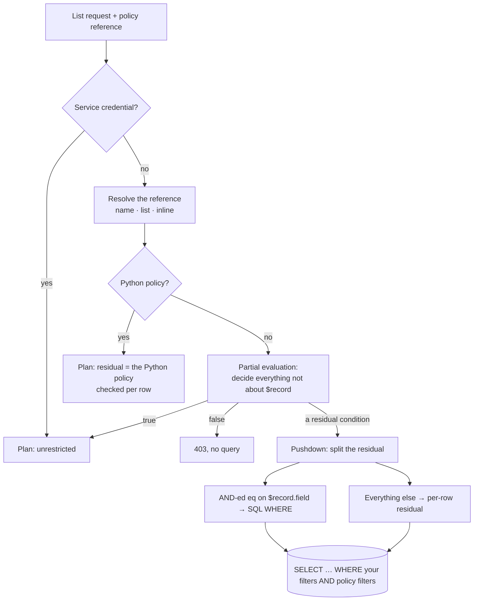

Checking a policy on **one** record is easy: load it, evaluate, allow or refuse. Checking a policy on a **list** is where most backends quietly go wrong. Pawabase solves it by **planning** the policy before running the query. This page explains the problem, the three-stage planner, exactly which conditions become SQL, what happens to the rest, and how to design policies that stay fast at scale.

## The problem with filtering after the fact

Imagine `GET /notes?per_page=20` where the policy is "your own notes", implemented the naive way:

1. `SELECT * FROM notes ORDER BY created_at DESC LIMIT 20` returns 20 rows, of which 3 are yours;
2. drop the 17 you can't see and return 3 rows;
3. report `total: 51,203` (every note in the table).

That's three bugs at once:

- **Short pages.** Page 1 shows 3 notes; page 2 might show 0 even though you have 60 notes.
- **Wrong totals.** The count reveals how many notes *other people* have, and breaks "page 1 of N" UIs.
- **Wasted work.** The database reads rows only to have them thrown away.

Frameworks usually "fix" this by making every list endpoint remember to add the right `WHERE` clause by hand, which is exactly the kind of duplication that eventually leaks data.

## How Pawabase plans a list



### Stage 1: service shortcut

Secret keys and operators bypass policies, so their plan is unrestricted: the query runs with just the client's own filters.

### Stage 2: partial evaluation

The planner evaluates everything in the condition that **doesn't mention `$record`**: authentication, roles, permissions, scopes, `$input`, `$request`, `$credential`, `$now`. Groups simplify as it goes:

| Group | Rule |
| --- | --- |
| `all` | any child **false** → the whole `all` is false; **true** children disappear |
| `any` | any child **true** → the whole `any` is true; **false** children disappear |
| `not` | inverts a decided child; keeps an undecided one wrapped |

Three outcomes are possible:

| Outcome | Meaning | What happens |
| --- | --- | --- |
| `true` | The caller may see every row | The query runs with only the client's filters |
| `false` | The caller may see no row | `403` before any SQL runs |
| a smaller condition | Depends on the rows | Continue to stage 3 |

### Stage 3: pushdown

The remaining condition mentions only record fields. The planner looks at it as a conjunction (the parts of a top-level `all`, or the single condition) and moves every part of this exact shape into SQL:

```json
{ "eq": ["$record.<column>", <a value known now>] }
```

- the record path must be **one level** (`$record.user_id`, not `$record.address.city`);
- the other side must already be known: a literal, or something from `$auth`, `$credential`, `$request` (resolved during stage 2);
- either side may be the record path.

Each such part becomes `column = value` in the `WHERE` clause. Everything else stays as a **residual** condition, evaluated on each row the query returns.

## Worked examples

<Tabs>
  <Tab title="1. Owner">
    Policy: `{"owner": "user_id"}` → expands to `all(authenticated, eq($record.user_id, $auth.user_id))`.
    Caller: Ada, `user_id = "7"`.
    ```text
    stage 2: authenticated → true (dropped); eq($record.user_id, "7") stays
    stage 3: eq on a one-level record path vs a known value → pushed
    SQL:     … WHERE user_id = '7'
    residual: none
    ```
    Pages are full, `total` is exact, and the database uses the index on `user_id`.
  </Tab>
  <Tab title="2. Tenant and state">
    ```json
    { "all": [
      { "eq": ["$record.org_id", "$auth.org"] },
      { "eq": ["$record.archived", false] },
      { "role": ["member", "admin"] }
    ] }
    ```
    Caller: a member of `acme`.
    ```text
    stage 2: role → true (dropped); two eq's remain
    stage 3: both pushed
    SQL:     … WHERE org_id = 'acme' AND archived = false
    ```
  </Tab>
  <Tab title="3. Role shortcut">
    ```json
    { "any": [ { "role": "admin" }, { "owner": "author_id" } ] }
    ```
    - **An admin:** `role` → true, so `any` → true. The plan is unrestricted, with no `WHERE`.
    - **Anyone else:** `role` → false (dropped), leaving `owner` → `WHERE author_id = '<id>'`.

    One policy, two very different queries, both optimal.
  </Tab>
  <Tab title="4. Anonymous">
    Policy `owner`, caller anonymous.
    ```text
    stage 2: authenticated → false, so all(...) → false
    result:  403, no query at all
    ```
  </Tab>
  <Tab title="5. Residual">
    ```json
    { "any": [
      { "owner": "user_id" },
      { "contains": ["$record.guardian_user_ids", "$auth.user_id"] }
    ] }
    ```
    Caller: a guardian.
    ```text
    stage 2: authenticated → true inside owner; remaining: any(eq(user_id,"8"), contains(...))
    stage 3: the top level is an OR, not an AND → nothing can be pushed
    SQL:     no policy WHERE
    residual: the whole any(...) is checked per row; total = null
    ```
  </Tab>
  <Tab title="6. Mixed">
    ```json
    { "all": [
      { "eq": ["$record.school_id", "$auth.claims.app.school_id"] },
      { "any": [ { "eq": ["$record.published", true] }, { "role": "teacher" } ] }
    ] }
    ```
    Caller: a student.
    ```text
    stage 2: role → false, so the inner any becomes eq($record.published, true)
    stage 3: both parts are AND-ed eq's → pushed
    SQL:     … WHERE school_id = '3' AND published = true
    ```
    Partial evaluation turned an OR into a plain equality for this caller, so everything was pushed.
  </Tab>
</Tabs>

## Residuals: what they mean for you

When a residual remains, Pawabase still returns **only permitted rows**. Correctness is never at stake. What changes is how the page is assembled:

- the query runs with your filters and any pushed-down equalities;
- each returned row is checked against the residual and kept or dropped;
- `total` is reported as `null`, because counting permitted rows would require reading every candidate row.

For clients this means:

| Behaviour | What to do |
| --- | --- |
| A page may have **fewer** than `per_page` rows | Keep paging until a page is shorter than `per_page`, or empty |
| `total` is `null` | Don't show "page X of Y"; show "load more" |
| Very selective residuals are slow on big tables | Narrow with client filters, or redesign the policy (below) |

```js
async function* pages(path, params) {
  for (let page = 1; ; page++) {
    const r = await get(path, { ...params, page, per_page: 100 });
    yield r.data;
    if (r.data.length < 100) return;
  }
}
```

<Note>
`get` requests also use the plan: a pushed-down equality that doesn't match the row, or a residual that fails, returns `404`, exactly as if the row didn't exist.
</Note>

## Designing for pushdown

The single most effective rule: **put the weight of every list policy on an AND-ed equality with an indexed column.**

<Steps>
  <Step title="Identify the narrowing field">
    Which column, compared with something about the caller, cuts the table down to what they may see? `owner_id`, `org_id`, `tenant_id`, `family_id`, `school_id`, `class_id`.
  </Step>
  <Step title="Put it at the top level of an all">
    `{"all": [ {"eq": ["$record.org_id", "$auth.org"]}, … ]}`. Anything else in the `all` can be a residual; the equality has already done the heavy lifting.
  </Step>
  <Step title="Use role branches for staff">
    `{"any": [ {"role": "staff"}, {…the equality…} ]}` gives staff an unrestricted plan and everyone else a pushed-down one.
  </Step>
  <Step title="Index the column">
    Pushdown makes the query use the column; an index makes it fast. Add indexes in your database (Pawabase's migrate creates tables, not secondary indexes).
  </Step>
</Steps>

### Rewriting common slow policies

| Slow on big tables | Why | Faster alternative |
| --- | --- | --- |
| `contains($record.member_ids, $auth.user_id)` | `contains` is never pushed | A join resource (`memberships`) listed with `owner`, or an `eq` on a `team_id` that tokens carry |
| `any(owner, contains(…))` | OR can't be pushed | Split into two endpoints (mine / shared with me), each with a pushable policy |
| `in($record.status, [...])` for guests | `in` isn't pushed | A boolean (`visible`) maintained by a flow, compared with `eq` |
| `gte($record.created_at, …)` in the policy | ordering isn't pushed | Let clients filter `filter[created_at]=gte.…` (that's SQL) and keep the policy simple |
| A Python policy on a list | always a residual | A JSON policy with an equality for lists; Python only for single-record operations |

### Example: families at scale

The school tutorial uses:

```json
{ "any": [ { "role": [...staff] }, { "owner": "user_id" }, { "contains": ["$record.guardian_user_ids", "$auth.user_id"] } ] }
```

It's correct and fine for a school. For a national system with millions of students, add a `family_id` column, put the family id into guardians' tokens (via `app_metadata`), and write:

```json
{ "any": [
  { "role": ["admin", "principal", "teacher"] },
  { "eq": ["$record.family_id", "$auth.claims.app.family_id"] }
] }
```

For guardians, that plans to `WHERE family_id = '…'`: an indexed lookup with exact totals.

## How your filters combine with the plan

Client filters (`filter[…]`) and pushed-down policy equalities are AND-ed into the same `WHERE`:

```bash
GET /rest/v1/invoices?filter[status]=overdue      # as a guardian of family 12
```

```sql
SELECT … FROM invoices WHERE status = 'overdue' AND family_id = '12' ORDER BY … LIMIT 20
```

Clients can only narrow what the policy allows; they can never widen it. If a client filters on the same column the policy pushes down with a different value, the result is simply empty.

## Observability

Studio's **Observability** records, for every request, the policy that planned it (the `policy` note). When a list is slow, check:

1. whether `total` is `null` in the response (a residual remained);
2. the request's duration and the policy name in the request log;
3. the SQL your database logs for that request id.

## Compared with Supabase and Firebase

<Tabs>
  <Tab title="Supabase RLS">
    Postgres Row Level Security adds each policy's `USING` expression to every query, so filtering is always "pushed down", but the expression runs **inside** the database for every candidate row. Performance depends on writing policies the planner can use with indexes (Supabase recommends wrapping `auth.uid()` in a subquery and indexing policy columns). Complex policies with joins or function calls can make every query slow.

    Pawabase pushes down only the simple, index-friendly part (equalities), evaluates role checks once per request instead of per row, and makes the cost of the rest visible (`total: null`). Different trade-off: less expressive in SQL, more predictable.
  </Tab>
  <Tab title="Firebase">
    Firestore rules **are not filters**. A query is rejected if it *could* return any document the rules would deny, so clients must add `where("ownerId", "==", uid)` themselves, mirroring the rule. Forgetting it is an error, not a leak, which is safe but duplicates logic in every client.

    Pawabase applies the policy to the query for you. Clients don't mirror rules; they just list.
  </Tab>
</Tabs>

## FAQ

<AccordionGroup>
  <Accordion title="Why only equality?">
    Equalities on one column are unambiguous across SQLite, Postgres and MySQL, are what ownership and tenancy rules are made of, and are what pagination correctness depends on. Pushing down arbitrary expressions portably would mean a query compiler for every dialect, for little gain.
  </Accordion>
  <Accordion title="Does pushdown change results?">
    No. A plan with pushdown returns exactly the rows a per-row check would, just faster and with correct totals.
  </Accordion>
  <Accordion title="What about nested record fields?">
    `$record.address.city` isn't pushed down (JSON columns differ by database). It's checked as a residual.
  </Accordion>
  <Accordion title="Are relations (expand) filtered with the plan too?">
    Expanded rows are checked against the **related** resource's own read policy, row by row. See [relations](/data/relations#expansions-respect-the-related-resources-rules).
  </Accordion>
</AccordionGroup>
