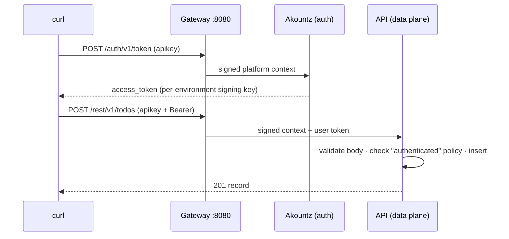

This quickstart runs the whole platform on your machine with Docker, creates a project, defines a `todos` resource and calls it from `curl`, first anonymously and then as a signed-in user.

<Info>
You need **Docker** with Compose v2 and about 2 GB of free memory. Nothing else is installed on your machine.
</Info>

<Steps>
  <Step title="Get Pawabase and start it">
    ```bash
    git clone https://github.com/sillohq/pawabase.git
    cd pawabase
    cp .env.test .env
    docker compose up -d
    ```
    `.env.test` holds ready-made, **public** development secrets. Use it only locally; the [production checklist](/self-hosting/production-checklist) shows how to generate real ones.

    The first start builds one image and applies database migrations. When `docker compose ps` shows every service healthy, you're ready.
  </Step>

  <Step title="Sign in to Studio">
    Open [http://localhost:8090](http://localhost:8090) and sign in as `admin@pawabase.test` with the password `Pawabase!test1`.

    Studio is the control plane. Everything you do in it is also available through the [Platform API](/reference/environment-settings).
  </Step>

  <Step title="Create a project">
    Click **New project**, name it `Todo`, and keep the three suggested environments: `development`, `staging` and `production`.

    Studio shows each environment's **publishable** and **secret** key once. Copy the `development` pair now.

    <Warning>Keys are shown once. Publishable keys are safe in browsers; secret keys bypass policies and belong only on servers.</Warning>
  </Step>

  <Step title="Define a resource">
    Open **development → Resources → New resource** and fill in the form:

    | Setting | Value |
    | --- | --- |
    | Name | `todos` |
    | Fields | `title` (Text, required, max 200), `done` (Yes/no, default `false`) |
    | Owner field | leave empty for now |
    | Access | **List** and **Get**: *Anyone (public)*. **Create**, **Update**, **Delete**: *Signed-in users* |

    Save, then click **Create / migrate table** in the panel footer. Pawabase creates the table in the environment's database.
  </Step>

  <Step title="Call your API">
    Every request carries the environment's key in the `apikey` header:

    ```bash
    export PK=pb_pk_...   # your development publishable key

    curl http://localhost:8080/rest/v1/todos -H "apikey: $PK"
    # {"data": [], "page": 1, "per_page": 20, "total": 0}
    ```

    Creating needs a signed-in user, so this is refused:

    ```bash
    curl -X POST http://localhost:8080/rest/v1/todos -H "apikey: $PK" \
      -H "content-type: application/json" -d '{"title": "Buy milk"}'
    # 401 Authentication required
    ```
  </Step>

  <Step title="Sign up a user and write">
    ```bash
    curl -X POST http://localhost:8080/auth/v1/signup -H "apikey: $PK" \
      -H "content-type: application/json" \
      -d '{"email": "ada@example.com", "password": "Str0ng!pass"}'

    TOKEN=$(curl -s -X POST "http://localhost:8080/auth/v1/token?grant_type=password" \
      -H "apikey: $PK" -H "content-type: application/json" \
      -d '{"email": "ada@example.com", "password": "Str0ng!pass"}' | jq -r .access_token)

    curl -X POST http://localhost:8080/rest/v1/todos -H "apikey: $PK" \
      -H "Authorization: Bearer $TOKEN" -H "content-type: application/json" \
      -d '{"title": "Buy milk"}'
    # {"id": 1, "title": "Buy milk", "done": false, "created_at": "…", "updated_at": "…"}
    ```
  </Step>

  <Step title="Browse the generated docs">
    In Studio, click **Open API docs** in the sidebar. Every resource and route you define appears there, with request builders and code samples aimed at your gateway.
  </Step>
</Steps>

## What just happened



1. The **gateway** resolved your publishable key to `Todo / development` and forwarded a signed context. Services never see the raw key.
2. **Akountz** issued a token signed with a key derived for this environment alone.
3. The **API** had compiled `todos` into a real route with a generated request model, so the body was validated before the policy ran and before any SQL.

## Next steps

<CardGroup cols={2}>
  <Card title="Your first real project" icon="list-checks" href="/tutorial/first-project">Owners, private rows, relations and an event-driven email, step by step.</Card>
  <Card title="The mental model" icon="brain" href="/concepts/mental-model">Definitions, compilation, context and policies in one page.</Card>
  <Card title="Policies" icon="shield-check" href="/policies/overview">Make rows private to their owners.</Card>
  <Card title="Self-hosting" icon="server" href="/self-hosting/requirements">Take it to production.</Card>
</CardGroup>
