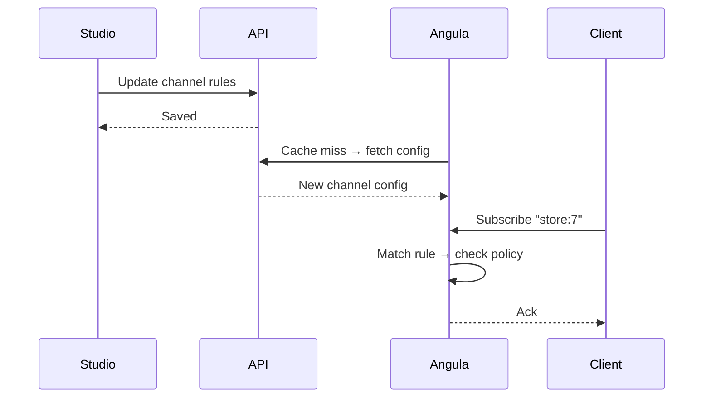

**Channel rules** control who can subscribe to and publish to each Angula channel. Every environment has a channel configuration that defines a set of rules, a default policy, and a policy engine. Angula evaluates these rules when a client subscribes or publishes, enforcing the configured access controls before allowing any operation.

<CardGroup cols={3}>
  <Card title="Patterns" icon="hashtag">Channel name patterns with templates.</Card>
  <Card title="Subscribe policy" icon="sign-in">Who may join a channel.</Card>
  <Card title="Publish policy" icon="sign-out">Who may send to a channel.</Card>
</CardGroup>

## How channel rules work

Each environment's channel configuration consists of an ordered list of `ChannelRule` objects and a `default_policy`. When a client attempts to subscribe or publish, Angula finds the first rule whose pattern matches the channel name and applies it. If no rule matches, the default policy is used.

```python services/angula/app/realtime.py
class ChannelRule:
    """Who may do what on channels matching a pattern."""
    pattern: str
    subscribe: Any = "authenticated"
    publish: Any = "authenticated"
    presence: bool = True
    history: int = 50
```

A rule's `pattern` may contain `{{ }}` templates. For example, `user:{{ auth.user_id }}` gives every signed-in user a private channel only they can join. The `claims()` method expands templates to wildcards for matching, while `permits()` renders the template and checks the result.

## Rule matching

Rules are checked in order. The first rule whose pattern matches the channel name wins. Matching uses fnmatch-style wildcards:

```json
{
  "channels": [
    {
      "pattern": "user:{{ auth.user_id }}",
      "subscribe": "authenticated",
      "publish": "authenticated",
      "presence": true,
      "history": 50
    },
    {
      "pattern": "store:*",
      "subscribe": {"eq": ["$auth.org", "store-7"]},
      "publish": {"in": ["$auth.roles", ["admin", "manager"]]},
      "presence": true,
      "history": 100
    },
    {
      "pattern": "public:*",
      "subscribe": "public",
      "publish": "public",
      "presence": false,
      "history": 10
    }
  ],
  "default_policy": "authenticated"
}
```

In this example:
- `user:8` matches the first rule — only user 8 can subscribe or publish
- `store:7` matches the second rule — requires org `store-7` to subscribe, and admin/manager roles to publish
- `public:lobby` matches the third rule — anyone can subscribe, no presence tracking
- `chat:general` matches no rule — falls back to `authenticated` default

## Policy evaluation

Each rule's `subscribe` and `publish` values can be either a shorthand string (`"authenticated"`, `"public"`, `"service"`) or a JSON condition. JSON conditions are evaluated by the `PolicyEngine` against a context that includes `auth`, `credential`, `project`, `env`, `channel`, `input`, and `record`.

The channel object in the evaluation context provides the channel name and its path segments:

```python context = {
    "auth": dict(auth),
    "credential": dict(credential),
    "project": project,
    "env": env,
    "channel": {
        "name": channel,
        "segments": channel.replace(":", "/").split("/"),
        "action": action,
    },
    "input": payload,
    "record": None,
}
```

This means you can write policies like `{"eq": ["$object.segments.0", "user"]}` to restrict access based on the channel path.

## Default policy

If no rule matches the channel name, the `default_policy` applies. It can be `"authenticated"`, `"public"`, `"service"`, or any JSON condition. The default protects channels that don't explicitly opt in to open access.

```json
{
  "default_policy": "authenticated",
  "allow_client_publish": true
}
```

The `allow_client_publish` setting (default `true`) controls whether clients can publish at all in this environment. When set to `false`, only server-side publishes via the API or flows are permitted.

## Service bypass

Service credentials (`is_service: true`) bypass channel policy entirely. A flow or function publishing to a channel with a service token will always succeed, regardless of the channel rules. This is by design — server-side code operates with platform rights, not user permissions.

<Warning>
Service-role connections bypass channel policies completely. A flow with `realtime.publish` that uses a service credential will publish to any channel without checking subscribe or publish rules. Only use service credentials for server-side operations, never for client-facing code.
</Warning>

## Configuration

Channel rules are fetched from the API (`/internal/v1/environments/{project}/{env}/realtime`) and cached for `config_ttl` seconds (default 10). Changes to channel rules in Studio take effect after the cache expires.



## Next

<CardGroup cols={2}>
  <Card title="Connecting" icon="plug" href="/realtime/connecting">How clients connect to Angula.</Card>
  <Card title="Protocol" icon="code" href="/realtime/protocol">The WebSocket message protocol.</Card>
  <Card title="Presence" icon="account-multiple" href="/realtime/presence">Tracking who's online.</Card>
  <Card title="Overview" icon="signal" href="/realtime/overview">Realtime architecture and concepts.</Card>
</CardGroup>
