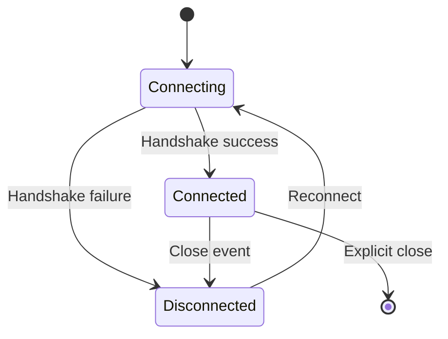

## Overview

Clients connect to the realtime service via WebSocket. The connection is established through the Pawabase gateway, which proxies the WebSocket to the Angula service.

Clients connect to the realtime service via WebSocket. The connection is established through the Pawabase gateway, which proxies the WebSocket to the Angula service.

Clients connect to the realtime service via WebSocket. The connection is established through the Pawabase gateway, which proxies the WebSocket to the Angula service.

Clients connect to the realtime service via WebSocket. The connection is established through the Pawabase gateway, which proxies the WebSocket to the Angula service.

Clients connect to the realtime service via WebSocket. The connection is established through the Pawabase gateway, which proxies the WebSocket to the Angula service.

All realtime communication happens over a single persistent WebSocket connection. This connection carries subscribe messages, publish messages, presence events, and history replay events.

## Connection URL

The WebSocket URL follows this pattern:
```
wss://<gateway host>/realtime/v1/socket?apikey=<publishable key>&token=<access token>
```

| Parameter | Description | Required |
| --- | --- | --- |
| apikey | Publishable key for the project | Yes |
| token | Access token for authentication | No |

## Authentication

Authentication is handled via the `token` query parameter. The token is validated by the gateway before the connection is proxied to Angula.

Authentication is handled via the `token` query parameter. The token is validated by the gateway before the connection is proxied to Angula.

Authentication is handled via the `token` query parameter. The token is validated by the gateway before the connection is proxied to Angula.

Authentication is handled via the `token` query parameter. The token is validated by the gateway before the connection is proxied to Angula.

Authentication is handled via the `token` query parameter. The token is validated by the gateway before the connection is proxied to Angula.

The token should be a valid access token from your Pawabase authentication system. It is used to populate the `$auth` context that policies reference.
## Reconnection

The client library handles automatic reconnection. When a connection drops, it attempts to reconnect with exponential backoff.

The client library handles automatic reconnection. When a connection drops, it attempts to reconnect with exponential backoff.

The client library handles automatic reconnection. When a connection drops, it attempts to reconnect with exponential backoff.

The client library handles automatic reconnection. When a connection drops, it attempts to reconnect with exponential backoff.

The client library handles automatic reconnection. When a connection drops, it attempts to reconnect with exponential backoff.

| Property | Type | Default | Description |
| --- | --- | --- | --- |
| reconnect | boolean | true | Enable automatic reconnection |
| reconnectInterval | number | 1000 | Initial reconnect delay in ms |
| reconnectDecay | number | 1.5 | Exponential backoff multiplier |
| reconnectAttempts | number | Infinity | Maximum reconnection attempts |

## Connection Lifecycle



### State Transitions

The connection moves through several states during its lifecycle. Understanding these states helps handle errors and manage resources effectively.

The connection moves through several states during its lifecycle. Understanding these states helps handle errors and manage resources effectively.

The connection moves through several states during its lifecycle. Understanding these states helps handle errors and manage resources effectively.

The connection moves through several states during its lifecycle. Understanding these states helps handle errors and manage resources effectively.

The connection moves through several states during its lifecycle. Understanding these states helps handle errors and manage resources effectively.

### Opening Handshake

When the client establishes a WebSocket connection, the gateway performs the following steps: validate the API key, authenticate the token, proxy the connection to Angula, and send an acknowledgment.

When the client establishes a WebSocket connection, the gateway performs the following steps: validate the API key, authenticate the token, proxy the connection to Angula, and send an acknowledgment.

When the client establishes a WebSocket connection, the gateway performs the following steps: validate the API key, authenticate the token, proxy the connection to Angula, and send an acknowledgment.

When the client establishes a WebSocket connection, the gateway performs the following steps: validate the API key, authenticate the token, proxy the connection to Angula, and send an acknowledgment.

When the client establishes a WebSocket connection, the gateway performs the following steps: validate the API key, authenticate the token, proxy the connection to Angula, and send an acknowledgment.

### Graceful Disconnect

When the client closes the connection cleanly, Angula removes the client from all subscribed channels and broadcasts presence leave events.

When the client closes the connection cleanly, Angula removes the client from all subscribed channels and broadcasts presence leave events.

When the client closes the connection cleanly, Angula removes the client from all subscribed channels and broadcasts presence leave events.

When the client closes the connection cleanly, Angula removes the client from all subscribed channels and broadcasts presence leave events.

When the client closes the connection cleanly, Angula removes the client from all subscribed channels and broadcasts presence leave events.

## Network Interruptions

Network interruptions are handled transparently by the client library. If the connection drops, the library attempts to reconnect with exponential backoff.

Network interruptions are handled transparently by the client library. If the connection drops, the library attempts to reconnect with exponential backoff.

Network interruptions are handled transparently by the client library. If the connection drops, the library attempts to reconnect with exponential backoff.

Network interruptions are handled transparently by the client library. If the connection drops, the library attempts to reconnect with exponential backoff.

Network interruptions are handled transparently by the client library. If the connection drops, the library attempts to reconnect with exponential backoff.

During reconnection, subscribed channels are automatically re-subscribed once the connection is restored. Any messages published during the disconnection are not received unless history replay is configured.
## Best Practices

**1. Always include a valid token in the connection URL**
**2. Handle reconnection events gracefully in your UI**
**3. Clean up subscriptions when the component unmounts**
**4. Use connection state to show connectivity indicators**
**5. Configure appropriate reconnection parameters for your use case**
<CardGroup cols={2}>
  <Card title="Protocol" icon="code" href="/realtime/protocol">The WebSocket message protocol.</Card>
  <Card title="Channel Rules" icon="shield-check" href="/realtime/channel-rules">Policies for channels.</Card>
  <Card title="Overview" icon="signal" href="/realtime/overview">Architecture overview.</Card>
</CardGroup>
