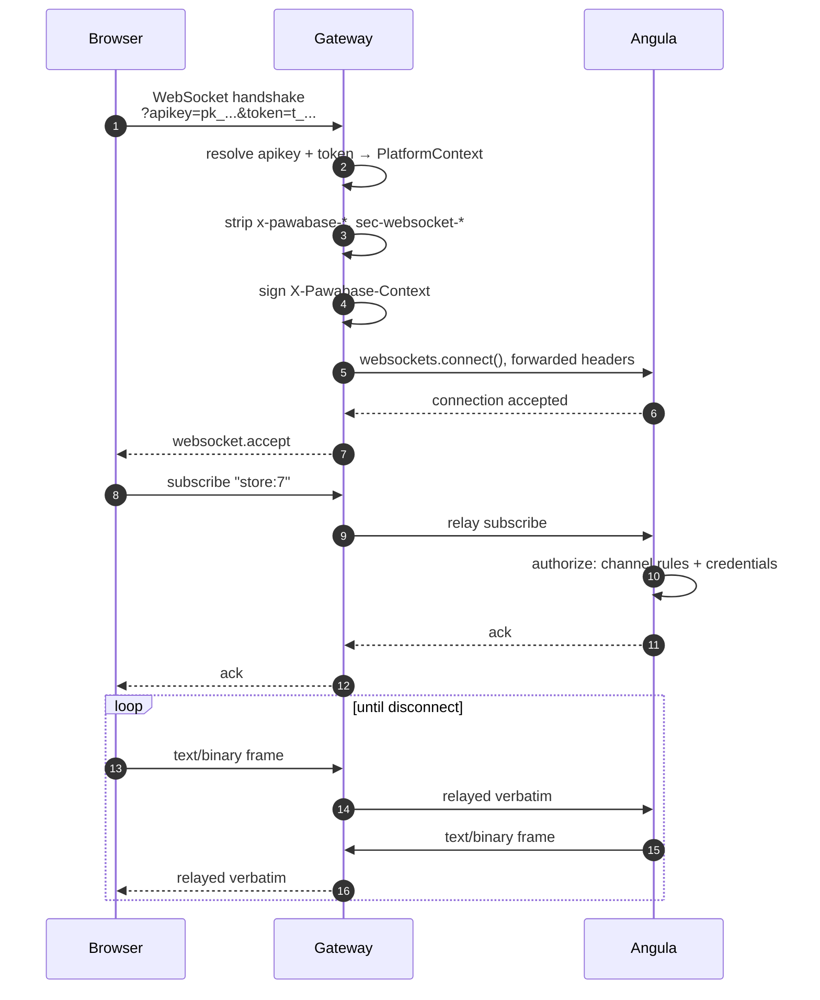

Clients connect to Pawabase realtime through a single WebSocket path that terminates at the gateway. The gateway proxies the connection to Angula, which manages the channel subscriptions and message delivery. This section covers the full connection journey: from the initial handshake through subscription to disconnection.

## The connection path

A client opens a WebSocket to the gateway on port **8080**:

```
wss://<gateway host>/realtime/v1/socket?apikey=<publishable key>&token=<access token>
```

The gateway resolves the API key, applies origin and rate-limit checks, strips any headers a client could use to impersonate the platform, and forwards a signed `X-Pawabase-Context` header to Angula. The gateway then relays frames verbatim between the client and Angula — it never inspects or buffers frame contents.

<Accordion title="Source: services/gateway/app/proxy.py">
The gateway's `GatewayProxy` handles WebSocket connections the same way it handles HTTP: it resolves the key, strips impersonation headers, signs the context, and streams frames. For WebSockets, it waits for the first `websocket.connect` ASGI message before doing anything else, then opens the upstream connection to Angula with a 10-second timeout.

```python services/gateway/app/proxy.py
"""Forwarding requests and WebSockets to the internal services.

For every proxied request the gateway:
1. finds the upstream from the route table;
2. resolves the API key into a platform context;
3. enforces the environment's allowed origins and rate limit;
4. strips x-pawabase-* headers and the raw key itself;
5. adds the signed X-Pawabase-Context and streams through.
"""
```
</Accordion>

## Authentication

The `apikey` query parameter identifies the project, and the `token` query parameter (a bearer access token from Akountz) identifies the user. Both are required for non-public channels. The gateway resolves them together into a `PlatformContext` that includes the project, environment, role, key ID, and scopes.

```json
{
  "project": "acme",
  "env": "production",
  "role": "anon",
  "key_id": "pk_live_abc123",
  "scopes": ["resource:read", "realtime:subscribe"]
}
```

A publishable key resolves to the `anon` role and is sufficient for subscribing to public channels. A secret key resolves to the `service` role and bypasses all channel policies. A user access token resolves to the `operator` or `anon` role depending on whether it's a platform operator token or a project user token.

## CORS and origin enforcement

The gateway enforces the environment's allowed origins for publishable keys. If the `Origin` header doesn't match a configured CORS origin, the gateway rejects the WebSocket upgrade. This prevents unauthorized domains from opening realtime connections on behalf of your project.

## Connection lifecycle

Once connected, the client follows this lifecycle:

1. **Handshake**: The gateway validates the key and token, resolves the platform context, and opens the upstream to Angula
2. **Subscribe**: The client sends a subscribe message for one or more channels
3. **Authorize**: Angula checks the channel rules against the client's credentials. If the client lacks permission, the subscribe is refused
4. **Receive**: The client receives messages published to subscribed channels, plus presence diffs
5. **Publish**: The client can publish to channels where it has publish permission (subject to `allow_client_publish` settings)
6. **Disconnect**: When the client closes, Angula untracks presence, leaves channels, and broadcasts presence diffs



## Connection limits

Each connection is limited by `AngulaSettings`:

| Setting | Default | Description |
| --- | --- | --- |
| `max_channels` | 100 | Maximum channels one connection may join |
| `max_message_bytes` | 64 KB | Largest client message accepted |
| `idle_timeout` | 300s | Seconds without traffic before a peer is pruned |

<Warning>
If Angula refuses the connection — say, because the signed context names an environment that doesn't exist, or because a channel-level policy the context can't satisfy is checked at connect time — the gateway maps a `401`/`403` upstream response to close code `4003` ("upstream refused the connection"). Anything else unreachable-shaped becomes `1011` (internal error).
</Warning>

## Studio's Realtime console

Studio's own **Realtime console** is a structurally different WebSocket path. Instead of going through the public gateway with a project API key, an operator's browser opens a socket straight to Studio (`/studio/ws/realtime`), authenticated by a short-lived signed **ticket**. Studio then relays that connection to Angula itself, using a **service**-role `PlatformContext` — which bypasses every channel policy. It's an operator's tool for watching, subscribing to, and publishing on *any* channel in an environment.

<Tip>
If you're debugging realtime connectivity, use the Realtime console in Studio (**Build → Realtime**) to see all channels, subscribers, and messages for an environment without needing a project API key.
</Tip>

## Next

<CardGroup cols={2}>
  <Card title="Protocol" icon="code" href="/realtime/protocol">The WebSocket message protocol and wire format.</Card>
  <Card title="Channel rules" icon="shield-check" href="/realtime/channel-rules">Subscribe and publish policies.</Card>
  <Card title="Presence" icon="account-multiple" href="/realtime/presence">Tracking who's online.</Card>
  <Card title="Overview" icon="signal" href="/realtime/overview">Realtime architecture and concepts.</Card>
</CardGroup>
