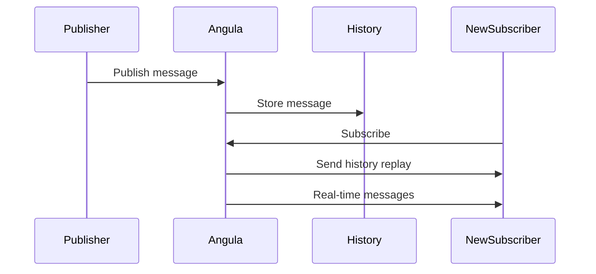

## Overview

History makes messages replayable. When a new client subscribes to a channel, it can receive recent messages that were published before it connected.

History makes messages replayable. When a new client subscribes to a channel, it can receive recent messages that were published before it connected.

History makes messages replayable. When a new client subscribes to a channel, it can receive recent messages that were published before it connected.

History makes messages replayable. When a new client subscribes to a channel, it can receive recent messages that were published before it connected.

History makes messages replayable. When a new client subscribes to a channel, it can receive recent messages that were published before it connected.

<CardGroup cols={3}>
  <Card title="Replay" icon="rotate-left">New subscribers get recent messages.</Card>
  <Card title="Bounded" icon="scale">History is capped by bytes and message count.</Card>
  <Card title="Sequenced" icon="hashtag">Messages have sequential IDs for ordering.</Card>
</CardGroup>

## How History Works

Every message published to a channel is stored in the channel's history buffer. The buffer is bounded by both message count and total bytes to prevent unbounded growth.

Every message published to a channel is stored in the channel's history buffer. The buffer is bounded by both message count and total bytes to prevent unbounded growth.

Every message published to a channel is stored in the channel's history buffer. The buffer is bounded by both message count and total bytes to prevent unbounded growth.

Every message published to a channel is stored in the channel's history buffer. The buffer is bounded by both message count and total bytes to prevent unbounded growth.

Every message published to a channel is stored in the channel's history buffer. The buffer is bounded by both message count and total bytes to prevent unbounded growth.



## History Configuration

```json
{
  "name": "store:7",
  "history": {
    "max_messages": 1000,
    "max_bytes": 1048576
  }
}
```

| Property | Type | Default | Description |
| --- | --- | --- | --- |
| max_messages | number | 100 | Maximum messages stored per channel |
| max_bytes | number | 1048576 | Maximum bytes stored per channel (1MB) |
| ttl | number | 86400 | Time-to-live in seconds (24 hours) |

## Message Ordering

Messages in history are ordered by their sequential ID. Each message receives a monotonically increasing ID assigned by Angula when it is published.

Messages in history are ordered by their sequential ID. Each message receives a monotonically increasing ID assigned by Angula when it is published.

Messages in history are ordered by their sequential ID. Each message receives a monotonically increasing ID assigned by Angula when it is published.

Messages in history are ordered by their sequential ID. Each message receives a monotonically increasing ID assigned by Angula when it is published.

Messages in history are ordered by their sequential ID. Each message receives a monotonically increasing ID assigned by Angula when it is published.

The sequential ID ensures that messages are always delivered in the correct order, even if they arrive out of order over the network.
## Replay Behavior

When a new client subscribes to a channel, it receives recent messages from the history buffer before receiving new messages in real time.

When a new client subscribes to a channel, it receives recent messages from the history buffer before receiving new messages in real time.

When a new client subscribes to a channel, it receives recent messages from the history buffer before receiving new messages in real time.

When a new client subscribes to a channel, it receives recent messages from the history buffer before receiving new messages in real time.

When a new client subscribes to a channel, it receives recent messages from the history buffer before receiving new messages in real time.

| Behavior | Description |
| --- | --- |
| Full replay | All recent messages are sent in order |
| Incremental replay | Only messages after a specific ID |
| No replay | Only new messages from the point of subscription |

## History and Channels

History is per-channel. Each channel maintains its own history buffer independent of other channels.

History is per-channel. Each channel maintains its own history buffer independent of other channels.

History is per-channel. Each channel maintains its own history buffer independent of other channels.

History is per-channel. Each channel maintains its own history buffer independent of other channels.

History is per-channel. Each channel maintains its own history buffer independent of other channels.

This means that messages published to `store:7` do not appear in the history of `store:8`. Each channel is an isolated event stream with its own bounded history.
## Best Practices

**1. Set appropriate max_messages and max_bytes for your use case**
**2. Use sequential IDs to track message position in history**
**3. Use history replay to bootstrap new subscribers quickly**
**4. Consider the trade-off between history depth and storage costs**
**5. Use the TTL to automatically expire old history**
<CardGroup cols={2}>
  <Card title="Connecting" icon="plug" href="/realtime/connecting">Connection guide.</Card>
  <Card title="Protocol" icon="code" href="/realtime/protocol">Message protocol.</Card>
  <Card title="Overview" icon="signal" href="/realtime/overview">Architecture overview.</Card>
</CardGroup>
