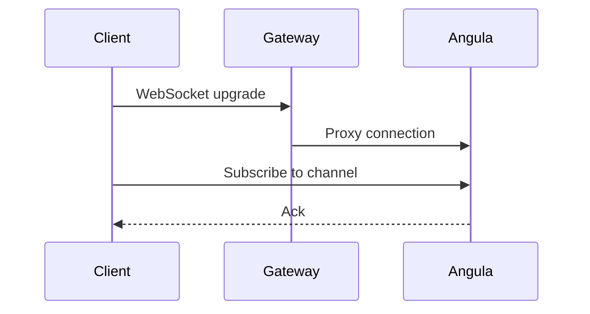
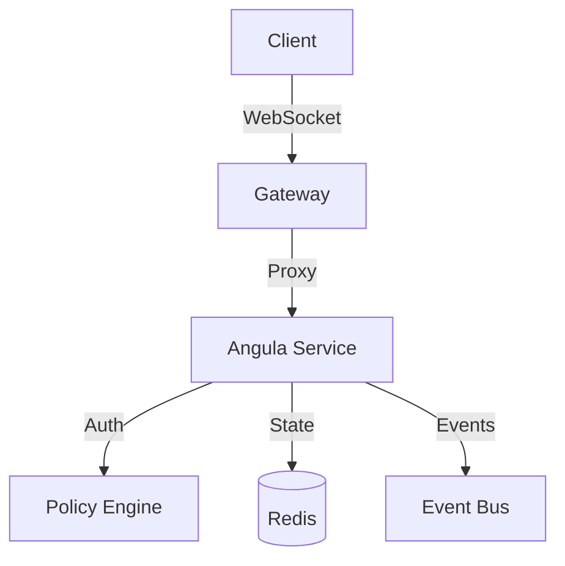

**Realtime** in Pawabase is powered by **Angula**, a dedicated realtime service that manages channels, presence, and message history.
Unlike polling or periodic refreshing, realtime pushes updates to connected clients the moment they happen.

<CardGroup cols={3}>
  <Card title="Channels" icon="hashtag">Named pub/sub channels that clients subscribe to.</Card>
  <Card title="Presence" icon="account-multiple">Track who's online and their status.</Card>
  <Card title="History" icon="clock-rotate-left">Replayable message history for new subscribers.</Card>
</CardGroup>

## How Realtime Works

Every realtime interaction in Pawabase follows a consistent, well-defined pattern that has been refined through years of production use. Understanding this pattern is essential for building responsive, real-time applications on the platform.

Every realtime interaction in Pawabase follows a consistent, well-defined pattern that has been refined through years of production use. Understanding this pattern is essential for building responsive, real-time applications on the platform.

Every realtime interaction in Pawabase follows a consistent, well-defined pattern that has been refined through years of production use. Understanding this pattern is essential for building responsive, real-time applications on the platform.

Every realtime interaction in Pawabase follows a consistent, well-defined pattern that has been refined through years of production use. Understanding this pattern is essential for building responsive, real-time applications on the platform.

Every realtime interaction in Pawabase follows a consistent, well-defined pattern that has been refined through years of production use. Understanding this pattern is essential for building responsive, real-time applications on the platform.

Every realtime interaction in Pawabase follows a consistent, well-defined pattern that has been refined through years of production use. Understanding this pattern is essential for building responsive, real-time applications on the platform.

Every realtime interaction in Pawabase follows a consistent, well-defined pattern that has been refined through years of production use. Understanding this pattern is essential for building responsive, real-time applications on the platform.

Every realtime interaction in Pawabase follows a consistent, well-defined pattern that has been refined through years of production use. Understanding this pattern is essential for building responsive, real-time applications on the platform.



## The Three Pillars

### Channels

Channels are named pub/sub groups scoped to a project and environment so environments never share traffic.

Channels are named pub/sub groups scoped to a project and environment so environments never share traffic.

Channels are named pub/sub groups scoped to a project and environment so environments never share traffic.

Channels are named pub/sub groups scoped to a project and environment so environments never share traffic.

Channels are named pub/sub groups scoped to a project and environment so environments never share traffic.

```json
{
  "name": "store:7",
  "subscribe_policy": {"eq": ["$auth.org", "store-7"]},
  "publish_policy": {"in": ["$auth.roles", ["admin", "manager"]]}
}
```

### Presence

Presence tracks connected users and their metadata in real time. It broadcasts join and leave events to all subscribers of a channel, enabling live user lists and typing indicators.

Presence tracks connected users and their metadata in real time. It broadcasts join and leave events to all subscribers of a channel, enabling live user lists and typing indicators.

Presence tracks connected users and their metadata in real time. It broadcasts join and leave events to all subscribers of a channel, enabling live user lists and typing indicators.

Presence tracks connected users and their metadata in real time. It broadcasts join and leave events to all subscribers of a channel, enabling live user lists and typing indicators.

Presence tracks connected users and their metadata in real time. It broadcasts join and leave events to all subscribers of a channel, enabling live user lists and typing indicators.

### History

History makes messages replayable. When a new client subscribes to a channel, it can receive recent messages that were published before it connected.

History makes messages replayable. When a new client subscribes to a channel, it can receive recent messages that were published before it connected.

History makes messages replayable. When a new client subscribes to a channel, it can receive recent messages that were published before it connected.

History makes messages replayable. When a new client subscribes to a channel, it can receive recent messages that were published before it connected.

History makes messages replayable. When a new client subscribes to a channel, it can receive recent messages that were published before it connected.

## Integration with Other Systems

Realtime does not operate in isolation. It connects deeply with resources, events, and flows to create a complete reactive platform.

Realtime does not operate in isolation. It connects deeply with resources, events, and flows to create a complete reactive platform.

Realtime does not operate in isolation. It connects deeply with resources, events, and flows to create a complete reactive platform.

Realtime does not operate in isolation. It connects deeply with resources, events, and flows to create a complete reactive platform.

Realtime does not operate in isolation. It connects deeply with resources, events, and flows to create a complete reactive platform.

<CardGroup cols={2}>
  <Card title="Resources" icon="database">Resource changes auto-broadcast to `resource:<name>` channels.</Card>
  <Card title="Events" icon="link">Platform events flow through the event bus to realtime channels.</Card>
  <Card title="Flows" icon="flowchart">Use the `realtime.publish` block to publish from flows.</Card>
  <Card title="Auth" icon="shield-check">Policies use `$auth` context for fine-grained access control.</Card>
</CardGroup>

## Architecture

The realtime system is built on a layered architecture that separates concerns and enables horizontal scaling. The gateway handles WebSocket connections, the Angula service manages channel state, and the policy engine enforces access control at every layer.

The realtime system is built on a layered architecture that separates concerns and enables horizontal scaling. The gateway handles WebSocket connections, the Angula service manages channel state, and the policy engine enforces access control at every layer.

The realtime system is built on a layered architecture that separates concerns and enables horizontal scaling. The gateway handles WebSocket connections, the Angula service manages channel state, and the policy engine enforces access control at every layer.

The realtime system is built on a layered architecture that separates concerns and enables horizontal scaling. The gateway handles WebSocket connections, the Angula service manages channel state, and the policy engine enforces access control at every layer.

The realtime system is built on a layered architecture that separates concerns and enables horizontal scaling. The gateway handles WebSocket connections, the Angula service manages channel state, and the policy engine enforces access control at every layer.



This architecture ensures that realtime connections are stateless from the gateway perspective, allowing the system to scale horizontally by adding more gateway instances behind a load balancer.

This architecture ensures that realtime connections are stateless from the gateway perspective, allowing the system to scale horizontally by adding more gateway instances behind a load balancer.

This architecture ensures that realtime connections are stateless from the gateway perspective, allowing the system to scale horizontally by adding more gateway instances behind a load balancer.

This architecture ensures that realtime connections are stateless from the gateway perspective, allowing the system to scale horizontally by adding more gateway instances behind a load balancer.

This architecture ensures that realtime connections are stateless from the gateway perspective, allowing the system to scale horizontally by adding more gateway instances behind a load balancer.

## Key Concepts at a Glance

| Concept | Description | Related |
| --- | --- | --- |
| Channel | Named pub/sub group | /realtime/channel-rules |
| Presence | Online user tracking | /realtime/presence |
| History | Replayable message log | /realtime/history |
| Protocol | WebSocket message format | /realtime/protocol |
| Server Publishing | Publish from server-side code | /realtime/server-publishing |

Each concept plays a specific role in the realtime ecosystem. Together they form a complete system for real-time data synchronization and communication.

Each concept plays a specific role in the realtime ecosystem. Together they form a complete system for real-time data synchronization and communication.

Each concept plays a specific role in the realtime ecosystem. Together they form a complete system for real-time data synchronization and communication.

Each concept plays a specific role in the realtime ecosystem. Together they form a complete system for real-time data synchronization and communication.

Each concept plays a specific role in the realtime ecosystem. Together they form a complete system for real-time data synchronization and communication.
