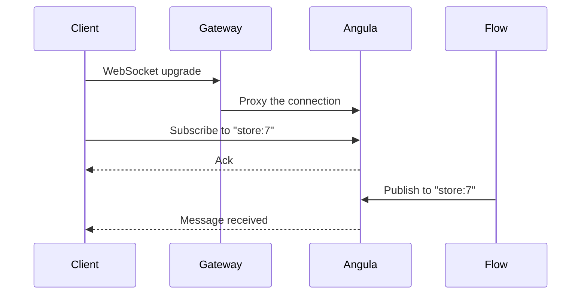
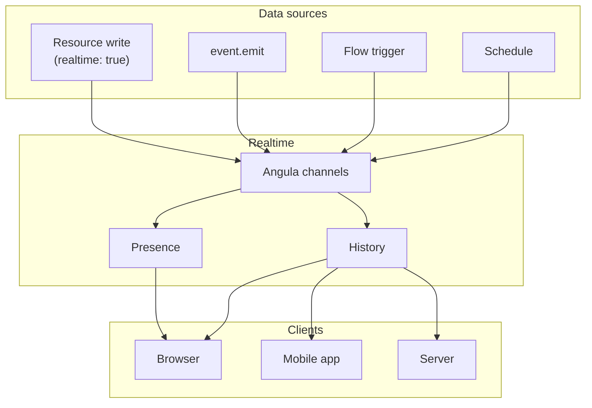

**Realtime** in Pawabase is powered by **Angula**, a dedicated realtime service that manages channels, presence, and message history. Unlike polling or periodic refreshing, realtime pushes updates to connected clients the moment they happen — making it ideal for live dashboards, chat applications, collaborative editing, and any interface that needs to reflect data changes instantly.

<CardGroup cols={3}>
  <Card title="Channels" icon="hashtag">Named pub/sub channels that clients subscribe to.</Card>
  <Card title="Presence" icon="account-multiple">Track who's online and their status.</Card>
  <Card title="History" icon="clock-rotate-left">Replayable message history for new subscribers.</Card>
</CardGroup>

## How realtime works

Every realtime interaction follows the same pattern:

1. A client **connects** to the Angula WebSocket endpoint
2. The client **subscribes** to one or more channels
3. A **publish** event sends a message to a channel
4. All **subscribed clients** receive the message
5. **Presence** tracks who's subscribed and their status



## The three pillars

### Channels

Channels are named pub/sub groups. Any client can subscribe to any channel (subject to channel policies). Any flow, function, or client can publish to any channel (subject to publish policies). Channel names are scoped to a project and environment — `acme/production/chat:lobby` — so environments never share traffic.

```json
{
  "name": "store:7",
  "subscribe_policy": {"eq": ["$auth.org", "store-7"]},
  "publish_policy": {"in": ["$auth.roles", ["admin", "manager"]]}
}
```

Channel rules are configured per environment and define who may subscribe, who may publish, whether presence is enabled, and how much history to retain. Angula evaluates these rules at connect time and on every publish.

### Presence

Presence tracks who's online and their current status. Clients report their presence when they connect, and updates are broadcast to all subscribers. Each connection carries a `user_id`, `status`, and `last_seen` timestamp.

```json
{
  "user_id": "8",
  "channel": "store:7",
  "status": "online",
  "last_seen": "2026-09-28T10:00:00+00:00"
}
```

Presence is scoped to a channel and is automatically cleaned up when a peer disconnects. A background prune loop runs every 30 seconds, disconnecting peers that `sillo-wire`'s hub has aged out.

### History

Every message published to a channel is stored as **replayable history**. When a new subscriber joins, they can request the last N messages. This makes it possible to build UIs that show recent activity without needing the client to have been connected when the messages were originally published.

```json
{
  "channel": "store:7",
  "messages": [
    {"event": "order.paid", "payload": {...}, "published_at": "..."},
    {"event": "inventory.low", "payload": {...}, "published_at": "..."}
  ]
}
```

History is bounded by `history_bytes` (default 256 KB per channel) and `history` (default 50 messages per channel rule). Older messages are evicted to make room for newer ones.

## How realtime integrates with everything

Realtime doesn't exist in isolation — it's tightly integrated with the rest of the Pawabase platform:

| Trigger | How realtime connects |
| --- | --- |
| **Resource writes** | Resources with `realtime: true` broadcast changes to `resource:<name>` channels |
| **Event.emit** | Events can trigger realtime publishes via flows |
| **Flows** | `realtime.publish` block sends to channels from within a flow |
| **Webhooks** | Outbound webhooks can notify external systems, which can then publish to channels |
| **Schedules** | Scheduled flows can publish status updates to channels |



## Channels vs events vs webhooks

Three mechanisms for broadcasting data — choose the right one:

| Mechanism | Delivery | Audience | Persistence |
| --- | --- | --- | --- |
| **Realtime channels** | WebSocket push | Subscribed clients only | History replay |
| **Events** | Durable queue | Flows, functions, webhooks | Event log |
| **Outbound webhooks** | HTTP POST | External endpoints | Delivery records |

Realtime channels are for **live updates to connected clients**. Events are for **decoupled backend processing**. Webhooks are for **external systems**. Often you'll use all three together: a resource write emits an event, triggers a flow that publishes to a channel, and fires a webhook to an external system.

## Connecting from a client

Clients connect via WebSocket to the gateway, which proxies to Angula:

```
wss://<gateway host>/realtime/v1/socket?apikey=<publishable key>&token=<access token>
```

The key goes in the query string because browsers can't set custom headers on a WebSocket handshake. The gateway resolves the key, applies CORS, and forwards a signed context to Angula.

The full WebSocket protocol — subscribe, publish, presence, history, auth messages with wire examples — is documented on [WebSocket protocol](/clients/mobile#realtime-over-websocket). It's identical across web, mobile, and server clients.

## Next

<CardGroup cols={2}>
  <Card title="Connecting" icon="plug" href="/realtime/connecting">How clients connect to Angula.</Card>
  <Card title="Protocol" icon="code" href="/realtime/protocol">The WebSocket message protocol.</Card>
  <Card title="Channel rules" icon="shield-check" href="/realtime/channel-rules">Subscribe and publish policies.</Card>
  <Card title="Presence" icon="account-multiple" href="/realtime/presence">Tracking who's online.</Card>
</CardGroup>
