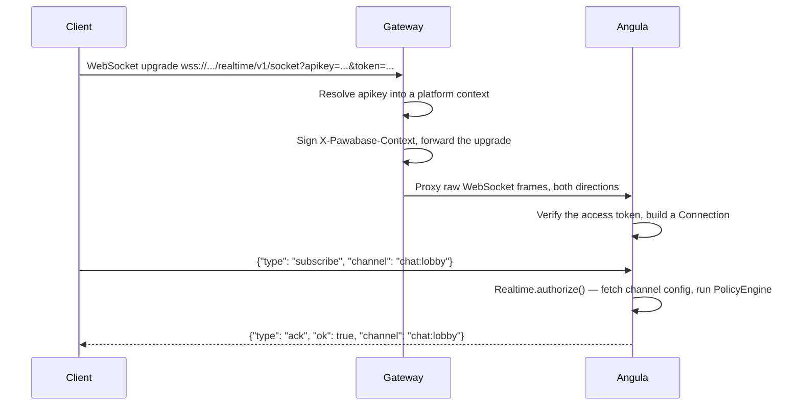
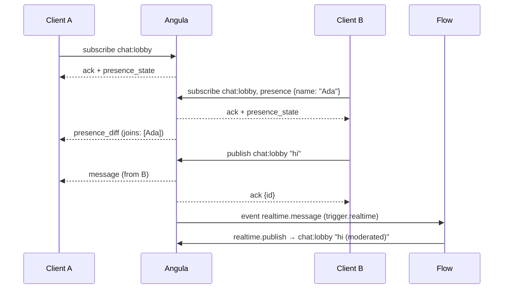

**Realtime** is how a Pawabase backend pushes data to connected clients the moment something happens, instead of clients polling for it. It's built around a small vocabulary — **Channel**, **Subscribe**, **Publish**, **Presence**, **History** — and one persistent WebSocket connection per client. This page gives you the mental model and the true architecture; the other six pages in this section go deep on each piece.

<CardGroup cols={3}>
  <Card title="Channel" icon="hashtag">A named stream a client subscribes to and publishes on, scoped to one project and one environment.</Card>
  <Card title="Presence" icon="users">Who's currently on a channel, and their attached metadata — join and leave, broadcast live.</Card>
  <Card title="History" icon="clock-rotate-left">A bounded, replayable backlog of recent messages a channel can hand a new subscriber.</Card>
</CardGroup>

## The service: Angula

Every Pawabase installation that has realtime enabled runs a dedicated service called **Angula**. It owns three things for one process: the set of open WebSocket connections, the rooms (channels) those connections belong to, and an in-memory presence table. Angula is where channel access control is decided, where messages fan out to subscribers, and where a channel's replay history lives.

Angula is not something you call directly. Clients reach it exclusively through **the gateway**, the single host every Pawabase client talks to for REST, auth, storage, and realtime alike. This matters for one specific, commonly-misunderstood reason: **the gateway does not evaluate channel policies**. It has no idea what a "channel" or a "subscribe policy" even is. Channel authorization is Angula's job, done entirely inside Angula, on every subscribe, publish, and presence action. The next section walks through exactly what each side does.

## Architecture, precisely

<Note>
A previous version of this documentation showed the gateway evaluating subscribe/publish policies before proxying to Angula. That's backwards. The gateway's role in a realtime connection is identical to its role in an HTTP request: resolve the API key, apply CORS and rate limiting where they apply, sign a context header, and forward bytes. All channel-level authorization happens inside Angula. The diagram and the walkthrough below reflect the actual code path.
</Note>

**What the gateway does for a realtime connection:**

1. Reads `apikey` from the query string (browsers can't set custom headers during a WebSocket handshake, so it isn't read from a header here) and resolves it to a platform context — project, environment, key role, scopes.
2. If the key is rejected or missing, the gateway itself closes the socket (code `4001`) before Angula ever sees the connection.
3. Strips the raw key and anything starting with `x-pawabase-` from the forwarded headers, then adds a short-lived, signed `X-Pawabase-Context` header that Angula trusts.
4. Opens a connection to Angula's own `/realtime/v1/socket` and pipes frames through in both directions until either side closes. It does not parse, inspect, or authorize individual messages — from the moment the upgrade completes, it's a byte pipe.

**What Angula does, entirely on its own:**

1. Reads the signed context (project, environment, key role) and verifies the `token` query parameter, if present, as a user access token — this is where `$auth` gets populated for policies.
2. Registers a `Connection` and sends a `welcome` message.
3. On every `subscribe`, `publish`, or `presence` message from the client, calls `Realtime.authorize()`, which fetches that environment's channel configuration (cached, refreshed periodically) and runs the matching channel rule's policy through the same `PolicyEngine` that guards resources and routes.
4. Owns the actual pub/sub: joining connections to rooms, broadcasting messages, tracking presence, and serving history.

The upshot: **a client that reaches Angula's socket at all has already passed the gateway's checks (valid key, forwarded context) but has not yet passed any channel-specific check.** Every single subscribe, publish, and presence action is authorized fresh, on that message, inside Angula — never cached as a blanket "this connection may do anything."

See [Connecting](/realtime/connecting) for the full handshake including what CORS and rate limiting do and don't apply to a WebSocket upgrade, and [Channel Rules](/realtime/channel-rules) for exactly how `Realtime.authorize()` decides a request.

## Channels: the unit everything else attaches to

A **channel** is just a name — a string up to 200 characters, without a `/` (that character is reserved internally to separate project, environment, and channel when Angula builds a room name). There's no channel-creation step: publishing or subscribing to `orders:441` the first time is what makes it exist, for as long as anyone is on it.

Two properties make a channel private in practice, and they're both **rules**, not properties of the channel itself:

- A **static** channel name (`notifications`, `chat:lobby`) is the same string for everyone; access is controlled entirely by its subscribe/publish policy.
- A **templated** channel pattern (`user:{{ auth.user_id }}`) expands per caller, so each signed-in user gets their own private channel without a policy needing to reference a specific id.

Every channel belongs to exactly one project and one environment — a message published on `chat:lobby` in your `production` environment never reaches a subscriber connected to `staging`, even with the same channel name. This isolation is structural (Angula builds internal room names as `project/env/channel`), not something you configure.

Full configuration reference: [Channel Rules](/realtime/channel-rules).

## Subscribe and Publish

**Subscribing** joins a connection to a channel: from that point on, the connection receives every message published to it, live. Subscribing is itself an authorized action — a channel's `subscribe` policy decides who may join, and it's checked on every subscribe attempt, not just the first one for a given user.

**Publishing** sends one message to everyone currently subscribed to a channel, plus (depending on `history`) into that channel's replay backlog. A publish can originate from three places, and they behave differently:

<CardGroup cols={3}>
  <Card title="A client, over the socket" icon="plug">Authorized against the channel's `publish` policy. Also requires the environment to allow client publishing at all, and — unless the sender is already subscribed — an implicit subscribe check first.</Card>
  <Card title="Your server, over HTTP or internally" icon="server">`POST /realtime/v1/publish` (a normal authenticated route) or the internal-only publish endpoint flows and resource writes use — both skip the client-publish restriction.</Card>
  <Card title="A resource write" icon="database">Automatic, when a resource has `realtime: true`. See [Resource Changes](/realtime/resource-changes).</Card>
</CardGroup>

Every delivered message — regardless of origin — arrives at subscribers in the same envelope shape. That shape, and the full list of message types a socket actually sends and receives, is the [Protocol](/realtime/protocol) reference.

## Presence

**Presence** is an opt-in, per-channel roster of who's currently there, each entry carrying whatever small metadata the client attached (a display name, a cursor position, a "typing" flag). It's driven by two calls — `track` and `untrack` — that fire when a client attaches presence metadata and when it disconnects or unsubscribes. There is no separate "presence update" message type: updating your own metadata produces another join-shaped entry in the diff, and clients upsert by a stable reference rather than only ever appending. Full semantics, the exact payload shape, and the roster-vs-diff distinction: [Presence](/realtime/presence).

## History

Every channel keeps a **bounded backlog** of recently published messages, capped per channel by a message count (the `history` field on its rule, default 50) underneath a single shared byte budget for the whole Angula process. A client can ask for that backlog two ways: pass `since` (a sequence number) when subscribing to get caught up automatically, or send an explicit `history` request at any time. Neither presence diffs nor connection lifecycle messages are ever part of history — only published messages are. Full detail, including a multi-instance caveat worth knowing before you rely on it: [History](/realtime/history).

## Multiple Angula instances

A single Angula process holds its connections, its presence table, and its history backlog **in memory**. Running more than one instance (for horizontal scale or high availability) means a publish on one instance has to reach subscribers connected to the others. Angula does this through Sillo's `EventEmitter`: when Redis is configured, every publish and every presence change goes out over Redis pub/sub, and every instance — including the one that originated it — receives and delivers it to its own local peers. Without Redis configured, the emitter runs in-process, which is correct for exactly one instance and will silently under-deliver (or simply not fan out at all) the moment you run two.

<Warning>
History and presence are **not** shared across instances the way live delivery is. Each Angula process's backlog and presence table describe only the connections currently attached to *that* process. See [History](/realtime/history#multiple-instances) for what this means in practice before you depend on `since`-based catch-up in a multi-instance deployment.
</Warning>

## Where realtime meets the rest of the platform

<CardGroup cols={2}>
  <Card title="Resources" icon="database" href="/realtime/resource-changes">A resource with `realtime: true` publishes every create, update, and delete to a fixed `resource:<name>` channel — automatically, no code.</Card>
  <Card title="Flows" icon="flowchart">A flow can publish with the `realtime.publish` block, and can *react* to a client's own publish with a `trigger.realtime` trigger, or to a resource write with `trigger.event`.</Card>
  <Card title="Functions" icon="code">Server-side code calls `runtime.publish(channel, event, payload)` directly — the same internal path flows and resource writes use, bypassing the client-publish restriction entirely.</Card>
  <Card title="Policies" icon="shield-check" href="/policies/overview">Channel subscribe, publish, and presence rules are the same policy language — the same operators, the same shorthands — used everywhere else in Pawabase.</Card>
</CardGroup>

A client-initiated publish over the socket has one more effect worth knowing up front: Angula forwards it as a platform event named `realtime.message` (payload: `channel`, `event`, `payload`, `user_id`), which a flow can react to with a `trigger.realtime` block filtered by channel pattern. This is the mechanism for "run server logic whenever a client says something on this channel" — moderation, fan-out to another channel, persisting a chat message — without your client needing to also call a REST endpoint.

## A complete round trip, in one picture

Client A never called a REST endpoint to see Ada's message or her presence — everything after the initial subscribe was pushed. The flow in this example didn't have to be there at all; it's an optional consumer of the same publish, added without either client changing.

## What this section covers

| Page | Answers |
| --- | --- |
| [Channel Rules](/realtime/channel-rules) | How subscribe/publish/presence/history are configured per channel pattern, and exactly how `Realtime.authorize()` decides a request. |
| [Protocol](/realtime/protocol) | Every message type the socket actually sends and receives, with real payloads. |
| [Presence](/realtime/presence) | The real presence entry shape, join/leave semantics, and building a live roster. |
| [Connecting](/realtime/connecting) | The connection URL, authentication, what the gateway does and doesn't check, and reconnection (which your application implements). |
| [History](/realtime/history) | Backlog limits, replay via `since` or an explicit request, and the multi-instance caveat. |
| [Resource Changes](/realtime/resource-changes) | The exact payload a resource write publishes, how it sits inside the outer message envelope, and the row-visibility limitation you need to design around. |

## FAQ

<AccordionGroup>
  <Accordion title="Do I need Redis to use realtime?">
    No. A single Angula instance works with an in-process event emitter. Redis becomes necessary the moment you run more than one instance, so that a publish handled by instance A reaches a subscriber connected to instance B.
  </Accordion>
  <Accordion title="Is there a first-party client library?">
    No — see [Calling Pawabase from a client](/clients/overview#no-official-sdk-and-that-s-fine) for why, and [Connecting](/realtime/connecting) for the raw WebSocket protocol every client, including your own hand-rolled wrapper, uses.
  </Accordion>
  <Accordion title="Can the gateway reject a subscribe before it reaches Angula?">
    Only in the sense that it can reject the *connection itself* (bad or missing API key, CORS, rate limit on the initial HTTP-level checks that apply to the upgrade). It has no concept of a channel, so it can never accept or reject a specific subscribe or publish — that's exclusively Angula's `Realtime.authorize()`.
  </Accordion>
  <Accordion title="Where do I configure which channels exist and who can use them?">
    You don't configure "which channels exist" — any name a client subscribes or publishes to is live for as long as someone's on it. What you configure is **rules**: patterns with subscribe/publish/presence/history settings, in Studio's realtime settings for the environment. See [Channel Rules](/realtime/channel-rules).
  </Accordion>
</AccordionGroup>
