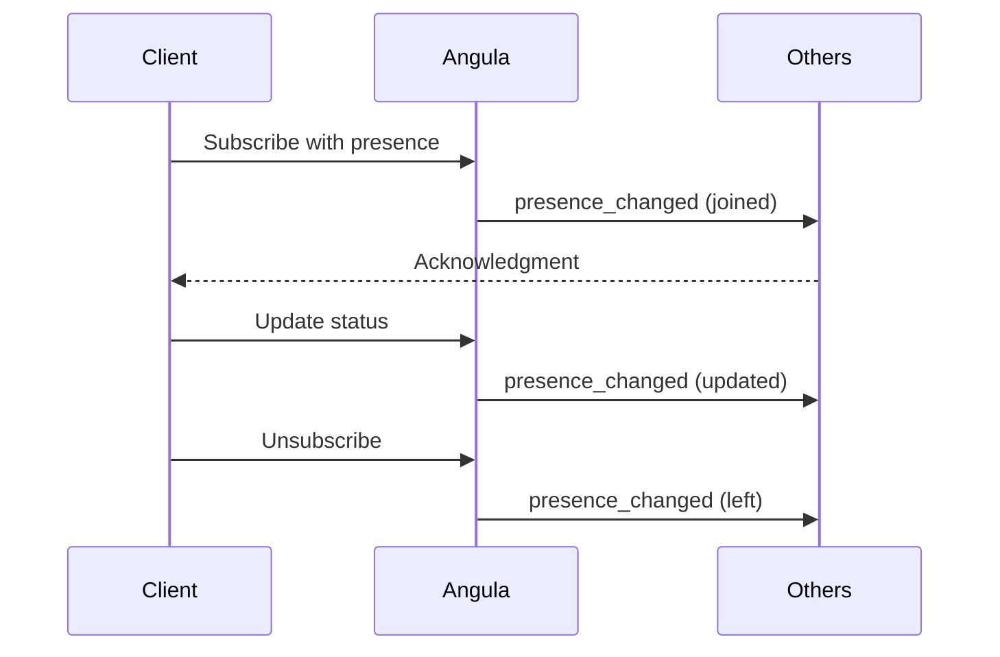

## Overview

Presence tracking in Pawabase allows you to monitor which users are connected to a channel and what their current status is. It broadcasts join and leave events in real time, enabling features like live user lists, typing indicators, and online status displays.

Presence tracking in Pawabase allows you to monitor which users are connected to a channel and what their current status is. It broadcasts join and leave events in real time, enabling features like live user lists, typing indicators, and online status displays.

Presence tracking in Pawabase allows you to monitor which users are connected to a channel and what their current status is. It broadcasts join and leave events in real time, enabling features like live user lists, typing indicators, and online status displays.

Presence tracking in Pawabase allows you to monitor which users are connected to a channel and what their current status is. It broadcasts join and leave events in real time, enabling features like live user lists, typing indicators, and online status displays.

Presence tracking in Pawabase allows you to monitor which users are connected to a channel and what their current status is. It broadcasts join and leave events in real time, enabling features like live user lists, typing indicators, and online status displays.

<CardGroup cols={3}>
  <Card title="Roster" icon="list">Who's subscribed to each channel.</Card>
  <Card title="Diffs" icon="arrows-split">Join and leave broadcasts.</Card>
  <Card title="Prune" icon="broom">Automatic cleanup of idle peers.</Card>
</CardGroup>

## How Presence Works

When a client connects to a channel, it can optionally send presence metadata including user ID, status, and custom metadata. This metadata is broadcast to all other subscribers of the channel.

When a client connects to a channel, it can optionally send presence metadata including user ID, status, and custom metadata. This metadata is broadcast to all other subscribers of the channel.

When a client connects to a channel, it can optionally send presence metadata including user ID, status, and custom metadata. This metadata is broadcast to all other subscribers of the channel.

When a client connects to a channel, it can optionally send presence metadata including user ID, status, and custom metadata. This metadata is broadcast to all other subscribers of the channel.

When a client connects to a channel, it can optionally send presence metadata including user ID, status, and custom metadata. This metadata is broadcast to all other subscribers of the channel.



## Setting Presence

To set presence when subscribing, include metadata in the subscribe message:
```json
{
  "type": "subscribe",
  "channel": "room:101",
  "payload": {
    "user_id": "user-123",
    "status": "online",
    "metadata": {
      "name": "Alice",
      "typing": false
    }
  }
}
```

## Presence State

| Field | Type | Description |
| --- | --- | --- |
| user_id | string | Unique identifier for the user |
| status | string | Online, offline, away, or custom status |
| metadata | object | Custom presence metadata |
| channel | string | The channel the user is present in |
| last_seen | number | Timestamp of last activity |

## Presence Events

Presence changes generate events that are broadcast to all subscribers of the channel. These events include join, leave, and update events.

Presence changes generate events that are broadcast to all subscribers of the channel. These events include join, leave, and update events.

Presence changes generate events that are broadcast to all subscribers of the channel. These events include join, leave, and update events.

Presence changes generate events that are broadcast to all subscribers of the channel. These events include join, leave, and update events.

Presence changes generate events that are broadcast to all subscribers of the channel. These events include join, leave, and update events.

### Join Event

When a new user joins a channel, all existing subscribers receive a `presence_changed` event with the new user's metadata.

When a new user joins a channel, all existing subscribers receive a `presence_changed` event with the new user's metadata.

When a new user joins a channel, all existing subscribers receive a `presence_changed` event with the new user's metadata.

When a new user joins a channel, all existing subscribers receive a `presence_changed` event with the new user's metadata.

When a new user joins a channel, all existing subscribers receive a `presence_changed` event with the new user's metadata.

### Leave Event

When a user leaves a channel, a presence leave event is broadcast, removing the user from the presence roster.

When a user leaves a channel, a presence leave event is broadcast, removing the user from the presence roster.

When a user leaves a channel, a presence leave event is broadcast, removing the user from the presence roster.

When a user leaves a channel, a presence leave event is broadcast, removing the user from the presence roster.

When a user leaves a channel, a presence leave event is broadcast, removing the user from the presence roster.

### Update Event

When a user updates their presence metadata, an update event is broadcast with the new metadata.

When a user updates their presence metadata, an update event is broadcast with the new metadata.

When a user updates their presence metadata, an update event is broadcast with the new metadata.

When a user updates their presence metadata, an update event is broadcast with the new metadata.

When a user updates their presence metadata, an update event is broadcast with the new metadata.

## Pruning

Presence data is automatically pruned when clients disconnect. The system cleans up stale presence entries to keep the roster accurate.

Presence data is automatically pruned when clients disconnect. The system cleans up stale presence entries to keep the roster accurate.

Presence data is automatically pruned when clients disconnect. The system cleans up stale presence entries to keep the roster accurate.

Presence data is automatically pruned when clients disconnect. The system cleans up stale presence entries to keep the roster accurate.

Presence data is automatically pruned when clients disconnect. The system cleans up stale presence entries to keep the roster accurate.

<Tip>Configure idle timeout to control how quickly disconnected users are removed from the presence roster.</Tip>

## Querying Presence

You can query the current presence state for any channel to get a list of all connected users and their metadata.
The presence query returns a list of all users currently present in the channel, along with their metadata and status.

The presence query returns a list of all users currently present in the channel, along with their metadata and status.

The presence query returns a list of all users currently present in the channel, along with their metadata and status.

<CardGroup cols={2}>
  <Card title="Connecting" icon="plug" href="/realtime/connecting">Connection guide.</Card>
  <Card title="Protocol" icon="code" href="/realtime/protocol">Message protocol.</Card>
  <Card title="Overview" icon="signal" href="/realtime/overview">Architecture overview.</Card>
</CardGroup>
