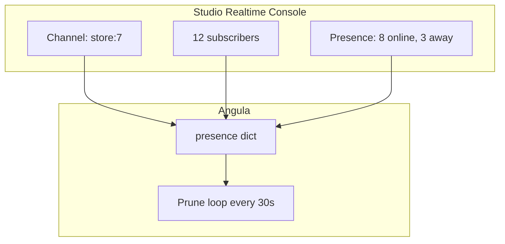

**Presence** in Pawabase realtime tracks who's currently subscribed to a channel and their status. Every time a client subscribes to a channel with presence metadata, they're added to the channel's presence roster. When they disconnect, they're removed and a presence diff is broadcast to all remaining subscribers.

<CardGroup cols={3}>
  <Card title="Roster" icon="list">Who's subscribed to each channel.</Card>
  <Card title="Diffs" icon="arrows-split">Join and leave broadcasts.</Card>
  <Card title="Prune" icon="broom">Automatic cleanup of idle peers.</Card>
</CardGroup>

## How presence works

Presence is stored per room (project/environment/channel). Each entry maps a peer ID to presence metadata including the user ID, status, and connection timestamp.

```python services/angula/app/realtime.py
self.presence: dict[str, dict[str, dict[str, Any]]] = {}
```

When a client subscribes with presence metadata, the `track()` method registers them:

```python
async def track(self, connection, channel, meta):
    room = room_name(connection.project, connection.env, channel)
    entry = {
        "presence_ref": str(connection.peer.id),
        "user_id": connection.user_id,
        "meta": meta,
        "online_at": datetime.now(UTC).isoformat(),
    }
    self.presence.setdefault(room, {})[str(connection.peer.id)] = entry
    await self.send_presence(connection.project, connection.env, channel, joins=[entry])
    return entry
```

The presence diff is broadcast to all peers on the room via the fanout channel:

```json
{
  "type": "presence_diff",
  "channel": "store:7",
  "joins": [{"presence_ref": "peer:abc", "user_id": "8", "meta": {}, "online_at": "..."}],
  "leaves": []
}
```

## Status and metadata

Each presence entry includes a `status` field that the client can set to any string. Common values are `"online"`, `"away"`, and `"do-not-disturb"`. The `meta` object carries arbitrary client-provided data (display name, avatar URL, custom status text).

```json
{
  "user_id": "8",
  "status": "online",
  "meta": {"name": "Ada Lovelace", "avatar": "https://...", "role": "admin"},
  "online_at": "2026-09-28T10:00:00+00:00"
}
```

Clients update their presence by sending an `update_presence` message with new `status` and `meta` values.

## Join and leave broadcasts

When a peer joins a channel with presence enabled, all existing subscribers receive a `presence_diff` with the new peer in the `joins` array. When a peer disconnects, all subscribers receive a `presence_diff` with the peer in the `leaves` array.

```python
async def untrack(self, connection, channel):
    room = room_name(connection.project, connection.env, channel)
    entry = self.presence.get(room, {}).pop(str(connection.peer.id), None)
    if room in self.presence and not self.presence[room]:
        del self.presence[room]
    if entry is not None:
        await self.send_presence(connection.project, connection.env, channel, leaves=[entry])
```

Presence is automatically disabled per-channel via the `presence` flag in channel rules. If a channel rule sets `presence: false`, the `track()` call will be refused with a `PermissionError`.

## Querying presence

You can inspect the current presence roster for a channel from the `Realtime` instance:

```python
def presence_members(self, project, env, channel):
    return list(self.presence.get(room_name(project, env, channel), {}).values())
```

From the outside, you can also query presence through the Angula summary endpoint:

```json
{
  "instance": "a1b2c3d4e5f6",
  "connections": 42,
  "channels": 18,
  "subscriptions": 312,
  "presence": {
    "store:7": 12,
    "chat:lobby": 34,
    "user:8": 1
  }
}
```

## The prune loop

A background task runs every `PRUNE_SECONDS` (30 seconds) and disconnects peers that `sillo-wire`'s hub has aged out. This ensures that disconnected clients are removed from presence rosters and don't accumulate stale state:

```python services/angula/app/bootstrap.py
async def prune() -> None:
    while True:
        await asyncio.sleep(PRUNE_SECONDS)
        for peer in await realtime.hub.prune():
            connection = realtime.connections.get(str(peer.id))
            if connection is not None:
                await realtime.disconnect(connection)
```

The `sillo-wire` hub decides which peers are idle based on `idle_timeout` (default 300 seconds). A peer is considered idle if no traffic has been received within that window.

## Presence in the dashboard

The `Realtime.summary()` method exposes presence counts per room, which Studio's Realtime console displays:



## Next

<CardGroup cols={2}>
  <Card title="Connecting" icon="plug" href="/realtime/connecting">How clients connect to Angula.</Card>
  <Card title="Protocol" icon="code" href="/realtime/protocol">The WebSocket message protocol.</Card>
  <Card title="Channel rules" icon="shield-check" href="/realtime/channel-rules">Subscribe and publish policies.</Card>
  <Card title="Overview" icon="signal" href="/realtime/overview">Realtime architecture and concepts.</Card>
</CardGroup>

