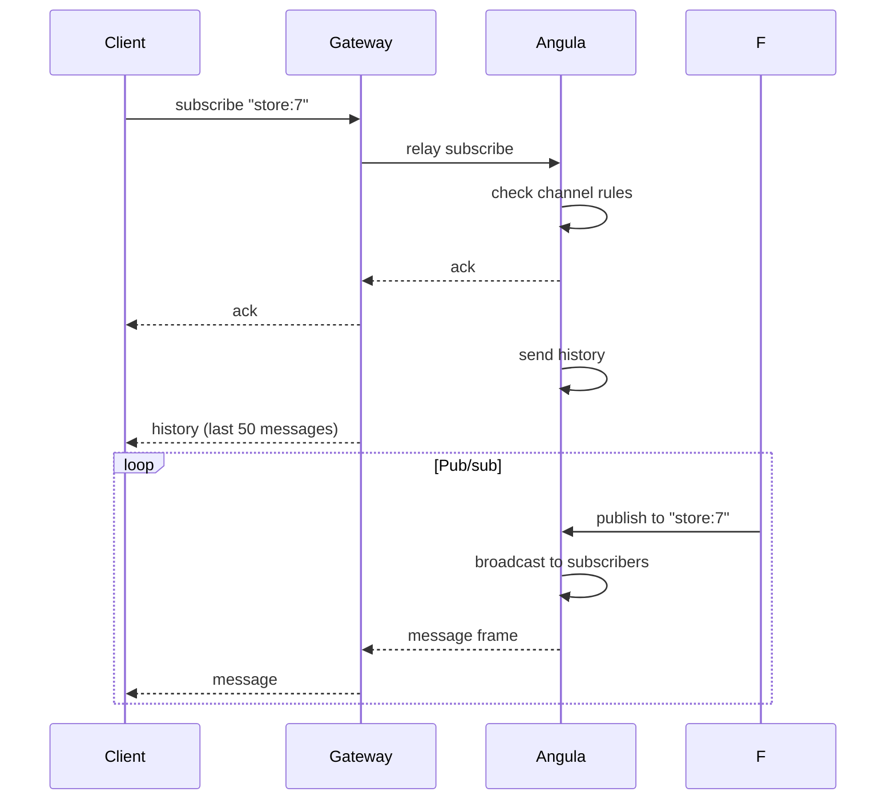

All realtime communication between clients and Angula happens over a single WebSocket connection using a JSON message protocol. Every message has a `type` field that determines how it's processed. This page documents every message type, its fields, and example wire payloads. The protocol is identical across web, mobile, and server clients.

## Message structure

Every protocol message is a JSON object with a `type` field:

```json
{"type": "<message_type>", ...}
```

Messages are sent as UTF-8 JSON text frames. The gateway relays them verbatim between client and server — it never parses, transforms, or interprets the message body.

## Subscribe

A client subscribes to a channel by sending a `subscribe` message:

```json
{"type": "subscribe", "channel": "store:7"}
```

| Field | Type | Required | Description |
| --- | --- | --- | --- |
| `channel` | `string` | yes | The channel name (e.g. `store:7`) |
| `presence` | `object` | no | Presence metadata to register |
| `history` | `integer` | no | Number of history messages to request |

On success, Angula responds with an `ack`:

```json
{"type": "ack", "channel": "store:7"}
```

If the channel is private and the client lacks permission, Angula responds with a `denied` message:

```json
{"type": "denied", "channel": "store:7", "reason": "this channel belongs to someone else"}
```

## Publish

A client publishes a message to a channel with a `publish` message:

```json
{"type": "publish", "channel": "store:7", "event": "order.paid", "payload": {"order_id": 42}}
```

| Field | Type | Required | Description |
| --- | --- | --- | --- |
| `channel` | `string` | yes | The channel to publish to |
| `event` | `string` | yes | The event name |
| `payload` | `any` | no | The event payload |

Angula validates the publish against the channel's `publish_policy` and the `allow_client_publish` setting. If the client is not permitted to publish, the publish is refused and a `denied` message is returned.

On success, all subscribers (including the publisher) receive a `message`:

```json
{
  "type": "message",
  "id": "abc123def456",
  "channel": "store:7",
  "event": "order.paid",
  "payload": {"order_id": 42},
  "from": "user:8",
  "sent_at": "2026-09-28T10:00:00+00:00"
}
```

## Presence

When a client subscribes with `presence` metadata, Angula broadcasts a `presence_diff` to all subscribers:

```json
{
  "type": "presence_diff",
  "channel": "store:7",
  "joins": [{"user_id": "8", "status": "online", "meta": {}}],
  "leaves": []
}
```

When a peer disconnects, a corresponding presence diff is broadcast with the leaving user in the `leaves` array.

## History

A client can request the channel's replayable history by including `history: true` in a subscribe message, or by sending a dedicated `history` request:

```json
{"type": "history", "channel": "store:7", "limit": 50}
```

Angula responds with a `history` message containing the most recent messages:

```json
{
  "type": "history",
  "channel": "store:7",
  "messages": [
    {"event": "order.paid", "payload": {...}, "seq": 1},
    {"event": "inventory.low", "payload": {...}, "seq": 2}
  ]
}
```

Messages are returned in chronological order (oldest first) and include a `seq` field for ordering.

## Auth

If the client needs to refresh its authentication mid-connection (e.g., after a token rotation), it sends an `auth` message:

```json
{"type": "auth", "token": "eyJhbGciOiJIUzI1NiIs..."}
```

Angula verifies the token against Akountz, resolves a new `PlatformContext`, and responds:

```json
{"type": "auth_ack", "project": "acme", "env": "production", "role": "anon"}
```

If verification fails:

```json
{"type": "auth_denied", "reason": "token expired"}
```

## Error messages

Any message can elicit an `error` response if the request is malformed or the operation fails:

```json
{"type": "error", "code": "invalid_channel", "message": "channel name must not contain '/'"}
```

| Code | Description |
| --- | --- |
| `invalid_channel` | Channel name is empty, too long, or contains `/` |
| `channel_not_found` | The channel doesn't exist |
| `permission_denied` | The client lacks the required permission |
| `rate_limited` | Too many messages per second |
| `upstream_unavailable` | Angula is not reachable |

## Message flow diagram



## Performance notes

- Message payloads are limited to `max_message_bytes` (default 64 KB). Larger messages are dropped.
- Per-peer send queues prevent one slow client from stalling a channel.
- Angula assigns each message a unique `id` (UUID4) for de-duplication and tracing.
- The `sent_at` timestamp is ISO-8601 UTC, generated at publish time.

## Next

<CardGroup cols={2}>
  <Card title="Connecting" icon="plug" href="/realtime/connecting">How clients connect to Angula.</Card>
  <Card title="Channel rules" icon="shield-check" href="/realtime/channel-rules">Subscribe and publish policies.</Card>
  <Card title="Presence" icon="account-multiple" href="/realtime/presence">Tracking who's online.</Card>
  <Card title="History" icon="clock-rotate-left" href="/realtime/history">Replayable message history.</Card>
</CardGroup>
