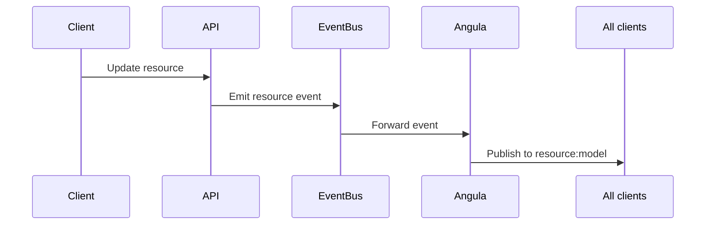

## Overview

Resource changes are automatically broadcast to realtime channels. When a resource is created, updated, or deleted, a message is published to the corresponding `resource:&lt;name&gt;` channel.

Resource changes are automatically broadcast to realtime channels. When a resource is created, updated, or deleted, a message is published to the corresponding `resource:&lt;name&gt;` channel.

Resource changes are automatically broadcast to realtime channels. When a resource is created, updated, or deleted, a message is published to the corresponding `resource:&lt;name&gt;` channel.

Resource changes are automatically broadcast to realtime channels. When a resource is created, updated, or deleted, a message is published to the corresponding `resource:&lt;name&gt;` channel.

Resource changes are automatically broadcast to realtime channels. When a resource is created, updated, or deleted, a message is published to the corresponding `resource:&lt;name&gt;` channel.

<CardGroup cols={2}>
  <Card title="Auto-broadcast" icon="bolt">Changes emit to `resource:&lt;name&gt;` channels.</Card>
  <Card title="Event-driven" icon="link">Powered by the platform event bus.</Card>
</CardGroup>

## How Resource Changes Work

Every resource in Pawabase can have realtime broadcasting enabled. When the `realtime: true` flag is set on a resource definition, all create, update, and delete operations automatically emit events to the corresponding channel.

Every resource in Pawabase can have realtime broadcasting enabled. When the `realtime: true` flag is set on a resource definition, all create, update, and delete operations automatically emit events to the corresponding channel.

Every resource in Pawabase can have realtime broadcasting enabled. When the `realtime: true` flag is set on a resource definition, all create, update, and delete operations automatically emit events to the corresponding channel.

Every resource in Pawabase can have realtime broadcasting enabled. When the `realtime: true` flag is set on a resource definition, all create, update, and delete operations automatically emit events to the corresponding channel.

Every resource in Pawabase can have realtime broadcasting enabled. When the `realtime: true` flag is set on a resource definition, all create, update, and delete operations automatically emit events to the corresponding channel.



## Event Types

| Event | Trigger | Channel |
| --- | --- | --- |
| created | Resource created | resource:&lt;name&gt; |
| updated | Resource updated | resource:&lt;name&gt; |
| deleted | Resource deleted | resource:&lt;name&gt; |

## Event Payload

```json
{
  "event": "updated",
  "resource": "user",
  "data": {
    "id": "user-123",
    "name": "Alice"
  },
  "timestamp": 1699000000
}
```

## Subscribing to Resource Changes

To receive real-time updates for a resource, subscribe to the corresponding `resource:&lt;name&gt;` channel:
```json
{
  "type": "subscribe",
  "channel": "resource:user"}
```

## Filtering Events

You can filter resource events using subscribe policies. The `$event` context variable provides access to the event type and payload.

You can filter resource events using subscribe policies. The `$event` context variable provides access to the event type and payload.

You can filter resource events using subscribe policies. The `$event` context variable provides access to the event type and payload.

You can filter resource events using subscribe policies. The `$event` context variable provides access to the event type and payload.

You can filter resource events using subscribe policies. The `$event` context variable provides access to the event type and payload.

```json
{
  "subscribe_policy": {
    "eq": ["$event.type", "updated"]
  }
}
```

## Integration with Flows

Resource changes can trigger flows. When a resource event is emitted, it can be consumed by flow blocks to perform additional processing.

Resource changes can trigger flows. When a resource event is emitted, it can be consumed by flow blocks to perform additional processing.

Resource changes can trigger flows. When a resource event is emitted, it can be consumed by flow blocks to perform additional processing.

Resource changes can trigger flows. When a resource event is emitted, it can be consumed by flow blocks to perform additional processing.

Resource changes can trigger flows. When a resource event is emitted, it can be consumed by flow blocks to perform additional processing.

<CardGroup cols={2}>
  <Card title="Connecting" icon="plug" href="/realtime/connecting">Connection guide.</Card>
  <Card title="Server Publishing" icon="server" href="/realtime/server-publishing">Server-side publishing.</Card>
</CardGroup>
