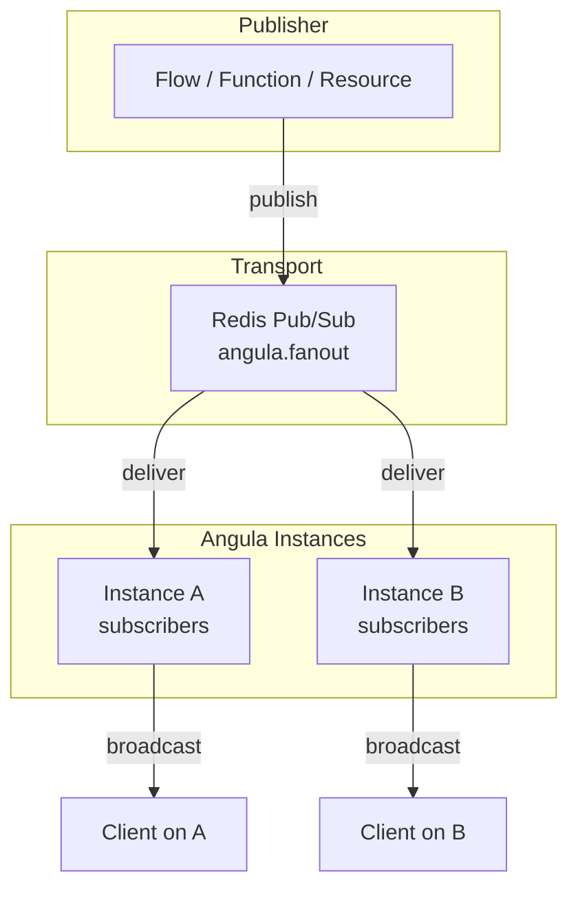

**Server publishing** refers to sending messages to realtime channels from the backend — from flows, functions, resources, and scheduled jobs. Unlike client-side publishing (where the gateway and Angula enforce channel rules), server publishing runs with service credentials that bypass channel policy entirely. This makes it the primary mechanism for broadcasting data changes to connected clients.

<CardGroup cols={3}>
  <Card title="Flows" icon="flowchart">Use the `realtime.publish` block.</Card>
  <Card title="Functions" icon="code">Call `runtime.publish()` in Python.</Card>
  <Card title="Resources" icon="database">Auto-broadcast on `realtime: true`.</Card>
</CardGroup>

## The realtime.publish block

In a flow, the `realtime.publish` block sends a message to a channel:

```json
{
  "id": "notify_store",
  "data": {
    "block": "realtime.publish",
    "config": {
      "channel": "store:7",
      "event": "order.paid",
      "payload": {"order_id": "{{ steps.order.output.id }}"}
    }
  }
}
```

| Config Field | Type | Required | Description |
| --- | --- | --- | --- |
| `channel` | `string` | yes | The channel to publish to |
| `event` | `string` | no | The event name (default `"message"`) |
| `payload` | `any` | no | The event payload |

The block returns `{"id": "...", "channel": "...", "event": "..."}` as output. It runs with the flow's service credentials, so it bypasses channel subscribe and publish policies.

Under the hood, the block calls `run.runtime.publish()`, which delegates to Angula's `publish` method:

```python services/angula/app/realtime.py
async def publish(self, project, env, channel, event, payload, *, sender=None):
    message = {
        "type": "message",
        "id": uuid.uuid4().hex,
        "channel": channel,
        "event": event,
        "payload": payload,
        "from": sender,
        "sent_at": datetime.now(UTC).isoformat(),
    }
    self.stats["published"] += 1
    await self.emitter.emit_async(
        FANOUT_CHANNEL,
        {"room": room_name(project, env, channel), "message": message, "origin": INSTANCE},
    )
    return {"id": message["id"], "channel": channel, "event": event}
```

## Resource broadcasts

Resources configured with `realtime: true` automatically broadcast changes to a `resource:<name>` channel whenever a record is created, updated, or deleted. This happens in the API process, inline with the write, so there's no asynchronous delay.

```python
# In the resource write path:
if resource.realtime:
    await platform.bus.emit_async(FANOUT_CHANNEL, {
        "room": room_name(project, env, f"resource:{resource.name}"),
        "message": {
            "type": "message",
            "event": operation,  # "created", "updated", "deleted"
            "payload": {
                "operation": operation,
                "record": record_data,
                "record_id": record_id,
            },
            "from": "service",
            "sent_at": datetime.now(UTC).isoformat(),
        },
        "origin": INSTANCE,
    })
```

The channel name is `resource:<resource_name>`, so all clients subscribed to `resource:invoices` receive every change to the invoices resource.

## Functions publishing to channels

Python functions running on the worker can publish to channels using the `Runtime` interface:

```python
async def my_function(input):
    await runtime.publish("store:7", "order.paid", {"order_id": input["order_id"]})
```

This calls the same `Realtime.publish()` method as flows, using the service credential. The function runs on the worker, which has access to the `Platform` object and its Angula `ServiceClient`.

## The fanout transport

All publications go through Sillo's Redis `EventEmitter` on the `angula.fanout` channel. Every Angula instance subscribes to this channel and receives every publication. When an instance receives a publication, it delivers the message to its own local subscribers via `sillo-wire`'s hub.



Without Redis (a single instance or development setup), the emitter is in-process. Publications still work but only reach subscribers on that same instance.

## Publish permissions

Service credentials always pass channel policy. However, client publishing is subject to the `allow_client_publish` setting and the channel's `publish_policy`. When a client attempts to publish:

1. Angula checks `allow_client_publish` on the `ChannelConfig`
2. If false, the publish is refused
3. If true, the `publish_policy` JSON condition is evaluated
4. If the condition returns false, a `PermissionError` is raised

```python async def authorize(self, project, env, channel, action, *, auth, credential, payload=None):
    ...
    if credential.get("is_service"):
        return rule  # bypass policy
    if not rule.permits(channel, auth):
        raise PermissionError("this channel belongs to someone else")
    if action == "publish" and not config.allow_client_publish:
        raise PermissionError("clients may not publish in this environment")
```

## Ordering and delivery guarantees

Messages published to a channel are delivered to all subscribers on that channel. The delivery is best-effort within an instance:

- Messages are broadcast in publish order
- Per-peer queues are bounded; a slow consumer may drop messages
- There are no delivery receipts — disconnected peers simply miss messages
- Replay history covers reconnects, not guaranteed delivery

## Next

<CardGroup cols={2}>
  <Card title="Connecting" icon="plug" href="/realtime/connecting">How clients connect to Angula.</Card>
  <Card title="Protocol" icon="code" href="/realtime/protocol">The WebSocket message protocol.</Card>
  <Card title="Channel rules" icon="shield-check" href="/realtime/channel-rules">Subscribe and publish policies.</Card>
  <Card title="Overview" icon="signal" href="/realtime/overview">Realtime architecture and concepts.</Card>
</CardGroup>

