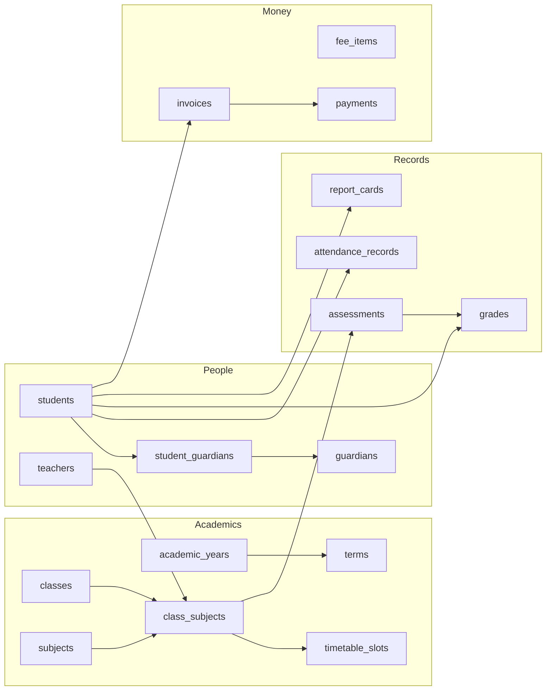

This tutorial builds the backend for **Brightfield Academy**: admissions, classes and timetables, attendance registers, gradebooks, computed report cards, fees and payments, a library, welfare incidents, announcements and a calendar, with every person seeing only what they should.

It's deliberately big. Toy examples hide the questions real projects raise: *how do parents see only their children? how do I compute a class position? what stops a payment exceeding the balance?* Every answer here is a Pawabase feature doing real work.

  23 resources
  7 roles
  11 policies
  19 flows
  9 custom routes
  8 mail templates

## What you'll build

<CardGroup cols={2}>
  <Card title="1. Data model" icon="database" href="/school/data-model">Years, terms, classes, students, guardians, subjects, assignments, timetables, grades, invoices, the library.</Card>
  <Card title="2. Access control" icon="shield-check" href="/school/access-control">Roles, reusable policies, family access with array membership, published-only report cards.</Card>
  <Card title="3. Workflows" icon="git-branch" href="/school/workflows">Admissions, registers with absence alerts, payments that settle invoices, incident escalation.</Card>
  <Card title="4. Report cards" icon="award" href="/school/report-cards">Weighted scores, WAEC grades and class positions with window functions, in a flow.</Card>
  <Card title="5. The portal" icon="monitor" href="/school/frontend">A React app for staff, parents and students with just a publishable key.</Card>
  <Card title="6. Going live" icon="rocket" href="/school/going-live">Staging, production, SMTP, S3, schedules and monitoring.</Card>
</CardGroup>

## Who uses it

| Role | Can |
| --- | --- |
| `admin`, `principal` | Everything; publish report cards; admit students |
| `teacher` | Registers, gradebook, assessments, report-card comments, welfare reports, announcements |
| `bursar` | Invoices, payments, billing |
| `librarian` | Catalogue, loans, returns |
| `guardian` | Their own children, published report cards, their invoices |
| `student` | Their own results and library loans |

## The shape of the backend

<Info>
Everything here is built in Studio's development environment. You can click through it by hand, or apply it from a script through the Platform API as shown in [definitions as data](/concepts/definitions-as-data). The result is identical and fully editable in Studio either way.
</Info>

## Principles you'll see applied

- **No logic in the client.** Validation, ownership, money arithmetic and notifications live in the backend, so the web app, a mobile app and a server integration all behave the same.
- **Access is a policy, never a filter in the UI.** The portal hides screens for convenience; the API refuses regardless.
- **Every workflow is observable.** Admissions, payments and alerts are flows with traces you can inspect run by run.
- **No custom server code.** Report cards, invoicing and admission numbers are flows using SQL and blocks, with no Python deployed.
