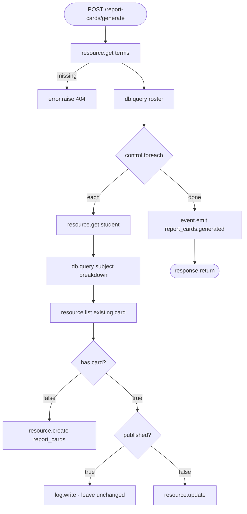

Report cards are the hardest computation in the school, which makes them a good test of how far you can get without writing server code. The answer: all the way.

## The rules

- A subject's score is the **weighted percentage** across that term's assessments: Σ(score / max × weight) / Σ(weight) × 100.
- The overall average is the mean of subject scores.
- Grades follow the WAEC scale: **A1** ≥ 75, **B2** 70, **B3** 65, **C4** 60, **C5** 55, **C6** 50, **D7** 45, **E8** 40, **F9** below.
- Positions use **competition ranking**: two students on 81.5 are both 2nd; the next is 4th. Both for the class and per subject.
- Attendance rate = (present + late) / marked, within the term's dates.
- A **published** card is final and never recomputed.

## One query for the class

The `roster` step runs a single `db.query` with common table expressions and window functions (portable across SQLite and Postgres):

```sql
WITH subject_scores AS (
  SELECT g.student_id, cs.subject_id,
         SUM(g.score * 1.0 / a.max_score * a.weight) * 100.0 / SUM(a.weight) AS pct
  FROM grades g
  JOIN assessments a     ON a.id = g.assessment_id
  JOIN class_subjects cs ON cs.id = a.class_subject_id
  WHERE cs.class_id = ? AND a.term_id = ?
  GROUP BY g.student_id, cs.subject_id),
averages AS (SELECT student_id, AVG(pct) AS average FROM subject_scores GROUP BY student_id),
attendance AS (
  SELECT student_id,
         100.0 * SUM(CASE WHEN status IN ('present', 'late') THEN 1 ELSE 0 END) / COUNT(*) AS rate
  FROM attendance_records WHERE class_id = ? AND date >= ? AND date <= ?
  GROUP BY student_id)
SELECT s.id AS student_id,
       ROUND(CAST(COALESCE(av.average, 0) AS NUMERIC), 2) AS average,
       CASE WHEN COALESCE(av.average, 0) >= 75 THEN 'A1' /* … */ ELSE 'F9' END AS overall_grade,
       RANK() OVER (ORDER BY COALESCE(av.average, 0) DESC) AS position,
       COUNT(*) OVER () AS class_size,
       ROUND(CAST(att.rate AS NUMERIC), 1) AS attendance_rate
FROM students s
LEFT JOIN averages av   ON av.student_id = s.id
LEFT JOIN attendance att ON att.student_id = s.id
WHERE s.class_id = ? AND s.status = 'active'
```

`RANK()` gives competition ranking for free. `COUNT(*) OVER ()` is the class size on every row.

<Note>
`db.query` only runs a **single read-only statement** (`SELECT`, `WITH`, `EXPLAIN`…). Writes go through resource blocks or `db.transaction`, so events, cache invalidation and realtime still happen.
</Note>

## The flow



The per-student breakdown uses a partitioned window for **subject positions**:

```sql
ranked AS (SELECT subject_scores.*,
                  RANK() OVER (PARTITION BY subject_id ORDER BY pct DESC) AS position
           FROM subject_scores)
```

Inside the loop, `{{ item }}` is the current roster row and `{{ steps.breakdown.output }}` the subjects, which together build the card:

```json
{
  "student_id": "{{ item.student_id }}", "average": "{{ item.average }}", "position": "{{ item.position }}",
  "class_size": "{{ item.class_size }}", "attendance_rate": "{{ item.attendance_rate }}",
  "subjects": { "overall_grade": "{{ item.overall_grade }}", "breakdown": "{{ steps.breakdown.output }}" },
  "guardian_user_ids": "{{ steps.student.output.guardian_user_ids }}"
}
```

## Publishing

`POST /report-cards/{id}/publish` is guarded by `report_publisher` (permission `reports.publish`). It refuses a second publish with `409`, stamps `published_at`, stores the principal's comment and emits `report_card.published`, which triggers the email to guardians. From that moment `report_access` lets the family read it.

## Why not a function?

A Python function would work too, and the first version of this project used one. Moving it into a flow brought three wins: the logic is **visible and editable in Studio**, every run has a **trace**, and there's **nothing to deploy**. Use a [function](/code/functions) when logic needs libraries, loops over external APIs, or maths SQL can't express. [Flows or code? →](/code/flows-or-code)
