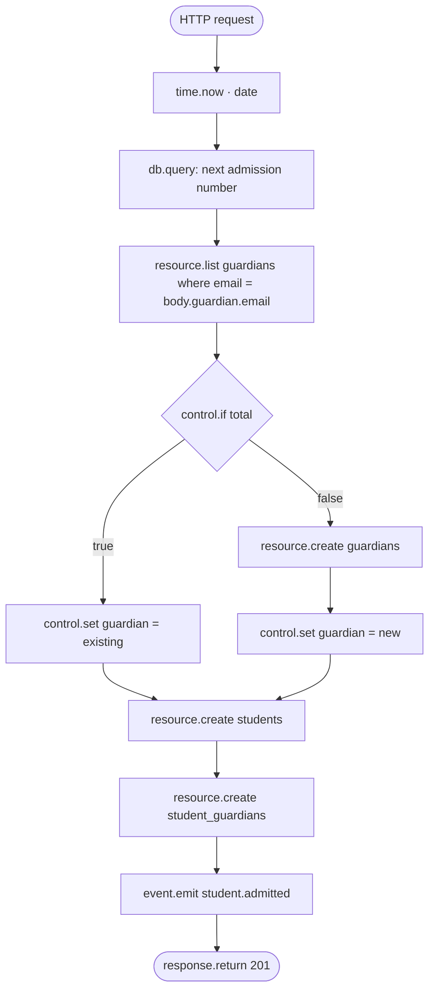

The school's logic lives in **flows**: visual graphs of blocks, edited and traced in Studio. This page walks through the most instructive ones.

## Admissions: one call, four writes, one event

`POST /rest/v1/admissions` (policy `school_admin`) is a [custom route](/data/custom-routes) handled by the `admit_student` flow:



The admission number is computed in portable SQL, with no code:

```sql
SELECT 'BFA-' || SUBSTR(?, 1, 4) || '-' ||
       SUBSTR('0000' || CAST(COUNT(*) + 1 AS TEXT), LENGTH(CAST(COUNT(*) + 1 AS TEXT)) + 1, 4) AS admission_no
FROM students WHERE admission_no LIKE 'BFA-' || SUBSTR(?, 1, 4) || '-%'
```

`student.admitted` then triggers two independent flows: `welcome_family` (email) and `issue_term_invoice`. The admission response doesn't wait for either.

## Billing from the fee schedule

`issue_term_invoice` has **two triggers**, so the same logic runs on admission (event) and on demand (`POST /finance/invoices/issue`). Each trigger normalises its input into `vars.student_id`, then:

1. load the student and the current term;
2. stop if an invoice for this student and term exists (**idempotent**, safe to retry);
3. `db.query` the mandatory fees for the year where `grade_level` is null or the student's class level;
4. sum them and generate the invoice number in SQL;
5. `resource.create` the invoice with line items, `balance = amount`, and the student's `guardian_user_ids` copied so families can read it.

## Class registers with absence alerts

`POST /attendance/register` takes a whole class for a day (the `BulkAttendance` schema) and a `control.foreach` writes each mark. Separately, `absence_alert` is triggered by `trigger.resource` on `attendance_records` **created**:

```json
{ "block": "control.if", "config": { "condition": { "eq": ["$input.event.payload.record.status", "absent"] } } }
```

On `true` it queries the student's guardians and sends the `absence_alert` template to each. The register endpoint stays fast; alerting happens on the worker.

## Payments that can't go wrong

`POST /finance/payments` (`finance_staff`, `PaymentInput` schema) runs `record_payment`:

| Guard | Block | Response |
| --- | --- | --- |
| Invoice exists | `resource.get` → `missing` | `404 invoice_not_found` |
| Invoice not void or paid | `control.if` `in [void, paid]` | `409 invoice_closed` |
| Amount ≤ balance | `control.if` `gt [amount, balance]` | `422 overpayment` |

Then `math.calculate` computes the new paid total and balance, the payment is created, the status becomes `paid` or `partially_paid`, the invoice is updated and `invoice.payment_received` is emitted. The `payment_receipt` flow emails every guardian and publishes to the `finance` channel for the bursary's live dashboard.

## Serious incidents escalate themselves

`incident_escalation` watches `discipline_incidents` created. For `high` or `critical` severity it publishes to `staff-alerts`, emails the guardians, marks `guardian_notified = true` and logs a warning. Teachers file reports; the platform does the follow-through.

## Time-based work

| Flow | Trigger | Does |
| --- | --- | --- |
| `mark_overdue_invoices` | `trigger.schedule` `0 1 * * *` | Invoices past due with a balance → `overdue` |
| `library_overdue_sweep` | `0 7 * * *` | Overdue loans flagged, borrowers emailed |
| `fee_reminders` | `0 8 1 * *` + manual | Email every family with a balance |

Flows with a `trigger.schedule` node schedule themselves; there's no separate schedule definition to keep in sync. [Schedules →](/jobs/schedules)

## Payment gateways

An [inbound hook](/webhooks/inbound) `payment-gateway` (HMAC-verified) triggers `payment_gateway`, which finds the invoice by number and **queues** `record_payment` with the charge, so gateway payments pass through exactly the same guards as the bursary's.

<Tip>
Open **Flows → a flow → Run** in Studio to execute it with test input and see each block's output. Every production run is recorded with its trace under **Events & runs**.
</Tip>
